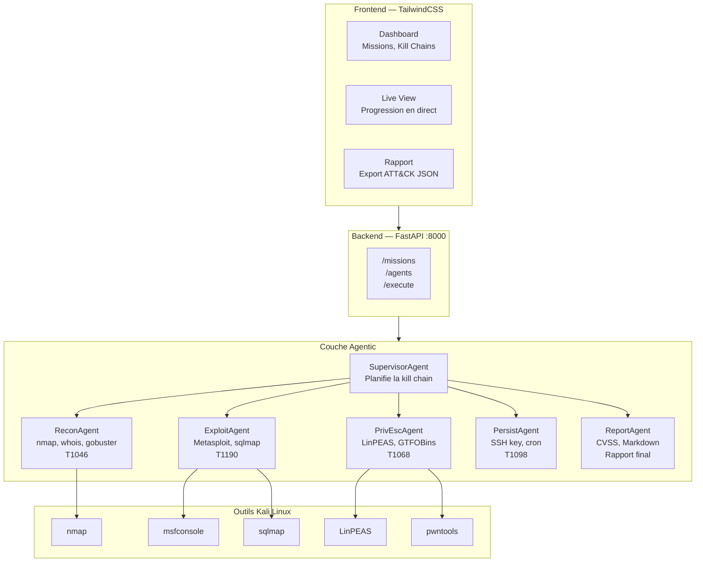

# Hors-Série : KillChainAgent — Orchestrateur d'attaque agentic

---

## Objectifs pédagogiques

- Appliquer les principes de l'architecture agentic (cours [agentic-developer-craftsmanship](https://github.com/yugmerabtene/agentic-developer-craftsmanship))
- Construire un orchestrateur d'attaque multi-agent avec Python, FastAPI et TailwindCSS
- Orchestrer les outils Kali Linux (nmap, Metasploit, sqlmap, LinPEAS) via des agents spécialisés
- Automatiser une kill chain ATT&CK complète de A à Z
- Travailler en méthodologie Agile / Scrum / Sprint

---

## Introduction

Vous avez passé 5 jours à exécuter manuellement chaque étape d'une kill chain : nmap → Metasploit → sqlmap → reverse shell → persistance → rapport. Et si un **orchestrateur agentic** faisait tout cela automatiquement, en parallèle, en documentant chaque étape dans ATT&CK ?

C'est exactement ce que vous allez construire dans ce hors-série.

Ce projet sert de **fil rouge** sur les 5 jours (20-30 min par jour) et s'appuie sur le cours [**agentic-developer-craftsmanship**](https://github.com/yugmerabtene/agentic-developer-craftsmanship) (Chapitres 4 et 6 : Architecture Agent et Multi-Agent Orchestration).

---

## Architecture du projet



**Fig 16** — Architecture KillChainAgent : 4 couches — Frontend TailwindCSS, API FastAPI, couche agentic (Supervisor + 5 agents spécialisés), outils Kali Linux. Le Supervisor orchestre les agents, chaque agent pilote ses outils.

### Les 6 agents

| Agent | Rôle | Outils Kali | Input | Output |
|---|---|---|---|---|
| **SupervisorAgent** | Planifie la kill chain | — | Cible (IP) | Plan JSON |
| **ReconAgent** | Scan réseau, énumération | nmap, gobuster, whois | IP cible | Services, ports, versions |
| **ExploitAgent** | Exploitation des vulnérabilités | Metasploit, sqlmap | Vulnérabilités | Session shell |
| **PrivEscAgent** | Élévation de privilèges | LinPEAS, pwn, GTFOBins | Shell user | Root / SYSTEM |
| **PersistAgent** | Persistance et C2 | SSH key, cron, netcat | Shell root | Canal persistant |
| **ReportAgent**    | Génération rapport | Python, ATT&CK Navigator | Kill chain | Rapport Markdown/JSON |
| **DefenseAgent** *(Sprint 6)* | Contre-mesures automatiques | UFW, fail2ban, apt, PDO | Vulnérabilités découvertes | Cibles corrigées |

---

## Prérequis

### Référence au cours agentic-developer-craftsmanship

Ce hors-série suppose que vous avez compris :

- **Chapitre 4 — Architecture Agent** : la boucle agent (perception → raisonnement → action), différence LLM vs Agent
- **Chapitre 6 — Multi-Agent Orchestration** : patterns de communication (séquentiel, fan-out, supervisor), spécialisation

Si ce n'est pas fait, lisez au minimum :
- [CHAPITRE-04-architecture-agent.md](https://github.com/yugmerabtene/agentic-developer-craftsmanship/blob/main/CHAPITRE-04-architecture-agent.md)
- [CHAPITRE-06-multi-agent.md](https://github.com/yugmerabtene/agentic-developer-craftsmanship/blob/main/CHAPITRE-06-multi-agent.md)

### Installation

```bash
# Cloner le dépôt du cours (déjà fait en J1)
cd ~/cours-hacking/repo/hors-serie

# Environnement Python (isole les dépendances du projet pour ne pas polluer le système)
# python3 -m venv .venv = crée un environnement virtuel Python dans le dossier .venv/
# source .venv/bin/activate = active l'environnement virtuel (modifie le PATH pour utiliser le Python local)
python3 -m venv .venv
source .venv/bin/activate
pip install fastapi uvicorn jinja2 httpx

# Vérifier les outils Kali disponibles
which nmap && which msfconsole && which sqlmap
```

---

## Méthodologie Agile / Scrum

### Vision produit

**KillChainAgent** est un orchestrateur agentic qui automatise une kill chain ATT&CK complète sur une cible donnée, de la reconnaissance au rapport, en utilisant les outils Kali Linux.

### Backlog

| ID | User Story | Story Points | Sprint |
|---|---|---|---|
| US-01 | Setup projet FastAPI + TailwindCSS | 3 | Sprint 0 |
| US-02 | ReconAgent : nmap → JSON | 5 | Sprint 1 |
| US-03 | ExploitAgent : Metasploit orchestration | 8 | Sprint 2 |
| US-04 | PrivEscAgent : LinPEAS parsing | 5 | Sprint 2 |
| US-05 | SupervisorAgent : orchestration kill chain | 8 | Sprint 3 |
| US-06 | PersistAgent : SSH key + cron | 3 | Sprint 3 |
| US-07 | ReportAgent : Markdown + ATT&CK JSON | 5 | Sprint 4 |
| US-08 | Dashboard TailwindCSS | 5 | Sprint 4 |
| US-09 | Tests + Docker packaging | 5 | Sprint 5 |
| US-10 | DefenseAgent : remediation automatique | 8 | Sprint 6 |

### Sprints sur les 5 jours

```text
Jour 1 (30 min) → Sprint 0 : Setup projet
Jour 2 (30 min) → Sprint 1 : ReconAgent
Jour 3 (30 min) → Sprint 2 : ExploitAgent + PrivEscAgent
Jour 4 (30 min) → Sprint 3 : SupervisorAgent + PersistAgent
Jour 5 (30 min) → Sprint 4-5 : ReportAgent + Dashboard
```

---

## Sprint 0 — Setup projet (Jour 1, 30 min)

### Structure à créer

```text
hors-serie/
 backend/
    __init__.py
    main.py              # FastAPI app
    models.py            # Pydantic models
    database.py          # SQLite (missions, killchains)
    agents/
        __init__.py
        supervisor.py
        recon.py
        exploit.py
        privesc.py
        persist.py
        report.py
 frontend/
    templates/
       base.html        # Layout TailwindCSS
       dashboard.html   # Vue principale
       mission.html     # Détail mission
 requirements.txt
 Dockerfile
 SPRINT-PLANNING.md
```

### Étape 1 — Créer le backend FastAPI

**`backend/main.py`** :

```python
#!/usr/bin/env python3
"""
KillChainAgent — Orchestrateur agentic de kill chain ATT&CK.
FastAPI backend.
"""

from fastapi import FastAPI, HTTPException
from fastapi.staticfiles import StaticFiles
from fastapi.templating import Jinja2Templates
from fastapi.responses import HTMLResponse
from fastapi import Request
from pydantic import BaseModel
from typing import Optional
import uvicorn

from agents.supervisor import SupervisorAgent

app = FastAPI(title="KillChainAgent", version="0.1.0")

templates = Jinja2Templates(directory="../frontend/templates")


class MissionRequest(BaseModel):
    target: str
    ports: Optional[str] = "21,22,80,443,445,3306,8080"


class MissionResponse(BaseModel):
    id: str
    target: str
    status: str
    killchain: list


@app.get("/", response_class=HTMLResponse)
async def dashboard(request: Request):
    return templates.TemplateResponse("dashboard.html", {"request": request})


@app.post("/missions", response_model=MissionResponse)
async def create_mission(mission: MissionRequest):
    supervisor = SupervisorAgent(target=mission.target)
    result = supervisor.plan()
    return MissionResponse(
        id=result["id"],
        target=mission.target,
        status="planned",
        killchain=result["killchain"]
    )


@app.post("/missions/{mission_id}/execute")
async def execute_mission(mission_id: str):
    return {"mission_id": mission_id, "status": "executing"}


@app.get("/missions/{mission_id}")
async def get_mission(mission_id: str):
    return {"id": mission_id, "status": "completed", "steps": []}


@app.get("/health")
async def health():
    return {"status": "ok", "agents": ["supervisor", "recon", "exploit", "privesc", "persist", "report"]}


if __name__ == "__main__":
    uvicorn.run(app, host="0.0.0.0", port=8000)
```

**`backend/models.py`** :

```python
from pydantic import BaseModel
from typing import Optional
from datetime import datetime
from enum import Enum


class AgentStatus(str, Enum):
    IDLE = "idle"
    RUNNING = "running"
    COMPLETED = "completed"
    FAILED = "failed"


class KillChainStep(BaseModel):
    order: int
    tactic_id: str          # TA0007, TA0001...
    tactic_name: str
    technique_id: str       # T1046, T1190...
    technique_name: str
    agent: str              # recon, exploit...
    tool: str               # nmap, msfconsole...
    status: AgentStatus = AgentStatus.IDLE
    output: Optional[str] = None
    timestamp: Optional[datetime] = None


class Mission(BaseModel):
    id: str
    target: str
    created_at: datetime = datetime.now()
    status: str = "planned"
    killchain: list[KillChainStep] = []
    report_path: Optional[str] = None
```

### Étape 2 — Créer le SupervisorAgent

**`backend/agents/__init__.py`** :

```python
from .supervisor import SupervisorAgent
from .recon import ReconAgent
from .exploit import ExploitAgent
from .privesc import PrivEscAgent
from .persist import PersistAgent
from .report import ReportAgent
```

**`backend/agents/supervisor.py`** :

```python
"""
SupervisorAgent — Planifie et orchestre la kill chain ATT&CK.
Basé sur le pattern Supervisor du Chapitre 6 (agentic-developer-craftsmanship).
"""

import json
import uuid
import subprocess
from typing import Dict


class SupervisorAgent:
    """
    Agent superviseur qui planifie la kill chain en fonction de la cible.
    
    Pattern : Supervisor (Chapitre 6 du cours agentic-developer-craftsmanship)
    - Reçoit une cible
    - Planifie les étapes de la kill chain
    - Délègue aux agents spécialisés
    - Agrège les résultats
    """
    
    KILLCHAIN_TEMPLATE = [
        {
            "order": 1,
            "tactic_id": "TA0007",
            "tactic_name": "Discovery",
            "technique_id": "T1046",
            "technique_name": "Network Service Scanning",
            "agent": "recon",
            "tool": "nmap"
        },
        {
            "order": 2,
            "tactic_id": "TA0007",
            "tactic_name": "Discovery",
            "technique_id": "T1595",
            "technique_name": "Active Scanning",
            "agent": "recon",
            "tool": "gobuster"
        },
        {
            "order": 3,
            "tactic_id": "TA0001",
            "tactic_name": "Initial Access",
            "technique_id": "T1190",
            "technique_name": "Exploit Public-Facing Application",
            "agent": "exploit",
            "tool": "msfconsole"
        },
        {
            "order": 4,
            "tactic_id": "TA0001",
            "tactic_name": "Initial Access",
            "technique_id": "T1190",
            "technique_name": "Exploit Public-Facing Application",
            "agent": "exploit",
            "tool": "sqlmap"
        },
        {
            "order": 5,
            "tactic_id": "TA0004",
            "tactic_name": "Privilege Escalation",
            "technique_id": "T1068",
            "technique_name": "Exploitation for Privilege Escalation",
            "agent": "privesc",
            "tool": "LinPEAS"
        },
        {
            "order": 6,
            "tactic_id": "TA0003",
            "tactic_name": "Persistence",
            "technique_id": "T1098",
            "technique_name": "Account Manipulation",
            "agent": "persist",
            "tool": "ssh-keygen"
        },
        {
            "order": 7,
            "tactic_id": "TA0000",
            "tactic_name": "Reporting",
            "technique_id": "T0000",
            "technique_name": "Pentest Report",
            "agent": "report",
            "tool": "python"
        }
    ]
    
    def __init__(self, target: str):
        self.target = target
        self.mission_id = str(uuid.uuid4())[:8]
    
    def plan(self) -> Dict:
        """Planifie la kill chain pour la cible donnée."""
        return {
            "id": self.mission_id,
            "target": self.target,
            "killchain": self.KILLCHAIN_TEMPLATE
        }
    
    def execute_step(self, step: Dict) -> Dict:
        """Exécute une étape de la kill chain via l'agent approprié."""
        agent_name = step["agent"]
        
        agents = {
            "recon": ReconAgent,
            "exploit": ExploitAgent,
            "privesc": PrivEscAgent,
            "persist": PersistAgent,
            "report": ReportAgent
        }
        
        agent_class = agents.get(agent_name)
        if not agent_class:
            return {"error": f"Agent {agent_name} inconnu"}
        
        agent = agent_class(target=self.target)
        result = agent.run()
        
        step["output"] = result
        step["status"] = "completed"
        return step
```

### Étape 3 — Créer les agents spécialisés

**`backend/agents/recon.py`** :

```python
"""
ReconAgent — Reconnaissance réseau (TA0007 Discovery)
Outils : nmap, gobuster, whois
"""

import subprocess
import json


class ReconAgent:
    def __init__(self, target: str):
        self.target = target
    
    def run(self) -> dict:
        results = {}
        
        # nmap scan
        try:
            cmd = ["nmap", "-sV", "-sC", "-p", "21,22,80,443,445,3306,8080", self.target, "-oX", "-"]
            result = subprocess.run(cmd, capture_output=True, text=True, timeout=120)
            results["nmap"] = {"success": result.returncode == 0, "raw": result.stdout[:2000]}
        except Exception as e:
            results["nmap"] = {"success": False, "error": str(e)}
        
        # gobuster (si port 80/8080 ouvert)
        try:
            cmd = ["gobuster", "dir", "-u", f"http://{self.target}", "-w",
                   "/usr/share/wordlists/dirb/common.txt", "-q"]
            result = subprocess.run(cmd, capture_output=True, text=True, timeout=30)
            results["gobuster"] = {"success": True, "dirs": result.stdout.strip().split("\n")[:10]}
        except Exception as e:
            results["gobuster"] = {"success": False, "error": str(e)}
        
        return results
```

**`backend/agents/exploit.py`** :

```python
"""
ExploitAgent — Exploitation (TA0001 Initial Access)
Outils : Metasploit, sqlmap
"""

import subprocess


class ExploitAgent:
    def __init__(self, target: str):
        self.target = target
    
    def run(self) -> dict:
        results = {}
        
        # sqlmap scan
        try:
            cmd = ["sqlmap", "-u", f"http://{self.target}/?id=1", "--batch", "--dbs"]
            result = subprocess.run(cmd, capture_output=True, text=True, timeout=60)
            results["sqlmap"] = {"success": result.returncode == 0, "output": result.stdout[:1000]}
        except Exception as e:
            results["sqlmap"] = {"success": False, "error": str(e)}
        
        return results
```

**`backend/agents/privesc.py`** :

```python
"""
PrivEscAgent — Élévation de privilèges (TA0004)
Outils : LinPEAS, GTFOBins, unix-privesc-check
"""


class PrivEscAgent:
    def __init__(self, target: str):
        self.target = target
    
    def run(self) -> dict:
        results = {}
        
        # Vérification SUID
        suid_commands = [
            "find / -perm -4000 -type f 2>/dev/null | head -10",
            "sudo -l 2>/dev/null",
            "cat /etc/crontab 2>/dev/null",
            "uname -a"
        ]
        
        for cmd in suid_commands:
            results[cmd[:30]] = f"[Simulation] La commande '{cmd}' serait exécutée sur la cible"
        
        return results
```

**`backend/agents/persist.py`** :

```python
"""
PersistAgent — Persistance (TA0003)
Outils : SSH, cron, systemd
"""


class PersistAgent:
    def __init__(self, target: str):
        self.target = target
    
    def run(self) -> dict:
        methods = [
            {
                "technique": "T1098.004",
                "name": "SSH Authorized Keys",
                "description": "Ajout d'une clé SSH publique dans ~/.ssh/authorized_keys"
            },
            {
                "technique": "T1053.003",
                "name": "Cron Job",
                "description": "Reverse shell programmé toutes les minutes dans /etc/crontab"
            },
            {
                "technique": "T1548.001",
                "name": "SUID Binary",
                "description": "Copie cachée de /bin/bash avec bit SUID activé"
            }
        ]
        return {"persistence_methods": methods}
```

**`backend/agents/report.py`** :

```python
"""
ReportAgent — Génération de rapport (CVSS + ATT&CK)
"""

import json
from datetime import datetime


class ReportAgent:
    def __init__(self, target: str):
        self.target = target
    
    def run(self) -> dict:
        report = {
            "title": f"Rapport de Pentest — {self.target}",
            "date": datetime.now().isoformat(),
            "methodology": "PTES + MITRE ATT&CK v15",
            "cvss_calculator": True,
            "attack_mapping": True,
            "format": "Markdown + JSON"
        }
        return report
```

### Étape 4 — Frontend TailwindCSS

**`frontend/templates/base.html`** :

```html
<!DOCTYPE html>
<html lang="fr">
<head>
    <meta charset="UTF-8">
    <meta name="viewport" content="width=device-width, initial-scale=1.0">
    <title>KillChainAgent — Orchestrateur ATT&CK</title>
    <script src="https://cdn.tailwindcss.com"></script>
    <script>
        tailwind.config = {
            theme: {
                extend: {
                    colors: {
                        attack: '#1a1a2e',
                        critical: '#dc2626',
                        high: '#ea580c',
                        medium: '#ca8a04',
                        low: '#16a34a'
                    }
                }
            }
        }
    </script>
</head>
<body class="bg-attack text-gray-100 min-h-screen">
    <nav class="bg-gray-900 border-b border-gray-700 px-6 py-4">
        <div class="max-w-7xl mx-auto flex items-center justify-between">
            <h1 class="text-xl font-bold text-white">
                 KillChainAgent
            </h1>
            <div class="flex gap-4 text-sm">
                <a href="/" class="hover:text-red-400 transition">Dashboard</a>
                <a href="/missions" class="hover:text-red-400 transition">Missions</a>
                <span class="text-gray-500">v0.1.0</span>
            </div>
        </div>
    </nav>
    <main class="max-w-7xl mx-auto p-6">
        
    </main>
</body>
</html>
```

**`frontend/templates/dashboard.html`** :

```html



<div class="grid grid-cols-1 md:grid-cols-2 gap-6 mb-8">
    <div class="bg-gray-800 rounded-lg p-6 border border-gray-700">
        <h2 class="text-lg font-semibold mb-4">Nouvelle Mission</h2>
        <form id="mission-form" class="space-y-4">
            <div>
                <label class="block text-sm text-gray-400 mb-1">Cible (IP ou domaine)</label>
                <input type="text" name="target" placeholder="192.168.1.10"
                       class="w-full bg-gray-900 border border-gray-600 rounded px-3 py-2 focus:border-red-500 focus:outline-none">
            </div>
            <div>
                <label class="block text-sm text-gray-400 mb-1">Ports à scanner</label>
                <input type="text" name="ports" value="21,22,80,443,445,3306,8080"
                       class="w-full bg-gray-900 border border-gray-600 rounded px-3 py-2 focus:border-red-500 focus:outline-none">
            </div>
            <button type="submit"
                    class="bg-red-600 hover:bg-red-700 text-white px-4 py-2 rounded transition font-medium">
                Lancer la Kill Chain
            </button>
        </form>
    </div>

    <div class="bg-gray-800 rounded-lg p-6 border border-gray-700">
        <h2 class="text-lg font-semibold mb-4">Kill Chain ATT&CK</h2>
        <div class="space-y-2">
            <div class="flex items-center gap-2 text-sm">
                <span class="w-24 text-gray-400">TA0007</span>
                <span class="bg-blue-900 text-blue-300 px-2 py-0.5 rounded text-xs">Discovery</span>
                <span class="text-gray-500">T1046 → nmap</span>
            </div>
            <div class="flex items-center gap-2 text-sm">
                <span class="w-24 text-gray-400">TA0001</span>
                <span class="bg-red-900 text-red-300 px-2 py-0.5 rounded text-xs">Initial Access</span>
                <span class="text-gray-500">T1190 → msfconsole, sqlmap</span>
            </div>
            <div class="flex items-center gap-2 text-sm">
                <span class="w-24 text-gray-400">TA0004</span>
                <span class="bg-purple-900 text-purple-300 px-2 py-0.5 rounded text-xs">Privilege Escalation</span>
                <span class="text-gray-500">T1068 → LinPEAS</span>
            </div>
            <div class="flex items-center gap-2 text-sm">
                <span class="w-24 text-gray-400">TA0003</span>
                <span class="bg-green-900 text-green-300 px-2 py-0.5 rounded text-xs">Persistence</span>
                <span class="text-gray-500">T1098 → SSH key</span>
            </div>
        </div>
    </div>
</div>

<div class="bg-gray-800 rounded-lg p-6 border border-gray-700">
    <h2 class="text-lg font-semibold mb-4">Agents disponibles</h2>
    <div class="grid grid-cols-2 md:grid-cols-3 lg:grid-cols-6 gap-4">
        <div class="bg-gray-900 rounded p-4 text-center border border-gray-700">
            <div class="text-2xl mb-2"></div>
            <div class="text-sm font-medium">Supervisor</div>
            <div class="text-xs text-gray-500">Planification</div>
        </div>
        <div class="bg-gray-900 rounded p-4 text-center border border-gray-700">
            <div class="text-2xl mb-2"></div>
            <div class="text-sm font-medium">Recon</div>
            <div class="text-xs text-gray-500">nmap · gobuster</div>
        </div>
        <div class="bg-gray-900 rounded p-4 text-center border border-gray-700">
            <div class="text-2xl mb-2"></div>
            <div class="text-sm font-medium">Exploit</div>
            <div class="text-xs text-gray-500">msf · sqlmap</div>
        </div>
        <div class="bg-gray-900 rounded p-4 text-center border border-gray-700">
            <div class="text-2xl mb-2"></div>
            <div class="text-sm font-medium">PrivEsc</div>
            <div class="text-xs text-gray-500">LinPEAS · pwn</div>
        </div>
        <div class="bg-gray-900 rounded p-4 text-center border border-gray-700">
            <div class="text-2xl mb-2"></div>
            <div class="text-sm font-medium">Persist</div>
            <div class="text-xs text-gray-500">SSH · cron</div>
        </div>
        <div class="bg-gray-900 rounded p-4 text-center border border-gray-700">
            <div class="text-2xl mb-2"></div>
            <div class="text-sm font-medium">Report</div>
            <div class="text-xs text-gray-500">CVSS · ATT&CK</div>
        </div>
    </div>
</div>


```

### Étape 5 — Configuration Docker

**`hors-serie/requirements.txt`** :

```text
fastapi==0.111.0
uvicorn==0.30.1
jinja2==3.1.4
httpx==0.27.0
pydantic==2.7.4
```

**`hors-serie/Dockerfile`** :

```dockerfile
FROM kalilinux/kali-rolling:latest

RUN apt-get update && apt-get install -y \
    python3 python3-pip python3-venv \
    nmap metasploit-framework sqlmap gobuster \
    && rm -rf /var/lib/apt/lists/*

WORKDIR /app
COPY requirements.txt .
RUN pip install --break-system-packages -r requirements.txt

COPY backend/ backend/
COPY frontend/ frontend/

EXPOSE 8000

CMD ["python3", "-m", "uvicorn", "backend.main:app", "--host", "0.0.0.0", "--port", "8000"]
```

### Étape 6 — Sprint Planning

**`hors-serie/SPRINT-PLANNING.md`** :

```markdown
# KillChainAgent — Sprint Planning

## Vision
Automatiser une kill chain ATT&CK complète via des agents spécialisés.

## Sprint 0 (Jour 1) — Setup
- [x] Structure du projet
- [x] FastAPI main.py + models.py
- [x] SupervisorAgent squelette
- [x] Dashboard TailwindCSS basique
- [ ] Test : `uvicorn backend.main:app` → http://localhost:8000

## Sprint 1 (Jour 2) — ReconAgent
- [ ] nmap wrapper fonctionnel (appels réels)
- [ ] gobuster wrapper
- [ ] Parsing JSON des résultats
- [ ] Test avec les conteneurs du cours

## Sprint 2 (Jour 3) — ExploitAgent + PrivEscAgent
- [ ] ExploitAgent : orchestration msfconsole
- [ ] ExploitAgent : orchestration sqlmap
- [ ] PrivEscAgent : parsing LinPEAS
- [ ] Test sur vsftpd (J2)

## Sprint 3 (Jour 4) — SupervisorAgent + PersistAgent
- [ ] Orchestration complète : Recon → Exploit → PrivEsc
- [ ] Passage de contexte entre agents
- [ ] PersistAgent : SSH key + cron

## Sprint 4 (Jour 5) — ReportAgent + Dashboard
- [ ] ReportAgent : génération Markdown + ATT&CK JSON
- [ ] Dashboard : vue live de la kill chain
- [ ] Test bout en bout sur tous les conteneurs

## Sprint 5 (Hors formation) — Polish
- [ ] Tests unitaires
- [ ] Docker packaging
- [ ] Documentation API
```

## Vérification — Fin de Sprint 0

```bash
cd ~/cours-hacking/repo/hors-serie
python3 -m venv .venv
source .venv/bin/activate
pip install -r requirements.txt

# Lancer le backend
cd backend
python3 main.py
# → Uvicorn running on http://0.0.0.0:8000

# Ouvrir dans Firefox
firefox http://localhost:8000 &
# → Dashboard TailwindCSS avec formulaire de mission et vue Kill Chain
```

---

## Correction — Sprint 1

### ReconAgent complet (après Sprint 1)

```python
# backend/agents/recon.py — version Sprint 1

import subprocess
import json
import xml.etree.ElementTree as ET


class ReconAgent:
    """TA0007 Discovery — T1046 Network Service Scanning"""

    def __init__(self, target: str):
        self.target = target

    def run_nmap(self) -> dict:
        """Exécute nmap et parse le XML."""
        try:
            cmd = ["nmap", "-sV", "-sC", "-p-", self.target, "-oX", "-"]
            result = subprocess.run(cmd, capture_output=True, text=True, timeout=300)
            if result.returncode != 0:
                return {"success": False, "error": result.stderr}

            root = ET.fromstring(result.stdout)
            ports = []
            for host in root.findall("host"):
                for port in host.findall(".//port"):
                    service = port.find("service")
                    ports.append({
                        "port": port.get("portid"),
                        "protocol": port.get("protocol"),
                        "service": service.get("name") if service is not None else "unknown",
                        "version": service.get("version", "unknown") if service is not None else "unknown"
                    })

            return {
                "success": True,
                "technique": "T1046",
                "tactic": "TA0007",
                "open_ports": len(ports),
                "ports": ports
            }
        except Exception as e:
            return {"success": False, "error": str(e)}

    def run(self) -> dict:
        return self.run_nmap()
```

---

## Points clés à retenir

- L'architecture agentic sépare les responsabilités : chaque agent est spécialisé
- Le SupervisorAgent orchestre, les agents spécialisés exécutent (pattern Chapitre 6)
- KillChainAgent automatise ce que vous avez fait manuellement pendant 5 jours
- **Le DefenseAgent (Sprint 6) applique automatiquement les contre-mesures** apprises en J1-J4
- Chaque vulnérabilité découverte génère sa correction : SQLi → PDO, XSS → htmlspecialchars, BOF → stack protector
- La méthodologie Scrum structure le développement en sprints incrémentaux
- Chaque étape est taguée ATT&CK (tactique + technique)
- Le dashboard TailwindCSS offre une interface temps réel

## Pour aller plus loin

- [agentic-developer-craftsmanship — Chapitre 4](https://github.com/yugmerabtene/agentic-developer-craftsmanship/blob/main/CHAPITRE-04-architecture-agent.md)
- [agentic-developer-craftsmanship — Chapitre 6](https://github.com/yugmerabtene/agentic-developer-craftsmanship/blob/main/CHAPITRE-06-multi-agent.md)
- [FastAPI Documentation](https://fastapi.tiangolo.com/)
- [TailwindCSS](https://tailwindcss.com/)
- [ATT&CK Navigator](https://mitre-attack.github.io/attack-navigator/)
