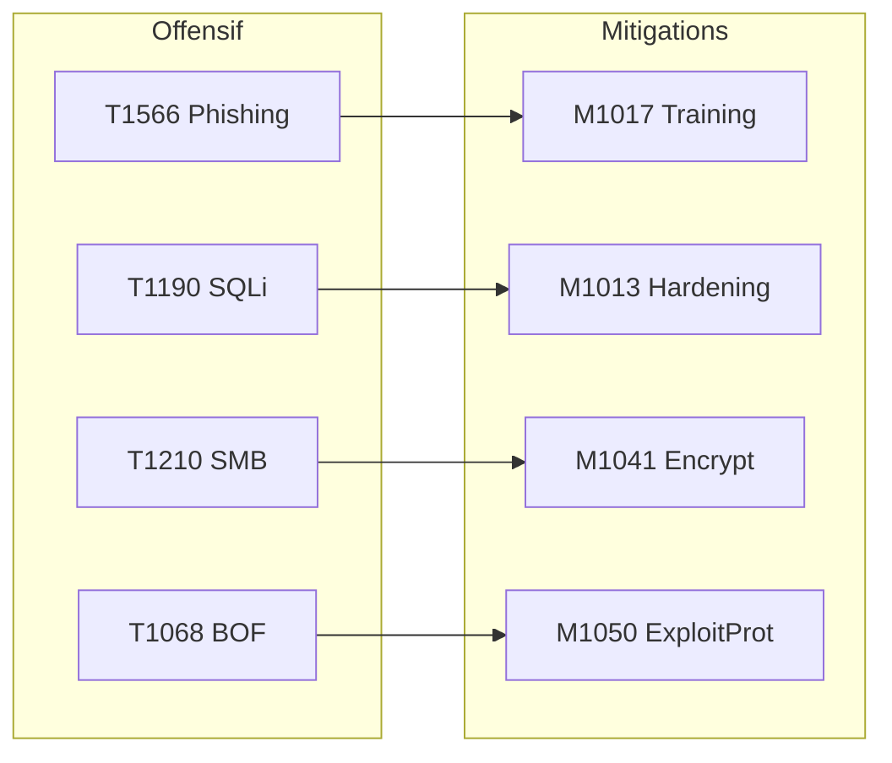
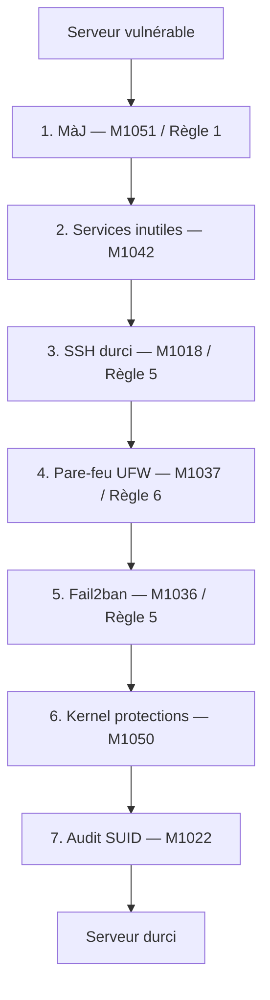

# Chapitre 04 : Contre-mesures et sécurisation des systèmes — Techniques de hacking et contre-mesures - Niveau 1

---

## Objectifs pédagogiques

- Mapper les mesures de défense aux Mitigations ATT&CK (Mxxxx)
- Appliquer le durcissement système (hardening) sur Linux
- Aligner le hardening avec les recommandations ANSSI et CERT-FR
- Évaluer et prioriser les risques avec le triangle CIA
- Construire une matrice de couverture défensive
- Comprendre les niveaux de maturité RGS (*, **, ***)

---

## Contexte réglementaire

En France, toute administration (dont le Ministère de la Justice) doit :
1. **Analyser ses risques** et faire **homologuer** ses SI (RGS, décret 2010-112)
2. **Déployer des mesures proportionnées** (NIS2 art.21, 10 règles d'or ANSSI)
3. **Durcir ses systèmes** selon les recommandations CERT-FR (publications DUR)
4. **Notifier les incidents** dans les 24h/72h (NIS2 art.23)

La check-list de durcissement ci-dessous répond directement à ces exigences.

> **Sources :** [10 règles d'or ANSSI](https://cyber.gouv.fr/securisation/10-regles-or-securite-numerique/). [CERT-FR recommandations DUR](https://www.cert.ssi.gouv.fr/). [RGS v2.0](https://www.ssi.gouv.fr/rgs).

---

## 1. Mitigations ATT&CK — Le pendant défensif



**Fig 11** — Mapping offensif-défensif : 4 techniques d'attaque majeures et leurs mitigations ATT&CK correspondantes, alignées avec les règles ANSSI.

| Technique d'attaque | Mitigation | Action concrète | Règle ANSSI |
|---|---|---|---|
| T1566 Phishing | M1017 User Training | Formation anti-phishing | Règle 10 |
| T1190 SQLi | M1013 App Hardening | WAF, requêtes préparées | Règle 6, 8 |
| T1210 SMB Exploit | M1042 Disable SMBv1 | Patch management | Règle 1, 6 |
| T1068 Buffer Overf | M1050 Exploit Protection | ASLR, DEP, Stack Canary | Règle 1, 5 |
| T1046 Nmap Scan | M1031 IDS/IPS | Snort, Suricata | Règle 6 |
| T1027 Obfuscation | M1049 Antivirus | Analyse heuristique | Règle 5 |

### Niveaux de maturité défensive (inspirés du RGS)

| Niveau | Équivalent RGS | Exigences |
|---|---|---|
| Basique | RGS * | Antivirus, mises à jour, pare-feu |
| Standard | RGS ** | + IDS/IPS, WAF, hardening, pentest externe annuel |
| Renforcé | RGS *** | + SOC 24/7, pentest interne trimestriel, Red Team, homologation formelle |

---

## Lab 4.1 — Durcissement complet d'un serveur Linux

###  Fiche

| Durée | Conteneur | Dossier | Mitigations |
|---|---|---|---|
| 1h30 | secure-linux (port 2222) | `~/cours-hacking/jour-4/labs/` | M1051, M1037, M1036, M1050, M1022 |

### Contexte métier

Un serveur de production non durci est une cible triviale. Dans un rapport de pentest, la section "recommandations" liste systématiquement le hardening. Pour une homologation RGS, la preuve du durcissement est exigée.



**Fig 12** — Pipeline de durcissement Linux en 7 étapes : mise à jour, services inutiles, SSH, pare-feu UFW, Fail2ban, protections noyau, audit SUID.

### Prérequis

```bash
docker compose up -d --build secure-linux
nc -z localhost 2222 && echo "SSH OK"
mkdir -p ~/cours-hacking/jour-4/labs && cd ~/cours-hacking/jour-4/labs
```

### Étape 1 — État initial (vulnérable)

```bash
# SSH root par mot de passe faible fonctionne
sshpass -p 'changeme' ssh -o StrictHostKeyChecking=no \
  -p 2222 root@localhost "whoami && hostname"
# → root / <ID_conteneur>
```

**Checkpoint A :** SSH root accessible avec `changeme`.

### Étape 2 — Script de durcissement

```bash
cd ~/cours-hacking/jour-4/labs
cat > hardening.sh << 'SCRIPT_EOF'
#!/bin/bash
set -e
echo "=== Hardening Linux — $(date) ==="

echo "[1/7] Mises à jour (M1051 / Règle 1 ANSSI)..."
apt-get update && apt-get upgrade -y

echo "[2/7] Désactivation services inutiles (M1042)..."
systemctl disable bluetooth cups avahi-daemon 2>/dev/null || true

echo "[3/7] SSH durci (M1018 / Règle 5 ANSSI)..."
cp /etc/ssh/sshd_config /etc/ssh/sshd_config.bak
sed -i 's/^#*PermitRootLogin.*/PermitRootLogin no/' /etc/ssh/sshd_config
sed -i 's/#PasswordAuthentication yes/PasswordAuthentication no/' /etc/ssh/sshd_config
systemctl restart sshd 2>/dev/null || systemctl restart ssh

echo "[4/7] Pare-feu UFW (M1037 / Règle 6 ANSSI)..."
apt-get install -y ufw
ufw default deny incoming && ufw default allow outgoing
ufw allow 22/tcp && ufw limit 22/tcp
ufw --force enable

echo "[5/7] Fail2ban (M1036)..."
apt-get install -y fail2ban
cat > /etc/fail2ban/jail.local << 'EOF'
[sshd]
enabled = true
port = 22
maxretry = 3
bantime = 3600
EOF
systemctl restart fail2ban

echo "[6/7] Protections kernel (M1050)..."
cat >> /etc/sysctl.d/99-hardening.conf << 'EOF'
kernel.randomize_va_space = 2
net.ipv4.tcp_syncookies = 1
net.ipv4.conf.all.rp_filter = 1
net.ipv4.conf.all.accept_redirects = 0
EOF
sysctl -p /etc/sysctl.d/99-hardening.conf

echo "[7/7] Audit SUID (M1022)..."
find / -perm -4000 -type f -ls 2>/dev/null > /root/suid_audit.txt

echo "=== Hardening terminé ==="
SCRIPT_EOF
chmod +x hardening.sh
echo "Script hardening.sh créé"
```

### Étape 3 — Appliquer le durcissement

```bash
cd ~/cours-hacking/jour-4/labs
docker cp hardening.sh secure-linux-target:/root/
docker exec secure-linux-target bash /root/hardening.sh
```

Observez la sortie : chaque étape `[1/7]` à `[7/7]` doit afficher un message de succès. Si une erreur apparaît, lisez le message avant de poursuivre.

### Étape 4 — Vérification post-hardening

Depuis votre terminal Kali (hôte) :

```bash
# SSH root par mot de passe REFUSÉ 
sshpass -p 'changeme' ssh -o StrictHostKeyChecking=no \
  -o ConnectTimeout=3 -p 2222 root@localhost "id" 2>/dev/null \
  && echo "ÉCHEC" || echo " SSH root désactivé"

# UFW actif
docker exec secure-linux-target ufw status verbose

# ASLR activé (doit afficher 2)
docker exec secure-linux-target cat /proc/sys/kernel/randomize_va_space
# → 2

# Fail2ban
docker exec secure-linux-target fail2ban-client status sshd
```

### Checkpoints

- [ ] SSH root par mot de passe REFUSÉ
- [ ] UFW actif
- [ ] Fail2ban configuré (maxretry=3)
- [ ] ASLR = 2 (full randomization)

---

## 2. Évaluation des risques — Triangle CIA

```
                    CONFIDENTIALITÉ (C)
                    données protégées
                         
                        /|\
                       / | \
                      /  |  \
           INTÉGRITÉ (I)  DISPONIBILITÉ (A)
          données exactes        service accessible
```

Chaque incident impacte un ou plusieurs piliers. L'analyse CIA est exigée par le RGS pour l'homologation.

### Matrice de couverture défensive

```
              M1013(WAF)  M1037(FW)  M1031(IDS)  M1050(ASLR)
T1190 (SQLi)                                    
T1210 (SMB)                                     
T1068 (BOF)                                     
T1566 (Phish)                                   

Couverture       25%         25%         25%          50%

 ANGLE MORT : T1566 (Phishing) — aucune mitigation
→ Action : déployer M1017 (formation utilisateurs)
```

---

## Exercices

### Exercice 1 : Prioriser les mitigations

**Énoncé :** Budget limité. Choisissez 3 mitigations. Justifiez.

<details><summary><strong>Solution</strong></summary>
1. M1051 (Updates) — transversale, bloque des centaines de CVE
2. M1017 (User Training) — couvre T1566, 1er vecteur d'accès initial
3. M1037 (Firewall) — réduit la surface d'attaque immédiatement

Justification : défense tôt dans la kill chain → plus efficace.
</details>

### Exercice 2 : Règle Snort SQLi

**Énoncé :** Rédigez une règle Snort détectant `UNION SELECT`.

<details><summary><strong>Solution</strong></summary>

```
alert tcp any any -> $HOME_NET 80 (msg:"SQLi UNION SELECT detected";
    flow:to_server,established;
    content:"UNION"; nocase; content:"SELECT"; nocase; distance:0;
    sid:2000001; rev:1;)
```
</details>

### Exercice 3 : Niveau RGS

**Énoncé :** Un système de la Justice manipule des données sensibles (casiers judiciaires). Quel niveau RGS recommandez-vous ? Quelles mesures associer ?

<details><summary><strong>Solution</strong></summary>
**RGS *** (renforcé)** — données à caractère personnel sensible.
Mesures : chiffrement au repos et en transit, pentest interne trimestriel, SOC 24/7, WAF, IDS/IPS, double authentification, homologation formelle ANSSI.
</details>

---

## Points clés à retenir

- Chaque technique ATT&CK a une mitigation (Mxxxx) documentée
- **Hardening** = mises à jour + SSH + firewall + fail2ban + ASLR
- Le RGS définit 3 niveaux de sécurité (*, **, ***) pour les administrations
- Les 10 règles d'or ANSSI sont la checklist de base de toute administration
- La **matrice de couverture** visualise vos angles morts
- Le CERT-FR publie des recommandations de durcissement (CERTFR-20XX-DUR-XXX)

## Pour aller plus loin

- [10 règles d'or ANSSI](https://cyber.gouv.fr/securisation/10-regles-or-securite-numerique/)
- [RGS v2.0](https://www.ssi.gouv.fr/rgs)
- [CERT-FR — Durcissement](https://www.cert.ssi.gouv.fr/)
- [CIS Benchmarks](https://www.cisecurity.org/cis-benchmarks)
- [MITRE D3FEND](https://d3fend.mitre.org/)

---
*Chapitre précédent : [Jour 3](./JOUR-03-vulnerabilites-avancees-contournement-protections.md)*

*Chapitre suivant : [Jour 5 — Reporting et normes](./JOUR-05-reporting-gestion-incidents-conformite.md)*
