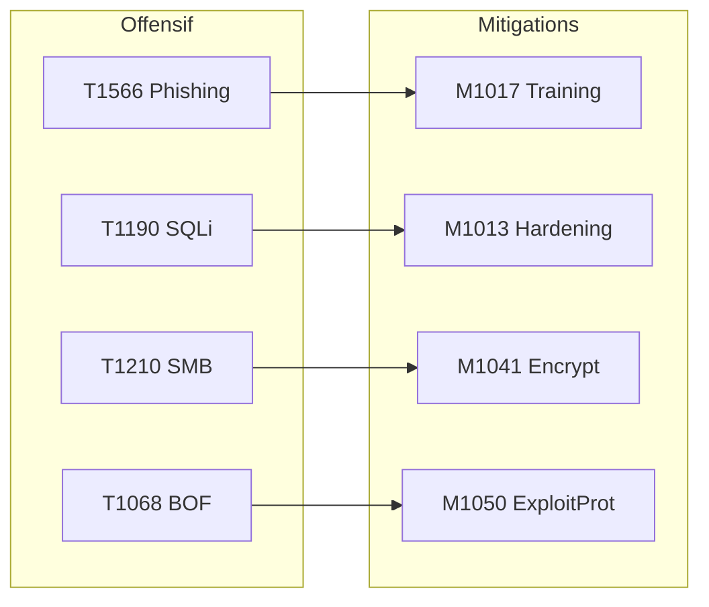
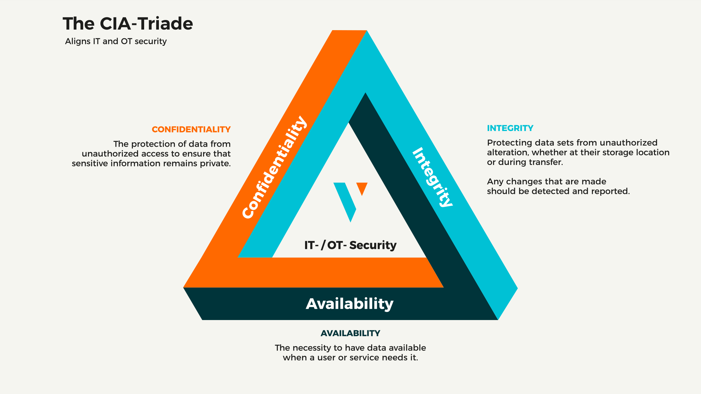

# Chapitre 04 : Contre-mesures et sécurisation des systèmes — Techniques de hacking et contre-mesures - Niveau 1

---

## Objectifs pédagogiques

- Mapper les mesures de défense aux Mitigations ATT&CK (Mxxxx)
- Appliquer le durcissement système (hardening) sur Linux
- Aligner le hardening avec les recommandations ANSSI et CERT-FR
- Évaluer et prioriser les risques avec le triangle CIA
- Construire une matrice de couverture défensive
- Comprendre les niveaux de maturité RGS (élémentaire, standard, renforcé)

---

## Contexte réglementaire

En France, toute administration et institution de l'État doit :
1. **Analyser ses risques** et faire **homologuer** ses SI (RGS, décret 2010-112)
2. **Déployer des mesures proportionnées** (NIS2 art.21, 10 règles d'or ANSSI)
3. **Durcir ses systèmes** selon les recommandations CERT-FR (publications DUR)
4. **Notifier les incidents** dans les 24h/72h (NIS2 art.23)

La check-list de durcissement ci-dessous s'inscrit dans ce cadre réglementaire.

> **Sources :** [10 règles d'or ANSSI](https://cyber.gouv.fr/securisation/10-regles-or-securite-numerique/). [CERT-FR recommandations DUR](https://www.cert.ssi.gouv.fr/). [RGS v2.0](https://www.ssi.gouv.fr/rgs).

---

## 1. Mitigations ATT&CK — Le pendant défensif



**Fig 12** — Mapping offensif-défensif : 4 techniques d'attaque majeures et leurs mitigations ATT&CK correspondantes, alignées avec les règles ANSSI.

| Technique d'attaque | Mitigation | Action concrète | Règle ANSSI |
|---|---|---|---|
| [T1566](https://attack.mitre.org/techniques/T1566/) Phishing | M1017 User Training | Formation anti-phishing | Règle 10 |
| [T1190](https://attack.mitre.org/techniques/T1190/) SQLi | M1013 App Hardening | WAF, requêtes préparées | Règle 6, 8 |
| [T1210](https://attack.mitre.org/techniques/T1210/) SMB Exploit | M1042 Disable SMBv1 | Patch management | Règle 1, 6 |
| [T1068](https://attack.mitre.org/techniques/T1068/) Buffer Overf | M1050 Exploit Protection | ASLR, DEP, Stack Canary | Règle 1, 5 |
| [T1046](https://attack.mitre.org/techniques/T1046/) Nmap Scan | M1031 IDS/IPS | Snort, Suricata | Règle 6 |
| [T1027](https://attack.mitre.org/techniques/T1027/) Obfuscation | M1049 Antivirus | Analyse heuristique | Règle 5 |

### Niveaux de maturité défensive (inspirés du RGS)

| Niveau | Équivalent RGS | Exigences |
|---|---|---|
| Basique | RGS élémentaire | Antivirus, mises à jour, pare-feu |
| Standard | RGS standard | + IDS/IPS, WAF, hardening, pentest externe annuel |
| Renforcé | RGS renforcé | + SOC 24/7, pentest interne trimestriel, Red Team, homologation formelle |

---

## Lab 4.1 — Durcissement complet d'un serveur Linux

###  Fiche

| Durée | Conteneur | Dossier | Mitigations |
|---|---|---|---|
| 1h30 | secure-linux (port 2224) | `~/cours-hacking/jour-4/labs/` | M1051, M1037, M1036, M1050, M1022 |

### Contexte métier

Un serveur de production non durci est une cible triviale. Dans un rapport de pentest, la section "recommandations" liste systématiquement le hardening. Pour une homologation RGS, la preuve du durcissement est exigée.

| Étape | Action | Mitigation | Règle ANSSI |
|-------|--------|------------|-------------|
| 1 | Mise à jour sécurité | M1051 Update Software | Règle 1 |
| 2 | Désactiver services inutiles | M1042 Disable Service | — |
| 3 | Durcir SSH (root login, clés) | M1018 Account Management | Règle 5 |
| 4 | Pare-feu UFW | M1037 Network Filtering | Règle 6 |
| 5 | Fail2ban anti brute-force | M1036 Brute Force Protection | Règle 5 |
| 6 | Protections kernel (ASLR, etc.) | M1050 Exploit Protection | — |
| 7 | Audit SUID / file integrity | M1022 File Integrity | — |

**Fig 13** — Pipeline de durcissement Linux en 7 étapes : mise à jour, services inutiles, SSH, pare-feu UFW, Fail2ban, protections noyau, audit SUID.

### Prérequis

```bash
# -d : démarre les conteneurs en arrière-plan (detached), libère le terminal
# --build : reconstruit l'image à chaque fois pour intégrer les dernières modifications
cd ~/cours-hacking/repo && docker compose up -d --build secure-linux
# -z : scan passif (zero-I/O), teste la connectivité TCP sans envoyer de données
# Vérifie que le service SSH est bien accessible sur le port 2224 avant de continuer
nc -z localhost 2224 && echo "SSH OK"
# -p : crée récursivement les répertoires parents s'ils n'existent pas (mkdir --parents)
mkdir -p ~/cours-hacking/jour-4/labs && cd ~/cours-hacking/jour-4/labs
```

### Étape 1 — État initial (vulnérable)

```bash
# État initial : connexion root par mot de passe faible — cela ne doit plus fonctionner après durcissement
# ssh = Secure Shell, connexion chiffrée et authentifiée à un serveur distant
# root@localhost = utilisateur@hôte ; la commande entre guillemets est exécutée sur le serveur distant
# sshpass -p : injecte le mot de passe dans stdin du processus SSH (usage lab uniquement, dangereux en prod car visible dans /proc)
# -o StrictHostKeyChecking=no : désactive la vérification de la clé hôte (uniquement pour l'automatisation en lab fermé)
# -p 2224 : port SSH alternatif exposé par le conteneur Docker
sshpass -p 'changeme' ssh -o StrictHostKeyChecking=no \
  -p 2224 root@localhost "whoami && hostname"
# Sortie attendue → root / <ID_conteneur> — preuve que l'accès root non sécurisé fonctionne avant durcissement
```

**Checkpoint A :** SSH root accessible avec `changeme`.

### Étape 2 — Script de durcissement

```bash
cd ~/cours-hacking/jour-4/labs
# Construction du script de durcissement via heredoc (cat > fichier << 'DELIMITEUR')
# La syntaxe 'SCRIPT_EOF' (guillemets simples autour du délimiteur) empêche l'expansion
# des variables dans le corps du heredoc — le contenu est écrit littéralement
cat > hardening.sh << 'SCRIPT_EOF'
#!/bin/bash
# set -e : arrête immédiatement le script si une commande retourne un code d'erreur non nul
# Évite de poursuivre le durcissement sur un système dans un état partiel/incohérent
set -e
echo "=== Hardening Linux — $(date) ==="

# === ÉTAPE 1/7 — Mises à jour de sécurité (Mitigation ATT&CK M1051) ===
# Règle d'or ANSSI n°1 : maintenir les logiciels à jour.
# Pourquoi c'est critique : des centaines de CVE sont corrigées chaque mois.
# Un système non patché est la 1ère cause de compromission.
echo "[1/7] Mises à jour (M1051 / Règle 1 ANSSI)..."
# apt-get update : rafraîchit l'index des paquets disponibles (liste des versions)
# apt-get upgrade -y : installe les versions les plus récentes de tous les paquets
# -y : répond automatiquement 'yes' aux invites de confirmation (mode non-interactif)
apt-get update && apt-get upgrade -y

# === ÉTAPE 2/7 — Réduction de la surface d'attaque (Mitigation ATT&CK M1042) ===
# Principe : désactiver tout service non essentiel pour limiter les vecteurs d'entrée.
# Bluetooth, CUPS (impression) et Avahi (mDNS) sont rarement nécessaires sur un serveur.
echo "[2/7] Désactivation services inutiles (M1042)..."
# systemctl disable : empêche le service de démarrer automatiquement au boot
# 2>/dev/null : redirige stderr vers /dev/null (ignore les erreurs si service absent)
# || true : garantit un code retour 0 même si disable échoue (évite que set -e n'arrête le script)
systemctl disable bluetooth cups avahi-daemon 2>/dev/null || true

# === ÉTAPE 3/7 — Durcissement SSH (Mitigation ATT&CK M1018) ===
# Règle d'or ANSSI n°5 : sécuriser les accès distants.
# SSH est la porte d'entrée n°1 des attaquants sur les serveurs Linux.
# Interdire le login root force l'usage d'un compte utilisateur + sudo (traçabilité).
# Interdire le mot de passe impose l'authentification par clé (résistante au brute-force).
echo "[3/7] SSH durci (M1018 / Règle 5 ANSSI)..."
# Sauvegarde de la configuration originale avant modification (bonne pratique de rollback)
# cp = copie un fichier ou dossier (source → destination)
# Sauvegarde de la configuration originale avant modification (bonne pratique de rollback)
cp /etc/ssh/sshd_config /etc/ssh/sshd_config.bak
# sed -i : édition in-place (modifie directement le fichier, sans créer de copie)
# s/^#*PermitRootLogin.*/PermitRootLogin no/
#   ^#*        : capture les éventuels commentaires (#) en début de ligne
#   .*         : capture n'importe quelle valeur actuelle (yes, no, prohibit-password...)
#   Résultat   : remplace toute la ligne par "PermitRootLogin no"
#   Pourquoi   : empêche la connexion SSH directe en root, obligation de passer par sudo
sed -i 's/^#*PermitRootLogin.*/PermitRootLogin no/' /etc/ssh/sshd_config
# s/#PasswordAuthentication yes/PasswordAuthentication no/
#   Remplace la valeur commentée/décommentée par "no"
#   Pourquoi : force l'authentification par clé SSH (plus sûre qu'un mot de passe)
#   Note : la regex cible UNIQUEMENT la ligne commentée "#PasswordAuthentication yes"
sed -i 's/#PasswordAuthentication yes/PasswordAuthentication no/' /etc/ssh/sshd_config
# Redémarrage du service SSH pour appliquer les changements
# 2>/dev/null || systemctl restart ssh : tente sshd (systemd moderne) puis ssh (SysVinit legacy)
systemctl restart sshd 2>/dev/null || systemctl restart ssh

# === ÉTAPE 4/7 — Pare-feu UFW (Mitigation ATT&CK M1037) ===
# Règle d'or ANSSI n°6 : cloisonner et filtrer les flux réseau.
# UFW (Uncomplicated Firewall) est une surcouche simplifiée d'iptables pour Linux.
echo "[4/7] Pare-feu UFW (M1037 / Règle 6 ANSSI)..."
apt-get install -y ufw
# Politique par défaut : principe du moindre privilège appliqué au réseau
# deny incoming  : bloque TOUT trafic entrant sauf ce qui est explicitement autorisé
# allow outgoing : autorise tout le trafic sortant (le serveur peut initier des connexions)
ufw default deny incoming && ufw default allow outgoing
# allow 22/tcp : autorise le port SSH (22) en TCP — indispensable après deny incoming
# limit 22/tcp  : limite le débit de connexions sur le port 22 (rate-limiting anti brute-force)
#                 Si plus de 6 connexions en 30 secondes depuis la même IP, UFW bloque temporairement
ufw allow 22/tcp && ufw limit 22/tcp
# --force : active le pare-feu sans demande de confirmation interactive
# Active immédiatement les règles iptables correspondantes au niveau kernel
ufw --force enable

# === ÉTAPE 5/7 — Fail2ban (Mitigation ATT&CK M1036) ===
# Fail2ban analyse les logs et bannit temporairement les IP qui échouent trop de fois.
# Protection de dernier recours contre le brute-force sur SSH.
echo "[5/7] Fail2ban (M1036)..."
apt-get install -y fail2ban
# Création d'une configuration locale (jail.local) qui surcharge jail.conf
# jail.local survit aux mises à jour du paquet (contrairement à jail.conf)
# Heredoc interne (EOF sans guillemets) pour écrire la configuration du jail SSH
cat > /etc/fail2ban/jail.local << 'EOF'
[sshd]
enabled = true
port = 22
# maxretry = 3 : après 3 tentatives échouées, l'IP est bannie
# (assez stricte pour bloquer le brute-force, assez souple pour les erreurs légitimes)
maxretry = 3
# bantime = 3600 : durée du bannissement en secondes (1 heure)
# Dissuade les attaques automatisées sans bloquer définitivement une IP légitime
bantime = 3600
EOF
systemctl restart fail2ban

# === ÉTAPE 6/7 — Protections noyau Linux (Mitigation ATT&CK M1050) ===
# Paramètres kernel (sysctl) appliqués au démarrage via sysctl.d.
# Ces protections agissent au niveau le plus bas du système d'exploitation.
echo "[6/7] Protections kernel (M1050)..."
# >> : ajoute en fin de fichier (préserve le contenu existant)
# Heredoc pour écrire les paramètres sysctl persistants dans un fichier .conf dédié
cat >> /etc/sysctl.d/99-hardening.conf << 'EOF'
# kernel.randomize_va_space = 2 — ASLR complet (Address Space Layout Randomization)
#   Valeurs : 0=désactivé, 1=randomisation partielle, 2=randomisation complète (inclut heap)
#   Pourquoi : rend les adresses mémoire imprévisibles, bloque les exploits de type buffer overflow
#   Sans ASLR, un attaquant connaît l'adresse exacte de la heap/stack/libc → exploitation triviale
kernel.randomize_va_space = 2
# net.ipv4.tcp_syncookies = 1 — Protection contre les attaques SYN flood
#   Active les SYN cookies : le serveur ne stocke pas le half-open connection state
#   Quand la file d'attente SYN est saturée, le serveur encode l'état dans le cookie TCP
#   Pourquoi : empêche le DoS par épuisement des half-open connections (SYN flood)
net.ipv4.tcp_syncookies = 1
# net.ipv4.conf.all.rp_filter = 1 — Filtrage anti-spoofing (Reverse Path Filtering)
#   Vérifie que le paquet entrant arrive bien par l'interface correspondant à sa source
#   Pourquoi : bloque les paquets spoofés (IP source falsifiée), utilisé dans les DDoS et scans furtifs
net.ipv4.conf.all.rp_filter = 1
# net.ipv4.conf.all.accept_redirects = 0 — Refuser les redirects ICMP
#   Un redirect ICMP peut détourner le trafic vers une passerelle malveillante
#   Pourquoi : empêche les attaques Man-in-the-Middle par ICMP redirect sur le réseau local
net.ipv4.conf.all.accept_redirects = 0
EOF
# sysctl -p : charge et applique immédiatement les paramètres depuis le fichier de configuration
# Sans cette commande, les paramètres ne seraient actifs qu'au prochain reboot
sysctl -p /etc/sysctl.d/99-hardening.conf

# === ÉTAPE 7/7 — Audit des binaires SUID (Mitigation ATT&CK M1022) ===
# Les fichiers avec le bit SUID (Set User ID) s'exécutent avec les droits du propriétaire.
# Un binaire SUID root mal configuré est un vecteur d'élévation de privilèges classique.
echo "[7/7] Audit SUID (M1022)..."
# find / -perm -4000 -type f -ls 2>/dev/null > /root/suid_audit.txt
#   /              : parcourt TOUT le système de fichiers depuis la racine
#   -perm -4000    : cherche les fichiers avec le bit SUID (4000 en octal) positionné
#                    Le '-' devant 4000 signifie "au moins ces bits" (pas égalité stricte)
#   -type f        : limite aux fichiers réguliers (exclut répertoires, sockets, liens...)
#   -ls            : affiche le résultat au format "ls -l" (permissions, propriétaire, taille)
#   2>/dev/null    : ignore les erreurs "Permission denied" (répertoires non accessibles)
#   > /root/suid_audit.txt : sauvegarde la liste pour analyse et traçabilité
find / -perm -4000 -type f -ls 2>/dev/null > /root/suid_audit.txt

echo "=== Hardening terminé ==="
SCRIPT_EOF
chmod +x hardening.sh
echo "Script hardening.sh créé"
```

### Étape 3 — Appliquer le durcissement

```bash
cd ~/cours-hacking/jour-4/labs
# docker cp : copie un fichier de l'hôte vers le conteneur (ou inversement)
# Syntaxe : docker cp <source_hôte> <nom_conteneur>:<destination_conteneur>
docker cp hardening.sh secure-linux-target:/root/
# docker exec : exécute une commande dans un conteneur déjà en cours d'exécution
# bash /root/hardening.sh : lance le script de durcissement à l'intérieur du conteneur
# Le script tourne avec les privilèges root à l'intérieur du conteneur (isolé de l'hôte)
docker exec secure-linux-target bash /root/hardening.sh
```

Observez la sortie : chaque étape `[1/7]` à `[7/7]` doit afficher un message de succès. Si une erreur apparaît, lisez le message avant de poursuivre.

### Étape 4 — Vérification post-hardening

Depuis votre terminal Kali (hôte) :

```bash
# === VÉRIFICATION 1 : SSH root par mot de passe DOIT être REFUSÉ ===
# Tentative de connexion avec le même mot de passe faible qu'à l'étape 1
# -o ConnectTimeout=3 : abandonne après 3 secondes si la connexion n'aboutit pas
# 2>/dev/null : masque le message d'erreur SSH pour ne garder que notre verdict
# && echo "ÉCHEC" || echo "✓ SSH root désactivé" : logique shell
#   Si sshpass réussit (&&) → le durcissement a échoué → "ÉCHEC"
#   Si sshpass échoue (||) → PermitRootLogin=no fonctionne → "✓ SSH root désactivé"
sshpass -p 'changeme' ssh -o StrictHostKeyChecking=no \
  -o ConnectTimeout=3 -p 2224 root@localhost "id" 2>/dev/null \
  && echo "ÉCHEC" || echo "✓ SSH root désactivé"

# === VÉRIFICATION 2 : Pare-feu UFW actif ===
# ufw status verbose : affiche l'état détaillé (status, règles, politique par défaut, logging)
# Attendu : Status: active, Default: deny (incoming), allow (outgoing)
docker exec secure-linux-target ufw status verbose

# === VÉRIFICATION 3 : ASLR activé (full randomization) ===
# /proc/sys/kernel/randomize_va_space est le pseudo-fichier kernel exposant la config ASLR
# Valeur attendue : 2 (randomisation complète = heap + stack + libs + exécutable PIE)
# 0 = désactivé (adresses fixes, trivial à exploiter)
# 1 = randomisation partielle (stack + libs uniquement)
# 2 = randomisation complète (tout l'espace d'adressage, y compris heap et segments)
docker exec secure-linux-target cat /proc/sys/kernel/randomize_va_space
# → 2

# === VÉRIFICATION 4 : Fail2ban configuré et actif ===
# fail2ban-client status sshd : affiche l'état du jail SSH (activé/désactivé, stats de bannissement)
# Attendu : jail sshd enabled, maxretry=3, bantime=3600
docker exec secure-linux-target fail2ban-client status sshd
```

### Checkpoints

- [ ] SSH root par mot de passe REFUSÉ
- [ ] UFW actif
- [ ] Fail2ban configuré (maxretry=3)
- [ ] ASLR = 2 (full randomization)

---

## 2. Évaluation des risques — Triangle CIA



**Fig 18** — Triangle CIA : les 3 piliers de la sécurité de l'information. Chaque incident impacte un ou plusieurs piliers. L'analyse CIA est exigée par le RGS pour l'homologation.

### Matrice de couverture défensive

```text
              M1013(WAF)  M1037(FW)  M1031(IDS)  M1050(ASLR)
T1190 (SQLi)                                    
T1210 (SMB)                                     
T1068 (BOF)                                     
T1566 (Phish)                                   

Couverture       25%         25%         25%          50%

 ANGLE MORT : T1566 (Phishing) — aucune mitigation
→ Action : déployer M1017 (formation utilisateurs)
```

---

## Exercices

### Exercice 1 : Prioriser les mitigations

**Énoncé :** Budget limité. Choisissez 3 mitigations. Justifiez.

<details><summary><strong>Solution</strong></summary>
1. M1051 (Updates) — transversale, bloque des centaines de CVE
2. M1017 (User Training) — couvre [T1566](https://attack.mitre.org/techniques/T1566/), 1er vecteur d'accès initial
3. M1037 (Firewall) — réduit la surface d'attaque immédiatement

Justification : défense tôt dans la kill chain → plus efficace.
</details>

### Exercice 2 : Règle Snort SQLi

**Énoncé :** Rédigez une règle Snort détectant `UNION SELECT`.

<details><summary><strong>Solution</strong></summary>

```snort
alert tcp any any -> $HOME_NET 80 (msg:"SQLi UNION SELECT detected";
    flow:to_server,established;
    content:"UNION"; nocase; content:"SELECT"; nocase; distance:0;
    sid:2000001; rev:1;)
```
</details>

### Exercice 3 : Niveau RGS

**Énoncé :** Une administration d'État manipule des données sensibles (informations réglementées). Quel niveau RGS recommandez-vous ? Quelles mesures associer ?

<details><summary><strong>Solution</strong></summary>
**RGS renforcé** — données à caractère personnel sensible.
Mesures : chiffrement au repos et en transit, pentest interne trimestriel, SOC 24/7, WAF, IDS/IPS, double authentification, homologation formelle ANSSI.
</details>

---

## Points clés à retenir

- Chaque technique ATT&CK a une mitigation (Mxxxx) documentée
- **Hardening** = mises à jour + SSH + firewall + fail2ban + ASLR
- Le RGS définit 3 niveaux de sécurité (élémentaire, standard, renforcé) pour les administrations
- Les 10 règles d'or ANSSI sont la checklist de base de toute administration
- La **matrice de couverture** visualise vos angles morts
- Le CERT-FR publie des recommandations de durcissement (CERTFR-20XX-DUR-XXX)

## Pour aller plus loin

- [10 règles d'or ANSSI](https://cyber.gouv.fr/securisation/10-regles-or-securite-numerique/)
- [RGS v2.0](https://www.ssi.gouv.fr/rgs)
- [CERT-FR — Durcissement](https://www.cert.ssi.gouv.fr/)
- [CIS Benchmarks](https://www.cisecurity.org/cis-benchmarks)
- [MITRE D3FEND](https://d3fend.mitre.org/)

---

