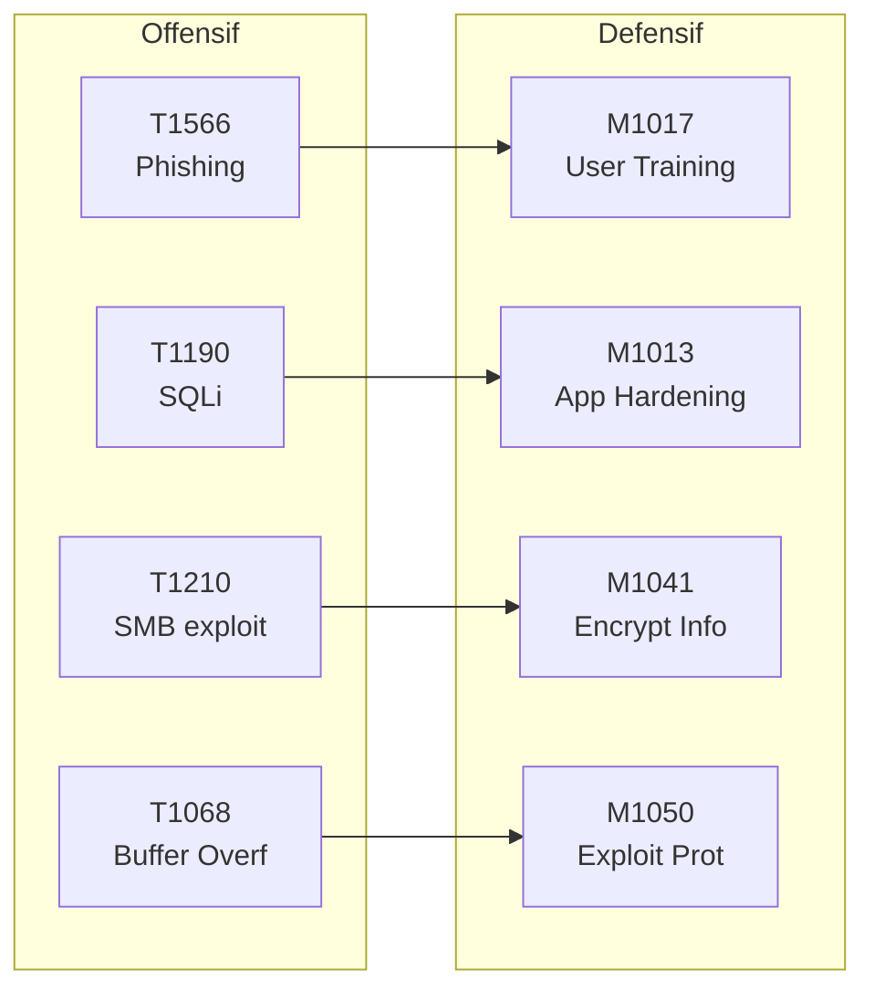
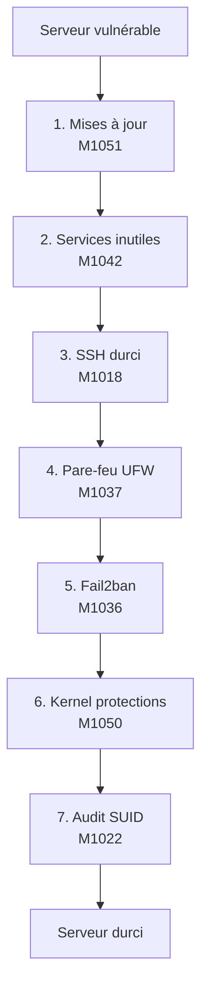

# Chapitre 04 : Contre-mesures et sécurisation des systèmes

---

## Objectifs pédagogiques

- Mapper les mesures de défense aux Mitigations ATT&CK (Mxxxx)
- Mettre en place chiffrement, VPN, IDS/IPS et pare-feu
- Appliquer le durcissement système (hardening) sur Linux
- Évaluer et prioriser les risques avec le triangle CIA
- Construire une matrice de couverture défensive

---

## Introduction

Défendre est plus difficile qu'attaquer. L'attaquant n'a besoin que d'une seule faille ; le défenseur doit toutes les colmater. La bonne nouvelle : MITRE ATT&CK documente aussi les **Mitigations** (ID Mxxxx) pour chaque technique.

Ce chapitre adopte le point de vue du défenseur. À chaque technique d'attaque vue précédemment, vous associerez une mitigation concrète et construirez une matrice de couverture défensive.

> **Sources :** [ATT&CK Mitigations](https://attack.mitre.org/mitigations/enterprise/) — MITRE. [NIST Cybersecurity Framework](https://www.nist.gov/cyberframework) — NIST.

---

## 1. Mitigations ATT&CK — Le pendant défensif

Chaque technique offensive possède des mitigations recommandées :



### Tableau de mapping Attaque → Mitigation

| Technique (T) | Mitigation (M) | Action concrète |
|---|---|---|
| T1566 Phishing | M1017 User Training | Formation anti-phishing |
| T1190 SQLi | M1013 App Hardening | WAF, requêtes préparées |
| T1210 SMB Exploit | M1042 Disable SMBv1 | GPO/patch management |
| T1068 Buffer Ovf | M1050 Exploit Protection | ASLR, DEP, Stack Canary |
| T1046 Nmap Scan | M1031 IDS/IPS | Snort, Suricata |
| T1027 Obfuscation | M1049 Antivirus | Analyse heuristique |
| T1572 Tunneling | M1037 Firewall | Règles restrictives |

> **Sources :** [ATT&CK Mitigations List](https://attack.mitre.org/mitigations/enterprise/).

---

## 2. Mesures de protection

### Chiffrement — M1041 Encrypt Sensitive Information

```python
#!/usr/bin/env python3
"""Chiffrement AES-256-GCM avec authentification."""
from cryptography.hazmat.primitives.ciphers.aead import AESGCM
import os

def encrypt(plaintext: bytes) -> tuple:
    key = AESGCM.generate_key(bit_length=256)
    aesgcm = AESGCM(key)
    nonce = os.urandom(12)
    ct = aesgcm.encrypt(nonce, plaintext, None)
    return key, nonce, ct

def decrypt(key, nonce, ct):
    return AESGCM(key).decrypt(nonce, ct, None)

key, nonce, ct = encrypt(b"donnees_confidentielles")
pt = decrypt(key, nonce, ct)
print(f"Original : {pt.decode()}")
print(f"Chiffre  : {ct.hex()[:40]}...")
assert pt == b"donnees_confidentielles", "Echec"
print("AES-256-GCM OK")
```

### VPN — M1030 Network Segmentation

```bash
sudo apt install wireguard
wg genkey | tee privatekey | wg pubkey > publickey
# Config serveur dans /etc/wireguard/wg0.conf
sudo wg-quick up wg0
```

### IDS/IPS — M1031 Network Intrusion Prevention

Snort analyse le trafic réseau en temps réel :

```bash
sudo apt install snort
sudo nano /etc/snort/snort.conf
sudo snort -T -c /etc/snort/snort.conf    # Test config
sudo snort -A console -q -c /etc/snort/snort.conf -i eth0
```

---

## Lab 4.1 — Durcissement complet d'un serveur Linux

### Fiche de lab

| Propriété | Valeur |
|---|---|
| **Durée** | 1h30 |
| **Conteneur** | `secure-linux` (port 2222) |
| **Dossier de travail** | `~/cours-hacking/jour-4/labs/` |
| **Mitigations** | M1051, M1037, M1036, M1050, M1022 |

### Prérequis avant de commencer

- [x] Conteneur buildé et lancé : `docker compose -f ~/cours-hacking/repo/docker-compose.yml up -d --build secure-linux`
- [x] SSH accessible : `nc -z localhost 2222 && echo OK`
- [x] Terminal dans `~/cours-hacking/jour-4/labs/` : `mkdir -p ~/cours-hacking/jour-4/labs && cd ~/cours-hacking/jour-4/labs`

### Contexte

Le conteneur `secure-linux` simule un serveur Linux fraîchement installé mais volontairement vulnérable :
- SSH root autorisé avec mot de passe faible (`changeme`)
- Pas de pare-feu
- Pas de fail2ban
- Services inutiles activés
- Pas de protections kernel (ASLR configurable)

Vous allez le durcir pas à pas.



### Étape 1 — Vérification état initial

```bash
cd ~/cours-hacking/jour-4/labs

# SSH root avec mot de passe faible fonctionne
ssh root@localhost -p 2222 -o StrictHostKeyChecking=no
# Password: changeme
# → Connexion réussie (état vulnérable)
exit

# Scan des ports ouverts
nmap -sV -p 2222 localhost -P0
```

**Checkpoint A :** SSH root accessible avec mot de passe `changeme`.

### Étape 2 — Créer le script de durcissement

Créez `~/cours-hacking/jour-4/labs/hardening.sh` :

```bash
#!/bin/bash
# hardening.sh — Durcissement Linux automatisé
set -e

echo "=== Hardening Linux — $(date) ==="

echo "[1/7] Mise à jour système (M1051)..."
apt-get update && apt-get upgrade -y

echo "[2/7] Désactivation services inutiles (M1042)..."
systemctl disable bluetooth 2>/dev/null || true
systemctl disable cups 2>/dev/null || true

echo "[3/7] Durcissement SSH (M1018)..."
cp /etc/ssh/sshd_config /etc/ssh/sshd_config.bak
sed -i 's/PermitRootLogin yes/PermitRootLogin no/' /etc/ssh/sshd_config
sed -i 's/#PasswordAuthentication yes/PasswordAuthentication no/' /etc/ssh/sshd_config

echo "[4/7] Pare-feu UFW (M1037)..."
apt-get install -y ufw
ufw default deny incoming
ufw default allow outgoing
ufw allow 2222/tcp
ufw limit 2222/tcp
ufw --force enable

echo "[5/7] Fail2ban (M1036)..."
apt-get install -y fail2ban
cat > /etc/fail2ban/jail.local << 'EOF'
[sshd]
enabled = true
port = 2222
maxretry = 3
bantime = 3600
EOF
systemctl restart fail2ban

echo "[6/7] Protections kernel (M1050)..."
cat >> /etc/sysctl.d/99-hardening.conf << 'EOF'
kernel.randomize_va_space = 2
net.ipv4.tcp_syncookies = 1
net.ipv4.conf.all.rp_filter = 1
net.ipv4.conf.all.accept_redirects = 0
EOF
sysctl -p /etc/sysctl.d/99-hardening.conf

echo "[7/7] Audit SUID (M1022)..."
find / -perm -4000 -type f -exec ls -la {} \; 2>/dev/null > /root/suid_audit.txt

echo "=== Hardening terminé ==="
```

### Étape 3 — Copier et exécuter le script dans le conteneur

```bash
docker cp hardening.sh secure-linux-target:/root/
docker exec secure-linux-target bash /root/hardening.sh
```

### Étape 4 — Vérification post-hardening

```bash
# SSH root par mot de passe doit être REFUSÉ
ssh root@localhost -p 2222 -o ConnectTimeout=3
# → Permission denied (public key) ✓

# UFW actif
docker exec secure-linux-target ufw status verbose

# ASLR activé
docker exec secure-linux-target cat /proc/sys/kernel/randomize_va_space
# → 2 (full randomization) ✓

# Fail2ban configuré
docker exec secure-linux-target fail2ban-client status sshd
# → Status for the jail: sshd ✓
```

### Checkpoints

- [ ] Script hardening exécuté sans erreur
- [ ] SSH root par mot de passe REFUSÉ
- [ ] UFW actif avec ports filtrés
- [ ] Fail2ban configuré pour SSH (maxretry=3)
- [ ] ASLR = 2 (full randomization)

---

## 3. Évaluation des risques — Triangle CIA

```
                    CONFIDENTIALITÉ
                    (données protégées
                    des accès illégitimes)
                         ▲
                        /|\
                       / | \
                      /  |  \
                     /   |   \
                    /    |    \
                   /     |     \
                  /      |      \
                 /       |       \
                ──────────────────
        INTÉGRITÉ ◄────────────► DISPONIBILITÉ
   (données exactes,         (service accessible
    non altérées)             quand nécessaire)
```

### Analyse d'impact

```python
class ImpactCIA:
    def __init__(self, incident: str):
        self.nom = incident
        self.scores = {"C": 0, "I": 0, "A": 0}

    def eval(self, c=0, i=0, a=0):
        self.scores = {"C": c, "I": i, "A": a}
        return self.bilan()

    def bilan(self):
        t = sum(self.scores.values())
        return {"incident": self.nom, "C": self.scores["C"],
                "I": self.scores["I"], "A": self.scores["A"],
                "total": t, "criticite": "CRITIQUE" if t>=10 else
                "ELEVEE" if t>=7 else "MODEREE" if t>=4 else "FAIBLE"}

# Ransomware : C=4, I=5, A=5 → total 14 CRITIQUE
print(ImpactCIA("Ransomware").eval(4,5,5))
# Vol BDD via SQLi : C=5, I=0, A=0 → total 5 MODEREE
print(ImpactCIA("SQLi vol BDD").eval(5,0,0))
```

### Matrice de couverture défensive

```
              M1013(WAF)  M1037(FW)  M1031(IDS)  M1050(ASLR)
T1190 (SQLi)     ✅          ❌          ✅           ❌
T1210 (SMB)      ❌          ✅          ❌           ✅
T1068 (BOF)      ❌          ❌          ❌           ✅
T1566 (Phish)    ❌          ❌          ❌           ❌
──────────────────────────────────────────────────────────
Couverture       25%         25%         25%          50%

ANGLE MORT : T1566 (Phishing) — aucune mitigation déployée
```

---

## Exercices

### Exercice 1 : Règle Snort personnalisée

**Énoncé :** Écrivez une règle Snort détectant les tentatives d'injection SQL (mot-clé UNION SELECT).

<details>
<summary><strong>Solution</strong></summary>

```
alert tcp any any -> $HOME_NET 80 (msg:"SQLi UNION SELECT";
    flow:to_server,established;
    content:"UNION"; nocase;
    content:"SELECT"; nocase; distance:0;
    sid:2000001; rev:1;)
```
</details>

### Exercice 2 : Prioriser les mitigations

**Énoncé :** Budget limité, 3 mitigations à choisir. Priorisez avec justification ATT&CK.

<details>
<summary><strong>Solution</strong></summary>

1. **M1051 Update Software** — transversale, bloque des centaines de CVE
2. **M1017 User Training** — couvre le spearphishing (T1566), 1er vecteur d'accès initial
3. **M1037 Firewall** — réduit la surface d'attaque immédiatement

Ces 3 couvrent les 3 premières tactiques (Initial Access, Execution, Persistence). Une défense tôt dans la kill chain est plus efficace.
</details>

---

## Points clés à retenir

- Chaque technique ATT&CK a des mitigations (Mxxxx) — utilisez-les comme checklist
- Le durcissement est la base : mises à jour, SSH, firewall, ASLR, fail2ban
- Le triangle CIA structure l'analyse d'impact post-incident
- La matrice de couverture défensive visualise les angles morts
- La défense en profondeur : chaque couche protège la suivante

## Pour aller plus loin

- [ATT&CK Mitigations](https://attack.mitre.org/mitigations/enterprise/)
- [CIS Benchmarks — Ubuntu](https://www.cisecurity.org/benchmark/ubuntu_linux/)
- [ANSSI — Guide d'hygiène](https://www.ssi.gouv.fr/guide/guide-dhygiene-informatique/)
- [MITRE D3FEND](https://d3fend.mitre.org/)

---

*Chapitre précédent : [Jour 3](./JOUR-03.md)*
*Chapitre suivant : [Jour 5](./JOUR-05.md)*
