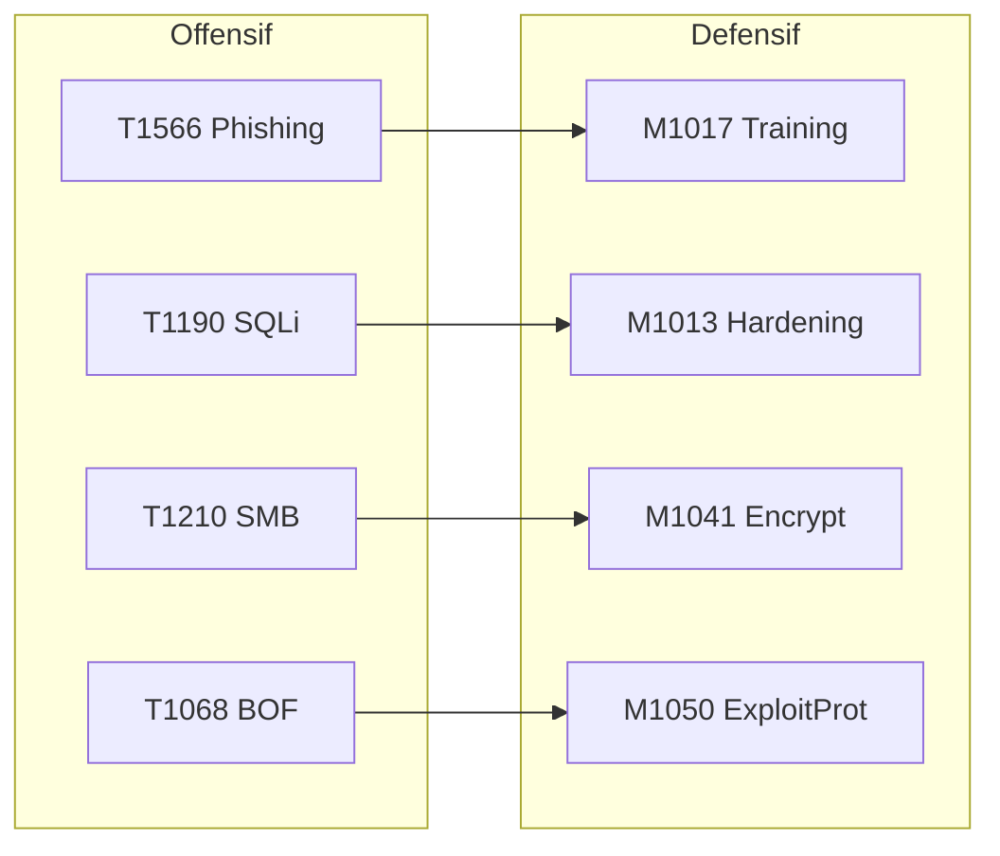
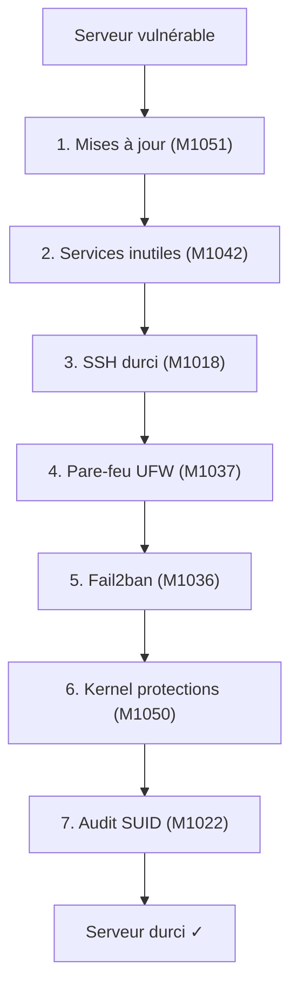

# Chapitre 04 : Contre-mesures et sécurisation des systèmes

---

## Objectifs pédagogiques

- Mapper les mesures de défense aux Mitigations ATT&CK (Mxxxx)
- Appliquer le durcissement système (hardening) sur Linux
- Évaluer et prioriser les risques avec le triangle CIA
- Construire une matrice de couverture défensive

---

## Setup rapide

```bash
if [ -f /.dockerenv ]; then
    TARGET_SSH="secure-linux" ; PORT_SSH="22"
else
    TARGET_SSH="localhost" ; PORT_SSH="2222"
fi
echo "Secure Linux SSH : $TARGET_SSH -p $PORT_SSH  (root / changeme)"
```

---

## 1. Mitigations ATT&CK — Le pendant défensif

Chaque technique offensive a des mitigations recommandées :



| Technique | Mitigation | Action concrète |
|---|---|---|
| T1566 Phishing | M1017 User Training | Formation anti-phishing |
| T1190 SQLi | M1013 App Hardening | WAF, requêtes préparées |
| T1210 SMB | M1042 Disable SMBv1 | Patch management |
| T1068 BOF | M1050 Exploit Protection | ASLR, DEP, Stack Canary |
| T1046 Nmap | M1031 IDS/IPS | Snort, Suricata |

> **Sources :** [ATT&CK Mitigations](https://attack.mitre.org/mitigations/enterprise/) — MITRE.

---

## Lab 4.1 — Durcissement complet d'un serveur Linux

### 📋 Fiche de lab

| Propriété | Valeur |
|---|---|
| **Durée** | 1h30 |
| **Conteneur** | `secure-linux` (SSH root/changeable) |
| **Dossier de travail** | `~/cours-hacking/jour-4/labs/` |
| **Mitigations** | M1051, M1037, M1036, M1050, M1022 |

### Prérequis

- [x] Conteneur lancé : `docker compose up -d --build secure-linux`
- [x] SSH accessible : `nc -z "$TARGET_SSH" "$PORT_SSH" && echo OK`
- [x] `mkdir -p ~/cours-hacking/jour-4/labs && cd ~/cours-hacking/jour-4/labs`

### Contexte

Le conteneur simule un serveur Linux fraîchement installé, volontairement vulnérable :
- SSH root autorisé avec mot de passe faible (`changeme`)
- Pas de pare-feu, pas de fail2ban, pas de protections kernel



### Étape 1 — Vérification état initial

```bash
cd ~/cours-hacking/jour-4/labs

# Test connexion SSH root par mot de passe
sshpass -p 'changeme' ssh -o StrictHostKeyChecking=no \
  -o ConnectTimeout=5 -p "$PORT_SSH" root@"$TARGET_SSH" "whoami && hostname"
# → root / [ID_conteneur]

# Vérifier services exposés
nmap -sV -p "$PORT_SSH" "$TARGET_SSH"
```

**Checkpoint A :** SSH root accessible avec mot de passe `changeme`.

### Étape 2 — Appliquer le script de durcissement

Créez `~/cours-hacking/jour-4/labs/hardening.sh` :

```bash
#!/bin/bash
set -e
echo "=== Hardening Linux — $(date) ==="

echo "[1/7] Mises à jour (M1051)..."
apt-get update && apt-get upgrade -y

echo "[2/7] Services inutiles (M1042)..."
systemctl disable bluetooth cups avahi-daemon 2>/dev/null || true

echo "[3/7] SSH durci (M1018)..."
cp /etc/ssh/sshd_config /etc/ssh/sshd_config.bak
sed -i 's/PermitRootLogin yes/PermitRootLogin no/' /etc/ssh/sshd_config
sed -i 's/#PasswordAuthentication yes/PasswordAuthentication no/' /etc/ssh/sshd_config
systemctl restart sshd 2>/dev/null || systemctl restart ssh

echo "[4/7] UFW (M1037)..."
apt-get install -y ufw
ufw default deny incoming && ufw default allow outgoing
ufw allow 22/tcp && ufw limit 22/tcp
ufw --force enable

echo "[5/7] Fail2ban (M1036)..."
apt-get install -y fail2ban
cat > /etc/fail2ban/jail.local << 'EOF'
[sshd]
enabled = true ; port = 22 ; maxretry = 3 ; bantime = 3600
EOF
systemctl restart fail2ban

echo "[6/7] Kernel (M1050)..."
cat >> /etc/sysctl.d/99-hardening.conf << 'EOF'
kernel.randomize_va_space = 2
net.ipv4.tcp_syncookies = 1
net.ipv4.conf.all.rp_filter = 1
net.ipv4.conf.all.accept_redirects = 0
EOF
sysctl -p /etc/sysctl.d/99-hardening.conf

echo "[7/7] Audit SUID (M1022)..."
find / -perm -4000 -type f -ls 2>/dev/null > /root/suid_audit.txt

echo "=== Hardening terminé ==="
```

### Étape 3 — Exécuter dans le conteneur

```bash
# Copier le script dans le conteneur
docker cp hardening.sh secure-linux-target:/root/

# Exécuter
docker exec secure-linux-target bash /root/hardening.sh
```

### Étape 4 — Vérification post-hardening

```bash
# SSH root par mot de passe doit être REFUSÉ
sshpass -p 'changeme' ssh -o StrictHostKeyChecking=no \
  -o ConnectTimeout=3 -p "$PORT_SSH" root@"$TARGET_SSH" "id" \
  && echo "ÉCHEC (encore accessible)" || echo "✓ SSH root refusé"

# UFW actif
docker exec secure-linux-target ufw status verbose

# ASLR activé
docker exec secure-linux-target cat /proc/sys/kernel/randomize_va_space
# → 2 (full randomization)

# Fail2ban
docker exec secure-linux-target fail2ban-client status sshd
# → Jail sshd active
```

### Checkpoints

- [ ] SSH root par mot de passe REFUSÉ (clé SSH obligatoire)
- [ ] UFW actif, ports filtrés
- [ ] Fail2ban configuré (maxretry=3)
- [ ] ASLR = 2

---

## 2. Évaluation des risques — Triangle CIA

```
                    CONFIDENTIALITÉ
                         ▲
                        /|\
                       / | \
                      /  |  \
                     /   |   \
                    /    |    \
                   /     |     \
           INTÉGRITÉ ◄────────► DISPONIBILITÉ
```

### Matrice de couverture défensive

```
              M1013(WAF)  M1037(FW)  M1031(IDS)  M1050(ASLR)
T1190 (SQLi)     ✅          ❌          ✅           ❌
T1210 (SMB)      ❌          ✅          ❌           ✅
T1068 (BOF)      ❌          ❌          ❌           ✅
T1566 (Phish)    ❌          ❌          ❌           ❌
──────────────────────────────────────────────────────────
Couverture       25%         25%         25%          50%

⚠ ANGLE MORT : T1566 (Phishing) — aucune mitigation
```

---

## Exercices

### Exercice 1 : Prioriser les mitigations

**Énoncé :** Budget limité, 3 mitigations maximum. Priorisez avec justification ATT&CK.

<details>
<summary><strong>Solution</strong></summary>

1. M1051 Update Software — transversale, bloque des centaines de CVE
2. M1017 User Training — couvre T1566, 1er vecteur d'accès initial
3. M1037 Firewall — réduit la surface d'attaque immédiatement
</details>

### Exercice 2 : Règle Snort SQLi

**Énoncé :** Écrivez une règle Snort détectant `UNION SELECT`.

<details>
<summary><strong>Solution</strong></summary>

```
alert tcp any any -> $HOME_NET 80 (msg:"SQLi UNION SELECT";
    flow:to_server,established;
    content:"UNION"; nocase; content:"SELECT"; nocase; distance:0;
    sid:2000001; rev:1;)
```
</details>

---

## Points clés à retenir

- Chaque technique ATT&CK a des mitigations (Mxxxx)
- Hardening = mises à jour + SSH + firewall + fail2ban + ASLR
- La matrice de couverture visualise les angles morts
- Une défense tôt dans la kill chain est plus efficace

## Pour aller plus loin

- [ATT&CK Mitigations](https://attack.mitre.org/mitigations/enterprise/)
- [CIS Benchmarks](https://www.cisecurity.org/cis-benchmarks/)
- [ANSSI — Guide d'hygiène](https://www.ssi.gouv.fr/guide/guide-dhygiene-informatique/)

---

*Chapitre précédent : [Jour 3](./JOUR-03.md)*
*Chapitre suivant : [Jour 5](./JOUR-05.md)*
