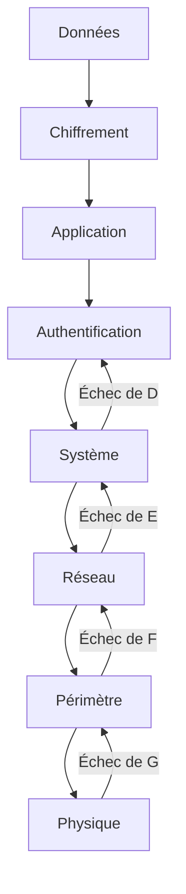
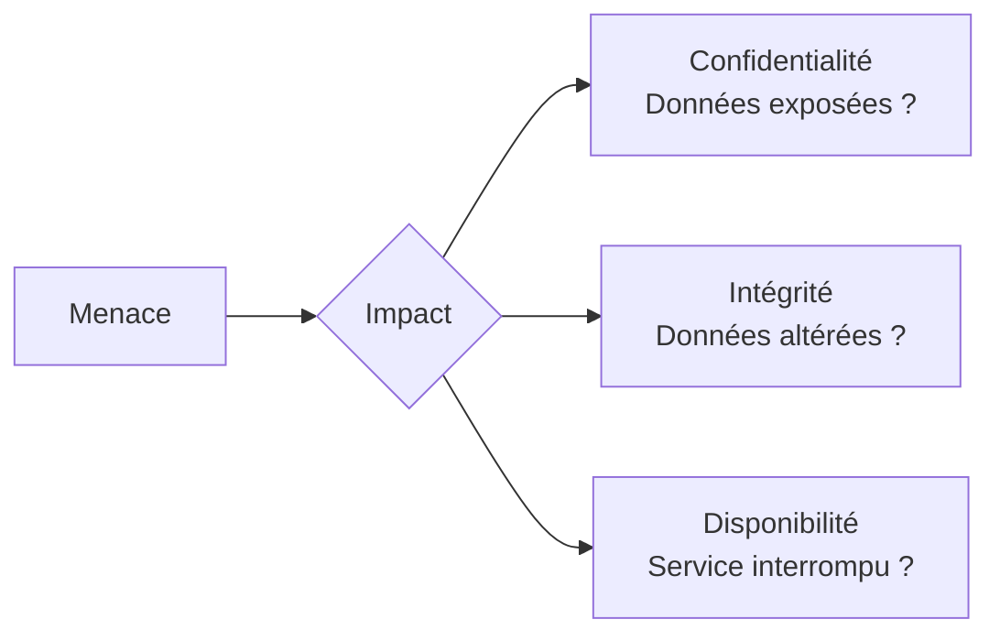

# Chapitre 04 : Contre-mesures et sécurisation des systèmes

---

## Objectifs pédagogiques

- Mettre en place des mesures de protection : chiffrement, VPN, IDS/IPS
- Appliquer le durcissement système (hardening) sur Linux et Windows
- Réduire la surface d'attaque
- Évaluer et prioriser les risques
- Analyser l'impact des attaques sur la confidentialité, l'intégrité et la disponibilité

---

## Introduction

Défendre un système est bien plus complexe que de l'attaquer. L'attaquant n'a besoin que d'une seule faille ; le défenseur doit toutes les colmater. Ce chapitre vous donne les outils et méthodologies pour protéger efficacement une infrastructure.

La sécurité ne se résume pas à déployer des outils. C'est un processus continu d'évaluation, de correction et d'amélioration, articulé autour de trois piliers fondamentaux : confidentialité, intégrité et disponibilité.

> **Sources :** [NIST Cybersecurity Framework](https://www.nist.gov/cyberframework) — NIST.

---

## Dépendances / Prérequis

- Accès administrateur Linux (Ubuntu/Debian recommandé)
- Connaissances de base en réseaux et protocoles
- Outils : `iptables`, `openssl`, `openssh-server`, `snort`, `fail2ban`
- `pip install cryptography scapy`

---

## 1. Mise en place de contre-mesures

### Le principe de défense en profondeur



Chaque couche doit avoir ses propres mécanismes de défense. Si une couche cède, les suivantes prennent le relais.

### Chiffrement

Le chiffrement protège la confidentialité des données au repos et en transit.

```python
#!/usr/bin/env python3
"""Chiffrement symétrique avec AES-GCM."""

from cryptography.hazmat.primitives.ciphers.aead import AESGCM
import os

def encrypt_aes_gcm(key: bytes, plaintext: bytes) -> tuple:
    """Chiffre des données avec AES-256-GCM."""
    aesgcm = AESGCM(key)
    nonce = os.urandom(12)  # 96 bits recommandés pour GCM
    ciphertext = aesgcm.encrypt(nonce, plaintext, None)
    return (nonce, ciphertext)

def decrypt_aes_gcm(key: bytes, nonce: bytes, ciphertext: bytes) -> bytes:
    """Déchiffre des données avec AES-256-GCM."""
    aesgcm = AESGCM(key)
    return aesgcm.decrypt(nonce, ciphertext, None)

# Test
key = AESGCM.generate_key(bit_length=256)
message = b"Confidential data to protect"

nonce, ciphertext = encrypt_aes_gcm(key, message)
decrypted = decrypt_aes_gcm(key, nonce, ciphertext)

print(f"Original   : {message.decode()}")
print(f"Chiffré    : {ciphertext.hex()[:40]}...")
print(f"Déchiffré  : {decrypted.decode()}")
assert message == decrypted, "Échec du chiffrement"
print("Chiffrement AES-GCM OK ✓")
```

**Résultat attendu :**
```
Original   : Confidential data to protect
Chiffré    : [hex aléatoire]...
Déchiffré  : Confidential data to protect
Chiffrement AES-GCM OK ✓
```

> **Sources :** [Cryptography.io Documentation](https://cryptography.io/en/latest/) — PyCA.

### VPN (Virtual Private Network)

Un VPN crée un tunnel chiffré entre deux points du réseau, protégeant le trafic des écoutes.

```bash
# Installation OpenVPN
sudo apt install openvpn easy-rsa

# Génération des certificats
make-cadir ~/openvpn-ca
cd ~/openvpn-ca
./easyrsa init-pki
./easyrsa build-ca
./easyrsa gen-req server nopass
./easyrsa sign-req server server
```

### IDS/IPS — Snort

Snort est un système de détection/prévention d'intrusion réseau open source.

```bash
# Installation
sudo apt install snort

# Configuration de base
sudo nano /etc/snort/snort.conf
# ipvar HOME_NET 192.168.1.0/24

# Test de configuration
sudo snort -T -c /etc/snort/snort.conf

# Lancement en mode IDS
sudo snort -A console -q -c /etc/snort/snort.conf -i eth0
```

---

## 2. Durcissement des systèmes (Hardening)

### Durcissement Linux

```bash
#!/bin/bash
# Script de durcissement basique Linux

# 1. Mises à jour
sudo apt update && sudo apt upgrade -y

# 2. Désactiver les services inutiles
sudo systemctl disable bluetooth
sudo systemctl disable cups
sudo systemctl disable avahi-daemon

# 3. Configuration SSH sécurisée
sudo sed -i 's/#PermitRootLogin prohibit-password/PermitRootLogin no/' /etc/ssh/sshd_config
sudo sed -i 's/#PasswordAuthentication yes/PasswordAuthentication no/' /etc/ssh/sshd_config
sudo sed -i 's/#Port 22/Port 2222/' /etc/ssh/sshd_config
sudo systemctl restart sshd

# 4. Configuration du pare-feu
sudo ufw default deny incoming
sudo ufw default allow outgoing
sudo ufw allow 2222/tcp
sudo ufw limit 2222/tcp  # Rate limiting pour SSH
sudo ufw enable

# 5. Installation de fail2ban
sudo apt install fail2ban -y
sudo systemctl enable fail2ban
sudo systemctl start fail2ban

# 6. Configuration du kernel
sudo sysctl -w kernel.randomize_va_space=2  # ASLR
sudo sysctl -w net.ipv4.tcp_syncookies=1    # SYN cookies
sudo sysctl -w net.ipv4.conf.all.rp_filter=1 # Anti-spoofing

# 7. Vérification des permissions
sudo find / -perm -4000 -type f -exec ls -la {} \; 2>/dev/null
sudo find / -type f \( -perm -4000 -o -perm -2000 \) -exec ls -la {} \; 2>/dev/null
```

### Durcissement Windows (PowerShell)

```powershell
# Durcissement basique Windows
# 1. Désactiver SMBv1
Set-SmbServerConfiguration -EnableSMB1Protocol $false -Force

# 2. Activer Windows Defender Firewall
Set-NetFirewallProfile -Profile Domain,Public,Private -Enabled True

# 3. Configurer la politique de mot de passe
secedit /export /cfg C:\secpol.cfg
# Modifier le fichier puis importer
secedit /configure /db C:\Windows\security\local.sdb /cfg C:\secpol.cfg

# 4. Auditer les partages réseau
Get-SmbShare | Format-Table Name, Path, Description
```

> **Sources :** [CIS Benchmarks](https://www.cisecurity.org/cis-benchmarks/) — Center for Internet Security.

---

## 3. Évaluation des risques

### Le modèle CIA (Confidentialité, Intégrité, Disponibilité)



### Formulation du risque

$$
\text{Risque} = \text{Probabilité} \times \text{Impact}
$$

Où :
- $\text{Probabilité}$ : vraisemblance que la menace se concrétise (0 à 1)
- $\text{Impact}$ : gravité des conséquences sur l'activité (1 à 5)
- $\text{Risque}$ : niveau de criticité global

> **Explication de la formule :** Un risque faible peut être accepté ; un risque élevé exige des mesures immédiates. La formule permet de prioriser les actions correctives.

### Matrice de criticité

| | Impact 1 | Impact 2 | Impact 3 | Impact 4 | Impact 5 |
|---|---|---|---|---|---|
| **Prob. 90%** | 0.9 | 1.8 | 2.7 | 3.6 | **4.5** |
| **Prob. 70%** | 0.7 | 1.4 | 2.1 | **2.8** | 3.5 |
| **Prob. 50%** | 0.5 | 1.0 | 1.5 | 2.0 | 2.5 |
| **Prob. 30%** | 0.3 | 0.6 | 0.9 | 1.2 | 1.5 |
| **Prob. 10%** | 0.1 | 0.2 | 0.3 | 0.4 | 0.5 |

**Légende :** Risque ≥ 2.5 = Critique. Risque ≥ 1.5 = Élevé. Risque < 1.0 = Faible.

---

## 4. Analyse des impacts sur le triangle CIA

### Exemple d'analyse post-incident

```python
#!/usr/bin/env python3
"""Analyse d'impact CIA post-attaque."""

class ImpactAnalysis:
    def __init__(self, incident_name: str):
        self.name = incident_name
        self.scores = {"C": 0, "I": 0, "A": 0}
    
    def assess_confidentiality(self, data_exposed: bool, sensitivity: int) -> int:
        """Évalue l'impact sur la confidentialité (1-5)."""
        if not data_exposed:
            return 0
        return min(sensitivity, 5)
    
    def assess_integrity(self, data_modified: bool, criticality: int) -> int:
        """Évalue l'impact sur l'intégrité (1-5)."""
        if not data_modified:
            return 0
        return min(criticality, 5)
    
    def assess_availability(self, downtime_hours: float) -> int:
        """Évalue l'impact sur la disponibilité (1-5)."""
        if downtime_hours < 1:
            return 1
        elif downtime_hours < 4:
            return 2
        elif downtime_hours < 12:
            return 3
        elif downtime_hours < 24:
            return 4
        else:
            return 5
    
    def total_impact(self) -> dict:
        return {
            "confidentialite": self.scores["C"],
            "integrite": self.scores["I"],
            "disponibilite": self.scores["A"],
            "score_total": sum(self.scores.values()),
            "criticite": "CRITIQUE" if sum(self.scores.values()) >= 10 else "ELEVEE" if sum(self.scores.values()) >= 7 else "MODEREE" if sum(self.scores.values()) >= 4 else "FAIBLE"
        }

# Exemple : attaque ransomware
incident = ImpactAnalysis("Ransomware")
incident.scores["C"] = incident.assess_confidentiality(True, 4)
incident.scores["I"] = incident.assess_integrity(True, 5)
incident.scores["A"] = incident.assess_availability(48)

import json
print(json.dumps(incident.total_impact(), indent=2))
```

**Résultat attendu :**
```
{
  "confidentialite": 4,
  "integrite": 5,
  "disponibilite": 5,
  "score_total": 14,
  "criticite": "CRITIQUE"
}
```

---

## Exercices

### Exercice 1 : Durcissement d'un serveur Linux

**Énoncé :** Appliquez une checklist de durcissement sur une VM Linux (désactivation services, SSH, fail2ban, ufw, mises à jour). Documentez chaque action.

<details>
<summary><strong>Solution</strong></summary>

```bash
# Appliquer le script de durcissement fourni ci-dessus
# Vérifier chaque étape :

# 1. SSH : tenter une connexion root
ssh root@localhost  # Doit être refusé

# 2. Fail2ban : vérifier le statut
sudo fail2ban-client status sshd

# 3. UFW : vérifier les règles
sudo ufw status verbose

# 4. Services désactivés
sudo systemctl status bluetooth  # Doit être inactive/dead
```
</details>

### Exercice 2 : Analyse de risque CIA

**Énoncé :** À partir d'un scénario d'attaque (exfiltration de BDD clients), réalisez une analyse d'impact CIA et proposez des mesures correctives prioritaires.

<details>
<summary><strong>Solution</strong></summary>

| Pilier | Impact | Score | Justification |
|--------|--------|-------|---------------|
| C | Données clients exfiltrées | 5 | RGPD, perte de confiance |
| I | Base non modifiée | 0 | Intégrité préservée |
| A | Service maintenu | 0 | Pas d'interruption |
| **Total** | | **5** | Risque ÉLEVÉ |

**Actions prioritaires :**
1. Corriger la vulnérabilité d'injection SQL
2. Chiffrer la base de données au repos
3. Mettre en place un WAF
4. Notifier la CNIL (obligation RGPD)
</details>

---

## Lab : Configuration d'outils de sécurité

**Durée estimée :** 1h30

**Contexte :** VM Linux vierge à sécuriser.

### Objectif

Déployer une infrastructure de défense complète sur un serveur Linux : pare-feu, IDS, durcissement, surveillance.

### Instructions

1. Configurer iptables/ufw avec politique de défaut DROP
2. Déployer et configurer Snort en mode IDS
3. Appliquer le script de durcissement
4. Mettre en place fail2ban avec règles personnalisées
5. Vérifier la configuration avec un scan nmap externe

### Validation

```bash
# Test du pare-feu : vérifier que seuls les ports autorisés sont ouverts
nmap -sV localhost

# Test de fail2ban : simuler des échecs d'authentification SSH
ssh root@localhost  # échouer plusieurs fois volontairement
sudo fail2ban-client status sshd  # Doit montrer l'IP bannie

# Test de Snort : déclencher une alerte
curl "http://localhost/test.php?id=1' OR '1'='1"
sudo cat /var/log/snort/alert
```

---

## Points clés à retenir

- La défense en profondeur superpose plusieurs couches de protection
- Le chiffrement est la base : au repos (AES) comme en transit (TLS, VPN)
- Le durcissement réduit drastiquement la surface d'attaque
- L'évaluation des risques (Probabilité × Impact) guide la priorisation des actions
- L'analyse CIA (Confidentialité, Intégrité, Disponibilité) structure le bilan post-incident
- La sécurité n'est jamais acquise : c'est un processus continu d'amélioration

## Pour aller plus loin

- [ANSSI - Guide d'hygiène informatique](https://www.ssi.gouv.fr/guide/guide-dhygiene-informatique/)
- [CIS Benchmarks Linux](https://www.cisecurity.org/benchmark/ubuntu_linux/)
- [NIST SP 800-53 Security Controls](https://csrc.nist.gov/publications/detail/sp/800-53/rev-5/final)

---

*Chapitre précédent : [Jour 3 — Vulnérabilités avancées](./JOUR-03.md)*
*Chapitre suivant : [Jour 5 — Reporting et gestion des incidents](./JOUR-05.md)*
