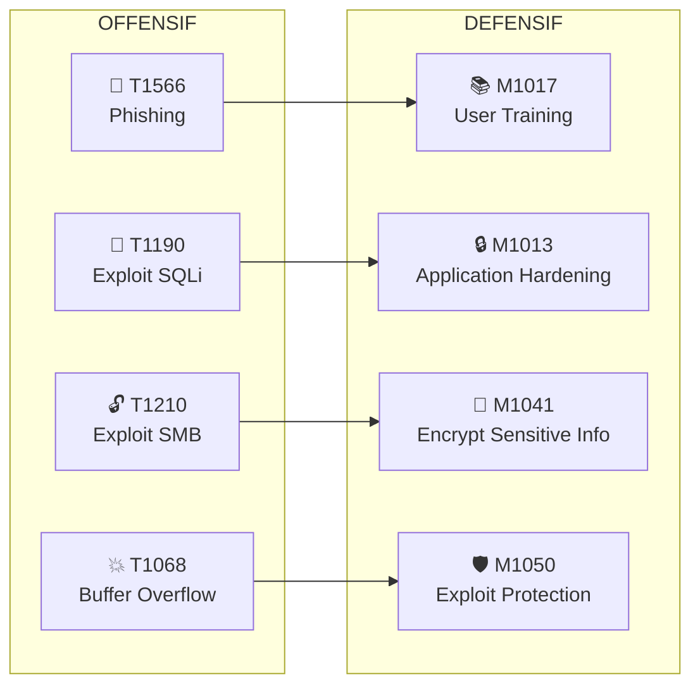

# Chapitre 04 : Contre-mesures et sécurisation des systèmes

---

## Objectifs pédagogiques

- Mapper les mesures de défense aux Mitigations ATT&CK (Mxxxx)
- Mettre en place chiffrement, VPN, IDS/IPS et pare-feu
- Appliquer le durcissement système (hardening) sur Linux
- Évaluer et prioriser les risques avec le triangle CIA
- Calculer la couverture défensive via une matrice superposant défenses et techniques ATT&CK

---

## Introduction

Défendre est plus difficile qu'attaquer. L'attaquant n'a besoin que d'une seule faille ; le défenseur doit toutes les colmater. La bonne nouvelle : MITRE ATT&CK ne documente pas seulement les techniques offensives — il référence aussi les **Mitigations** (ID commençant par Mxxxx) pour chaque technique.

Ce chapitre adopte le point de vue du défenseur. À chaque technique d'attaque vue dans les chapitres précédents, vous associerez une mitigation concrète. L'objectif : construire une **matrice de couverture défensive** qui permet de visualiser en un coup d'œil vos angles morts.

> **Sources :** [ATT&CK Mitigations](https://attack.mitre.org/mitigations/enterprise/) — MITRE. [NIST Cybersecurity Framework](https://www.nist.gov/cyberframework) — NIST.

---

## Dépendances / Prérequis

- Docker Compose — lancer le conteneur de durcissement :
  ```bash
  docker-compose up -d --build secure-linux
  ```
- Connaissances Linux administration (bases)
- Chapitres 1-3 terminés

---

## 1. Mitigations ATT&CK — Le pendant défensif

### Principe

Chaque technique offensive ATT&CK possède une ou plusieurs **mitigations** recommandées. Une mitigation est une mesure de sécurité qui empêche, détecte ou limite une technique.



### Tableau de mapping Attaque → Mitigation

```
┌──────────────────────────────────────────────────────────────────┐
│           MAPPING TECHNIQUES OFFENSIVES → MITIGATIONS            │
├──────────────────┬─────────────────────┬─────────────────────────┤
│ Technique (T)    │ Mitigation (M)      │ Action concrète         │
├──────────────────┼─────────────────────┼─────────────────────────┤
│ T1566 Phishing   │ M1017 User Training │ Formation anti-phishing │
│ T1190 Exploit App│ M1013 App Hardening │ WAF, validation entrées │
│ T1190 SQLi       │ M1041 Encrypt Info  │ Prepared statements     │
│ T1210 SMB Exploit│ M1042 Disable SMBv1 │ GPO/patch management    │
│ T1068 Buffer Ovf │ M1050 Exploit Prot. │ ASLR, DEP, Stack Canary │
│ T1046 Nmap Scan  │ M1031 IDS/IPS       │ Snort, Suricata alerts  │
│ T1027 Obfuscation│ M1049 Antivirus     │ Analyse heuristique     │
│ T1572 Tunneling  │ M1037 Firewall      │ Règles restrictives     │
│ T1059 Unix Shell │ M1038 Exec Prev     │ AppLocker, SELinux      │
│ T1098 SSH Key    │ M1027 Accnt Mgmt   │ Rotation de clés        │
└──────────────────┴─────────────────────┴─────────────────────────┘
```

> **Sources :** [ATT&CK Mitigations List](https://attack.mitre.org/mitigations/enterprise/).

---

## 2. Mesures de protection

### Chiffrement — M1041 Encrypt Sensitive Information

```python
#!/usr/bin/env python3
"""Chiffrement symétrique AES-256-GCM avec authentification."""

from cryptography.hazmat.primitives.ciphers.aead import AESGCM
import os

def encrypt(plaintext: bytes) -> tuple:
    key = AESGCM.generate_key(bit_length=256)
    aesgcm = AESGCM(key)
    nonce = os.urandom(12)
    ciphertext = aesgcm.encrypt(nonce, plaintext, None)
    return key, nonce, ciphertext

def decrypt(key: bytes, nonce: bytes, ciphertext: bytes) -> bytes:
    aesgcm = AESGCM(key)
    return aesgcm.decrypt(nonce, ciphertext, None)

# Test
key, nonce, ct = encrypt(b"donnees_confidentielles")
pt = decrypt(key, nonce, ct)
print(f"Original : donnees_confidentielles")
print(f"Chiffré  : {ct.hex()[:40]}...")
print(f"Déchiffré: {pt.decode()}")
assert pt == b"donnees_confidentielles"
print("✓ AES-256-GCM OK")
```

### VPN — M1020 SSL/TLS Inspection, M1030 Network Segmentation

Un VPN crée un tunnel chiffré et authentifié entre deux points.

```bash
# WireGuard — VPN moderne et léger
sudo apt install wireguard

# Génération des clés
wg genkey | tee privatekey | wg pubkey > publickey

# Configuration serveur (/etc/wireguard/wg0.conf)
cat <<EOF > /etc/wireguard/wg0.conf
[Interface]
Address = 10.0.0.1/24
ListenPort = 51820
PrivateKey = $(cat privatekey)

[Peer]
PublicKey = <CLE_PUBLIQUE_CLIENT>
AllowedIPs = 10.0.0.2/32
EOF

sudo wg-quick up wg0
```

### IDS/IPS — M1031 Network Intrusion Prevention

Snort analyse le trafic réseau en temps réel et détecte les signatures d'attaque.

```
┌──────────────────────────────────────────────────────┐
│              SNORT — Architecture IDS                 │
├──────────────────────────────────────────────────────┤
│                                                      │
│   🌐 Internet ──► 🧱 Firewall ──► 🔍 Snort ──► 🖥️ LAN│
│                         │          │                 │
│                    Règles L3/L4  Règles L7           │
│                    (IP, ports)   (signatures)         │
│                                                      │
│   Mode IDS   : Snort écoute et alerte (passif)       │
│   Mode IPS   : Snort bloque le trafic (actif)        │
│                                                      │
└──────────────────────────────────────────────────────┘
```

```bash
# Installation
sudo apt install snort

# Configuration basique
sudo nano /etc/snort/snort.conf

# Règles personnalisées (/etc/snort/rules/local.rules)
alert tcp any any -> $HOME_NET 22 (msg:"SSH Brute Force";
    flow:to_server; threshold:type threshold, track by_src,
    count 5, seconds 60; sid:1000001;)

# Test de configuration
sudo snort -T -c /etc/snort/snort.conf

# Lancement
sudo snort -A console -q -c /etc/snort/snort.conf -i eth0
```

> **Sources :** [Snort Documentation](https://www.snort.org/documents). [WireGuard](https://www.wireguard.com/).

---

## 3. Durcissement système — M1051 Update Software, M1050 Exploit Protection

### Le conteneur secure-linux

```bash
# Lancer le conteneur à durcir
docker-compose up -d --build secure-linux

# Le conteneur expose SSH sur le port 2222
# Login : root / changeme

ssh root@localhost -p 2222
```

Ce conteneur simule un serveur Linux fraîchement installé, volontairement vulnérable (SSH root par mot de passe, pas de firewall, pas de fail2ban). Vous allez le durcir étapes par étapes.

### Checklist de durcissement Linux

```
┌──────────────────────────────────────────────────────────────┐
│                 CHECKLIST HARDENING LINUX                     │
├──────┬───────────────────────────────┬────────────────────────┤
│ Étape│ Action                        │ Mitigation ATT&CK      │
├──────┼───────────────────────────────┼────────────────────────┤
│  1   │ Mise à jour du système        │ M1051 Update Software  │
│  2   │ Désactiver les services inut. │ M1042 Disable Service  │
│  3   │ Durcir la configuration SSH   │ M1018 User Account Mgmt│
│  4   │ Configurer le pare-feu (UFW)  │ M1037 Network Segreg.  │
│  5   │ Installer et config fail2ban  │ M1036 Account Use Pol. │
│  6   │ Activer l'ASLR et protections │ M1050 Exploit Prot.    │
│  7   │ Auditer les SUID              │ M1022 Restrict Perm.   │
│  8   │ Vérifier les permissions      │ M1022 Restrict Perm.   │
└──────┴───────────────────────────────┴────────────────────────┘
```

### Script de durcissement exécutable

```bash
#!/bin/bash
# hardening.sh — Durcissement Linux automatisé
# Exécuter avec : sudo bash hardening.sh

set -e
echo "=== Hardening Linux — $(date) ==="

# 1. Mises à jour (M1051)
echo "[1/8] Mise à jour système..."
apt update && apt upgrade -y

# 2. Désactiver les services inutiles (M1042)
echo "[2/8] Désactivation services inutiles..."
systemctl disable bluetooth 2>/dev/null || true
systemctl disable cups 2>/dev/null || true
systemctl disable avahi-daemon 2>/dev/null || true

# 3. Durcissement SSH (M1018)
echo "[3/8] Durcissement SSH..."
cp /etc/ssh/sshd_config /etc/ssh/sshd_config.bak
sed -i 's/#PermitRootLogin prohibit-password/PermitRootLogin no/' /etc/ssh/sshd_config
sed -i 's/#PasswordAuthentication yes/PasswordAuthentication no/' /etc/ssh/sshd_config
sed -i 's/#Port 22/Port 2222/' /etc/ssh/sshd_config
systemctl restart sshd 2>/dev/null || systemctl restart ssh

# 4. Pare-feu UFW (M1037)
echo "[4/8] Configuration pare-feu..."
apt install ufw -y
ufw default deny incoming
ufw default allow outgoing
ufw allow 2222/tcp
ufw limit 2222/tcp
ufw --force enable

# 5. Fail2ban (M1036)
echo "[5/8] Installation fail2ban..."
apt install fail2ban -y
cat > /etc/fail2ban/jail.local << EOF
[sshd]
enabled = true
port = 2222
maxretry = 3
bantime = 3600
findtime = 600
EOF
systemctl enable fail2ban
systemctl restart fail2ban

# 6. Protections kernel (M1050)
echo "[6/8] Activation protections kernel..."
cat >> /etc/sysctl.d/99-hardening.conf << EOF
kernel.randomize_va_space = 2       # ASLR
net.ipv4.tcp_syncookies = 1         # SYN cookies
net.ipv4.conf.all.rp_filter = 1    # Anti-spoofing
net.ipv4.conf.all.accept_redirects = 0
net.ipv4.conf.all.send_redirects = 0
kernel.kptr_restrict = 2
kernel.dmesg_restrict = 1
EOF
sysctl -p /etc/sysctl.d/99-hardening.conf

# 7. Audit SUID (M1022)
echo "[7/8] Audit fichiers SUID..."
find / -perm -4000 -type f -exec ls -la {} \; 2>/dev/null > /root/suid_audit.txt
echo "Fichiers SUID listés dans /root/suid_audit.txt"

# 8. Permissions (M1022)
echo "[8/8] Vérification permissions..."
chmod 600 /etc/shadow
chmod 644 /etc/passwd

echo "=== Hardening terminé ==="
echo "Vérification :"
ufw status verbose
systemctl status fail2ban | head -5
cat /proc/sys/kernel/randomize_va_space  # Doit afficher 2
```

### Vérification post-hardening

```bash
# Avant hardening : nmap doit trouver le port 22 ouvert
nmap -sV -p 22,2222 localhost -P0

# Après hardening : vérifier que :
# - SSH root est refusé :
ssh root@localhost -p 2222  # → Permission denied (si hardening fait)
# - Fail2ban est actif :
fail2ban-client status sshd
# - UFW bloque les ports non autorisés :
ufw status verbose
# - ASLR est actif :
cat /proc/sys/kernel/randomize_va_space  # → 2
```

> **Sources :** [CIS Benchmarks — Ubuntu Linux](https://www.cisecurity.org/benchmark/ubuntu_linux/). [ANSSI — Guide d'hygiène informatique](https://www.ssi.gouv.fr/guide/guide-dhygiene-informatique/).

---

## 4. Évaluation des risques — Modèle CIA

### Le triangle CIA (Confidentialité, Intégrité, Disponibilité)

```
                    CONFIDENTIALITÉ
                    (données protégées
                    des accès illégitimes)
                         ▲
                        /|\
                       / | \
                      /  |  \
                     /   |   \
                    /    |    \
                   /     |     \
                  /      |      \
                 /       |       \
                ──────────────────
        INTÉGRITÉ ◄────────────► DISPONIBILITÉ
   (données exactes,         (service accessible
    non altérées)             quand nécessaire)
```

Toute attaque impacte un ou plusieurs piliers du triangle CIA. L'analyse d'impact consiste à évaluer le score sur chaque pilier.

### Analyse d'impact post-incident

```python
#!/usr/bin/env python3
"""Analyse d'impact CIA — post incident."""

class ImpactCIA:
    def __init__(self, incident: str):
        self.nom = incident
        self.scores = {"C": 0, "I": 0, "A": 0}

    def eval_confidentialite(self, donnees_exposees: bool, sensibilite: int):
        self.scores["C"] = sensibilite if donnees_exposees else 0
        return self

    def eval_integrite(self, donnees_alterees: bool, criticite: int):
        self.scores["I"] = criticite if donnees_alterees else 0
        return self

    def eval_disponibilite(self, duree_indispo_heures: float):
        if duree_indispo_heures < 1:   self.scores["A"] = 1
        elif duree_indispo_heures < 4:  self.scores["A"] = 2
        elif duree_indispo_heures < 12: self.scores["A"] = 3
        elif duree_indispo_heures < 24: self.scores["A"] = 4
        else:                           self.scores["A"] = 5
        return self

    def bilan(self):
        total = sum(self.scores.values())
        if total >= 10:  criticite = "CRITIQUE"
        elif total >= 7: criticite = "ÉLEVÉE"
        elif total >= 4: criticite = "MODÉRÉE"
        else:            criticite = "FAIBLE"
        return {
            "incident": self.nom,
            "confidentialite": self.scores["C"],
            "integrite": self.scores["I"],
            "disponibilite": self.scores["A"],
            "score_total": total,
            "criticite": criticite
        }

# Exemple : attaque ransomware
ransomware = (ImpactCIA("Ransomware")
    .eval_confidentialite(True, 4)
    .eval_integrite(True, 5)
    .eval_disponibilite(48))

# Exemple : défacement web
defacement = (ImpactCIA("Defacement site vitrine")
    .eval_confidentialite(False, 0)
    .eval_integrite(True, 3)
    .eval_disponibilite(2))

# Exemple : vol de BDD clients via SQLi
sqli = (ImpactCIA("Vol BDD clients via SQLi")
    .eval_confidentialite(True, 5)
    .eval_integrite(False, 0)
    .eval_disponibilite(0))

print("=== Analyses CIA ===")
for incident in [ransomware, defacement, sqli]:
    print(incident.bilan())
```

**Résultat attendu :**

```
=== Analyses CIA ===
{'incident': 'Ransomware', 'C': 4, 'I': 5, 'A': 5, 'total': 14, 'criticite': 'CRITIQUE'}
{'incident': 'Defacement', 'C': 0, 'I': 3, 'A': 2, 'total': 5, 'criticite': 'MODEREE'}
{'incident': 'Vol BDD clients via SQLi', 'C': 5, 'I': 0, 'A': 0, 'total': 5, 'criticite': 'MODEREE'}
```

### Matrice de couverture défensive

L'objectif final est de croiser vos défenses avec les techniques ATT&CK pour identifier les **angles morts**.

```
┌────────────────────────────────────────────────────────────────────┐
│               MATRICE DE COUVERTURE DÉFENSIVE                      │
├──────────────────────┬──────────┬──────────┬──────────┬───────────┤
│ Technique \ Défense  │ M1013    │ M1037    │ M1031    │ M1050     │
│                      │ WAF      │ Firewall │ IDS/IPS  │ Expl.Prot │
├──────────────────────┼──────────┼──────────┼──────────┼───────────┤
│ T1190 (SQLi)         │ ✅       │ ❌       │ ✅       │ ❌        │
│ T1210 (SMB exploit)  │ ❌       │ ✅       │ ❌       │ ✅        │
│ T1068 (Buffer Overf) │ ❌       │ ❌       │ ❌       │ ✅        │
│ T1566 (Phishing)     │ ❌       │ ❌       │ ❌       │ ❌        │
├──────────────────────┼──────────┼──────────┼──────────┼───────────┤
│ Couverture           │ 25%      │ 25%      │ 25%      │ 50%       │
└──────────────────────┴──────────┴──────────┴──────────┴───────────┘

ANGLE MORT : T1566 (Phishing) — aucune mitigation déployée
```

---

## Lab 4 : Durcissement complet d'un serveur

**Durée estimée :** 1h30

**Contexte :** Conteneur `secure-linux`, machine Kali.

### Objectif

Appliquer la checklist de durcissement complète et vérifier la couverture défensive avec une matrice ATT&CK.

### Étape 1 — Scan initial (état vulnérable)

```bash
docker-compose up -d --build secure-linux
nmap -sV -p 2222 localhost -P0

# Résultat attendu : SSH root accessible par mot de passe
ssh root@localhost -p 2222   # password: changeme
```

### Étape 2 — Appliquer le script de durcissement

```bash
# Copier le script dans le conteneur
docker cp hardening.sh secure-linux-target:/root/
docker exec -it secure-linux-target bash
cd /root
bash hardening.sh
```

### Étape 3 — Vérification post-hardening

```bash
# SSH root refusé ?
ssh root@localhost -p 2222  # Doit échouer (clé SSH requise)

# UFW actif ?
docker exec secure-linux-target ufw status verbose

# ASLR actif ?
docker exec secure-linux-target cat /proc/sys/kernel/randomize_va_space
# → 2 (full randomization)

# Fail2ban ?
docker exec secure-linux-target fail2ban-client status sshd
```

### Étape 4 — Construire la matrice de couverture

Remplissez cette matrice avec les mitigations déployées :

| Technique | M1051 (Updates) | M1037 (Firewall) | M1036 (fail2ban) | M1050 (ASLR) | M1022 (SUID audit) |
|---|---|---|---|---|---|
| T1190 (SQLi) | | | | | |
| T1068 (Buf.Overf) | | | | | |
| T1110 (Brute Force) | | | | | |
| T1098 (SSH key) | | | | | |

### Checkpoints

- [ ] Script de durcissement exécuté sans erreur
- [ ] Authentification SSH root désactivée
- [ ] UFW actif avec ports filtrés
- [ ] fail2ban configuré pour SSH
- [ ] ASLR activé (valeur 2)
- [ ] Matrice de couverture défensive complétée

### Erreurs fréquentes

- **SSH bloque tout** → on a changé le port en 2222 et désactivé root, mais le conteneur n'a pas d'autre user → pour le lab, garder `PermitRootLogin yes` avec clé uniquement, ou créer un user
- **UFW bloque le port 2222** → bien faire `ufw allow 2222/tcp` avant `ufw enable`
- **ASLR reste à 0** → certaines configurations Docker nécessitent `--privileged` : ajouter `privileged: true` dans docker-compose pour secure-linux

---

## Exercices

### Exercice 1 : Créer une règle Snort personnalisée

**Énoncé :** Écrivez une règle Snort qui détecte les tentatives d'injection SQL (mot-clé UNION SELECT).

<details>
<summary><strong>Solution</strong></summary>

```
alert tcp any any -> $HOME_NET 80 (msg:"SQL Injection - UNION SELECT detected";
    flow:to_server,established;
    content:"UNION"; nocase;
    content:"SELECT"; nocase; distance:0;
    sid:2000001; rev:1;)
```

Placer dans `/etc/snort/rules/local.rules` et tester :
```bash
curl "http://localhost:8080/?id=1 UNION SELECT null,null--"
sudo snort -A console -c /etc/snort/snort.conf -i eth0
```
</details>

### Exercice 2 : Analyse CIA d'un incident

**Énoncé :** Un attaquant exploite une injection SQL, extrait la base clients, et la revend sur le dark web. L'application reste fonctionnelle. Analysez l'impact CIA.

<details>
<summary><strong>Solution</strong></summary>

| Pilier | Impact | Score | Justification |
|---|---|---|---|
| Confidentialité | Données clients exposées | 5 | RGPD, perte de confiance, usurpation identité |
| Intégrité | Base non modifiée | 0 | L'attaquant a lu sans écrire |
| Disponibilité | Application fonctionnelle | 0 | Pas d'interruption |
| **Total** | | **5** | MODÉRÉ en CIA pur, mais CRITIQUE en risque métier (RGPD) |

Note : l'analyse CIA ne capture pas la conformité réglementaire. Le risque métier (amendes CNIL, réputation) dépasse le score CIA technique.
</details>

### Exercice 3 : Prioriser les mitigations

**Énoncé :** Avec un budget limité, vous devez choisir 3 mitigations parmi celles listées. Priorisez en justifiant avec ATT&CK.

<details>
<summary><strong>Solution</strong></summary>

Priorité 1 : **M1051 Update Software** — la plus transversale, bloque des centaines de CVE
Priorité 2 : **M1017 User Training** — couvre tout le spearphishing (T1566), 1er vecteur d'accès initial
Priorité 3 : **M1037 Firewall** — réduit la surface d'attaque réseau immédiatement

Justification : ces 3 mitigations couvrent les 3 premières tactiques de la kill chain (Initial Access, Execution, Persistence). Une défense qui arrête l'attaquant tôt est plus efficace qu'une défense qui le poursuit.
</details>

---

## Points clés à retenir

- Chaque technique ATT&CK a des mitigations (ID Mxxxx) documentées — utilisez-les comme checklist
- Le durcissement système (hardening) est la base de toute posture défensive : mises à jour, SSH, firewall, fail2ban, ASLR
- Le triangle CIA structure l'analyse d'impact : un incident peut être critique même avec un score CIA modéré (ex: RGPD)
- La matrice de couverture défensive visualise vos angles morts
- Un firewall ne bloque pas une injection SQL, un WAF ne bloque pas un scan réseau — d'où la défense en profondeur

## Pour aller plus loin

- [MITRE ATT&CK Mitigations](https://attack.mitre.org/mitigations/enterprise/)
- [CIS Benchmarks](https://www.cisecurity.org/cis-benchmarks/)
- [ANSSI — Guide d'hygiène informatique](https://www.ssi.gouv.fr/guide/guide-dhygiene-informatique/)
- [MITRE D3FEND — contremesures techniques](https://d3fend.mitre.org/)

---

*Chapitre précédent : [Jour 3 — Vulnérabilités avancées](./JOUR-03.md)*
*Chapitre suivant : [Jour 5 — Reporting et gestion des incidents](./JOUR-05.md)*
