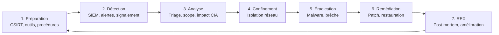

# Chapitre 05 : Reporting, gestion des incidents et conformité — Techniques de hacking et contre-mesures - Niveau 1

---

## Objectifs pédagogiques

- Rédiger un rapport de pentest professionnel tagué ATT&CK
- Maîtriser la notation CVSS v3.1 pour standardiser la criticité
- Détecter, analyser et répondre aux incidents de sécurité
- Reconstruire la kill chain ATT&CK d'un attaquant
- Connaître les obligations réglementaires : NIS2, RGPD, RGS

---

## Introduction

Un pentest sans rapport n'a aucune valeur juridique. Le rapport est le **livrable réglementaire** qui conditionne l'homologation (RGS) et prouve la conformité (NIS2). Face à un incident, les délais de notification sont contraignants : 24h pour l'alerte, 72h pour le rapport complet.

Ce chapitre vous donne les outils pour communiquer vos résultats avec impact et structurer une réponse aux incidents conforme aux exigences européennes et françaises.

> **Sources :** [NIST SP 800-61r2](https://nvlpubs.nist.gov/nistpubs/SpecialPublications/NIST.SP.800-61r2.pdf). [CVSS v3.1](https://www.first.org/cvss/v3-1/). [NIS2 Directive 2022/2555](https://eur-lex.europa.eu/eli/dir/2022/2555).

---

## 1. CVSS — Notation standardisée des vulnérabilités

### Le score en bref

CVSS v3.1 attribue un score de 0 à 10 basé sur 8 métriques de base.

```text
MÉTRIQUES DE BASE CVSS v3.1
 AV (Attack Vector)      N:Network  A:Adjacent  L:Local  P:Physical
 AC (Attack Complexity)  L:Low  H:High
 PR (Privileges Required) N:None  L:Low  H:High
 UI (User Interaction)   N:None  R:Required
 S  (Scope)              U:Unchanged  C:Changed
 C (Confidentiality)     N:None  L:Low  H:High
 I (Integrity)           N:None  L:Low  H:High
 A (Availability)        N:None  L:Low  H:High
```

| Score | Niveau |
|---|---|
| 9.0 - 10.0 |  CRITIQUE |
| 7.0 - 8.9 |  ÉLEVÉE |
| 4.0 - 6.9 |  MODÉRÉE |
| 0.1 - 3.9 |  FAIBLE |

> **Sources :** [CVSS v3.1 Calculator](https://www.first.org/cvss/calculator/3.1) — FIRST.org.

### Exemples

```python
# === SIMULATEUR CVSS v3.1 — Calcul simplifié du score de criticité ===
# CVSS (Common Vulnerability Scoring System) : standard FIRST.org pour noter
# la sévérité des vulnérabilités de 0.0 à 10.0 avec 8 métriques de base.

class CVSS:
    def __init__(self, vector: str):
        # Parse le vecteur CVSS "AV:N/AC:L/PR:N/UI:N/S:U/C:H/I:H/A:H" en dictionnaire
        # split("/") : sépare chaque métrique (ex: "AV:N")
        # m.split(":") : sépare la clé de la valeur (ex: "AV" → "N")
        # Résultat : {"AV":"N", "AC":"L", "PR":"N", "UI":"N", "S":"U", "C":"H", "I":"H", "A":"H"}
        self.m = dict(m.split(":") for m in vector.split("/"))

    def severity(self):
        # --- Sous-score IMPACT (Confidentialité, Intégrité, Disponibilité) ---
        # Poids CVSS v3.1 officiels pour les métriques d'impact CIA
        #   N (None)  = 0.00 : aucun impact sur ce pilier
        #   L (Low)   = 0.22 : impact partiel (ex: lecture seule, DoS partiel)
        #   H (High)  = 0.56 : impact total (ex: accès complet, destruction)
        imp = {"N":0.0,"L":0.22,"H":0.56}
        # sum() additionne les 3 poids des métriques C, I, A du vecteur
        # self.m.get(m,"N") récupère la valeur ou "N" par défaut si la métrique est absente
        impact = sum(imp.get(self.m.get(m,"N"),0) for m in "CIA")

        # --- Sous-score EXPLOITABILITÉ (Attack Vector) ---
        # Poids CVSS pour la métrique AV (Attack Vector — vecteur d'attaque)
        #   N (Network)   = 0.85 : exploitable à distance via le réseau (score max)
        #   A (Adjacent)  = 0.62 : nécessite d'être sur le même segment réseau
        #   L (Local)     = 0.55 : nécessite un accès local (shell, session)
        #   P (Physical)  = 0.20 : nécessite un accès physique à la machine
        av = {"N":0.85,"A":0.62,"L":0.55,"P":0.2}
        exploit = av.get(self.m.get("AV","N"),0)

        # Attack Complexity (AC) : complexité de l'attaque
        #   L (Low)  = 0.77 : aucune condition particulière (exploit trivial)
        #   H (High) = 0.44 : conditions spécifiques nécessaires (race condition, etc.)
        ac = 0.77 if self.m.get("AC")=="L" else 0.44

        # Privileges Required (PR) : niveau de privilège requis avant exploitation
        #   N (None) = 0.85 : aucun compte requis (exploitable sans authentification)
        #   L/H      = 0.62 : nécessite un compte utilisateur/administrateur
        pr = 0.85 if self.m.get("PR")=="N" else 0.62

        # Formule simplifiée du score CVSS de base (pédagogique) :
        # (exploitabilité × complexité × privilèges + impact) × 1.2
        # min(10.0, ...) : plafonne le score à 10.0 (score maximum CVSS)
        # Note : cette formule est une approximation. La formule CVSS v3.1 officielle
        # est plus complexe (https://www.first.org/cvss/v3-1/specification-document).
        # Pour les rapports professionnels, utilisez le calculateur officiel FIRST.org.
        s = min(10.0, (exploit*ac*pr+impact)*1.2)

        # Classification CVSS v3.1 officielle
        if s>=9.0: return s,"CRITIQUE"    # 9.0–10.0 : correction immédiate exigée
        elif s>=7.0: return s,"ELEVEE"     # 7.0–8.9  : correction prioritaire
        elif s>=4.0: return s,"MODEREE"    # 4.0–6.9  : correction planifiée
        else: return s,"FAIBLE"            # 0.1–3.9  : correction optionnelle

# === EXEMPLE 1 : Injection SQL critique (CVSS 9.8) ===
# AV:N (réseau) AC:L (simple) PR:N (sans auth) UI:N (sans interaction)
# S:U (scope unchanged) C:H (confidentialité totale) I:H (intégrité totale) A:H (dispo totale)
# Score attendu : ~9.8/10 — CRITIQUE, l'attaquant peut voler/modifier/détruire toute la BDD
sqli = CVSS("AV:N/AC:L/PR:N/UI:N/S:U/C:H/I:H/A:H")
print(f"SQLi: CVSS {sqli.severity()}")  # → CVSS 9.8 (CRITIQUE)

# === EXEMPLE 2 : Cross-Site Scripting reflété (CVSS 5.4) ===
# UI:R (Requiert une interaction utilisateur — la victime doit cliquer sur un lien)
# C:L (vol de cookie/session) I:L (défacement léger) A:N (pas d'impact disponibilité)
# Score attendu : ~5.4/10 — MODEREE, car nécessite une action de la victime
xss = CVSS("AV:N/AC:L/PR:N/UI:R/S:U/C:L/I:L/A:N")
print(f"XSS:  CVSS {xss.severity()}")  # → CVSS 5.4 (MODEREE)
```

### Template fiche de vulnérabilité (format livrable client)

```markdown
# VULN-001 — Injection SQL sur paramètre 'id'

| Propriété | Valeur |
|---|---|
| Criticité |  CRITIQUE |
| Score CVSS | 9.8 (AV:N/AC:L/PR:N/UI:N/S:U/C:H/I:H/A:H) |
| Technique ATT&CK | T1190 Exploit Public-Facing Application |
| Tactique | TA0001 Initial Access |

## Description technique
La requête construite par concaténation String inclut l'entrée utilisateur sans
validation. Un attaquant non authentifié peut exécuter des requêtes arbitraires.

## Impact CIA
- Confidentialité : HIGH (extraction complète de la BDD)
- Intégrité : HIGH (modification/suppression d'enregistrements)
- Disponibilité : HIGH (DROP TABLE possible)

## Preuve de concept
GET /produits.php?id=1' UNION SELECT user,password FROM users--

## Remédiation
1. Requêtes préparées PDO → M1013
2. Déploiement WAF → M1041
3. Validation stricte des entrées → M1054
```

---

## 2. Gestion des incidents — Cycle complet



**Fig 13** — Cycle de gestion d'incident de sécurité en 7 phases : Préparation, Détection, Analyse, Confinement, Éradication, Remédiation, Retour d'expérience (boucle d'amélioration continue).

### Calendrier NIS2 — Obligations de notification

```text
Détection de l'incident

 24h → Alerte précoce au CSIRT national (CERT-FR)
         Nature de l'incident, impact estimé, mesures immédiates

 72h → Notification complète
         Évaluation détaillée, indicateurs de compromission (IOC)

   1 mois → Rapport final
            Causes, remédiation, mesures correctives, REX
```

**Fig 14** — Chronologie des obligations de notification NIS2 : alerte précoce sous 24h, notification complète sous 72h, rapport final sous 1 mois.

**Double obligation :** si l'incident implique des données personnelles, notification CNIL sous 72h (RGPD art.33) en parallèle du CERT-FR.

---

## Lab 5.1 — Investigation forensique

### Fiche

| Durée | Conteneur | Dossier |
|---|---|---|
| 1h30 | forensic-victim (port 8082) | `~/cours-hacking/labs/jour-5/` |

### Contexte métier

Un serveur web vient d'être compromis. En tant que RSSI, vous devez analyser la scène de crime, collecter les preuves (qui seront transmises au CERT-FR), reconstruire la kill chain de l'attaquant, et rédiger le rapport d'incident dans les 72h.

### Prérequis

```bash
# Démarrage du conteneur victime forensique en arrière-plan avec reconstruction de l'image
# -d : mode détaché (le terminal reste libre)
# --build : force la reconstruction de l'image (nécessaire si le Dockerfile a changé)
cd ~/cours-hacking/repo && docker compose up -d --build forensic-victim
# curl -I : méthode HTTP HEAD, ne récupère que les en-têtes (pas le corps de la réponse)
# Permet de vérifier rapidement que le serveur web répond (code 200 = OK) sans télécharger la page
curl -I http://localhost:8082/
# Préparation du répertoire de travail pour les labs du jour 5
mkdir -p ~/cours-hacking/labs/jour-5 && cd ~/cours-hacking/labs/jour-5
```

### Étape 1 — Découverte du point d'entrée

```bash
# === PHASE DE RECONNAISSANCE : test de l'application web ===
# curl sans option : méthode GET par défaut, affiche le corps de la réponse HTTP
# Objectif : observer le comportement normal de l'application (page "Internal Dashboard")
curl http://localhost:8082/
# → Internal Dashboard

# === TEST D'INJECTION DE COMMANDES : paramètre cmd non sécurisé ===
# Le paramètre GET "?cmd=whoami" est transmis à l'application
# Si l'application exécute la valeur de cmd sans filtrage (ex: system(), popen(), ``),
# la commande whoami est exécutée côté serveur → vulnérabilité CMDi (Command Injection)
# whoami : commande Unix qui retourne l'utilisateur courant → uid=33(www-data)
# Résultat attendu : preuve que le serveur exécute des commandes arbitraires
curl "http://localhost:8082/?cmd=whoami"
# → uid=33(www-data)...  ← confirmation que le code s'exécute sous l'identité www-data

# === CONFIRMATION : escalade du test avec id ===
# id : retourne UID, GID et groupes de l'utilisateur courant
# Confirme que le shell s'exécute avec www-data (UID 33, l'utilisateur Apache/Nginx par défaut)
# www-data a des droits limités mais peut lire les fichiers web, lancer des reverse shells...
curl "http://localhost:8082/?cmd=id"
# → uid=33(www-data) gid=33(www-data)
```

**Checkpoint A :** Command injection confirmée → [T1190](https://attack.mitre.org/techniques/T1190/).

### Étape 2 — Collecte des preuves volatiles (avant toute modification)

Depuis votre terminal Kali :

```bash
# === COLLECTE FORENSIQUE : preuves volatiles avant toute modification ===
# Principe forensique fondamental : préserver l'ordre de volatilité (RFC 3227)
# 1. Mémoire/cache CPU → 2. Registres kernel → 3. Réseau → 4. Processus → 5. Disque
# docker exec ... bash -c "..." : exécute un bloc de commandes dans le conteneur
# Le bloc est exécuté dans un seul shell bash, préservant l'état à l'instant T
docker exec forensic-victim bash -c "
mkdir -p /tmp/evidence
# ss -tulpn : Socket Statistics, remplaçant moderne de netstat
#   -t : sockets TCP
#   -u : sockets UDP
#   -l : sockets en écoute (listening) uniquement — identifie les services exposés
#   -p : affiche le PID et le nom du processus propriétaire du socket
#   -n : affiche les adresses IP et ports en numérique (pas de résolution DNS, plus rapide)
# Objectif : capturer l'état réseau au moment de l'incident (connexions actives, backdoors)
ss -tulpn > /tmp/evidence/network.txt
# ps auxww : Process Status, liste tous les processus en cours
#   a : processus de tous les utilisateurs (pas seulement le shell courant)
#   u : format orienté utilisateur (USER, %CPU, %MEM, VSZ, RSS...)
#   x : inclut les processus sans terminal (daemons, services)
#   ww : sortie large illimitée (wide), pas de troncature de la ligne de commande
# Objectif : détecter des processus malveillants (reverse shell, mineur crypto, backdoor)
ps auxww > /tmp/evidence/processes.txt
# find /var/www -type f -mtime -30 : fichiers modifiés dans les 30 derniers jours
#   /var/www : répertoire racine du serveur web (là où l'attaquant dépose ses shells)
#   -type f : fichiers réguliers uniquement (pas de répertoires)
#   -mtime -30 : modification il y a moins de 30 jours (fichiers récents = suspects)
#   -mtime +30 serait "il y a plus de 30 jours", -mtime 30 serait "il y a exactement 30 jours"
# Objectif : identifier les fichiers ajoutés/modifiés par l'attaquant
find /var/www -type f -mtime -30 > /tmp/evidence/web_files.txt
# Copie du fichier /etc/passwd : liste tous les comptes utilisateurs locaux
# Objectif : vérifier si l'attaquant a créé un compte de porte dérobée (backdoor account)
cat /etc/passwd > /tmp/evidence/passwd.txt
# Copie du fichier /etc/sudoers : règles d'élévation de privilèges
# Objectif : détecter une entrée suspecte (ex: www-data ALL=(ALL) NOPASSWD:ALL)
cat /etc/sudoers > /tmp/evidence/sudoers.txt
echo 'Evidence collected' && ls -la /tmp/evidence/
"
```

**Checkpoint B :** 5 fichiers de preuves collectés.

### Étape 3 — Recherche des signes de compromission

Depuis votre terminal Kali, recherchez les indices laissés par l'attaquant :

```bash
# === RECHERCHE DE SIGNES DE COMPROMISSION (IOC — Indicators of Compromise) ===

# --- Backdoors web : recherche des fonctions d'exécution PHP dangereuses ---
# grep -rn : recherche récursive avec numéros de ligne
#   -r : récursif, parcourt tous les sous-répertoires
#   -n : affiche le numéro de ligne (permet de localiser précisément le code malveillant)
# "eval\|system\|exec\|passthru" : les 4 fonctions PHP les plus utilisées par les webshells
#   eval()     : exécute une chaîne de caractères comme code PHP arbitraire
#   system()   : exécute une commande système et affiche la sortie brute
#   exec()     : exécute une commande système et retourne la dernière ligne du résultat
#   passthru() : exécute une commande système et transmet la sortie binaire sans buffer
#   \| : le pipe est échappé pour être interprété comme "OU" regex, pas comme pipe shell
# Résultat attendu : au moins 1 occurrence suspecte dans /var/www/html/ → webshell probable
# Backdoors web (eval, system, exec) — un résultat dans /var/www/html/ est suspect
docker exec forensic-victim grep -rn "eval\|system\|exec\|passthru" /var/www/html/

# --- Analyse des logs Apache : reconstruction de l'attaque ---
# cat /var/log/apache2/access.log : lit le journal d'accès HTTP (chaque requête enregistrée)
# | grep "cmd=" : filtre les lignes contenant le paramètre d'injection de commandes
#   Ce filtre isole les requêtes malveillantes du bruit de fond (trafic légitime)
# | tail -20 : ne garde que les 20 dernières lignes (les plus récentes = les plus pertinentes)
#   -20 = dernières 20 lignes (tail -n 20), affiche la fin du flux
# Objectif : voir toutes les commandes exécutées par l'attaquant via le paramètre cmd
# Logs Apache avec commandes injectées
docker exec forensic-victim cat /var/log/apache2/access.log | grep "cmd=" | tail -20

# --- Détection de comptes utilisateur suspects ---
# tail -5 /etc/passwd : affiche les 5 dernières lignes du fichier des utilisateurs
#   -5 : 5 dernières lignes (les comptes récemment créés sont en fin de fichier)
# Champ /etc/passwd : nom:mot_de_passe:UID:GID:commentaire:home:shell
# Objectif : repérer un compte suspect créé par l'attaquant (UID faible, shell /bin/bash)
# Comptes modifiés récemment
docker exec forensic-victim tail -5 /etc/passwd

# --- Vérification des droits sudo : escalade de privilèges ---
# grep www-data /etc/sudoers : cherche toute ligne mentionnant l'utilisateur www-data
# Normalement www-data NE doit PAS apparaître dans sudoers (c'est le compte Apache, non-admin)
# Si présent avec "ALL=(ALL) NOPASSWD:ALL" → TA0004 Privilege Escalation confirmée
# "NOPASSWD:ALL" signifie que www-data peut exécuter n'importe quelle commande root
# sans même fournir de mot de passe → compromission totale du système
# Sudoers anormal (www-data a tous les droits)
docker exec forensic-victim grep www-data /etc/sudoers
# → www-data ALL=(ALL) NOPASSWD: ALL  ← Compromission TA0004
```

### Étape 4 — Reconstruction kill chain ATT&CK

| Heure estimée | Tactic | Technique | Preuve |
|---|---|---|---|
| | [TA0001](https://attack.mitre.org/tactics/TA0001/) Initial Access | [T1190](https://attack.mitre.org/techniques/T1190/) Exploit Public-Facing | GET /?cmd=whoami |
| | [TA0002](https://attack.mitre.org/tactics/TA0002/) Execution | [T1059.004](https://attack.mitre.org/techniques/T1059/004/) Unix Shell | Commande system() |
| | [TA0003](https://attack.mitre.org/tactics/TA0003/) Persistence | [T1505.003](https://attack.mitre.org/techniques/T1505/003/) Web Shell | eval() dans PHP |
| | [TA0004](https://attack.mitre.org/tactics/TA0004/) PrivEsc | [T1548.001](https://attack.mitre.org/techniques/T1548/001/) Sudo Caching | www-data ALL |

### Étape 5 — Rapport d'incident (conforme NIS2)

```bash
cd ~/cours-hacking/labs/jour-5
# Génération du rapport d'incident via heredoc (cat > fichier << 'DELIMITEUR')
# Le délimiteur 'EOF' est quoté → aucune expansion de variable dans le corps
# Ce rapport respecte le format exigé par NIS2 art.23 pour la notification sous 72h
# Structure obligatoire : Kill Chain ATT&CK, Impact CIA, Actions entreprises, Obligations
cat > incident_report.md << 'EOF'
# Rapport d'incident IR-2026-001

**Date/heure détection :** ...
**Date/heure compromission estimée :** ...
**Délai notification CERT-FR :** < 24h  | < 72h 
**Criticité :**  CRITIQUE
**Système :** forensic-victim (serveur web production)

## Kill Chain ATT&CK
| Phase | Tactic | Technique | Impact |
|---|---:|---:|---:|
| 1 | TA0001 Initial Access | T1190 | Command injection |
| 2 | TA0002 Execution | T1059.004 | Shell www-data |
| 3 | TA0003 Persistence | T1505.003 | Backdoor PHP |
| 4 | TA0004 PrivEsc | T1548.001 | www-data → ALL sudoers |

## Impact CIA
- C : HIGH (accès complet au serveur)
- I : HIGH (backdoor installée)
- A : LOW (service toujours accessible)

## Actions entreprises
1. [HH:MM] Confinement : isolation réseau
2. [HH:MM] Collecte preuves volatiles (network, processes, logs, sudoers)
3. [HH:MM] Éradication : suppression backdoor PHP
4. [HH:MM] Remédiation : correction command injection

## Obligations réglementaires
- [ ] Notification CERT-FR < 72h
- [ ] Notification CNIL < 72h (si données personnelles)
- [ ] Rapport final < 1 mois (NIS2 art.23)
- [ ] Mise à jour analyse de risques (RGS)
EOF
# Confirmation que le fichier a bien été créé
echo "Rapport créé : incident_report.md"
```

> **📌 Ce qu'on a retenu :** Collecte des preuves volatiles (réseau, processus, fichiers web, passwd, sudoers), recherche d'IOCs (backdoor PHP, logs Apache, comptes suspects, élévation sudo) et reconstruction de la kill chain ATT&CK en 4 phases. L'investigation forensique permet de comprendre le déroulement exact d'une compromission et de respecter les délais NIS2.  
> **Attendu :** Rapport d'incident `incident_report.md` complet avec kill chain ATT&CK, impact CIA, et checklist réglementaire NIS2.  
> **Défense :** Durcir l'application web contre les injections de commandes (validation des entrées, pas d'appels système), appliquer le moindre privilège (pas de sudo pour www-data), et auditer les logs d'accès.

---

## 3. Conformité réglementaire — Cadre européen et français

Cette section résume les obligations qui s'appliquent aux institutions de l'État et à toute administration française.

### Tableau des normes applicables

| Norme | Origine | Exigence clé | Applicable à | Sanction |
|---|---|---|---|---|
| **NIS2** | UE (Dir. 2022/2555) | Mesures de gestion des risques, notification incidents 24h/72h, responsabilité des dirigeants | 18 secteurs critiques dont administrations publiques | Jusqu'à 10M€ / 2% CA |
| **RGS v2.0** | France (ANSSI) | Analyse de risques, homologation, solutions qualifiées | Toute autorité administrative | Blocage administratif |
| **RGPD** | UE (Règl. 2016/679) | Protection données personnelles, notification violations 72h | Toute entité traitant des données | Jusqu'à 20M€ / 4% CA |
| **LPM 2024-2030** | France | Renforcement capacités cyber, SOC interministériels | OIV, administrations | Budget |
| **Directive Résilience** | UE (Dir. 2022/2557) | Résilience des infrastructures critiques | Entités critiques | Harmonisation |

### Correspondance entre réglementations et contenu du cours

| Exigence réglementaire | Jour concerné | Contenu |
|---|---|---|
| Tests de pénétration (NIS2 art.21) | J2, J3 | Méthodologies PTES/OWASP, exploitation, BOF, évasion |
| Gestion des vulnérabilités (NIS2) | J1, J2, J3 | XSS, SQLi, CSRF, CMDi, vsftpd, Samba |
| Mesures de protection (NIS2/RGS) | J4 | Chiffrement, WAF, IDS/IPS, hardening, ASLR |
| Analyse de risques (RGS) | J4 | Triangle CIA, matrice de couverture défensive |
| Rapport d'audit (RGS homologation) | J5 | Rapport pentest tagué CVSS + ATT&CK |
| Signalement incidents (NIS2 art.23) | J5 | Cycle incident, notification 24h/72h |
| Sensibilisation/formation (NIS2) | Tous | Chaque chapitre contribue à la cyber-hygiène |

### Procédure type — De la détection à la remédiation

| Phase | Délai | Action |
|-------|-------|--------|
| Détection | Immédiat | Analyse de l'incident, qualification, détermination criticité |
| Activation CSIRT | Si critique | Confinement immédiat, isolation réseau |
| Alerte précoce | 24h | Notification au CERT-FR (nature, impact estimé, mesures) |
| Notification complète | 72h | Rapport détaillé + CNIL si données personnelles (RGPD art.33) |
| Remédiation | 1 mois | Patch, correction, restauration des services |
| Rapport final | 1 mois | Causes, REX, mesures correctives, mise à jour RGS |

**Fig 15** — Procédure NIS2 de bout en bout : délais réglementaires de notification et actions associées.

### Références officielles

- NIS2 : https://eur-lex.europa.eu/eli/dir/2022/2555
- RGS v2.0 : https://www.ssi.gouv.fr/rgs
- RGPD : https://www.cnil.fr/fr/reglement-europeen-protection-donnees
- ANSSI 10 règles d'or : https://cyber.gouv.fr/securisation/10-regles-or-securite-numerique/
- CERT-FR : https://www.cert.ssi.gouv.fr/
- Guide ANSSI communication de crise : https://messervices.cyber.gouv.fr/

---

## Lab 5.2 — Génération automatisée de rapport

### Fiche

| Durée | Dossier | Output |
|---|---|---|
| 30 min | `~/cours-hacking/labs/jour-5/` | `rapport_final.md` |

```bash
cd ~/cours-hacking/labs/jour-5
# Création du script Python via heredoc (cat > fichier << 'PYEOF')
# 'PYEOF' quoté empêche l'expansion bash des variables Python {date}, {c}, etc.
cat > generate_report.py << 'PYEOF'
#!/usr/bin/env python3
# Shebang portable : utilise l'interpréteur python3 trouvé dans le PATH (via env)
"""Générateur de rapport de pentest avec CVSS + ATT&CK."""
import json, argparse  # json : parsing du fichier d'entrée, argparse : gestion des arguments CLI
from datetime import datetime  # datetime : horodatage du rapport

# TEMPLATE MARKDOWN : squelette du rapport avec placeholders {date}, {risk}, {c}, etc.
# Les accolades {} seront remplacées par str.format() à la génération
# {findings} contiendra la liste complète des vulnérabilités formatées
# {recos} contiendra la liste à puces des recommandations
T = """# Rapport de Test d'Intrusion
**Date :** {date} | **Risque :** {risk}

## Résumé
| Criticité | Nombre |
|---|---|
| Critique | {c} |
| Élevée | {h} |
| Modérée | {m} |
| Faible | {l} |

## Vulnérabilités
{findings}
## Recommandations
{recos}
"""

def gen(data, out):
    # Dictionnaire compteur par niveau de criticité (initialisé à 0)
    sev = {"CRITIQUE":0,"ELEVEE":0,"MODEREE":0,"FAIBLE":0}
    f = ""  # Accumulateur : contiendra la section "Vulnérabilités" formatée en markdown
    # Parcourt chaque vulnérabilité de la liste data["findings"]
    # enumerate(..., 1) : index démarre à 1 (pour VULN-001, VULN-002...)
    for i, v in enumerate(data["findings"], 1):
        sev[v["severity"]] += 1  # Incrémente le compteur de la criticité correspondante
        # f-string multiligne : ajoute une entrée markdown par vulnérabilité
        # {i:03d} : formate l'index sur 3 chiffres avec zéros (001, 002, ...)
        # v.get('cvss','N/A') : accès sécurisé, retourne 'N/A' si le champ est absent
        f += f"""
### VULN-{i:03d} — {v['title']}
- Criticité : {v['severity']} | CVSS : {v.get('cvss','N/A')}
- ATT&CK : {v.get('attack','N/A')}
- {v.get('desc','')}
- Remédiation : {v.get('fix','')}
"""
    # Détermine le risque global : priorité à la criticité la plus élevée
    # Expression ternaire imbriquée : si au moins 1 CRITIQUE → CRITIQUE,
    # sinon si au moins 1 ELEVEE → ÉLEVÉ, sinon MODÉRÉ par défaut
    risk = "CRITIQUE" if sev["CRITIQUE"]>0 else "ÉLEVÉ" if sev["ELEVEE"]>0 else "MODÉRÉ"
    # Ouvre le fichier de sortie en écriture (mode "w" écrase le contenu existant)
    with open(out,"w") as fh: fh.write(T.format(
        date=datetime.now().strftime("%Y-%m-%d"), risk=risk,
        c=sev["CRITIQUE"], h=sev["ELEVEE"], m=sev["MODEREE"], l=sev["FAIBLE"],
        findings=f,
        # "\n".join(...) : joint les recommandations avec des sauts de ligne
        # f"- {r}" : formate chaque reco en puce markdown
        recos="\n".join(f"- {r}" for r in data.get("recos",[]))))
    print(f"✓ Rapport généré : {out}")  # f-string avec emoji checkmark

# === POINT D'ENTRÉE DU SCRIPT ===
# Bloc exécuté uniquement si le script est lancé directement (pas importé comme module)
if __name__ == "__main__":
    # argparse : analyse les arguments en ligne de commande
    p = argparse.ArgumentParser()
    # --input : chemin du fichier JSON contenant les vulnérabilités (obligatoire)
    p.add_argument("--input", required=True)
    # --output : chemin du fichier markdown de sortie (optionnel, défaut "rapport_final.md")
    p.add_argument("--output", default="rapport_final.md")
    a = p.parse_args()  # Parse sys.argv et retourne un namespace avec les attributs
    # Ouvre le JSON, le parse en dict Python, et appelle la fonction de génération
    with open(a.input) as fh: gen(json.load(fh), a.output)
PYEOF
# Rend le script Python exécutable (+x) pour pouvoir le lancer directement
chmod +x generate_report.py
echo "Script generate_report.py créé"
```

```bash
cd ~/cours-hacking/labs/jour-5

# Création du fichier JSON d'entrée contenant les vulnérabilités à rapporter
# Structure JSON attendue par generate_report.py :
#   .perimeter  : périmètre du test (contexte métier)
#   .findings[] : liste des vulnérabilités (title, severity, cvss, attack, desc, fix)
#   .recos[]    : liste des recommandations globales
# Le JSON est créé via heredoc dans un fichier (pas de dépendance à un éditeur externe)
cat > findings.json << 'EOF'
{"perimeter":"Conteneurs Docker — formation","findings":[
  {"title":"SQLi DVWA","severity":"CRITIQUE","cvss":"9.8",
   "attack":"T1190","desc":"Injection SQL non filtrée","fix":"PDO + WAF"},
  {"title":"XSS DVWA","severity":"MODEREE","cvss":"5.4",
   "attack":"T1189","desc":"Reflet JS non échappé","fix":"htmlspecialchars() + CSP"},
   {"title":"vsftpd 2.3.4 (CVE-2011-2523)","severity":"CRITIQUE","cvss":"9.8",
    "attack":"T1190","desc":"Backdoor supply chain","fix":"Mise à jour vsftpd"},
   {"title":"Samba 3.0.20 (CVE-2007-2447)","severity":"CRITIQUE","cvss":"9.8",
    "attack":"T1210","desc":"RCE via usermap","fix":"Mise à jour Samba"}
],"recos":["WAF ModSecurity","Patch management","Formation OWASP","Pentest trimestriel"]}
EOF

# Exécution du générateur de rapport
# --input findings.json : charge le fichier JSON créé ci-dessus
# --output (par défaut rapport_final.md) : fichier markdown généré
# Le script parse le JSON, compte les criticitéés, formate le markdown, écrit le fichier
python3 generate_report.py --input findings.json
# Affichage du rapport final dans le terminal pour vérification rapide
# Format attendu : en-tête + tableau des criticitéés + 4 vulnérabilitéés taguées + 4 recommandations
cat rapport_final.md
```

Vérifiez que le rapport contient bien : 4 vulnérabilités (3 CRITIQUE + 1 MODEREE) taguées CVSS + ATT&CK, et 4 recommandations. C'est le format attendu par un client ou une autorité d'homologation.

> **📌 Ce qu'on a retenu :** Génération automatisée d'un rapport de pentest structuré à partir d'un fichier JSON, avec scoring CVSS, tagging ATT&CK et comptage des criticités. L'automatisation garantit des rapports homogènes, professionnels et conformes aux exigences d'homologation.  
> **Attendu :** `rapport_final.md` contenant 4 vulnérabilités (3 CRITIQUE + 1 MODEREE) taguées CVSS + ATT&CK, et 4 recommandations.  
> **Défense :** Maintenir le template de rapport à jour et valider la structure du JSON d'entrée avant génération.

---

## Synthèse du chapitre

### Tableau récapitulatif des labs

| Lab | Compétence acquise | ATT&CK |
|---|---|---|
| Lab 5.1 — Investigation forensique | Collecte de preuves volatiles, analyse d'IOCs, reconstruction de kill chain, rédaction rapport d'incident NIS2 | T1190, T1059.004, T1505.003, T1548.001 |
| Lab 5.2 — Génération automatisée de rapport | Automatisation du rapport de pentest avec CVSS + ATT&CK, format livrable homologation | T1190, T1189, T1210 |

Ce chapitre vous a donné les clés pour transformer des résultats techniques en livrables professionnels à valeur réglementaire. Le rapport de pentest n'est pas un simple compte-rendu : c'est le document qui prouve la conformité NIS2, conditionne l'homologation RGS, et déclenche les actions de remédiation. Sans rapport, un pentest n'a aucune existence juridique.

La gestion des incidents complète cette démarche : savoir détecter, collecter les preuves, reconstruire la chronologie de l'attaque (kill chain ATT&CK), et notifier les autorités dans les délais imposés (24h/72h NIS2, 72h RGPD). La double compétence *technique + réglementaire* est ce qui distingue un pentester professionnel : c'est elle qui fait de vous un interlocuteur crédible face à un RSSI, un DPO ou une autorité d'homologation.

## Exercices

### Exercice 1 : Calcul CVSS Stored XSS

**Énoncé :** Stored XSS : AV:N, AC:L, PR:N, UI:N (admin visualise auto), S:U, C:H, I:H, A:L. Score ?

<details><summary><strong>Solution</strong></summary>
Vecteur : `AV:N/AC:L/PR:N/UI:N/S:U/C:H/I:H/A:L` → ~8.3 (ÉLEVÉ). Pas CRITIQUE car la métrique Disponibilité (A) est à `L` (Low) au lieu de `H` (High) — l'XSS n'affecte pas la disponibilité du serveur. Le score reste sous le seuil CRITIQUE (9.0).
ATT&CK : [T1189](https://attack.mitre.org/techniques/T1189/).
</details>

### Exercice 2 : Reconstruire une chronologie

**Énoncé :** Alertes SOC : 08:00 WAF bloque SQLi, 08:05 scan ports, 08:15 reverse shell. Reconstruisez l'ordre réel et les techniques ATT&CK.

<details><summary><strong>Solution</strong></summary>
07:55 — [T1046](https://attack.mitre.org/techniques/T1046/) (scan ports)
07:58 — [T1190](https://attack.mitre.org/techniques/T1190/) (SQLi tentative 1, bloquée)
08:00 — [T1190](https://attack.mitre.org/techniques/T1190/) (SQLi tentative 2, réussie via autre paramètre)
08:15 — [T1059.004](https://attack.mitre.org/techniques/T1059/004/) (reverse shell)

Leçon : le WAF bloque une signature mais pas l'autre. La défense en profondeur est indispensable.
</details>

### Exercice 3 : Notification NIS2

**Énoncé :** Un incident critique est détecté à 14:00. Il implique des données personnelles. Quels sont les délais et à qui notifier ?

<details><summary><strong>Solution</strong></summary>
- **Avant 14:00 le lendemain** : alerte CERT-FR (NIS2, < 24h)
- **Avant 14:00 dans 3 jours** : notification complète CERT-FR (NIS2, < 72h) + notification CNIL (RGPD, < 72h)
- **Avant 1 mois** : rapport final détaillé (NIS2)
</details>

---

## Points clés à retenir

- **CVSS** standardise la criticité (0-10). Une SQLi non filtrée = CVSS 9.8 (CRITIQUE)
- **Chaque vulnérabilité** doit être taguée ATT&CK (Txxxx) dans le rapport
- **NIS2** impose 24h pour l'alerte, 72h pour la notification complète
- **Double obligation** : CERT-FR (NIS2) + CNIL (RGPD) si données personnelles
- **Reconstruire la kill chain** de l'attaquant guide la remédiation
- Le rapport de pentest est un **livrable réglementaire** (homologation RGS)

## Pour aller plus loin

- [CVSS v3.1 Calculator](https://www.first.org/cvss/calculator/3.1)
- [NIS2 Directive 2022/2555](https://eur-lex.europa.eu/eli/dir/2022/2555)
- [CERT-FR — Déclarer un incident](https://www.cert.ssi.gouv.fr/)
- [CNIL — Notifier une violation](https://www.cnil.fr/fr/notifier-une-violation-de-donnees-personnelles)
- [MITRE ATT&CK Navigator](https://mitre-attack.github.io/attack-navigator/)
- TryHackMe : [Incident Handling](https://tryhackme.com/room/incidenthandling), [SOC](https://tryhackme.com/room/socfundamentals)

---

*Formation terminée — Remise du rapport final*
