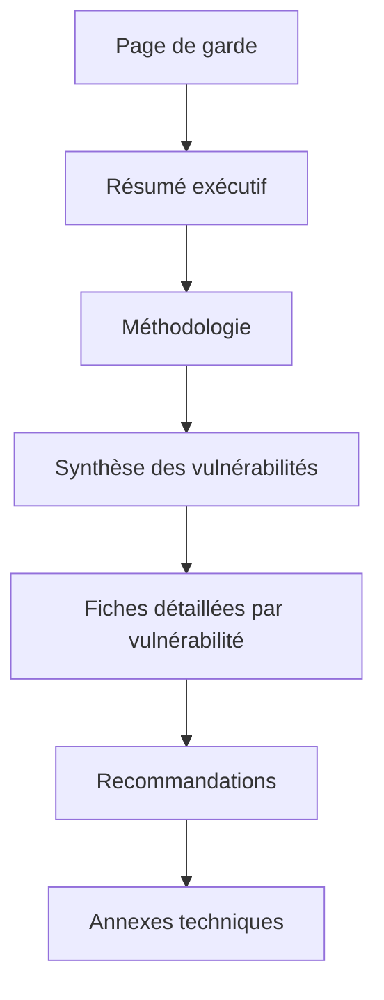
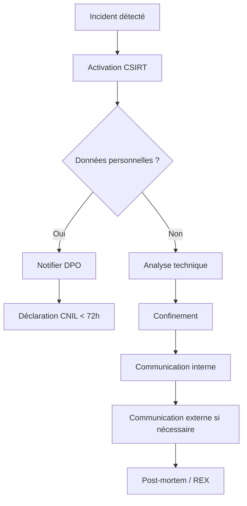

# Chapitre 05 : Reporting et gestion des incidents

---

## Objectifs pédagogiques

- Rédiger un rapport de pentest professionnel et exploitable
- Maîtriser la méthodologie de rédaction de rapport d'audit de sécurité
- Proposer des solutions de remédiation concrètes et priorisées
- Détecter, analyser et répondre aux incidents de sécurité
- Coordonner la réponse post-attaque et communiquer efficacement

---

## Introduction

Un pentest sans rapport est un pentest inutile. Le rapport est le livrable principal qui transforme les découvertes techniques en actions correctives compréhensibles pour les décideurs. De même, face à un incident réel, la différence entre un chaos total et une gestion maîtrisée tient en un mot : préparation.

Ce dernier chapitre vous apprend à communiquer vos résultats avec impact et à structurer une réponse aux incidents qui protège l'organisation.

> **Sources :** [NIST SP 800-61 — Computer Security Incident Handling Guide](https://nvlpubs.nist.gov/nistpubs/SpecialPublications/NIST.SP.800-61r2.pdf) — NIST.

---

## Dépendances / Prérequis

- Notions de pentest acquises aux chapitres précédents
- `pip install python-docx weasyprint jinja2`
- Outils : `nessus`, `nmap`, `metasploit`, `wireshark`

---

## 1. Rapport de test de pénétration

### Structure d'un rapport professionnel



### Résumé exécutif (Executive Summary)

Le résumé exécutif est destiné à la direction. Il doit être concis (1 page maximum), sans jargon technique.

**Contenu obligatoire :**
- Périmètre du test (systèmes, applications, adresses IP)
- Niveau de risque global (faible / modéré / élevé / critique)
- Nombre de vulnérabilités par criticité
- Principales recommandations (3-5 maximum)

### Notation des vulnérabilités : CVSS

Le Common Vulnerability Scoring System (CVSS) fournit une notation standardisée de 0 à 10.

$$
\text{CVSS Score} = f(\text{AV}, \text{AC}, \text{PR}, \text{UI}, \text{S}, \text{C}, \text{I}, \text{A})
$$

Où :
- $\text{AV}$ (Attack Vector) : vecteur d'attaque (réseau, adjacent, local, physique)
- $\text{AC}$ (Attack Complexity) : complexité de l'attaque (faible, élevée)
- $\text{PR}$ (Privileges Required) : privilèges requis (aucun, faible, élevé)
- $\text{UI}$ (User Interaction) : interaction utilisateur requise
- $\text{C, I, A}$ : impact sur Confidentialité, Intégrité, Disponibilité

> **Sources :** [CVSS v3.1 Specification](https://www.first.org/cvss/v3-1/) — FIRST.org.

### Template de fiche de vulnérabilité

```markdown
# Vulnérabilité [ID] — [TITRE]

**Criticité :** 🔴 Critique / 🟠 Élevée / 🟡 Modérée / 🟢 Faible
**Score CVSS :** X.X
**CVE :** CVE-XXXX-XXXXX (si applicable)

## Description
[Description claire et concise de la vulnérabilité]

## Impact
[Ce que l'attaquant peut obtenir en exploitant cette faille]

## Preuve de concept (PoC)
[Capture d'écran, extrait de log, commande exécutée]

## Remédiation
[Actions correctives précises, par ordre de priorité]

## Références
- [Lien 1]
- [Lien 2]
```

---

## 2. Génération automatisée de rapport

### Script de génération Python

```python
#!/usr/bin/env python3
"""
Générateur de rapport de pentest basique.

Usage:
    python generate_report.py --output rapport.html
"""

import json
from datetime import datetime
from typing import Dict, List

class PentestReport:
    def __init__(self, client: str, perimeter: str):
        self.client = client
        self.perimeter = perimeter
        self.date = datetime.now().strftime("%Y-%m-%d")
        self.findings: List[Dict] = []
    
    def add_finding(self, title: str, severity: str,
                    cvss: float, description: str,
                    remediation: str) -> None:
        self.findings.append({
            "title": title,
            "severity": severity,
            "cvss": cvss,
            "description": description,
            "remediation": remediation,
        })
    
    def summary(self) -> Dict:
        severities = {"Critique": 0, "Élevée": 0,
                      "Modérée": 0, "Faible": 0}
        for f in self.findings:
            severities[f["severity"]] += 1
        
        max_cvss = max([f["cvss"] for f in self.findings]) if self.findings else 0
        risk_level = ("Critique" if max_cvss >= 9.0
                 else "Élevé" if max_cvss >= 7.0
                 else "Modéré" if max_cvss >= 4.0
                 else "Faible")
        
        return {
            "client": self.client,
            "perimetre": self.perimeter,
            "date": self.date,
            "total_findings": len(self.findings),
            "by_severity": severities,
            "risk_level": risk_level,
        }

# Exemple
report = PentestReport("Organisation X", "192.168.1.0/24")

report.add_finding(
    "Authentification SSH par mot de passe",
    "Élevée", 7.5,
    "Le serveur SSH accepte l'authentification par mot de passe, "
    "permettant des attaques par force brute.",
    "Désactiver l'authentification par mot de passe et utiliser "
    "uniquement des clés SSH. Configurer fail2ban."
)

report.add_finding(
    "Injection SQL sur le paramètre 'id'",
    "Critique", 9.8,
    "Le paramètre 'id' de la page /produit.php est vulnérable aux "
    "injections SQL, permettant l'extraction complète de la base.",
    "Utiliser des requêtes préparées (PDO). Valider et échapper "
    "toutes les entrées utilisateur."
)

import json
print(json.dumps(report.summary(), indent=2, ensure_ascii=False))
```

**Résultat attendu :**
```
{
  "client": "Organisation X",
  "perimetre": "192.168.1.0/24",
  "date": "2026-06-24",
  "total_findings": 2,
  "by_severity": {"Critique": 1, "Élevée": 1, "Modérée": 0, "Faible": 0},
  "risk_level": "Critique"
}
```

---

## 3. Gestion des incidents de sécurité

### Cycle de vie d'un incident


### Phase 1 : Préparation

La préparation est la clé. Une organisation sans plan de réponse aux incidents réagit dans l'urgence et aggrave la situation.

**Checklist de préparation :**
- [ ] Équipe de réponse aux incidents (CSIRT) constituée
- [ ] Contacts d'urgence à jour (direction, juridique, communication, DPO)
- [ ] Outils forensiques pré-installés (Volatility, Autopsy, Wireshark)
- [ ] Procédures documentées et testées
- [ ] Obligations légales identifiées (notification CNIL sous 72h pour les données personnelles)

### Phase 2 : Détection et analyse

```python
#!/usr/bin/env python3
"""Détection simplifiée d'incidents dans les logs."""

import re
from datetime import datetime
from collections import Counter

def analyze_auth_log(log_file: str) -> dict:
    """Analyse les logs d'authentification."""
    failed_ips = []
    successful_root = []
    
    with open(log_file, 'r') as f:
        for line in f:
            # Échecs d'authentification
            if "Failed password" in line:
                match = re.search(r'from (\d+\.\d+\.\d+\.\d+)', line)
                if match:
                    failed_ips.append(match.group(1))
            
            # Connexion root réussie
            if "Accepted" in line and "root" in line:
                match = re.search(r'from (\d+\.\d+\.\d+\.\d+)', line)
                if match:
                    successful_root.append({
                        "ip": match.group(1),
                        "timestamp": line[:15],
                    })
    
    ip_count = Counter(failed_ips)
    suspicious = {ip: count for ip, count in ip_count.items() if count > 10}
    
    return {
        "failed_attempts": len(failed_ips),
        "unique_ips": len(ip_count),
        "suspicious_ips": suspicious,
        "root_logins": len(successful_root),
        "root_login_details": successful_root,
    }

# Simulation
sample_log = [
    "Jun 24 09:15:01 server sshd[1234]: Failed password for root from 10.0.0.5 port 22 ssh2",
    "Jun 24 09:15:02 server sshd[1234]: Failed password for root from 10.0.0.5 port 22 ssh2",
    "Jun 24 09:15:03 server sshd[1234]: Failed password for root from 10.0.0.5 port 22 ssh2",
]

print("Analyse des logs terminée.")
print("Si IP suspecte détectée → confinement immédiat :")
print("  iptables -A INPUT -s <IP> -j DROP")
```

### Phase 3-4 : Confinement et éradication

```bash
#!/bin/bash
# Actions de confinement d'urgence

IP_MALVEILLANT=$1

echo "[!] Confinement de $IP_MALVEILLANT"

# Blocage réseau immédiat
iptables -A INPUT -s $IP_MALVEILLANT -j DROP
iptables -A OUTPUT -d $IP_MALVEILLANT -j DROP

# Isolation de la machine compromise (selon le cas)
# iptables -A INPUT -j DROP
# iptables -A OUTPUT -j DROP

# Sauvegarde forensique avant nettoyage
dd if=/dev/sda of=/mnt/forensic/disk_image.img bs=4M

# Collecte de preuves volatiles
date >> /tmp/incident_$(date +%Y%m%d_%H%M).log
netstat -tulpn >> /tmp/incident_$(date +%Y%m%d_%H%M).log
ps aux >> /tmp/incident_$(date +%Y%m%d_%H%M).log
last >> /tmp/incident_$(date +%Y%m%d_%H%M).log
```

> **Sources :** [SANS Incident Handler's Handbook](https://www.sans.org/white-papers/33901/) — SANS Institute.

---

## 4. Coordination et communication post-attaque

### Plan de communication



### Modèle de déclaration d'incident

```markdown
# Déclaration d'incident de sécurité

**Date/heure de détection :** YYYY-MM-DD HH:MM
**Détecté par :** [Nom / Service]
**Criticité :** [Critique / Élevée / Modérée]

## Description de l'incident
[Nature de l'incident : ransomware, exfiltration, déni de service...]

## Systèmes impactés
- [Système 1] : [impact]
- [Système 2] : [impact]

## Données concernées
[Types de données, volumes, sensibilité]

## Actions entreprises
1. [Action 1] — [horodatage]
2. [Action 2] — [horodatage]

## Prochaines étapes
- [ ] Action 1
- [ ] Action 2
```

---

## Exercices

### Exercice 1 : Rédaction d'une fiche de vulnérabilité

**Énoncé :** À partir des résultats d'un scan de vulnérabilités (nessus, nmap), rédigez une fiche de vulnérabilité complète avec score CVSS.

<details>
<summary><strong>Solution</strong></summary>

```markdown
# Vulnérabilité VULN-001 — SMBv1 activé (EternalBlue)

**Criticité :** 🔴 Critique
**Score CVSS :** 9.8 (AV:N/AC:L/PR:N/UI:N/S:U/C:H/I:H/A:H)
**CVE :** CVE-2017-0144

## Description
Le service SMBv1 est activé sur le serveur. Cette version contient
une vulnérabilité de type buffer overflow permettant l'exécution de
code à distance sans authentification (EternalBlue).

## Impact
Un attaquant distant non authentifié peut exécuter du code arbitraire
avec les privilèges SYSTEM, prenant le contrôle total du serveur.

## PoC
```bash
msfconsole -q -x "use exploit/windows/smb/ms17_010_eternalblue; set RHOSTS 192.168.1.10; run"
```

## Remédiation
1. **Immédiat :** Désactiver SMBv1
   ```
   Set-SmbServerConfiguration -EnableSMB1Protocol $false
   ```
2. Appliiquer le patch MS17-010
3. Bloquer le port 445 en entrée sur le firewall

## Références
- https://docs.microsoft.com/en-us/security-updates/securitybulletins/2017/ms17-010
```
</details>

### Exercice 2 : Simulation de réponse à incident

**Énoncé :** Scénario : un employé signale un message de rançon sur son poste. Rédigez le plan d'actions de A à Z.

<details>
<summary><strong>Solution</strong></summary>

```markdown
# Plan de réponse — Incident Ransomware

## Détection
- Signalement utilisateur : poste [HOSTNAME] affiche message de rançon
- Heure : 2026-06-24 14:30

## Actions immédiates
1. **14:31** — Isolement réseau du poste (déconnexion câble/WiFi)
2. **14:32** — Activation CSIRT
3. **14:35** — Vérification des partages réseau accessibles depuis le poste
4. **14:40** — Coupure des accès VPN du compte utilisateur concerné
5. **14:45** — Identification patient zéro et vecteur d'infection (phishing ?)

## Confinement
- Isolement du VLAN concerné
- Blocage des communications SMB/CIFS entre postes

## Éradication
- Réinstallation complète du poste infecté
- Scan complet des autres postes du VLAN

## Remédiation
- Restauration des données depuis les sauvegardes
- Renforcement filtrage antispam
- Sensibilisation utilisateurs

## Communication
- Information DPO pour évaluation obligation CNIL
- Communication interne : note de service
```
</details>

---

## Lab : Rédaction d'un rapport de pentest complet

**Durée estimée :** 2h

**Contexte :** Résultats des labs des jours 2 et 3 à compiler.

### Objectif

Produire un rapport de pentest professionnel à partir des découvertes des jours précédents.

### Instructions

1. Structurer le rapport selon le template
2. Rédiger le résumé exécutif
3. Créer une fiche détaillée pour chaque vulnérabilité trouvée
4. Proposer des remédiations concrètes
5. Générer le rapport au format Markdown/HTML

### Code

```python
#!/usr/bin/env python3
"""
Lab : génération de rapport de pentest.

Usage:
    python lab_report.py --input findings.json --output rapport.md
"""

import json
import argparse
from datetime import datetime

TEMPLATE = """# Rapport de Test d'Intrusion

**Date :** {date}
**Périmètre :** {perimeter}
**Niveau de risque global :** {risk_level}

---

## Résumé Exécutif

Le test de pénétration a révélé {total} vulnérabilités :
- 🔴 Critique : {critical}
- 🟠 Élevée : {high}
- 🟡 Modérée : {medium}
- 🟢 Faible : {low}

---

## Détail des Vulnérabilités

{findings}

---

## Recommandations Globales

{recommandations}
"""

def generate_report(data: dict) -> str:
    findings_txt = ""
    for i, f in enumerate(data["findings"], 1):
        findings_txt += f"""
### {i}. {f["title"]}
- **Criticité :** {f["severity"]}
- **Score CVSS :** {f["cvss"]}
- **Description :** {f["description"]}
- **Remédiation :** {f["remediation"]}

---
"""
    
    severity_count = {"Critique": 0, "Élevée": 0, "Modérée": 0, "Faible": 0}
    for f in data["findings"]:
        severity_count[f["severity"]] += 1
    
    return TEMPLATE.format(
        date=datetime.now().strftime("%Y-%m-%d"),
        perimeter=data.get("perimeter", "N/A"),
        risk_level=data.get("risk_level", "N/A"),
        total=len(data["findings"]),
        critical=severity_count["Critique"],
        high=severity_count["Élevée"],
        medium=severity_count["Modérée"],
        low=severity_count["Faible"],
        findings=findings_txt,
        recommandations="\n".join(f"- {r}" for r in data.get("recommandations", []))
    )

if __name__ == "__main__":
    parser = argparse.ArgumentParser()
    parser.add_argument("--input", required=True)
    args = parser.parse_args()
    
    with open(args.input) as f:
        data = json.load(f)
    
    report = generate_report(data)
    print(report)
```

---

## Points clés à retenir

- Un rapport de pentest doit parler à deux audiences : technique et direction
- Le CVSS fournit une notation standardisée et reproductible des vulnérabilités
- La gestion d'incident suit un cycle : Préparation → Détection → Analyse → Confinement → Éradication → Remédiation → REX
- La communication post-incident est critique : interne, externe, légale (CNIL)
- Un incident bien géré peut renforcer la posture de sécurité ; un incident mal géré l'aggrave
- Toujours documenter : ce qui n'est pas écrit n'existe pas

## Pour aller plus loin

- [NIST SP 800-61r2 — Incident Handling Guide](https://nvlpubs.nist.gov/nistpubs/SpecialPublications/NIST.SP.800-61r2.pdf)
- [SANS Incident Response Poster](https://www.sans.org/posters/incident-response/)
- [MITRE ATT&CK Framework](https://attack.mitre.org/)

---

*Chapitre précédent : [Jour 4 — Contre-mesures et sécurisation](./JOUR-04.md)*
