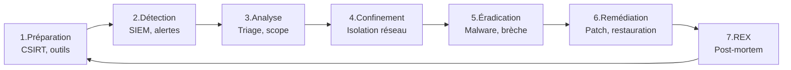

# Chapitre 05 : Reporting et gestion des incidents

---

## Objectifs pédagogiques

- Rédiger un rapport de pentest professionnel tagué ATT&CK
- Maîtriser la notation CVSS v3.1 pour standardiser la criticité
- Détecter, analyser et répondre aux incidents de sécurité
- Reconstruire la kill chain ATT&CK d'un attaquant
- Coordonner la communication post-incident

---

## Introduction

Un pentest sans rapport n'a aucune valeur. Le rapport transforme des découvertes techniques en actions correctives. Face à un incident réel, la différence entre chaos et maîtrise tient dans la préparation.

Ce dernier chapitre boucle la formation : vous saurez communiquer vos résultats, standardiser vos notations (CVSS), et structurer une réponse aux incidents avec ATT&CK.

> **Sources :** [NIST SP 800-61r2](https://nvlpubs.nist.gov/nistpubs/SpecialPublications/NIST.SP.800-61r2.pdf). [CVSS v3.1](https://www.first.org/cvss/v3-1/).

---

## 1. CVSS — Notation standardisée des vulnérabilités

### Comprendre le score CVSS v3.1

Le CVSS attribue un score de 0 à 10 basé sur des métriques mesurables.

```
MÉTRIQUES CVSS v3.1
├── Base Score (obligatoire)
│   ├── AV (Attack Vector)      N:Network  A:Adjacent  L:Local  P:Physical
│   ├── AC (Attack Complexity)  L:Low  H:High
│   ├── PR (Privileges Required) N:None  L:Low  H:High
│   ├── UI (User Interaction)   N:None  R:Required
│   ├── S  (Scope)              U:Unchanged  C:Changed
│   ├── C (Confidentiality)     N:None  L:Low  H:High
│   ├── I (Integrity)           N:None  L:Low  H:High
│   └── A (Availability)        N:None  L:Low  H:High
├── Temporal (optionnel): E (Exploit Maturity), RL (Remediation)
└── Environmental (optionnel): CR, IR, AR (requirements)
```

Seuils de criticité :

| Score | Niveau |
|---|---|
| 9.0 - 10.0 | CRITIQUE |
| 7.0 - 8.9 | ÉLEVÉE |
| 4.0 - 6.9 | MODÉRÉE |
| 0.1 - 3.9 | FAIBLE |

> **Sources :** [CVSS v3.1 Calculator](https://www.first.org/cvss/calculator/3.1) — FIRST.org.

### Exemples de notation

```python
class CVSS:
    def __init__(self, vector: str):
        self.m = dict(m.split(":") for m in vector.split("/"))

    def severity(self):
        impact_map = {"N": 0.0, "L": 0.22, "H": 0.56}
        impact = sum(impact_map.get(self.m.get(m, "N"), 0) for m in "CIA")
        av_map = {"N": 0.85, "A": 0.62, "L": 0.55, "P": 0.2}
        exploit = av_map.get(self.m.get("AV", "N"), 0)
        ac = 0.77 if self.m.get("AC") == "L" else 0.44
        pr = 0.85 if self.m.get("PR") == "N" else 0.62
        score = min(10.0, (exploit * ac * pr + impact) * 1.2)
        if score >= 9.0: return score, "CRITIQUE"
        elif score >= 7.0: return score, "ELEVEE"
        elif score >= 4.0: return score, "MODEREE"
        else: return score, "FAIBLE"

# SQLi critique
sqli = CVSS("AV:N/AC:L/PR:N/UI:N/S:U/C:H/I:H/A:H")
print(f"SQLi: CVSS {sqli.severity()[0]:.1f} ({sqli.severity()[1]})")
# → CVSS 9.8 (CRITIQUE)

# XSS reflété
xss = CVSS("AV:N/AC:L/PR:N/UI:R/S:U/C:L/I:L/A:N")
print(f"XSS: CVSS {xss.severity()[0]:.1f} ({xss.severity()[1]})")
# → CVSS 5.4 (MODEREE)
```

### Template fiche de vulnérabilité

```markdown
# VULN-001 — Injection SQL sur paramètre 'id'

| Propriété | Valeur |
|---|---|
| **Criticité** | CRITIQUE |
| **Score CVSS** | 9.8 (AV:N/AC:L/PR:N/UI:N/S:U/C:H/I:H/A:H) |
| **Technique ATT&CK** | T1190 Exploit Public-Facing Application |
| **Tactique** | TA0001 Initial Access |

## Description
Le paramètre GET "id" est injecté directement dans une requête SQL.

## Impact (CIA)
- Confidentialité : HIGH (extraction BDD complète)
- Intégrité : HIGH (modification/suppression)
- Disponibilité : HIGH (DoS possible)

## Remédiation
1. Requêtes préparées PDO → M1013 App Hardening
2. Déploiement WAF → M1041 Encrypt/Protect Info
3. Validation des entrées → M1054 Input Validation

## Références
- OWASP SQLi Prevention
- ATT&CK T1190
```

---

## 2. Gestion des incidents — Cycle complet



---

## Lab 5.1 — Investigation forensique

### Fiche de lab

| Propriété | Valeur |
|---|---|
| **Durée** | 1h30 |
| **Conteneur** | `forensic-victim` (port 8082) |
| **Dossier de travail** | `~/cours-hacking/jour-5/labs/` |
| **Objectif** | Analyser une machine compromise, collecter des preuves, reconstruire la kill chain |

### Prérequis avant de commencer

- [x] Conteneur buildé : `docker compose -f ~/cours-hacking/repo/docker-compose.yml up -d --build forensic-victim`
- [x] Web app accessible : `curl -I http://localhost:8082/`
- [x] Terminal dans `~/cours-hacking/jour-5/labs/` : `mkdir -p ~/cours-hacking/jour-5/labs && cd ~/cours-hacking/jour-5/labs`

### Contexte

Le conteneur `forensic-victim` simule un serveur web compromis. Un attaquant a exploité une injection de commandes sur la page de dashboard pour prendre le contrôle du serveur. Votre mission : analyser la scène de crime.

### Étape 1 — Découverte du point d'entrée

```bash
cd ~/cours-hacking/jour-5/labs

curl "http://localhost:8082/"
# → Internal Dashboard — page de diagnostic

# Test de la vulnérabilité de command injection
curl "http://localhost:8082/?cmd=whoami"
# → uid=33(www-data)...
```

**Checkpoint A :** Command injection confirmée — retour `www-data`.

### Étape 2 — Collecte de preuves volatiles

```bash
docker exec forensic-victim bash -c "
mkdir -p /tmp/evidence
ss -tulpn > /tmp/evidence/network.txt
ps auxww > /tmp/evidence/processes.txt
find /var/www -type f -mtime -30 > /tmp/evidence/web_files.txt
cat /etc/passwd > /tmp/evidence/passwd.txt
cat /etc/sudoers > /tmp/evidence/sudoers.txt
echo 'Evidence collected'
ls -la /tmp/evidence/
"
```

**Checkpoint B :** 5 fichiers de preuves créés dans `/tmp/evidence/`.

### Étape 3 — Recherche de signes de compromission

```bash
# Chercher des backdoors web (eval, system, exec)
docker exec forensic-victim grep -r "eval\|system\|exec\|passthru" /var/www/html/ 2>/dev/null

# Chercher des connexions suspectes dans les logs Apache
docker exec forensic-victim cat /var/log/apache2/access.log 2>/dev/null | grep "cmd=" | tail -20

# Vérifier les comptes récemment modifiés
docker exec forensic-victim tail -5 /etc/passwd
```

### Étape 4 — Reconstruction de la kill chain ATT&CK

À partir des preuves collectées, remplissez ce tableau :

| Horodatage | Tactic | Technique | Preuve |
|---|---|---|---|
| | TA0001 Initial Access | T1190 Exploit Public-Facing App | GET /?cmd=whoami dans access.log |
| | TA0002 Execution | T1059.004 Unix Shell | Commande system() dans index.php |
| | TA0003 Persistence | T1505.003 Web Shell | Code eval() trouvé dans PHP |
| | TA0004 PrivEsc | T1548.001 Sudo Caching | www-data ALL dans sudoers |

### Étape 5 — Rédaction du rapport d'incident

Créez `~/cours-hacking/jour-5/labs/incident_report.md` :

```markdown
# Rapport d'incident IR-2026-001

**Date détection :** ...
**Criticité :** CRITIQUE
**Système :** forensic-victim (serveur web)

## Kill Chain ATT&CK

1. TA0001 — T1190 : Command injection via ?cmd=
2. TA0002 — T1059.004 : Exécution commandes arbitraires
3. TA0003 — T1505.003 : Backdoor PHP déposée
4. TA0004 — T1548.001 : www-data ajouté aux sudoers

## Impact CIA
- Confidentialité : HIGH
- Intégrité : HIGH
- Disponibilité : LOW

## Actions entreprises
1. Confinement : isolation réseau
2. Collecte preuves volatiles
3. Éradication backdoor
4. Correction command injection

## Recommandations
- Remplacer system() par escapeshellcmd()
- Déployer WAF
- Restreindre sudoers
```

### Checkpoints

- [ ] Command injection fonctionnelle sur forensic-victim
- [ ] 5 fichiers de preuves volatiles collectés
- [ ] Backdoor PHP identifiée
- [ ] Kill chain ATT&CK documentée (4 étapes)
- [ ] Rapport d'incident rédigé

---

## 3. Génération automatisée de rapport

Créez `~/cours-hacking/jour-5/labs/generate_report.py` :

```python
#!/usr/bin/env python3
"""Générateur de rapport de pentest avec mapping ATT&CK."""
import json, argparse
from datetime import datetime

TEMPLATE = """# Rapport de Test d'Intrusion

**Date :** {date}
**Périmètre :** {perimeter}
**Risque global :** {risk}

## Résumé

| Criticité | Nombre |
|---|---|
| Critique | {critical} |
| Élevée | {high} |
| Modérée | {medium} |
| Faible | {low} |

## Vulnérabilités
{findings}

## Recommandations
{recos}
"""

def generate(data, output):
    sev = {"CRITIQUE": 0, "ÉLEVÉE": 0, "MODÉRÉE": 0, "FAIBLE": 0}
    findings_md = ""
    for i, f in enumerate(data["findings"], 1):
        sev[f["severity"]] += 1
        findings_md += f"""
### VULN-{i:03d} — {f['title']}
- Criticité : {f['severity']}
- CVSS : {f.get('cvss', 'N/A')}
- ATT&CK : {f.get('attack', 'N/A')}
- Description : {f.get('desc', 'N/A')}
- Remédiation : {f.get('fix', 'N/A')}
"""
    risk = "CRITIQUE" if sev["CRITIQUE"] > 0 else "ÉLEVÉ" if sev["ÉLEVÉE"] > 0 else "MODÉRÉ"
    report = TEMPLATE.format(
        date=datetime.now().strftime("%Y-%m-%d"),
        perimeter=data.get("perimeter", "N/A"),
        risk=risk, **sev, findings=findings_md,
        recos="\n".join(f"- {r}" for r in data.get("recos", [])))
    with open(output, "w") as f:
        f.write(report)
    print(f"Rapport généré : {output}")

if __name__ == "__main__":
    p = argparse.ArgumentParser()
    p.add_argument("--input", required=True)
    p.add_argument("--output", default="rapport.md")
    args = p.parse_args()
    with open(args.input) as f:
        generate(json.load(f), args.output)
```

```bash
# Exemple d'utilisation
cd ~/cours-hacking/jour-5/labs

cat > findings.json << 'EOF'
{
  "perimeter": "192.168.1.0/24",
  "findings": [
    {"title":"SQLi sur param id","severity":"CRITIQUE","cvss":"9.8",
     "attack":"T1190","desc":"Injection SQL non filtrée...","fix":"Requêtes préparées PDO"},
    {"title":"XSS reflété","severity":"MODÉRÉE","cvss":"5.4",
     "attack":"T1189","desc":"Reflet JS non échappé...","fix":"htmlspecialchars() + CSP"}
  ],
  "recos": ["Déployer WAF ModSecurity", "Formation OWASP Top 10", "Audit de code trimestriel"]
}
EOF

python3 generate_report.py --input findings.json --output rapport_final.md
```

---

## Exercices

### Exercice 1 : Calculer un CVSS

**Énoncé :** Calculez le CVSS d'un XSS stocké exploitable sans interaction (admin visualise automatiquement). AV:N, AC:L, PR:N, UI:N, S:U, C:H, I:H, A:L.

<details>
<summary><strong>Solution</strong></summary>

Vecteur : `AV:N/AC:L/PR:N/UI:N/S:U/C:H/I:H/A:L`

Score : ~8.3 (ÉLEVÉ). Pas CRITIQUE car A:L (disponibilité faible). Technique ATT&CK : T1189.
</details>

### Exercice 2 : Reconstruire une kill chain

**Énoncé :** Un analyste reçoit : 08:00 alerte WAF (SQLi bloquée), 08:05 scan de ports, 08:15 reverse shell sur SRV-WEB01. Reconstruisez l'ordre chronologique réel.

<details>
<summary><strong>Solution</strong></summary>

1. 07:55 — TA0007 Discovery : T1046 Network Scan
2. 07:58 — TA0001 Initial Access : T1190 SQLi (tentative 1 bloquée)
3. 08:00 — TA0001 Initial Access : T1190 SQLi (tentative 2 réussie via autre paramètre)
4. 08:15 — TA0002 Execution : T1059.004 Unix Shell

Leçon : le WAF a bloqué une tentative mais pas l'autre. Les alertes arrivent dans le désordre.
</details>

---

## Points clés à retenir

- Un rapport parle à 2 audiences : direction (résumé exécutif) et technique (fiches détaillées)
- Le CVSS standardise la criticité : reproductible, universel
- Chaque vulnérabilité doit être taguée ATT&CK (Txxxx)
- La gestion d'incident suit un cycle en 7 phases
- Reconstruire la kill chain de l'attaquant guide la remédiation

## Pour aller plus loin

- [NIST SP 800-61r2](https://nvlpubs.nist.gov/nistpubs/SpecialPublications/NIST.SP.800-61r2.pdf)
- [FIRST CVSS Calculator](https://www.first.org/cvss/calculator/3.1)
- [MITRE ATT&CK Navigator](https://mitre-attack.github.io/attack-navigator/)

---

*Chapitre précédent : [Jour 4](./JOUR-04.md)*
*Formation terminée — Remise du rapport final*
