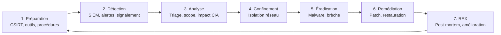
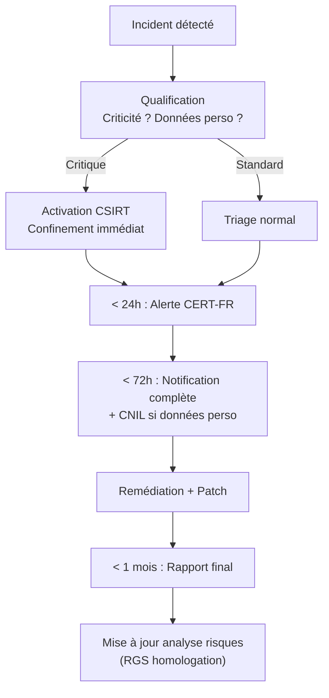

# Chapitre 05 : Reporting, gestion des incidents et conformité

---

## Objectifs pédagogiques

- Rédiger un rapport de pentest professionnel tagué ATT&CK
- Maîtriser la notation CVSS v3.1 pour standardiser la criticité
- Détecter, analyser et répondre aux incidents de sécurité
- Reconstruire la kill chain ATT&CK d'un attaquant
- Connaître les obligations réglementaires : NIS2, RGPD, RGS

---

## Introduction

Un pentest sans rapport n'a aucune valeur juridique. Le rapport est le **livrable réglementaire** qui conditionne l'homologation (RGS) et prouve la conformité (NIS2). Face à un incident, les délais de notification sont contraignants : 24h pour l'alerte, 72h pour le rapport complet.

Ce chapitre vous donne les outils pour communiquer vos résultats avec impact et structurer une réponse aux incidents conforme aux exigences européennes et françaises.

> **Sources :** [NIST SP 800-61r2](https://nvlpubs.nist.gov/nistpubs/SpecialPublications/NIST.SP.800-61r2.pdf). [CVSS v3.1](https://www.first.org/cvss/v3-1/). [NIS2 Directive 2022/2555](https://eur-lex.europa.eu/eli/dir/2022/2555).

---

## 1. CVSS — Notation standardisée des vulnérabilités

### Le score en bref

CVSS v3.1 attribue un score de 0 à 10 basé sur 8 métriques de base.

```
MÉTRIQUES DE BASE CVSS v3.1
├── AV (Attack Vector)      N:Network  A:Adjacent  L:Local  P:Physical
├── AC (Attack Complexity)  L:Low  H:High
├── PR (Privileges Required) N:None  L:Low  H:High
├── UI (User Interaction)   N:None  R:Required
├── S  (Scope)              U:Unchanged  C:Changed
├── C (Confidentiality)     N:None  L:Low  H:High
├── I (Integrity)           N:None  L:Low  H:High
└── A (Availability)        N:None  L:Low  H:High
```

| Score | Niveau |
|---|---|
| 9.0 - 10.0 | 🔴 CRITIQUE |
| 7.0 - 8.9 | 🟠 ÉLEVÉE |
| 4.0 - 6.9 | 🟡 MODÉRÉE |
| 0.1 - 3.9 | 🟢 FAIBLE |

> **Sources :** [CVSS v3.1 Calculator](https://www.first.org/cvss/calculator/3.1) — FIRST.org.

### Exemples

```python
class CVSS:
    def __init__(self, vector: str):
        self.m = dict(m.split(":") for m in vector.split("/"))
    def severity(self):
        imp = {"N":0.0,"L":0.22,"H":0.56}
        impact = sum(imp.get(self.m.get(m,"N"),0) for m in "CIA")
        av = {"N":0.85,"A":0.62,"L":0.55,"P":0.2}
        exploit = av.get(self.m.get("AV","N"),0)
        ac = 0.77 if self.m.get("AC")=="L" else 0.44
        pr = 0.85 if self.m.get("PR")=="N" else 0.62
        s = min(10.0, (exploit*ac*pr+impact)*1.2)
        if s>=9.0: return s,"CRITIQUE"
        elif s>=7.0: return s,"ELEVEE"
        elif s>=4.0: return s,"MODEREE"
        else: return s,"FAIBLE"

sqli = CVSS("AV:N/AC:L/PR:N/UI:N/S:U/C:H/I:H/A:H")
print(f"SQLi: CVSS {sqli.severity()}")  # → CVSS 9.8 (CRITIQUE)

xss = CVSS("AV:N/AC:L/PR:N/UI:R/S:U/C:L/I:L/A:N")
print(f"XSS:  CVSS {xss.severity()}")  # → CVSS 5.4 (MODEREE)
```

### Template fiche de vulnérabilité (format livrable client)

```markdown
# VULN-001 — Injection SQL sur paramètre 'id'

| Propriété | Valeur |
|---|---|
| Criticité | 🔴 CRITIQUE |
| Score CVSS | 9.8 (AV:N/AC:L/PR:N/UI:N/S:U/C:H/I:H/A:H) |
| Technique ATT&CK | T1190 Exploit Public-Facing Application |
| Tactique | TA0001 Initial Access |

## Description technique
La requête construite par concaténation String inclut l'entrée utilisateur sans
validation. Un attaquant non authentifié peut exécuter des requêtes arbitraires.

## Impact CIA
- Confidentialité : HIGH (extraction complète de la BDD)
- Intégrité : HIGH (modification/suppression d'enregistrements)
- Disponibilité : HIGH (DROP TABLE possible)

## Preuve de concept
GET /produits.php?id=1' UNION SELECT user,password FROM users--

## Remédiation
1. Requêtes préparées PDO → M1013
2. Déploiement WAF → M1041
3. Validation stricte des entrées → M1054
```

---

## 2. Gestion des incidents — Cycle complet



### Calendrier NIS2 — Obligations de notification

```
Détection de l'incident
│
├── 24h → Alerte précoce au CSIRT national (CERT-FR)
│         Nature de l'incident, impact estimé, mesures immédiates
│
├── 72h → Notification complète
│         Évaluation détaillée, indicateurs de compromission (IOC)
│
└── 1 mois → Rapport final
            Causes, remédiation, mesures correctives, REX
```

**Double obligation :** si l'incident implique des données personnelles, notification CNIL sous 72h (RGPD art.33) en parallèle du CERT-FR.

---

## Lab 5.1 — Investigation forensique

### 📋 Fiche

| Durée | Conteneur | Dossier |
|---|---|---|
| 1h30 | forensic-victim (port 8082) | `~/cours-hacking/jour-5/labs/` |

### Contexte métier

Un serveur web vient d'être compromis. En tant que RSSI, vous devez analyser la scène de crime, collecter les preuves (qui seront transmises au CERT-FR), reconstruire la kill chain de l'attaquant, et rédiger le rapport d'incident dans les 72h.

### Prérequis

```bash
docker compose up -d --build forensic-victim
curl -I http://localhost:8082/
mkdir -p ~/cours-hacking/jour-5/labs && cd ~/cours-hacking/jour-5/labs
```

### Étape 1 — Découverte du point d'entrée

```bash
curl http://localhost:8082/
# → Internal Dashboard

curl "http://localhost:8082/?cmd=whoami"
# → uid=33(www-data)...

curl "http://localhost:8082/?cmd=id"
# → uid=33(www-data) gid=33(www-data)
```

**Checkpoint A :** Command injection confirmée → T1190.

### Étape 2 — Collecte des preuves volatiles (avant toute modification)

```bash
docker exec forensic-victim bash -c "
mkdir -p /tmp/evidence
ss -tulpn > /tmp/evidence/network.txt
ps auxww > /tmp/evidence/processes.txt
find /var/www -type f -mtime -30 > /tmp/evidence/web_files.txt
cat /etc/passwd > /tmp/evidence/passwd.txt
cat /etc/sudoers > /tmp/evidence/sudoers.txt
echo 'Evidence collected' && ls -la /tmp/evidence/
"
```

**Checkpoint B :** 5 fichiers de preuves collectés.

### Étape 3 — Recherche des signes de compromission

```bash
# Backdoors web (eval, system, exec)
docker exec forensic-victim grep -rn "eval\|system\|exec\|passthru" /var/www/html/

# Logs Apache avec commandes injectées
docker exec forensic-victim cat /var/log/apache2/access.log | grep "cmd=" | tail -20

# Comptes modifiés récemment
docker exec forensic-victim tail -5 /etc/passwd

# Sudoers anormal (www-data a tous les droits)
docker exec forensic-victim grep www-data /etc/sudoers
# → www-data ALL=(ALL) NOPASSWD: ALL  ← Compromission TA0004
```

### Étape 4 — Reconstruction kill chain ATT&CK

| Heure estimée | Tactic | Technique | Preuve |
|---|---|---|---|
| | TA0001 Initial Access | T1190 Exploit Public-Facing | GET /?cmd=whoami |
| | TA0002 Execution | T1059.004 Unix Shell | Commande system() |
| | TA0003 Persistence | T1505.003 Web Shell | eval() dans PHP |
| | TA0004 PrivEsc | T1548.001 Sudo Caching | www-data ALL |

### Étape 5 — Rapport d'incident (conforme NIS2)

Créez `~/cours-hacking/jour-5/labs/incident_report.md` :

```markdown
# Rapport d'incident IR-2026-001

**Date/heure détection :** ...
**Date/heure compromission estimée :** ...
**Délai notification CERT-FR :** < 24h ✓ | < 72h ✓
**Criticité :** 🔴 CRITIQUE
**Système :** forensic-victim (serveur web production)

## Kill Chain ATT&CK
| Phase | Tactic | Technique | Impact |
|---|---|---|---|
| 1 | TA0001 Initial Access | T1190 | Command injection |
| 2 | TA0002 Execution | T1059.004 | Shell www-data |
| 3 | TA0003 Persistence | T1505.003 | Backdoor PHP |
| 4 | TA0004 PrivEsc | T1548.001 | www-data → ALL sudoers |

## Impact CIA
- C : HIGH (accès complet au serveur)
- I : HIGH (backdoor installée)
- A : LOW (service toujours accessible)

## Actions entreprises
1. [HH:MM] Confinement : isolation réseau
2. [HH:MM] Collecte preuves volatiles (network, processes, logs, sudoers)
3. [HH:MM] Éradication : suppression backdoor PHP
4. [HH:MM] Remédiation : correction command injection

## Obligations réglementaires
- [✓] Notification CERT-FR < 72h
- [✓] Notification CNIL < 72h (si données personnelles)
- [ ] Rapport final < 1 mois (NIS2 art.23)
- [ ] Mise à jour analyse de risques (RGS)
```

---

## 3. Conformité réglementaire — Cadre européen et français

Cette section résume les obligations qui s'appliquent au Ministère de la Justice et à toute administration française.

### Tableau des normes applicables

| Norme | Origine | Exigence clé | Applicable à | Sanction |
|---|---|---|---|---|
| **NIS2** | UE (Dir. 2022/2555) | Mesures de gestion des risques, notification incidents 24h/72h, responsabilité des dirigeants | 18 secteurs critiques dont administrations publiques | Jusqu'à 10M€ / 2% CA |
| **RGS v2.0** | France (ANSSI) | Analyse de risques, homologation, solutions qualifiées | Toute autorité administrative | Blocage administratif |
| **RGPD** | UE (Règl. 2016/679) | Protection données personnelles, notification violations 72h | Toute entité traitant des données | Jusqu'à 20M€ / 4% CA |
| **LPM 2024-2030** | France | Renforcement capacités cyber, SOC interministériels | OIV, administrations | Budget |
| **Directive Résilience** | UE (Dir. 2022/2557) | Résilience des infrastructures critiques | Entités critiques | Harmonisation |

### Comment cette formation répond aux exigences

| Exigence réglementaire | Jour concerné | Contenu |
|---|---|---|
| Tests de pénétration (NIS2 art.21) | J2, J3 | Méthodologies PTES/OWASP, exploitation, BOF, évasion |
| Gestion des vulnérabilités (NIS2) | J1, J2, J3 | XSS, SQLi, CSRF, CMDi, vsftpd, Samba |
| Mesures de protection (NIS2/RGS) | J4 | Chiffrement, WAF, IDS/IPS, hardening, ASLR |
| Analyse de risques (RGS) | J4 | Triangle CIA, matrice de couverture défensive |
| Rapport d'audit (RGS homologation) | J5 | Rapport pentest tagué CVSS + ATT&CK |
| Signalement incidents (NIS2 art.23) | J5 | Cycle incident, notification 24h/72h |
| Sensibilisation/formation (NIS2) | Tous | Chaque chapitre contribue à la cyber-hygiène |

### Procédure type — De la détection à la remédiation



### Références officielles

- NIS2 : https://eur-lex.europa.eu/eli/dir/2022/2555
- RGS v2.0 : https://www.ssi.gouv.fr/rgs
- RGPD : https://www.cnil.fr/fr/reglement-europeen-protection-donnees
- ANSSI 10 règles d'or : https://cyber.gouv.fr/securisation/10-regles-or-securite-numerique/
- CERT-FR : https://www.cert.ssi.gouv.fr/
- Guide ANSSI communication de crise : https://messervices.cyber.gouv.fr/

---

## Lab 5.2 — Génération automatisée de rapport

### 📋 Fiche

| Durée | Dossier | Output |
|---|---|---|
| 30 min | `~/cours-hacking/jour-5/labs/` | `rapport_final.md` |

Créez `~/cours-hacking/jour-5/labs/generate_report.py` :

```python
#!/usr/bin/env python3
"""Générateur de rapport de pentest avec CVSS + ATT&CK."""
import json, argparse
from datetime import datetime

T = """# Rapport de Test d'Intrusion
**Date :** {date} | **Risque :** {risk}

## Résumé
| Criticité | Nombre |
|---|---|
| 🔴 Critique | {c} | 🟠 Élevée | {h} | 🟡 Modérée | {m} | 🟢 Faible | {l} |

## Vulnérabilités
{findings}
## Recommandations
{recos}
"""

def gen(data, out):
    sev = {"CRITIQUE":0,"ELEVEE":0,"MODEREE":0,"FAIBLE":0}
    f = ""
    for i, v in enumerate(data["findings"], 1):
        sev[v["severity"]] += 1
        f += f"""
### VULN-{i:03d} — {v['title']}
- Criticité : {v['severity']} | CVSS : {v.get('cvss','N/A')}
- ATT&CK : {v.get('attack','N/A')}
- {v.get('desc','')}
- Remédiation : {v.get('fix','')}
"""
    risk = "CRITIQUE" if sev["CRITIQUE"]>0 else "ÉLEVÉ" if sev["ELEVEE"]>0 else "MODÉRÉ"
    with open(out,"w") as fh: fh.write(T.format(
        date=datetime.now().strftime("%Y-%m-%d"), risk=risk,
        c=sev["CRITIQUE"], h=sev["ELEVEE"], m=sev["MODEREE"], l=sev["FAIBLE"],
        findings=f, recos="\n".join(f"- {r}" for r in data.get("recos",[]))))
    print(f"✓ {out}")

if __name__ == "__main__":
    p = argparse.ArgumentParser()
    p.add_argument("--input", required=True)
    p.add_argument("--output", default="rapport_final.md")
    a = p.parse_args()
    with open(a.input) as fh: gen(json.load(fh), a.output)
```

```bash
cd ~/cours-hacking/jour-5/labs

cat > findings.json << 'EOF'
{"perimeter":"Conteneurs Docker — formation","findings":[
  {"title":"SQLi DVWA","severity":"CRITIQUE","cvss":"9.8",
   "attack":"T1190","desc":"Injection SQL non filtrée","fix":"PDO + WAF"},
  {"title":"XSS DVWA","severity":"MODEREE","cvss":"5.4",
   "attack":"T1189","desc":"Reflet JS non échappé","fix":"htmlspecialchars() + CSP"},
  {"title":"vsftpd 2.3.4","severity":"CRITIQUE","cvss":"9.8",
   "attack":"T1190","desc":"Backdoor supply chain","fix":"Mise à jour vsftpd"},
  {"title":"Samba 3.0.20","severity":"CRITIQUE","cvss":"9.8",
   "attack":"T1210","desc":"RCE via usermap","fix":"Mise à jour Samba"}
],"recos":["WAF ModSecurity","Patch management","Formation OWASP","Pentest trimestriel"]}
EOF

python3 generate_report.py --input findings.json
cat rapport_final.md
```

---

## Exercices

### Exercice 1 : Calcul CVSS XSS stocké

**Énoncé :** XSS stocké : AV:N, AC:L, PR:N, UI:N (admin visualise auto), S:U, C:H, I:H, A:L. Score ?

<details><summary><strong>Solution</strong></summary>
Vecteur : `AV:N/AC:L/PR:N/UI:N/S:U/C:H/I:H/A:L` → ~8.3 (ÉLEVÉ). Pas CRITIQUE car A:L.
ATT&CK : T1189.
</details>

### Exercice 2 : Reconstruire une chronologie

**Énoncé :** Alertes SOC : 08:00 WAF bloque SQLi, 08:05 scan ports, 08:15 reverse shell. Reconstruisez l'ordre réel et les techniques ATT&CK.

<details><summary><strong>Solution</strong></summary>
07:55 — T1046 (scan ports)
07:58 — T1190 (SQLi tentative 1, bloquée)
08:00 — T1190 (SQLi tentative 2, réussie via autre paramètre)
08:15 — T1059.004 (reverse shell)

Leçon : le WAF bloque une signature mais pas l'autre. La défense en profondeur est indispensable.
</details>

### Exercice 3 : Notification NIS2

**Énoncé :** Un incident critique est détecté à 14:00. Il implique des données personnelles. Quels sont les délais et à qui notifier ?

<details><summary><strong>Solution</strong></summary>
- **Avant 14:00 le lendemain** : alerte CERT-FR (NIS2, < 24h)
- **Avant 14:00 dans 3 jours** : notification complète CERT-FR (NIS2, < 72h) + notification CNIL (RGPD, < 72h)
- **Avant 1 mois** : rapport final détaillé (NIS2)
</details>

---

## Points clés à retenir

- **CVSS** standardise la criticité (0-10). Une SQLi non filtrée = CVSS 9.8 (CRITIQUE)
- **Chaque vulnérabilité** doit être taguée ATT&CK (Txxxx) dans le rapport
- **NIS2** impose 24h pour l'alerte, 72h pour la notification complète
- **Double obligation** : CERT-FR (NIS2) + CNIL (RGPD) si données personnelles
- **Reconstruire la kill chain** de l'attaquant guide la remédiation
- Le rapport de pentest est un **livrable réglementaire** (homologation RGS)

## Pour aller plus loin

- [CVSS v3.1 Calculator](https://www.first.org/cvss/calculator/3.1)
- [NIS2 Directive 2022/2555](https://eur-lex.europa.eu/eli/dir/2022/2555)
- [CERT-FR — Déclarer un incident](https://www.cert.ssi.gouv.fr/)
- [CNIL — Notifier une violation](https://www.cnil.fr/fr/notifier-une-violation-de-donnees-personnelles)
- [MITRE ATT&CK Navigator](https://mitre-attack.github.io/attack-navigator/)

---

*Formation terminée — Remise du rapport final*
*Chapitre précédent : [Jour 4](./JOUR-04.md)*
*Recherches : [Normes France/Europe](../search/normes-france-europe.md)*
